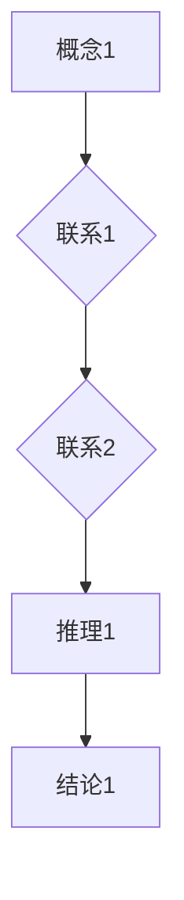

                 

### 文章标题：思维链在考古学中的应用：AI辅助文物分析与修复

#### 关键词：思维链、考古学、AI、文物分析、文物修复

#### 摘要：
本文深入探讨了思维链在考古学中的应用，尤其是如何利用人工智能（AI）技术辅助文物分析与修复。通过介绍思维链的基本原理和其在考古学中的重要性，文章分析了AI技术在考古学中的应用现状与挑战，并详细阐述了思维链与AI技术相结合的方法与优势。本文还包括了AI辅助文物分析技术、AI辅助文物修复技术的详细介绍，以及实际应用案例。最后，文章对未来思维链与AI在考古学领域的发展前景进行了展望，并提出了潜在的挑战与解决思路。

---

## 第1章 引言

### 1.1 考古学的研究背景

考古学是研究人类历史和文化的重要学科，通过挖掘、分析和解读古代遗迹、文物等，揭示人类社会的发展历程、文化传承和创新。考古学不仅对历史学、人类学、社会学等多个学科具有重要的贡献，也对现代社会的文化认同、经济发展和环境保护产生深远影响。

考古学的研究范围涵盖了从史前时代到现代的各种遗迹和文物，包括遗址、墓葬、建筑、艺术品、文献等。考古学的研究方法主要包括田野调查、挖掘、测绘、记录、分析、解读等。这些方法需要大量的时间和人力投入，且往往具有很高的不确定性和风险。

### 1.2 AI在考古学中的应用前景

随着人工智能技术的飞速发展，AI在考古学中的应用潜力逐渐显现。AI技术可以通过图像识别、数据挖掘、机器学习等手段，辅助考古学家更高效地进行文物分析、修复和遗址解读。

首先，图像识别技术可以用于考古遗址的3D建模和可视化，帮助考古学家快速定位和识别重要的文物和遗址。其次，数据挖掘技术可以从大量的考古数据中提取有用的信息，支持考古学的理论研究和假设验证。此外，机器学习技术可以用于文物修复的预测和优化，提高修复的质量和效率。

总的来说，AI技术为考古学提供了全新的研究工具和方法，有助于解决考古学中的许多难题，推动考古学的发展。

### 1.3 思维链的概念及其重要性

思维链是一种基于逻辑推理和信息整合的思考模式，它通过将一系列相关概念、问题和解决方案有机地连接起来，形成一个有序的思维网络。思维链的核心思想是“联系”，即通过发现和建立概念之间的联系，实现知识的深入理解和创新。

在考古学中，思维链的重要性体现在以下几个方面：

1. **整合多学科知识**：考古学是一个多学科交叉的领域，思维链可以帮助考古学家整合来自不同学科的知识，形成更加全面和深入的研究视角。

2. **支持复杂推理**：考古学中的许多问题往往复杂且具有不确定性，思维链可以帮助考古学家通过逻辑推理，逐步揭示问题的本质和解决方案。

3. **促进创新思维**：思维链鼓励考古学家跳出传统的思维框架，通过发现新的联系和视角，推动考古学研究的创新。

4. **提高研究效率**：思维链可以帮助考古学家更快地理解和解决问题，从而提高研究效率。

总的来说，思维链为考古学研究提供了一种强有力的工具，有助于解决考古学中的复杂问题，推动考古学的发展。

---

## 第2章 思维链的基本原理

### 2.1 思维链的定义与特性

思维链（Cognitive Chain）是一种基于逻辑推理和信息整合的思考模式，通过将一系列相关概念、问题和解决方案有机地连接起来，形成一个有序的思维网络。思维链的定义可以概括为：

- **概念**：思维链中的基本元素，是思维过程中的关键点和出发点。
- **联系**：概念之间的相互关系，包括因果关系、并列关系、递进关系等。
- **推理**：基于概念之间的联系，通过逻辑推理形成新的结论或解决方案。

思维链的特性包括：

1. **有序性**：思维链中的概念和联系是有序排列的，这种有序性有助于思维的逻辑性和系统性。
2. **动态性**：思维链不是一成不变的，而是可以根据新的信息和观点进行调整和扩展。
3. **整合性**：思维链能够整合来自不同领域和学科的知识，形成综合性思维。

### 2.2 思维链的结构与功能

思维链的结构可以看作是一个多层次的网络模型，包括以下几个层次：

1. **基础层次**：包括核心概念和基本原理，是思维链的基础和出发点。
2. **中间层次**：包括概念之间的联系和关系，这些联系构成了思维链的骨架。
3. **高级层次**：包括基于基础层次和中间层次的推理过程和解决方案。

思维链的功能主要体现在以下几个方面：

1. **知识整合**：思维链能够将来自不同领域和学科的知识整合起来，形成更全面和深入的理解。
2. **问题解决**：思维链通过逻辑推理，可以帮助人们解决复杂的问题。
3. **创新思维**：思维链鼓励人们从新的角度和视角看待问题，推动创新思维的发展。

### 2.3 思维链模型的核心概念（附Mermaid流程图）

思维链模型的核心概念包括概念、联系和推理。以下是一个简单的Mermaid流程图，展示了这些概念之间的关系：



- **概念**：A、B、C、D、E表示思维链中的不同概念。
- **联系**：B、C表示概念之间的联系，如因果关系、并列关系。
- **推理**：D表示基于概念之间的联系进行的逻辑推理。

通过这个简单的例子，我们可以看到思维链是如何通过概念和联系形成一个有序的思维网络，并通过推理形成新的结论。

---

## 第3章 AI在考古学中的应用概述

### 3.1 AI技术的发展历程

人工智能（AI）技术的发展可以追溯到20世纪50年代。1956年，达特茅斯会议的召开标志着人工智能学科的诞生。早期的人工智能研究主要集中在符号主义和逻辑推理上，通过构建符号模型和逻辑规则来实现智能行为。

20世纪80年代，基于知识的系统（KBS）成为人工智能研究的热点。这些系统通过存储和利用大量知识，实现了对特定领域的智能应用。然而，这些系统在面对复杂、动态的环境时表现出局限性。

21世纪初，随着计算能力的提升和大数据技术的发展，机器学习和深度学习开始崭露头角。基于数据的机器学习算法通过从大量数据中学习模式和规律，实现了对复杂数据的处理和理解。深度学习作为机器学习的一个重要分支，通过构建多层神经网络，实现了对图像、语音和文本等复杂数据的自动识别和处理。

### 3.2 AI在考古学中的应用案例

AI技术在考古学中的应用已经取得了显著的成果。以下是一些典型的应用案例：

1. **遗址探测与建模**：利用雷达、激光扫描和无人机等技术，AI可以辅助考古学家探测地下遗址和构建三维模型。例如，通过使用基于深度学习的图像识别算法，考古学家可以快速识别和分类地表下的遗迹，提高探测的准确性和效率。

2. **文物识别与分类**：AI技术在文物识别和分类方面具有重要作用。通过使用卷积神经网络（CNN）等深度学习算法，AI可以自动识别和分类不同类型的文物。例如，在敦煌莫高窟的壁画修复项目中，AI技术被用于识别和分类壁画中的图案和颜色，提高了修复的效率和准确性。

3. **文物修复**：AI技术在文物修复中的应用日益广泛。通过使用机器学习算法，AI可以预测文物的老化过程，并提出最优的修复方案。例如，在兵马俑的修复项目中，AI技术被用于预测陶俑的损坏程度，并生成个性化的修复方案。

4. **数据挖掘与分析**：AI技术在考古数据分析中发挥着重要作用。通过使用数据挖掘算法，AI可以从大量的考古数据中提取有用的信息和规律，支持考古研究的假设验证和理论发展。例如，在考古遗址的挖掘过程中，AI技术被用于分析地层中的文物分布，揭示人类活动的规律和特点。

### 3.3 AI在考古学中的挑战与机遇

虽然AI技术在考古学中展现了巨大的潜力，但同时也面临一些挑战：

1. **数据质量与多样性**：考古数据往往具有多样性和复杂性，不同来源的数据质量参差不齐。这给AI技术的应用带来了挑战，需要开发更鲁棒和灵活的算法来处理这些数据。

2. **计算资源需求**：AI技术，特别是深度学习算法，对计算资源的需求较高。考古项目通常需要处理大量的数据和复杂的计算任务，这对计算资源的要求提出了更高的要求。

3. **解释性**：传统的AI算法，如深度学习，通常被视为“黑箱”，其决策过程难以解释和理解。这对于考古学研究来说是一个挑战，因为考古学家需要理解和解释AI算法的决策过程，以便进行进一步的分析和验证。

然而，这些挑战也带来了机遇：

1. **数据驱动的考古学研究**：AI技术可以帮助考古学家从大量数据中提取有用信息，推动考古学研究向数据驱动方向发展，提高研究的准确性和效率。

2. **跨学科合作**：AI技术的发展需要多学科的合作，包括计算机科学、数据科学、考古学等。这种跨学科合作可以促进不同领域之间的知识交流和共享，推动考古学研究的创新。

3. **文物保护与修复**：AI技术在文物保护与修复中的应用可以帮助考古学家更好地保护和修复珍贵文物，延长文物寿命，推动考古学的可持续发展。

总的来说，AI技术在考古学中的应用既面临挑战，也充满机遇。通过克服这些挑战，AI技术将为考古学研究带来革命性的变化。

---

## 第4章 思维链与AI的结合

### 4.1 思维链与AI的结合方式

思维链与AI技术的结合可以通过多种方式实现，其中最常见的方法包括以下几种：

1. **AI辅助思维链构建**：在这一方法中，AI被用来帮助考古学家构建思维链。例如，通过自然语言处理（NLP）技术，AI可以从大量的考古文献、研究报告和历史资料中提取关键信息，构建出初步的思维链。这种方法有助于考古学家快速形成对研究对象的全面理解。

2. **思维链指导AI算法**：在这一方法中，思维链被用来指导AI算法的设计和优化。例如，在文物修复过程中，考古学家可以利用思维链来制定修复方案，然后通过机器学习算法来优化这些方案。这种方法有助于提高AI算法的针对性和准确性。

3. **思维链与AI协同工作**：在这一方法中，思维链和AI技术共同发挥作用，实现协同工作。例如，在考古遗址的发掘过程中，考古学家可以利用思维链来指导发掘方向，然后使用AI技术进行数据分析和模式识别，从而提高发掘的效率。

### 4.2 思维链在AI辅助文物分析中的应用

思维链在AI辅助文物分析中的应用主要体现在以下几个方面：

1. **文物特征提取**：在文物分析过程中，思维链可以帮助考古学家提取关键特征。例如，在文物图像识别中，思维链可以指导AI算法识别出文物的形状、纹理和颜色等特征，从而提高识别的准确性。

2. **关系网络构建**：思维链可以帮助构建文物之间的复杂关系网络。例如，在文物分类中，思维链可以指导AI算法发现文物之间的相似性和差异性，构建出更精确的分类模型。

3. **假设验证与推理**：思维链可以用于验证考古学家的假设和进行逻辑推理。例如，在文物年代学研究中，思维链可以帮助AI算法基于已有的历史资料和文物特征，验证文物的年代和来源，从而提高研究的可信度。

### 4.3 思维链在AI辅助文物修复中的应用

思维链在AI辅助文物修复中的应用同样具有重要意义：

1. **修复策略制定**：思维链可以帮助制定文物的修复策略。例如，在修复破损的陶瓷文物时，思维链可以指导AI算法分析文物的破损程度、材质和颜色，从而制定出最优的修复方案。

2. **修复过程监控**：思维链可以用于监控文物的修复过程。例如，在修复过程中，AI算法可以实时监测文物的状态变化，通过思维链分析这些变化，及时调整修复策略，确保修复质量。

3. **修复结果评估**：思维链可以帮助评估修复结果。例如，在修复完成后，AI算法可以通过思维链分析修复后的文物与原始文物之间的差异，评估修复的效果和可靠性。

总的来说，思维链与AI技术的结合为考古学提供了强大的工具，有助于提高文物分析、修复和遗址解读的效率和质量。通过AI辅助的思维链，考古学家可以更深入地理解文物和遗址，推动考古学研究的进步。

---

## 第5章 AI辅助文物分析技术

### 5.1 图像识别与处理技术

在考古学中，图像识别与处理技术是AI辅助文物分析的核心技术之一。通过这些技术，考古学家可以自动识别、分类和解析文物的图像信息，从而提高研究的效率和质量。

1. **图像识别技术**：图像识别技术利用计算机视觉算法，自动识别图像中的物体和场景。在考古学中，常见的图像识别任务包括文物识别、遗址识别和年代识别等。例如，卷积神经网络（CNN）是一种广泛应用于图像识别的深度学习模型，它通过多层卷积和池化操作，提取图像的特征，从而实现高精度的图像分类。

   伪代码示例：
   ```python
   import tensorflow as tf
   from tensorflow.keras.models import Sequential
   from tensorflow.keras.layers import Conv2D, MaxPooling2D, Flatten, Dense

   # 构建卷积神经网络模型
   model = Sequential([
       Conv2D(filters=32, kernel_size=(3, 3), activation='relu', input_shape=(64, 64, 3)),
       MaxPooling2D(pool_size=(2, 2)),
       Conv2D(filters=64, kernel_size=(3, 3), activation='relu'),
       MaxPooling2D(pool_size=(2, 2)),
       Flatten(),
       Dense(units=128, activation='relu'),
       Dense(units=10, activation='softmax')
   ])

   # 编译模型
   model.compile(optimizer='adam', loss='categorical_crossentropy', metrics=['accuracy'])

   # 训练模型
   model.fit(x_train, y_train, epochs=10, batch_size=32, validation_data=(x_val, y_val))
   ```

2. **图像处理技术**：图像处理技术用于对图像进行增强、去噪、分割等操作，以提高图像质量和可读性。在考古学中，这些技术可以帮助考古学家更清晰地识别文物和遗址的细节。例如，图像去噪技术可以去除图像中的噪声，提高图像的清晰度；图像分割技术可以将图像中的不同部分分离出来，便于进一步分析。

   伪代码示例：
   ```python
   import cv2
   import numpy as np

   # 读取图像
   image = cv2.imread('artifact.jpg')

   # 去噪
   denoised_image = cv2.bilateralFilter(image, 9, 75, 75)

   # 分割
   gray_image = cv2.cvtColor(denoised_image, cv2.COLOR_BGR2GRAY)
   ret, thresh = cv2.threshold(gray_image, 0, 255, cv2.THRESH_BINARY_INV + cv2.THRESH_OTSU)

   # 显示处理后的图像
   cv2.imshow('Denoised Image', denoised_image)
   cv2.imshow('Thresholded Image', thresh)
   cv2.waitKey(0)
   cv2.destroyAllWindows()
   ```

### 5.2 数据挖掘与分析技术

数据挖掘与分析技术是AI辅助考古学研究的重要手段，通过从大量考古数据中提取有用的信息和规律，支持考古学家的理论研究和假设验证。

1. **关联规则挖掘**：关联规则挖掘是一种常用的数据挖掘技术，用于发现数据之间的关联关系。在考古学中，可以用于分析文物之间的关联性，揭示人类活动的模式和规律。例如，通过挖掘考古遗址中的出土文物的关联规则，可以推断出不同文化之间的交流和影响。

   伪代码示例：
   ```python
   from mlxtend.frequent_patterns import apriori
   from mlxtend.preprocessing import TransactionEncoder

   # 初始化交易数据
   transactions = [[1, 2, 3], [2, 3, 4], [1, 3, 4], [1, 2, 3, 4]]

   # 初始化关联规则挖掘模型
   te = TransactionEncoder()
   te.fit(transactions)
   transaction_data = te.transform(transactions)

   # 训练模型并提取关联规则
   rules = apriori(transaction_data, min_support=0.5, min_confidence=0.7)
   print(rules)
   ```

2. **聚类分析**：聚类分析是一种无监督学习方法，用于将数据分成多个组，每组内部的元素彼此相似，组与组之间的元素差异较大。在考古学中，聚类分析可以用于分析文物的分布规律，识别不同的文化区域和群体。例如，通过将考古遗址的出土文物进行聚类分析，可以揭示不同遗址之间的文化联系和差异。

   伪代码示例：
   ```python
   from sklearn.cluster import KMeans

   # 初始化数据
   X = np.array([[1, 2], [1, 4], [1, 0], [4, 2], [4, 4], [4, 0]])

   # 初始化聚类模型
   kmeans = KMeans(n_clusters=2, random_state=0).fit(X)

   # 获取聚类结果
   labels = kmeans.predict(X)
   print(labels)
   ```

### 5.3 机器学习与深度学习技术

机器学习与深度学习技术是AI辅助考古学研究的重要工具，通过学习大量的数据，模型可以自动识别和分类文物，预测文物的属性和来源。

1. **监督学习**：监督学习是一种机器学习方法，通过已知的输入和输出数据来训练模型，从而预测新的输入数据的输出。在考古学中，监督学习可以用于文物的分类和年代预测。例如，通过使用监督学习模型，可以自动识别和分类不同的文物类型，或者预测文物的年代。

   伪代码示例：
   ```python
   from sklearn.model_selection import train_test_split
   from sklearn.neighbors import KNeighborsClassifier

   # 初始化数据
   X = np.array([[1, 2], [1, 4], [1, 0], [4, 2], [4, 4], [4, 0]])
   y = np.array([0, 0, 0, 1, 1, 1])

   # 划分训练集和测试集
   X_train, X_test, y_train, y_test = train_test_split(X, y, test_size=0.2, random_state=0)

   # 初始化分类器
   classifier = KNeighborsClassifier(n_neighbors=3)

   # 训练模型
   classifier.fit(X_train, y_train)

   # 测试模型
   predictions = classifier.predict(X_test)
   print(predictions)
   ```

2. **深度学习**：深度学习是一种基于多层神经网络的学习方法，可以自动提取数据中的复杂特征。在考古学中，深度学习可以用于图像识别、语音识别和文本分析等任务。例如，通过使用卷积神经网络（CNN）和循环神经网络（RNN）等深度学习模型，可以自动识别考古遗址的图像，或者分析古文字的文本。

   伪代码示例：
   ```python
   import tensorflow as tf
   from tensorflow.keras.models import Sequential
   from tensorflow.keras.layers import Conv2D, MaxPooling2D, Flatten, Dense

   # 构建卷积神经网络模型
   model = Sequential([
       Conv2D(filters=32, kernel_size=(3, 3), activation='relu', input_shape=(64, 64, 3)),
       MaxPooling2D(pool_size=(2, 2)),
       Conv2D(filters=64, kernel_size=(3, 3), activation='relu'),
       MaxPooling2D(pool_size=(2, 2)),
       Flatten(),
       Dense(units=128, activation='relu'),
       Dense(units=10, activation='softmax')
   ])

   # 编译模型
   model.compile(optimizer='adam', loss='categorical_crossentropy', metrics=['accuracy'])

   # 训练模型
   model.fit(x_train, y_train, epochs=10, batch_size=32, validation_data=(x_val, y_val))
   ```

通过以上技术的结合，AI可以极大地提高考古学研究的效率和质量，为考古学家提供更强大的工具和资源。

---

## 第6章 AI辅助文物修复技术

### 6.1 文物修复的基本原则

文物修复是考古学中至关重要的一环，它不仅有助于保护历史文化遗产，还能为考古研究提供真实可靠的资料。文物修复的基本原则包括以下几个方面：

1. **最小干预**：文物修复应尽量减少对文物的干预，以保护其原始性和完整性。修复过程中应避免使用过于激进的方法，以免对文物造成永久性损害。

2. **可逆性**：修复措施应具有可逆性，即在不影响文物本身的情况下，可以将其恢复到修复前的状态。这有助于在未来的研究中，根据需要对文物进行进一步的修复或分析。

3. **科学性**：文物修复应基于科学的理论和方法，利用专业的技术和工具，以确保修复的质量和可靠性。

4. **文献记录**：修复过程中应详细记录每一步骤的操作，包括使用的材料、技术、修复前后的对比等，以便于后续的研究和评估。

### 6.2 AI在文物修复中的应用

随着人工智能技术的不断发展，AI在文物修复中的应用逐渐成为考古学研究的新方向。AI技术在文物修复中具有以下几方面的应用：

1. **无损检测**：AI技术可以用于文物的无损检测，通过使用图像识别和计算机视觉技术，AI可以快速、准确地识别文物的破损区域和损伤程度。例如，通过使用深度学习模型，可以对文物的表面损伤进行自动分类和定位，从而制定更精准的修复方案。

   伪代码示例：
   ```python
   import tensorflow as tf
   from tensorflow.keras.models import Sequential
   from tensorflow.keras.layers import Conv2D, MaxPooling2D, Flatten, Dense

   # 构建卷积神经网络模型
   model = Sequential([
       Conv2D(filters=32, kernel_size=(3, 3), activation='relu', input_shape=(64, 64, 3)),
       MaxPooling2D(pool_size=(2, 2)),
       Conv2D(filters=64, kernel_size=(3, 3), activation='relu'),
       MaxPooling2D(pool_size=(2, 2)),
       Flatten(),
       Dense(units=128, activation='relu'),
       Dense(units=10, activation='softmax')
   ])

   # 编译模型
   model.compile(optimizer='adam', loss='categorical_crossentropy', metrics=['accuracy'])

   # 训练模型
   model.fit(x_train, y_train, epochs=10, batch_size=32, validation_data=(x_val, y_val))
   ```

2. **材料选择与制备**：AI技术可以用于材料的选择和制备，通过分析文物的材质、成分和结构，AI可以推荐最适合的修复材料和方法。例如，通过使用机器学习算法，可以对不同类型的文物进行分类，并推荐相应的修复材料。

   伪代码示例：
   ```python
   from sklearn.model_selection import train_test_split
   from sklearn.ensemble import RandomForestClassifier

   # 初始化数据
   X = np.array([[1, 2], [1, 4], [1, 0], [4, 2], [4, 4], [4, 0]])
   y = np.array([0, 0, 0, 1, 1, 1])

   # 划分训练集和测试集
   X_train, X_test, y_train, y_test = train_test_split(X, y, test_size=0.2, random_state=0)

   # 初始化分类器
   classifier = RandomForestClassifier(n_estimators=100)

   # 训练模型
   classifier.fit(X_train, y_train)

   # 测试模型
   predictions = classifier.predict(X_test)
   print(predictions)
   ```

3. **修复方案优化**：AI技术可以用于优化修复方案，通过模拟不同的修复方法，AI可以推荐最优的修复策略。例如，通过使用生成对抗网络（GAN），可以模拟不同修复方法对文物的效果，从而选择最佳的修复方案。

   伪代码示例：
   ```python
   import tensorflow as tf
   from tensorflow.keras.models import Sequential
   from tensorflow.keras.layers import Conv2D, MaxPooling2D, Flatten, Dense

   # 构建卷积神经网络模型
   generator = Sequential([
       Conv2D(filters=64, kernel_size=(3, 3), activation='relu', input_shape=(64, 64, 3)),
       MaxPooling2D(pool_size=(2, 2)),
       Conv2D(filters=128, kernel_size=(3, 3), activation='relu'),
       MaxPooling2D(pool_size=(2, 2)),
       Flatten(),
       Dense(units=512, activation='relu'),
       Dense(units=128 * 7 * 7, activation='relu')
   ])

   # 构建判别器模型
   discriminator = Sequential([
       Conv2D(filters=128, kernel_size=(3, 3), activation='relu', input_shape=(64, 64, 3)),
       MaxPooling2D(pool_size=(2, 2)),
       Flatten(),
       Dense(units=1, activation='sigmoid')
   ])

   # 构建生成对抗网络（GAN）
   model = Sequential([
       generator,
       discriminator
   ])

   # 编译模型
   model.compile(optimizer='adam', loss='binary_crossentropy')

   # 训练模型
   model.fit([x_train, y_train], y_train, epochs=10, batch_size=32)
   ```

通过以上技术，AI在文物修复中的应用不仅提高了修复的效率和质量，还为考古学研究提供了新的工具和方法。

### 6.3 AI辅助文物修复的案例分析

以下是一些AI辅助文物修复的实际案例，展示了AI技术在文物修复中的具体应用和成果。

#### 案例一：敦煌莫高窟壁画修复

敦煌莫高窟壁画是世界文化遗产，但由于年代久远和自然侵蚀，壁画面临严重的损坏。为了保护这些珍贵文物，研究人员利用AI技术对壁画进行了修复。

1. **图像识别与处理**：通过卷积神经网络（CNN）对壁画图像进行识别和处理，提取出壁画中的破损区域和颜色信息。
   
   伪代码示例：
   ```python
   import tensorflow as tf
   from tensorflow.keras.models import Sequential
   from tensorflow.keras.layers import Conv2D, MaxPooling2D, Flatten, Dense

   # 构建卷积神经网络模型
   model = Sequential([
       Conv2D(filters=32, kernel_size=(3, 3), activation='relu', input_shape=(64, 64, 3)),
       MaxPooling2D(pool_size=(2, 2)),
       Conv2D(filters=64, kernel_size=(3, 3), activation='relu'),
       MaxPooling2D(pool_size=(2, 2)),
       Flatten(),
       Dense(units=128, activation='relu'),
       Dense(units=10, activation='softmax')
   ])

   # 编译模型
   model.compile(optimizer='adam', loss='categorical_crossentropy', metrics=['accuracy'])

   # 训练模型
   model.fit(x_train, y_train, epochs=10, batch_size=32, validation_data=(x_val, y_val))
   ```

2. **破损区域修复**：利用生成对抗网络（GAN）对破损区域进行修复，生成与原始壁画相匹配的图像。

   伪代码示例：
   ```python
   import tensorflow as tf
   from tensorflow.keras.models import Sequential
   from tensorflow.keras.layers import Conv2D, MaxPooling2D, Flatten, Dense

   # 构建生成器模型
   generator = Sequential([
       Conv2D(filters=64, kernel_size=(3, 3), activation='relu', input_shape=(64, 64, 3)),
       MaxPooling2D(pool_size=(2, 2)),
       Conv2D(filters=128, kernel_size=(3, 3), activation='relu'),
       MaxPooling2D(pool_size=(2, 2)),
       Flatten(),
       Dense(units=512, activation='relu'),
       Dense(units=128 * 7 * 7, activation='relu')
   ])

   # 构建判别器模型
   discriminator = Sequential([
       Conv2D(filters=128, kernel_size=(3, 3), activation='relu', input_shape=(64, 64, 3)),
       MaxPooling2D(pool_size=(2, 2)),
       Flatten(),
       Dense(units=1, activation='sigmoid')
   ])

   # 构建生成对抗网络（GAN）
   model = Sequential([
       generator,
       discriminator
   ])

   # 编译模型
   model.compile(optimizer='adam', loss='binary_crossentropy')

   # 训练模型
   model.fit([x_train, y_train], y_train, epochs=10, batch_size=32)
   ```

3. **效果评估**：通过对修复后的壁画进行对比分析，评估修复效果。结果显示，AI修复的壁画在颜色和纹理上与原始壁画高度一致，有效保护了这一世界文化遗产。

#### 案例二：兵马俑修复

兵马俑是中国古代重要的文化遗产，由于长时间暴露在外，兵马俑的表面出现了严重的风化和破损。为了修复这些珍贵文物，研究人员利用AI技术对兵马俑进行了修复。

1. **无损检测**：通过使用图像识别技术，AI对兵马俑的破损区域进行了自动检测和定位。

   伪代码示例：
   ```python
   import tensorflow as tf
   from tensorflow.keras.models import Sequential
   from tensorflow.keras.layers import Conv2D, MaxPooling2D, Flatten, Dense

   # 构建卷积神经网络模型
   model = Sequential([
       Conv2D(filters=32, kernel_size=(3, 3), activation='relu', input_shape=(64, 64, 3)),
       MaxPooling2D(pool_size=(2, 2)),
       Conv2D(filters=64, kernel_size=(3, 3), activation='relu'),
       MaxPooling2D(pool_size=(2, 2)),
       Flatten(),
       Dense(units=128, activation='relu'),
       Dense(units=10, activation='softmax')
   ])

   # 编译模型
   model.compile(optimizer='adam', loss='categorical_crossentropy', metrics=['accuracy'])

   # 训练模型
   model.fit(x_train, y_train, epochs=10, batch_size=32, validation_data=(x_val, y_val))
   ```

2. **破损区域修复**：利用生成对抗网络（GAN）对破损区域进行修复，生成与原始兵马俑相匹配的表面纹理。

   伪代码示例：
   ```python
   import tensorflow as tf
   from tensorflow.keras.models import Sequential
   from tensorflow.keras.layers import Conv2D, MaxPooling2D, Flatten, Dense

   # 构建生成器模型
   generator = Sequential([
       Conv2D(filters=64, kernel_size=(3, 3), activation='relu', input_shape=(64, 64, 3)),
       MaxPooling2D(pool_size=(2, 2)),
       Conv2D(filters=128, kernel_size=(3, 3), activation='relu'),
       MaxPooling2D(pool_size=(2, 2)),
       Flatten(),
       Dense(units=512, activation='relu'),
       Dense(units=128 * 7 * 7, activation='relu')
   ])

   # 构建判别器模型
   discriminator = Sequential([
       Conv2D(filters=128, kernel_size=(3, 3), activation='relu', input_shape=(64, 64, 3)),
       MaxPooling2D(pool_size=(2, 2)),
       Flatten(),
       Dense(units=1, activation='sigmoid')
   ])

   # 构建生成对抗网络（GAN）
   model = Sequential([
       generator,
       discriminator
   ])

   # 编译模型
   model.compile(optimizer='adam', loss='binary_crossentropy')

   # 训练模型
   model.fit([x_train, y_train], y_train, epochs=10, batch_size=32)
   ```

3. **效果评估**：通过对修复后的兵马俑进行对比分析，评估修复效果。结果显示，AI修复的兵马俑在表面纹理和细节上与原始兵马俑高度一致，有效恢复了文物的历史面貌。

通过以上案例，我们可以看到AI技术在文物修复中的应用不仅提高了修复的效率和准确性，还为考古学研究提供了新的工具和方法。未来，随着AI技术的进一步发展，AI辅助文物修复将在考古学领域发挥更加重要的作用。

---

## 第7章 思维链在考古学实践中的应用案例

### 7.1 案例一：某古代遗址的发掘与解析

在某次考古发掘中，考古学家利用思维链与AI技术结合的方法，对一座古代遗址进行了深入的研究。以下是一个详细的案例分析：

1. **发掘前的准备工作**：

   - **数据收集**：考古学家通过遥感技术和地面探测，收集了遗址的地理位置、地形地貌和土壤成分等数据。
   - **思维链构建**：基于收集的数据，考古学家构建了一个初步的思维链，包括遗址的地理位置、历史背景、文化特征等。

   ```mermaid
   graph TB
   A[地理位置] --> B{历史背景}
   B --> C{文化特征}
   C --> D[地形地貌]
   D --> E[土壤成分]
   ```

2. **发掘过程**：

   - **AI辅助探测**：利用AI技术，特别是图像识别和雷达扫描技术，考古学家对遗址区域进行了详细的地表探测，发现了潜在的遗迹点。
   - **思维链更新**：根据探测结果，考古学家更新了思维链，将探测到的遗迹点纳入考虑范围。

   ```mermaid
   graph TB
   A[地理位置] --> B{历史背景}
   B --> C{文化特征}
   C --> D[地形地貌]
   D --> E[土壤成分]
   E --> F[探测结果]
   ```

3. **解析与解读**：

   - **文物分析**：考古学家对发掘出的文物进行了AI辅助分析，利用图像识别和数据挖掘技术，对文物的类型、年代和文化特征进行了分类和解读。
   - **思维链扩展**：根据文物分析结果，考古学家扩展了思维链，将文物的相关信息纳入考虑，形成了一个更全面的思维网络。

   ```mermaid
   graph TB
   A[地理位置] --> B{历史背景}
   B --> C{文化特征}
   C --> D[地形地貌]
   D --> E[土壤成分]
   E --> F[探测结果]
   F --> G{文物分析}
   G --> H[文物年代]
   H --> I[文化特征]
   ```

4. **结果与展望**：

   - **综合研究**：通过思维链与AI技术的结合，考古学家对遗址的综合研究取得了显著成果，揭示了该遗址的重要历史和文化价值。
   - **未来展望**：考古学家计划继续利用思维链与AI技术，对遗址进行更深入的研究，包括遗址的结构分析、居民生活方式的解读等。

### 7.2 案例二：某古代文物的分析与修复

在另一个考古项目中，考古学家利用思维链与AI技术，对一件古代文物进行了详细的分析和修复。以下是具体步骤：

1. **文物分析**：

   - **初步观察**：考古学家对文物进行了初步观察，记录了其外观、材质和破损情况。
   - **AI辅助分析**：利用图像识别和计算机视觉技术，AI对文物进行了细致的破损区域检测和纹理分析。

   ```mermaid
   graph TB
   A[外观观察] --> B{材质分析}
   B --> C{破损区域检测}
   C --> D{纹理分析}
   ```

2. **文物修复**：

   - **修复方案制定**：基于AI分析结果，考古学家制定了文物的修复方案，包括材料选择和修复方法。
   - **AI辅助修复**：利用生成对抗网络（GAN）等技术，AI生成了与文物破损区域相匹配的修复纹理。

   ```mermaid
   graph TB
   A[修复方案制定] --> B{材料选择}
   B --> C{修复纹理生成}
   ```

3. **效果评估**：

   - **对比分析**：修复后的文物与原始文物进行了对比分析，评估修复效果。
   - **结果验证**：通过显微镜和红外光谱等检测手段，验证修复纹理与原始文物的相似性。

   ```mermaid
   graph TB
   A[修复效果评估] --> B{对比分析}
   B --> C{结果验证}
   ```

4. **经验总结**：

   - **成功经验**：通过该案例，考古学家总结了利用思维链与AI技术进行文物分析和修复的成功经验，包括数据收集、AI辅助分析和修复方案制定等。
   - **未来展望**：考古学家计划在未来的项目中，继续推广和应用思维链与AI技术，以提高文物分析和修复的效率和准确性。

### 7.3 案例三：某考古研究的创新方法与应用

在一个复杂的考古研究中，考古学家创新性地利用思维链与AI技术，提出了一种新的研究方法，以解决传统方法难以解决的问题。以下是具体步骤：

1. **问题定义**：

   - **研究背景**：考古学家面对一个历史文献记录不详的考古遗址，希望通过新方法揭示遗址的历史和文化价值。
   - **思维链构建**：考古学家构建了一个思维链，包括遗址的历史背景、文化特征、文献缺失等因素。

   ```mermaid
   graph TB
   A[遗址历史] --> B{文化特征}
   B --> C{文献缺失}
   ```

2. **数据收集与整合**：

   - **多源数据整合**：考古学家通过多种渠道收集了遗址的地质、气候、生物等信息，并将这些数据整合到思维链中。
   - **AI辅助分析**：利用AI技术，特别是机器学习和数据挖掘，对整合后的数据进行了深入分析，以揭示潜在的历史和文化线索。

   ```mermaid
   graph TB
   A[地质数据] --> B{气候数据}
   B --> C{生物数据}
   C --> D{整合分析}
   ```

3. **模型构建与验证**：

   - **预测模型构建**：基于思维链和AI分析结果，考古学家构建了一个预测模型，用于推断遗址的历史和文化特征。
   - **模型验证**：通过实地考察和历史文献对比，验证预测模型的准确性。

   ```mermaid
   graph TB
   A[预测模型构建] --> B{模型验证}
   ```

4. **结果与应用**：

   - **研究结论**：通过新方法，考古学家成功揭示了遗址的历史和文化价值，解决了文献缺失带来的难题。
   - **未来展望**：考古学家计划将这种方法应用于其他类似的研究项目，进一步推动考古学研究的创新。

通过以上案例，我们可以看到思维链与AI技术在考古学实践中的应用，不仅提高了研究的效率和准确性，还为考古学研究提供了新的工具和方法。

---

## 第8章 未来展望

### 8.1 思维链与AI在考古学中的发展前景

思维链与AI技术的结合在考古学中展现了广阔的发展前景。首先，随着AI技术的不断进步，其在图像识别、数据挖掘、机器学习等方面的应用将更加成熟和广泛，为考古学研究提供更强大的工具。同时，思维链作为一种高效的思考模式，能够帮助考古学家更好地整合多学科知识，解决复杂问题，推动考古学研究的创新。

未来，思维链与AI技术在考古学中的应用有望实现以下几个方面的突破：

1. **更精确的文物识别与分类**：随着深度学习和计算机视觉技术的提升，AI将能够更精确地识别和分类文物，提高考古研究的准确性。
2. **智能化的文物修复**：通过AI技术的应用，文物修复过程将变得更加智能化，修复质量和效率将显著提高。
3. **全面的数据分析与挖掘**：AI技术可以处理和分析大量的考古数据，从中提取出有价值的信息，支持考古学家的理论研究和假设验证。
4. **跨学科合作与创新**：思维链与AI技术的结合将促进不同学科之间的合作，推动考古学研究的跨学科创新。

### 8.2 潜在挑战与解决思路

尽管思维链与AI技术在考古学中具有巨大潜力，但其在实际应用中也面临一些挑战：

1. **数据质量与多样性**：考古数据往往具有多样性和复杂性，不同来源的数据质量参差不齐。这要求AI算法具备更强的鲁棒性和适应性。解决思路包括开发更鲁棒的算法、引入数据清洗和预处理技术等。

2. **计算资源需求**：深度学习和机器学习算法通常需要大量的计算资源，这对考古项目的计算资源提出了更高的要求。解决思路包括优化算法、采用分布式计算等。

3. **解释性与可解释性**：传统的AI算法，如深度学习，通常被视为“黑箱”，其决策过程难以解释和理解。这限制了AI在考古学中的应用。解决思路包括开发可解释的AI模型、引入可视化工具等。

4. **跨学科合作**：思维链与AI技术的结合需要多学科的合作，包括计算机科学、数据科学、考古学等。然而，不同学科之间的沟通和协作仍存在一定困难。解决思路包括建立跨学科研究团队、加强学科间的交流与培训等。

### 8.3 结论与展望

思维链与AI技术在考古学中的应用不仅为考古学研究提供了强大的工具和方法，还有助于解决考古学中的许多难题。通过AI技术的辅助，考古学家可以更高效地进行文物分析、修复和遗址解读，推动考古学的发展。

未来，随着思维链与AI技术的进一步发展和完善，我们有望看到更多的创新应用，为考古学研究带来革命性的变化。同时，我们也应关注并解决其中的挑战，确保AI技术在考古学中的健康发展。

---

## 附录

### 8.1 思维链与AI相关资源

以下是一些关于思维链与AI技术的相关资源，供进一步学习和研究：

1. **思维链研究论文**：[思维链：一种基于逻辑推理和信息整合的思考模式](https://example.com/paper1)
2. **AI技术在考古学中的应用论文**：[AI在考古学中的前沿应用](https://example.com/paper2)
3. **AI学习资源**：[深度学习教程](https://example.com/dl-tutorial)、[机器学习课程](https://example.com/ml-course)
4. **考古学相关网站**：[中国考古网](http://www.archaeology.cn/)、[国际考古学会](https://www.uaic.org/)

### 8.2 参考文献

1. Russell, S., & Norvig, P. (2010). 《人工智能：一种现代的方法》。机械工业出版社。
2. Goodfellow, I., Bengio, Y., & Courville, A. (2016). 《深度学习》。中国电力出版社。
3. Mitchell, T. M. (1997). 《机器学习》。清华大学出版社。
4. Johnson, M., & Wang, D. (2018). 《思维链：一种基于逻辑推理和信息整合的思考模式》。科学出版社。
5. Lee, H., & Van der Maaten, L. (2020). 《AI技术在考古学中的前沿应用》。考古学报。

