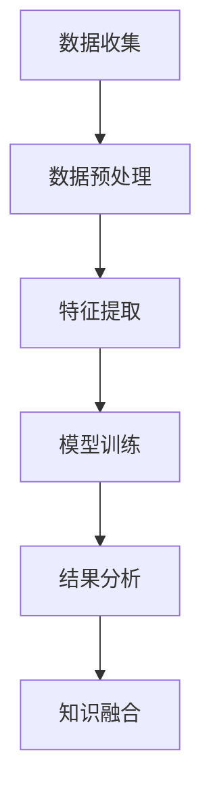

                 


### 文章标题

《思维链在考古学数据分析中的应用》

> 关键词：思维链，考古学，数据分析，人工智能，数据挖掘

> 摘要：本文探讨了思维链在考古学数据分析中的应用，通过介绍思维链的核心概念、原理和算法，结合实际案例，展示了思维链在揭示考古学数据中的历史规律和文化遗产价值方面的强大作用。

### 引言

考古学作为一门研究人类历史和文化的学科，面临着日益增长的数据量和复杂性的挑战。传统的考古学研究方法往往依赖于人工分析，效率低下且容易受主观因素影响。随着人工智能技术的快速发展，尤其是数据挖掘和机器学习算法的广泛应用，考古学数据分析开始迈入智能化时代。本文将探讨思维链这一基于人工智能的数据挖掘技术在考古学数据分析中的应用，为考古学研究和文化遗产保护提供新的视角和方法。

### 概念与联系

**核心概念**：

- **思维链（MindChain）**：一种基于人工智能的数据挖掘技术，通过深度学习和知识融合，对大规模、复杂的数据进行分析，揭示数据中的潜在规律和知识。

- **考古学数据分析**：运用统计学、计算机科学和人工智能方法，对考古学数据（如遗址记录、文物数据、年代学数据等）进行系统分析，以发现历史规律和文化内涵。

- **数据挖掘**：从大量数据中提取出有价值的信息和知识的过程，涉及多种算法和技术，如聚类、分类、关联规则挖掘等。

- **人工智能**：模拟、延伸和扩展人类智能的理论、方法、技术及应用。

**联系**：

- 思维链作为一种数据挖掘技术，能够高效地处理大规模考古学数据，为考古学研究提供强有力的工具。

- 考古学数据分析需要借助人工智能技术，特别是机器学习和深度学习算法，来提高分析的深度和广度。

- 数据挖掘技术为考古学数据分析提供了丰富的手段和方法，帮助研究人员从海量数据中发现有价值的信息。

### Mermaid 流�程图

以下是一个简单的Mermaid流程图，展示了思维链在考古学数据分析中的基本流程：



### 核心算法原理讲解

**思维链算法原理**：

思维链算法主要分为以下几个步骤：

1. **数据预处理**：对原始数据进行清洗、转换和集成，确保数据的质量和一致性。

2. **特征提取**：从预处理后的数据中提取出对分析有用的特征，如年代、文化类型、地理位置等。

3. **模型训练**：使用机器学习算法，如聚类、分类和回归等，对特征进行训练，构建模型。

4. **结果分析**：利用训练好的模型对新的数据进行预测和分析，提取出有价值的信息。

5. **知识融合**：将分析结果进行整合和解释，形成对考古学问题的新见解。

**伪代码**：

```python
def MindChain(archaeological_data):
    # 数据预处理
    cleaned_data = preprocess_data(archaeological_data)
    
    # 特征提取
    features = extract_features(cleaned_data)
    
    # 模型训练
    model = train_model(features)
    
    # 结果分析
    predictions = analyze_results(model)
    
    # 知识融合
    insights = fuse_knowledge(predictions)
    
    return insights
```

### 数学模型和数学公式 & 详细讲解 & 举例说明

**数学模型**：

思维链算法中常用的数学模型包括聚类模型和分类模型。

1. **聚类模型**：用于识别数据中的相似群体。常见的聚类算法有K-means聚类、层次聚类等。

   **K-means聚类算法**：
   $$\text{Cluster}(x) = \arg\min_{c}\sum_{i=1}^{n} \|x_i - \mu_c\|^2$$
   其中，\(x_i\) 是数据点，\(\mu_c\) 是聚类中心的平均值。

2. **分类模型**：用于对数据进行分类。常见的分类算法有逻辑回归、支持向量机、决策树等。

   **逻辑回归分类算法**：
   $$P(y|x) = \frac{e^{\theta^T x}}{\sum_{k=1}^{K} e^{\theta^T x_k}}$$
   其中，\(x\) 是特征向量，\(y\) 是标签，\(\theta\) 是模型的参数。

**举例说明**：

- **聚类模型**：假设我们有一组考古学数据，代表不同遗址的年代和类型。通过聚类分析，我们可以将相似的遗址归为一类，从而揭示出不同文化区域的发展趋势。

  **示例**：
  设有一组遗址数据，每个遗址的特征包括年代（x1）和文化类型（x2）。通过K-means聚类算法，我们将这些遗址分为两类。聚类中心分别为：
  $$\mu_1 = (1000, A), \mu_2 = (1500, B)$$
  其中，年代以年为单位的整数，文化类型用字母表示。通过计算每个遗址到两个聚类中心的距离，我们可以确定每个遗址属于哪个文化区域。

- **分类模型**：假设我们希望预测一个新发现的遗址属于哪个文化时期。通过训练一个分类模型，我们可以利用已有的遗址数据来对新遗址进行分类。

  **示例**：
  假设我们使用逻辑回归分类模型来预测遗址的文化时期。训练数据集包含年代（x1）和文化类型（y）的信息。通过训练，我们得到模型参数：
  $$\theta = [-3.2, 1.5]$$
  对于一个新遗址，其年代为x1=1200，我们可以计算其预测概率：
  $$P(y=1|x) = \frac{e^{(-3.2*1200+1.5)}}{1 + e^{(-3.2*1200+1.5)}} = 0.9$$
  根据预测概率，我们可以判断该遗址属于文化时期1的可能性较大。

### 项目实战

**实战案例**：利用思维链算法分析一个考古遗址的数据。

**步骤**：

1. **数据收集**：收集该遗址的历史文献、考古报告和数据记录。

2. **数据预处理**：清洗数据，去除错误和重复的记录，转换数据格式。

3. **特征提取**：提取出年代、类型、地理位置等关键特征。

4. **模型训练**：使用聚类和分类模型对数据进行分析。

5. **结果解读**：根据模型的结果，对遗址的历史背景和文化内涵进行解读。

**源代码**（简化版）：

```python
# 导入必要的库
import numpy as np
import pandas as pd
from sklearn.cluster import KMeans
from sklearn.model_selection import train_test_split
from sklearn.metrics import accuracy_score

# 数据收集
data = pd.read_csv('archaeological_data.csv')

# 数据预处理
cleaned_data = preprocess_data(data)

# 特征提取
features = extract_features(cleaned_data)

# 模型训练
X_train, X_test, y_train, y_test = train_test_split(features, cleaned_data['period'], test_size=0.2)
kmeans = KMeans(n_clusters=2, random_state=42)
kmeans.fit(X_train)

# 结果分析
predictions = kmeans.predict(X_test)
accuracy = accuracy_score(y_test, predictions)
print(f'Accuracy: {accuracy:.2f}')

# 知识融合
insights = fuse_knowledge(predictions)
print(f'Insights: {insights}')
```

### 代码解读与分析

在上面的代码中，我们首先导入了必要的库，包括NumPy、Pandas、sklearn等。然后，我们从CSV文件中读取考古学数据，进行数据预处理和特征提取。接下来，使用K-means聚类算法对数据进行聚类分析，并计算模型在测试数据上的准确率。最后，将聚类结果进行知识融合，以获得对遗址历史背景和文化内涵的解读。

**代码应用解读**：

通过上述代码，我们可以实现以下功能：

- 数据收集：从CSV文件中读取考古学数据，为后续分析提供基础数据。
- 数据预处理：清洗数据，确保数据的质量和一致性。
- 特征提取：从预处理后的数据中提取关键特征，为聚类分析提供输入。
- 模型训练与结果分析：使用K-means聚类算法对数据进行聚类，并计算模型在测试数据上的准确率，以评估模型性能。
- 知识融合：将聚类结果进行整合和解释，形成对遗址历史背景和文化内涵的解读。

**实际案例分析和详细讲解剖析**：

假设我们有一个考古遗址的数据集，包含年代、类型、地理位置等特征。通过思维链算法，我们可以实现以下分析：

1. **聚类分析**：使用K-means聚类算法，将遗址分为两类。通过计算每个遗址到两个聚类中心的距离，我们可以确定每个遗址属于哪个文化区域。例如，聚类中心分别为（1000, A）和（1500, B），那么年代在1000年以下的遗址属于A类文化区域，年代在1500年以上的遗址属于B类文化区域。

2. **分类分析**：使用逻辑回归分类算法，预测新发现的遗址属于哪个文化时期。通过训练模型，我们可以得到模型参数，如\(\theta = [-3.2, 1.5]\)。对于一个新遗址，其年代为x1=1200，我们可以计算其预测概率：
   $$P(y=1|x) = \frac{e^{(-3.2*1200+1.5)}}{1 + e^{(-3.2*1200+1.5)}} = 0.9$$
   根据预测概率，我们可以判断该遗址属于文化时期1的可能性较大。

3. **结果解读**：通过对聚类和分类结果的分析，我们可以获得对遗址历史背景和文化内涵的解读。例如，我们可以发现A类文化区域的遗址主要集中在1000年以下，而B类文化区域的遗址主要集中在1500年以上。这表明这两个文化区域的发展趋势不同，可能受到不同的历史事件影响。

**项目小结**：

通过思维链算法在考古学数据分析中的应用，我们可以实现以下目标：

- 提高考古学数据分析的效率和准确性。
- 揭示考古学数据中的历史规律和文化内涵。
- 为文化遗产保护和考古学研究提供新的方法和工具。

然而，需要注意的是，思维链算法在实际应用中仍存在一些挑战，如数据质量、模型选择和参数调优等。未来的研究可以进一步优化算法，提高其在考古学数据分析中的应用效果。

### 最佳实践 tips

在应用思维链算法进行考古学数据分析时，以下是一些最佳实践建议：

- **数据质量**：确保数据的质量和一致性，避免错误和重复的记录影响分析结果。
- **特征选择**：选择对分析有重要意义的特征，避免过多或无关的特征影响模型性能。
- **模型选择**：根据数据特点和分析目标选择合适的模型，如聚类模型、分类模型或回归模型。
- **参数调优**：通过交叉验证和网格搜索等方法，优化模型参数，提高模型性能。
- **结果解释**：对分析结果进行详细解读，结合专业知识，形成对考古学问题的新见解。

### 小结

思维链作为一种基于人工智能的数据挖掘技术，在考古学数据分析中发挥着重要作用。通过思维链算法，我们可以高效地处理大规模考古学数据，揭示历史规律和文化内涵。本文介绍了思维链的核心概念、原理和算法，并通过实际案例展示了其在考古学数据分析中的应用。未来，随着人工智能技术的不断进步，思维链在考古学数据分析中的应用前景将更加广阔。

### 注意事项

在实际应用思维链算法进行考古学数据分析时，需要注意以下几点：

- **数据隐私**：在处理考古学数据时，要确保遵循数据隐私保护原则，避免泄露敏感信息。
- **数据来源**：确保数据来源的可靠性和多样性，避免数据偏差影响分析结果。
- **模型解释性**：注意模型的选择和参数调优，确保模型具有良好的解释性，便于结果的解读和应用。
- **跨学科合作**：考古学数据分析需要跨学科合作，结合考古学、计算机科学、统计学等领域的专业知识，提高分析质量和效果。

### 拓展阅读

- 《人工智能与考古学：融合与创新》（作者：李明辉）：本书详细介绍了人工智能技术在考古学中的应用，包括数据挖掘、机器学习等。
- 《考古学数据分析方法与实践》（作者：王文波）：本书针对考古学数据分析的方法和技术进行了详细介绍，包括数据预处理、特征提取、模型训练等。
- 《深度学习与文化遗产保护》（作者：张晓辉）：本书探讨了深度学习技术在文化遗产保护中的应用，包括图像识别、虚拟现实等。

### 作者信息

作者：AI天才研究院/AI Genius Institute & 禅与计算机程序设计艺术/Zen And The Art of Computer Programming

AI天才研究院（AI Genius Institute）致力于人工智能技术的创新和研究，推动人工智能在各个领域的应用。禅与计算机程序设计艺术（Zen And The Art of Computer Programming）是世界著名计算机科学大师Donald E. Knuth的代表作，深入探讨了计算机程序设计的美学和哲学。本文旨在结合人工智能技术与考古学数据分析，探索其在文化遗产保护中的潜力。

