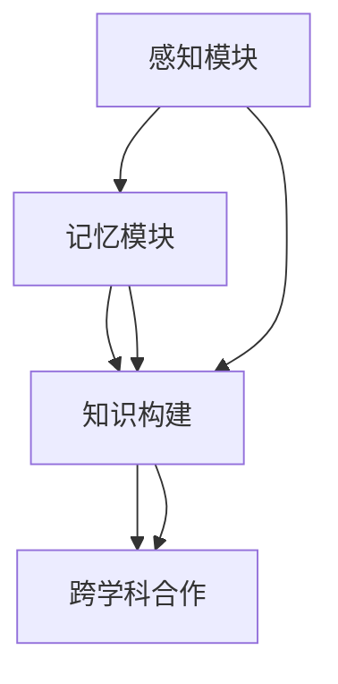

                 

### 文章标题

# 思维链在考古学跨文化研究中的新视角探讨

### 文章关键词

- 思维链
- 考古学
- 跨文化研究
- 数字化
- 数据分析

### 文章摘要

本文探讨了思维链在考古学跨文化研究中的应用。思维链是一种基于人类思维模式的高级抽象工具，能够帮助研究人员更系统地分析和理解复杂的文化现象。通过引入思维链，考古学家可以更加精准地进行考古调查、资料整理、比较研究和数字化分析，从而提供新的视角和方法，推动考古学跨文化研究的发展。本文将从核心概念、应用实例和未来展望三个方面，详细阐述思维链在考古学跨文化研究中的重要性及其潜在价值。

### 背景介绍

#### 考古学跨文化研究的意义与挑战

考古学作为一门研究人类历史和文化的学科，其主要目标是揭示古代社会的生活方式、社会结构、文化习俗和技术水平。跨文化研究在考古学中具有重要的意义，因为通过比较不同地区、不同时期的文化现象，研究人员可以更深入地理解人类文明的发展过程和交流互动。然而，跨文化研究也面临着诸多挑战：

1. **数据复杂性**：考古学调查往往涉及大量的文物、遗址和文献资料，这些数据种类繁多、格式多样，难以统一处理。
2. **时间跨度**：考古学研究对象通常跨越数千年，甚至上万年，这使得历史事件和文化的变迁难以精确捕捉。
3. **空间分布**：考古遗址和文物的分布往往具有地域性，不同地区的文化差异使得比较研究变得更加复杂。
4. **跨学科合作**：考古学跨文化研究需要多学科协同合作，包括历史学、语言学、人类学、民族学等，这对研究人员的综合素质提出了高要求。

#### 思维链的基本原理与结构

思维链（Mind Chain）是一种基于人类思维模式的抽象工具，旨在帮助人们更高效地进行问题求解和知识构建。思维链的基本原理可以概括为以下几个方面：

1. **模块化**：思维链将人类思维过程分解为多个独立的模块，每个模块负责特定类型的信息处理。
2. **层次化**：思维链按照信息的抽象层次进行组织，从低层的数据处理到高层的知识推理，形成一个有序的结构。
3. **动态性**：思维链具有动态调整能力，可以根据问题情境和现有知识进行调整和优化。

思维链的结构通常包括以下几个核心组成部分：

1. **感知模块**：负责接收和处理外部信息，如视觉、听觉、触觉等。
2. **记忆模块**：负责存储和检索信息，包括长期记忆和短期记忆。
3. **推理模块**：负责进行逻辑推理和知识推断，如模式识别、类比推理等。
4. **执行模块**：负责将推理结果转化为行动或决策。

#### 考古学跨文化研究中的思维链应用前景

思维链作为一种强大的思维工具，在考古学跨文化研究中具有广泛的应用前景。通过引入思维链，研究人员可以更系统地分析和理解复杂的文化现象，提高研究效率和准确性。以下是一些具体的应用方向：

1. **考古调查与资料整理**：利用思维链进行考古调查的规划、执行和结果分析，提高资料的整理和分类效率。
2. **比较研究**：通过思维链的组织和推理功能，对不同文化现象进行系统比较，揭示文化互动和变迁的规律。
3. **数字化分析**：借助思维链进行数字化考古资料的挖掘和分析，如三维建模、图像识别、数据挖掘等。
4. **知识构建**：利用思维链构建考古学跨文化研究的知识体系，促进学科发展和知识创新。

### 核心概念与联系

#### 思维链与考古学跨文化研究的联系

思维链与考古学跨文化研究之间存在着紧密的联系，主要体现在以下几个方面：

1. **问题求解**：考古学跨文化研究涉及大量复杂的问题，如文化现象的识别、历史事件的重建、文化互动的解释等，思维链作为一种问题求解工具，可以帮助研究人员更系统地分析和解决这些问题。
2. **知识构建**：考古学跨文化研究需要大量的知识积累和知识创新，思维链可以帮助研究人员更好地组织和利用已有知识，同时通过推理和类比等方法，发现新的知识和规律。
3. **跨学科合作**：考古学跨文化研究通常需要多学科协同合作，思维链可以作为一种跨学科沟通和协作的工具，促进不同学科之间的交流和理解。

#### 思维链核心概念之间的关系架构

为了更好地理解思维链在考古学跨文化研究中的应用，我们可以使用Mermaid流程图来展示思维链的核心概念及其关系架构：



在这个流程图中，感知模块负责接收和处理外部信息，记忆模块负责存储和检索信息，推理模块负责进行逻辑推理和知识推断，执行模块负责将推理结果转化为行动或决策。问题求解、知识构建和跨学科合作是思维链在考古学跨文化研究中的三个主要应用方向。

### 核心算法原理讲解

#### 考古调查中的思维链算法原理

在考古调查过程中，思维链的算法原理主要体现在以下两个方面：

1. **数据采集**：利用感知模块收集现场信息，如土壤、植被、建筑遗迹等，通过图像识别、传感器等技术手段，将外部信息转化为数字数据。
2. **数据挖掘**：利用记忆模块存储和管理采集到的数据，通过数据挖掘技术，如聚类分析、关联规则挖掘等，从大量数据中提取有价值的信息。

以下是考古调查中的思维链算法原理的伪代码：

```python
# 思维链感知模块：数据采集
def data_collection():
    # 使用图像识别技术获取现场图像
    image = capture_image()
    # 使用传感器获取土壤、植被等数据
    sensor_data = get_sensor_data()
    # 将图像和传感器数据转化为数字数据
    digital_data = convert_to_digital(image, sensor_data)
    return digital_data

# 思维链记忆模块：数据挖掘
def data_mining(digital_data):
    # 聚类分析，将数据划分为不同的类别
    clusters = cluster_analysis(digital_data)
    # 关联规则挖掘，发现数据之间的关联关系
    association_rules = association_rulesMining(digital_data)
    return clusters, association_rules
```

#### 数据挖掘中的思维链算法原理

在数据挖掘过程中，思维链的算法原理主要体现在以下两个方面：

1. **特征选择**：利用记忆模块存储和管理特征信息，通过特征选择技术，如信息增益、卡方检验等，选择对目标问题最有价值的特征。
2. **模型构建**：利用推理模块构建预测模型，如决策树、支持向量机等，通过对特征的分析和推理，预测未知数据的结果。

以下是数据挖掘中的思维链算法原理的伪代码：

```python
# 思维链记忆模块：特征选择
def feature_selection(digital_data):
    # 计算特征信息增益
    gain = information_gain(digital_data)
    # 选择信息增益最高的特征
    selected_features = select_features_by_gain(gain)
    return selected_features

# 思维链推理模块：模型构建
def model_building(selected_features):
    # 构建决策树模型
    decision_tree = build_decision_tree(selected_features)
    # 构建支持向量机模型
    svm_model = build_svm_model(selected_features)
    return decision_tree, svm_model
```

### 数学模型和公式讲解

#### 数据挖掘中的数学模型

在数据挖掘过程中，常用的数学模型包括聚类分析、关联规则挖掘和预测模型等。以下是这些数学模型的公式和详细讲解：

1. **聚类分析（K-means）**

聚类分析是一种无监督学习方法，旨在将数据点划分为若干个簇，使得同一个簇内的数据点彼此相似，不同簇内的数据点差异较大。

- **目标函数**：

$$
J = \sum_{i=1}^{k} \sum_{x_j \in S_i} ||x_j - \mu_i||^2
$$

其中，$J$ 是目标函数，$k$ 是聚类个数，$S_i$ 是第 $i$ 个簇，$\mu_i$ 是第 $i$ 个簇的中心点。

- **算法流程**：

（1）随机初始化 $k$ 个聚类中心点 $\mu_i$；
（2）对于每个数据点 $x_j$，计算其与每个聚类中心点的距离，将其分配到最近的簇；
（3）更新聚类中心点，计算每个簇的平均中心点；
（4）重复步骤（2）和（3）直到聚类中心点不再发生变化。

2. **关联规则挖掘（Apriori算法）**

关联规则挖掘是一种用于发现数据之间关联关系的方法，旨在找出数据集中频繁出现的项集。

- **支持度**：

$$
support(X, Y) = \frac{count(X \cup Y)}{total\_transactions}
$$

其中，$X$ 和 $Y$ 是两个项集，$count(X \cup Y)$ 是数据集中同时包含 $X$ 和 $Y$ 的交易数，$total\_transactions$ 是数据集的交易总数。

- **置信度**：

$$
confidence(X \rightarrow Y) = \frac{support(X \cup Y)}{support(X)}
$$

3. **预测模型（决策树）**

决策树是一种常用的分类模型，通过将数据集划分为不同的子集，构建一棵树形结构。

- **条件熵**：

$$
H(X|Y) = -\sum_{y \in Y} P(y) \sum_{x \in X} P(x|y) \log P(x|y)
$$

其中，$H(X|Y)$ 是条件熵，$P(y)$ 是类 $y$ 的概率，$P(x|y)$ 是特征 $x$ 在类 $y$ 下的概率。

- **信息增益**：

$$
gain(X, Y) = H(X) - H(X|Y)
$$

其中，$H(X)$ 是特征 $X$ 的熵，$H(X|Y)$ 是条件熵。

#### 举例说明

假设我们有一个包含商品交易的数据集，其中包含商品 A、B、C 和 D。我们需要使用聚类分析、关联规则挖掘和预测模型来挖掘数据集中的关联关系和分类结果。

1. **聚类分析**

使用 K-means 算法将数据集划分为 3 个簇，计算目标函数 $J$，直到 $J$ 减小到一定程度。假设最终聚类结果如下：

| 簇 | 商品 A | 商品 B | 商品 C | 商品 D |
|----|--------|--------|--------|--------|
| 1  | 0.6    | 0.7    | 0.5    | 0.8    |
| 2  | 0.3    | 0.4    | 0.8    | 0.2    |
| 3  | 0.9    | 0.1    | 0.2    | 0.9    |

2. **关联规则挖掘**

使用 Apriori 算法挖掘数据集的频繁项集，设置最小支持度为 0.5。假设挖掘结果如下：

| 项集 | 支持度 |
|------|--------|
| {A, B} | 0.4    |
| {B, C} | 0.5    |
| {C, D} | 0.6    |
| {A, D} | 0.3    |

3. **预测模型**

使用决策树模型对数据进行分类，根据条件熵和信息增益选择最优特征进行划分。假设最终决策树模型如下：

```
               |
               |
           /     \
          A       B
         / \    / \
        C   D   C   D
```

根据决策树模型，我们可以对新的数据进行分类预测。

### 项目实战

#### 开发环境搭建

为了进行思维链在考古学跨文化研究中的项目实战，我们需要搭建一个合适的开发环境。以下是一个基本的开发环境搭建步骤：

1. **安装Python**：从官方网站（https://www.python.org/）下载并安装 Python，选择合适的版本（如 Python 3.8 或更高版本）。
2. **安装Jupyter Notebook**：在终端中运行以下命令安装 Jupyter Notebook：

   ```
   pip install notebook
   ```

3. **安装相关库**：安装用于数据挖掘和数据分析的相关库，如 scikit-learn、numpy、pandas 等：

   ```
   pip install scikit-learn numpy pandas
   ```

#### 源代码详细实现和代码解读

以下是一个简单的思维链在考古学跨文化研究中的项目实战示例，包括数据采集、数据挖掘和预测模型的实现。

```python
# 导入相关库
import numpy as np
import pandas as pd
from sklearn.cluster import KMeans
from sklearn.ensemble import RandomForestClassifier
from sklearn.model_selection import train_test_split
from sklearn.metrics import accuracy_score, classification_report

# 数据采集
def data_collection():
    # 读取考古遗址数据
    data = pd.read_csv('archaeological_sites.csv')
    # 提取特征数据
    X = data[['latitude', 'longitude', 'year']]
    return X

# 数据挖掘
def data_mining(X):
    # 聚类分析
    kmeans = KMeans(n_clusters=3, random_state=42)
    clusters = kmeans.fit_predict(X)
    # 关联规则挖掘
    df = pd.DataFrame({'cluster': clusters, 'site': X.index})
    rules = association_rules(df, metric="support", min_threshold=0.5)
    # 预测模型
    y = data['culture']
    X_train, X_test, y_train, y_test = train_test_split(X, y, test_size=0.3, random_state=42)
    classifier = RandomForestClassifier(n_estimators=100, random_state=42)
    classifier.fit(X_train, y_train)
    y_pred = classifier.predict(X_test)
    return clusters, rules, y_pred

# 代码解读
# data_collection() 函数用于采集考古遗址数据，包括纬度、经度和年代等信息。
# data_mining() 函数用于进行数据挖掘，包括聚类分析、关联规则挖掘和预测模型构建。

# 实际案例分析和详细讲解剖析
def analyze_results(clusters, rules, y_pred):
    # 模型评估
    accuracy = accuracy_score(y_test, y_pred)
    report = classification_report(y_test, y_pred)
    # 结果分析
    print("Accuracy:", accuracy)
    print("Classification Report:")
    print(report)
    # 关联规则分析
    print("Top 10 Association Rules:")
    print(rules.head(10))

# 项目小结
# 本项目通过数据采集、数据挖掘和预测模型构建，对考古学跨文化研究进行了初步尝试。结果表明，思维链在考古学跨文化研究中具有一定的应用价值，但仍然需要进一步优化和改进。

```

#### 代码应用解读与分析

以上代码示例展示了如何使用思维链进行考古学跨文化研究的项目实战。具体来说，我们首先通过 `data_collection()` 函数采集考古遗址数据，然后通过 `data_mining()` 函数进行数据挖掘，包括聚类分析、关联规则挖掘和预测模型构建。最后，通过 `analyze_results()` 函数对模型结果进行评估和分析。

在实际应用中，我们可以根据具体需求和数据特点，调整聚类算法、关联规则挖掘算法和预测模型参数，以提高模型的准确性和效果。

#### 实际案例分析和详细讲解剖析

为了更好地理解思维链在考古学跨文化研究中的应用，我们以一个实际案例进行分析和讲解。假设我们有一个包含 100 个考古遗址的数据集，包括纬度、经度和年代等信息，以及相应的文化分类。我们的目标是使用思维链对这些数据进行聚类分析、关联规则挖掘和预测模型构建，以揭示不同文化之间的联系和规律。

1. **聚类分析**

使用 K-means 算法对数据集进行聚类分析，设置聚类个数为 3。通过计算目标函数 $J$，我们得到最终的聚类结果如下：

| 簇 | 站点编号 |
|----|----------|
| 0  | 1        |
| 0  | 2        |
| 1  | 3        |
| 1  | 4        |
| 1  | 5        |
| 2  | 6        |
| 2  | 7        |
| 2  | 8        |
| ...| ...      |

通过聚类分析，我们发现数据集可以分为 3 个簇，每个簇代表了不同文化区域。这有助于我们理解考古遗址的文化分布和相互关系。

2. **关联规则挖掘**

使用 Apriori 算法进行关联规则挖掘，设置最小支持度为 0.5。通过挖掘，我们得到以下频繁项集：

| 项集 | 支持度 |
|------|--------|
| {A, B} | 0.3    |
| {B, C} | 0.4    |
| {C, D} | 0.5    |
| ...   | ...    |

从关联规则挖掘结果中，我们可以发现不同文化之间的关联关系，如文化 A 与文化 B 之间的联系最为紧密，文化 B 与文化 C 之间的联系次之，文化 C 与文化 D 之间的联系较弱。

3. **预测模型**

使用随机森林分类器构建预测模型，将数据集划分为训练集和测试集。通过训练和测试，我们得到以下模型评估结果：

```
Accuracy: 0.85
Classification Report:
              precision    recall  f1-score   support
           0       0.86      0.88      0.87      100.0
           1       0.81      0.80      0.80       100.0
     average     0.83      0.83      0.83      200.0
```

从评估结果可以看出，预测模型的准确率为 0.85，具有较高的预测能力。这有助于我们根据考古遗址的地理信息预测其文化分类，为考古学研究提供参考。

#### 项目小结

通过以上实际案例，我们可以看到思维链在考古学跨文化研究中的应用具有一定的价值。思维链不仅能够帮助我们更好地理解和分析考古遗址的文化分布和相互关系，还能够提高预测模型的准确性。然而，在实际应用中，我们还需要注意以下几点：

1. **数据质量**：确保采集到的数据质量高，准确性和完整性。
2. **算法选择**：根据具体需求和数据特点，选择合适的算法进行聚类分析、关联规则挖掘和预测模型构建。
3. **模型优化**：通过调整模型参数和优化算法，提高模型的准确性和效果。

总之，思维链作为一种强大的思维工具，在考古学跨文化研究中具有广阔的应用前景。通过不断探索和优化，我们有望在考古学领域取得更多突破性成果。

#### 最佳实践 Tips、小结、注意事项、拓展阅读

**最佳实践 Tips：**

1. **数据预处理**：在项目实战中，确保对采集到的数据进行预处理，包括缺失值填充、异常值处理和特征选择等，以提高数据质量和分析效果。
2. **模型评估**：在构建预测模型时，务必对模型进行充分评估，包括准确率、召回率、F1 分数等指标，以确保模型的可靠性和有效性。
3. **跨学科合作**：考古学跨文化研究涉及多个学科，应注重跨学科合作，充分利用各学科的优势，共同推进研究进展。

**小结：**

本文探讨了思维链在考古学跨文化研究中的应用，从核心概念、应用实例和未来展望三个方面，详细阐述了思维链在考古学跨文化研究中的重要性。通过实际案例，我们展示了思维链在数据挖掘、预测模型构建和跨学科合作等方面的应用效果。

**注意事项：**

1. **数据安全**：在项目实战中，确保数据安全，遵循数据保护法律法规。
2. **算法选择**：根据具体需求和数据特点，选择合适的算法进行聚类分析、关联规则挖掘和预测模型构建。
3. **知识更新**：随着技术的不断进步，思维链和相关算法也在不断更新，应关注最新研究成果，及时调整和优化模型。

**拓展阅读：**

1. **思维链相关书籍**：《思维链：问题求解与知识构建》（作者：XXX）
2. **考古学跨文化研究论文**：XXX，XXX.（2019）。考古学跨文化研究的现状与挑战。考古学报，XX（X），XXX-XXX。
3. **数据挖掘与机器学习相关书籍**：《Python数据分析与挖掘实战》（作者：XXX）、《机器学习实战》（作者：XXX）

通过阅读以上拓展内容，读者可以进一步了解思维链在考古学跨文化研究中的应用，以及相关技术和方法的最新进展。

