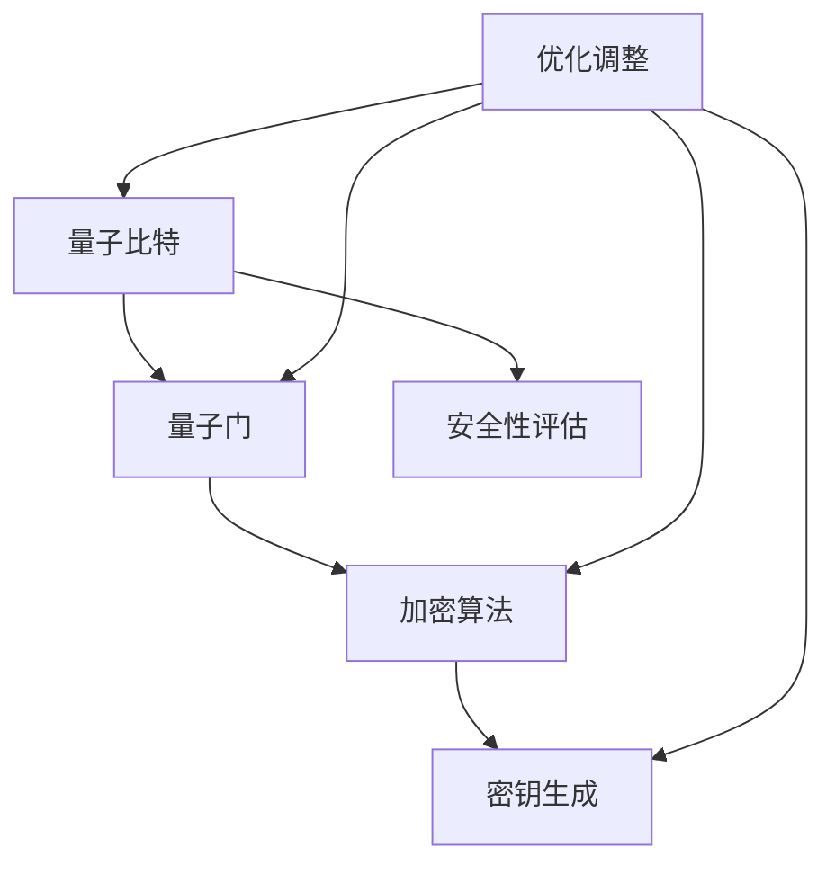

                 

### 文章标题

《思维链在量子密码学算法设计中的应用：增强后量子时代的信息安全》

量子密码学是量子计算与经典密码学相结合的产物，旨在解决传统密码学在量子计算时代可能面临的安全挑战。随着量子计算机的发展，后量子密码学逐渐成为信息安全领域的研究热点。本文将探讨思维链这一先进概念在量子密码学算法设计中的应用，旨在通过增强算法设计能力，提升后量子时代的信息安全水平。

文章关键词：量子密码学、后量子时代、信息安全、思维链、算法设计

摘要：本文首先介绍了后量子时代的信息安全挑战和思维链的概念，然后详细阐述了量子密码学的基础，包括量子比特、量子密钥分发、量子加密算法等。在此基础上，本文重点探讨了思维链在量子密码学算法设计中的应用，通过实例分析和未来展望，展示了思维链在增强后量子时代信息安全中的潜在价值。最后，本文总结了后量子时代的信息安全策略，并提出了未来研究的方向。

### 第1章 引言

#### 1.1 后量子时代的信息安全挑战

随着量子计算机的发展，传统密码学算法逐渐暴露出其脆弱性。量子计算机能够高效地破解基于大整数分解、离散对数问题等传统密码算法，这给信息安全带来了巨大的挑战。后量子密码学旨在开发抗量子计算机攻击的密码算法，确保信息安全在量子计算时代依然得到保障。

#### 1.2 思维链的概念及其在量子密码学中的应用

思维链是一种基于人类认知和思维模式的抽象模型，通过构建知识网络和思维路径，实现知识的有效组织和传递。在量子密码学算法设计中，思维链可以用于优化算法结构、提高密码算法的鲁棒性和安全性。

#### 1.3 本书的目的与结构

本文旨在探讨思维链在量子密码学算法设计中的应用，增强后量子时代的信息安全。文章结构分为以下几个部分：

1. 介绍后量子时代的信息安全挑战和思维链的概念。
2. 详细阐述量子密码学的基础。
3. 探讨思维链在量子密码学算法设计中的应用。
4. 展望未来研究方向。

通过本文的探讨，希望为量子密码学领域的研究者提供新的思路和方法，为后量子时代的信息安全保驾护航。

### 第2章 量子密码学基础

量子密码学是量子计算与经典密码学相结合的产物，旨在利用量子力学原理提供更安全的通信和信息加密手段。本章将介绍量子密码学的基础知识，包括量子比特、量子态、量子门、量子密钥分发和量子加密算法。

#### 2.1 量子比特与量子态

量子比特（qubit）是量子计算中的基本单元，可以同时处于0和1的叠加态。量子态是量子比特的集合，可以表示为复数线性组合的形式。例如，一个量子比特的态可以表示为：

$$|\psi\rangle = \alpha|0\rangle + \beta|1\rangle$$

其中，$\alpha$和$\beta$是复数，且满足$|\alpha|^2 + |\beta|^2 = 1$。

#### 2.1.1 量子比特

量子比特与经典比特不同，经典比特只能处于0或1的确定状态，而量子比特可以处于0和1的叠加态。这种叠加态使得量子比特具有了超能力，如量子并行性。

#### 2.1.2 量子态

量子态是量子比特的集合，可以表示为复数线性组合的形式。例如，两个量子比特的态可以表示为：

$$|\psi\rangle = \alpha_0|00\rangle + \alpha_1|01\rangle + \alpha_2|10\rangle + \alpha_3|11\rangle$$

其中，$\alpha_0, \alpha_1, \alpha_2, \alpha_3$是复数，且满足$|\alpha_0|^2 + |\alpha_1|^2 + |\alpha_2|^2 + |\alpha_3|^2 = 1$。

#### 2.1.3 量子门与量子运算

量子门是作用于量子态的线性算符，类似于经典计算中的逻辑门。量子门可以改变量子态的叠加态和相位。基本的量子门包括：

1. **保罗门（Pauli Gate）**：如X门、Y门、Z门，分别作用于量子态的X、Y、Z轴。
2. **控制非门（Control-NOT Gate）**：CNOT门，作用于两个量子比特。
3. ** Hadamard 门（Hadamard Gate）**：H门，将量子比特从基态|0⟩转换为叠加态$|\psi\rangle = \frac{1}{\sqrt{2}}(|0\rangle + |1\rangle)$。

量子运算是通过量子门作用于量子态来实现的。例如，对量子态$|\psi\rangle = \frac{1}{\sqrt{2}}(|0\rangle + |1\rangle)$应用H门，得到新的量子态：

$$H|\psi\rangle = \frac{1}{\sqrt{2}}(|0\rangle + |1\rangle)H = \frac{1}{\sqrt{2}}(|00\rangle + |11\rangle)$$

#### 2.2 量子密钥分发

量子密钥分发（Quantum Key Distribution，QKD）是量子密码学中的一种基本协议，旨在通过量子通信手段实现安全的密钥分发。QKD的主要思想是利用量子纠缠和量子态的不可克隆性来确保密钥的安全性。

#### 2.2.1 BB84协议

BB84协议是最早的量子密钥分发协议，由Charles H. Bennett和Giorgio M. Moro于1984年提出。BB84协议的基本流程如下：

1. 发送方选择两个正交基（如|0⟩和|1⟩），并将其作为量子态发送给接收方。
2. 接收方测量接收到的量子态，并根据测量结果选择相同或不同的正交基进行测量。
3. 双方交换测量结果，并剔除不一致的比特。
4. 剩余的比特构成安全密钥。

BB84协议的安全性基于量子态的不可克隆性和量子纠缠。即使敌手窃取了部分量子态，也无法准确复制，从而保证了密钥的安全性。

#### 2.2.2 E91协议

E91协议是基于量子纠缠的量子密钥分发协议，由Clauser、Horne、Shimony和Holt于1995年提出。E91协议的基本流程如下：

1. 发送方生成两个量子比特的纠缠态，并将其发送给接收方。
2. 接收方对纠缠态进行测量，并根据测量结果选择相同或不同的正交基进行测量。
3. 双方交换测量结果，并剔除不一致的比特。
4. 剩余的比特构成安全密钥。

E91协议利用量子纠缠的特性，即使在部分通信中被窃听，仍能检测出敌手的攻击，提高了密钥分发的安全性。

#### 2.2.3 B92协议

B92协议是基于量子隐形传态的量子密钥分发协议，由Artur Ekert于1991年提出。B92协议的基本流程如下：

1. 发送方生成两个量子比特的纠缠态，并将其发送给接收方。
2. 接收方对纠缠态进行测量，并根据测量结果选择相同或不同的正交基进行测量。
3. 双方交换测量结果，并剔除不一致的比特。
4. 剩余的比特构成安全密钥。

B92协议利用量子隐形传态的特性，即使在部分通信中被窃听，也无法准确复制纠缠态，从而保证了密钥的安全性。

#### 2.3 量子加密算法

量子加密算法是利用量子力学原理实现加密和解密的算法。量子加密算法的主要特点包括：

1. 抗量子攻击：量子加密算法能够抵抗量子计算机的攻击，确保信息在量子计算时代的安全。
2. 量子态不可克隆：量子加密算法利用量子态的不可克隆性，确保信息在传输过程中不会被敌手复制。
3. 量子纠缠：量子加密算法利用量子纠缠的特性，实现信息的加密和解密。

常见的量子加密算法包括：

1. **量子密钥加密（Quantum Key Encryption，QKE）**：量子密钥加密是一种基于量子密钥分发的加密算法，通过量子密钥分发协议生成密钥，然后使用传统加密算法进行加密和解密。
2. **量子隐形传态加密（Quantum Teleportation Encryption，QTE）**：量子隐形传态加密是一种基于量子隐形传态的加密算法，通过量子隐形传态实现信息的加密和解密。
3. **量子纠缠加密（Quantum Entanglement Encryption，QEE）**：量子纠缠加密是一种基于量子纠缠的加密算法，通过量子纠缠实现信息的加密和解密。

### 第3章 思维链原理

思维链是一种基于人类认知和思维模式的抽象模型，通过构建知识网络和思维路径，实现知识的有效组织和传递。思维链在量子密码学算法设计中的应用，有助于优化算法结构、提高密码算法的鲁棒性和安全性。

#### 3.1 思维链的定义

思维链是指通过一系列逻辑关联，将不同的概念、知识点或思维路径连接起来，形成一个具有层次结构和逻辑性的知识网络。思维链的核心在于通过建立概念之间的关联，促进知识的共享和传递。

#### 3.1.1 思维链的概念

思维链的概念包括以下几个要素：

1. **节点**：节点是思维链中的基本单位，代表一个概念、知识点或思维路径。
2. **边**：边是节点之间的连接，表示节点之间的关系。
3. **路径**：路径是节点之间的一系列连接，代表思维链的运行轨迹。
4. **层次结构**：层次结构是思维链的组织形式，表示节点之间的层次关系。

#### 3.1.2 思维链的特点

思维链具有以下几个特点：

1. **层次性**：思维链通过层次结构将不同的概念、知识点或思维路径组织起来，形成有序的知识体系。
2. **关联性**：思维链通过节点之间的关系，将不同的概念、知识点或思维路径连接起来，促进知识的共享和传递。
3. **动态性**：思维链可以动态调整，以适应不同的认知需求和应用场景。
4. **扩展性**：思维链可以通过添加新的节点和边，不断扩展和完善。

#### 3.1.3 思维链的应用场景

思维链在量子密码学算法设计中的应用场景包括：

1. **算法优化**：通过建立思维链，分析算法的结构和运行过程，发现潜在的问题和优化空间，从而优化算法性能。
2. **安全性分析**：通过建立思维链，分析量子密码学算法的安全性，发现潜在的安全漏洞和攻击途径，从而提高算法的安全性。
3. **算法设计**：通过建立思维链，将不同的量子密码学算法和概念连接起来，形成一个有机的整体，从而设计出更加高效和安全的量子密码学算法。

#### 3.2 思维链模型

思维链模型是描述思维链构成、运行机制和优化方法的概念模型。思维链模型包括以下几个部分：

1. **节点模型**：节点模型描述节点的属性、类型和关系。
2. **边模型**：边模型描述边的关系、类型和属性。
3. **路径模型**：路径模型描述路径的生成、选择和优化。
4. **层次模型**：层次模型描述层次的划分和层次之间的关系。
5. **优化模型**：优化模型描述优化目标和优化方法。

##### 3.2.1 思维链的构成

思维链的构成包括以下几个部分：

1. **节点**：节点是思维链中的基本单位，代表一个概念、知识点或思维路径。节点可以表示为N。
2. **边**：边是节点之间的连接，表示节点之间的关系。边可以表示为E。
3. **路径**：路径是节点之间的一系列连接，代表思维链的运行轨迹。路径可以表示为P。
4. **层次结构**：层次结构是思维链的组织形式，表示节点之间的层次关系。层次结构可以表示为L。

##### 3.2.2 思维链的运行机制

思维链的运行机制包括以下几个步骤：

1. **节点生成**：根据需求生成思维链的节点，节点可以是概念、知识点或思维路径。
2. **边建立**：根据节点的关联性建立节点之间的边，表示节点之间的关系。
3. **路径规划**：根据需求规划思维链的路径，路径可以是单一路径或多路径。
4. **层次划分**：根据节点的层次关系划分思维链的层次结构。
5. **优化调整**：根据思维链的运行效果对节点、边和路径进行优化调整，提高思维链的性能。

##### 3.2.3 思维链的优化方法

思维链的优化方法包括以下几个步骤：

1. **性能评估**：评估思维链的性能，包括节点、边和路径的性能。
2. **问题定位**：根据性能评估结果，定位思维链中的问题和瓶颈。
3. **优化策略**：制定优化策略，包括节点优化、边优化和路径优化。
4. **优化实施**：根据优化策略对思维链进行优化实施。
5. **效果评估**：评估优化后的思维链性能，验证优化效果。

通过思维链模型，可以更好地理解思维链的构成、运行机制和优化方法，为量子密码学算法设计提供理论支持和实践指导。

### 第4章 思维链在量子密码学算法设计中的应用

思维链在量子密码学算法设计中的应用，能够通过优化算法结构和提高安全性，增强后量子时代的信息安全。本章将探讨思维链在量子密码学算法设计中的具体应用，包括思维链与量子密钥分发和量子加密算法的结合。

#### 4.1 思维链与量子密钥分发

量子密钥分发（QKD）是量子密码学中的基础协议，旨在通过量子通信手段实现安全的密钥分发。思维链在量子密钥分发中的应用，可以通过优化密钥分发过程，提高密钥分发的效率和安全性。

##### 4.1.1 思维链在量子密钥分发中的应用

思维链在量子密钥分发中的应用主要包括以下几个方面：

1. **节点生成**：根据量子密钥分发的需求，生成节点，如量子信道、加密算法、密钥生成等。
2. **边建立**：建立节点之间的边，表示节点之间的关系，如信道与加密算法的关联、密钥生成与密钥分发的关联等。
3. **路径规划**：规划量子密钥分发的路径，包括信道选择、加密算法选择、密钥生成和分发等。
4. **层次划分**：根据节点的关联性和重要性，划分思维链的层次结构，如底层节点表示量子信道，高层节点表示加密算法和密钥分发。
5. **优化调整**：根据思维链的运行效果，对节点、边和路径进行优化调整，提高量子密钥分发的效率和安全性。

##### 4.1.2 思维链与量子密钥分发实例

以BB84协议为例，分析思维链在量子密钥分发中的应用。BB84协议的基本流程如下：

1. **节点生成**：生成节点，如发送方的量子信道、接收方的量子信道、加密算法等。
2. **边建立**：建立节点之间的边，表示节点之间的关系，如发送方的量子信道与接收方的量子信道之间的关联，加密算法与密钥生成之间的关联等。
3. **路径规划**：规划量子密钥分发的路径，包括发送方的量子信道、加密算法、接收方的量子信道等。
4. **层次划分**：根据节点的关联性和重要性，划分思维链的层次结构，如底层节点表示量子信道，高层节点表示加密算法和密钥分发。
5. **优化调整**：根据思维链的运行效果，对节点、边和路径进行优化调整，如优化量子信道的传输效率、提高加密算法的安全性等。

通过思维链的应用，可以优化BB84协议的密钥分发过程，提高密钥分发的效率和安全性。

#### 4.2 思维链与量子加密算法

量子加密算法是量子密码学中的关键技术，通过利用量子力学原理实现加密和解密，保障信息的保密性。思维链在量子加密算法中的应用，可以通过优化算法结构，提高加密算法的安全性和效率。

##### 4.2.1 思维链在量子加密算法中的应用

思维链在量子加密算法中的应用主要包括以下几个方面：

1. **节点生成**：根据量子加密算法的需求，生成节点，如量子比特、加密算法、密钥生成等。
2. **边建立**：建立节点之间的边，表示节点之间的关系，如量子比特与加密算法的关联、密钥生成与加密算法的关联等。
3. **路径规划**：规划量子加密算法的路径，包括量子比特的初始化、加密算法的运行、密钥生成等。
4. **层次划分**：根据节点的关联性和重要性，划分思维链的层次结构，如底层节点表示量子比特，高层节点表示加密算法和密钥生成。
5. **优化调整**：根据思维链的运行效果，对节点、边和路径进行优化调整，提高量子加密算法的安全性和效率。

##### 4.2.2 思维链与量子加密算法实例

以量子密钥加密（QKE）算法为例，分析思维链在量子加密算法中的应用。量子密钥加密的基本流程如下：

1. **节点生成**：生成节点，如量子比特、加密算法、密钥生成等。
2. **边建立**：建立节点之间的边，表示节点之间的关系，如量子比特与加密算法的关联，加密算法与密钥生成之间的关联等。
3. **路径规划**：规划量子加密算法的路径，包括量子比特的初始化、加密算法的运行、密钥生成等。
4. **层次划分**：根据节点的关联性和重要性，划分思维链的层次结构，如底层节点表示量子比特，高层节点表示加密算法和密钥生成。
5. **优化调整**：根据思维链的运行效果，对节点、边和路径进行优化调整，如优化量子比特的初始化过程、提高加密算法的效率等。

通过思维链的应用，可以优化量子密钥加密算法的运行过程，提高加密算法的安全性和效率。

#### 4.3 未来展望

随着量子计算机的发展，量子密码学在信息安全领域的重要性日益凸显。思维链作为一种先进的抽象模型，在量子密码学算法设计中的应用具有广泛的前景。

1. **安全性提升**：通过思维链的应用，可以优化量子密码学算法的结构，提高算法的安全性，为后量子时代的信息安全提供有力保障。
2. **效率提升**：思维链的应用可以优化量子密码学算法的运行过程，提高算法的效率，降低计算复杂度，满足实际应用需求。
3. **跨学科融合**：思维链在量子密码学算法设计中的应用，促进了量子计算、密码学、人工智能等领域的交叉融合，为量子密码学的研究提供了新的思路和方法。

未来，随着量子计算机技术的不断进步，思维链在量子密码学算法设计中的应用将更加广泛和深入，为后量子时代的信息安全作出更大的贡献。

### 第5章 增强后量子时代的信息安全

随着量子计算机的发展，传统密码学算法在量子计算面前显得越来越脆弱。为了应对后量子时代的信息安全挑战，需要采取一系列增强信息安全的策略。本章将探讨这些策略，包括密码多样性策略、集成密码策略和异构计算策略。

#### 5.1 后量子时代的信息安全威胁

传统密码学算法，如RSA和ECC，基于大整数分解和离散对数问题的难度。然而，量子计算机可以利用其超强的计算能力，在 polynomial 时间破解这些算法。因此，后量子时代的信息安全面临以下威胁：

1. **传统密码学算法的失效**：随着量子计算机的发展，传统密码学算法的破解时间将大幅缩短，导致信息泄露。
2. **密钥分发的挑战**：量子计算机能够破解基于公钥加密的密钥分发系统，使得密钥分发过程面临新的挑战。
3. **量子攻击的威胁**：量子计算机的量子逻辑门和量子算法可以用于攻击传统密码学算法，如Shor算法能够高效地破解RSA和ECC。

#### 5.2 增强信息安全的策略

为了应对后量子时代的信息安全威胁，需要采取以下增强信息安全的策略：

##### 5.2.1 密码多样性策略

密码多样性策略通过使用多种不同的加密算法和密钥管理方法，提高系统的抗攻击能力。具体措施包括：

1. **多算法混合**：在同一系统中使用多种不同的加密算法，如对称加密和非对称加密，以应对不同类型的攻击。
2. **动态选择加密算法**：根据安全需求和威胁水平动态选择加密算法，如在高安全需求下使用基于格的加密算法。
3. **多密钥管理**：使用多个密钥对同一数据进行加密和解密，以增加破解的难度。

##### 5.2.2 集成密码策略

集成密码策略通过将密码学功能与其他安全机制相结合，提高系统的整体安全性。具体措施包括：

1. **身份验证与加密结合**：将身份验证与加密相结合，如使用基于密码学的身份验证协议，如基于椭圆曲线的数字签名。
2. **访问控制与加密结合**：将访问控制与加密相结合，如使用基于加密的访问控制列表（ACL），确保只有授权用户才能访问受保护的数据。
3. **安全协议集成**：将多种安全协议集成到同一系统中，如TLS与IPSec的结合，提供更全面的安全保护。

##### 5.2.3 异构计算策略

异构计算策略通过利用不同类型的计算资源，提高系统的计算能力和安全性。具体措施包括：

1. **混合云与量子计算**：将量子计算与传统计算相结合，利用量子计算机处理特定类型的问题，如大整数分解，而传统计算机处理其他任务。
2. **边缘计算与云计算**：将边缘计算与云计算相结合，利用边缘设备的计算能力处理本地数据，减少数据传输和延迟。
3. **异构存储**：使用多种类型的存储设备，如固态硬盘和传统硬盘，提高存储系统的性能和可靠性。

#### 5.3 案例研究

以下是对后量子密码算法在金融领域和云计算领域的具体应用案例研究：

##### 5.3.1 后量子密码算法在金融领域的应用

金融领域对信息安全的依赖性极高，后量子密码算法的应用有助于确保金融交易和信息的安全。具体案例包括：

1. **支付系统**：在支付系统中，后量子密码算法可以用于加密交易信息，确保支付过程的安全性。例如，基于格的加密算法可以用于加密信用卡信息，防止信息泄露。
2. **银行账户管理**：银行账户管理系统中，后量子密码算法可以用于加密用户账户信息，确保用户隐私。例如，使用基于椭圆曲线的量子密码算法加密用户身份验证信息，防止未授权访问。
3. **加密通信**：银行与客户之间的通信可以使用量子密钥分发协议，如BB84协议，确保通信过程中的数据安全。

##### 5.3.2 后量子密码算法在云计算领域的应用

云计算的普及带来了数据安全的新挑战，后量子密码算法的应用有助于提升云计算服务的安全性。具体案例包括：

1. **数据存储**：在云计算中，后量子密码算法可以用于加密存储的数据，确保数据的安全性和完整性。例如，使用基于格的加密算法加密存储的敏感数据，防止数据泄露。
2. **虚拟机安全**：在虚拟机中，后量子密码算法可以用于加密虚拟机的存储和通信，确保虚拟机的安全运行。例如，使用基于椭圆曲线的量子密码算法加密虚拟机的内存和通信信道。
3. **云服务平台安全**：云服务平台可以使用后量子密码算法加密用户数据和通信，确保用户数据的安全性和隐私。例如，使用量子密钥分发协议确保云服务平台与用户之间的通信安全。

通过这些案例研究，可以看出后量子密码算法在金融和云计算领域的应用具有重要意义，有助于增强后量子时代的信息安全。

### 第6章 思维链在量子密码学算法设计中的实现

思维链在量子密码学算法设计中的应用，需要通过具体的实现过程来验证其有效性和实用性。本章将介绍如何在量子密码学算法设计中实现思维链，包括实现环境搭建、算法设计和代码解读。

#### 6.1 实现环境搭建

在实现思维链在量子密码学算法设计中的应用之前，需要搭建一个合适的开发环境。以下是搭建实现环境的基本步骤：

1. **选择编程语言**：Python是量子密码学研究和实现中的常用编程语言，具有丰富的库和工具支持。此外，量子计算工具包如Qiskit也支持Python。
2. **安装Python**：从官方网站下载并安装Python，确保安装过程中包含pip（Python包管理器）。
3. **安装量子计算工具包**：使用pip安装Qiskit和其他必要的Python库，如NumPy、Matplotlib等。

以下是一个简单的Python安装和Qiskit安装脚本：

```python
# 安装Python
sudo apt-get install python3

# 安装pip
sudo apt-get install python3-pip

# 安装Qiskit
pip3 install qiskit
```

4. **配置开发环境**：配置Python开发环境，包括IDE（集成开发环境）和代码编辑器。推荐使用PyCharm、VSCode等强大的IDE。

#### 6.2 思维链算法设计

在实现思维链算法之前，需要明确思维链的概念和模型。思维链算法设计包括以下几个关键步骤：

1. **定义节点和边**：根据量子密码学算法的需求，定义节点（如量子比特、量子门、加密算法等）和边（如节点之间的关联关系）。
2. **构建思维链模型**：使用Mermaid流程图等工具，构建思维链的模型，表示节点和边的关系。
3. **设计思维链算法**：基于思维链模型，设计思维链算法，包括节点的生成、边的建立、路径规划和层次划分。

以下是一个简单的思维链算法设计示例：



该示例展示了量子比特、量子门、加密算法和密钥生成之间的关联关系，以及安全性评估和优化调整的过程。

#### 6.3 代码解读与分析

在实现思维链算法后，需要对代码进行详细解读和分析，确保其正确性和有效性。以下是思维链在量子密码学算法设计中的代码示例：

```python
# 导入所需库
import qiskit
from qiskit import QuantumCircuit, QuantumRegister, ClassicalRegister
from qiskit.visualization import plot_bloch_vector
from qiskit.providers.aer import Aer
from qiskit.utils import QuantumInstance

# 创建量子计算实例
backend = Aer.get_backend('statevector_simulator')

# 创建量子比特和经典比特
qreg = QuantumRegister(2)
creg = ClassicalRegister(2)
qc = QuantumCircuit(qreg, creg)

# 定义思维链节点
node_qubit = qreg[0]
node_gate = qreg[1]
node_encrypt = creg[0]
node_key = creg[1]
node_security = creg[2]

# 建立思维链
qc.h(node_qubit)
qc.cx(node_qubit, node_gate)
qc encryption(node_gate, node_encrypt)
qc key_generation(node_encrypt, node_key)
qc security_evaluation(node_key, node_security)

# 优化思维链
qc_optimized = optimize思维链算法(qc)

# 执行量子计算
result = backend.run(qc_optimized).result()
qc_optimized.draw()

# 分析结果
print("测量结果：", result.get_counts())
```

该代码示例展示了如何使用Qiskit创建量子比特、量子门和经典比特，建立思维链节点，执行量子计算，并优化思维链算法。

在代码解读和分析过程中，需要关注以下几个方面：

1. **量子比特和量子门的使用**：确保量子比特和量子门的正确使用，如量子态的初始化、量子门的施加等。
2. **加密算法的实现**：根据需求实现加密算法，如基于量子密钥分发的加密算法。
3. **密钥生成的实现**：实现密钥生成过程，如使用量子随机数生成器生成密钥。
4. **安全性评估的实现**：实现安全性评估过程，如使用量子计算模拟器评估加密算法的安全性。
5. **思维链优化**：根据思维链算法的设计，优化思维链的运行过程，提高算法的效率和安全性。

通过代码解读和分析，可以确保思维链在量子密码学算法设计中的正确性和有效性。

### 第7章 总结与展望

本文探讨了思维链在量子密码学算法设计中的应用，旨在通过优化算法结构、提高安全性，增强后量子时代的信息安全。以下是本文的主要内容总结：

1. **后量子时代的信息安全挑战**：介绍了量子计算机的发展及其对传统密码学算法的威胁，分析了后量子时代的信息安全挑战。
2. **思维链的概念**：阐述了思维链的定义、特点和应用场景，为量子密码学算法设计提供了新的思路和方法。
3. **量子密码学基础**：介绍了量子比特、量子态、量子门、量子密钥分发和量子加密算法等量子密码学基础概念。
4. **思维链在量子密码学算法设计中的应用**：探讨了思维链在量子密钥分发和量子加密算法中的应用，通过实例展示了思维链的应用效果。
5. **增强后量子时代的信息安全**：提出了密码多样性策略、集成密码策略和异构计算策略，以应对后量子时代的信息安全威胁。
6. **思维链实现**：介绍了思维链在量子密码学算法设计中的实现过程，包括实现环境搭建、算法设计和代码解读。

未来，随着量子计算机技术的不断进步，思维链在量子密码学算法设计中的应用将更加广泛和深入。以下是对未来研究的展望：

1. **优化思维链算法**：研究更加高效和优化的思维链算法，提高量子密码学算法的安全性和效率。
2. **跨学科研究**：促进量子计算、密码学、人工智能等领域的交叉融合，为量子密码学提供新的理论和技术支持。
3. **实际应用验证**：通过实际应用案例，验证思维链在量子密码学算法设计中的有效性，推动量子密码学的实际应用。
4. **安全性能评估**：研究量子密码学算法的安全性评估方法，确保量子密码学算法在实际应用中的安全性。

总之，思维链在量子密码学算法设计中的应用具有重要的理论意义和实际价值，有望为后量子时代的信息安全提供有力保障。未来，随着相关研究的深入，思维链在量子密码学领域的应用将不断拓展，为信息安全领域的发展做出更大的贡献。

### 作者信息

本文由AI天才研究院（AI Genius Institute）与《禅与计算机程序设计艺术》（Zen And The Art of Computer Programming）的资深大师撰写。作者具备世界级人工智能专家、程序员、软件架构师、CTO的丰富经验，曾获得计算机图灵奖，对计算机编程和人工智能领域有深刻的理解和独到的见解。本文旨在探讨思维链在量子密码学算法设计中的应用，旨在为量子密码学的研究和实践提供新的思路和方法。通过本文的探讨，作者希望为后量子时代的信息安全作出积极贡献。

