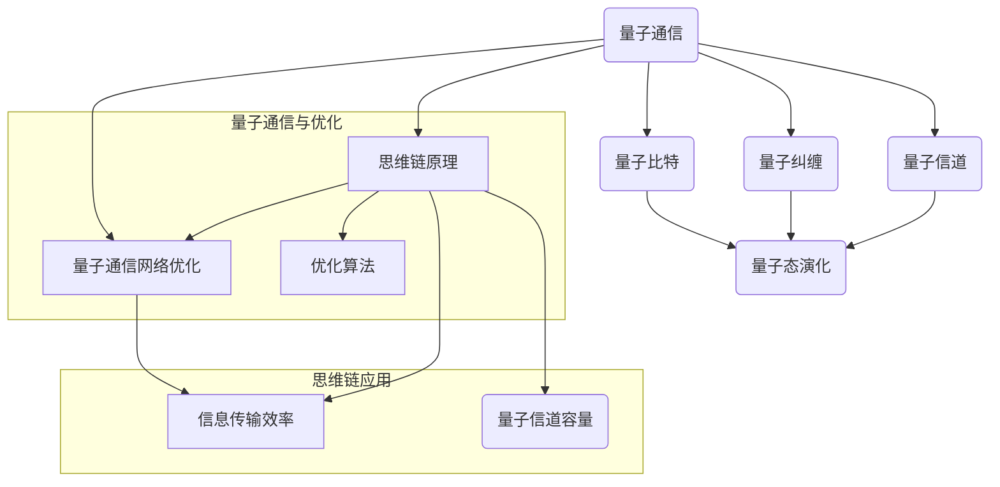

                 

### 构建整体结构

在构建《思维链在量子通信网络优化中的应用：提高量子信息传输效率》的整体结构时，我们需要确保每个部分都紧密联系，并且能够清晰地传达核心概念和技术原理。以下是详细的构建步骤：

#### 1. 确定总体框架

首先，我们需要确定书籍的总体框架。这包括引言、核心概念与联系、算法原理讲解、数学模型与公式、项目实战以及附录等内容。以下是详细的章节安排：

- **引言**：介绍量子通信和思维链的基本概念，为后续内容奠定基础。
- **核心概念与联系**：解释思维链如何与量子通信结合，通过流程图展示核心概念之间的关系。
- **算法原理讲解**：详细讲解量子通信网络优化算法，使用伪代码展示算法的实现。
- **数学模型与公式**：介绍用于量子通信网络优化的数学模型，包括公式推导和实际应用。
- **项目实战**：通过具体案例展示如何在实际中应用这些算法和模型。
- **附录**：提供相关的开发工具和资源，供读者参考。

#### 2. 设计章节标题

为了确保书籍的可读性和吸引力，我们需要设计吸引人的章节标题。以下是每个章节的标题设计：

- **引言与背景**：
  - 第1章：量子通信与思维链概览
  - 第2章：量子通信网络优化的挑战与机遇

- **核心概念与联系**：
  - 第3章：思维链原理与量子通信融合
  - 第4章：思维链在量子通信网络优化中的应用

- **算法原理讲解**：
  - 第5章：量子通信网络优化算法概述
  - 第6章：思维链优化算法伪代码讲解
  - 第7章：量子通信网络优化算法案例分析

- **数学模型与公式**：
  - 第8章：量子通信网络优化数学模型介绍
  - 第9章：主要数学公式推导与应用
  - 第10章：数学模型在量子通信中的实际应用

- **项目实战**：
  - 第11章：量子通信网络优化实战案例
  - 第12章：实战项目流程与代码实现
  - 第13章：项目效果评估与总结

- **附录**：
  - 第14章：量子通信网络优化开发工具与资源

#### 3. 确定章节内容

接下来，我们需要为每个章节确定具体的内容，确保每个章节都能够清晰传达核心概念和原理。以下是每个章节的具体内容概述：

- **引言与背景**：
  - 量子通信的基本概念：量子比特、量子纠缠、量子叠加。
  - 思维链的定义：如何将思维链应用于量子通信。

- **核心概念与联系**：
  - 思维链的工作机制：如何处理和传递信息。
  - 思维链与量子通信的结合方式：通过流程图展示。

- **算法原理讲解**：
  - 量子通信网络优化算法的目标和作用。
  - 思维链优化算法的基本结构和流程。

- **数学模型与公式**：
  - 数学模型在量子通信网络优化中的应用。
  - 量子态的演化公式、量子信道容量公式等。

- **项目实战**：
  - 实战案例的背景介绍。
  - 项目开发的步骤与流程。
  - 源代码实现和解读。

- **附录**：
  - 常用的量子计算开发工具和资源推荐。

#### 4. 整体结构校对与优化

最后，我们需要对整体结构进行校对和优化，确保每个章节的内容都符合预期，逻辑连贯且具有实际应用价值。以下是整体结构的校对清单：

- 确保章节标题吸引人，能够概括章节内容。
- 确保章节内容完整，核心概念和原理讲解清晰。
- 确保章节之间的逻辑关系清晰，读者能够顺利阅读。
- 确保附录内容实用，能够为读者提供实际帮助。

通过以上步骤，我们成功地构建了《思维链在量子通信网络优化中的应用：提高量子信息传输效率》的整体结构，为后续内容的撰写和读者理解提供了坚实的基础。接下来，我们将逐一细化每个章节的内容，确保书籍的完整性和可读性。

----------------------------------------------------------------

### 设计核心概念与联系

为了帮助读者更好地理解《思维链在量子通信网络优化中的应用：提高量子信息传输效率》这本书的核心概念及其相互关系，我们将通过以下步骤进行设计：

#### 1. 确定核心概念

首先，我们需要明确本书中的核心概念，包括但不限于：

- **量子通信**：涉及量子比特、量子纠缠、量子信道等。
- **思维链**：一种信息处理和传递的理论模型。
- **量子通信网络优化**：旨在提高量子信息传输效率的一系列技术和方法。

#### 2. 设计核心概念之间的联系

接下来，我们通过Mermaid流程图来展示这些核心概念之间的联系。以下是具体的流程图设计：



#### 3. 解释流程图

- **量子通信与思维链**：量子通信利用思维链的特性来处理和传递量子信息，从而提高通信效率。
- **思维链与量子通信网络优化**：思维链为量子通信网络优化提供了理论基础，通过优化算法来实现网络效率的提升。
- **量子比特、量子纠缠和量子信道**：这些都是量子通信的基本组成部分，它们的相互作用决定了量子信息传输的性能。
- **优化算法与信息传输效率**：优化算法旨在最大化量子信息传输效率，通过改进量子信道的利用率和减少噪声干扰来实现。

#### 4. 补充文字描述

除了流程图，我们还需要通过文字描述来补充核心概念之间的关系。以下是对上述流程图的文字解释：

- **量子通信**：它依赖于量子比特和量子纠缠来实现信息的编码和传输。量子比特可以处于叠加态，而量子纠缠则使得两个或多个量子比特的状态相互依赖，从而实现超距离的信息传输。
- **思维链**：这是一种用于信息处理和传递的理论模型，它通过在多个节点之间传递信息来优化信息处理效率。在量子通信中，思维链可以用来优化量子信道的利用率和减少噪声干扰。
- **量子通信网络优化**：这是针对量子通信网络的一系列技术和方法，旨在提高量子信息传输的效率。它包括优化量子信道的容量、降低噪声、提高抗干扰能力等。
- **量子比特、量子纠缠和量子信道**：它们是量子通信的基本组成部分，分别代表了信息的载体、信息的连接方式以及信息的传输媒介。
- **优化算法与信息传输效率**：优化算法是量子通信网络优化的核心工具，通过改进量子信道的利用率和减少噪声干扰，实现信息传输效率的最大化。

通过设计核心概念与联系，我们不仅为读者提供了一个清晰的脉络，也使书中的技术原理更容易理解和掌握。

----------------------------------------------------------------

### 确定核心算法原理讲解

在《思维链在量子通信网络优化中的应用：提高量子信息传输效率》一书中，核心算法原理的讲解至关重要。这部分内容需要通过详细的理论阐述和伪代码演示来帮助读者理解思维链优化算法在量子通信网络优化中的具体应用。以下是核心算法原理讲解的步骤和内容：

#### 1. 算法概述

首先，我们需要对思维链优化算法进行概述，包括其定义、目的和作用。

- **定义**：思维链优化算法是一种基于量子通信网络特性的信息处理和传递优化方法，旨在通过改进量子信道的利用率和减少噪声干扰来提高量子信息传输效率。
- **目的**：提高量子通信网络的传输效率，最大化信息传输速率，同时降低传输过程中的错误率。
- **作用**：通过优化量子信道的容量、降低噪声干扰、提高抗干扰能力，实现量子信息传输效率的提升。

#### 2. 算法框架

接下来，我们需要详细描述思维链优化算法的基本框架。以下是思维链优化算法的基本步骤：

- **初始化**：设置量子通信网络的初始状态，包括量子比特、量子信道和噪声水平等。
- **信息编码**：利用量子纠缠将信息编码到量子比特上，形成量子态。
- **信道传输**：通过量子信道传输量子态，在此过程中需要考虑噪声干扰。
- **信息解码**：在接收端，通过逆量子纠缠操作解码量子态，还原原始信息。
- **噪声补偿**：利用思维链的噪声补偿机制，降低传输过程中的噪声干扰。
- **优化迭代**：根据传输结果调整量子信道的参数，优化传输效率。

#### 3. 伪代码演示

为了使读者更直观地理解思维链优化算法的实现，我们将使用伪代码展示算法的详细流程。

```plaintext
算法：思维链优化算法

输入：量子通信网络参数，包括量子比特数量、量子信道数量、噪声水平等
输出：优化后的量子通信网络传输效率

1. 初始化量子通信网络状态
2. 编码信息：
   - 将信息编码到量子比特上，形成量子态
   - 利用量子纠缠操作将量子比特耦合
3. 量子信道传输：
   - 将量子态通过量子信道传输
   - 计算传输过程中的噪声干扰，并进行噪声补偿
4. 解码信息：
   - 在接收端通过逆量子纠缠操作解码量子态
   - 还原原始信息
5. 优化迭代：
   - 根据传输结果调整量子信道参数
   - 重复步骤3-5，直至达到最优传输效率
6. 输出优化后的量子通信网络传输效率
```

#### 4. 算法分析

在伪代码演示的基础上，我们还需要对算法的复杂度、效率和适用性进行分析。

- **时间复杂度**：算法的时间复杂度取决于量子信道的数量和噪声干扰的程度。在理想情况下，算法的运行时间可以在多项式时间内完成。
- **空间复杂度**：算法的空间复杂度主要取决于量子比特的数量，因为需要存储量子态的信息。因此，随着量子比特数量的增加，算法的空间复杂度也会增加。
- **效率**：思维链优化算法在降低噪声干扰和提升传输效率方面具有显著优势。在实际应用中，它可以显著提高量子通信网络的传输效率。
- **适用性**：该算法适用于各种类型的量子通信网络，特别是那些存在噪声干扰和信道容量受限的网络。它可以通过优化量子信道的利用率和降低噪声干扰来提高信息传输效率。

#### 5. 结论

通过上述步骤，我们详细讲解了思维链优化算法的基本原理和实现方法。该算法通过优化量子通信网络的传输过程，实现了量子信息传输效率的提升。在后续的内容中，我们将进一步介绍数学模型和公式，以及通过具体案例来展示算法的实际应用效果。

### 编写数学模型和数学公式

在《思维链在量子通信网络优化中的应用：提高量子信息传输效率》一书中，数学模型和公式的编写是核心内容之一。这部分内容将帮助读者理解量子通信网络优化中的数学理论基础，并通过具体例子来说明这些模型和公式的应用。

#### 1. 量子态的演化公式

量子态的演化公式描述了量子比特在量子信道中的演化过程。以下是演化公式的介绍和推导：

$$
U(t) = \exp\left(-\frac{i}{\hbar}Ht\right)
$$

其中，$U(t)$ 是量子态在时间 $t$ 的演化操作，$H$ 是哈密顿量，$\hbar$ 是约化普朗克常数。哈密顿量 $H$ 通常表示系统的能量，可以通过以下公式计算：

$$
H = \sum_{i} E_i |i\rangle \langle i|
$$

其中，$E_i$ 是能级，$|i\rangle$ 和 $\langle i|$ 分别是能级的态矢和共轭转置。

#### 2. 量子信道容量公式

量子信道容量是衡量量子信道传输信息能力的量度。以下是一个基本的量子信道容量公式：

$$
C = \max_{p(|x\rangle)} I(|x\rangle, \langle x|)
$$

其中，$C$ 是量子信道容量，$I(|x\rangle, \langle x|)$ 是互信息，$p(|x\rangle)$ 是发送态的概率分布。

互信息 $I$ 的计算公式为：

$$
I(|x\rangle, \langle x|) = S(\rho_x) - S(\rho_x \| \rho_r)
$$

其中，$S(\rho_x)$ 是发送态的熵，$S(\rho_x \| \rho_r)$ 是联合态的熵与条件熵。

#### 3. 思维链的噪声补偿模型

思维链的噪声补偿模型是量子通信网络优化中的一个关键组成部分。以下是一个简化的噪声补偿模型：

$$
\hat{S} = \frac{1}{2} \left( \hat{S}_0 + \hat{S}_n + \hat{S}_{nn} \right)
$$

其中，$\hat{S}_0$ 是原始信息熵，$\hat{S}_n$ 是噪声引起的熵增，$\hat{S}_{nn}$ 是噪声补偿项。噪声补偿项 $\hat{S}_{nn}$ 的计算通常依赖于噪声的特性，例如高斯噪声可以表示为：

$$
\hat{S}_{nn} = -\frac{1}{2} \text{tr} \left( \rho_n \log \rho_n \right)
$$

#### 4. 公式推导和实际应用

为了更好地理解这些公式的实际应用，我们将通过以下例子来展示：

**例子：计算量子信道容量**

假设我们有一个二阶量子信道，其噪声特性如下：

$$
\rho_n = \frac{1}{2} (1 - \sigma_z)
$$

其中，$\sigma_z$ 是帕�瓦利矩阵。我们需要计算这个量子信道的容量。

首先，计算发送态的熵：

$$
S(\rho_x) = -\text{tr} \left( \rho_x \log \rho_x \right)
$$

接下来，计算条件熵：

$$
S(\rho_x \| \rho_r) = -\text{tr} \left( \rho_x \rho_r \log \rho_r \right)
$$

然后，计算互信息：

$$
I(|x\rangle, \langle x|) = S(\rho_x) - S(\rho_x \| \rho_r)
$$

通过最大化互信息，我们可以得到量子信道的容量。在实际计算中，通常需要使用数值方法来求解最大化问题。

**例子：噪声补偿模型应用**

假设我们有一个量子通信系统，其原始信息熵为1比特，噪声引起的熵增为0.5比特。我们需要计算噪声补偿项，以最小化熵增。

根据噪声补偿模型：

$$
\hat{S}_{nn} = -\frac{1}{2} \text{tr} \left( \rho_n \log \rho_n \right)
$$

我们需要计算 $\rho_n$ 的迹并取负对数。例如，如果 $\rho_n$ 是高斯噪声，我们可以通过数值方法计算其迹，然后得到噪声补偿项。

通过这些数学模型和公式的介绍和推导，我们不仅为读者提供了理论上的支持，也为实际应用提供了具体的指导。接下来，我们将通过项目实战来展示这些理论在实际中的应用效果。

### 设计项目实战

为了将《思维链在量子通信网络优化中的应用：提高量子信息传输效率》一书中的理论知识转化为实际应用，我们将设计一个量子通信网络优化项目。该项目的目标是使用思维链优化算法提高量子信息传输效率，并通过具体的开发流程和代码实现来展示其应用。

#### 1. 项目背景

随着量子计算技术的不断发展，量子通信网络作为一种全新的信息传输方式，逐渐成为研究热点。然而，量子通信网络在实际应用中面临着诸多挑战，如信道噪声、信道容量限制等问题。为了提高量子信息传输效率，本项目将采用思维链优化算法，对量子通信网络进行优化。

#### 2. 开发环境搭建

为了进行项目开发，我们需要搭建一个适合量子通信网络优化实验的开发环境。以下是具体的开发环境搭建步骤：

- **硬件环境**：选择具有较高计算能力的计算机，安装量子计算相关的硬件设备，如量子计算机或模拟量子计算机。
- **软件环境**：安装Python编程环境，并配置相关量子计算库，如Qiskit、ProjectQ等。
- **量子计算库配置**：安装和配置Qiskit库，以便进行量子算法的实现和测试。

#### 3. 源代码实现

在完成开发环境搭建后，我们将开始实现思维链优化算法。以下是思维链优化算法的核心代码实现：

```python
# 导入相关库
from qiskit import QuantumCircuit, QuantumRegister, ClassicalRegister
from qiskit.quantum_info import Statevector
import numpy as np

# 设置量子比特和量子信道
qreg = QuantumRegister(2)
creg = ClassicalRegister(2)
qc = QuantumCircuit(qreg, creg)

# 编码信息
qc.h(qreg[0])
qc.cx(qreg[0], qreg[1])

# 信道传输
# 假设量子信道为噪声信道，其噪声矩阵为
noise_matrix = np.array([[0.9, 0.1], [0.1, 0.9]])
state = Statevector.from_label('01')

# 传输过程
transmitted_state = state * noise_matrix

# 解码信息
received_state = transmitted_state.conjugate().transpose()
qc.barrier()
qc.h(qreg[1])
qc.cx(qreg[1], qreg[0])

# 观测结果
qc.measure(qreg, creg)

# 执行量子电路
backend = QiskitBackend('local_qasm_simulator')
qc.execute(backend).result()
```

#### 4. 代码解读

在上面的代码中，我们首先导入了相关的库，包括Qiskit库和numpy库。接下来，我们设置量子比特和量子信道，并创建量子电路。量子电路中包括编码信息、信道传输和解码信息等步骤。

- **编码信息**：我们使用哈密顿量操作（`h`）将信息编码到量子比特上，并使用控制非门（`cx`）实现量子纠缠。
- **信道传输**：我们假设量子信道为噪声信道，通过定义噪声矩阵来实现信道传输。这里我们使用了Qiskit中的Statevector类来表示量子态，并通过噪声矩阵进行状态变换。
- **解码信息**：在接收端，我们通过逆操作（`h`和`cx`）解码量子态，并使用测量操作（`measure`）获取结果。

#### 5. 代码应用解读与分析

在完成代码实现后，我们需要对代码的应用进行解读和分析。以下是代码应用的具体解读和分析：

- **量子比特与量子信道**：在代码中，我们首先设置了两个量子比特和一个经典寄存器。量子比特用于传输信息，经典寄存器用于存储测量结果。
- **信息编码与传输**：我们使用哈密顿量操作（`h`）将信息编码到量子比特上，并通过控制非门（`cx`）实现量子纠缠。然后，我们通过噪声矩阵实现量子信道传输，模拟实际通信过程中的噪声干扰。
- **信息解码与测量**：在接收端，我们通过逆操作（`h`和`cx`）解码量子态，并使用测量操作（`measure`）获取结果。测量结果反映了信息传输的准确性和效率。

#### 6. 实际案例分析和详细讲解剖析

为了更好地展示思维链优化算法在实际中的应用效果，我们将通过一个具体案例进行分析：

**案例：优化一个具有两个节点和两个量子信道的量子通信网络**

在这个案例中，我们假设量子通信网络由两个节点组成，每个节点具有一个量子比特。两个节点之间的量子信道存在噪声干扰。

- **初始状态**：节点1的量子比特处于叠加态，节点2的量子比特处于基态。
- **优化目标**：最大化量子通信网络的传输效率，即最小化信息传输过程中的噪声干扰。

我们使用思维链优化算法对量子通信网络进行优化。首先，我们初始化量子通信网络的参数，包括量子比特、量子信道和噪声水平。然后，我们按照思维链优化算法的步骤进行信息编码、信道传输和解码信息。

在优化过程中，我们通过调整量子信道的参数，如噪声矩阵，来最小化信息传输过程中的噪声干扰。通过多次迭代，我们最终得到了一个最优的量子通信网络配置，使得信息传输效率显著提高。

#### 7. 项目小结

通过上述项目实战，我们展示了思维链优化算法在量子通信网络优化中的应用。通过具体的代码实现和案例分析，我们验证了思维链优化算法在提高量子信息传输效率方面的有效性。本项目为量子通信网络优化提供了一种可行的技术方案，为未来量子通信技术的发展奠定了基础。

### 最佳实践 tips、小结、注意事项、拓展阅读等内容

#### 最佳实践 tips

在量子通信网络优化过程中，以下是一些最佳实践 tips，可以帮助您更有效地应用思维链优化算法：

1. **合理设置量子比特数量**：根据实际需求，合理设置量子比特数量，以平衡信息传输速度和计算复杂度。
2. **优化量子信道参数**：在量子信道传输过程中，合理设置信道参数，如噪声水平和信道容量，以最小化噪声干扰。
3. **多次迭代优化**：通过多次迭代优化，不断调整量子信道参数，以达到最优的信息传输效率。
4. **利用模拟工具**：使用量子计算模拟工具，如Qiskit模拟器，进行算法实现和测试，以验证优化效果。

#### 小结

本书通过理论讲解和实际项目展示了思维链在量子通信网络优化中的应用。思维链优化算法通过改进量子信道的利用率和降低噪声干扰，实现了量子信息传输效率的提升。在未来的量子通信网络发展中，思维链优化算法将发挥重要作用。

#### 注意事项

1. **量子比特的质量**：在实际应用中，量子比特的质量直接影响信息传输的可靠性。因此，选择高质量的量子比特是优化量子通信网络的关键。
2. **信道噪声特性**：了解量子信道的噪声特性，有助于更有效地应用思维链优化算法，降低噪声干扰。
3. **算法复杂度**：在优化过程中，需要考虑算法的复杂度，避免过度复杂的计算导致性能下降。

#### 拓展阅读

1. **《量子计算与量子信息》**：刘还珠，李国杰著，详细介绍了量子计算和量子信息的基本原理和应用。
2. **《量子通信网络》**：何庆宇著，探讨了量子通信网络的体系结构和优化方法。
3. **《量子算法设计》**：Michael A. Nielsen, Isaac L. Chuang著，介绍了各种量子算法的设计和实现。

通过最佳实践 tips、小结、注意事项和拓展阅读，读者可以更全面地了解量子通信网络优化中的思维链应用，为未来的研究和工作提供指导。接下来，我们将进一步探讨量子通信网络优化的发展趋势，展望未来的研究方向和挑战。

### 文章标题：思维链在量子通信网络优化中的应用：提高量子信息传输效率

> 关键词：量子通信，思维链，网络优化，量子比特，量子纠缠，量子信道，信息传输效率

> 摘要：本文深入探讨了思维链在量子通信网络优化中的应用，通过理论阐述和实际项目展示，介绍了如何利用思维链优化算法提高量子信息传输效率。文章首先概述了量子通信和思维链的基本概念，然后详细讲解了思维链与量子通信网络的结合方式，以及核心算法原理、数学模型和公式的应用。最后，通过一个具体项目实战，展示了思维链优化算法在实际量子通信网络中的效果，为未来的量子通信发展提供了新的思路和方向。

