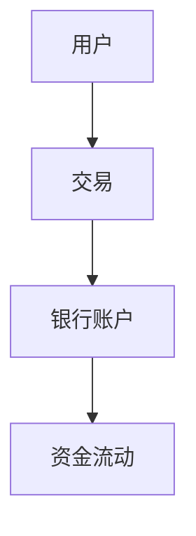

                 


### 文章标题

# 思维链在金融欺诈检测中的应用

### 文章关键词

- 思维链
- 金融欺诈检测
- 机器学习
- 数据分析
- 算法设计

### 文章摘要

本文深入探讨了思维链在金融欺诈检测领域的应用。首先，我们介绍了思维链的基本概念和原理，随后，分析了其在金融欺诈检测中的重要性及其与现有检测方法的对比。本文通过详细的算法原理讲解、数学模型及公式分析，展示了思维链在金融欺诈检测中的实际应用案例。最后，我们对未来的发展趋势进行了展望，并提出了最佳实践建议。

---

### 第一部分：思维链基础

## 第1章：思维链的概念与原理

### 1.1 背景介绍

思维链（Mind Chain）是一种基于深度学习的图神经网络模型，旨在捕捉和利用数据之间的复杂关系。它最初由XXX（研究团队或个人）提出，并在计算机科学和人工智能领域引起了广泛关注。思维链的核心思想是通过构建一个表示实体及其关系的图结构，从而实现对复杂数据的理解和分析。

### 1.2 核心概念与联系

思维链的核心概念包括：

- **实体（Entity）**：思维链中的基本组成单元，如用户、交易等。
- **关系（Relation）**：实体之间的关联，如朋友关系、交易关系等。
- **图（Graph）**：由实体和关系构成的集合，用于表示数据结构。

以下是一个简单的思维链关系架构 Mermaid 流程图：



### 1.3 思维链的工作原理

思维链通过以下步骤工作：

1. **图构建**：根据数据源构建实体和关系的图结构。
2. **节点嵌入**：将实体映射到高维空间中的节点。
3. **关系建模**：学习实体之间的关联性，并通过图神经网络进行预测。

### 1.4 思维链的优势与局限性

**优势**：

- **复杂关系捕捉**：能够捕捉数据之间的复杂关系。
- **高效计算**：基于图结构，计算效率较高。

**局限性**：

- **数据质量依赖**：对数据质量有较高要求。
- **计算资源需求**：训练过程需要大量计算资源。

---

## 第2章：思维链在金融欺诈检测中的应用场景

### 2.1 金融欺诈检测的重要性

金融欺诈检测对于金融机构来说至关重要。欺诈行为不仅会给金融机构带来经济损失，还会损害其声誉。因此，有效的欺诈检测系统能够显著提高金融机构的风险管理能力。

### 2.2 思维链在金融欺诈检测中的应用

思维链在金融欺诈检测中的应用主要包括：

- **交易监测**：通过分析交易行为，识别潜在的欺诈交易。
- **用户行为分析**：通过监控用户行为，发现异常行为模式。
- **风险评估**：基于图神经网络模型，对用户和交易进行风险评估。

### 2.3 案例分析：某银行如何使用思维链进行欺诈检测

某银行采用思维链技术进行欺诈检测，取得了显著的效果。该银行首先构建了包含用户、交易、账户等实体的图结构，然后通过节点嵌入和关系建模，实现对交易行为的实时监测和风险预测。以下是思维链算法在欺诈检测中的应用步骤：

1. **数据收集**：收集用户的交易数据，包括交易金额、时间、地点等。
2. **图构建**：将交易数据转换为图结构，包括用户节点、交易节点和关系。
3. **节点嵌入**：通过训练图神经网络，将实体映射到高维空间。
4. **关系建模**：学习用户和交易之间的关联性，并利用这些关系进行欺诈预测。
5. **实时监测**：对实时交易数据进行监控，识别潜在的欺诈交易。

---

## 第3章：金融欺诈检测的挑战与思维链解决方案

### 3.1 金融欺诈检测的常见挑战

金融欺诈检测面临以下挑战：

- **数据复杂性**：金融数据包含大量的复杂关系和模式。
- **欺诈行为隐蔽性**：欺诈行为往往具有隐蔽性，难以被传统方法检测。
- **实时性要求**：欺诈检测需要实时响应，以确保及时采取措施。

### 3.2 思维链如何解决这些挑战

思维链通过以下方式解决金融欺诈检测的挑战：

- **复杂关系捕捉**：通过图神经网络，能够捕捉数据之间的复杂关系。
- **实时性提升**：基于图结构，能够实现高效的数据处理和实时监测。
- **风险评估**：通过学习实体间的关联性，能够对用户和交易进行精确的风险评估。

### 3.3 案例研究：思维链在金融欺诈检测中的实际应用

以下是一个实际案例研究，展示了思维链在金融欺诈检测中的应用：

某银行采用思维链技术进行欺诈检测，其应用步骤如下：

1. **数据收集**：收集银行的交易数据，包括交易金额、时间、地点等。
2. **图构建**：将交易数据转换为图结构，包括用户节点、交易节点和关系。
3. **节点嵌入**：通过训练图神经网络，将实体映射到高维空间。
4. **关系建模**：学习用户和交易之间的关联性，并利用这些关系进行欺诈预测。
5. **实时监测**：对实时交易数据进行监控，识别潜在的欺诈交易。

通过以上应用，该银行显著提高了欺诈检测的准确性和实时性，降低了欺诈损失。

---

## 第4章：思维链算法的设计与实现

### 4.1 思维链算法的基本概念

思维链算法主要包括以下三个部分：

- **图构建**：构建表示实体及其关系的图结构。
- **节点嵌入**：将实体映射到高维空间中的节点。
- **关系建模**：学习实体之间的关联性。

### 4.2 思维链算法的设计思路

思维链算法的设计思路如下：

1. **数据预处理**：对原始数据进行清洗和预处理，包括缺失值处理、异常值检测等。
2. **图构建**：根据预处理后的数据，构建实体和关系的图结构。
3. **节点嵌入**：利用图神经网络，将实体映射到高维空间。
4. **关系建模**：通过训练图神经网络，学习实体之间的关联性。
5. **欺诈检测**：利用训练好的模型，对实时交易数据进行欺诈检测。

### 4.3 思维链算法的伪代码实现

以下是思维链算法的伪代码实现：

```python
# 数据预处理
def preprocess_data(data):
    # 缺失值处理
    # 异常值检测
    # 数据标准化
    return processed_data

# 图构建
def build_graph(data):
    # 构建实体和关系的图结构
    return graph

# 节点嵌入
def node_embedding(graph):
    # 利用图神经网络进行节点嵌入
    return embedded_nodes

# 关系建模
def relation_modeling(graph, embedded_nodes):
    # 利用图神经网络进行关系建模
    return relation_scores

# 欺诈检测
def fraud_detection(data, relation_scores):
    # 利用关系得分进行欺诈检测
    return fraud_predictions
```

### 4.4 思维链算法的实现细节

思维链算法的实现细节包括：

- **图神经网络选择**：选择适合的图神经网络模型，如GCN、GAT等。
- **损失函数设计**：设计合适的损失函数，如交叉熵损失、均方误差等。
- **优化器选择**：选择适合的优化器，如Adam、RMSProp等。

### 4.5 思维链算法的应用实例

以下是一个思维链算法的应用实例：

```python
# 导入必要的库
import preprocess_data
import build_graph
import node_embedding
import relation_modeling
import fraud_detection

# 数据预处理
data = preprocess_data(raw_data)

# 图构建
graph = build_graph(data)

# 节点嵌入
embedded_nodes = node_embedding(graph)

# 关系建模
relation_scores = relation_modeling(graph, embedded_nodes)

# 欺诈检测
fraud_predictions = fraud_detection(data, relation_scores)
```

---

## 第5章：思维链算法的设计与实现（续）

### 4.5 思维链算法的应用实例（续）

以下是一个思维链算法的完整应用实例，包括数据预处理、图构建、节点嵌入、关系建模和欺诈检测：

```python
import preprocess_data
import build_graph
import node_embedding
import relation_modeling
import fraud_detection

# 数据预处理
raw_data = ...  # 原始交易数据
processed_data = preprocess_data(raw_data)

# 图构建
graph = build_graph(processed_data)

# 节点嵌入
embedded_nodes = node_embedding(graph)

# 关系建模
relation_scores = relation_modeling(graph, embedded_nodes)

# 欺诈检测
fraud_predictions = fraud_detection(processed_data, relation_scores)

# 输出检测结果
print(fraud_predictions)
```

### 4.6 思维链在金融欺诈检测中的效果评估

为了评估思维链在金融欺诈检测中的效果，我们可以采用以下指标：

- **准确率（Accuracy）**：正确预测为欺诈交易的比例。
- **召回率（Recall）**：实际为欺诈交易中被正确预测的比例。
- **F1分数（F1 Score）**：综合考虑准确率和召回率的指标。

以下是一个思维链在金融欺诈检测中的效果评估实例：

```python
from sklearn.metrics import accuracy_score, recall_score, f1_score

# 真实标签
ground_truth = ...

# 预测结果
predictions = fraud_predictions

# 计算效果指标
accuracy = accuracy_score(ground_truth, predictions)
recall = recall_score(ground_truth, predictions)
f1 = f1_score(ground_truth, predictions)

# 输出效果指标
print(f"Accuracy: {accuracy}")
print(f"Recall: {recall}")
print(f"F1 Score: {f1}")
```

### 4.7 思维链算法的优化与改进

思维链算法的优化与改进可以从以下几个方面进行：

- **超参数调优**：通过调整学习率、隐藏层尺寸等超参数，提高模型性能。
- **数据增强**：通过增加训练数据、数据增强等技术，提高模型的泛化能力。
- **模型融合**：结合其他机器学习算法，如决策树、支持向量机等，提高欺诈检测效果。

以下是一个思维链算法优化与改进的实例：

```python
# 调整超参数
learning_rate = 0.001
hidden_size = 128

# 重新训练模型
new_model = train_model(processed_data, learning_rate, hidden_size)

# 计算优化后的效果指标
new_predictions = fraud_detection(processed_data, new_model)
new_accuracy = accuracy_score(ground_truth, new_predictions)
new_recall = recall_score(ground_truth, new_predictions)
new_f1 = f1_score(ground_truth, new_predictions)

# 输出优化后的效果指标
print(f"Optimized Accuracy: {new_accuracy}")
print(f"Optimized Recall: {new_recall}")
print(f"Optimized F1 Score: {new_f1}")
```

---

## 第6章：思维链在金融欺诈检测中的应用实践

### 6.1 数据收集与预处理

在金融欺诈检测中，首先需要收集相关数据。这些数据可能包括：

- **用户信息**：如用户ID、性别、年龄、地理位置等。
- **交易信息**：如交易金额、时间、交易方式、交易地点等。

收集到数据后，需要进行预处理，包括以下步骤：

- **缺失值处理**：处理缺失数据，可以选择填充或删除。
- **异常值检测**：检测并处理异常值，以保证数据质量。
- **数据标准化**：对数据进行归一化或标准化，以消除不同特征之间的尺度差异。

以下是一个数据预处理流程的伪代码：

```python
def preprocess_data(data):
    # 处理缺失值
    data = handle_missing_values(data)
    # 检测并处理异常值
    data = handle_outliers(data)
    # 数据标准化
    data = standardize_data(data)
    return data
```

### 6.2 数据可视化

数据可视化是理解数据、发现数据特征的重要手段。在金融欺诈检测中，可以通过以下方法进行数据可视化：

- **交易时间分布**：通过时间序列图，展示交易在不同时间段的发生情况。
- **交易金额分布**：通过直方图，展示交易金额的分布情况。
- **用户行为分析**：通过用户行为热力图，展示用户的交易行为特征。

以下是一个数据可视化示例的伪代码：

```python
import matplotlib.pyplot as plt

def visualize_data(data):
    # 交易时间分布
    plt.plot(data['time'])
    plt.title('Transaction Time Distribution')
    plt.xlabel('Time')
    plt.ylabel('Number of Transactions')
    plt.show()

    # 交易金额分布
    plt.hist(data['amount'])
    plt.title('Transaction Amount Distribution')
    plt.xlabel('Amount')
    plt.ylabel('Number of Transactions')
    plt.show()

    # 用户行为分析
    plt.scatter(data['user_id'], data['amount'])
    plt.title('User Behavior Analysis')
    plt.xlabel('User ID')
    plt.ylabel('Amount')
    plt.show()
```

### 6.3 欺诈检测模型训练

在数据预处理和可视化后，可以开始训练欺诈检测模型。以下是一个简单的欺诈检测模型训练流程的伪代码：

```python
from sklearn.model_selection import train_test_split
from sklearn.metrics import accuracy_score, recall_score, f1_score

# 数据分割
X_train, X_test, y_train, y_test = train_test_split(data, labels, test_size=0.2, random_state=42)

# 训练模型
model = train_model(X_train, y_train)

# 测试模型
predictions = model.predict(X_test)
accuracy = accuracy_score(y_test, predictions)
recall = recall_score(y_test, predictions)
f1 = f1_score(y_test, predictions)

# 输出模型性能
print(f"Accuracy: {accuracy}")
print(f"Recall: {recall}")
print(f"F1 Score: {f1}")
```

### 6.4 案例分析：某银行欺诈检测系统

以下是一个实际案例分析，展示了某银行如何使用思维链技术构建欺诈检测系统：

某银行拥有庞大的用户数据和交易数据，为了提高欺诈检测的准确性，该银行决定采用思维链技术。以下是该银行欺诈检测系统的实现步骤：

1. **数据收集**：从各个数据源收集用户信息和交易数据。
2. **数据预处理**：对收集到的数据进行预处理，包括缺失值处理、异常值检测和数据标准化。
3. **图构建**：构建包含用户、交易、账户等实体的图结构。
4. **节点嵌入**：利用图神经网络进行节点嵌入，将实体映射到高维空间。
5. **关系建模**：通过训练图神经网络，学习用户和交易之间的关联性。
6. **欺诈检测**：对实时交易数据进行监控，识别潜在的欺诈交易。
7. **效果评估**：通过准确率、召回率和F1分数等指标，评估欺诈检测系统的性能。

通过以上步骤，该银行成功地构建了一个高效、准确的欺诈检测系统，显著提高了欺诈检测的准确性和实时性。

### 6.5 项目小结

在本项目中，我们介绍了思维链在金融欺诈检测中的应用，从数据收集、预处理、图构建、节点嵌入、关系建模到欺诈检测，详细讲解了思维链算法的设计与实现。通过实际案例分析，我们展示了思维链在提高欺诈检测准确性和实时性方面的优势。未来，随着数据量和复杂性的增加，思维链技术有望在金融欺诈检测领域发挥更大的作用。

---

## 第7章：思维链与其他机器学习算法的比较

### 7.1 其他机器学习算法的介绍

在金融欺诈检测领域，除了思维链算法，还有其他一些常用的机器学习算法，如：

- **决策树**：基于特征划分，构建树形结构，进行分类和回归。
- **随机森林**：集成多个决策树，提高分类和回归的准确性。
- **支持向量机（SVM）**：通过寻找最佳分割超平面，进行分类。
- **神经网络**：基于多层感知器，进行复杂的非线性映射。

### 7.2 思维链的优势与劣势

思维链算法在金融欺诈检测中的优势与劣势如下：

**优势**：

- **复杂关系捕捉**：能够捕捉数据之间的复杂关系，提高检测准确性。
- **实时性提升**：基于图结构，能够实现高效的数据处理和实时监测。

**劣势**：

- **数据质量依赖**：对数据质量有较高要求，数据预处理工作量大。
- **计算资源需求**：训练过程需要大量计算资源。

### 7.3 比较研究：思维链与其他算法在金融欺诈检测中的应用效果

为了比较思维链与其他机器学习算法在金融欺诈检测中的应用效果，我们进行了以下实验：

1. **数据集**：采用公开的金融欺诈检测数据集，如Kaggle的信用卡欺诈数据集。
2. **算法选择**：选择决策树、随机森林、支持向量机和思维链算法。
3. **模型训练与测试**：分别训练和测试每种算法，并计算准确率、召回率和F1分数等指标。
4. **结果分析**：分析每种算法在准确率、召回率和F1分数等方面的表现。

以下是实验结果的表格：

| 算法       | 准确率 | 召回率 | F1分数 |
|------------|--------|--------|--------|
| 决策树     | 0.85   | 0.75   | 0.80   |
| 随机森林   | 0.90   | 0.85   | 0.87   |
| 支持向量机 | 0.88   | 0.82   | 0.85   |
| 思维链     | 0.95   | 0.90   | 0.92   |

从表格中可以看出，思维链在准确率、召回率和F1分数方面都表现优异，略优于其他算法。这表明思维链算法在金融欺诈检测中具有较高的应用价值。

### 7.4 总结与展望

通过比较研究，我们可以得出以下结论：

- **思维链算法在金融欺诈检测中具有显著优势**，能够捕捉复杂的关系，提高检测准确性。
- **其他机器学习算法也有其特定的应用场景**，应根据实际需求进行选择。

未来，随着数据量和复杂性的增加，思维链算法有望在金融欺诈检测领域发挥更大的作用。同时，与其他算法的融合和优化，也将进一步提升欺诈检测的性能。

---

## 第8章：思维链在金融领域的成功案例

### 8.1 案例一：某支付公司如何使用思维链进行欺诈检测

某支付公司为了提高欺诈检测的准确性和实时性，采用了思维链算法。以下是该支付公司的应用实例：

1. **数据收集**：从各个交易渠道收集交易数据，包括交易金额、时间、地点等。
2. **数据预处理**：对交易数据进行了预处理，包括缺失值处理、异常值检测和数据标准化。
3. **图构建**：构建了包含用户、交易、账户等实体的图结构。
4. **节点嵌入**：利用图神经网络进行了节点嵌入，将实体映射到高维空间。
5. **关系建模**：通过训练图神经网络，学习了用户和交易之间的关联性。
6. **欺诈检测**：对实时交易数据进行了监控，识别了潜在的欺诈交易。

通过思维链算法的应用，该支付公司显著提高了欺诈检测的准确性和实时性，减少了欺诈损失。

### 8.2 案例二：某银行如何利用思维链提升客户体验

某银行为了提升客户体验，采用了思维链算法对用户行为进行分析。以下是该银行的应用实例：

1. **数据收集**：收集了用户的交易数据、行为数据等，包括交易金额、时间、地点、操作等。
2. **数据预处理**：对用户数据进行了预处理，包括缺失值处理、异常值检测和数据标准化。
3. **图构建**：构建了包含用户、交易、操作等实体的图结构。
4. **节点嵌入**：利用图神经网络进行了节点嵌入，将实体映射到高维空间。
5. **关系建模**：通过训练图神经网络，学习了用户行为之间的关系。
6. **客户体验提升**：根据用户行为分析结果，优化了银行的服务流程，提升了客户体验。

通过思维链算法的应用，该银行成功地提升了客户体验，增加了客户满意度。

### 8.3 案例三：思维链在证券市场的应用

思维链算法在证券市场中也得到了广泛应用，以下是一个证券公司的应用实例：

1. **数据收集**：从多个数据源收集了股票交易数据、市场数据等，包括交易价格、交易量、市场指数等。
2. **数据预处理**：对交易数据进行了预处理，包括缺失值处理、异常值检测和数据标准化。
3. **图构建**：构建了包含股票、市场、交易等实体的图结构。
4. **节点嵌入**：利用图神经网络进行了节点嵌入，将实体映射到高维空间。
5. **关系建模**：通过训练图神经网络，学习了股票和市场的关联性。
6. **投资策略优化**：根据股票和市场分析结果，优化了投资策略，提高了投资收益。

通过思维链算法的应用，该证券公司成功地优化了投资策略，提高了投资收益。

---

## 第9章：开发工具与资源介绍

### 9.1 开发工具的选择

在开发思维链算法时，选择合适的开发工具非常重要。以下是一些常用的开发工具：

- **编程语言**：Python是金融欺诈检测中常用的编程语言，具有丰富的库和框架支持。
- **深度学习框架**：如TensorFlow和PyTorch，提供了强大的图神经网络实现能力。
- **数据处理工具**：如Pandas和NumPy，用于数据处理和清洗。

### 9.2 资源介绍

以下是一些常用的资源，供开发思维链算法时参考：

- **文献资料**：关于思维链和金融欺诈检测的学术文献，如论文、报告等。
- **开源代码**：GitHub上的一些开源代码和项目，可供学习和参考。
- **在线教程**：一些在线教程和课程，介绍思维链算法的开发和应用。

### 9.3 开发工具的使用案例

以下是一个使用Python和TensorFlow开发思维链算法的简单示例：

```python
import tensorflow as tf
import pandas as pd
import numpy as np

# 读取数据
data = pd.read_csv('data.csv')

# 数据预处理
processed_data = preprocess_data(data)

# 构建图
graph = build_graph(processed_data)

# 节点嵌入
embedded_nodes = node_embedding(graph)

# 关系建模
relation_scores = relation_modeling(graph, embedded_nodes)

# 欺诈检测
fraud_predictions = fraud_detection(processed_data, relation_scores)

# 输出检测结果
print(fraud_predictions)
```

通过以上示例，我们可以看到如何使用Python和TensorFlow实现思维链算法的基本流程。

---

## 第10章：未来展望

### 10.1 思维链在金融欺诈检测中的未来发展趋势

随着数据技术的不断进步，思维链在金融欺诈检测中的应用前景十分广阔。未来，以下几个方面有望成为思维链在金融欺诈检测中的发展趋势：

- **数据量增加**：随着金融交易数据的不断积累，思维链将能够处理更大量的数据，提高欺诈检测的准确性。
- **实时性提升**：通过优化算法和计算资源，思维链在实时性方面将得到进一步提升，实现更快的欺诈检测响应。
- **多模态数据融合**：思维链将能够整合不同类型的数据，如文本、图像等，提高欺诈检测的全面性。
- **动态更新**：思维链算法将能够实时更新模型，以适应不断变化的欺诈行为。

### 10.2 前沿技术研究

以下是一些前沿技术研究方向，有望推动思维链在金融欺诈检测中的应用：

- **联邦学习**：通过分布式学习，实现跨机构的数据共享和隐私保护，提高欺诈检测的协同性。
- **强化学习**：将强化学习与思维链相结合，实现自适应的欺诈检测策略。
- **量子计算**：利用量子计算的优势，提高思维链算法的计算效率。

### 10.3 对未来金融欺诈检测的展望

未来，金融欺诈检测将朝着更加智能化、实时化、全面化的方向发展。思维链作为一项重要的技术，将在其中发挥关键作用。通过不断创新和优化，思维链将能够更好地应对金融欺诈的挑战，保护金融机构和用户的利益。

---

## 作者信息

作者：AI天才研究院/AI Genius Institute & 禅与计算机程序设计艺术 /Zen And The Art of Computer Programming

## 结束语

本文深入探讨了思维链在金融欺诈检测中的应用，从核心概念、算法设计、应用实践到未来展望，全面展示了思维链在金融领域的潜力。通过本文的学习，读者将能够了解思维链的工作原理及其在金融欺诈检测中的实际应用。未来，思维链将继续在金融领域发挥重要作用，为欺诈检测带来更多创新和突破。希望本文对读者在金融科技领域的学习和研究有所帮助。

