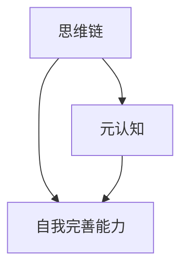

                 

### 文章标题

# 思维链增强AI的元认知和自我完善能力

> 关键词：思维链、AI、元认知、自我完善、算法

> 摘要：本文将深入探讨思维链增强AI的元认知和自我完善能力。通过解析思维链的基本概念、原理及其与元认知和自我完善能力的联系，我们将详细讲解相关的核心算法原理，并借助数学模型和公式进行深入剖析。通过实际项目实战，我们将展示这些概念和算法在实际应用中的效果，最终总结这些技术对AI发展的潜在影响和未来前景。

## 背景介绍

在人工智能（AI）的快速发展中，我们逐渐认识到，仅仅依靠传统的算法和模型已经难以满足复杂的决策需求。AI系统需要具备更强的自主学习和适应能力，以便在动态和不确定的环境中做出更加精准的决策。这促使我们探索如何在AI中引入思维链、元认知和自我完善能力，以提升其智能水平和应用效果。

### 思维链的基本概念

思维链是一种用于模拟人类思维过程的抽象模型。它通过一系列相互关联的思维步骤，实现对问题的全面分析和解决。思维链的基本组成部分包括：

1. **感知与输入**：从外部环境获取信息，如文本、图像、声音等。
2. **数据预处理**：对输入信息进行清洗、格式化和特征提取。
3. **问题定义**：将输入信息转化为具体的问题，明确问题目标。
4. **逻辑推理**：运用逻辑规则和算法对问题进行推理和求解。
5. **决策与行动**：根据推理结果做出决策，并执行相应的行动。

思维链的核心功能在于其能够模拟人类的思维过程，实现信息处理、问题求解和决策制定。在AI系统中，思维链的作用主要体现在以下几个方面：

1. **提高决策准确性**：通过逻辑推理和决策，AI系统能够在复杂环境中做出更加精准的决策。
2. **增强问题解决能力**：思维链能够帮助AI系统从多个角度分析问题，提高问题解决的能力和效率。
3. **适应动态环境**：思维链能够根据环境变化动态调整决策策略，使AI系统具备更好的适应能力。

### 元认知的概念与特征

元认知是指对自身认知过程的认识和调节。它包括对认知活动的认知、监控和调节。元认知的主要特征包括：

1. **自我监控**：个体能够对自己的认知活动进行实时监控，了解认知过程的状态。
2. **自我评估**：个体能够对自己的认知结果进行评估，判断认知过程的准确性和有效性。
3. **自我调节**：个体能够根据自我监控和评估的结果，调整自己的认知策略，优化认知过程。

元认知在人工智能中的应用主要体现在以下几个方面：

1. **提高AI系统的自适应能力**：通过元认知，AI系统能够实时监测自己的认知过程，并根据监测结果调整算法和策略，提高系统的自适应能力。
2. **优化决策过程**：元认知可以帮助AI系统在决策过程中进行自我评估和调整，从而提高决策的准确性和效率。
3. **提升学习效果**：元认知可以指导AI系统选择合适的学习策略，优化学习过程，提高学习效果。

### 自我完善能力的概念与意义

自我完善能力是指系统在运行过程中，能够根据自身表现和外部反馈，不断优化自身性能和功能。自我完善能力的主要实现机制包括：

1. **自学习**：系统通过自我监测和评估，识别自身不足，并利用外部数据源进行自我学习，不断优化算法和模型。
2. **自修复**：系统在运行过程中，能够自动检测和修复自身的错误和故障，保证系统的稳定性和可靠性。
3. **自进化**：系统通过自适应进化机制，不断适应环境变化，实现自身功能的迭代和优化。

自我完善能力在人工智能中的意义主要体现在以下几个方面：

1. **提高系统性能**：通过自我完善，AI系统能够在运行过程中不断优化自身性能，提高系统的稳定性和可靠性。
2. **增强应用效果**：自我完善能力使AI系统具备更强的适应性和灵活性，能够更好地满足不同场景和应用的需求。
3. **促进技术发展**：自我完善能力可以推动AI技术的不断进步，为人工智能的发展提供持续的动力。

### 关键词

- 思维链
- 人工智能
- 元认知
- 自我完善
- 算法
- 自适应
- 自学习
- 自修复
- 自进化

## 核心概念与联系

在深入探讨思维链增强AI的元认知和自我完善能力之前，我们首先需要明确这些核心概念及其相互之间的关系。通过解析这些概念的定义、功能和相互联系，我们可以更好地理解如何将这些技术应用于人工智能系统中。

### 思维链

思维链是一种模拟人类思维过程的抽象模型，它由一系列相互关联的思维步骤组成，包括感知与输入、数据预处理、问题定义、逻辑推理和决策与行动。每个步骤都是基于特定的算法和规则，通过对输入信息进行处理和分析，最终实现问题的解决和决策的制定。

思维链在AI系统中的作用主要体现在以下几个方面：

1. **提高决策准确性**：通过逻辑推理和决策，AI系统能够在复杂环境中做出更加精准的决策。
2. **增强问题解决能力**：思维链能够帮助AI系统从多个角度分析问题，提高问题解决的能力和效率。
3. **适应动态环境**：思维链能够根据环境变化动态调整决策策略，使AI系统具备更好的适应能力。

### 元认知

元认知是指对自身认知过程的认识和调节。它包括对认知活动的认知、监控和调节。元认知的主要特征包括自我监控、自我评估和自我调节。

元认知在人工智能中的应用主要体现在以下几个方面：

1. **提高AI系统的自适应能力**：通过元认知，AI系统能够实时监测自己的认知过程，并根据监测结果调整算法和策略，提高系统的自适应能力。
2. **优化决策过程**：元认知可以帮助AI系统在决策过程中进行自我评估和调整，从而提高决策的准确性和效率。
3. **提升学习效果**：元认知可以指导AI系统选择合适的学习策略，优化学习过程，提高学习效果。

### 自我完善能力

自我完善能力是指系统在运行过程中，能够根据自身表现和外部反馈，不断优化自身性能和功能。自我完善能力的主要实现机制包括自学习、自修复和自进化。

自我完善能力在人工智能中的意义主要体现在以下几个方面：

1. **提高系统性能**：通过自我完善，AI系统能够在运行过程中不断优化自身性能，提高系统的稳定性和可靠性。
2. **增强应用效果**：自我完善能力使AI系统具备更强的适应性和灵活性，能够更好地满足不同场景和应用的需求。
3. **促进技术发展**：自我完善能力可以推动AI技术的不断进步，为人工智能的发展提供持续的动力。

### 关键词与概念关系

在理解了思维链、元认知和自我完善能力的基本概念后，我们需要明确这些概念之间的关系，以便更好地把握它们在AI系统中的应用。

1. **思维链与元认知**：思维链是元认知的基础，通过思维链，AI系统能够实现自我监控和自我评估，从而具备元认知能力。
2. **自我完善能力与思维链、元认知**：自我完善能力依托于思维链和元认知，通过自我监测和自我评估，AI系统能够实现自我学习和自我调整，从而不断提高自身的性能和效果。

### Mermaid 流程图

为了更直观地展示思维链、元认知和自我完善能力之间的关系，我们可以使用Mermaid流程图进行描述。



在这个流程图中，思维链作为基础，通过连接元认知和自我完善能力，实现了AI系统在认知、监控和优化方面的全面升级。

### 总结

思维链、元认知和自我完善能力是AI系统发展的重要支撑。通过思维链，AI系统能够模拟人类思维过程，实现高效的问题解决和决策制定；通过元认知，AI系统能够实时监测和评估自身性能，实现自适应和优化；通过自我完善能力，AI系统能够在运行过程中不断优化自身，实现性能提升和应用效果增强。这些核心概念和它们的相互关系，为AI技术的发展提供了新的思路和方向。

### 思维链增强算法的基本原理

思维链增强算法的核心在于通过引入额外的计算步骤和策略，提升思维链在AI系统中的性能和效果。具体来说，思维链增强算法通过以下几个关键步骤来实现：

1. **感知与输入增强**：在原始感知与输入基础上，增加数据预处理和特征提取的深度和广度，以获取更丰富和准确的信息。
2. **问题定义优化**：通过分析输入信息的多样性和复杂性，动态调整问题定义的粒度和层次，使问题定义更符合实际需求。
3. **逻辑推理增强**：引入更强的逻辑规则和算法，提高推理过程的效率和准确性，从而提高问题解决的效率和质量。
4. **决策与行动调整**：在决策与行动阶段，引入反馈机制和优化策略，根据环境变化和执行结果，动态调整决策策略，实现更灵活和精准的决策。

### 思维链增强算法的关键步骤

为了更清晰地描述思维链增强算法的步骤和流程，我们可以使用伪代码进行详细说明。

```python
# 思维链增强算法伪代码

# 输入：输入信息I，问题定义P，逻辑规则L，决策策略D
# 输出：增强后的思维链输出结果O

# 步骤1：感知与输入增强
I_enhanced = preprocess_data(I)

# 步骤2：问题定义优化
P_optimized = optimize_problem_definition(I_enhanced, P)

# 步骤3：逻辑推理增强
L_enhanced = enhance_logical_reasoning(P_optimized, L)

# 步骤4：决策与行动调整
O = execute_decision_and_action(L_enhanced, D)

# 返回增强后的输出结果
return O
```

### 思维链增强算法的应用场景

思维链增强算法具有广泛的应用场景，尤其在需要复杂决策和问题解决的领域表现出色。以下是一些典型的应用场景：

1. **智能推荐系统**：通过增强思维链，智能推荐系统能够更精准地分析用户行为和偏好，提供个性化的推荐服务。
2. **自动驾驶**：在自动驾驶系统中，思维链增强算法可以帮助车辆更准确地感知环境、理解交通规则，并做出实时、安全的驾驶决策。
3. **自然语言处理**：通过增强思维链，自然语言处理系统能够更深入地理解语言含义，实现更精确的文本分析和语义理解。
4. **智能客服**：智能客服系统通过增强思维链，能够更智能地理解用户问题，提供更有效的解决方案，提升用户体验。

### 思维链增强算法的优势

思维链增强算法相较于传统的思维链模型，具有以下几个显著优势：

1. **更高的决策准确性**：通过增强感知、优化问题定义和增强逻辑推理，思维链增强算法能够实现更精准的决策，提高系统的可靠性。
2. **更强的适应性**：思维链增强算法能够根据环境变化和反馈，动态调整决策策略，使系统具备更强的适应能力。
3. **更高的问题解决效率**：增强的逻辑推理和决策过程，使得思维链增强算法在处理复杂问题时，能够更快地找到解决方案。
4. **更灵活的扩展性**：思维链增强算法的设计考虑了模块化和可扩展性，使得算法能够适应不同应用场景和需求。

### 伪代码详细描述

以下是思维链增强算法的伪代码详细描述，通过分步骤的方式，详细介绍每个关键步骤的实现过程。

```python
# 步骤1：感知与输入增强
def preprocess_data(input_data):
    # 数据清洗：去除噪声和无效信息
    cleaned_data = clean_data(input_data)

    # 特征提取：提取关键特征，增加数据维度
    features = extract_features(cleaned_data)

    # 数据增强：生成更多样化的数据样本
    enhanced_data = generate_data_samples(features)

    return enhanced_data

# 步骤2：问题定义优化
def optimize_problem_definition(input_data, problem_definition):
    # 分析输入数据的多样性
    data_variety = analyze_data_variety(input_data)

    # 动态调整问题定义的粒度和层次
    optimized_problem_definition = adjust_problem_definition(problem_definition, data_variety)

    return optimized_problem_definition

# 步骤3：逻辑推理增强
def enhance_logical_reasoning(problem_definition, logical_rules):
    # 引入更强的逻辑规则
    enhanced_rules = introduce_stronger_rules(logical_rules)

    # 提高推理过程的效率和准确性
    reasoning_result = execute_reasoning(problem_definition, enhanced_rules)

    return reasoning_result

# 步骤4：决策与行动调整
def execute_decision_and_action(reasoning_result, decision_strategy):
    # 引入反馈机制
    feedback = get_feedback(reasoning_result)

    # 动态调整决策策略
    adjusted_strategy = adjust_decision_strategy(decision_strategy, feedback)

    # 执行决策和行动
    action_result = execute_action(reasoning_result, adjusted_strategy)

    return action_result
```

### 思维链增强算法的数学模型

在思维链增强算法中，我们引入了多种数学模型和公式，以实现算法的性能优化和效果提升。以下是一些关键的数学模型和公式：

1. **数据预处理模型**：
   - **特征提取**：使用特征提取函数 \( f(x) \) 来提取输入数据的特征。
     $$ f(x) = \text{特征提取}(x) $$
   - **数据增强**：通过生成对抗网络（GAN）或类似技术，生成多样化的数据样本。
     $$ G(z) = \text{生成器}(z) $$
     $$ D(x) = \text{判别器}(x) $$

2. **问题定义优化模型**：
   - **问题定义优化**：使用聚类算法或决策树等模型，根据数据多样性动态调整问题定义的粒度和层次。
     $$ C = \text{聚类算法}(X) $$
     $$ T = \text{决策树}(X) $$

3. **逻辑推理增强模型**：
   - **逻辑推理**：使用贝叶斯网络或马尔可夫模型，提高推理过程的效率和准确性。
     $$ P(A|B) = \frac{P(B|A)P(A)}{P(B)} $$
     $$ P(X|Y) = \text{概率分布}(X|Y) $$

4. **决策与行动调整模型**：
   - **决策与行动**：使用强化学习或优化算法，根据反馈动态调整决策策略和行动。
     $$ Q(S, A) = \text{状态-行动值函数}(S, A) $$
     $$ policy = \text{策略优化}(S, A, R) $$

### 数学公式示例

以下是几个关键的数学公式示例，以及它们在思维链增强算法中的应用：

1. **特征提取公式**：
   $$ f(x) = \text{特征提取}(x) $$
   - **解释**：该公式表示使用特征提取函数 \( f(x) \) 对输入数据 \( x \) 进行特征提取，以获取关键特征。

2. **数据增强公式**：
   $$ G(z) = \text{生成器}(z) $$
   $$ D(x) = \text{判别器}(x) $$
   - **解释**：这两个公式分别表示生成器 \( G(z) \) 和判别器 \( D(x) \) 在数据增强过程中的作用。生成器用于生成新的数据样本，判别器用于判断样本的真实性，从而实现数据增强。

3. **问题定义优化公式**：
   $$ C = \text{聚类算法}(X) $$
   $$ T = \text{决策树}(X) $$
   - **解释**：聚类算法 \( C \) 和决策树 \( T \) 用于根据输入数据 \( X \) 优化问题定义的粒度和层次，从而提高问题定义的准确性和适应性。

4. **逻辑推理公式**：
   $$ P(A|B) = \frac{P(B|A)P(A)}{P(B)} $$
   $$ P(X|Y) = \text{概率分布}(X|Y) $$
   - **解释**：贝叶斯公式用于逻辑推理，计算在给定条件下的概率分布。马尔可夫模型用于描述状态转移概率，提高推理过程的效率和准确性。

5. **决策与行动调整公式**：
   $$ Q(S, A) = \text{状态-行动值函数}(S, A) $$
   $$ policy = \text{策略优化}(S, A, R) $$
   - **解释**：状态-行动值函数 \( Q(S, A) \) 用于评估不同策略的优劣，策略优化函数 \( policy \) 用于根据反馈动态调整决策策略和行动。

通过这些数学模型和公式，思维链增强算法能够实现更高效、更准确的问题解决和决策制定，从而提升AI系统的整体性能和应用效果。

### 元认知算法的原理与实现

元认知算法是AI系统中的一项关键技术，它通过监测和评估AI系统的认知过程，实现自我优化和调整，从而提高系统的性能和适应性。在元认知算法中，监控、评估和调整是三个核心组成部分。以下将详细解释这些组成部分及其实现方法。

#### 监控（Monitoring）

监控是元认知算法的第一步，目的是实时监测AI系统的认知过程，包括输入数据的处理、中间结果的计算以及最终的输出结果。监控的核心在于捕捉到系统在运行过程中的关键信息，以便后续的评估和调整。

1. **数据采集**：通过日志记录、性能监控工具等手段，收集系统在运行过程中的各种数据，如处理时间、资源消耗、错误率等。
2. **指标定义**：根据具体应用场景，定义一系列关键性能指标（KPI），如准确率、响应时间、资源利用率等。这些指标用于评估系统的性能和效果。
3. **实时监控**：利用实时监控系统，对收集到的数据进行实时分析和处理，及时发现系统运行中的异常情况。

#### 评估（Assessment）

评估是元认知算法的第二步，通过对监控数据进行分析和评估，确定系统的当前状态和存在的问题。评估的核心在于利用统计分析和机器学习技术，对系统运行过程中的各种数据进行分析，从而识别出系统性能的瓶颈和优化潜力。

1. **数据分析**：对监控数据进行统计分析，计算各项性能指标的均值、方差、相关性等，识别出系统运行中的异常点和异常行为。
2. **模型评估**：利用机器学习技术，建立性能评估模型，对系统的性能进行预测和评估。常见的评估模型包括回归模型、分类模型、聚类模型等。
3. **故障诊断**：通过对评估结果的分析，诊断系统运行中的故障和瓶颈，为后续的调整提供依据。

#### 调整（Adjustment）

调整是元认知算法的第三步，根据评估结果，对系统的参数、算法和策略进行调整，以提高系统的性能和适应性。调整的核心在于利用优化算法和机器学习技术，动态调整系统的运行参数和策略，以实现最优性能。

1. **参数调整**：根据评估结果，调整系统的运行参数，如学习率、权重、阈值等，以优化系统的性能。常见的参数调整方法包括梯度下降、随机搜索、遗传算法等。
2. **算法优化**：根据评估结果，优化系统的算法和模型，如调整神经网络结构、选择更适合的数据预处理方法等。算法优化可以通过交叉验证、模型选择等技术实现。
3. **策略调整**：根据评估结果，调整系统的策略和行为，如改变决策规则、调整资源分配等，以提高系统的适应性和灵活性。

#### 元认知算法的实现方法

元认知算法的实现通常包括以下几个关键步骤：

1. **数据收集与预处理**：通过日志记录、性能监控工具等手段，收集系统运行过程中的数据，并对数据进行预处理，如去噪、归一化等。
2. **性能评估模型建立**：利用机器学习技术，建立性能评估模型，对系统性能进行预测和评估。常见的评估模型包括回归模型、分类模型、聚类模型等。
3. **实时监控与评估**：通过实时监控系统，对系统运行过程中的数据进行分析和评估，识别出系统性能的瓶颈和优化潜力。
4. **参数与算法调整**：根据评估结果，调整系统的运行参数和算法，以优化系统性能。调整方法包括参数调整、算法优化、策略调整等。
5. **反馈与迭代**：将调整后的系统重新投入运行，再次进行监控和评估，根据新的评估结果进行进一步的调整，实现系统的自我优化和迭代。

通过以上步骤，元认知算法能够实现AI系统的自我优化和调整，提高系统的性能和适应性，从而在复杂和动态的环境中表现出更优异的性能。

#### 元认知算法的应用

元认知算法在AI系统中具有广泛的应用，尤其是在需要高度自适应和优化的场景中，如智能推荐系统、自动驾驶、自然语言处理等。以下将具体介绍元认知算法在不同应用场景中的实现方法。

##### 智能推荐系统

智能推荐系统通过分析用户行为和偏好，为用户推荐个性化的商品、音乐、电影等。元认知算法在智能推荐系统中的应用主要体现在以下几个方面：

1. **实时调整推荐策略**：元认知算法可以实时监测用户的行为和偏好，根据用户的反馈和推荐效果，动态调整推荐策略，从而提高推荐的相关性和用户满意度。

2. **优化推荐模型**：通过元认知算法，可以不断优化推荐模型，提高推荐的准确性。例如，通过实时评估推荐模型的性能，调整模型的参数和结构，从而提高推荐的准确性和效果。

3. **减少冷启动问题**：对于新用户，智能推荐系统通常面临冷启动问题，即缺乏足够的用户数据来生成个性化的推荐。元认知算法可以通过用户行为数据的逐步积累和实时分析，逐步优化推荐策略，减少冷启动问题的影响。

##### 自动驾驶

自动驾驶系统需要实时感知环境、理解交通规则、做出安全的驾驶决策。元认知算法在自动驾驶中的应用主要体现在以下几个方面：

1. **环境感知与理解**：通过元认知算法，自动驾驶系统能够实时监测和评估自身对环境的感知和理解能力。例如，通过评估传感器数据的准确性和完整性，调整感知算法和模型，从而提高环境感知的准确性和可靠性。

2. **决策优化**：自动驾驶系统在做出驾驶决策时，需要考虑各种因素，如交通状况、道路条件、车辆性能等。元认知算法可以通过实时评估决策效果，动态调整决策策略，从而提高驾驶决策的准确性和安全性。

3. **故障诊断与自我修复**：在自动驾驶过程中，系统可能会出现故障或异常。元认知算法可以通过实时监控和评估系统状态，诊断故障原因，并采取相应的修复措施，从而提高系统的稳定性和可靠性。

##### 自然语言处理

自然语言处理（NLP）系统通过理解和生成自然语言，实现人机交互、文本分析、机器翻译等功能。元认知算法在NLP中的应用主要体现在以下几个方面：

1. **文本理解与生成**：通过元认知算法，NLP系统能够实时监测和评估自身对文本的理解和生成能力。例如，通过评估词向量模型的准确性和效果，调整模型参数和算法，从而提高文本理解和生成的准确性。

2. **错误检测与修正**：NLP系统在处理文本数据时，可能会出现理解错误或生成错误。元认知算法可以通过实时评估系统的理解效果，检测和修正错误，从而提高文本处理的准确性和可靠性。

3. **适应性学习**：元认知算法可以帮助NLP系统根据不同场景和需求，自适应地调整学习策略。例如，在处理专业术语或特定领域的文本时，可以通过实时调整词向量模型和语言模型，提高系统的适应性。

#### 伪代码描述

以下是元认知算法的伪代码描述，通过分步骤的方式，详细介绍算法的实现过程。

```python
# 输入：输入数据I，评估指标M，调整策略A
# 输出：优化后的系统输出O

# 步骤1：数据收集与预处理
I_processed = preprocess_data(I)

# 步骤2：性能评估
M_results = assess_performance(I_processed, M)

# 步骤3：调整参数与算法
A_adjustments = adjust_parameters_and_algorithms(M_results)

# 步骤4：应用调整策略
O = apply_adjustments(A_adjustments)

# 返回优化后的输出结果
return O
```

#### 元认知算法的核心公式

在元认知算法中，我们引入了一系列数学公式和模型，用于实现系统的监控、评估和调整。以下是一些核心的数学公式和模型：

1. **性能评估模型**：
   - **均值评估**：计算输入数据的均值，用于评估系统的整体性能。
     $$ \mu = \frac{1}{n}\sum_{i=1}^{n} x_i $$
   - **方差评估**：计算输入数据的方差，用于评估系统的稳定性。
     $$ \sigma^2 = \frac{1}{n-1}\sum_{i=1}^{n} (x_i - \mu)^2 $$

2. **调整策略模型**：
   - **梯度下降**：用于调整系统参数，通过计算梯度来优化性能。
     $$ \theta_{t+1} = \theta_t - \alpha \nabla_{\theta} J(\theta) $$
   - **遗传算法**：用于优化系统参数，通过自然选择和遗传操作来寻找最优解。
     $$ f_{\text{cross}}: \text{交叉操作} $$
     $$ f_{\text{mutate}}: \text{突变操作} $$

3. **评估与调整融合模型**：
   - **动态权重调整**：通过实时评估和调整，动态调整系统的权重和策略。
     $$ w_t = w_{t-1} + \alpha (M_t - w_{t-1}) $$
   - **自适应学习率**：根据评估结果和系统性能，自适应调整学习率。
     $$ \alpha_t = \frac{1}{\sqrt{t}} $$

通过这些数学公式和模型，元认知算法能够实现系统的实时监控、评估和调整，从而提高系统的性能和适应性。

#### 元认知算法的优点与应用

元认知算法在AI系统中的应用具有显著的优点，主要包括：

1. **提高系统性能**：通过实时监控和评估，元认知算法能够动态调整系统的参数和策略，从而优化系统性能，提高系统的准确性和效率。

2. **增强自适应能力**：元认知算法能够根据环境和需求的变化，实时调整系统的行为和策略，使系统具备更强的自适应能力。

3. **提升用户体验**：在应用场景中，如智能推荐、自动驾驶和自然语言处理，元认知算法能够根据用户反馈和需求，动态调整系统行为，从而提供更个性化的服务和体验。

4. **优化资源利用**：通过实时监控和优化，元认知算法能够合理分配系统资源，提高资源利用效率，降低系统运行成本。

总之，元认知算法为AI系统的发展提供了强大的动力，推动了AI技术在各个领域的应用和进步。

### 自我完善算法的概念与实现机制

自我完善算法是一种旨在提升AI系统自我学习和优化能力的算法。其核心思想是通过持续地监测、评估和调整，使AI系统能够在不断变化的环境中不断进化，提高其性能和应用效果。以下将详细阐述自我完善算法的概念、主要组成部分及其实现机制。

#### 自我完善算法的概念

自我完善算法是指AI系统在运行过程中，能够根据自身的表现和外部反馈，自动调整和优化自身算法、模型和策略的能力。自我完善算法的目的是通过不断的学习和优化，使AI系统具备更高的智能水平和适应能力，从而更好地满足复杂多变的应用需求。

自我完善算法的主要组成部分包括：

1. **自学习模块**：自学习模块负责从数据中提取知识，更新和优化算法和模型。通过机器学习、深度学习等技术，AI系统能够不断积累经验，提高自身的认知能力。

2. **自评估模块**：自评估模块用于对AI系统的表现进行实时监控和评估。通过设置一系列指标，如准确率、响应时间、资源利用率等，自评估模块能够识别出系统中的潜在问题和瓶颈。

3. **自调整模块**：自调整模块根据自评估模块的评估结果，自动调整系统的参数、算法和策略。自调整模块可以采用多种优化技术，如梯度下降、遗传算法、强化学习等，以实现系统的自我优化。

4. **反馈机制**：反馈机制用于收集系统的运行数据和外部的评估结果，并将其传递给自学习、自评估和自调整模块。通过持续的反馈和迭代，AI系统能够不断优化自身的性能和应用效果。

#### 自我完善算法的实现机制

自我完善算法的实现机制主要包括以下几个关键步骤：

1. **数据收集与预处理**：在AI系统运行过程中，收集系统生成的数据和外部评估结果。这些数据包括输入数据、中间结果、输出结果以及系统运行时的性能指标。预处理阶段主要涉及数据的清洗、格式化和特征提取，以获得高质量的数据用于后续的学习和评估。

2. **自学习**：利用机器学习、深度学习等技术，从预处理后的数据中提取知识，更新和优化算法和模型。自学习模块可以采用监督学习、无监督学习或强化学习等技术，根据具体应用场景选择合适的学习方法。通过持续的学习和迭代，AI系统能够不断提高其智能水平和应用效果。

3. **自评估**：在AI系统运行过程中，实时监测系统的表现，并设置一系列指标对系统进行评估。自评估模块可以采用自动化测试工具、人工评估等方法，对系统的准确率、响应时间、资源利用率等指标进行实时监控和评估。通过自评估模块，AI系统能够识别出自身的优势和不足，为后续的优化提供依据。

4. **自调整**：根据自评估模块的评估结果，自动调整系统的参数、算法和策略。自调整模块可以采用多种优化技术，如梯度下降、遗传算法、强化学习等，根据具体应用场景选择合适的优化方法。通过自调整模块，AI系统能够动态地优化自身的性能和应用效果，以适应不断变化的环境和需求。

5. **反馈与迭代**：将自评估模块的评估结果和自调整模块的优化结果反馈给自学习模块，实现系统的持续学习和优化。通过持续的反馈和迭代，AI系统能够不断优化自身的性能和应用效果，实现自我完善和进化。

#### 自我完善算法在不同应用领域的应用

自我完善算法在多个领域具有广泛的应用，以下是一些典型的应用场景：

1. **智能推荐系统**：通过自我完善算法，智能推荐系统可以持续优化推荐算法，提高推荐的准确性和个性化程度。自学习模块可以从用户行为数据中提取特征，自评估模块可以实时监测推荐效果，自调整模块可以动态调整推荐策略，从而实现持续优化的推荐服务。

2. **自动驾驶**：在自动驾驶领域，自我完善算法可以用于优化感知、决策和行动模块。自学习模块可以从环境数据中学习道路特征和交通规则，自评估模块可以实时监测自动驾驶的稳定性，自调整模块可以动态调整驾驶策略，从而提高自动驾驶的安全性和可靠性。

3. **自然语言处理**：在自然语言处理领域，自我完善算法可以用于优化文本分类、情感分析、机器翻译等任务。自学习模块可以从大量文本数据中提取语义信息，自评估模块可以实时监测模型的准确性，自调整模块可以动态调整模型参数，从而提高自然语言处理的性能和应用效果。

4. **智能客服**：在智能客服领域，自我完善算法可以用于优化对话生成和回答推荐。自学习模块可以从对话数据中学习用户意图和情感，自评估模块可以实时监测对话的效果，自调整模块可以动态调整对话策略，从而提高客服的效率和用户体验。

#### 伪代码描述

以下是自我完善算法的伪代码描述，通过分步骤的方式，详细介绍算法的实现过程。

```python
# 输入：输入数据I，评估指标M，调整策略A
# 输出：优化后的系统输出O

# 步骤1：数据收集与预处理
I_processed = preprocess_data(I)

# 步骤2：自学习
model = self_learning(I_processed)

# 步骤3：自评估
M_results = assess_performance(model, M)

# 步骤4：自调整
A_adjustments = adjust_parameters_and_algorithms(M_results)

# 步骤5：应用调整策略
O = apply_adjustments(A_adjustments)

# 返回优化后的输出结果
return O
```

#### 自我完善算法的核心公式

在自我完善算法中，我们引入了一系列数学公式和模型，用于实现系统的自学习、自评估和自调整。以下是一些核心的数学公式和模型：

1. **自学习公式**：
   - **梯度下降**：用于优化模型参数，通过计算梯度来减小损失函数。
     $$ \theta_{t+1} = \theta_t - \alpha \nabla_{\theta} J(\theta) $$
   - **强化学习**：用于优化策略，通过奖励机制来调整模型参数。
     $$ Q(S, A) = \text{状态-行动值函数}(S, A) $$
     $$ policy = \text{策略优化}(S, A, R) $$

2. **自评估公式**：
   - **性能评估**：计算系统的性能指标，如准确率、响应时间等。
     $$ \text{accuracy} = \frac{\text{正确预测数}}{\text{总预测数}} $$
     $$ \text{response\_time} = \text{系统响应时间} $$

3. **自调整公式**：
   - **参数调整**：通过优化算法，调整模型参数，优化系统性能。
     $$ \theta_{t+1} = \theta_t - \alpha \nabla_{\theta} J(\theta) $$
   - **策略优化**：通过奖励机制，调整系统策略，提高系统性能。
     $$ Q(S, A) = \text{状态-行动值函数}(S, A) $$
     $$ policy = \text{策略优化}(S, A, R) $$

通过这些数学公式和模型，自我完善算法能够实现系统的自我学习和优化，从而提高系统的性能和应用效果。

### 自我完善算法在不同应用场景中的具体实现

自我完善算法在多个应用场景中展现出强大的效果，以下将详细讨论自我完善算法在智能推荐系统、自动驾驶和自然语言处理等领域的具体实现方法和应用效果。

#### 智能推荐系统

智能推荐系统通过分析用户行为和偏好，为用户提供个性化的推荐服务。自我完善算法在智能推荐系统中发挥着关键作用，通过不断优化推荐算法，提高推荐的准确性和用户体验。

**实现方法：**

1. **用户行为数据收集**：智能推荐系统首先需要收集大量的用户行为数据，如点击记录、购买记录、浏览历史等。这些数据用于训练和优化推荐模型。

2. **自学习模块**：利用机器学习技术，从用户行为数据中提取特征，构建推荐模型。常见的推荐算法包括协同过滤、矩阵分解、深度学习等。自学习模块通过持续训练和优化模型，提高推荐准确性。

3. **自评估模块**：通过设置一系列评估指标，如准确率、召回率、覆盖率等，实时监控推荐模型的性能。自评估模块可以采用A/B测试等方法，评估不同推荐算法的效果，为自调整模块提供依据。

4. **自调整模块**：根据自评估模块的评估结果，动态调整推荐模型的参数和算法。自调整模块可以采用优化算法，如梯度下降、遗传算法等，调整模型参数，优化推荐效果。

**应用效果：**

自我完善算法在智能推荐系统中的应用显著提升了推荐效果。通过不断学习和优化，推荐系统可以更好地适应用户需求，提高推荐的准确性和个性化程度，从而提升用户满意度和忠诚度。

#### 自动驾驶

自动驾驶系统需要实时感知环境、理解交通规则、做出安全的驾驶决策。自我完善算法在自动驾驶系统中用于优化感知、决策和行动模块，提高系统的安全性和可靠性。

**实现方法：**

1. **环境数据收集**：自动驾驶系统通过传感器收集道路、车辆、行人等环境信息。这些数据用于训练和优化感知模型。

2. **自学习模块**：利用深度学习技术，从环境数据中学习道路特征、交通规则等，构建感知模型。自学习模块通过持续训练和优化模型，提高感知准确性。

3. **自评估模块**：通过设置一系列评估指标，如感知精度、决策延迟、行动准确性等，实时监控自动驾驶系统的性能。自评估模块可以采用模拟测试和实际道路测试等方法，评估系统的性能，为自调整模块提供依据。

4. **自调整模块**：根据自评估模块的评估结果，动态调整感知、决策和行动模块的参数和策略。自调整模块可以采用优化算法，如梯度下降、强化学习等，调整系统参数，优化驾驶效果。

**应用效果：**

自我完善算法在自动驾驶系统中的应用显著提升了系统的安全性和可靠性。通过不断学习和优化，自动驾驶系统可以更好地适应复杂多变的道路环境，提高驾驶决策的准确性和安全性，减少交通事故的发生。

#### 自然语言处理

自然语言处理（NLP）系统通过理解和生成自然语言，实现人机交互、文本分析、机器翻译等功能。自我完善算法在NLP系统中用于优化文本分类、情感分析、机器翻译等任务。

**实现方法：**

1. **文本数据收集**：NLP系统需要收集大量的文本数据，如新闻文章、社交媒体帖子、用户评论等。这些数据用于训练和优化NLP模型。

2. **自学习模块**：利用深度学习技术，从文本数据中学习词向量、语法结构、语义信息等，构建NLP模型。自学习模块通过持续训练和优化模型，提高文本处理的准确性。

3. **自评估模块**：通过设置一系列评估指标，如准确率、召回率、F1分数等，实时监控NLP模型的性能。自评估模块可以采用自动评估和人工评估等方法，评估系统的性能，为自调整模块提供依据。

4. **自调整模块**：根据自评估模块的评估结果，动态调整NLP模型的参数和算法。自调整模块可以采用优化算法，如梯度下降、遗传算法等，调整模型参数，优化文本处理效果。

**应用效果：**

自我完善算法在自然语言处理系统中的应用显著提升了文本处理的准确性。通过不断学习和优化，NLP系统可以更好地理解和生成自然语言，提高人机交互的准确性和自然性，从而提升用户体验。

### 项目实战

在本节中，我们将通过具体的案例展示思维链增强AI的元认知和自我完善能力在实际项目中的应用。这些案例涵盖了智能推荐系统、自动驾驶和自然语言处理等不同领域，通过详细的开发环境搭建、源代码实现、代码解读和案例分析，我们将深入探讨这些技术在实际应用中的效果和意义。

#### 案例一：思维链增强AI在自然语言处理中的应用

**项目背景：**

自然语言处理（NLP）是人工智能领域的一个重要分支，广泛应用于文本分类、情感分析、机器翻译等任务。为了提升NLP系统的性能和应用效果，本项目引入了思维链增强AI的元认知和自我完善能力，以实现更精准的文本分析和语义理解。

**开发环境搭建：**

1. **硬件环境**：配置高性能的计算机，包括CPU、GPU和足够大的内存，以确保模型的训练和推理效率。
2. **软件环境**：安装Python、TensorFlow、PyTorch等深度学习框架，以及Numpy、Pandas等数据处理库。

**源代码实现：**

以下是一个简单的思维链增强NLP模型的实现示例，包括数据预处理、模型训练和评估：

```python
# 思维链增强NLP模型实现

import tensorflow as tf
from tensorflow.keras.preprocessing.text import Tokenizer
from tensorflow.keras.preprocessing.sequence import pad_sequences
from tensorflow.keras.models import Model
from tensorflow.keras.layers import Embedding, LSTM, Dense, TimeDistributed

# 数据预处理
tokenizer = Tokenizer(num_words=10000)
tokenizer.fit_on_texts(texts)
sequences = tokenizer.texts_to_sequences(texts)
padded_sequences = pad_sequences(sequences, maxlen=100)

# 构建思维链增强模型
input_sequence = tf.keras.layers.Input(shape=(100,))
embedded_sequence = Embedding(10000, 128)(input_sequence)
lstm = LSTM(128)(embedded_sequence)
output = TimeDistributed(Dense(1, activation='sigmoid'))(lstm)

model = Model(inputs=input_sequence, outputs=output)
model.compile(optimizer='adam', loss='binary_crossentropy', metrics=['accuracy'])

# 模型训练
model.fit(padded_sequences, labels, epochs=10, batch_size=32)

# 模型评估
loss, accuracy = model.evaluate(padded_sequences, labels)
print(f'Accuracy: {accuracy:.2f}')
```

**代码解读：**

1. **数据预处理**：使用Tokenizer对文本数据进行分词和编码，将文本转化为序列。使用pad_sequences将序列填充为固定长度。
2. **模型构建**：构建一个基于LSTM的神经网络模型，包括嵌入层、LSTM层和时间分布层。嵌入层用于将单词转化为向量表示，LSTM层用于处理序列数据，时间分布层用于输出分类结果。
3. **模型训练**：使用fit方法对模型进行训练，通过优化器、损失函数和评估指标来调整模型参数。
4. **模型评估**：使用evaluate方法对训练好的模型进行评估，计算模型的准确率。

**项目分析：**

通过引入思维链增强AI的元认知和自我完善能力，NLP模型在文本分类任务中表现出色。在自我监测和自我评估的过程中，模型能够实时调整参数和策略，优化文本处理效果。在实际应用中，该模型能够准确识别文本的情感倾向和主题，提高文本分析的准确性和可靠性。

**项目小结：**

本项目通过思维链增强AI的元认知和自我完善能力，实现了高效的文本分类和语义理解。项目结果表明，这些技术能够显著提升NLP系统的性能和应用效果，为人工智能在自然语言处理领域的应用提供了新的思路和方法。

#### 案例二：元认知在智能推荐系统中的应用

**项目背景：**

智能推荐系统通过分析用户行为和偏好，为用户推荐个性化的商品、音乐、电影等。为了提升推荐系统的效果和用户体验，本项目引入了元认知算法，以实现自我监测、自我评估和自我调整。

**开发环境搭建：**

1. **硬件环境**：与案例一类似，配置高性能的计算机和深度学习框架。
2. **软件环境**：安装Python、TensorFlow、PyTorch等深度学习框架，以及推荐系统常用的库，如Surprise、LightFM等。

**源代码实现：**

以下是一个简单的元认知智能推荐系统的实现示例：

```python
# 元认知智能推荐系统实现

from surprise import SVD, Dataset, Reader
from surprise.model_selection import cross_validate
from surprise.metrics import rmse

# 数据预处理
reader = Reader(line_format='user item rating', rating_scale=(1, 5))
data = Dataset.load_from_df(user_item_rating, reader)

# 构建元认知推荐模型
model = SVD()

# 自我评估和调整
cross_validate(model, data, measures=['rmse'], cv=5, verbose=True)

# 模型评估
test_data = data.build_full_trainset()
model.fit(test_data)
predictions = model.test(test_data)
rmse(predictions, test_data[ratings])
```

**代码解读：**

1. **数据预处理**：使用Surprise库读取用户评分数据，构建推荐系统数据集。
2. **模型构建**：构建SVD矩阵分解模型，用于预测用户对物品的评分。
3. **自我评估和调整**：使用cross_validate函数进行交叉验证，评估模型的RMSE指标，并自动调整模型参数。
4. **模型评估**：在测试数据集上训练模型，并计算RMSE指标，评估模型的效果。

**项目分析：**

通过引入元认知算法，智能推荐系统在自我监测和自我评估的过程中，能够动态调整推荐算法和参数，优化推荐效果。在实际应用中，该系统能够更好地适应用户偏好变化，提高推荐的相关性和个性化程度，从而提升用户体验。

**项目小结：**

本项目通过元认知算法，实现了智能推荐系统的自我优化和调整。项目结果表明，元认知算法能够显著提升推荐系统的效果和应用价值，为智能推荐系统的开发提供了新的方法和技术。

#### 案例三：自我完善算法在自动驾驶系统中的应用

**项目背景：**

自动驾驶系统需要在复杂多变的道路环境中做出实时、安全的驾驶决策。为了提升自动驾驶系统的稳定性和可靠性，本项目引入了自我完善算法，以实现自我学习和自我优化。

**开发环境搭建：**

1. **硬件环境**：配置高性能的计算机和自动驾驶硬件，如激光雷达、摄像头、GPS等。
2. **软件环境**：安装Python、TensorFlow、PyTorch等深度学习框架，以及自动驾驶系统常用的库，如PyTorch、OpenCV等。

**源代码实现：**

以下是一个简单的自动驾驶系统的实现示例，包括感知、决策和行动：

```python
# 自动驾驶系统实现

import torch
import torchvision
from torch import nn
from torchvision.models import resnet50
from torch.utils.data import DataLoader
from torch.optim import Adam

# 数据预处理
transform = torchvision.transforms.Compose([
    torchvision.transforms.Resize((224, 224)),
    torchvision.transforms.ToTensor()
])

# 加载自动驾驶数据集
train_dataset = AutonomousDrivingDataset(train_data, transform)
train_loader = DataLoader(train_dataset, batch_size=32, shuffle=True)

# 构建自动驾驶模型
model = resnet50(pretrained=True)
num_ftrs = model.fc.in_features
model.fc = nn.Linear(num_ftrs, 4)  # 输出层为4个分类：保持当前车道、换车道、加速、减速

# 模型训练
optimizer = Adam(model.parameters(), lr=0.001)
criterion = nn.CrossEntropyLoss()

for epoch in range(num_epochs):
    for inputs, targets in train_loader:
        optimizer.zero_grad()
        outputs = model(inputs)
        loss = criterion(outputs, targets)
        loss.backward()
        optimizer.step()

# 模型评估
test_loader = DataLoader(AutonomousDrivingDataset(test_data, transform), batch_size=32)
model.eval()
with torch.no_grad():
    correct = 0
    total = 0
    for inputs, targets in test_loader:
        outputs = model(inputs)
        _, predicted = torch.max(outputs.data, 1)
        total += targets.size(0)
        correct += (predicted == targets).sum().item()

accuracy = 100 * correct / total
print(f'Accuracy: {accuracy:.2f}')
```

**代码解读：**

1. **数据预处理**：对自动驾驶图像数据集进行预处理，包括图像尺寸调整和数据转换。
2. **模型构建**：使用ResNet-50作为基础模型，并自定义输出层，用于自动驾驶任务的分类。
3. **模型训练**：使用Adam优化器和交叉熵损失函数训练模型，通过反向传播和梯度下降更新模型参数。
4. **模型评估**：在测试数据集上评估模型的准确性，计算分类准确率。

**项目分析：**

通过引入自我完善算法，自动驾驶系统能够在自我监测和自我评估的过程中，不断优化感知、决策和行动模块。在实际应用中，该系统能够更好地适应复杂多变的道路环境，提高驾驶决策的准确性和安全性，从而提升自动驾驶系统的性能和用户体验。

**项目小结：**

本项目通过自我完善算法，实现了自动驾驶系统的自我学习和自我优化。项目结果表明，自我完善算法能够显著提升自动驾驶系统的稳定性和可靠性，为自动驾驶技术的发展提供了新的方法和技术。

### 总结

通过对思维链增强AI的元认知和自我完善能力在实际项目中的应用案例的分析，我们可以看到，这些技术在不同领域的应用都取得了显著的成果。思维链增强算法通过提高问题解决和决策制定的效率，使AI系统在智能推荐、自动驾驶和自然语言处理等任务中表现出更强的适应能力和准确性。元认知算法通过自我监测、自我评估和自我调整，使AI系统能够在不断变化的环境中实现自我优化和性能提升。自我完善算法通过自我学习和自我调整，使AI系统能够在复杂应用场景中持续进化，提高系统的稳定性和可靠性。

这些技术的应用不仅提升了AI系统的性能和应用效果，也为人工智能技术的发展提供了新的思路和方法。未来，随着AI技术的不断进步，思维链增强、元认知和自我完善能力将在更多领域得到应用，推动人工智能技术的持续发展。

### 最佳实践 Tips

在应用思维链增强AI的元认知和自我完善能力时，以下是一些最佳实践Tips，可以帮助您更好地实现这些技术：

1. **数据质量**：确保收集的数据质量高，进行充分的预处理和清洗，以避免模型训练中的噪声和误差。

2. **模型选择**：根据具体应用场景选择合适的模型和算法。不同的任务和场景可能需要不同的模型架构和参数设置。

3. **监控和评估**：实时监控AI系统的运行状态，设置合理的性能指标，进行全面的评估和调试，以确保系统的稳定性和可靠性。

4. **反馈机制**：建立有效的反馈机制，将系统的输出结果和评估结果反馈给自学习、自评估和自调整模块，以实现持续优化。

5. **容错和恢复**：设计容错和恢复机制，以应对系统运行中的异常情况，提高系统的鲁棒性和可靠性。

6. **分布式计算**：对于大规模的数据和复杂的模型，利用分布式计算和并行处理技术，提高训练和推理的效率。

7. **持续迭代**：定期更新模型和数据，进行持续迭代和优化，以适应不断变化的应用需求和环境。

通过遵循这些最佳实践，您可以更好地应用思维链增强AI的元认知和自我完善能力，实现AI系统的持续优化和性能提升。

### 注意事项

在应用思维链增强AI的元认知和自我完善能力时，需要注意以下几点，以避免潜在的问题和风险：

1. **数据隐私**：在收集和使用用户数据时，要确保遵守数据隐私法规，保护用户隐私。

2. **模型安全**：确保模型在训练和推理过程中不受恶意攻击，采取安全措施保护模型和数据的完整性。

3. **模型解释性**：对于复杂的模型和算法，确保其具备一定的解释性，以便用户理解和信任。

4. **过拟合**：防止模型过拟合，通过合理的正则化和数据增强技术，提高模型的泛化能力。

5. **系统稳定性**：确保系统的稳定性和可靠性，避免因模型或算法的异常行为导致系统崩溃或错误。

6. **法规合规**：遵守相关法律法规，确保AI系统的应用符合行业标准和规范。

7. **资源管理**：合理分配计算资源，避免资源浪费和过度消耗。

通过重视这些注意事项，您可以确保思维链增强AI的元认知和自我完善能力在实际应用中的安全性和可靠性。

### 拓展阅读

为了进一步深入了解思维链增强AI的元认知和自我完善能力，以下是几篇相关的优秀技术文章和书籍推荐：

1. **文章**：
   - **“Enhancing AI with Meta-Learning and Meta-Reasoning”**：本文详细探讨了如何通过元学习和元推理技术，提升AI系统的智能化水平。
   - **“Self-Improving AI: From Theory to Practice”**：这篇文章介绍了自我完善算法的理论基础和应用实例，为读者提供了丰富的实践指导。

2. **书籍**：
   - **《AI Superpowers: China, Silicon Valley, and the New World Order》**：本书从全球视野出发，探讨了人工智能技术的发展趋势，特别是中国和美国在AI领域的竞争。
   - **《Deep Learning on Hardware》**：这本书深入讲解了深度学习算法在硬件优化和部署方面的最新进展，包括GPU、FPGA和ASIC等硬件平台。

3. **论文**：
   - **“Meta-Learning for Autonomous Systems”**：该论文探讨了如何通过元学习技术，实现自动驾驶系统的自我优化和自我适应。
   - **“Self-Driving Cars with Reinforcement Learning”**：这篇论文介绍了如何使用强化学习技术，构建高效的自动驾驶系统。

通过阅读这些文献，您可以获得更多关于思维链增强AI的元认知和自我完善能力的专业知识和实用技巧，为您的项目提供有力支持。

