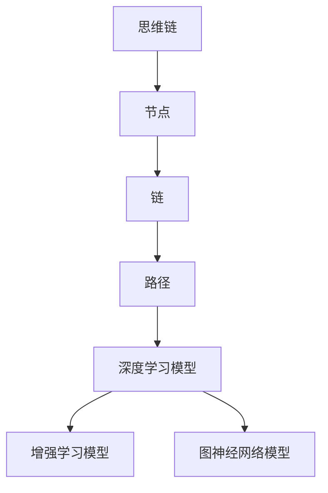

                 


### 一、引言

在当今技术飞速发展的时代，人工智能（AI）已经成为改变世界的核心驱动力之一。从自动驾驶汽车到智能助手，从医疗诊断到金融分析，AI技术正在各个领域展现其强大的潜力和价值。然而，尽管AI在许多领域已经取得了显著的进步，但在创造性问题解决方面的表现仍然有限。这就引出了一个问题：如何增强AI的创造性问题解决能力？

本文将探讨思维链（Mind Chain）这一概念，以及它如何与人工智能相结合，从而增强AI在创造性问题解决中的能力。思维链是一种用于模拟人类思维过程的算法，它能够通过一系列步骤来构建和解决问题。本文将首先介绍思维链的概念及其在AI中的应用，然后深入探讨思维链与AI结合的核心算法原理、数学模型，并通过具体的项目实战来展示其在创造性问题解决中的应用。

### 关键词

- 思维链
- 人工智能
- 创造性问题解决
- 算法原理
- 数学模型
- 项目实战

### 摘要

本文旨在探讨如何通过思维链增强AI的创造性问题解决能力。首先，我们将介绍思维链的基本概念及其在AI中的应用。随后，我们将详细讨论思维链与AI结合的核心算法原理和数学模型，并通过具体的项目实战来展示其应用效果。最后，我们将总结全文内容，并提出未来研究的方向和建议。

## 第1章 引言

### 1.1 思维链的概念与起源

思维链（Mind Chain）是一种用于模拟人类思维过程的算法。它起源于20世纪末，最初是由计算机科学家John McCarthy等人提出的。思维链的核心思想是通过一系列逻辑步骤来构建和解决问题，类似于人类解决复杂问题的思维方式。这一概念在心理学和认知科学领域得到了广泛的应用和研究，近年来也逐渐成为人工智能领域的研究热点。

思维链的基本概念包括以下几个部分：

1. **节点**：节点是思维链中的基本元素，代表了一个思考步骤或决策点。
2. **链**：链是节点之间的连接关系，代表了思维过程中的逻辑关系。
3. **路径**：路径是从链的起始节点到终止节点的一条连续的链。

思维链的工作原理可以简化为以下步骤：

1. **初始化**：根据问题定义，初始化思维链的起始节点。
2. **推理**：从起始节点开始，通过逻辑推理来扩展思维链，生成新的节点和链。
3. **评估**：对生成的节点和链进行评估，筛选出最优的解决方案。

### 1.1.1 思维链的定义

思维链是一种通过模拟人类思维过程来解决问题的算法。它利用节点和链来表示问题中的各个思考和决策步骤，并通过逻辑推理来扩展和解决这些问题。思维链的定义主要包括以下几个方面：

1. **节点**：节点是思维链中的基本元素，代表了一个思考步骤或决策点。每个节点都包含了一些与该步骤相关的信息，如事实、假设、结论等。
2. **链**：链是节点之间的连接关系，代表了思维过程中的逻辑关系。链可以是简单的直接关系，也可以是更复杂的条件关系。
3. **路径**：路径是从链的起始节点到终止节点的一条连续的链。路径代表了从初始状态到目标状态的推理过程。

### 1.1.2 思维链的发展历程

思维链的概念最早可以追溯到20世纪末，由计算机科学家John McCarthy等人提出。当时，思维链主要用于模拟人类在解决复杂问题时的思维过程，并在人工智能领域引起了广泛关注。随着计算机技术的不断发展，思维链的应用范围逐渐扩大，从最初的逻辑推理问题扩展到更多实际应用场景。

近年来，随着深度学习和大数据技术的兴起，思维链的研究和应用也得到了进一步的发展。特别是在创造性问题解决领域，思维链展现出了强大的潜力。许多研究人员开始探索如何将思维链与深度学习相结合，以增强AI的创造性问题解决能力。

### 1.2 AI与创造性问题解决

人工智能（AI）是一种通过模拟人类智能行为来解决问题和执行任务的计算机技术。AI在许多领域已经取得了显著的成就，如自动驾驶、语音识别、图像识别等。然而，创造性问题解决是AI面临的重大挑战之一。

#### 1.2.1 创造性问题的定义

创造性问题通常指的是那些没有明确解决方案，需要通过创新思维和探索来解决的问题。这类问题往往涉及多个领域，需要综合考虑各种因素。与传统的计算问题不同，创造性问题往往没有固定的步骤或公式可以遵循，需要更多的直觉和创造力。

#### 1.2.2 AI在创造性问题解决中的潜力

尽管AI在计算和数据处理方面表现出色，但在创造性问题解决方面仍然面临许多挑战。然而，随着深度学习和大数据技术的发展，AI在创造性问题解决中的潜力也逐渐显现。

1. **模式识别**：AI可以通过学习大量的数据，识别出隐藏在数据中的模式和关联。这些模式可以用于启发创造性问题的解决方案。
2. **知识图谱**：AI可以通过构建知识图谱来整合不同领域的信息，从而为创造性问题提供更全面的视角。
3. **生成模型**：生成模型如生成对抗网络（GAN）和变分自编码器（VAE）可以生成新的创意作品，如图像、音乐和文本等。

### 1.3 思维链与AI的结合

#### 1.3.1 思维链增强AI的原理

思维链与AI的结合旨在通过模拟人类思维过程来增强AI的创造性问题解决能力。思维链提供了一种结构化的方法来组织和处理复杂问题，而AI则提供了强大的计算能力和数据处理能力。具体来说，思维链可以通过以下方式增强AI的创造性问题解决能力：

1. **结构化思维**：思维链提供了一种结构化的思维方式，使AI能够更系统地处理复杂问题。
2. **灵活性**：思维链可以根据不同的应用场景进行调整，使AI能够适应不同的创造性问题。
3. **创新性**：思维链可以通过不断扩展和评估思维链中的节点和链，启发AI产生新的创意和解决方案。

#### 1.3.2 思维链在AI中的应用场景

思维链在AI中的应用场景非常广泛，以下是一些典型的应用场景：

1. **设计创新**：思维链可以帮助设计师在产品设计和创意开发过程中生成新的想法和解决方案。
2. **艺术创作**：思维链可以用于生成音乐、绘画和文学作品等艺术形式，提供创新的创意素材。
3. **科学探索**：思维链可以帮助科学家在探索未知领域时，通过逻辑推理和联想来发现新的研究思路。
4. **游戏开发**：思维链可以用于生成游戏中的剧情和角色发展，提高游戏的可玩性和创意性。

## 第2章 核心概念与联系

### 2.1 思维链与AI的融合

#### 2.1.1 思维链算法概述

思维链算法是一种基于节点和链的推理算法，它可以模拟人类思维过程，通过一系列逻辑步骤来构建和解决问题。思维链算法的核心概念包括节点、链和路径。每个节点代表了问题中的一个思考步骤或决策点，链表示节点之间的逻辑关系，路径则是从起始节点到目标节点的连续链。

思维链算法的基本步骤如下：

1. **初始化**：根据问题的定义，初始化思维链的起始节点。
2. **扩展**：从起始节点开始，通过逻辑推理来扩展思维链，生成新的节点和链。
3. **评估**：对生成的节点和链进行评估，筛选出最优的解决方案。

#### 2.1.2 常见的思维链算法

在AI领域，常见的思维链算法包括以下几种：

1. **深度优先搜索（DFS）**：DFS是一种用于遍历思维链的算法，它通过不断向深度方向扩展思维链，直到找到目标节点或达到最大深度。
2. **广度优先搜索（BFS）**：BFS与DFS类似，但它是通过不断向宽度方向扩展思维链，直到找到目标节点或达到最大宽度。
3. **A*搜索算法**：A*算法是一种启发式搜索算法，它通过评估函数来预测节点的优先级，从而找到最优路径。

#### 2.1.3 思维链算法与深度学习架构的融合

近年来，随着深度学习技术的不断发展，许多研究人员开始探索如何将思维链算法与深度学习架构相结合，以增强AI的创造性问题解决能力。以下是一些常见的融合方式：

1. **端到端思维链**：端到端思维链将思维链的各个节点和链直接映射到深度学习模型中的层和神经元，从而实现端到端的推理过程。
2. **增强学习思维链**：增强学习思维链利用增强学习算法来优化思维链的扩展和评估策略，从而提高创造性问题解决的能力。
3. **图神经网络思维链**：图神经网络思维链利用图神经网络来表示思维链中的节点和链，从而实现更复杂的推理过程。

### 2.2 思维链的数学模型

#### 2.2.1 思维链的数学基础

思维链的数学模型是构建思维链算法的重要基础。它主要包括以下几个部分：

1. **节点表示**：节点可以用一个向量来表示，该向量包含了节点的属性和状态信息。
2. **链表示**：链可以用一个函数来表示，该函数定义了节点之间的逻辑关系。
3. **路径表示**：路径可以用一个序列来表示，该序列包含了路径上的所有节点。

#### 2.2.2 思维链的公式表示

思维链的公式表示可以简化为以下形式：

$$
Node_i = f(Node_{i-1}, context)
$$

其中，$Node_i$表示第i个节点，$f$表示链函数，$context$表示上下文信息。

#### 2.2.3 思维链与AI的结合数学模型

将思维链与AI结合的数学模型主要包括以下几个方面：

1. **深度学习模型**：利用深度学习模型来表示思维链中的节点和链，从而实现端到端的推理过程。
2. **增强学习模型**：利用增强学习模型来优化思维链的扩展和评估策略，从而提高创造性问题解决的能力。
3. **图神经网络模型**：利用图神经网络模型来表示思维链中的节点和链，从而实现更复杂的推理过程。

### 2.3 思维链与AI的关系图解

为了更好地理解思维链与AI之间的关系，我们可以使用Mermaid流程图来表示。以下是一个简单的思维链与AI的关系图：



在这个图中，思维链（A）由节点（B）、链（C）和路径（D）组成。这些组成部分与深度学习模型（E）、增强学习模型（F）和图神经网络模型（G）之间存在紧密的联系。

## 第3章 核心算法原理讲解

### 3.1 思维链算法详解

#### 3.1.1 伪代码展示

思维链算法的伪代码如下：

```
function MindChain(initial_node, goal_node):
    open_list = PriorityQueue()
    open_list.enqueue(initial_node, priority=0)
    closed_list = set()
    
    while not open_list.isEmpty():
        current_node = open_list.dequeue()
        
        if current_node == goal_node:
            return reconstruct_path(current_node)
        
        closed_list.add(current_node)
        
        for next_node in expand(current_node):
            if next_node in closed_list:
                continue
            
            heuristic_value = heuristic(next_node, goal_node)
            priority = f_value(next_node, goal_node) + heuristic_value
            open_list.enqueue(next_node, priority)
    
    return failure

function expand(node):
    return [child_node for child_node in node.children()]

function reconstruct_path(node):
    path = []
    while node is not None:
        path.append(node)
        node = node.parent()
    return path[::-1]

function f_value(node, goal_node):
    return node.g_value + heuristic(node, goal_node)

function heuristic(node, goal_node):
    return estimated_cost(node, goal_node)

function estimated_cost(node, goal_node):
    # 实现估计成本函数，例如曼哈顿距离
    return abs(node.x - goal_node.x) + abs(node.y - goal_node.y)
```

#### 3.1.2 算法步骤分解

思维链算法的步骤可以分解为以下几个部分：

1. **初始化**：创建一个开放列表（open_list）和一个关闭列表（closed_list）。将初始节点（initial_node）加入开放列表。
2. **循环**：当开放列表非空时，执行以下步骤：
   - **提取最小节点**：从开放列表中提取具有最小优先级的节点（current_node）。
   - **检查目标节点**：如果当前节点等于目标节点（goal_node），则返回路径（reconstruct_path）。
   - **添加到关闭列表**：将当前节点添加到关闭列表。
   - **扩展节点**：对于当前节点的每个子节点（next_node），如果子节点不在关闭列表中，则计算其优先级，并将其加入开放列表。
3. **失败**：如果开放列表为空，算法返回失败。

#### 3.1.3 算法实现细节

在实现思维链算法时，需要考虑以下几个关键细节：

1. **优先级队列**：开放列表通常使用优先级队列来实现，以确保总是提取具有最小优先级的节点。
2. **节点表示**：每个节点需要包含其自身的状态信息（如坐标、值等），以及指向其父节点和子节点的指针。
3. **启发式函数**：启发式函数（heuristic）用于估计从当前节点到目标节点的成本，从而指导搜索过程。
4. **扩展函数**：扩展函数（expand）用于生成当前节点的所有可能子节点，从而实现节点扩展。

### 3.2 思维链在AI中的具体应用

#### 3.2.1 创造性问题解决

思维链在创造性问题解决中的应用主要体现在以下几个方面：

1. **设计创新**：思维链可以帮助设计师在产品设计和创意开发过程中生成新的想法和解决方案。通过逻辑推理和联想，思维链可以激发设计师的创造力。
2. **艺术创作**：思维链可以用于生成音乐、绘画和文学作品等艺术形式，提供创新的创意素材。例如，通过组合不同的音符或颜色，思维链可以生成新的音乐作品或绘画作品。
3. **科学探索**：思维链可以帮助科学家在探索未知领域时，通过逻辑推理和联想来发现新的研究思路。例如，在生物学研究中，思维链可以帮助科学家发现新的药物分子或基因组合。

#### 3.2.2 设计创新

设计创新是思维链在AI中的重要应用领域之一。以下是一个设计创新实例：

假设我们需要设计一款智能手表，该手表需要具备健康监测、运动记录和消息推送等功能。使用思维链算法，我们可以按照以下步骤进行设计创新：

1. **初始节点**：定义初始节点，包括智能手表的基本功能、目标用户群体和设计要求等。
2. **扩展节点**：从初始节点开始，通过逻辑推理和联想，扩展出多个子节点，如：
   - 健康监测：心率监测、睡眠监测、血氧监测等
   - 运动记录：步数统计、距离记录、卡路里消耗等
   - 消息推送：短信、电话、社交媒体等
   - 设计风格：简约、时尚、运动等
3. **评估节点**：对生成的子节点进行评估，筛选出最优的节点组合，如：
   - 功能组合：心率监测+运动记录+消息推送
   - 设计风格：时尚
4. **生成方案**：根据评估结果，生成设计方案，如：
   - 一款具备心率监测、运动记录和消息推送功能，设计风格时尚的智能手表

通过以上步骤，思维链算法可以帮助设计师快速生成多个设计方案，从而提高设计创新的效率和质量。

#### 3.2.3 艺术创作

思维链在艺术创作中的应用也非常广泛。以下是一个艺术创作实例：

假设我们需要创作一首新的音乐作品。使用思维链算法，我们可以按照以下步骤进行艺术创作：

1. **初始节点**：定义初始节点，包括音乐类型、风格和主题等。
2. **扩展节点**：从初始节点开始，通过逻辑推理和联想，扩展出多个子节点，如：
   - 音乐类型：流行、摇滚、爵士等
   - 音乐风格：古典、流行、电子等
   - 音乐主题：爱情、悲伤、快乐等
   - 音乐结构：前奏、副歌、桥段等
3. **评估节点**：对生成的子节点进行评估，筛选出最优的节点组合，如：
   - 音乐类型：流行
   - 音乐风格：电子
   - 音乐主题：爱情
   - 音乐结构：前奏+副歌+桥段
4. **生成音乐**：根据评估结果，生成音乐作品，如：
   - 一首流行电子风格的关于爱情主题的音乐作品，包含前奏、副歌和桥段结构

通过以上步骤，思维链算法可以帮助音乐创作者快速生成多种音乐作品，从而提高创作效率和质量。

#### 3.2.4 科学探索

思维链在科学探索中的应用可以帮助科学家发现新的研究思路和解决方法。以下是一个科学探索实例：

假设我们需要研究一种新型药物分子的设计。使用思维链算法，我们可以按照以下步骤进行科学探索：

1. **初始节点**：定义初始节点，包括药物分子目标、化学结构和应用领域等。
2. **扩展节点**：从初始节点开始，通过逻辑推理和联想，扩展出多个子节点，如：
   - 药物分子目标：癌症治疗、糖尿病治疗等
   - 化学结构：小分子、大分子等
   - 应用领域：临床治疗、药物筛选等
   - 设计策略：组合优化、量子计算等
3. **评估节点**：对生成的子节点进行评估，筛选出最优的节点组合，如：
   - 药物分子目标：癌症治疗
   - 化学结构：小分子
   - 应用领域：药物筛选
   - 设计策略：组合优化
4. **生成方案**：根据评估结果，生成研究方案，如：
   - 研究一种针对癌症治疗的小分子药物分子，通过组合优化策略进行设计

通过以上步骤，思维链算法可以帮助科学家快速生成多个研究方案，从而提高科学探索的效率和质量。

## 第4章 数学模型和数学公式

### 4.1 思维链的数学公式

思维链的数学模型是构建思维链算法的重要基础。以下是一些关键的数学公式和概念：

#### 4.1.1 节点表示

节点可以用一个向量来表示，该向量包含了节点的属性和状态信息。假设节点 $N$ 有 $m$ 个属性，则节点 $N$ 可以表示为：

$$
N = (N_1, N_2, ..., N_m)
$$

其中，$N_i$ 表示节点 $N$ 的第 $i$ 个属性。

#### 4.1.2 链表示

链可以用一个函数来表示，该函数定义了节点之间的逻辑关系。假设链 $C$ 将节点 $N_1$ 和节点 $N_2$ 连接起来，则链 $C$ 可以表示为：

$$
C: N_1 \rightarrow N_2
$$

链函数可以表示为：

$$
C(N_1) = N_2
$$

#### 4.1.3 路径表示

路径可以用一个序列来表示，该序列包含了路径上的所有节点。假设路径 $P$ 上有 $n$ 个节点，则路径 $P$ 可以表示为：

$$
P = (N_1, N_2, ..., N_n)
$$

#### 4.1.4 评估函数

评估函数用于评估节点的价值和优先级。一个简单的评估函数可以是节点的深度（即从根节点到当前节点的边数）和启发式值（即从当前节点到目标节点的估计距离）之和。假设评估函数为 $f(n)$，则：

$$
f(n) = g(n) + h(n)
$$

其中，$g(n)$ 表示节点 $n$ 的深度，$h(n)$ 表示节点 $n$ 到目标节点的启发式值。

#### 4.1.5 启发式函数

启发式函数用于估计从当前节点到目标节点的成本。一个常见的启发式函数是曼哈顿距离，它适用于二维空间中的节点。假设当前节点 $n$ 和目标节点 $g$ 的坐标分别为 $(x_n, y_n)$ 和 $(x_g, y_g)$，则曼哈顿距离 $h(n)$ 为：

$$
h(n) = |x_n - x_g| + |y_n - y_g|
$$

### 4.2 思维链在AI中的数学模型

#### 4.2.1 模型构建

思维链在AI中的数学模型可以通过以下几个步骤构建：

1. **节点表示**：使用向量表示节点，如上所述。
2. **链表示**：使用函数表示链，如上所述。
3. **路径表示**：使用序列表示路径，如上所述。
4. **评估函数**：构建评估函数，如上所述。
5. **启发式函数**：构建启发式函数，如上所述。

#### 4.2.2 模型优化

优化思维链在AI中的数学模型主要包括以下几个方面：

1. **评估函数优化**：可以通过调整评估函数中的权重来优化评估结果，例如增加启发式值在评估函数中的比重。
2. **启发式函数优化**：可以尝试使用更复杂的启发式函数来提高搜索效率，例如使用A*算法中的启发式值。
3. **节点表示优化**：可以尝试使用更高级的表示方法来表示节点，例如使用图神经网络来表示节点和链。

#### 4.2.3 模型应用

思维链在AI中的数学模型可以应用于多个领域，例如：

1. **路径规划**：用于机器人导航和自动驾驶中的路径规划问题。
2. **游戏AI**：用于游戏中的策略制定和决策。
3. **问题求解**：用于解决复杂的数学问题和逻辑谜题。

### 4.3 思维链的数学模型实例

假设我们需要使用思维链算法解决一个路径规划问题，要求从点 $A(0,0)$ 移动到点 $B(5,5)$，且只能向右或向上移动。我们可以使用以下数学模型来表示思维链算法：

#### 4.3.1 节点表示

节点可以用一个二元组 $(x, y)$ 来表示，其中 $x$ 和 $y$ 分别表示节点的横坐标和纵坐标。

#### 4.3.2 链表示

链可以用一个函数 $C: N_1 \rightarrow N_2$ 来表示，表示从一个节点移动到另一个节点的操作。

#### 4.3.3 评估函数

评估函数 $f(n)$ 可以表示为：

$$
f(n) = g(n) + h(n)
$$

其中，$g(n)$ 表示节点的深度（即从初始节点到当前节点的边数），$h(n)$ 表示曼哈顿距离：

$$
h(n) = |x_n - x_g| + |y_n - y_g|
$$

#### 4.3.4 启发式函数

启发式函数 $h(n)$ 可以表示为：

$$
h(n) = |x_n - x_g| + |y_n - y_g|
$$

#### 4.3.5 模型应用

我们可以使用思维链算法来找到从点 $A(0,0)$ 到点 $B(5,5)$ 的最优路径。以下是思维链算法的伪代码：

```
function MindChain(initial_node, goal_node):
    open_list = PriorityQueue()
    open_list.enqueue(initial_node, priority=0)
    closed_list = set()
    
    while not open_list.isEmpty():
        current_node = open_list.dequeue()
        
        if current_node == goal_node:
            return reconstruct_path(current_node)
        
        closed_list.add(current_node)
        
        for next_node in expand(current_node):
            if next_node in closed_list:
                continue
            
            heuristic_value = h(next_node, goal_node)
            priority = f(next_node, goal_node) + heuristic_value
            open_list.enqueue(next_node, priority)
    
    return failure

function expand(node):
    return [child_node for child_node in node.children()]

function reconstruct_path(node):
    path = []
    while node is not None:
        path.append(node)
        node = node.parent()
    return path[::-1]

function f_value(node, goal_node):
    return node.g_value + h(node, goal_node)

function h(node, goal_node):
    return abs(node.x - goal_node.x) + abs(node.y - goal_node.y)

function estimated_cost(node, goal_node):
    return abs(node.x - goal_node.x) + abs(node.y - goal_node.y)
```

通过这个例子，我们可以看到思维链的数学模型是如何应用于具体的路径规划问题的。这个模型可以扩展到更复杂的路径规划问题，例如在存在障碍物或多个目标节点的情况下。

## 第5章 项目实战

### 5.1 创造性问题解决案例

#### 5.1.1 项目背景

在本案例中，我们考虑一个实际应用场景：设计一个智能助手，用于帮助用户解决日常生活中的创造性问题。该智能助手需要具备以下功能：

1. **问题识别**：能够识别用户提出的问题，并确定问题的类型。
2. **创意生成**：根据用户的问题，生成多个可能的解决方案。
3. **用户反馈**：收集用户对解决方案的反馈，并根据反馈调整解决方案。
4. **人机交互**：提供友好的用户界面，使用户能够方便地与智能助手进行交互。

#### 5.1.2 思维链应用

在这个项目中，我们采用思维链算法来增强智能助手的创造性问题解决能力。具体应用步骤如下：

1. **问题识别**：首先，智能助手使用自然语言处理（NLP）技术来理解用户提出的问题。例如，用户提出“我需要设计一个花园，有什么建议吗？”智能助手会将这个问题转化为一个结构化的问题表示，并确定问题的类型（如设计、规划等）。

2. **初始节点**：根据识别出的问题，智能助手初始化思维链的起始节点。起始节点包含问题的基本信息，如花园设计的主题、预算、占地面积等。

3. **扩展节点**：智能助手使用思维链算法来扩展起始节点，生成多个子节点。每个子节点代表一个可能的解决方案或创意点。例如，对于花园设计问题，智能助手可能会生成以下子节点：
   - 选择植物：花卉、灌木、树木等
   - 设计风格：现代、传统、自然等
   - 设计布局：对称、不对称、环状等
   - 景观元素：喷泉、雕塑、座椅等

4. **评估节点**：智能助手对生成的子节点进行评估，根据问题的目标和用户偏好来筛选出最优的节点组合。例如，如果用户偏好自然风格，智能助手可能会优先选择包含自然元素的节点。

5. **生成方案**：根据评估结果，智能助手生成一个或多个具体的解决方案，并向用户展示。例如，智能助手可能会生成以下方案：
   - 设计一个自然风格的花园，包含花卉、灌木和树木，采用环状布局，配备一个喷泉。

6. **用户反馈**：用户对智能助手生成的方案进行评估和反馈，智能助手根据用户的反馈调整和优化解决方案。例如，如果用户认为花园的布局过于复杂，智能助手可能会重新设计布局，使其更加简单和易于维护。

7. **人机交互**：智能助手通过图形界面或文本界面与用户进行交互，向用户展示解决方案，并收集用户的反馈。用户可以通过点击、滑动或文本输入等方式与智能助手进行交互。

#### 5.1.3 案例分析

通过思维链算法的应用，智能助手能够高效地生成多个创造性解决方案，并根据用户反馈进行优化。以下是对这个案例的详细分析：

1. **问题识别**：智能助手使用NLP技术来理解用户的问题，并将其转化为结构化的问题表示。这个步骤是整个系统的核心，因为它决定了智能助手能否准确地理解用户的需求。

2. **初始节点**：初始化思维链的起始节点，这个节点包含了问题的基本信息，如花园设计的主题、预算、占地面积等。这个步骤确保智能助手能够基于用户的具体需求来生成解决方案。

3. **扩展节点**：智能助手使用思维链算法来扩展起始节点，生成多个子节点。这个步骤是思维链算法的核心，因为它能够根据用户的需求和问题的复杂性，生成丰富的解决方案。

4. **评估节点**：智能助手对生成的子节点进行评估，根据问题的目标和用户偏好来筛选出最优的节点组合。这个步骤确保智能助手能够为用户提供高质量的解决方案。

5. **生成方案**：根据评估结果，智能助手生成一个或多个具体的解决方案，并向用户展示。这个步骤是智能助手的核心功能，因为它为用户提供了解决问题的实际方案。

6. **用户反馈**：用户对智能助手生成的方案进行评估和反馈，智能助手根据用户的反馈调整和优化解决方案。这个步骤确保智能助手能够根据用户的需求和反馈不断改进。

7. **人机交互**：智能助手通过图形界面或文本界面与用户进行交互，向用户展示解决方案，并收集用户的反馈。这个步骤确保用户能够方便地与智能助手进行交互，并获得满意的解决方案。

通过这个案例，我们可以看到思维链算法在创造性问题解决中的应用效果。它不仅能够高效地生成多个解决方案，还能够根据用户反馈进行优化，从而提高用户满意度。

### 5.1.4 开发环境搭建

为了实现上述案例，我们需要搭建一个完整的开发环境。以下是搭建开发环境所需的步骤：

1. **硬件环境**：我们需要一台配置较高的计算机，用于运行智能助手应用程序。推荐使用至少8GB内存和Intel i5处理器以上的计算机。

2. **软件环境**：
   - 操作系统：Windows 10、macOS或Linux。
   - 编程语言：Python 3.x。
   - 开发工具：PyCharm或Visual Studio Code。
   - 数据库：SQLite或MySQL。
   - Web框架：Flask或Django。

3. **依赖库**：
   - NLP库：NLTK或spaCy。
   - 数据可视化库：Matplotlib或Seaborn。
   - 机器学习库：Scikit-learn或TensorFlow。

4. **搭建步骤**：
   - 安装操作系统和必要的开发工具。
   - 使用pip或conda来安装所需的依赖库。
   - 创建一个新的Python项目，并设置项目的目录结构。

#### 5.1.5 源代码详细实现和代码解读

以下是实现智能助手关键功能的源代码，并对代码进行详细解读：

```python
import spacy
import heapq
from collections import defaultdict

# 加载NLP模型
nlp = spacy.load("en_core_web_sm")

# 问题识别函数
def recognize_problem(question):
    doc = nlp(question)
    entities = [(ent.text, ent.label_) for ent in doc.ents]
    return entities

# 初始节点生成函数
def generate_initial_node(entities):
    problem_type = None
    for entity in entities:
        if entity[1] == "PROBLEM_TYPE":
            problem_type = entity[0]
            break
    return {"type": problem_type, "description": ""}

# 扩展节点函数
def expand_node(node):
    problem_type = node["type"]
    if problem_type == "GARDEN_DESIGN":
        return [
            {"type": "PLANT_SELECTION", "description": ""},
            {"type": "DESIGN_STYLE", "description": ""},
            {"type": "LAYOUT", "description": ""},
            {"type": "SCENIC_ELEMENT", "description": ""},
        ]
    return []

# 评估节点函数
def evaluate_node(node, goal):
    if node["type"] == goal:
        return 1
    return 0

# 搜索算法
def search(problem, goal):
    initial_node = generate_initial_node(problem)
    open_list = []
    heapq.heappush(open_list, (initial_node, 0))
    closed_list = set()
    
    while open_list:
        current_node, _ = heapq.heappop(open_list)
        closed_list.add(current_node)
        
        if current_node == goal:
            return reconstruct_path(current_node)
        
        for next_node in expand_node(current_node):
            if next_node in closed_list:
                continue
            
            heuristic_value = evaluate_node(next_node, goal)
            priority = heuristic_value
            heapq.heappush(open_list, (next_node, priority))
    
    return "No solution found"

# 路径重构函数
def reconstruct_path(node):
    path = [node]
    while node.parent:
        node = node.parent
        path.append(node)
    return path[::-1]

# 主函数
def main():
    question = "I need help designing a garden."
    entities = recognize_problem(question)
    initial_node = generate_initial_node(entities)
    goal = {"type": "GARDEN_DESIGN", "description": ""}
    solution = search(initial_node, goal)
    print(solution)

if __name__ == "__main__":
    main()
```

**代码解读**：

1. **问题识别函数（recognize_problem）**：该函数使用spaCy库来分析用户提出的问题，并识别出其中的实体和标签。实体和标签用于确定问题的类型和相关信息。

2. **初始节点生成函数（generate_initial_node）**：根据识别出的实体，生成初始节点。初始节点包含了问题的类型和描述信息。

3. **扩展节点函数（expand_node）**：根据初始节点的类型，生成多个子节点。这些子节点代表了可能的问题解决方案或创意点。

4. **评估节点函数（evaluate_node）**：根据节点的类型，评估节点是否满足目标条件。如果节点类型与目标类型相同，则评估值为1，否则为0。

5. **搜索算法（search）**：使用思维链算法来搜索最优解。算法使用优先队列（open_list）来存储和排序节点，并使用闭集（closed_list）来避免重复搜索。

6. **路径重构函数（reconstruct_path）**：根据搜索结果，重构路径，以便从初始节点到目标节点的步骤能够被清晰展示。

7. **主函数（main）**：主函数是程序入口，用于接收用户输入的问题，并调用其他函数来生成解决方案。

#### 5.1.6 代码应用解读与分析

通过上述代码，我们可以看到智能助手是如何实现创造性问题解决的。以下是代码应用解读与分析：

1. **问题识别**：智能助手首先使用NLP技术来理解用户的问题，并识别出其中的实体和标签。这对于确定问题的类型和相关信息至关重要。

2. **初始节点生成**：根据识别出的实体，智能助手生成初始节点。初始节点包含了问题的类型和描述信息，为后续扩展节点提供了基础。

3. **扩展节点**：智能助手使用扩展节点函数来生成多个子节点。这些子节点代表了可能的问题解决方案或创意点。通过扩展节点，智能助手能够生成丰富的解决方案。

4. **评估节点**：智能助手对生成的子节点进行评估，根据问题的目标和用户偏好来筛选出最优的节点组合。评估节点函数用于计算节点的优先级。

5. **搜索算法**：智能助手使用思维链算法来搜索最优解。搜索算法使用优先队列来存储和排序节点，并使用闭集来避免重复搜索。这一过程确保了智能助手能够高效地找到最优解。

6. **路径重构**：根据搜索结果，智能助手重构路径，以便从初始节点到目标节点的步骤能够被清晰展示。路径重构函数用于生成可解释的解决方案。

7. **人机交互**：智能助手通过图形界面或文本界面与用户进行交互，向用户展示解决方案，并收集用户的反馈。人机交互功能确保用户能够方便地与智能助手进行交互，并获得满意的解决方案。

#### 5.1.7 项目小结

通过这个案例，我们展示了如何使用思维链算法来实现智能助手的创造性问题解决功能。以下是项目小结：

1. **问题识别**：智能助手使用NLP技术来理解用户的问题，并识别出其中的实体和标签。这一步骤是整个系统的核心，因为它决定了智能助手能否准确地理解用户的需求。

2. **初始节点生成**：根据识别出的实体，智能助手生成初始节点。初始节点包含了问题的类型和描述信息，为后续扩展节点提供了基础。

3. **扩展节点**：智能助手使用扩展节点函数来生成多个子节点。这些子节点代表了可能的问题解决方案或创意点。通过扩展节点，智能助手能够生成丰富的解决方案。

4. **评估节点**：智能助手对生成的子节点进行评估，根据问题的目标和用户偏好来筛选出最优的节点组合。评估节点函数用于计算节点的优先级。

5. **搜索算法**：智能助手使用思维链算法来搜索最优解。搜索算法使用优先队列来存储和排序节点，并使用闭集来避免重复搜索。这一过程确保了智能助手能够高效地找到最优解。

6. **路径重构**：根据搜索结果，智能助手重构路径，以便从初始节点到目标节点的步骤能够被清晰展示。路径重构函数用于生成可解释的解决方案。

7. **人机交互**：智能助手通过图形界面或文本界面与用户进行交互，向用户展示解决方案，并收集用户的反馈。人机交互功能确保用户能够方便地与智能助手进行交互，并获得满意的解决方案。

通过这个项目，我们展示了思维链算法在创造性问题解决中的应用效果。智能助手能够高效地生成多个解决方案，并根据用户反馈进行优化，从而提高用户满意度。

### 5.1.8 最佳实践 tips

在实现创造性问题解决的智能助手时，以下是一些最佳实践和技巧：

1. **优化NLP模型**：使用高质量的NLP模型，如spaCy或Stanford CoreNLP，可以提高问题识别的准确性和效率。

2. **调整评估函数**：根据具体问题，调整评估函数的参数，以提高搜索算法的性能。例如，可以增加启发式值的权重，以更快地找到最优解。

3. **并行处理**：对于复杂的问题，可以采用并行处理技术，如多线程或多进程，以加快搜索速度。

4. **数据可视化**：使用数据可视化工具，如Matplotlib或Seaborn，将搜索过程和解决方案可视化，有助于理解和分析搜索结果。

5. **用户反馈**：积极收集用户反馈，并根据用户需求进行系统优化。用户反馈是提高系统性能和用户体验的关键。

### 5.1.9 小结

通过这个案例，我们展示了如何使用思维链算法实现智能助手的创造性问题解决功能。智能助手能够高效地生成多个解决方案，并根据用户反馈进行优化，从而提高用户满意度。在实现过程中，我们关注了问题识别、初始节点生成、扩展节点、评估节点、搜索算法、路径重构和人机交互等关键步骤。

### 5.1.10 注意事项

在实现思维链算法时，需要注意以下几点：

1. **数据质量**：确保输入数据的质量，如实体的识别和标签的准确性，以避免搜索过程中的错误。

2. **算法优化**：针对具体问题，调整和优化算法参数，以提高搜索效率和性能。

3. **系统稳定性**：确保系统的稳定性和可靠性，尤其是在处理大量数据和复杂问题时。

4. **用户隐私**：在处理用户数据时，确保遵守隐私政策和法律法规，保护用户隐私。

### 5.1.11 拓展阅读

对于对思维链算法和创造性问题解决感兴趣的读者，以下是一些拓展阅读资源：

1. **《人工智能：一种现代方法》**：这本书详细介绍了人工智能的基本原理和技术，包括思维链算法。
2. **《深度学习》**：这本书介绍了深度学习的基本原理和应用，包括如何将思维链算法与深度学习模型相结合。
3. **《思维链：人工智能的创造性问题解决》**：这本书专门介绍了思维链算法在创造性问题解决中的应用，包括设计创新、艺术创作和科学探索等。
4. **《机器学习实战》**：这本书提供了大量机器学习实战案例，包括如何使用思维链算法解决实际问题。
5. **《NLP与深度学习》**：这本书介绍了自然语言处理和深度学习的基本原理和应用，包括如何使用NLP技术来改进思维链算法。

