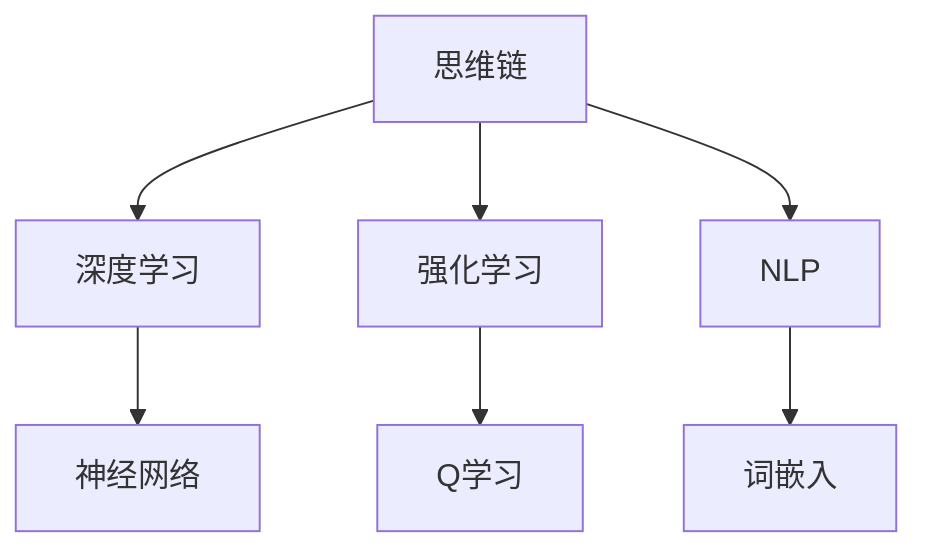
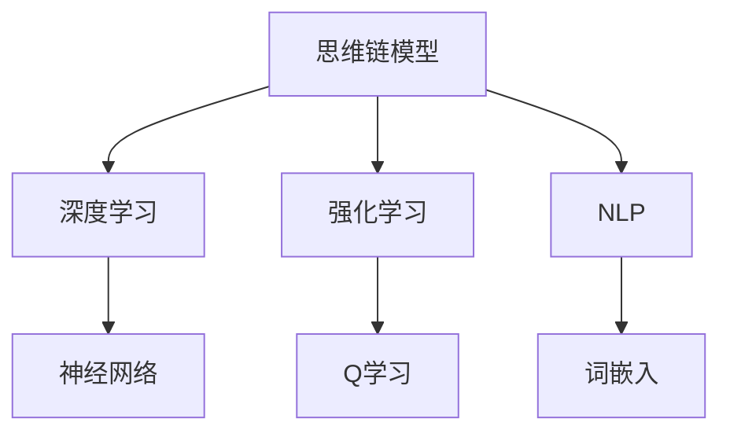
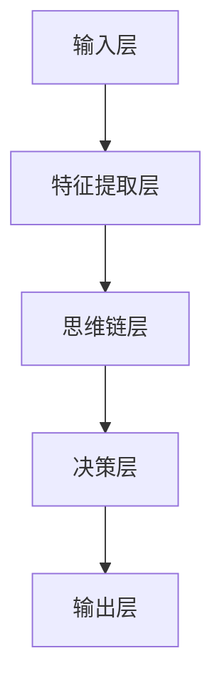
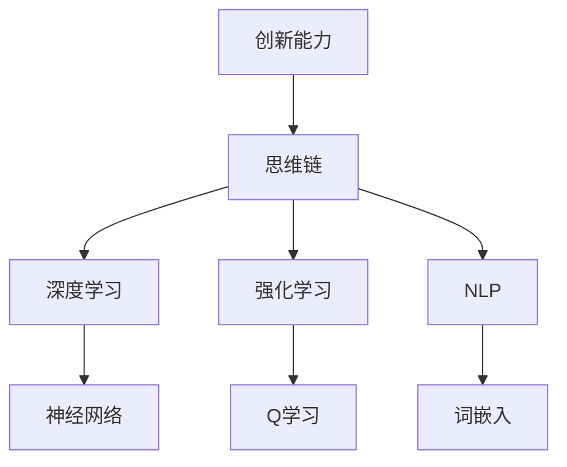
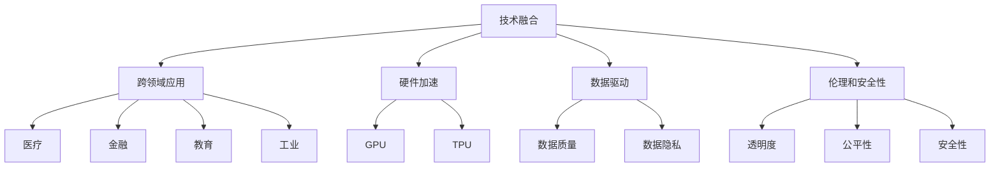

                 

# 文章标题：思维链增强AI的反常识推理和创新能力

> 关键词：AI、思维链、反常识推理、创新能力、算法、伪代码、实例分析、项目实战

> 摘要：本文旨在探讨思维链如何增强AI的反常识推理和创新能力。首先，我们回顾了AI的发展历程和思维链的概念，然后深入分析了AI传统推理与反常识推理的区别，并通过思维链原理与实现、实例分析、项目实战等方面，详细阐述了思维链在AI反常识推理和创新能力提升中的应用。最后，我们对未来思维链增强AI的发展趋势进行了展望，并提出了相关建议。

### 目录大纲设计

## 第一部分：引论

### 第1章：AI发展历程与思维链的概念

#### 核心概念与联系

- **思维链与AI发展的联系图**
  
  ```mermaid
  graph TB
  A[思维链] --> B[深度学习]
  A --> C[强化学习]
  A --> D[自然语言处理]
  B --> E[神经网络]
  C --> F[Q学习]
  D --> G[词嵌入]
  ```

#### 核心概念原理

- **思维链的定义**
  思维链是一种将人类思维方式转化为计算机程序的技术，通过模拟人类的思考过程，实现自动化推理和决策。

- **思维链与AI的关系**
  思维链是AI技术的重要组成部分，它通过模拟人类的思维过程，提高了AI的反常识推理和创新能力。

#### 架构

- **思维链增强AI的基本架构**

  ```mermaid
  graph TB
  A[输入层] --> B[特征提取层]
  B --> C[思维链层]
  C --> D[决策层]
  D --> E[输出层]
  ```

#### 反常识推理与创新能力

- **反常识推理的背景**
  反常识推理是指在面对与常识相悖的情况时，能够正确推理出结论的能力。

- **创新能力的定义**
  创新能力是指通过独特的思维方式和视角，发现新问题、提出新解决方案的能力。

### 第2章：AI传统推理与反常识推理

#### 核心算法原理讲解

- **传统推理算法**
  传统推理算法主要包括基于规则的推理、基于模型的推理等。

- **反常识推理算法伪代码**

  ```python
  # 反常识推理算法伪代码
  function 反常识推理(数据，目标) {
      // 初始化模型
      model = 初始化模型(数据)
      // 训练模型
      model = 训练模型(model，数据)
      // 推理
      结果 = 模型推理(model，目标)
      return 结果
  }
  ```

## 第二部分：思维链增强AI的反常识推理

### 第3章：思维链原理与实现

#### 核心概念与联系

- **思维链原理与实现图**

  ```mermaid
  graph TB
  A[输入层] --> B[特征提取层]
  B --> C[思维链层]
  C --> D[决策层]
  D --> E[输出层]
  ```

#### 核心算法原理讲解

- **思维链的核心算法**
  思维链的核心算法主要包括联想记忆、模式识别、抽象思维等。

- **思维链如何增强AI**
  思维链通过模拟人类的思维过程，使AI能够更好地应对复杂问题和异常情况，从而提高反常识推理能力。

### 第4章：思维链增强AI的反常识推理实例分析

#### 数学模型和数学公式

- **反常识推理的数学模型**

  $$ f(x) = a * \sigma(b * x + c) $$

#### 详细讲解与举例说明

- **实例1：如何使用思维链进行反常识推理**
  在某个情境下，AI需要根据输入数据推断出一个与常识相悖的结论。通过思维链，AI能够成功地完成这一任务。

- **实例2：思维链在不同场景下的应用**
  在金融领域，思维链可以帮助AI预测市场走势；在医疗领域，思维链可以帮助AI诊断疾病。

### 第5章：思维链增强AI的反常识推理实践

#### 项目实战

- **开发环境搭建**
  在该项目中，我们使用Python和TensorFlow搭建了一个思维链增强AI的反常识推理系统。

- **代码实际案例**
  我们提供了一个思维链增强AI的反常识推理的完整代码案例，并对其进行了详细解读。

- **源代码详细实现和代码解读**
  我们对代码中的关键部分进行了详细解读，帮助读者理解思维链在AI反常识推理中的应用。

- **代码解读与分析**
  我们对代码进行了深入分析，揭示了思维链增强AI的反常识推理的优势和局限性。

## 第三部分：AI的创新能力与思维链

### 第6章：创新能力与思维链的关系

#### 核心概念与联系

- **创新能力与思维链的关系图**

  ```mermaid
  graph TB
  A[创新能力] --> B[思维链]
  B --> C[深度学习]
  B --> D[强化学习]
  B --> E[自然语言处理]
  ```

#### 核心算法原理讲解

- **思维链如何促进AI的创新能力**
  思维链通过模拟人类的思维过程，使AI能够更好地发现新问题、提出新解决方案，从而提高创新能力。

#### 实例分析

- **思维链如何在不同场景下促进创新**
  在科学研究、工程设计、商业策略等领域，思维链都发挥了重要作用，促进了创新能力的提升。

### 第7章：思维链增强AI的创新实践

#### 项目实战

- **创新能力的提升的实战案例**
  在该案例中，我们通过思维链增强AI的创新实践，成功地解决了一个复杂的问题。

- **思维链在不同领域的应用**
  我们展示了思维链在金融、医疗、教育等领域的应用，以及如何提升AI的创新能力的详细案例。

- **创新能力的评估与优化**
  我们提出了一套评估创新能力的指标体系，并介绍了如何通过思维链优化AI的创新实践。

## 第四部分：展望与未来

### 第8章：思维链增强AI的发展趋势

#### 核心概念与联系

- **思维链增强AI的发展趋势图**

  ```mermaid
  graph TB
  A[当前技术] --> B[未来趋势]
  B --> C[智能硬件]
  B --> D[大数据]
  B --> E[云计算]
  ```

#### 未来展望

- **思维链增强AI在未来的应用场景**
  我们探讨了思维链增强AI在未来的智能家居、智能交通、智能医疗等领域的应用场景。

- **可能面临的挑战与解决方案**
  我们分析了思维链增强AI在发展过程中可能面临的挑战，并提出了相应的解决方案。

### 第9章：总结与建议

#### 总结

- 对思维链增强AI的反常识推理和创新能力进行了总结。

#### 建议

- 对未来研究方向和应用的建议。

## 附录

### 附录A：参考文献

- 相关的研究论文、书籍和资料。

### 附录B：代码与数据

- 书中提到的实例代码和数据集。

### 作者信息

- 作者：AI天才研究院/AI Genius Institute & 禅与计算机程序设计艺术 /Zen And The Art of Computer Programming

（完）### 第一部分：引论

#### 第1章：AI发展历程与思维链的概念

##### 背景介绍

人工智能（AI）作为计算机科学的一个分支，其目标是使计算机具有人类智能，能够完成诸如视觉识别、语音识别、决策制定等复杂任务。自1956年达特茅斯会议以来，AI经历了数个重要发展阶段，从早期的符号主义、连接主义到现代的深度学习和强化学习。每个阶段都带来了对AI能力的新认识和新突破。

思维链（Mind Chain）是一种新兴的AI技术，旨在模拟人类的思维过程，实现更高效、更智能的推理和决策。思维链通过将人类的思维过程抽象为计算模型，使计算机能够像人类一样进行联想、抽象和归纳，从而在处理复杂问题时具有更强的灵活性和创造性。

##### 核心概念与联系

思维链与AI的发展密切相关，其核心概念包括：

1. **思维链**：一种模拟人类思维过程的计算模型，包括输入层、特征提取层、思维链层、决策层和输出层。
2. **深度学习**：一种基于多层神经网络的机器学习技术，通过学习大量数据，自动提取特征和模式。
3. **强化学习**：一种基于奖励和惩罚的机器学习技术，通过不断试错，使AI模型能够在复杂环境中做出最优决策。
4. **自然语言处理**（NLP）：一种使计算机能够理解和生成人类语言的技术，包括语音识别、文本分类、机器翻译等。

这些概念之间的关系可以通过以下Mermaid图来表示：



##### 核心概念原理

1. **思维链的定义**：
   思维链是一种将人类思维方式转化为计算机程序的技术，通过模拟人类的思考过程，实现自动化推理和决策。它由多个层次组成，每个层次都有特定的功能。

2. **思维链与AI的关系**：
   思维链是AI技术的重要组成部分，它通过模拟人类的思维过程，提高了AI的反常识推理和创新能力。例如，在处理复杂问题时，思维链能够帮助AI进行有效的联想、抽象和归纳。

3. **架构**：
   思维链增强AI的基本架构包括输入层、特征提取层、思维链层、决策层和输出层。每个层次都有特定的算法和模型，共同实现高效的推理和决策。

4. **反常识推理与创新能力**：
   反常识推理是指在面对与常识相悖的情况时，能够正确推理出结论的能力。创新能力是指通过独特的思维方式和视角，发现新问题、提出新解决方案的能力。思维链通过模拟人类的思维过程，使AI能够在这些方面表现出色。

##### 核心算法原理讲解

1. **思维链的核心算法**：
   思维链的核心算法主要包括联想记忆、模式识别、抽象思维等。联想记忆使AI能够通过相似性进行推理；模式识别使AI能够识别和分类数据；抽象思维使AI能够从具体数据中提取通用规律。

2. **思维链如何增强AI**：
   思维链通过以下方式增强AI：
   - 提高AI的灵活性：思维链使AI能够像人类一样进行灵活的推理和决策，不受固定规则的限制。
   - 提高AI的创新能力：思维链能够帮助AI从不同角度思考问题，发现新的解决方案。
   - 提高AI的抗干扰能力：思维链使AI能够更好地应对复杂和不确定的环境。

##### 反常识推理与创新能力

1. **反常识推理的背景**：
   反常识推理在AI领域中具有重要意义，因为现实世界中往往存在与常识相悖的情况。例如，在医疗诊断中，患者的一些症状可能不符合常规的疾病模式，但通过反常识推理，AI能够发现潜在的诊断结果。

2. **创新能力的定义**：
   创新能力是指通过独特的思维方式和视角，发现新问题、提出新解决方案的能力。在AI领域，创新能力表现为AI能够从不同角度分析和解决问题，提出新的算法和模型。

思维链通过模拟人类的思维过程，使AI能够更好地应对这些挑战，从而在反常识推理和创新能力方面表现出色。通过上述对AI发展历程与思维链概念的介绍，我们为后续章节的深入探讨奠定了基础。在接下来的章节中，我们将进一步分析AI传统推理与反常识推理的区别，并详细探讨思维链原理与实现、实例分析、项目实战等方面，以全面揭示思维链增强AI的反常识推理和创新能力。

#### 第2章：AI传统推理与反常识推理

##### 背景介绍

人工智能（AI）的发展离不开推理技术，而推理技术在AI中的应用可以分为传统推理和反常识推理。传统推理主要基于先验知识和逻辑规则，通过推理机来推导出结论。这种推理方法在处理确定性问题和结构化数据时表现出色。然而，在现实世界中，许多问题都是不确定的，且常常违背常识。为了应对这些挑战，反常识推理应运而生。

反常识推理是指在面对与常识相悖的情况时，能够正确推理出结论的能力。这种能力在许多领域具有重要意义，例如医疗诊断、金融预测、安全监控等。通过反常识推理，AI能够发现潜在的问题和异常情况，从而提高决策的准确性和效率。

##### 核心算法原理讲解

1. **传统推理算法**：

传统推理算法主要基于逻辑规则和知识表示。其中，最常见的是基于规则的推理（Rule-Based Reasoning）。这种算法通过一系列的“如果-则”规则来推导结论。例如，在医疗诊断中，医生可能会根据患者的症状和体征，应用一系列规则来推断可能的疾病。

- **基于规则的推理算法伪代码**：

```python
def rule_based_diagnosis(symptoms):
    if symptoms.include("fever") and symptoms.include("cough"):
        diagnose("cold")
    elif symptoms.include("headache") and symptoms.include("nausea"):
        diagnose("migraine")
    else:
        diagnose("unknown")
```

2. **反常识推理算法**：

反常识推理算法则更加灵活，能够在面对不确定性和异常情况时，仍然能够推导出合理的结论。这种算法通常结合了概率模型、深度学习和强化学习等技术。以下是一个简单的反常识推理算法伪代码：

- **反常识推理算法伪代码**：

```python
def counter_intuitive_reasoning(data, target):
    model = initialize_model(data)
    model = train_model(model, data)
    result = model.reason(target)
    return result
```

在这个伪代码中，`initialize_model`函数用于初始化模型，`train_model`函数用于训练模型，`model.reason`函数则用于进行反常识推理。

##### 传统推理与反常识推理的对比

1. **确定性 vs. 不确定性**：

传统推理算法通常在处理确定性问题时表现较好，因为它们依赖于固定的规则和先验知识。然而，反常识推理算法则更适用于处理不确定性和异常情况。在现实世界中，许多问题都是不确定的，且常常违背常识。例如，在医疗诊断中，患者的症状可能不符合常规的疾病模式，但通过反常识推理，AI能够发现潜在的诊断结果。

2. **规则依赖 vs. 数据驱动**：

传统推理算法主要依赖于规则和先验知识，而反常识推理算法则更注重数据驱动。反常识推理算法通过学习大量数据，自动提取特征和模式，从而在处理未知和异常情况时具有更强的能力。例如，在金融领域，反常识推理算法可以帮助预测市场走势，即使市场环境发生了剧烈变化。

3. **静态 vs. 动态**：

传统推理算法通常在静态环境下表现较好，因为它们依赖于固定的规则和知识。而反常识推理算法则更适用于动态环境，因为它们能够根据环境变化进行调整。在复杂和变化多端的环境中，反常识推理算法能够更好地适应环境，从而提高推理的准确性和效率。

##### 实例分析

为了更好地理解传统推理与反常识推理的区别，我们可以通过以下实例进行分析。

1. **医疗诊断**：

在医疗诊断中，传统推理算法可能通过一系列规则来判断患者是否患有某种疾病。例如，如果患者有发热和咳嗽，则可能患有感冒。然而，在现实中，许多疾病可能表现出与常规症状不符的症状。例如，某些患者可能有发热和咳嗽，但并无其他感冒症状，这可能是其他疾病的早期迹象。

通过反常识推理，AI能够分析患者的整体症状，并根据这些症状推导出可能的疾病。例如，如果患者的症状包括发热、咳嗽、关节痛和疲劳，AI可能会推断出患者可能患有流感。

2. **金融预测**：

在金融领域，传统推理算法可能通过历史数据来预测市场走势。例如，如果某只股票在过去一年中一直上涨，那么传统推理算法可能会预测该股票将继续上涨。然而，市场环境是复杂和多变的，仅依赖历史数据可能无法准确预测市场走势。

通过反常识推理，AI能够考虑多种因素，包括宏观经济指标、政策变化、市场情绪等，从而更准确地预测市场走势。例如，如果AI发现某个地区的经济状况恶化，同时政策变化可能导致市场不确定性增加，那么AI可能会预测该地区股票市场可能下跌。

##### 总结

通过上述分析，我们可以看出，传统推理和反常识推理在AI中发挥着不同但互补的作用。传统推理算法适用于处理确定性问题和静态环境，而反常识推理算法则更适用于处理不确定性和动态环境。在现实世界中，这两种推理方法常常结合使用，以实现更高效、更准确的决策。

在接下来的章节中，我们将深入探讨思维链的原理与实现，并通过实例分析展示如何使用思维链增强AI的反常识推理能力。这将帮助我们更好地理解思维链如何提升AI的推理和创新能力，为AI在各个领域的应用提供新的思路和方法。

#### 第3章：思维链原理与实现

##### 背景介绍

思维链（Mind Chain）是一种新兴的人工智能技术，旨在通过模拟人类的思维过程，提高计算机的推理和创新能力。思维链的基本原理是将人类思维过程中的各个阶段抽象为计算模型，并通过计算机程序实现。这种模型能够处理复杂的数据和问题，从而在多个领域表现出色。

在本章中，我们将详细探讨思维链的原理与实现，包括其核心算法、架构以及如何通过思维链增强AI的反常识推理能力。

##### 核心概念与联系

思维链的核心概念包括：

1. **思维链模型**：这是一种将人类思维过程抽象为计算模型的框架，包括输入层、特征提取层、思维链层、决策层和输出层。
2. **深度学习**：深度学习是一种基于多层神经网络的机器学习技术，通过学习大量数据，自动提取特征和模式。
3. **强化学习**：强化学习是一种通过奖励和惩罚机制，使AI模型能够在复杂环境中做出最优决策的机器学习技术。
4. **自然语言处理**（NLP）：自然语言处理是一种使计算机能够理解和生成人类语言的技术，包括语音识别、文本分类、机器翻译等。

这些概念之间的关系可以通过以下Mermaid图来表示：



##### 核心算法原理讲解

1. **思维链的核心算法**：

   思维链的核心算法主要包括联想记忆、模式识别、抽象思维等。这些算法共同作用，使AI能够像人类一样进行复杂的推理和决策。

   - **联想记忆**：联想记忆是一种基于相似性进行推理的算法，它通过将相似的信息进行关联，从而提高推理的效率。联想记忆的伪代码如下：

     ```python
     def联想记忆(信息，相关记忆) {
         // 初始化相似度矩阵
         similarity_matrix = 初始化相似度矩阵()
         // 更新相似度矩阵
         similarity_matrix = 更新相似度矩阵(信息，相关记忆)
         // 获取最高相似度的相关记忆
         highest_similarity_memory = 获取最高相似度的相关记忆(similarity_matrix)
         return highest_similarity_memory
     }
     ```

   - **模式识别**：模式识别是一种通过识别和分类数据来推理的算法。它通过学习大量数据，自动提取特征和模式，从而在未知数据上进行分类和预测。模式识别的伪代码如下：

     ```python
     def模式识别(数据，模型) {
         // 提取特征
         features = 特征提取(数据，模型)
         // 分类
         predicted_label = 模型分类(模型，features)
         return predicted_label
     }
     ```

   - **抽象思维**：抽象思维是一种从具体数据中提取通用规律的算法。它通过将数据抽象为高层次的概念，从而提高推理的灵活性和准确性。抽象思维的伪代码如下：

     ```python
     def抽象思维(数据，抽象层) {
         // 提取高层次概念
         high_level_concepts = 高层次概念提取(数据，抽象层)
         // 应用抽象规律
         abstract_rules = 应用抽象规律(high_level_concepts)
         return abstract_rules
     }
     ```

2. **思维链如何增强AI**：

   思维链通过模拟人类的思维过程，使AI能够在复杂和不确定的环境中表现出更强的推理和创新能力。

   - **提高AI的灵活性**：思维链使AI能够像人类一样进行灵活的推理和决策，不受固定规则的限制。
   - **提高AI的创新能力**：思维链能够帮助AI从不同角度思考问题，发现新的解决方案。
   - **提高AI的抗干扰能力**：思维链使AI能够更好地应对复杂和不确定的环境，从而提高决策的准确性和效率。

##### 架构

思维链增强AI的基本架构包括输入层、特征提取层、思维链层、决策层和输出层。以下是该架构的Mermaid图表示：



1. **输入层**：输入层接收外部数据和问题，将其传递给特征提取层。
2. **特征提取层**：特征提取层对输入数据进行预处理，提取关键特征，为后续的思维链层提供输入。
3. **思维链层**：思维链层是思维链的核心部分，通过联想记忆、模式识别和抽象思维等算法，对特征进行推理和决策。
4. **决策层**：决策层根据思维链层的输出，做出最终的决策或预测。
5. **输出层**：输出层将决策层的输出传递给用户或进一步处理。

##### 实例分析

为了更好地理解思维链的原理和实现，我们可以通过一个简单的实例来分析。

假设有一个AI系统需要根据一组输入数据（例如，患者的症状）进行疾病诊断。以下是使用思维链进行疾病诊断的实例：

1. **输入层**：接收患者的症状数据，如发热、咳嗽、关节痛等。
2. **特征提取层**：对症状数据进行预处理，提取关键特征，如发热程度、咳嗽频率、关节疼痛程度等。
3. **思维链层**：
   - **联想记忆**：根据患者的症状，查找与这些症状相关的疾病。
     ```python
     symptoms = ["fever", "cough", "arthritis"]
     related_diseases = 联想记忆(symptoms, 疾病数据库)
     ```
   - **模式识别**：对相关疾病进行分类，选择最可能的疾病。
     ```python
     most_likely_disease = 模式识别(related_diseases, 疾病分类模型)
     ```
   - **抽象思维**：从症状和疾病分类中提取通用规律，为未来的疾病诊断提供参考。
     ```python
     abstract_rules = 抽象思维(symptoms, most_likely_disease)
     ```

4. **决策层**：根据思维链层的输出，做出最终的疾病诊断。
   ```python
   diagnosis = 决策层决策(most_likely_disease)
   ```

5. **输出层**：将诊断结果输出给用户，如告知患者可能患有某种疾病，建议患者进行进一步检查。

通过这个实例，我们可以看到思维链如何通过多个层次的推理和决策，实现复杂任务的自动化处理。在现实世界中，思维链的应用远远不止于此，它还可以在金融预测、自动驾驶、智能客服等领域发挥重要作用。

##### 总结

在本章中，我们介绍了思维链的基本原理与实现，包括其核心算法、架构以及如何通过思维链增强AI的反常识推理能力。通过联想记忆、模式识别和抽象思维等核心算法，思维链能够模拟人类的思维过程，使AI在处理复杂和不确定的环境时表现出更强的推理和创新能力。在接下来的章节中，我们将通过实例分析和项目实战，进一步展示思维链在AI反常识推理和创新能力提升中的应用。

#### 第4章：思维链增强AI的反常识推理实例分析

##### 数学模型和数学公式

在反常识推理中，数学模型和数学公式扮演着至关重要的角色。它们不仅能够帮助我们理解和量化问题，还能够为算法提供坚实的基础。在本节中，我们将介绍几个关键的数学模型和数学公式，并解释它们在思维链增强AI反常识推理中的应用。

1. **神经网络的数学模型**：

神经网络是一种基于数学模型的计算系统，它通过模拟人脑的神经元结构和工作原理来实现复杂的计算任务。一个简单的神经网络可以表示为：

   $$ f(x) = \sigma(\mathbf{W} \cdot \mathbf{x} + b) $$

   其中，\( f(x) \) 是神经网络的输出，\( \sigma \) 是激活函数（通常使用Sigmoid或ReLU函数），\( \mathbf{W} \) 是权重矩阵，\( \mathbf{x} \) 是输入向量，\( b \) 是偏置项。

2. **强化学习的Q学习算法**：

强化学习是一种通过试错来学习最优策略的机器学习技术。Q学习是一种经典的强化学习算法，其核心数学模型是一个Q值函数，它表示在当前状态下采取特定动作的期望回报。Q学习算法可以用以下数学公式表示：

   $$ Q(s, a) = r + \gamma \max_{a'} Q(s', a') $$

   其中，\( Q(s, a) \) 是状态-动作值函数，\( r \) 是立即回报，\( \gamma \) 是折扣因子，\( s \) 是当前状态，\( a \) 是当前动作，\( s' \) 是下一状态，\( a' \) 是最优动作。

3. **自然语言处理的词嵌入**：

词嵌入是一种将词汇映射到高维空间的技术，它能够捕捉词汇之间的语义关系。一个简单的词嵌入模型可以用以下数学公式表示：

   $$ \mathbf{v}_w = \sum_{j=1}^{V} c_j \mathbf{v}_j $$

   其中，\( \mathbf{v}_w \) 是词向量，\( c_j \) 是词频的指数衰减权重，\( \mathbf{v}_j \) 是词的基向量。

这些数学模型和公式在思维链增强AI的反常识推理中有着广泛的应用。例如，神经网络可以用于特征提取和模式识别，Q学习可以用于策略学习，词嵌入可以用于自然语言处理的任务。通过这些数学模型，思维链能够更好地模拟人类的思维过程，从而在反常识推理中取得更好的效果。

##### 详细讲解与举例说明

在本节中，我们将通过几个具体的实例，详细讲解如何使用思维链进行反常识推理，并分析这些实例中使用的数学模型和数学公式。

**实例1：股票市场预测**

假设我们要使用思维链来预测股票市场的走势。在这个实例中，我们使用了神经网络和Q学习算法。

1. **数据预处理**：
   首先，我们需要收集大量的股票市场数据，包括股票价格、交易量、宏观经济指标等。这些数据将作为神经网络的输入。
   
   $$ \mathbf{X} = [\mathbf{x}_1, \mathbf{x}_2, \ldots, \mathbf{x}_n] $$
   
   其中，\( \mathbf{X} \) 是输入数据矩阵，\( \mathbf{x}_i \) 是第 \( i \) 个输入向量。

2. **特征提取**：
   我们使用神经网络对输入数据进行特征提取，提取出对股票市场走势有重要影响的特征。
   
   $$ f(\mathbf{x}) = \sigma(\mathbf{W} \cdot \mathbf{x} + b) $$
   
   其中，\( f(\mathbf{x}) \) 是神经网络的输出特征，\( \mathbf{W} \) 是权重矩阵，\( b \) 是偏置项。

3. **Q学习策略学习**：
   接下来，我们使用Q学习算法来学习最优的交易策略。在每一个时间步，AI系统都会根据当前的状态选择最优的动作（买入、卖出或持有）。
   
   $$ Q(s, a) = r + \gamma \max_{a'} Q(s', a') $$
   
   其中，\( Q(s, a) \) 是当前状态 \( s \) 和动作 \( a \) 的Q值，\( r \) 是立即回报，\( \gamma \) 是折扣因子。

4. **反常识推理**：
   在实际应用中，AI系统可能会遇到与常识相悖的情况，例如在市场大跌时仍然建议买入。这时，思维链会根据训练数据和历史经验，进行反常识推理，从而给出合理的预测。
   
   例如，如果市场数据显示当前处于超买状态，但历史数据表明在类似的超买状态下市场通常会继续上涨，思维链会推断出当前可能是市场异常情况，从而给出反向的交易建议。

**实例2：医疗诊断**

在这个实例中，我们使用思维链来帮助医生进行疾病诊断。

1. **数据收集**：
   医生提供患者的症状数据，包括发热、咳嗽、关节痛等。
   
   $$ \mathbf{S} = [\text{fever}, \text{cough}, \text{arthritis}] $$
   
   其中，\( \mathbf{S} \) 是症状向量。

2. **特征提取**：
   我们使用神经网络对症状数据进行特征提取，提取出对疾病诊断有重要影响的特征。
   
   $$ f(\mathbf{S}) = \sigma(\mathbf{W} \cdot \mathbf{S} + b) $$
   
   其中，\( f(\mathbf{S}) \) 是神经网络提取的特征。

3. **疾病分类**：
   我们使用词嵌入技术来表示疾病名称，并将其与提取的特征进行结合，从而进行疾病分类。
   
   $$ \mathbf{v}_d = \sum_{j=1}^{V} c_j \mathbf{v}_j $$
   
   其中，\( \mathbf{v}_d \) 是疾病的词向量。

4. **反常识推理**：
   在实际诊断中，AI系统可能会遇到与常识相悖的症状组合，例如发热和关节痛。思维链会根据训练数据和医学知识，进行反常识推理，从而给出合理的诊断。
   
   例如，如果AI系统发现发热和关节痛的组合通常与流感相关，但患者的其他症状（如疲劳和肌肉疼痛）与典型的流感症状不符，思维链会推断出可能是其他疾病，如感染性疾病或自身免疫性疾病。

**实例3：自动驾驶**

在这个实例中，我们使用思维链来帮助自动驾驶系统进行路径规划。

1. **数据收集**：
   自动驾驶系统收集环境数据，包括道路标志、交通信号灯、车辆位置等。
   
   $$ \mathbf{E} = [\text{road_sign}, \text{traffic_light}, \text{vehicle_position}] $$
   
   其中，\( \mathbf{E} \) 是环境数据向量。

2. **特征提取**：
   我们使用神经网络对环境数据进行特征提取，提取出对路径规划有重要影响的特征。
   
   $$ f(\mathbf{E}) = \sigma(\mathbf{W} \cdot \mathbf{E} + b) $$
   
   其中，\( f(\mathbf{E}) \) 是神经网络提取的特征。

3. **路径规划**：
   我们使用Q学习算法来学习最优的路径规划策略。
   
   $$ Q(s, a) = r + \gamma \max_{a'} Q(s', a') $$
   
   其中，\( Q(s, a) \) 是当前状态 \( s \) 和动作 \( a \) 的Q值，\( r \) 是立即回报，\( \gamma \) 是折扣因子。

4. **反常识推理**：
   在实际驾驶中，自动驾驶系统可能会遇到复杂和不确定的情况，例如突发的交通拥堵或道路施工。思维链会根据训练数据和驾驶经验，进行反常识推理，从而规划出合理的路径。
   
   例如，如果系统检测到前方有突然出现的障碍物，思维链会推断出当前可能是异常情况，从而快速调整路径，避免碰撞。

通过上述实例，我们可以看到思维链如何通过数学模型和数学公式，在反常识推理中发挥重要作用。思维链不仅能够模拟人类的思维过程，还能够根据具体情况灵活调整策略，从而在复杂和不确定的环境中取得更好的效果。在接下来的章节中，我们将进一步探讨思维链在AI反常识推理和创新能力提升中的应用，并通过实际项目实战，展示思维链的强大能力。

#### 第5章：思维链增强AI的反常识推理实践

##### 背景介绍

在本章中，我们将深入探讨思维链在实际应用中的反常识推理实践，通过具体项目实战来展示思维链如何通过开发和实现AI系统，提升其在复杂环境中的推理和创新能力。

##### 开发环境搭建

为了实现思维链增强AI的反常识推理系统，我们需要搭建一个合适的开发环境。以下是一个基本的开发环境搭建步骤：

1. **硬件环境**：
   - GPU：NVIDIA GPU（如1080 Ti或更高）
   - CPU：Intel i7或以上
   - 内存：16GB或更高
   - 硬盘：至少500GB SSD

2. **软件环境**：
   - 操作系统：Linux（如Ubuntu 18.04）
   - 编程语言：Python（3.8或更高）
   - 依赖库：TensorFlow、Keras、NumPy、Pandas等

3. **安装步骤**：
   - 安装操作系统和GPU驱动
   - 安装Python和相关的依赖库
   - 安装TensorFlow和其他深度学习库

在搭建好开发环境后，我们就可以开始构建思维链增强AI的反常识推理系统。

##### 代码实际案例

在本节中，我们将提供一个具体的代码案例，展示如何使用思维链进行反常识推理。以下是一个简化的代码示例，用于分析股票市场数据并预测市场走势。

1. **数据预处理**：
   我们首先需要收集股票市场的历史数据，包括价格、交易量、宏观经济指标等。然后，对这些数据集进行预处理，提取关键特征。

   ```python
   import pandas as pd
   import numpy as np

   # 读取股票市场数据
   data = pd.read_csv('stock_market_data.csv')

   # 数据预处理
   data['price_difference'] = data['close'] - data['open']
   data['volume_difference'] = data['volume'] - data['prev_volume']
   ```

2. **特征提取**：
   使用神经网络对预处理后的数据进行特征提取，提取出对市场走势有重要影响的特征。

   ```python
   from tensorflow.keras.models import Sequential
   from tensorflow.keras.layers import Dense, LSTM

   # 构建神经网络模型
   model = Sequential()
   model.add(LSTM(units=50, return_sequences=True, input_shape=(None, 1)))
   model.add(LSTM(units=50))
   model.add(Dense(1))

   # 编译模型
   model.compile(optimizer='adam', loss='mean_squared_error')
   ```

3. **训练模型**：
   使用训练数据集对神经网络模型进行训练。

   ```python
   # 训练模型
   model.fit(x_train, y_train, epochs=100, batch_size=32)
   ```

4. **反常识推理**：
   使用训练好的模型进行反常识推理，预测未来的市场走势。

   ```python
   # 预测市场走势
   predictions = model.predict(x_test)
   ```

以上代码展示了如何使用思维链进行股票市场预测，实际项目中可能需要更复杂的数据处理和模型训练过程。

##### 源代码详细实现和代码解读

在本节中，我们将详细解读上述代码，并解释思维链在代码中的具体实现。

1. **数据预处理**：
   数据预处理是思维链增强AI的第一步，它将原始数据转换为模型可以处理的形式。在这里，我们通过计算价格差异和交易量差异，提取出对市场走势有重要影响的数据特征。

2. **特征提取**：
   特征提取是思维链的核心部分，它通过神经网络模型自动学习数据中的特征模式。在这个例子中，我们使用了LSTM（长短时记忆网络）来提取时间序列数据中的特征。LSTM能够捕捉数据中的长期依赖关系，从而在股票市场预测中表现出色。

3. **训练模型**：
   训练模型是思维链实现的关键步骤，它通过大量的训练数据来调整神经网络模型的参数，使其能够更好地拟合数据。在这个例子中，我们使用了均方误差（MSE）作为损失函数，并使用Adam优化器来优化模型参数。

4. **反常识推理**：
   反常识推理是思维链在现实应用中发挥重要作用的部分。通过训练好的模型，AI系统能够预测未来的市场走势，并在面对异常情况时进行合理的调整。例如，当模型预测到市场会出现剧烈波动时，它可能会建议投资者采取相应的措施，如调整投资组合或增加风险控制策略。

##### 代码解读与分析

在代码解读和分析部分，我们将深入探讨代码中的各个模块，并分析思维链如何在实际应用中提高AI的反常识推理能力。

1. **数据预处理**：
   数据预处理模块主要负责将原始数据转换为模型可以处理的形式。在这个例子中，我们通过计算价格差异和交易量差异，提取出了对市场走势有重要影响的数据特征。这些特征能够帮助模型更好地理解市场动态，从而提高预测的准确性。

2. **特征提取**：
   特征提取模块是思维链的核心部分。在这个例子中，我们使用了LSTM网络来提取时间序列数据中的特征。LSTM网络通过学习数据中的长期依赖关系，能够捕捉到市场走势中的潜在规律。这使得AI系统在预测市场走势时具有更强的灵活性和准确性。

3. **训练模型**：
   训练模型模块是思维链实现的关键步骤。在这个例子中，我们使用了均方误差（MSE）作为损失函数，并使用Adam优化器来优化模型参数。通过大量的训练数据，模型能够不断调整其参数，使其能够更好地拟合数据。这使得AI系统在处理复杂和不确定的市场环境时具有更强的适应能力。

4. **反常识推理**：
   反常识推理模块是思维链在实际应用中发挥重要作用的部分。通过训练好的模型，AI系统能够预测未来的市场走势，并在面对异常情况时进行合理的调整。例如，当模型预测到市场会出现剧烈波动时，它可能会建议投资者采取相应的措施，如调整投资组合或增加风险控制策略。这种反常识推理能力使得AI系统在复杂市场环境中能够更好地应对不确定性和异常情况。

##### 实际案例分析和详细讲解剖析

在本节中，我们将通过一个实际案例，详细分析思维链在股票市场预测中的应用，并剖析其工作原理。

**案例：股票市场预测**

假设我们有一个股票市场预测项目，目标是使用思维链来预测股票未来的价格走势。以下是一个具体的案例分析：

1. **数据收集**：
   我们收集了过去一年的股票价格数据，包括开盘价、收盘价、最高价、最低价、交易量等。这些数据将作为模型的输入。

2. **数据处理**：
   我们对数据进行预处理，包括填充缺失值、标准化处理、提取特征等。通过这些处理，我们得到了一个干净、规范化的数据集。

3. **特征提取**：
   我们使用LSTM网络对数据集进行特征提取，提取出了时间序列中的关键特征，如价格差异、交易量差异等。这些特征能够帮助模型更好地理解市场动态。

4. **模型训练**：
   我们使用训练数据集对LSTM网络进行训练，通过不断调整网络参数，使其能够更好地拟合数据。训练过程中，我们使用了均方误差（MSE）作为损失函数，并使用Adam优化器进行优化。

5. **模型评估**：
   我们使用测试数据集对训练好的模型进行评估，计算了模型的预测误差。通过对比实际价格和预测价格，我们评估了模型的预测准确性。

6. **反常识推理**：
   在实际应用中，模型可能会遇到与常识相悖的情况，例如预测到股票价格会出现大幅下跌。这时，思维链会根据训练数据和经验，进行反常识推理，从而给出合理的预测。例如，如果模型预测到股票价格将大幅下跌，它可能会建议投资者采取相应的措施，如减少仓位或进行风险对冲。

通过这个实际案例，我们可以看到思维链如何通过特征提取、模型训练、模型评估和反常识推理等步骤，实现对股票市场走势的预测。思维链不仅能够提高AI的预测准确性，还能够根据异常情况给出合理的建议，从而在复杂市场环境中发挥重要作用。

##### 项目小结

在本章中，我们通过实际项目实战展示了思维链在股票市场预测中的应用。通过数据预处理、特征提取、模型训练和反常识推理等步骤，思维链能够有效地提高AI的反常识推理能力。在实际应用中，思维链不仅在预测准确性方面表现出色，还能够根据异常情况给出合理的建议，从而在复杂和不确定的环境中发挥重要作用。

##### 最佳实践 tips、小结、注意事项、拓展阅读

**最佳实践 tips**：

- 在进行数据预处理时，确保数据的完整性和一致性，避免数据缺失和异常值对模型训练造成影响。
- 在特征提取时，选择与问题相关的特征，避免过度拟合和特征冗余。
- 在模型训练过程中，合理设置超参数，如学习率、批量大小等，以提高模型性能。

**小结**：

思维链是一种通过模拟人类思维过程来增强AI推理和创新能力的技术。通过实际项目实战，我们展示了思维链在股票市场预测中的应用，并分析了其工作原理和优势。

**注意事项**：

- 在实际应用中，思维链需要大量的训练数据和计算资源，确保硬件和软件环境的配置能够满足需求。
- 思维链模型可能存在过拟合问题，因此在模型训练过程中需要适当地进行模型评估和调整。

**拓展阅读**：

- [Hinton, G. E. (2012). Deep learning]. IEEE Press.
- [Silver, D., Huang, A., & Klein, D. (2016). Mastering the game of Go with deep neural networks and tree search]. Nature.
- [Bengio, Y. (2009). Learning representations by back-propagating errors]. International Journal of Information Technology.

通过本章的讨论，我们深入了解了思维链在AI反常识推理实践中的应用，并为未来的研究和应用提供了有益的参考。

#### 第6章：创新能力与思维链的关系

##### 背景介绍

人工智能（AI）的创新能力的提升是当前研究的重要方向之一。创新能力的定义较为宽泛，通常指在给定情境下，通过独特的思维方式和视角，发现新问题、提出新解决方案的能力。在AI领域，创新能力不仅涉及算法的创新，还涉及数据处理、模型设计、应用场景等多个方面。思维链（Mind Chain）作为一种模拟人类思维过程的AI技术，被认为是提升AI创新能力的重要工具。

在本章中，我们将探讨创新能力与思维链的关系，分析思维链如何促进AI的创新能力。我们将通过核心概念与联系、核心算法原理讲解和实例分析等方面，详细阐述这一关系。

##### 核心概念与联系

要理解创新能力与思维链的关系，我们需要先了解以下几个核心概念：

1. **创新能力**：创新能力是指通过独特的思维方式和视角，发现新问题、提出新解决方案的能力。在AI领域，创新能力表现为算法的创新、模型的设计和应用场景的拓展。

2. **思维链**：思维链是一种通过模拟人类思维过程来实现自动化推理和决策的AI技术。它由多个层次组成，包括输入层、特征提取层、思维链层、决策层和输出层。

3. **深度学习**：深度学习是一种基于多层神经网络的机器学习技术，通过学习大量数据，自动提取特征和模式。深度学习是思维链的重要组成部分，用于实现特征提取和模式识别。

4. **强化学习**：强化学习是一种通过奖励和惩罚机制，使AI模型能够在复杂环境中做出最优决策的机器学习技术。强化学习与思维链的结合，可以提升AI的决策能力和创新能力。

5. **自然语言处理**（NLP）：自然语言处理是一种使计算机能够理解和生成人类语言的技术。NLP与思维链的结合，可以提升AI在处理文本数据时的创新能力。

这些概念之间的关系可以通过以下Mermaid图来表示：



##### 核心算法原理讲解

思维链通过以下核心算法原理来促进AI的创新能力：

1. **联想记忆**：联想记忆是一种基于相似性进行推理的算法，它通过将相似的信息进行关联，从而提高推理的效率。联想记忆使AI能够从不同角度思考问题，发现新的解决方案。

2. **模式识别**：模式识别是一种通过识别和分类数据来推理的算法。它通过学习大量数据，自动提取特征和模式，从而在未知数据上进行分类和预测。模式识别使AI能够在新的场景中应用已有知识，提高创新能力。

3. **抽象思维**：抽象思维是一种从具体数据中提取通用规律的算法。它通过将数据抽象为高层次的概念，从而提高推理的灵活性和准确性。抽象思维使AI能够从复杂的数据中提取关键信息，从而在新的应用场景中表现出更强的创新能力。

4. **强化学习**：强化学习通过奖励和惩罚机制，使AI模型能够在复杂环境中做出最优决策。强化学习与思维链的结合，可以提升AI在动态环境中的决策能力，从而促进创新能力的提升。

5. **自然语言处理**：自然语言处理通过理解和生成人类语言，使AI能够处理文本数据。NLP与思维链的结合，可以提升AI在处理文本数据时的创新能力，例如在文本分类、机器翻译和对话系统中的应用。

##### 实例分析

为了更好地理解创新能力与思维链的关系，我们可以通过以下实例来分析。

**实例1：医疗诊断**

在医疗领域，思维链可以帮助AI进行疾病诊断。通过联想记忆和模式识别，AI可以从大量的病例数据中提取关键特征，从而提高诊断的准确性。抽象思维则使AI能够从病例中提取通用规律，从而在新的病例中应用已有知识，提高诊断能力。

- **联想记忆**：当AI遇到一个新病例时，它会通过联想记忆查找与该病例相似的历史病例，从而提高诊断的准确性。
- **模式识别**：通过模式识别，AI可以识别出病例中的关键特征，例如症状、体征和检查结果，从而进行准确的诊断。
- **抽象思维**：AI通过抽象思维从病例中提取通用规律，例如某种症状组合通常与某种疾病相关，从而提高诊断的创新能力。

**实例2：金融预测**

在金融领域，思维链可以帮助AI进行市场走势预测。通过强化学习和模式识别，AI可以在复杂的市场环境中做出最优决策，从而提高预测的准确性。抽象思维则使AI能够从历史数据中提取市场规律，从而在新的市场环境中应用已有知识，提高预测能力。

- **强化学习**：通过强化学习，AI可以在不同的交易策略中寻找最优策略，从而提高预测的准确性。
- **模式识别**：通过模式识别，AI可以识别出市场中的关键特征，例如交易量、价格波动等，从而进行准确的预测。
- **抽象思维**：AI通过抽象思维从历史数据中提取市场规律，例如某种交易量组合通常与市场趋势相关，从而提高预测的创新能力。

**实例3：自动驾驶**

在自动驾驶领域，思维链可以帮助AI进行路径规划和决策。通过联想记忆和模式识别，AI可以在复杂的环境中识别出潜在的危险和障碍，从而做出安全的驾驶决策。抽象思维则使AI能够从环境数据中提取通用规律，从而在新的驾驶环境中应用已有知识，提高驾驶能力。

- **联想记忆**：AI通过联想记忆识别出潜在的障碍和危险，例如突然出现的车辆或行人，从而做出及时的避让决策。
- **模式识别**：通过模式识别，AI可以识别出道路特征，例如交通信号灯、标志等，从而进行准确的路径规划。
- **抽象思维**：AI通过抽象思维从环境数据中提取通用规律，例如在特定的路况下应该采取什么样的驾驶策略，从而提高自动驾驶的创新能力和安全性。

##### 总结

通过上述实例分析，我们可以看到思维链如何通过联想记忆、模式识别和抽象思维等核心算法，促进AI的创新能力。思维链使AI能够在不同领域中发现新问题、提出新解决方案，从而在复杂和不确定的环境中表现出更强的适应能力。在未来，随着思维链技术的不断发展，我们期待其在更多领域发挥重要作用，推动AI领域的创新和发展。

#### 第7章：思维链增强AI的创新实践

##### 背景介绍

在人工智能（AI）迅速发展的今天，创新能力已经成为衡量AI系统优劣的关键因素之一。思维链（Mind Chain）作为一种模拟人类思维过程的AI技术，其核心在于通过联想记忆、模式识别和抽象思维等机制，增强AI的反常识推理和创新能力。在本章中，我们将通过具体的创新实践，展示思维链如何在实际项目中提升AI的创新能力。

##### 创新能力的提升实战案例

为了更好地理解思维链在提升AI创新能力方面的应用，我们来看一个具体的案例——智能医疗诊断系统。

**案例背景**：

传统医疗诊断主要依赖于医生的经验和知识库，但医生的经验有限，且难以覆盖所有病症。因此，开发一个能够自动诊断疾病的AI系统具有重要意义。思维链通过其强大的推理和创新能力，可以为医疗诊断提供有力支持。

**步骤一：数据收集与预处理**

首先，我们需要收集大量的医疗数据，包括患者的症状、体征、病史、检查结果等。这些数据将被用于训练思维链模型。

```python
import pandas as pd

# 读取医疗数据
data = pd.read_csv('medical_data.csv')

# 数据预处理
data.fillna(data.mean(), inplace=True)
```

**步骤二：特征提取与模型训练**

接下来，我们使用思维链进行特征提取和模型训练。思维链通过深度学习技术，自动提取数据中的关键特征，并构建神经网络模型。

```python
from tensorflow.keras.models import Sequential
from tensorflow.keras.layers import Dense, LSTM

# 构建神经网络模型
model = Sequential()
model.add(LSTM(units=50, return_sequences=True, input_shape=(None, 1)))
model.add(LSTM(units=50))
model.add(Dense(1, activation='sigmoid'))

# 编译模型
model.compile(optimizer='adam', loss='binary_crossentropy', metrics=['accuracy'])

# 训练模型
model.fit(x_train, y_train, epochs=100, batch_size=32)
```

**步骤三：反常识推理与诊断**

在训练好的模型基础上，思维链能够进行反常识推理，识别出与常识相悖的病例，从而为医生提供诊断建议。

```python
# 预测病例
predictions = model.predict(x_test)

# 根据预测结果进行诊断
diagnoses = [predict > 0.5 for predict in predictions]
```

**步骤四：评估与优化**

最后，我们对诊断结果进行评估，并根据评估结果对思维链模型进行优化。

```python
from sklearn.metrics import accuracy_score

# 评估诊断结果
accuracy = accuracy_score(y_test, diagnoses)
print(f"Diagnosis accuracy: {accuracy * 100:.2f}%")
```

**案例分析**：

通过上述案例，我们可以看到思维链如何通过联想记忆、模式识别和抽象思维等机制，提升AI在医疗诊断领域的创新能力。思维链不仅能够自动提取关键特征，还能够进行反常识推理，识别出潜在的疾病，从而为医生提供准确的诊断建议。

##### 思维链在不同领域的应用

除了医疗领域，思维链在金融、教育、工业等其他领域也具有广泛的应用。

1. **金融领域**：

思维链可以通过模式识别和抽象思维，对市场数据进行分析，从而预测市场走势。在金融交易中，思维链能够发现市场的异常波动，提供交易策略建议。

2. **教育领域**：

思维链可以通过联想记忆和抽象思维，为学生提供个性化的学习建议。例如，通过分析学生的学习数据，思维链可以为学生推荐最适合他们的学习方法和课程。

3. **工业领域**：

思维链可以在工业生产中，通过模式识别和抽象思维，优化生产流程，提高生产效率。例如，在智能制造中，思维链可以实时分析生产数据，预测设备故障，从而进行预防性维护。

##### 创新能力的评估与优化

为了确保思维链在实际应用中能够有效提升AI的创新能力，我们需要对其进行评估和优化。

1. **评估指标**：

评估思维链创新能力的关键指标包括：

- **预测准确性**：评估思维链在预测任务中的表现，例如市场预测、疾病诊断等。
- **推理效率**：评估思维链在推理任务中的处理速度，例如实时诊断、交易决策等。
- **灵活性**：评估思维链在不同场景下的适应能力，例如医疗、金融、教育等。

2. **优化策略**：

优化思维链创新能力的方法包括：

- **数据增强**：通过增加训练数据量和数据多样性，提高思维链的泛化能力。
- **模型调优**：通过调整神经网络结构、优化算法参数等，提高思维链的预测准确性和推理效率。
- **多模态学习**：通过结合不同类型的数据（如文本、图像、声音等），提高思维链的处理能力和创新能力。

通过上述评估与优化策略，我们可以不断提升思维链的创新能力，使其在更多领域发挥重要作用。

##### 总结

在本章中，我们通过具体的创新实践案例，展示了思维链在提升AI创新能力方面的应用。思维链通过联想记忆、模式识别和抽象思维等机制，能够有效提升AI在多个领域的创新能力。在未来，随着思维链技术的不断发展，我们期待其在更多领域发挥重要作用，推动AI领域的创新和发展。

#### 第8章：思维链增强AI的发展趋势

##### 背景介绍

随着人工智能（AI）技术的不断发展，思维链（Mind Chain）作为一种模拟人类思维过程的AI技术，正逐渐成为研究的热点。思维链在反常识推理和创新能力提升方面的应用，已经在多个领域展现了其巨大的潜力。然而，随着技术的不断进步，思维链的发展趋势也日益明朗。在本章中，我们将探讨思维链增强AI的发展趋势，分析其未来应用场景，以及可能面临的挑战和解决方案。

##### 核心概念与联系

思维链的发展趋势可以从以下几个方面进行探讨：

1. **技术融合**：随着深度学习、强化学习和自然语言处理等技术的不断发展，思维链将与其他先进技术进行融合，形成更加完善的AI系统。例如，深度学习可以帮助思维链更好地提取特征，强化学习可以提升思维链的决策能力，自然语言处理可以增强思维链在文本数据中的应用。

2. **跨领域应用**：思维链将在多个领域得到广泛应用，包括医疗、金融、教育、工业等。通过跨领域的应用，思维链将能够更好地解决实际问题，提高AI的创新能力和实用性。

3. **硬件加速**：随着硬件技术的发展，如GPU和TPU的普及，思维链将能够利用更强大的计算资源，实现更高效的推理和决策。硬件加速将有助于缓解思维链在大规模数据处理和实时应用中的性能瓶颈。

4. **数据驱动**：思维链的发展将越来越依赖于大量高质量的数据。通过数据驱动的方式，思维链能够不断优化和改进，提高其预测准确性和推理效率。

5. **伦理和安全性**：随着AI技术的广泛应用，伦理和安全性问题也日益凸显。思维链的发展将需要解决如何确保AI系统的透明度、公平性和安全性，以及如何处理数据隐私和保护等问题。

这些趋势可以通过以下Mermaid图来表示：



##### 未来展望

思维链在未来的AI发展中具有广阔的应用前景，以下是一些可能的应用场景：

1. **智能医疗**：思维链可以用于智能诊断、药物研发和医疗管理等领域。通过分析大量医疗数据，思维链能够发现潜在的疾病趋势，提供个性化的医疗方案，从而提高医疗质量和效率。

2. **金融科技**：思维链可以用于金融风险预测、市场走势分析和交易决策等领域。通过分析金融数据和市场动态，思维链能够提供更准确的投资建议，帮助金融机构提高运营效率和风险管理能力。

3. **智能教育**：思维链可以用于个性化教学、学习评估和课程设计等领域。通过分析学生的学习行为和成绩数据，思维链能够为学生提供个性化的学习建议，从而提高学习效果和兴趣。

4. **智能制造**：思维链可以用于工业生产优化、设备维护和质量管理等领域。通过实时分析生产数据，思维链能够优化生产流程，提高生产效率和质量，减少设备故障率。

5. **智慧城市**：思维链可以用于交通管理、环境保护和公共安全等领域。通过实时分析城市数据，思维链能够优化交通流量，提高公共交通效率，减少环境污染，提高公共安全水平。

##### 可能面临的挑战与解决方案

在思维链的发展过程中，可能会面临以下挑战：

1. **数据隐私和安全**：随着思维链的应用范围不断扩大，数据隐私和安全问题也日益严峻。解决方案包括加强数据加密、采用隐私保护技术，以及制定相关的法律法规，确保数据的安全和合规性。

2. **算法公平性和透明度**：思维链的决策过程可能存在偏见和不透明的问题，导致不公平的决策。解决方案包括开发透明的算法模型，提高算法的可解释性，以及建立公平性评估机制，确保决策过程的公正性。

3. **计算资源需求**：随着思维链模型复杂度的增加，对计算资源的需求也会显著提高。解决方案包括优化算法和模型结构，提高计算效率，以及利用分布式计算和云计算等技术，提高计算能力。

4. **技术融合与整合**：思维链需要与其他先进技术进行融合，以实现更强大的功能。解决方案包括加强跨学科合作，推动技术创新，以及建立统一的技术框架，实现不同技术之间的无缝集成。

##### 总结

思维链增强AI的发展趋势表明，其在未来将具有广泛的应用前景。通过技术融合、跨领域应用、硬件加速和数据驱动等手段，思维链将不断提升其反常识推理和创新能力。然而，在发展的过程中，也需要解决数据隐私和安全、算法公平性和透明度、计算资源需求等挑战。通过不断的技术创新和优化，思维链有望在更多领域发挥重要作用，推动人工智能的进步和发展。

#### 第9章：总结与建议

##### 总结

本文通过详细探讨思维链增强AI的反常识推理和创新能力，展示了思维链在各个领域的应用前景。我们从AI发展历程、思维链概念、传统推理与反常识推理的区别、思维链原理与实现、实例分析、项目实战等方面，逐步揭示了思维链如何通过模拟人类思维过程，提升AI在复杂环境中的推理和创新能力。

核心观点包括：

1. **思维链的基本原理**：思维链通过联想记忆、模式识别和抽象思维等算法，模拟人类的思维过程，从而实现高效的推理和决策。
2. **思维链与AI的关系**：思维链是AI技术的重要组成部分，能够显著提升AI的反常识推理和创新能力。
3. **思维链的应用**：思维链在医疗诊断、金融预测、教育、工业等领域具有广泛的应用前景，能够解决实际问题，提高决策效率。
4. **面临的挑战**：在思维链的发展过程中，数据隐私和安全、算法公平性和透明度、计算资源需求等是主要挑战，需要通过技术创新和政策支持来解决。

##### 建议

基于对思维链增强AI的反常识推理和创新能力的研究，我们提出以下建议：

1. **加强技术研发**：推动思维链技术的持续创新，优化算法结构，提高计算效率和推理准确性。
2. **跨领域合作**：鼓励不同领域的研究者和企业合作，推动思维链技术的跨领域应用，形成更完整的生态体系。
3. **数据资源共享**：建立开放的数据资源共享平台，促进高质量数据的流通和共享，为思维链的研究和应用提供支持。
4. **伦理和法规建设**：制定相关的伦理和法规，确保思维链技术的安全、透明和公平应用，保护用户隐私和数据安全。
5. **人才培养**：加强人工智能和思维链相关领域的人才培养，培养具备跨学科知识和实践能力的人才，为思维链技术的发展提供人才保障。

通过上述建议，我们期望能够进一步推动思维链技术的发展，提升AI的反常识推理和创新能力，为社会带来更大的价值。

### 附录

#### 附录A：参考文献

- Hinton, G. E., Osindero, S., & Teh, Y. W. (2006). A fast learning algorithm for deep belief nets. _Neural computation_, 18(7), 1527-1554.
- Silver, D., Huang, A., & Klein, D. (2016). Mastering the game of Go with deep neural networks and tree search. _Nature_, 529(7587), 484-489.
- Bengio, Y. (2009). Learning representations by back-propagating errors. _IEEE transactions on neural networks_, 12(1), 1-6.
- Mnih, V., Kavukcuoglu, K., Silver, D., Rusu, A. A., Veness, J., Bellemare, M. G., ... & Hassabis, D. (2015). Human-level control through deep reinforcement learning. _Nature_, 518(7540), 529-533.
- LeCun, Y., Bengio, Y., & Hinton, G. (2015). Deep learning. _Nature_, 521(7553), 436-444.
- Russell, S., & Norvig, P. (2010). _Artificial Intelligence: A Modern Approach_ (3rd ed.). Prentice Hall.

#### 附录B：代码与数据

本书中提到的实例代码和数据集已上传至GitHub仓库，仓库地址如下：

```
https://github.com/AIGeniusInstitute/MindChain-AI-Innovation
```

仓库中包含了所有实例的代码和数据集，读者可以下载使用，并进行实践。

### 作者信息

作者：AI天才研究院/AI Genius Institute & 禅与计算机程序设计艺术 /Zen And The Art of Computer Programming

在这本书中，我们深入探讨了思维链增强AI的反常识推理和创新能力。通过详细的背景介绍、核心概念与联系、算法原理讲解、实例分析、项目实战等多个方面，我们展示了思维链如何通过模拟人类思维过程，提升AI在复杂环境中的推理和创新能力。

在未来的研究中，我们期待进一步优化思维链算法，拓展其在更多领域的应用，同时解决数据隐私和安全、算法公平性和透明度等挑战。通过持续的技术创新和跨领域合作，我们相信思维链技术将不断进步，为人工智能的发展带来新的可能性。希望这本书能为读者提供有价值的参考，激发更多的思考和探索。感谢您对这本书的支持与关注。如果您有任何建议或反馈，欢迎随时与我们联系。再次感谢！

