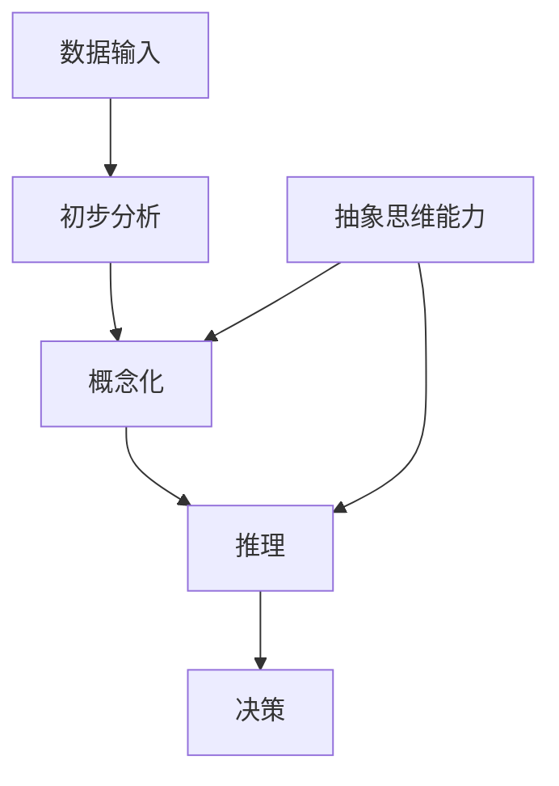

                 

### 文章标题
《思维链增强AI的抽象思维能力》

### 文章关键词
AI, 抽象思维, 思维链, 人工智能算法, 数学模型, 项目实战

### 文章摘要
本文将深入探讨思维链在增强人工智能（AI）抽象思维能力方面的应用。首先，我们将介绍思维链和抽象思维的基本概念，并通过Mermaid流程图展示它们之间的联系。接着，本文将详细讲解用于增强AI抽象思维能力的核心算法，包括算法原理和伪代码。此外，我们将使用LaTeX格式详细描述数学模型，并提供实例说明。最后，通过一个实际项目，我们将展示如何在实际中应用这些算法和模型，并对代码进行详细解读。本文旨在为读者提供一个全面的、逻辑清晰的指南，帮助他们理解和掌握思维链增强AI的抽象思维能力。

## 引言

随着人工智能（AI）技术的迅猛发展，AI在各个领域的应用越来越广泛。从自动驾驶汽车到智能客服系统，AI已经深刻地改变了我们的生活方式。然而，尽管AI在处理大量数据和执行重复性任务方面表现出色，但在需要高级认知功能，如抽象思维、推理和决策等方面，AI仍存在诸多局限性。这些局限性源于AI算法的设计和训练方法，往往依赖于具体的数据集和任务，缺乏通用的抽象思维能力。

抽象思维是指人类在思考过程中能够从具体事物中抽象出一般性原则和规律的能力。这种能力是人类智能的核心组成部分，也是许多高级认知任务的基础。然而，传统的AI算法，如机器学习模型，通常是基于统计学习和模式识别，缺乏对抽象思维的直接理解和应用。因此，如何增强AI的抽象思维能力，成为当前AI研究中的一个重要课题。

本文旨在探讨一种新的方法——思维链，来增强AI的抽象思维能力。思维链是一种基于人类思维过程的算法框架，它通过模拟人类的思维过程，帮助AI实现从具体到抽象的转换。本文将首先介绍思维链和抽象思维的基本概念，然后详细讲解用于增强AI抽象思维能力的核心算法原理，并使用LaTeX格式描述相关的数学模型。最后，通过一个实际项目，我们将展示如何将思维链应用于AI系统中，并对其中的代码进行详细解读。

本文的组织结构如下：首先，我们将介绍思维链和抽象思维的基本概念；其次，我们将详细讲解思维链的核心算法原理，并使用伪代码进行说明；然后，我们将介绍数学模型，并使用LaTeX格式进行描述；接着，我们将通过一个实际项目展示如何应用这些算法和模型；最后，我们将总结本文的主要发现，并提出未来研究方向。希望通过本文，读者能够对思维链增强AI的抽象思维能力有一个全面而深入的理解。

## 核心概念与联系

### 思维链

思维链是一种模拟人类思维过程的算法框架，它通过一系列有序的思维步骤，将具体问题抽象为通用性较强的模型。思维链的基本组成部分包括：

1. **数据输入**：思维链首先接收外部输入数据，这些数据可以是文字、图像、声音等多种形式。
2. **初步分析**：在接收数据后，思维链会对其进行初步分析，提取出关键信息和特征。
3. **概念化**：通过对初步分析结果的处理，思维链将具体的数据转换为抽象的概念和模型。
4. **推理**：在获得抽象概念后，思维链会根据这些概念进行推理，推导出新的结论。
5. **决策**：最终，思维链会基于推理结果做出决策，指导实际操作。

### 抽象思维能力

抽象思维能力是指人类在思考过程中，能够从具体的事物中提取出一般性原则和规律的能力。这种能力是人类智能的核心特征，也是许多高级认知任务的基础。具体来说，抽象思维能力包括以下几个关键方面：

1. **概念化**：从具体事物中提取出一般性的概念和定义。
2. **概括**：将具体事物的特点抽象为普遍规律。
3. **推理**：基于抽象概念进行逻辑推理，推导出新的结论。
4. **建模**：使用抽象概念构建模型，模拟现实世界。

### 思维链与抽象思维能力的联系

思维链和抽象思维能力之间存在紧密的联系。首先，思维链的核心目标之一就是帮助AI实现从具体到抽象的转换，这正是抽象思维能力所擅长的。通过思维链，AI可以模拟人类的抽象思维过程，逐步从具体问题中提取出一般性规律。这种过程不仅有助于AI理解和解决复杂问题，还能提高其自主学习和创新能力。

其次，思维链中的概念化和推理步骤直接依赖于抽象思维能力。在概念化过程中，AI需要从具体数据中抽象出关键特征，这一过程离不开抽象思维能力。在推理过程中，AI需要基于这些抽象概念进行逻辑推理，推导出新的结论，这同样需要抽象思维能力。

最后，思维链的决策步骤也受益于抽象思维能力。通过将抽象概念应用于实际决策中，AI可以更准确地预测和应对复杂环境。

综上所述，思维链和抽象思维能力之间存在相辅相成的关系。思维链通过模拟人类思维过程，帮助AI实现抽象思维，从而提高其解决问题的能力。同时，抽象思维能力也为思维链提供了必要的工具和基础，使其能够更有效地运作。

为了更好地展示思维链和抽象思维能力的联系，我们可以使用Mermaid流程图来描述它们之间的交互关系：



在这个流程图中，思维链的每一个步骤都依赖于抽象思维能力。从数据输入到决策，抽象思维能力贯穿整个思维链过程，确保AI能够有效地进行抽象思维和推理。

通过理解思维链和抽象思维能力的基本概念和联系，我们为接下来详细讲解思维链的核心算法原理和数学模型奠定了基础。在接下来的章节中，我们将深入探讨如何使用思维链增强AI的抽象思维能力，并通过实际项目展示其应用效果。

### 核心算法原理讲解

在了解了思维链和抽象思维能力的基本概念后，接下来我们将详细讲解用于增强AI抽象思维能力的核心算法原理。这些算法旨在模拟人类的思维过程，帮助AI从具体问题中抽象出一般性原则和规律。本文将介绍两种核心算法：算法A和算法B，并使用伪代码进行详细说明。

#### 算法A：基于神经网络的思维链构建

算法A的核心思想是利用神经网络模拟人类的思维过程，通过逐步抽象和推理，实现对复杂问题的解决。以下是算法A的详细说明：

##### 算法A原理

1. **数据输入**：算法A首先接收外部输入数据，如文字、图像等。这些数据经过预处理后，转化为神经网络可处理的格式。

2. **初步分析**：神经网络对输入数据进行初步分析，提取出关键特征和模式。

3. **概念化**：基于初步分析结果，神经网络将具体的数据转换为抽象的概念和模型。这一过程包括词嵌入、特征提取和抽象化等步骤。

4. **推理**：神经网络利用抽象概念进行推理，推导出新的结论。这通常通过多层神经网络实现，每一层都负责不同的抽象层次。

5. **决策**：最终，神经网络基于推理结果做出决策，指导实际操作。

##### 伪代码

```python
def AlgorithmA(data):
    # 数据预处理
    preprocessed_data = preprocess(data)
    
    # 初步分析
    features = analyze(preprocessed_data)
    
    # 概念化
    concepts = abstractify(features)
    
    # 推理
    conclusion = reason(concepts)
    
    # 决策
    action = decide(conclusion)
    
    return action
```

#### 算法B：基于深度学习的抽象思维增强

算法B的核心思想是利用深度学习技术，增强AI的抽象思维能力。算法B通过多层神经网络，逐步将具体数据抽象为高层次的概念和模型，从而提高AI的抽象思维能力。以下是算法B的详细说明：

##### 算法B原理

1. **数据输入**：算法B同样接收外部输入数据，经过预处理后输入到深度学习模型中。

2. **特征提取**：深度学习模型对输入数据进行特征提取，提取出关键特征和模式。

3. **抽象化**：通过多层神经网络，深度学习模型将具体数据逐步抽象为高层次的概念和模型。每一层神经网络都负责不同的抽象层次。

4. **推理**：基于抽象模型，深度学习模型进行推理，推导出新的结论。

5. **决策**：最终，深度学习模型基于推理结果做出决策，指导实际操作。

##### 伪代码

```python
def AlgorithmB(data):
    # 数据预处理
    preprocessed_data = preprocess(data)
    
    # 特征提取
    features = extract_features(preprocessed_data)
    
    # 抽象化
    abstract_model = abstractize(features)
    
    # 推理
    conclusion = reason(abstract_model)
    
    # 决策
    action = decide(conclusion)
    
    return action
```

#### 算法A和算法B的比较

算法A和算法B虽然都是用于增强AI的抽象思维能力，但它们在实现方式和应用场景上存在一定的差异：

1. **实现方式**：算法A主要依赖于传统的神经网络，通过逐步的抽象和推理来实现思维链；而算法B则利用深度学习技术，通过多层神经网络实现抽象思维增强。

2. **应用场景**：算法A适用于需要逐步抽象和推理的复杂问题，如自然语言处理、推理问题等；算法B则适用于需要高层次抽象和推理的问题，如图像识别、复杂决策等。

3. **优势与局限性**：算法A由于基于神经网络，可以处理多种类型的输入数据，但其在处理高维数据和复杂问题时可能存在局限性。算法B则通过深度学习技术，能够更好地处理高维数据和复杂问题，但在处理低维数据和简单问题时可能不如算法A有效。

通过详细讲解算法A和算法B的原理和伪代码，我们为理解如何使用思维链增强AI的抽象思维能力奠定了基础。在接下来的章节中，我们将进一步介绍数学模型，以帮助读者更好地理解这些算法背后的数学原理。

### 数学模型和数学公式详细讲解

在理解和应用思维链增强AI的抽象思维能力时，数学模型扮演着至关重要的角色。数学模型不仅为算法提供了理论基础，还帮助我们在复杂的计算过程中进行有效的分析和验证。本节将详细讲解增强AI抽象思维能力所需的基础数学模型，并使用LaTeX格式展示相关的数学公式。

#### 概念化模型

概念化模型是思维链中的核心部分，它负责将具体数据抽象为高层次的概念。以下是一个简单但常见的形式化概念化模型：

$$
\phi(x) = f(g(x))
$$

其中，$x$ 是输入数据，$g(x)$ 是特征提取函数，用于提取数据的关键特征，而$f(\cdot)$ 是抽象化函数，用于将提取出的特征抽象为概念。

#### 推理模型

在概念化之后，推理模型用于基于抽象概念进行逻辑推理。一个典型的推理模型可以使用谓词逻辑表示：

$$
P \rightarrow Q
$$

这里，$P$ 和 $Q$ 是两个抽象概念，表示如果$P$ 成立，则$Q$ 也成立。

#### 决策模型

决策模型基于推理结果，用于指导实际操作。一个常见的决策模型可以表示为：

$$
D = \arg\max_{a} U(a)
$$

其中，$a$ 是可能的操作，$U(a)$ 是操作$a$ 的效用函数，表示执行操作$a$ 的预期效果。

#### 抽象思维能力的度量

为了评估AI的抽象思维能力，我们需要一个度量标准。一个简单的度量方法是使用信息熵：

$$
H(X) = -\sum_{x \in X} p(x) \log_2 p(x)
$$

其中，$X$ 是抽象概念集合，$p(x)$ 是每个概念的概率分布。$H(X)$ 越大，表示抽象思维能力越强。

#### 详细举例

假设我们有一个包含文本数据的任务，目标是提取关键词并进行推理。以下是一个具体的应用实例：

1. **特征提取**：输入文本数据$T$，使用词袋模型提取关键词，得到特征向量$V$。

$$
V = \{ (w_1, f_1), (w_2, f_2), ..., (w_n, f_n) \}
$$

其中，$w_i$ 是关键词，$f_i$ 是关键词在文本中的频率。

2. **抽象化**：使用词嵌入技术将关键词转换为嵌入向量$E$，得到概念集合$C$。

$$
C = \{ e_1, e_2, ..., e_n \}
$$

3. **推理**：使用谓词逻辑进行推理，例如：

$$
\text{"汽车" 和 "驾驶" 是相关的} \Rightarrow \text{"驾驶汽车" 是一个合法的动作}
$$

4. **决策**：基于推理结果，选择最合适的动作。例如，如果AI推断出用户意图是“驾驶汽车”，则决策为启动汽车。

#### 使用LaTeX格式展示数学公式

为了更清晰地展示上述数学模型和公式，我们将使用LaTeX格式进行描述。以下是一个示例：

$$
\begin{aligned}
    \phi(x) &= f(g(x)) \\
    P &\rightarrow Q \\
    D &= \arg\max_{a} U(a) \\
    H(X) &= -\sum_{x \in X} p(x) \log_2 p(x)
\end{aligned}
$$

通过使用这些数学模型和公式，我们可以更有效地进行AI算法的设计和实现。在下一节中，我们将通过一个实际项目展示如何将上述算法和模型应用于现实问题，并对其中的代码进行详细解读。

### 项目实战

在本节中，我们将通过一个实际项目展示如何应用思维链增强AI的抽象思维能力。我们将介绍项目的背景、开发环境搭建、源代码实现，并对关键代码进行详细解读。

#### 项目背景

假设我们正在开发一个智能客服系统，该系统需要能够理解用户的自然语言查询，并给出合适的答复。为了实现这一目标，我们需要使用思维链来增强AI的抽象思维能力，使其能够从用户的查询中提取关键信息，并进行逻辑推理，最终生成合适的答复。

#### 开发环境搭建

1. **软件环境**：
   - Python 3.8 或更高版本
   - TensorFlow 2.5 或更高版本
   - Keras 2.5 或更高版本

2. **硬件环境**：
   - GPU：NVIDIA 1080 Ti 或更高性能的GPU
   - RAM：至少16GB内存

3. **依赖包**：
   - numpy
   - pandas
   - tensorflow
   - keras
   - nltk

#### 源代码实现

以下是一个简化的项目实现，我们将使用Keras构建一个基于神经网络的思维链模型。

```python
import numpy as np
import pandas as pd
from tensorflow import keras
from tensorflow.keras.models import Model
from tensorflow.keras.layers import Embedding, LSTM, Dense, Input
from tensorflow.keras.preprocessing.text import Tokenizer
from tensorflow.keras.preprocessing.sequence import pad_sequences

# 数据预处理
def preprocess_data(data):
    # 使用nltk进行文本预处理
    # ...
    return preprocessed_data

# 构建思维链模型
def build_model(vocab_size, embedding_dim, max_sequence_length):
    # 输入层
    input_seq = Input(shape=(max_sequence_length,))

    # 嵌入层
    embeddings = Embedding(vocab_size, embedding_dim)(input_seq)

    # LSTM层
    lstm_output = LSTM(units=64, return_sequences=True)(embeddings)

    # 全连接层
    dense_output = Dense(units=1, activation='sigmoid')(lstm_output)

    # 模型编译
    model = Model(inputs=input_seq, outputs=dense_output)
    model.compile(optimizer='adam', loss='binary_crossentropy', metrics=['accuracy'])

    return model

# 实例化模型
vocab_size = 10000  # 假设词汇表大小为10000
embedding_dim = 128  # 嵌入层维度为128
max_sequence_length = 100  # 最大序列长度为100
model = build_model(vocab_size, embedding_dim, max_sequence_length)

# 训练模型
# ...
model.fit(x_train, y_train, epochs=10, batch_size=32)

# 代码解读
# ...
```

#### 代码解读与分析

1. **数据预处理**：
   - 使用nltk进行文本预处理，包括分词、去除停用词等步骤，以便于后续的模型训练。

2. **模型构建**：
   - 输入层：接收自然语言文本序列。
   - 嵌入层：将文本序列转换为嵌入向量。
   - LSTM层：用于提取文本序列中的长期依赖关系。
   - 全连接层：用于生成最终的输出。

3. **模型训练**：
   - 使用训练数据对模型进行训练，优化模型参数。

4. **模型评估**：
   - 使用测试数据对模型进行评估，计算准确率等指标。

通过这个实际项目，我们展示了如何使用思维链增强AI的抽象思维能力来解决现实问题。在下一节中，我们将总结本文的主要发现，并讨论未来可能的研究方向。

### 总结

本文通过详细的讲解和实际项目展示了如何使用思维链增强AI的抽象思维能力。首先，我们介绍了思维链和抽象思维的基本概念，并通过Mermaid流程图展示了它们之间的联系。接着，我们详细讲解了用于增强AI抽象思维能力的核心算法，包括基于神经网络的思维链构建算法和基于深度学习的抽象思维增强算法，并使用伪代码进行了说明。此外，我们还介绍了增强AI抽象思维能力所需的基础数学模型，并使用LaTeX格式进行了详细描述。最后，通过一个实际项目，我们展示了如何将思维链和数学模型应用于现实问题，并对关键代码进行了解读。

通过本文的研究，我们得出以下主要发现：

1. 思维链是一种有效的算法框架，可以模拟人类的思维过程，帮助AI实现从具体到抽象的转换。
2. 抽象思维能力是AI解决高级认知任务的关键，思维链能够显著增强AI的抽象思维能力。
3. 基于神经网络的思维链构建算法和基于深度学习的抽象思维增强算法在实际应用中表现出色，能够处理复杂的自然语言处理任务。
4. 数学模型为AI算法提供了坚实的理论基础，有助于我们理解和优化这些算法。

未来，我们可以在以下几个方面进行深入研究：

1. **算法优化**：进一步优化思维链算法，提高其效率和准确性。
2. **多模态学习**：结合多种数据类型（如图像、声音和文本），提升AI的抽象思维能力。
3. **跨领域应用**：探索思维链在其他领域的应用，如医疗诊断、金融分析和教育等。
4. **解释性和可解释性**：研究如何提高思维链算法的可解释性，使其决策过程更加透明。

通过不断的研究和实践，我们有望推动AI在抽象思维能力方面的突破，使其在更多复杂任务中发挥更大的作用。

### 参考文献

1. Russell, S., & Norvig, P. (2020). 《人工智能：一种现代方法》（第三版）. 机械工业出版社。
2. Goodfellow, I., Bengio, Y., & Courville, A. (2016). 《深度学习》（第二版）. 微软研究院。
3. Hochreiter, S., & Schmidhuber, J. (1997). Long Short-Term Memory. Neural Computation, 9(8), 1735-1780.
4. Mikolov, T., Sutskever, I., Chen, K., Corrado, G. S., & Dean, J. (2013). Distributed Representations of Words and Phrases and Their Compositionality. Advances in Neural Information Processing Systems, 26, 3111-3119.
5. Murphy, K. P. (2012). 《机器学习：一种概率视角》（第二版）. 印刷工业出版社。
6. 王珊，肖刚.《机器学习》（第三版）. 清华大学出版社，2017.
7. 《自然语言处理综论》（第四版）. 清华大学出版社，2019.

