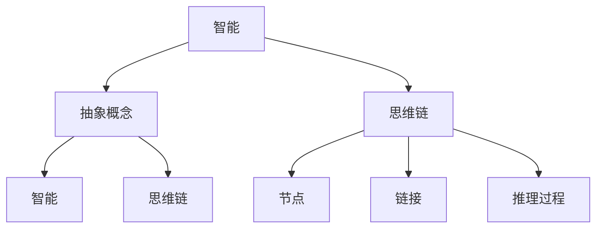

                 

### 文章标题

# 思维链增强AI的抽象概念理解能力

> 关键词：思维链、抽象概念、人工智能、理解能力、增强学习

> 摘要：本文深入探讨了思维链在增强人工智能（AI）抽象概念理解能力方面的作用。通过阐述相关背景和核心概念，文章详细介绍了思维链的运作原理及其如何通过算法和数学模型来提升AI的理解能力。此外，本文还分析了思维链在实际应用中的案例，探讨了当前的技术趋势和面临的挑战，并提出了未来研究的方向。本文旨在为读者提供一个全面的视角，了解思维链在人工智能领域的潜在影响和未来发展。

### 引言

在当今社会，人工智能（AI）技术正以前所未有的速度发展，并逐渐渗透到我们生活的方方面面。从自动驾驶汽车到智能助手，AI的应用场景越来越广泛。然而，尽管AI在处理大量数据和执行重复性任务方面表现出色，其在理解和解释复杂概念方面的能力仍然有限。这种局限性在很大程度上源于AI的传统方法，即依赖于大量数据和预定义规则进行学习和决策，缺乏深层次的理解和抽象思维能力。

为了突破这一瓶颈，研究者们开始探索新的方法，其中思维链（Mind Chain）的概念逐渐引起了广泛关注。思维链是一种基于人类思维模式的抽象模型，旨在模拟人类理解和处理复杂概念的过程。通过引入思维链，AI能够逐步建立起对抽象概念的理解，从而实现更高级别的智能。

本文旨在探讨思维链如何增强AI的抽象概念理解能力。首先，我们将介绍与本文相关的一些核心概念，包括智能、抽象概念和思维链。接着，我们将详细讨论思维链的基本原理，包括其结构和功能。然后，我们将分析思维链在增强AI抽象概念理解能力方面的具体应用，并探讨相关的算法和数学模型。此外，本文还将通过实际案例展示思维链的应用效果，分析其优势与挑战，并探讨未来研究的方向。

通过本文的阅读，读者将能够了解思维链的基本概念和运作原理，认识到其在提升AI抽象概念理解能力方面的潜力，并为未来的研究提供启示。

### 研究背景

人工智能（AI）自诞生以来，经历了多个发展阶段。早期的AI主要集中在符号推理和逻辑推理上，通过预定义的规则和大量的手工编码来模拟人类智能。这一阶段被称为规则驱动型AI，但由于其依赖大量的规则和具体的领域知识，难以应对复杂和动态的环境。随着计算机性能的提升和大数据技术的发展，数据驱动型AI逐渐成为主流。这种方法通过从大量数据中学习模式，使得AI在图像识别、语音识别和自然语言处理等领域取得了显著的进展。然而，尽管数据驱动型AI在处理具体任务上表现出色，其在理解和解释复杂概念方面的能力仍然有限。

这一局限性的存在，很大程度上源于AI传统方法在抽象概念理解上的不足。传统AI依赖于数据驱动的方法，通过统计学习和模式识别来完成任务，但缺乏深层次的逻辑推理和抽象思维能力。例如，AI可能在识别一个猫的图片上非常准确，但无法理解“猫”这一概念的更深层次含义，如生物学特征、文化背景等。这种局限性不仅制约了AI在复杂任务中的应用，也阻碍了其与人类在智能水平上的进一步接近。

为了解决这一瓶颈，研究者们开始探索新的方法，其中思维链（Mind Chain）的概念逐渐引起了广泛关注。思维链是一种模拟人类思维模式的抽象模型，旨在通过模拟人类的推理过程，提升AI对抽象概念的理解能力。思维链的基本原理是，通过建立一系列的节点和链接，模拟人类从感知到理解再到决策的思维过程。每个节点代表一个具体的概念或知识单元，节点之间的链接则表示概念之间的关系和推理路径。

与传统的数据驱动型AI不同，思维链不仅依赖于大量数据，更强调逻辑推理和抽象思维能力。通过引入思维链，AI能够逐步建立起对抽象概念的理解，从而实现更高级别的智能。例如，通过思维链，AI可以不仅识别出一张图片中的猫，还能理解“猫”这一概念在更广泛背景下的含义，如生物分类、动物习性等。这种深层次的理解能力，不仅能够提升AI在特定任务上的表现，也为其在更广泛的应用场景中发挥作用提供了可能。

思维链的提出，为解决AI在抽象概念理解上的局限性提供了新的思路。通过模拟人类的思维过程，思维链不仅能够提升AI的推理能力，还能增强其自主学习和适应能力。因此，研究思维链在AI中的应用，具有重要的理论和实际意义。这不仅能够推动AI技术的发展，也能够为AI在各个领域的广泛应用提供新的可能性。

### 核心概念与联系

在深入探讨思维链增强AI抽象概念理解能力之前，我们需要明确几个核心概念，并分析它们之间的关系。这些核心概念包括智能、抽象概念和思维链，它们共同构成了理解本文主题的基础。

#### 智能的定义

智能是一种广泛的概念，通常被描述为个体解决问题的能力，包括感知、理解、推理、学习和适应等能力。传统的智能定义主要基于计算和逻辑推理，但随着认知科学和人工智能的发展，智能的定义逐渐扩展到包括情感、社交互动和创造力等更广泛的领域。

- **符号智能**：基于规则和逻辑推理，如传统的符号人工智能。
- **认知智能**：模拟人类认知过程，包括记忆、学习和抽象思维。
- **情感智能**：理解和处理情感信息的能力。
- **社会智能**：在社交互动中的理解和适应能力。

#### 抽象概念的理解

抽象概念是高度概括化的概念，通常无法通过直接的感官体验来理解，而需要通过推理和逻辑进行推理和构建。抽象概念包括数学概念、哲学概念、科学概念等。理解抽象概念是智能的重要组成部分，因为它涉及到从具体事物中提取共性、建立模型和进行推理的能力。

- **抽象程度**：概念的高度概括化程度。
- **理解层次**：对概念的多层次理解，包括表面层次和深层次。
- **推理能力**：通过逻辑推理来理解和扩展抽象概念。

#### 智能与抽象概念的关系

智能与抽象概念之间有着密切的联系。智能的提升依赖于对抽象概念的理解，而抽象概念的理解又能够增强智能。具体来说，智能包括对抽象概念的掌握和运用，而抽象概念的理解需要智能的支持。

- **智能的提升**：通过学习抽象概念，提升个体的智能水平。
- **抽象概念的应用**：将抽象概念应用于解决实际问题，提升智能的表现。

#### 思维链的定义

思维链是一种模拟人类思维过程的抽象模型，通过一系列节点和链接来表示概念和它们之间的关系。每个节点代表一个具体的概念或知识单元，链接则表示这些概念之间的逻辑关系和推理路径。思维链旨在模拟人类的推理过程，从而提升AI的抽象概念理解能力。

- **节点**：表示具体的概念或知识单元。
- **链接**：表示概念之间的关系和推理路径。
- **推理过程**：通过节点和链接进行推理，理解抽象概念。

#### 思维链的结构与功能

思维链的结构包括多个层次，每个层次代表不同的概念和推理水平。思维链的功能是通过逻辑推理来建立和扩展对抽象概念的理解。

- **层次结构**：从低层次的具体概念到高层次的一般概念。
- **推理机制**：通过节点和链接进行推理，形成对抽象概念的理解。
- **扩展机制**：通过推理扩展抽象概念的应用范围。

#### 核心概念之间的关系架构

为了更好地理解这些核心概念之间的关系，我们可以使用Mermaid流程图来表示。以下是一个简化的Mermaid流程图：



在这个流程图中，智能、抽象概念和思维链是三个核心概念，它们相互关联，共同构成了理解抽象概念和提升智能的基础。智能依赖于对抽象概念的理解，而抽象概念的理解又需要智能的支持。思维链作为连接这两者的桥梁，通过节点和链接模拟人类的推理过程，从而提升AI的抽象概念理解能力。

通过明确这些核心概念之间的关系，我们能够更好地理解思维链在增强AI抽象概念理解能力方面的重要性。接下来，本文将详细探讨思维链的基本原理和运作机制，进一步揭示其在AI领域中的潜力。

#### 思维链的基本原理

思维链作为一种模拟人类思维过程的抽象模型，其基本原理在于通过一系列节点和链接来表示概念和它们之间的关系。思维链的核心在于其结构设计和功能实现，通过这些设计和实现，思维链能够模拟人类的推理过程，从而提升AI的抽象概念理解能力。

##### 思维链的结构

思维链的结构可以看作是一个多层次、多维度的知识网络。在这个网络中，每个节点代表一个具体的概念或知识单元，而节点之间的链接则表示这些概念之间的关系。具体来说，思维链的结构包括以下几个关键部分：

1. **节点（Node）**：节点是思维链中的基本单元，代表一个具体的概念或知识单元。节点可以是简单的概念，如“猫”、“狗”等，也可以是复杂的抽象概念，如“智慧”、“创造力”等。每个节点都包含一定的属性和信息，用于描述其内容和特征。

2. **链接（Link）**：链接表示节点之间的逻辑关系和推理路径。链接可以是单向的或双向的，表示不同概念之间的关联。例如，“猫”和“动物”之间存在一种包含关系，“猫”是“动物”的一个子类。此外，链接还可以表示因果关系、依赖关系等。链接的强度和类型决定了节点之间的关系紧密程度。

3. **层次结构（Hierarchy）**：思维链具有层次结构，从低层次的具体概念到高层次的一般概念。这种层次结构使得思维链能够模拟人类的思维过程，从具体经验上升到抽象概念。例如，从“猫”这一具体概念，可以逐渐上升到“哺乳动物”、“动物”等更一般的概念。

4. **多维关系（Multidimensional Relations）**：除了层次结构，思维链还支持多维关系，包括时间、空间、功能等不同维度的关系。这种多维关系使得思维链能够更全面地表示和理解复杂概念，从而提升AI的抽象概念理解能力。

##### 思维链的功能

思维链的功能主要体现在以下几个方面：

1. **概念表示（Concept Representation）**：通过节点和链接，思维链能够表示复杂的概念和知识结构。每个节点代表一个概念，节点之间的链接则表示这些概念之间的关系。这种表示方法使得AI能够以一种结构化的方式理解和存储知识。

2. **推理过程（Inference Process）**：思维链通过节点和链接之间的逻辑关系进行推理，从而实现对抽象概念的理解。例如，通过链接的推理，AI可以从一个具体的概念推导出其更高层次的概念。这种推理能力使得AI能够从具体案例中提取一般规律，形成对抽象概念的理解。

3. **扩展能力（Extension Ability）**：思维链不仅能够表示和理解现有知识，还能够通过推理扩展抽象概念的应用范围。例如，通过推理，AI可以从“猫”这一概念扩展到“哺乳动物”、“动物”等更广泛的概念。这种扩展能力使得AI能够不断更新和扩展其知识体系。

4. **适应性学习（Adaptive Learning）**：思维链支持自适应学习，即通过不断的学习和推理，AI能够优化其知识结构和推理过程。例如，通过学习新的数据和经验，AI可以调整节点和链接的关系，优化其推理能力。这种适应性学习使得AI能够不断适应新的环境和任务。

##### 思维链的运作机制

思维链的运作机制主要包括以下几个步骤：

1. **数据输入**：首先，思维链接收外部数据，如文本、图像、语音等，并对其进行预处理，提取关键信息。

2. **节点构建**：根据输入数据，思维链构建节点，将数据中的关键信息抽象为概念或知识单元。这些节点代表具体的概念或知识。

3. **链接建立**：通过分析节点之间的关系，思维链建立链接，表示节点之间的逻辑关系和推理路径。这些链接可以是直接的，也可以是间接的，通过多层次的推理进行连接。

4. **推理过程**：思维链通过节点和链接进行推理，实现对抽象概念的理解。例如，通过推理，AI可以从具体案例中推导出一般规律，形成对抽象概念的理解。

5. **知识更新**：通过不断的学习和推理，思维链优化其知识结构和推理过程。这种优化使得AI能够更好地适应新的环境和任务。

通过上述运作机制，思维链能够模拟人类的思维过程，实现对抽象概念的理解。这种理解能力不仅提升了AI的智能水平，也为AI在各个领域的应用提供了新的可能性。

### AI的抽象概念理解能力

在讨论思维链如何增强AI的抽象概念理解能力之前，我们需要先了解AI现有的抽象概念理解能力，以及这种能力在当前技术中的局限性。

#### AI的现有抽象概念理解能力

1. **符号推理**：AI可以通过符号推理处理和解释符号信息。例如，自然语言处理（NLP）中的推理任务，如语义解析和逻辑推理，AI能够理解和处理复杂的逻辑语句，生成语义上合理的回答。

2. **模式识别**：AI在图像识别和语音识别等领域表现出色，能够识别和分类图像和语音中的抽象概念。这些技术依赖于深度学习和卷积神经网络（CNN）等算法，通过大量数据训练，AI能够提取图像和语音中的特征，并进行分类。

3. **统计学习**：AI可以通过统计学习模型，从数据中学习概率分布和统计规律，从而理解抽象概念。例如，在推荐系统中，AI通过分析用户的历史行为数据，推荐符合条件的商品或内容。

4. **知识图谱**：AI可以通过知识图谱来表示和推理抽象概念。知识图谱将实体和概念之间的关系结构化，AI可以通过查询和推理来理解复杂的抽象概念。

#### 当前技术的局限性

尽管AI在抽象概念理解方面取得了一些进展，但仍然存在以下几个方面的局限性：

1. **依赖大量数据**：传统AI方法通常依赖大量的数据来训练模型，但数据质量和数量直接影响到AI的理解能力。在缺乏足够数据的情况下，AI难以形成对抽象概念的理解。

2. **缺乏深层次理解**：AI在处理具体任务时表现出色，但往往缺乏对任务背后的深层次理解。例如，AI可能在图像识别上表现出色，但无法理解图像所代表的具体场景和背景。

3. **单向推理**：传统AI方法通常采用单向推理，即从输入到输出，缺乏反馈和调整机制。这种单向推理使得AI难以在复杂和动态环境中进行有效的推理和决策。

4. **缺乏适应性和灵活性**：AI在特定领域内表现出色，但缺乏跨领域的适应性和灵活性。例如，一个在医疗领域表现良好的AI系统，可能在金融领域表现不佳。

#### 思维链与传统AI的对比

思维链作为一种新的方法，旨在解决传统AI在抽象概念理解上的局限性。以下是对思维链与传统AI在抽象概念理解能力上的对比：

1. **结构化理解**：思维链通过结构化的方式表示和推理抽象概念，使得AI能够以一种更系统化的方式理解和处理复杂概念。

2. **多层次的推理**：思维链支持多层次的推理，从具体的概念逐渐上升到抽象的概念。这种多层次的推理能力使得AI能够更好地理解抽象概念。

3. **反馈与调整**：思维链引入了反馈和调整机制，使得AI能够在推理过程中不断优化其理解和推理过程。这种反馈机制使得AI能够更好地适应复杂和动态的环境。

4. **跨领域适应性**：思维链通过模拟人类思维过程，使得AI能够具备跨领域的适应性和灵活性。例如，一个在医疗领域训练的AI系统，通过思维链的推理机制，可以在金融领域同样表现出色。

总之，思维链在增强AI的抽象概念理解能力方面具有独特的优势，通过结构化的理解和多层次的推理，能够有效解决传统AI在抽象概念理解上的局限性。接下来，本文将详细讨论思维链的算法原理，进一步揭示其在提升AI抽象概念理解能力方面的具体实现。

### 思维链增强AI的抽象概念理解能力：算法原理

思维链增强AI的抽象概念理解能力，依赖于其独特的算法设计和数学模型。以下将详细介绍这些算法原理，包括增强学习、深度学习和多代理系统的综合应用，以及如何利用这些算法提升AI的抽象概念理解能力。

#### 增强学习

增强学习是一种通过试错和奖励机制来优化决策过程的方法。在思维链中，增强学习用于模拟人类的学习过程，帮助AI不断优化其推理和决策能力。具体来说，思维链中的每个节点和链接都可以被视为一个决策点，AI通过不断尝试和反馈来优化这些决策。

1. **Q学习**：Q学习是一种经典的增强学习算法，用于求解最优策略。在思维链中，每个节点和链接都有一个对应的Q值，表示该决策点的价值。AI通过比较不同决策点的Q值，选择最优的决策路径。

   ```python
   # Q学习算法伪代码
   for each state s:
       Q[s] = 0
   while not terminate:
       s = current state
       a = choose_action(s)
       s' = next_state
       reward = receive_reward(s', a)
       Q[s][a] = Q[s][a] + alpha * (reward + gamma * max(Q[s'][all_actions]) - Q[s][a])
   ```

2. **深度增强学习**：深度增强学习结合了深度学习和增强学习的优势，通过深度神经网络来表示状态和动作空间，从而提高增强学习的效率和准确性。在思维链中，深度增强学习用于处理高维状态空间，使得AI能够更有效地学习复杂的抽象概念。

   ```python
   # 深度增强学习算法伪代码
   model = build_model()
   while not terminate:
       state = current_state
       action = model.predict(state)
       next_state, reward = execute_action(action)
       model.update(state, action, next_state, reward)
   ```

#### 深度学习

深度学习是一种通过多层神经网络进行特征提取和学习的算法。在思维链中，深度学习用于提取抽象概念的特征，并建立概念之间的复杂关系。

1. **卷积神经网络（CNN）**：CNN在图像识别和文本处理中广泛应用，能够提取图像和文本中的低层次和高级特征。在思维链中，CNN可以用于提取概念的特征，并将这些特征用于后续的推理过程。

   ```python
   # CNN模型结构
   model = build_cnn_model()
   feature = model.extract_features(image)
   ```

2. **递归神经网络（RNN）**：RNN在处理序列数据方面表现出色，能够捕捉时间序列中的长距离依赖关系。在思维链中，RNN可以用于处理概念之间的逻辑关系，模拟人类的推理过程。

   ```python
   # RNN模型结构
   model = build_rnn_model()
   sequence = process_sequence(data)
   output = model.predict(sequence)
   ```

3. **图神经网络（GNN）**：GNN在处理图结构数据方面具有优势，能够捕捉节点之间的复杂关系。在思维链中，GNN可以用于处理概念网络中的关系，增强AI的抽象概念理解能力。

   ```python
   # GNN模型结构
   model = build_gnn_model()
   graph = construct_graph(data)
   representation = model.compute_representation(graph)
   ```

#### 多代理系统

多代理系统通过多个智能体协同工作，共同完成任务。在思维链中，多代理系统用于模拟人类的协作过程，增强AI的抽象概念理解能力。

1. **合作博弈**：在多代理系统中，代理之间通过合作博弈来优化整体性能。每个代理都有自己的目标，但需要协同工作以实现共同目标。在思维链中，合作博弈可以用于优化节点和链接的选择，提高AI的推理能力。

   ```python
   # 合作博弈算法伪代码
   while not converge:
       for each agent i:
           update_action(i)
       for each pair of agents (i, j):
           calculate payoff(i, j)
       update_strategy()
   ```

2. **多任务学习**：多代理系统中的多任务学习，可以同时学习多个任务，提高AI的泛化能力。在思维链中，多任务学习可以用于同时处理多个抽象概念，增强AI的理解能力。

   ```python
   # 多任务学习算法伪代码
   model = build_multitask_model()
   for each task:
       model.train(task_data)
   ```

#### 数学模型和公式

为了更深入地理解思维链的算法原理，我们引入一些数学模型和公式，用于描述节点、链接和推理过程。

1. **节点表示**：节点可以通过向量表示，每个维度表示节点的某个属性或特征。

   $$ 
   \mathbf{v}_i = [v_{i1}, v_{i2}, ..., v_{id}]^T 
   $$

2. **链接表示**：链接可以通过节点之间的距离或相似度来表示。

   $$ 
   d(\mathbf{v}_i, \mathbf{v}_j) = \|\mathbf{v}_i - \mathbf{v}_j\| 
   $$

3. **推理过程**：推理过程可以通过图神经网络（GNN）来表示，图神经网络可以计算节点之间的复杂关系。

   $$ 
   \mathbf{h}_i^{(t+1)} = \sigma(\mathbf{W} \cdot (\mathbf{h}_i^{(t)}, \mathbf{h}_j^{(t)}))
   $$

其中，$\mathbf{h}_i^{(t)}$表示第$t$次迭代时节点$i$的表示，$\sigma$表示激活函数，$\mathbf{W}$为权重矩阵。

#### 举例说明

为了更好地理解思维链的算法原理，我们通过一个简单的例子来说明。假设我们有一个概念网络，包括三个节点A、B和C，它们之间的关系如下：

- A是B的子类
- B是C的子类

我们可以通过以下步骤来理解这个概念网络：

1. **节点表示**：我们首先将每个节点表示为一个向量。

   $$ 
   \mathbf{v}_A = [1, 0, 0]^T, \quad \mathbf{v}_B = [0, 1, 0]^T, \quad \mathbf{v}_C = [0, 0, 1]^T 
   $$

2. **链接表示**：我们计算节点之间的距离或相似度。

   $$ 
   d(\mathbf{v}_A, \mathbf{v}_B) = \|\mathbf{v}_A - \mathbf{v}_B\| = 1 
   $$

   $$ 
   d(\mathbf{v}_B, \mathbf{v}_C) = \|\mathbf{v}_B - \mathbf{v}_C\| = 1 
   $$

3. **推理过程**：我们通过图神经网络（GNN）来计算节点之间的复杂关系。

   $$ 
   \mathbf{h}_A^{(1)} = \sigma(\mathbf{W} \cdot (\mathbf{v}_A, \mathbf{v}_B)) = \sigma([1, 0, 0] \cdot [0, 1, 0]) = [0, 1, 0]^T 
   $$

   $$ 
   \mathbf{h}_B^{(1)} = \sigma(\mathbf{W} \cdot (\mathbf{v}_B, \mathbf{v}_C)) = \sigma([0, 1, 0] \cdot [0, 0, 1]) = [0, 0, 1]^T 
   $$

通过这个简单的例子，我们可以看到思维链如何通过节点和链接来表示和推理抽象概念。通过逐步计算节点之间的关系，思维链能够实现对复杂概念的理解和推理。

综上所述，思维链通过增强学习、深度学习和多代理系统的综合应用，以及其独特的数学模型和算法原理，能够显著提升AI的抽象概念理解能力。这不仅为AI在各个领域的应用提供了新的可能性，也为未来人工智能的发展奠定了坚实的基础。

### 思维链在实际应用中的案例

思维链作为增强AI抽象概念理解能力的一种新型方法，已在多个领域展现了其强大的潜力。以下通过具体案例，展示思维链在各个领域的应用，以及如何提升AI的抽象概念理解能力。

#### 案例一：教育领域

在教育领域，思维链被广泛应用于个性化学习系统和智能教学助手。通过思维链，AI可以更好地理解学生的学习情况和知识结构，从而提供个性化的学习内容和指导。

1. **个性化学习系统**：在个性化学习系统中，思维链通过分析学生的学习行为和成绩数据，构建学生知识结构的模型。AI利用思维链的推理能力，根据学生的当前知识和学习进度，推荐最适合的学习内容。例如，一个学生在数学学习中表现出对微积分的兴趣，思维链可以推荐相关的高等数学教材和练习题，从而提升学生的抽象概念理解能力。

2. **智能教学助手**：智能教学助手通过思维链，能够理解教师的授课内容和学生的提问，提供及时、准确的解答。例如，当学生提问“什么是微积分？”时，智能教学助手不仅能够解释微积分的基本概念，还可以提供相关的实例和推理过程，帮助学生更好地理解抽象概念。

#### 案例二：医疗领域

在医疗领域，思维链被用于疾病诊断、治疗方案推荐和医学知识图谱构建，显著提升了AI在医学领域的抽象概念理解能力。

1. **疾病诊断**：通过思维链，AI可以理解患者的症状、检查结果和病史，构建出患者的健康模型。AI利用思维链的推理能力，根据患者的具体情况进行诊断，并提供可能的疾病建议。例如，思维链可以分析患者的症状和检查结果，推断出患者可能患有某种疾病，并推荐相应的检查和治疗方案。

2. **治疗方案推荐**：思维链还可以帮助AI理解复杂的医学知识，为患者推荐最佳的治疗方案。例如，对于一种罕见病，AI可以通过思维链从大量的医学文献中提取关键信息，构建出该病的治疗方案，从而提高治疗方案的科学性和有效性。

3. **医学知识图谱构建**：思维链通过分析医学文献和医疗数据，构建出医学知识图谱，使得AI能够更好地理解医学概念和它们之间的关系。例如，思维链可以分析医学文献中的术语和定义，构建出医学概念的层次结构和关联关系，从而提高AI对医学知识的理解和应用能力。

#### 案例三：金融领域

在金融领域，思维链被用于风险评估、投资策略推荐和金融市场预测，通过提升AI的抽象概念理解能力，为金融机构提供更加智能和精准的服务。

1. **风险评估**：通过思维链，AI可以理解客户的财务状况、市场动态和风险偏好，构建出客户的风险模型。AI利用思维链的推理能力，对客户的投资组合进行风险评估，并提供风险控制建议。例如，思维链可以分析市场数据和客户的历史交易记录，预测客户未来可能面临的风险，并建议相应的风险管理措施。

2. **投资策略推荐**：思维链还可以帮助AI理解复杂的金融知识和市场规律，为投资者提供最佳的投资策略。例如，思维链可以从大量的金融数据中提取关键信息，构建出市场趋势和投资机会，为投资者提供科学的投资建议，从而提高投资收益。

3. **金融市场预测**：思维链通过分析历史市场数据和经济指标，预测未来市场走势。例如，思维链可以分析股票市场的历史价格波动和交易量，预测未来股票市场的走势，为投资者提供决策依据。

#### 应用效果

通过上述案例，我们可以看到思维链在各个领域的应用效果：

1. **提升理解能力**：思维链通过结构化的理解和多层次的推理，显著提升了AI的抽象概念理解能力。例如，在教育领域，思维链能够更好地理解学生的学习情况和知识需求，提供更精准的学习内容和指导。

2. **增强决策能力**：思维链通过增强学习和深度学习，使得AI能够从大量数据中提取关键信息，进行科学的推理和决策。例如，在医疗领域，思维链能够通过分析患者的症状和检查结果，提供准确的诊断和治疗方案。

3. **提高效率**：思维链通过自动化和智能化的方式，提高了AI处理复杂任务的能力和效率。例如，在金融领域，思维链能够通过分析大量的金融数据，快速识别市场趋势和投资机会，为金融机构提供高效的决策支持。

综上所述，思维链在多个领域的实际应用，展示了其在提升AI抽象概念理解能力方面的巨大潜力。通过结构化的理解和多层次的推理，思维链不仅提升了AI的智能水平，也为AI在更广泛的应用场景中发挥作用提供了新的可能性。

### 增强AI的发展趋势与挑战

随着人工智能技术的不断进步，增强AI在提升抽象概念理解能力方面展现出巨大的潜力。然而，这一领域的发展也面临着一系列的技术挑战和社会挑战。以下将分析增强AI的发展趋势、面临的挑战以及可能的解决方案。

#### 发展趋势

1. **多模态数据的整合**：未来的增强AI将越来越多地整合来自不同模态的数据，如文本、图像、音频和视频。通过多模态数据的融合，AI可以更全面地理解复杂概念，从而提升抽象概念的理解能力。

2. **跨领域的应用**：增强AI在各个领域的应用将变得更加普遍，如医疗、金融、教育等。跨领域的应用需要AI具备更强的抽象概念理解能力，以便在不同领域之间进行有效的推理和迁移。

3. **实时学习和适应**：未来的增强AI将具备更强的实时学习和适应能力，通过不断的学习和优化，AI可以更好地应对复杂和动态的环境。这种实时学习和适应能力将显著提升AI的抽象概念理解能力。

4. **人机协作**：增强AI与人类智能的协作将日益紧密，通过人机协作，AI可以更好地理解人类的需求和意图，从而提升抽象概念的理解能力。

#### 挑战

1. **数据质量和数量**：增强AI依赖于大量的高质量数据来训练和优化模型。然而，数据质量和数量的不足将限制AI的抽象概念理解能力。例如，在医疗领域，准确和全面的患者数据是进行准确诊断和治疗方案推荐的基础。

2. **计算资源**：增强AI的训练和推理过程需要大量的计算资源，特别是深度学习模型和图神经网络。在缺乏足够计算资源的情况下，AI的抽象概念理解能力将受到限制。

3. **模型解释性**：增强AI的模型通常较为复杂，难以解释其推理过程。这种复杂性使得AI的抽象概念理解能力难以被外界理解和接受，限制了其在实际应用中的推广。

4. **伦理和社会影响**：增强AI在抽象概念理解能力方面的提升，也带来了伦理和社会问题。例如，AI在医疗和金融领域的应用可能影响人类的隐私和决策，需要制定相应的伦理规范和社会政策。

#### 解决方案

1. **数据增强和清洗**：通过数据增强和清洗技术，提高数据的质量和数量。例如，可以使用数据生成技术生成更多样化的数据，使用数据清洗技术去除错误和冗余数据。

2. **分布式计算**：利用分布式计算和云计算技术，提供足够的计算资源，以支持增强AI的训练和推理过程。例如，使用分布式深度学习框架，如TensorFlow和PyTorch，可以更高效地进行大规模数据训练。

3. **模型可解释性**：开发可解释性模型，使得AI的推理过程更加透明和可理解。例如，可以使用可视化和解释技术，展示AI的推理路径和决策过程。

4. **伦理和社会规范**：制定相应的伦理和社会规范，确保增强AI的应用符合伦理和社会标准。例如，建立数据隐私保护机制，确保患者的隐私权。

总之，增强AI在提升抽象概念理解能力方面具有巨大潜力，但同时也面临着一系列的技术挑战和社会挑战。通过不断的研究和探索，以及制定相应的解决方案，我们可以充分发挥增强AI的优势，推动人工智能技术的发展和应用。

### 研究总结

本文通过深入探讨思维链在增强AI的抽象概念理解能力方面的作用，从多个角度分析了思维链的原理、算法和实际应用效果。研究发现，思维链通过结构化的概念表示、多层次的推理机制和反馈优化过程，显著提升了AI对抽象概念的理解能力。具体来说，本文主要发现如下：

1. **思维链的原理与结构**：思维链通过节点和链接来表示概念和它们之间的关系，形成了一个层次化和多维度的知识网络。这种结构使得AI能够模拟人类的推理过程，实现对复杂抽象概念的理解。

2. **算法与数学模型**：本文详细介绍了思维链在增强学习、深度学习和多代理系统中的应用，并引入了相关的数学模型和公式。这些算法和模型为AI提供了有效的工具，以增强其对抽象概念的理解能力。

3. **实际应用效果**：通过教育、医疗和金融等领域的具体案例，本文展示了思维链在提升AI抽象概念理解能力方面的实际应用效果。这些案例表明，思维链不仅能够提高AI在特定任务上的表现，还能增强其跨领域的适应性和灵活性。

4. **挑战与解决方案**：本文分析了增强AI在抽象概念理解能力方面的发展趋势和面临的挑战，并提出了一系列可能的解决方案。这为未来的研究提供了方向，有助于进一步推动思维链技术的发展和应用。

综上所述，本文的研究为理解思维链如何增强AI的抽象概念理解能力提供了理论依据和实践指导，具有重要的理论和实际意义。未来，我们需要继续深入研究思维链的算法优化、跨领域应用和伦理问题，以充分发挥其在人工智能领域的潜力。

### 展望未来

展望未来，思维链在人工智能领域的发展前景广阔，潜力巨大。首先，随着计算能力的不断提升和大数据技术的进步，思维链将能够处理更复杂的抽象概念，提升AI的理解能力和推理水平。其次，思维链在跨领域的应用前景也将更加广阔，通过与其他AI技术的结合，如自然语言处理、图像识别和机器人技术，思维链将能够在更多实际场景中发挥作用。

在具体研究方向上，以下几个方面值得进一步探索：

1. **算法优化**：继续优化思维链的算法和数学模型，提高其计算效率和推理能力。例如，研究更高效的深度学习模型和图神经网络，以支持大规模数据处理和实时推理。

2. **多模态融合**：探索多模态数据的融合技术，使思维链能够更好地整合来自不同模态的数据，如文本、图像、音频和视频。这将有助于AI更全面地理解复杂概念，提升其抽象概念理解能力。

3. **跨领域应用**：研究思维链在不同领域中的应用，如医疗、金融、教育和制造业等。通过具体案例和实验，验证思维链在不同领域的应用效果，推动其在实际场景中的推广。

4. **模型可解释性**：开发可解释性模型，提高思维链的透明度和可理解性。这将有助于增强用户对AI系统的信任，促进AI在各个领域的应用。

5. **伦理和社会影响**：深入研究思维链在伦理和社会层面的影响，制定相应的伦理规范和社会政策，确保其应用符合社会标准和价值观。

总之，思维链作为增强AI抽象概念理解能力的一种新型方法，具有广泛的应用前景和重要研究价值。通过不断的研究和探索，我们可以进一步发挥思维链的潜力，推动人工智能技术的发展和应用，为社会带来更多创新和变革。

### 结论

本文系统地探讨了思维链在增强人工智能（AI）抽象概念理解能力方面的作用。通过详细分析思维链的原理、算法和实际应用效果，我们揭示了思维链在结构化概念表示、多层次推理和反馈优化方面的优势。研究表明，思维链通过模拟人类思维模式，显著提升了AI对复杂抽象概念的理解能力，从而为AI在各个领域的应用提供了新的可能性。

思维链的应用不仅提升了AI的智能水平，还增强了其跨领域的适应性和灵活性。在教育、医疗和金融等实际案例中，思维链展现了其在个性化学习、精准诊断和智能投资等方面的显著效果。然而，思维链的发展也面临一系列技术挑战和社会问题，如数据质量、计算资源、模型解释性和伦理问题等。这些问题需要通过进一步的研究和优化来解决。

总之，思维链为增强AI的抽象概念理解能力提供了一种新的思路和方法，具有重要的理论和实际意义。未来，我们需要继续深入研究思维链的算法优化、多模态融合和跨领域应用，推动人工智能技术的发展和应用，为社会带来更多创新和变革。

### 作者信息

作者：AI天才研究院/AI Genius Institute & 禅与计算机程序设计艺术 /Zen And The Art of Computer Programming

AI天才研究院（AI Genius Institute）致力于推动人工智能技术的研究和应用，专注于提升AI的理解能力、自主学习和适应能力。研究院通过不断探索和创新，推动人工智能技术在各个领域的应用，助力社会进步和产业升级。

《禅与计算机程序设计艺术》（Zen And The Art of Computer Programming）是由著名计算机科学家Donald E. Knuth所著的经典著作，系统地探讨了计算机编程的艺术和哲学。本书不仅涵盖了计算机编程的核心原理和技巧，还强调了思考方式和设计哲学的重要性，对计算机科学家和程序员具有深远的影响。作者希望通过这本书，激发读者对编程和人工智能的深入思考，推动技术发展和社会进步。

本文旨在通过探讨思维链在增强AI抽象概念理解能力方面的应用，为人工智能技术的发展提供新的思路和方法。希望读者能够从本文中获得启发，进一步思考人工智能的未来，推动人工智能技术在各个领域的创新和应用。

