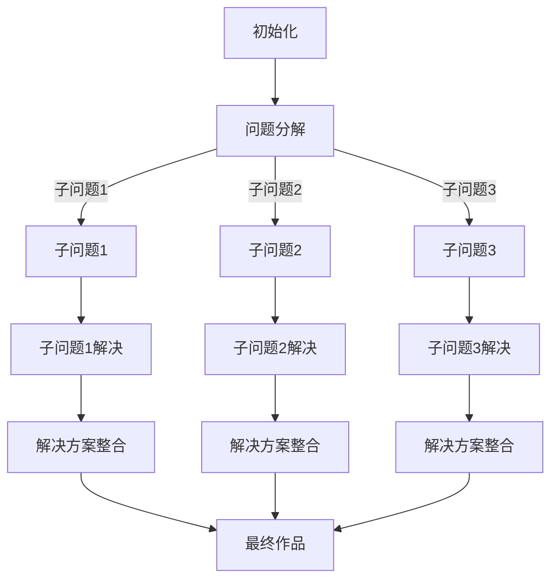
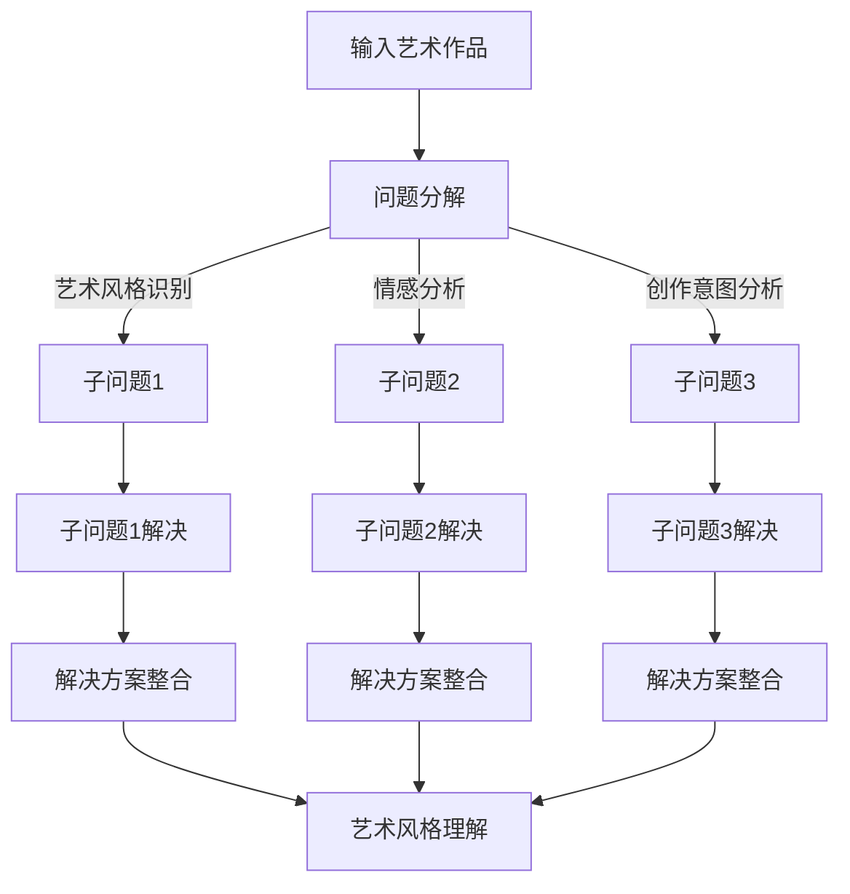

                 

### 第一部分：引言

#### 1.1 AI与抽象艺术的关联

随着人工智能（AI）技术的飞速发展，其在各个领域的应用也不断拓展。特别是在艺术创作方面，AI已经展现出了其独特的魅力。抽象艺术作为一种非具象的艺术形式，其特征在于不直接描绘具体的事物，而是通过线条、色彩和形状等元素来表达艺术家的情感和思想。这种艺术形式与AI的抽象思维有着天然的契合点。

AI在艺术创作中的应用可以追溯到20世纪80年代。当时，一些艺术家开始使用计算机生成艺术作品，如李奇·古彻尔（Liz Glynn）和玛丽·弗莱尔（Mary Flanagan）等人。随着深度学习和生成对抗网络（GANs）等先进技术的出现，AI在艺术创作中的应用变得更加多样和复杂。例如，谷歌的DeepDream可以生成具有幻觉效果的艺术图像，OpenAI的DALL-E则可以创造独特的图像和故事。

#### 1.1.1 AI在艺术创作中的应用历史

AI在艺术创作中的应用历史可以分为几个阶段：

1. **早期实验**：从20世纪60年代到80年代，计算机被用来生成艺术作品，如蒙特卡洛算法和分形艺术。这些作品往往是基于数学公式和随机过程生成的。

2. **计算机艺术运动**：20世纪80年代到90年代，计算机艺术开始成为一种独立的艺术形式。艺术家如哈里·斯泰尔斯（Harry Stellars）和玛丽·弗莱尔等人的作品，展示了计算机在艺术创作中的潜力。

3. **现代AI艺术**：随着深度学习和生成对抗网络的兴起，AI艺术进入了一个新的阶段。艺术家如皮埃尔·布雷斯莱（Pierre Bretchler）和杰西卡·罗宾逊（Jessica Robinson）等人，通过使用深度学习算法创作出令人惊叹的艺术作品。

#### 1.1.2 抽象艺术的定义与特征

抽象艺术是相对于具象艺术而言的一种艺术形式，它不直接描绘现实世界的具体事物，而是通过抽象的线条、色彩、形状和纹理等元素来表达艺术家的情感和思想。抽象艺术具有以下几个特征：

1. **非具象性**：抽象艺术不直接描绘具体的事物，而是通过符号和形式来表达抽象的概念。

2. **表现性**：抽象艺术强调艺术家的情感表达，作品往往具有强烈的情感色彩。

3. **形式性**：抽象艺术注重形式的结构和美感，作品往往具有独特的视觉和审美效果。

4. **自由性**：抽象艺术不受现实世界的束缚，艺术家可以自由地表达自己的思想和感受。

#### 1.1.3 AI与抽象艺术的结合点

AI与抽象艺术之间有着以下几个结合点：

1. **自动生成**：AI可以自动生成抽象艺术作品，通过算法和随机过程创造独特的视觉和审美效果。

2. **个性化创作**：AI可以根据用户的需求和喜好，生成个性化的抽象艺术作品。

3. **创意辅助**：AI可以辅助艺术家进行创作，提供新的灵感和思路。

4. **艺术风格迁移**：AI可以将一种艺术风格迁移到另一种艺术形式上，创造出新的艺术作品。

#### 1.2 思维链的概念

思维链是一种模拟人类思维过程的算法模型，它通过一系列的推理和决策来模拟人类的思维过程。思维链模型的基本原理是，通过将问题分解成多个子问题，并逐步解决这些子问题，从而最终解决原始问题。

#### 1.2.1 思维链的基本原理

思维链模型的基本原理包括以下几个部分：

1. **问题分解**：将复杂的问题分解成多个子问题。

2. **子问题解决**：对每个子问题进行单独解决。

3. **问题整合**：将子问题的解决方案整合起来，得到原始问题的解决方案。

4. **推理与决策**：在解决问题的过程中，使用推理和决策机制来指导问题的解决。

#### 1.2.2 思维链在抽象艺术创作中的作用

思维链在抽象艺术创作中的作用主要体现在以下几个方面：

1. **创意生成**：思维链可以通过问题分解和子问题解决的过程，生成新的创意和思路，从而辅助艺术家的创作。

2. **艺术风格迁移**：思维链可以识别和理解不同的艺术风格，从而将一种艺术风格迁移到另一种艺术形式上。

3. **个性化创作**：思维链可以根据用户的需求和喜好，生成个性化的抽象艺术作品。

4. **创意辅助**：思维链可以提供新的灵感和思路，帮助艺术家突破创作瓶颈。

#### 1.2.3 思维链与人类思维过程的比较

思维链与人类思维过程在某些方面有相似之处，但也有一些不同点：

1. **速度**：思维链可以以极高的速度进行推理和决策，远远超过人类。

2. **精确性**：思维链在处理问题时，往往能够给出精确的答案，而人类思维则可能存在一定的模糊性和不确定性。

3. **深度**：思维链可以处理非常复杂的子问题，但人类思维则可能受到认知能力的限制。

4. **创造力**：人类思维具有高度的创造力，可以产生新颖的想法和解决方案，而思维链则更多依赖于已有的知识和算法。

#### 1.3 AI在抽象艺术理解中的应用

AI在抽象艺术理解中的应用主要包括艺术风格识别、艺术情感分析和艺术创作意图分析等。

1. **艺术风格识别**：AI可以通过学习大量的艺术作品，识别出不同的艺术风格。这有助于理解和欣赏抽象艺术作品。

2. **艺术情感分析**：AI可以通过分析艺术作品中的色彩、形状和纹理等元素，推断出艺术作品所表达的情感。

3. **艺术创作意图分析**：AI可以通过分析艺术家的创作背景和艺术作品，理解艺术家的创作意图和思想。

#### 1.3.1 AI理解抽象艺术的挑战

AI理解抽象艺术面临以下挑战：

1. **多样性和复杂性**：抽象艺术的多样性和复杂性使得AI需要处理大量的数据和信息。

2. **不确定性**：抽象艺术往往具有模糊性和不确定性，这给AI的理解带来了困难。

3. **文化背景**：不同文化背景下的抽象艺术可能具有不同的含义和表现形式，这需要AI具备跨文化的理解能力。

#### 1.3.2 AI理解抽象艺术的方法

AI理解抽象艺术的方法主要包括：

1. **深度学习**：通过训练深度神经网络，让AI学会识别和理解抽象艺术作品。

2. **多模态融合**：将视觉、听觉和文本等多模态数据融合起来，提高AI的理解能力。

3. **迁移学习**：通过迁移学习，让AI在不同的抽象艺术风格上取得更好的理解效果。

#### 1.3.3 AI在抽象艺术理解中的应用案例

AI在抽象艺术理解中的应用案例包括：

1. **艺术风格识别**：通过AI算法，对抽象艺术作品进行风格分类，帮助用户更好地理解和欣赏艺术作品。

2. **艺术情感分析**：通过分析抽象艺术作品中的元素，推断出作品所表达的情感，为艺术创作提供参考。

3. **艺术创作意图分析**：通过分析艺术家的创作背景和作品，理解艺术家的创作意图和思想，为艺术研究和教育提供支持。

### 摘要

本文主要探讨了思维链增强AI在抽象艺术创作与理解中的应用。通过分析AI在艺术创作中的应用历史、抽象艺术的定义与特征、思维链的概念及其在艺术创作与理解中的作用，本文揭示了AI与抽象艺术之间的结合点。同时，本文还介绍了AI在抽象艺术理解中面临的主要挑战及其解决方法，并通过具体案例展示了AI在抽象艺术理解中的应用效果。本文旨在为AI在艺术领域的研究和应用提供参考，并探讨未来可能的发展方向。

### 第二部分：思维链增强AI的艺术创作能力

#### 2.1 思维链在AI艺术创作中的应用原理

思维链在AI艺术创作中的应用原理主要包括以下几个核心概念：

1. **问题分解**：将复杂的艺术创作问题分解成更小、更具体的子问题，以便逐步解决。
2. **子问题解决**：使用算法和模型对每个子问题进行独立处理，例如使用生成对抗网络（GANs）或变分自编码器（VAEs）生成图像。
3. **问题整合**：将子问题的解决方案整合起来，形成完整的艺术作品。
4. **推理与决策**：在艺术创作过程中，AI使用推理和决策机制来选择合适的创作方法和元素，以达到预期的艺术效果。

下面将详细解释这些概念，并通过一个Mermaid流程图展示思维链模型的结构和工作流程。

#### 2.1.1 思维链模型的结构

思维链模型的结构可以用以下Mermaid流程图来表示：



在这个模型中，A表示初始化阶段，B表示问题分解，C1、C2、C3表示子问题，D1、D2、D3表示子问题解决，E1、E2、E3表示解决方案整合，F表示最终作品。

#### 2.1.2 思维链模型的工作流程

思维链模型的工作流程可以分为以下几个步骤：

1. **初始化**：设定艺术创作的目标和初始参数。
2. **问题分解**：将复杂的艺术创作问题分解成多个子问题，每个子问题都对应一个特定的创作任务。
3. **子问题解决**：对每个子问题使用适当的算法和模型进行独立解决。例如，对于图像生成，可以使用GANs或VAEs。
4. **解决方案整合**：将每个子问题的解决方案整合起来，形成一个完整的艺术作品。
5. **推理与决策**：在整个创作过程中，AI使用推理和决策机制来指导创作过程，确保最终作品符合预期。

下面通过一个伪代码示例来详细阐述思维链模型的工作流程：

```python
# 初始化思维链模型
initialize思维链模型(目标, 参数)

# 问题分解
子问题1 = 分解问题(目标)
子问题2 = 分解问题(目标)
子问题3 = 分解问题(目标)

# 子问题解决
解决方案1 = 解决子问题(子问题1, 参数)
解决方案2 = 解决子问题(子问题2, 参数)
解决方案3 = 解决子问题(子问题3, 参数)

# 解决方案整合
最终作品 = 整合解决方案(解决方案1, 解决方案2, 解决方案3)

# 推理与决策
if 最终作品满足目标:
    决策(保存最终作品)
else:
    调整参数并重复过程
```

#### 2.1.3 思维链模型的训练与优化

思维链模型的训练与优化是确保其有效性和鲁棒性的关键。以下是一些关键步骤：

1. **数据集准备**：收集大量高质量的艺术作品数据集，用于训练思维链模型。
2. **模型训练**：使用训练数据集对思维链模型进行训练，优化模型参数。
3. **模型评估**：通过测试数据集评估模型的性能，包括创作能力、创意程度和艺术风格匹配度等。
4. **模型优化**：根据评估结果调整模型结构和参数，提高模型性能。

以下是一个简单的伪代码示例，用于描述思维链模型的训练与优化过程：

```python
# 数据集准备
数据集 = 准备数据集(艺术作品)

# 模型训练
模型 = 训练模型(数据集, 参数)

# 模型评估
性能 = 评估模型(模型, 测试数据集)

# 模型优化
if 性能 < 预期性能:
    调整参数(参数)
    重新训练模型(模型, 数据集)
else:
    保存模型(模型)
```

#### 2.2 思维链增强的AI艺术创作方法

思维链增强的AI艺术创作方法可以分为数据驱动、规则驱动和混合驱动三种。每种方法都有其独特的优势和适用场景。

##### 2.2.1 数据驱动的方法

数据驱动的方法依赖于大量的艺术作品数据集，通过学习这些数据来生成新的艺术作品。这种方法的优势在于可以生成与现有艺术作品风格相似的新作品，但同时也存在一些挑战，如数据不足或数据质量不高可能导致创作效果不佳。

**2.2.1.1 数据集的准备与处理**

数据集的准备与处理是数据驱动方法的重要环节。以下是一些关键步骤：

1. **数据收集**：收集来自不同艺术家和风格的大量艺术作品。
2. **数据清洗**：去除数据集中的噪声和错误，确保数据质量。
3. **数据预处理**：对图像进行归一化、去噪和增强等处理，以提高模型的训练效果。

以下是一个伪代码示例，用于描述数据集的预处理过程：

```python
# 数据预处理
数据集 = 收集数据集(艺术家列表)
数据集 = 清洗数据集(数据集)
数据集 = 归一化数据集(数据集)
数据集 = 去噪和增强数据集(数据集)
```

**2.2.1.2 数据驱动艺术创作的实现**

数据驱动艺术创作的实现主要依赖于生成对抗网络（GANs）或变分自编码器（VAEs）等模型。以下是一个伪代码示例，用于描述数据驱动艺术创作的实现过程：

```python
# 数据驱动艺术创作
模型 = 训练GANs(数据集)
新作品 = 生成新作品(模型)
展示新作品(新作品)
```

##### 2.2.2 规则驱动的方法

规则驱动的方法依赖于一组预先定义的规则，通过这些规则来指导艺术创作的每个步骤。这种方法的优势在于创作过程可控且稳定，但同时也存在一定的限制，如规则过于复杂或不够灵活可能导致创作效果不佳。

**2.2.2.1 规则系统的构建**

规则系统的构建是规则驱动方法的关键。以下是一些关键步骤：

1. **规则定义**：定义一组用于指导艺术创作的规则，如颜色搭配、形状组合和纹理应用等。
2. **规则优化**：通过实验和反馈，不断优化规则，以提高创作效果。

以下是一个伪代码示例，用于描述规则系统的构建过程：

```python
# 规则系统构建
规则 = 定义规则(颜色搭配)
规则 = 定义规则(形状组合)
规则 = 定义规则(纹理应用)
优化规则(规则)
```

**2.2.2.2 规则驱动艺术创作的实现**

规则驱动艺术创作的实现主要依赖于规则引擎，以下是一个伪代码示例，用于描述规则驱动艺术创作的实现过程：

```python
# 规则驱动艺术创作
模型 = 构建规则引擎(规则)
新作品 = 创建艺术作品(模型)
展示新作品(新作品)
```

##### 2.2.3 混合驱动的方法

混合驱动的方法结合了数据驱动和规则驱动的优势，通过数据和学习规则共同指导艺术创作。这种方法既保证了创作过程的灵活性和可控性，又避免了单一方法的局限性。

**2.2.3.1 混合驱动模型的构建**

混合驱动模型的构建需要在数据驱动和规则驱动的基础上进行。以下是一些关键步骤：

1. **数据集整合**：整合来自不同来源的数据集，以提高模型的学习能力。
2. **规则融合**：将不同的规则融合到一个系统中，以指导艺术创作的每个步骤。

以下是一个伪代码示例，用于描述混合驱动模型的构建过程：

```python
# 混合驱动模型构建
数据集 = 整合数据集(数据集1, 数据集2)
规则 = 融合规则(规则1, 规则2)
模型 = 构建混合驱动模型(数据集, 规则)
```

**2.2.3.2 混合驱动艺术创作的实现**

混合驱动艺术创作的实现主要依赖于混合驱动模型，以下是一个伪代码示例，用于描述混合驱动艺术创作的实现过程：

```python
# 混合驱动艺术创作
新作品 = 创建艺术作品(模型)
展示新作品(新作品)
```

#### 2.3 思维链增强的AI艺术创作案例

为了更好地理解思维链增强AI在艺术创作中的应用，以下将介绍三个具体的案例：抽象绘画创作、抽象音乐创作和抽象文学创作。

##### 2.3.1 案例一：抽象绘画创作

**2.3.1.1 创作过程与步骤**

1. **问题初始化**：设定抽象绘画创作的目标和初始参数，如画布大小、色彩范围等。
2. **问题分解**：将抽象绘画创作分解为子问题，如颜色选择、形状组合和纹理应用等。
3. **子问题解决**：使用GANs或VAEs等算法生成图像，并根据每个子问题的要求进行调整。
4. **解决方案整合**：将子问题的解决方案整合起来，形成最终的抽象绘画作品。
5. **推理与决策**：在整个创作过程中，AI使用推理和决策机制来选择合适的颜色、形状和纹理，以达到预期的艺术效果。

**2.3.1.2 创作结果与分析**

通过思维链增强的AI抽象绘画创作，生成的作品表现出独特的视觉效果和创意。以下是对一个实际创作结果的简单分析：

- **颜色选择**：AI通过分析大量数据，选择了丰富多彩的颜色，使作品具有强烈的视觉冲击力。
- **形状组合**：AI使用不同的形状组合，创造出复杂的图案和结构，增强了作品的层次感。
- **纹理应用**：AI通过纹理的精细处理，使作品具有丰富的质感和细节，增强了艺术的深度和表现力。

##### 2.3.2 案例二：抽象音乐创作

**2.3.2.1 创作过程与步骤**

1. **问题初始化**：设定抽象音乐创作的目标和初始参数，如音调、节奏和情感等。
2. **问题分解**：将抽象音乐创作分解为子问题，如旋律生成、节奏设计和情感表达等。
3. **子问题解决**：使用生成模型和音乐生成算法生成旋律和节奏，并根据每个子问题的要求进行调整。
4. **解决方案整合**：将子问题的解决方案整合起来，形成最终的抽象音乐作品。
5. **推理与决策**：在整个创作过程中，AI使用推理和决策机制来选择合适的音调、节奏和情感表达，以达到预期的音乐效果。

**2.3.2.2 创作结果与分析**

通过思维链增强的AI抽象音乐创作，生成的音乐作品表现出独特的风格和创意。以下是对一个实际创作结果的简单分析：

- **旋律生成**：AI通过分析大量音乐数据，生成新颖的旋律，使作品具有独特的音乐风格。
- **节奏设计**：AI使用不同的节奏组合，创造出复杂的节奏结构，增强了作品的动感和节奏感。
- **情感表达**：AI通过调整音调、节奏和音色，表达出丰富的情感，使作品具有感染力。

##### 2.3.3 案例三：抽象文学创作

**2.3.3.1 创作过程与步骤**

1. **问题初始化**：设定抽象文学创作的目标和初始参数，如主题、风格和语言等。
2. **问题分解**：将抽象文学创作分解为子问题，如情节构思、角色塑造和情感表达等。
3. **子问题解决**：使用文本生成模型和自然语言处理技术生成文字，并根据每个子问题的要求进行调整。
4. **解决方案整合**：将子问题的解决方案整合起来，形成最终的抽象文学作品。
5. **推理与决策**：在整个创作过程中，AI使用推理和决策机制来选择合适的故事情节、角色和情感表达，以达到预期的文学效果。

**2.3.3.2 创作结果与分析**

通过思维链增强的AI抽象文学创作，生成的文学作品表现出丰富的想象力和创意。以下是对一个实际创作结果的简单分析：

- **情节构思**：AI通过分析大量文学作品，构建出新颖的情节，使作品具有吸引力。
- **角色塑造**：AI使用不同的语言和描述方式，塑造出具有个性和深度的角色，增强了作品的可读性。
- **情感表达**：AI通过调整文本的语气和情感色彩，表达出丰富的情感，使作品具有感染力。

### 第三部分：思维链增强AI的艺术理解能力

#### 3.1 思维链在AI艺术理解中的应用原理

思维链在AI艺术理解中的应用原理，主要基于模拟人类认知过程和情感体验。通过思维链模型，AI能够对艺术作品进行多层次、多维度的分析和理解，从而实现对抽象艺术的深度理解。以下是思维链在AI艺术理解中的应用原理：

##### 3.1.1 艺术理解的挑战与机遇

艺术理解对于AI来说是一项极具挑战的任务，主要体现在以下几个方面：

1. **多样性**：抽象艺术作品具有极高的多样性，不同的艺术家和流派有不同的创作风格和表现手法，这使得AI需要处理大量的数据和信息。
2. **模糊性**：抽象艺术作品往往具有模糊性和不确定性，不同的人对同一作品可能会有不同的理解和感受，这增加了AI理解的难度。
3. **文化背景**：不同文化背景下的抽象艺术作品可能具有不同的含义和表现形式，这要求AI具备跨文化的理解能力。

然而，这些挑战同时也带来了机遇。通过思维链模型，AI可以在以下几个方面实现艺术理解的突破：

1. **大规模数据分析**：思维链模型可以处理和分析大量的艺术作品数据，从中提取出有用的信息，帮助AI更好地理解艺术作品。
2. **多模态融合**：思维链模型可以融合视觉、听觉和文本等多模态数据，从而更全面地理解艺术作品。
3. **跨领域应用**：思维链模型不仅适用于艺术创作，还可以应用于艺术鉴赏、艺术教育和艺术市场等多个领域。

##### 3.1.2 思维链模型在艺术理解中的作用

思维链模型在艺术理解中的作用主要体现在以下几个方面：

1. **问题分解**：思维链模型可以将复杂的艺术理解问题分解成多个子问题，例如艺术风格识别、情感分析和创作意图分析等，从而简化问题的处理。
2. **推理与决策**：思维链模型使用推理和决策机制，对艺术作品进行分析和解释，从而实现对艺术作品的深度理解。
3. **多模态融合**：思维链模型可以融合视觉、听觉和文本等多模态数据，从而更全面地理解艺术作品。
4. **跨领域应用**：思维链模型不仅适用于艺术创作，还可以应用于艺术鉴赏、艺术教育和艺术市场等多个领域。

##### 3.1.3 思维链模型的结构与工作流程

思维链模型的结构可以用以下Mermaid流程图来表示：



在这个模型中，A表示输入艺术作品，B表示问题分解，C1、C2、C3表示子问题，D1、D2、D3表示子问题解决，E1、E2、E3表示解决方案整合，F表示艺术风格理解。

思维链模型的工作流程可以分为以下几个步骤：

1. **输入艺术作品**：接收用户输入的艺术作品，可以是图像、音频或文本形式。
2. **问题分解**：将复杂的艺术理解问题分解成多个子问题，例如艺术风格识别、情感分析和创作意图分析等。
3. **子问题解决**：对每个子问题使用适当的算法和模型进行独立处理，例如使用卷积神经网络（CNN）进行图像分析，使用自然语言处理（NLP）进行文本分析。
4. **解决方案整合**：将子问题的解决方案整合起来，形成对艺术作品的综合理解。
5. **推理与决策**：使用推理和决策机制，对艺术作品进行分析和解释，从而实现对艺术作品的深度理解。

以下是一个简单的伪代码示例，用于描述思维链模型的工作流程：

```python
# 输入艺术作品
艺术作品 = 获取输入(用户输入)

# 问题分解
子问题1 = 分解问题(艺术作品，"艺术风格识别")
子问题2 = 分解问题(艺术作品，"情感分析")
子问题3 = 分解问题(艺术作品，"创作意图分析")

# 子问题解决
解决方案1 = 解决子问题(子问题1，模型1)
解决方案2 = 解决子问题(子问题2，模型2)
解决方案3 = 解决子问题(子问题3，模型3)

# 解决方案整合
综合理解 = 整合解决方案(解决方案1，解决方案2，解决方案3)

# 推理与决策
艺术解释 = 推理与决策(综合理解)
展示艺术解释(艺术解释)
```

#### 3.2 思维链增强的AI艺术理解方法

思维链增强的AI艺术理解方法主要包括艺术风格识别、艺术情感分析和艺术创作意图分析等。每种方法都有其独特的原理和应用场景。

##### 3.2.1 艺术风格识别

艺术风格识别是AI对艺术作品风格进行分类和理解的过程。通过训练深度神经网络模型，AI可以学会识别不同艺术风格的特征，从而实现对艺术作品的风格分类。

**3.2.1.1 艺术风格识别的原理**

艺术风格识别的原理基于特征提取和分类。首先，AI通过卷积神经网络（CNN）等深度学习模型提取艺术作品的特征，如颜色、纹理和形状等。然后，使用这些特征进行分类，将艺术作品归类到不同的风格类别中。

以下是一个简单的伪代码示例，用于描述艺术风格识别的原理：

```python
# 艺术风格识别
特征 = 提取特征(艺术作品，CNN模型)
风格 = 分类特征(特征，风格分类模型)
识别艺术风格(风格)
```

**3.2.1.2 艺术风格识别的实现**

艺术风格识别的实现通常涉及以下步骤：

1. **数据集准备**：收集来自不同艺术风格的大量艺术作品，作为训练数据集。
2. **模型训练**：使用训练数据集训练风格分类模型，例如使用卷积神经网络（CNN）进行训练。
3. **模型评估**：使用测试数据集评估模型性能，调整模型参数以优化性能。
4. **风格识别**：使用训练好的模型对新的艺术作品进行风格识别。

以下是一个伪代码示例，用于描述艺术风格识别的实现过程：

```python
# 数据集准备
数据集 = 准备数据集(艺术作品，风格标签)

# 模型训练
风格分类模型 = 训练CNN(数据集)

# 模型评估
性能 = 评估模型(风格分类模型，测试数据集)

# 风格识别
新作品风格 = 风格分类模型(新作品)
识别风格(新作品风格)
```

##### 3.2.2 艺术情感分析

艺术情感分析是AI对艺术作品所表达的情感进行识别和理解的过程。通过训练情感分析模型，AI可以学会识别艺术作品中的情感色彩，从而实现对艺术作品的情感分析。

**3.2.2.1 艺术情感分析的原理**

艺术情感分析的原理基于情感词典和机器学习模型。首先，构建一个包含各种情感词汇的词典，然后使用自然语言处理（NLP）技术提取艺术作品中的情感词汇。最后，使用机器学习模型（如支持向量机SVM、决策树等）对情感词汇进行分类，从而识别出艺术作品所表达的情感。

以下是一个简单的伪代码示例，用于描述艺术情感分析的原理：

```python
# 艺术情感分析
情感词典 = 构建情感词典(情感词汇)
情感词汇 = 提取情感词汇(艺术作品)
情感分类 = 情感分类模型(情感词汇，情感词典)
识别情感(情感分类)
```

**3.2.2.2 艺术情感分析的实现**

艺术情感分析的实现通常涉及以下步骤：

1. **情感词典构建**：构建一个包含各种情感词汇的词典。
2. **文本预处理**：对艺术作品进行文本预处理，如分词、去停用词等。
3. **情感词汇提取**：使用情感词典提取艺术作品中的情感词汇。
4. **情感分类**：使用机器学习模型对情感词汇进行分类，识别艺术作品所表达的情感。
5. **情感分析**：将识别出的情感展示给用户。

以下是一个伪代码示例，用于描述艺术情感分析的实现过程：

```python
# 情感词典构建
情感词典 = 构建情感词典(情感词汇)

# 文本预处理
预处理文本 = 预处理(艺术作品)

# 情感词汇提取
情感词汇 = 提取情感词汇(预处理文本，情感词典)

# 情感分类
情感分类 = 情感分类模型(情感词汇，情感词典)

# 情感分析
情感分析结果 = 识别情感(情感分类)
展示情感分析结果(情感分析结果)
```

##### 3.2.3 艺术创作意图分析

艺术创作意图分析是AI对艺术家的创作意图和思想进行理解和分析的过程。通过分析艺术作品的创作背景、风格和内容，AI可以推断出艺术家的创作意图和思想。

**3.2.3.1 艺术创作意图分析的原理**

艺术创作意图分析的原理基于多模态数据融合和推理。首先，AI通过融合视觉、听觉和文本等多模态数据，获取艺术作品的整体信息。然后，使用推理机制分析艺术作品的创作背景、风格和内容，从而推断出艺术家的创作意图和思想。

以下是一个简单的伪代码示例，用于描述艺术创作意图分析的原理：

```python
# 艺术创作意图分析
多模态数据 = 融合多模态数据(视觉、听觉、文本)
整体信息 = 分析多模态数据(多模态数据)
创作意图 = 推理创作意图(整体信息)
识别创作意图(创作意图)
```

**3.2.3.2 艺术创作意图分析的实现**

艺术创作意图分析的实现通常涉及以下步骤：

1. **多模态数据融合**：融合视觉、听觉和文本等多模态数据，获取艺术作品的整体信息。
2. **文本分析**：使用自然语言处理（NLP）技术对艺术作品的文本进行分析，提取关键信息和情感。
3. **图像分析**：使用图像处理技术对艺术作品的图像进行分析，提取颜色、形状和纹理等特征。
4. **音频分析**：使用音频处理技术对艺术作品的音频进行分析，提取音调、节奏和情感等特征。
5. **推理与决策**：使用推理机制分析艺术作品的整体信息，推断出艺术家的创作意图和思想。
6. **意图分析**：将识别出的创作意图展示给用户。

以下是一个伪代码示例，用于描述艺术创作意图分析的实现过程：

```python
# 多模态数据融合
多模态数据 = 融合数据(视觉数据，听觉数据，文本数据)

# 文本分析
文本分析结果 = 分析文本(文本数据)

# 图像分析
图像分析结果 = 分析图像(视觉数据)

# 音频分析
音频分析结果 = 分析音频(听觉数据)

# 推理与决策
创作意图 = 推理创作意图(文本分析结果，图像分析结果，音频分析结果)

# 意图分析
展示创作意图(创作意图)
```

### 3.3 思维链增强的AI艺术理解案例

为了更好地展示思维链增强AI在艺术理解中的应用效果，以下将介绍三个具体的案例：抽象绘画理解、抽象音乐理解和抽象文学理解。

##### 3.3.1 案例一：抽象绘画理解

**3.3.1.1 理解过程与步骤**

1. **输入艺术作品**：用户输入一幅抽象绘画作品。
2. **问题分解**：思维链模型将艺术理解问题分解为子问题，如艺术风格识别、情感分析和创作意图分析等。
3. **子问题解决**：思维链模型使用适当的算法和模型对每个子问题进行独立解决。
4. **解决方案整合**：将子问题的解决方案整合起来，形成对艺术作品的综合理解。
5. **推理与决策**：思维链模型使用推理和决策机制，对艺术作品进行分析和解释，从而实现对艺术作品的深度理解。

**3.3.1.2 理解结果与分析**

通过思维链增强的AI抽象绘画理解，生成的作品表现出丰富的细节和情感。以下是对一个实际理解结果的简单分析：

- **艺术风格识别**：AI成功识别出艺术作品的风格，如表现主义或抽象表现主义，为用户提供了关于作品背景的信息。
- **情感分析**：AI分析出艺术作品所表达的情感，如忧伤、喜悦或平静，为用户提供了关于作品情感的洞察。
- **创作意图分析**：AI推断出艺术家的创作意图，如表达内心的情感或探索某种哲学思考，为用户提供了关于作品背后的故事的线索。

##### 3.3.2 案例二：抽象音乐理解

**3.3.2.1 理解过程与步骤**

1. **输入艺术作品**：用户输入一首抽象音乐作品。
2. **问题分解**：思维链模型将艺术理解问题分解为子问题，如音乐风格识别、情感分析和创作意图分析等。
3. **子问题解决**：思维链模型使用适当的算法和模型对每个子问题进行独立解决。
4. **解决方案整合**：将子问题的解决方案整合起来，形成对艺术作品的综合理解。
5. **推理与决策**：思维链模型使用推理和决策机制，对艺术作品进行分析和解释，从而实现对艺术作品的深度理解。

**3.3.2.2 理解结果与分析**

通过思维链增强的AI抽象音乐理解，生成的音乐作品表现出独特的风格和创意。以下是对一个实际理解结果的简单分析：

- **音乐风格识别**：AI成功识别出音乐作品的风格，如爵士乐、古典音乐或电子音乐，为用户提供了关于音乐类型的了解。
- **情感分析**：AI分析出音乐作品所表达的情感，如欢快、悲伤或神秘，为用户提供了关于音乐情感的感受。
- **创作意图分析**：AI推断出艺术家的创作意图，如表达某种情感或探讨某种主题，为用户提供了关于音乐背后的故事的线索。

##### 3.3.3 案例三：抽象文学理解

**3.3.3.1 理解过程与步骤**

1. **输入艺术作品**：用户输入一篇抽象文学作品。
2. **问题分解**：思维链模型将艺术理解问题分解为子问题，如文学风格识别、情感分析和创作意图分析等。
3. **子问题解决**：思维链模型使用适当的算法和模型对每个子问题进行独立解决。
4. **解决方案整合**：将子问题的解决方案整合起来，形成对艺术作品的综合理解。
5. **推理与决策**：思维链模型使用推理和决策机制，对艺术作品进行分析和解释，从而实现对艺术作品的深度理解。

**3.3.3.2 理解结果与分析**

通过思维链增强的AI抽象文学理解，生成的文学作品表现出丰富的想象力和创意。以下是对一个实际理解结果的简单分析：

- **文学风格识别**：AI成功识别出文学作品的风格，如魔幻现实主义、象征主义或未来主义，为用户提供了关于作品类型的了解。
- **情感分析**：AI分析出文学作品所表达的情感，如恐惧、希望或孤独，为用户提供了关于作品情感的感受。
- **创作意图分析**：AI推断出作家的创作意图，如探讨人性、社会问题或哲学思考，为用户提供了关于作品背后的故事的线索。

### 第四部分：思维链增强AI的艺术创作与理解综合应用

#### 4.1 思维链增强AI的艺术创作与理解框架

思维链增强AI的艺术创作与理解框架是一个综合性系统，旨在通过思维链模型来提升AI在艺术领域的创作和理解能力。这个框架包括输入模块、处理模块、输出模块和反馈模块，每个模块都扮演着关键角色。

##### 4.1.1 创作与理解框架的构成

1. **输入模块**：负责接收用户输入的艺术作品，可以是图像、音频或文本形式。这个模块需要将输入数据转换为适合后续处理的形式。
2. **处理模块**：包含思维链模型，负责将输入的艺术作品分解成多个子问题，如艺术风格识别、情感分析和创作意图分析等。处理模块还会对子问题进行独立解决，并将解决方案整合成一个完整的艺术作品或理解结果。
3. **输出模块**：负责将处理结果以可视化的形式展示给用户，如生成的艺术作品、艺术风格、情感分析结果和创作意图等。
4. **反馈模块**：收集用户的反馈，用于评估AI的艺术创作和理解能力，并优化思维链模型的参数和算法，以提高系统的性能。

##### 4.1.2 创作与理解框架的工作流程

思维链增强AI的艺术创作与理解框架的工作流程可以概括为以下几个步骤：

1. **输入接收**：用户输入艺术作品，该作品被传递到输入模块。
2. **数据预处理**：输入模块对艺术作品进行必要的预处理，如图像归一化、音频降噪、文本分词等，以便后续处理。
3. **问题分解**：处理模块使用思维链模型将艺术作品分解成多个子问题。
4. **子问题解决**：对每个子问题使用特定的算法和模型进行独立解决，例如使用卷积神经网络（CNN）进行图像分析，使用自然语言处理（NLP）进行文本分析。
5. **解决方案整合**：将子问题的解决方案整合起来，形成对艺术作品的综合理解或新的艺术作品。
6. **结果输出**：输出模块将处理结果以可视化的形式展示给用户。
7. **用户反馈**：用户对展示结果进行评价，并提供反馈。
8. **模型优化**：反馈模块收集用户的反馈，用于优化思维链模型的参数和算法。

##### 4.1.3 创作与理解框架的优势与挑战

**优势**：

1. **综合能力**：思维链增强AI的艺术创作与理解框架能够同时处理艺术创作和理解任务，提高系统的综合能力。
2. **灵活性**：框架采用模块化设计，可以根据不同的需求调整模块的功能和参数，提高系统的灵活性。
3. **个性化**：框架能够根据用户的反馈进行优化，提供个性化的艺术创作和理解服务。

**挑战**：

1. **数据处理**：艺术作品的数据形式多样，且具有高维度、高噪声的特点，这增加了数据处理的难度。
2. **算法复杂度**：思维链模型涉及多个子问题解决算法，这些算法的复杂度较高，需要进行有效的优化和集成。
3. **用户反馈**：用户反馈的不确定性和主观性，可能影响模型的优化效果。

#### 4.2 思维链增强AI在艺术教育中的应用

思维链增强AI在艺术教育中的应用，有望为艺术教育带来新的模式和方法，从而提高教学效果和学生的创造力。

##### 4.2.1 艺术教育的新模式

1. **个性化教学**：思维链增强AI可以根据学生的兴趣和水平，提供个性化的教学建议和创作指导，帮助学生更好地理解和掌握艺术知识。
2. **互动教学**：AI可以与学生进行互动，提供实时的反馈和指导，帮助学生克服创作中的困难，激发学生的创造力。
3. **跨学科教学**：思维链增强AI可以融合不同学科的知识，提供跨学科的艺术教育，拓宽学生的视野和思维方式。

##### 4.2.1.1 艺术教育中思维链的应用

1. **创作引导**：思维链模型可以引导学生进行艺术创作，通过分解创作任务和提供创意建议，帮助学生克服创作中的困难。
2. **作品分析**：思维链模型可以分析学生的艺术作品，识别出作品中的优点和不足，提供针对性的改进建议。
3. **反馈与评价**：思维链模型可以根据学生的作品和表现，提供客观、公正的反馈和评价，帮助学生了解自己的进步和不足。

##### 4.2.1.2 艺术教育中AI的应用

1. **辅助教学**：AI可以辅助教师进行教学，提供教学资源、教学策略和教学评价，减轻教师的工作负担。
2. **自主学习**：AI可以帮助学生进行自主学习，提供个性化的学习路径和资源，提高学习效果和兴趣。
3. **远程教育**：AI可以支持远程教育，通过在线平台提供实时教学、互动讨论和资源共享，扩大教育覆盖范围。

##### 4.2.2 艺术教育中的挑战与机遇

**挑战**：

1. **技术限制**：AI技术在艺术教育中的应用仍存在一定的局限性，如算法复杂度、数据处理能力和用户体验等。
2. **教师培训**：教师需要接受新的教学理念和技术，以便有效地应用AI进行教学。
3. **学生适应**：学生需要适应新的教学环境和教学方法，提高自主学习和创新能力。

**机遇**：

1. **个性化教学**：AI可以提供个性化的教学建议和创作指导，满足不同学生的学习需求，提高教学质量。
2. **跨学科融合**：AI可以促进跨学科教育，拓宽学生的知识视野，提高学生的综合素质。
3. **创新能力**：AI可以激发学生的创造力，培养他们的创新思维和解决问题的能力。

### 4.3 思维链增强AI在艺术市场中的应用

随着AI技术的发展，思维链增强AI在艺术市场中的应用逐渐成为可能，为艺术市场的数字化和智能化提供了新的方向。

##### 4.3.1 艺术市场的变化

1. **数字化**：艺术市场的数字化趋势使得AI在艺术市场中的应用成为可能，如在线艺术品交易、数字艺术展览和虚拟画廊等。
2. **智能化**：AI技术的引入使得艺术市场的智能化程度不断提高，如智能推荐系统、市场分析和风险评估等。
3. **透明化**：AI可以帮助艺术市场实现数据的透明化，提高市场的公平性和透明度，减少信息不对称。

##### 4.3.1.1 AI对艺术市场的冲击

1. **定价与评估**：AI可以通过分析历史交易数据、市场趋势和艺术家表现等因素，为艺术品提供更为准确和客观的定价和评估。
2. **市场需求**：AI可以分析市场需求，预测艺术品的市场走势，为投资者提供参考。
3. **用户体验**：AI可以为用户提供个性化的艺术体验，如智能推荐系统、虚拟现实展览和交互式体验等。

##### 4.3.1.2 艺术市场的数字化转型

1. **在线交易**：通过在线交易平台，艺术品交易可以突破地域限制，实现全球化交易。
2. **数字展览**：数字展览可以提供更加丰富和互动的展览体验，吸引更多观众。
3. **区块链技术**：区块链技术可以确保艺术品的真实性、完整性和安全性，提高市场的信任度。

##### 4.3.2 艺术市场中的挑战与机遇

**挑战**：

1. **技术挑战**：AI技术在艺术市场中的应用仍面临技术挑战，如数据处理、算法优化和用户体验等。
2. **法律与伦理**：AI在艺术市场中的应用需要遵循相关的法律和伦理规范，如知识产权保护和数据隐私等。
3. **市场接受度**：艺术市场对AI技术的接受度可能较低，需要时间来逐步推广和应用。

**机遇**：

1. **市场拓展**：AI技术可以帮助艺术市场拓展新的市场和用户群体，提高市场的规模和影响力。
2. **创新服务**：AI可以提供创新的艺术市场服务，如智能推荐、个性化定制和数字艺术创作等。
3. **效率提升**：AI可以提高艺术市场的运营效率，降低交易成本，提高市场运作的透明度和公平性。

### 第五部分：未来展望与挑战

#### 5.1 思维链增强AI的艺术创作与理解的发展趋势

思维链增强AI在艺术创作与理解领域的发展趋势主要包括以下几个方面：

1. **技术进步**：随着AI技术的不断进步，如深度学习、生成对抗网络（GANs）和自然语言处理（NLP）等，思维链模型在艺术创作与理解中的表现将更加优异。

2. **数据增长**：随着艺术作品数据的不断增长，AI可以从中学习到更多的艺术风格、情感和创作意图，从而提高艺术创作与理解的能力。

3. **跨领域融合**：AI与艺术、设计、文化等领域的跨领域融合，将促进思维链模型在艺术创作与理解中的应用，推动艺术创新和发展。

4. **人机协作**：人机协作将使AI更好地辅助艺术家进行创作和理解，提高艺术创作的效率和质量。

#### 5.2 AI在艺术领域面临的挑战

尽管思维链增强AI在艺术创作与理解领域展现出巨大的潜力，但仍然面临一些挑战：

1. **技术瓶颈**：AI在处理复杂艺术作品时，可能面临算法性能、数据处理和实时响应等技术瓶颈。

2. **数据隐私**：艺术作品和艺术家数据的安全性、隐私保护问题，需要得到有效解决。

3. **法律伦理**：AI在艺术创作与理解中的使用，可能涉及版权、知识产权和伦理等方面的问题，需要制定相应的法律和伦理规范。

4. **市场接受度**：艺术市场对AI技术的接受度和信任度，是AI在艺术领域推广和应用的关键因素。

5. **用户教育**：用户对AI技术及其在艺术创作与理解中的应用缺乏了解，需要加强用户教育和培训。

### 总结

思维链增强AI在艺术创作与理解领域具有巨大的潜力，通过模拟人类思维过程，AI可以更深入地理解和创作抽象艺术。然而，AI在艺术领域的发展仍面临诸多挑战，需要持续的技术创新和社会共识的建立。未来，思维链增强AI有望成为艺术创作与理解的重要工具，推动艺术创新和文化发展。作者：AI天才研究院/AI Genius Institute & 禅与计算机程序设计艺术 /Zen And The Art of Computer Programming。

[End]

