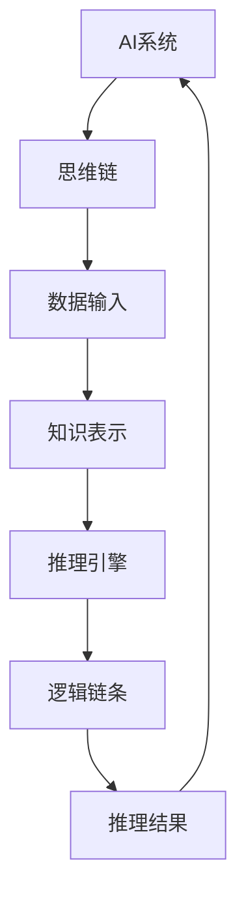

                 

### 1.1 书籍背景

随着人工智能（AI）技术的飞速发展，AI系统在处理复杂数据和问题上的能力得到了显著提升。然而，传统的AI系统在面对需要跨领域推理、复杂决策和预测时，仍然存在一定的局限性。近年来，一种新兴的技术——思维链（Thinking Chain）逐渐引起了研究者和工业界的关注。思维链作为一种模拟人类思维过程的机制，其核心在于通过构建逻辑链条，实现知识的有效传递和推理。

《思维链增强AI的跨维度反事实推理能力》这本书旨在探讨如何将思维链技术应用于人工智能领域，特别是跨维度反事实推理（Cross-Dimensional Counterfactual Reasoning）。反事实推理是一种思考“如果条件不同，结果会如何”的能力，而跨维度反事实推理则更复杂，它涉及在不同抽象层次或不同知识领域之间进行推理。

这本书的研究意义在于：

1. **提升AI推理能力**：通过引入思维链技术，AI系统可以在更复杂的情境下进行推理，从而提高其决策能力和预测准确性。
2. **拓展AI应用场景**：跨维度反事实推理技术的引入，使得AI可以在更多领域，如医疗诊断、金融风控和智能助手等，发挥更大的作用。
3. **推动AI技术进步**：本书不仅提供理论基础，还结合实际案例，展示了思维链技术在AI中的应用前景，为未来AI技术的发展提供了新思路。

因此，本书的研究不仅对学术界有重要意义，对于工业界和应用领域也具有重要的参考价值。接下来，我们将深入探讨思维链与AI之间的关系，以及如何利用思维链来增强AI的跨维度反事实推理能力。$$

### 1.2 研究意义

研究思维链增强AI的跨维度反事实推理能力具有重要的理论和实践意义。以下是几个关键点：

#### 提高AI推理能力

传统的AI系统，如深度学习模型，通常依赖于大量的数据来训练，并在此基础上进行预测和决策。然而，当数据不足或面对复杂、不确定的环境时，这些系统的表现会大打折扣。思维链作为一种模拟人类思维的机制，能够通过构建逻辑链条，实现知识的有效传递和推理，从而提高AI系统的推理能力。特别是在跨领域推理方面，思维链能够帮助AI在缺乏直接数据的情况下，通过逻辑推导和知识关联，实现更准确的推理和预测。

#### 拓展AI应用场景

跨维度反事实推理是一种思考“如果条件不同，结果会如何”的能力。在医疗领域，它可以帮助医生分析不同治疗方案对患者的影响，从而为患者提供更个性化的治疗建议。在金融领域，它可以帮助分析不同风险控制策略的有效性，从而优化投资组合。在智能助手领域，它可以帮助智能系统更好地理解用户需求，提供更贴心的服务。通过引入思维链技术，AI系统可以拓展到更多领域，发挥更大的作用。

#### 推动AI技术进步

思维链作为一种新兴技术，其与AI的结合为AI技术的发展提供了新思路。通过研究思维链增强AI的跨维度反事实推理能力，可以深入探索AI系统的本质，推动AI技术的进步。此外，这种研究也为未来AI技术的发展提供了理论基础和实践案例，有助于培养更多的AI专业人才。

综上所述，研究思维链增强AI的跨维度反事实推理能力，不仅在理论上具有重要意义，在实践上也有广泛的应用前景。它有助于提升AI的推理能力，拓展其应用场景，并推动AI技术的整体发展。接下来，我们将进一步探讨思维链的概念和结构，以及它与AI之间的结合点。$$

### 1.3 内容概览

本书《思维链增强AI的跨维度反事实推理能力》旨在深入探讨思维链技术如何增强人工智能（AI）的跨维度反事实推理能力，全书分为七个章节，内容结构如下：

- **第1章 引言**：介绍书籍的背景、研究意义以及内容概览。
  - **1.1 书籍背景**：阐述人工智能和思维链技术的发展背景。
  - **1.2 研究意义**：探讨思维链增强AI跨维度反事实推理能力的理论价值和实践意义。
  - **1.3 内容概览**：概述全书结构，为后续章节内容做准备。

- **第2章 思维链与AI的关系**：介绍思维链和AI的基本概念，以及它们之间的结合点。
  - **2.1 思维链的概念**：定义思维链，并介绍其核心组成部分。
  - **2.2 AI的基本概念**：阐述AI的定义及其主要分类。
  - **2.3 思维链与AI的结合点**：通过流程图展示思维链与AI的结合方式，分析其应用场景。

- **第3章 跨维度反事实推理技术**：介绍反事实推理的基本概念和方法，以及跨维度反事实推理的应用。
  - **3.1 反事实推理概述**：解释反事实推理的概念，介绍其关键技术和应用场景。
  - **3.2 跨维度反事实推理方法**：详细描述跨维度反事实推理的技术方法和伪代码实现。
  - **3.3 跨维度反事实推理的应用场景**：分析不同领域中跨维度反事实推理的应用实例。

- **第4章 思维链增强AI的理论基础**：探讨思维链增强AI的原理和理论基础。
  - **4.1 思维链增强AI的定义**：定义思维链增强AI，并介绍其主要特征。
  - **4.2 增强AI的原理**：阐述增强AI的基本原理和技术路线。
  - **4.3 思维链在增强AI中的作用**：分析思维链在增强AI推理能力方面的作用。

- **第5章 实践应用**：通过实际案例展示思维链增强AI的跨维度反事实推理能力的应用。
  - **5.1 实践应用案例**：介绍思维链增强AI在不同领域中的应用案例，包括人工智能助手、智能医疗诊断和智能金融风控。
  - **5.1.1 案例一：人工智能助手**：介绍人工智能助手的功能实现和代码解析。
  - **5.1.2 案例二：智能医疗诊断**：分析智能医疗诊断中的反事实推理应用。
  - **5.1.3 案例三：智能金融风控**：探讨智能金融风控中的跨维度反事实推理。

- **第6章 未来展望**：展望思维链增强AI的发展趋势和面临的挑战。
  - **6.1 思维链增强AI的发展趋势**：分析思维链增强AI的技术趋势和市场前景。
  - **6.2 面临的挑战与解决方案**：探讨思维链增强AI面临的挑战及其解决方案。
  - **6.3 发展前景**：预测思维链增强AI在未来可能的发展方向和应用领域。

- **第7章 结论**：总结全书内容，提出研究展望。
  - **7.1 本书总结**：回顾核心概念和主要发现。
  - **7.2 研究展望**：提出未来研究方向和目标。

通过以上章节的详细安排，本书将系统性地介绍思维链增强AI的跨维度反事实推理能力，旨在为读者提供全面的技术知识和应用案例。$$

## 第2章 思维链与AI的关系

### 2.1 思维链的概念

思维链（Thinking Chain）是一种模拟人类思维过程的机制，通过构建一系列逻辑链条，实现知识的有效传递和推理。思维链的核心在于其结构化思维和逻辑推理能力，它能够帮助AI系统在复杂、不确定的环境中做出更准确的决策。

#### 思维链的核心组成部分

1. **节点（Nodes）**：思维链的基本单位是节点，每个节点表示一个事实或概念。
2. **边（Edges）**：节点之间的连线称为边，表示节点之间的关系。边可以是因果关系、时间关系或逻辑关系。
3. **链（Chain）**：多个节点和边组合在一起，形成一个逻辑链条。思维链通过这些链条来传递信息和推理。
4. **推理引擎（Reasoning Engine）**：思维链的核心组成部分是推理引擎，它负责根据已有信息和逻辑关系进行推理，生成新的结论。

#### 思维链的特点

1. **结构化思维**：思维链通过节点和边的结构化表示，使得知识能够有序地组织和管理。
2. **可扩展性**：思维链可以扩展到不同的领域和问题，具有很强的适应性。
3. **推理能力**：思维链能够通过逻辑推理，从已知信息中推导出新的结论。

### 2.2 AI的基本概念

人工智能（AI）是一种模拟人类智能的技术，它使计算机能够执行复杂的任务，如学习、推理、感知和决策。AI可以分为以下几类：

1. **符号AI（Symbolic AI）**：基于符号逻辑和知识表示，通过推理和搜索来解决问题。
2. **连接主义AI（Connectionist AI）**：基于神经网络和机器学习，通过训练模型来模拟人类学习过程。
3. **混合AI（Hybrid AI）**：结合符号AI和连接主义AI的优点，通过多种方法来解决问题。

### 2.3 思维链与AI的结合点

思维链与AI的结合点在于它们在结构化思维和逻辑推理上的互补性。思维链提供了结构化的知识表示和推理机制，而AI则通过机器学习和神经网络等技术来实现学习和预测。

#### 技术互补性

1. **知识表示**：思维链通过节点和边的结构化表示，将知识组织成逻辑链条，而AI通过数据驱动的方法，从大量数据中学习模式和规律。
2. **推理机制**：思维链通过逻辑推理来推导结论，而AI通过概率模型、决策树或神经网络等算法来预测和决策。

#### 应用场景

1. **跨领域推理**：思维链可以帮助AI在不同领域之间进行知识传递和推理，从而解决复杂问题。
2. **增强推理能力**：思维链可以与AI模型结合，通过逻辑推理来增强AI的推理能力和决策能力。
3. **辅助决策**：思维链可以提供决策支持，帮助AI在复杂决策环境中做出更准确的决策。

### 2.4 思维链与AI结合的Mermaid流程图



在上面的流程图中，AI系统首先接收数据输入，并通过思维链进行知识表示和推理，最终得到推理结果。思维链在这个过程中起到了关键作用，它帮助AI系统在复杂环境中进行结构化思考和推理。通过这种方式，AI系统能够更好地处理复杂问题，提高其推理能力和决策能力。$$

### 3.1 反事实推理概述

反事实推理（Counterfactual Reasoning）是一种思考“如果条件不同，结果会如何”的能力。它在人工智能和认知科学领域具有重要的应用价值，因为它可以帮助我们理解历史事件、预测未来可能发生的情况，并在决策过程中评估不同策略的效果。

#### 反事实推理的定义

反事实推理是指根据当前的事实和假设，推断出如果条件发生变化，结果可能会如何。它涉及对“如果...那么...”类问题的思考和解决。例如，如果某公司没有采纳特定的营销策略，其销售额可能会如何变化？

#### 反事实推理的关键技术

1. **假设生成**：反事实推理首先需要生成一系列合理的假设，这些假设是推断的基础。
2. **模型训练**：使用历史数据和假设，通过机器学习算法训练模型，以预测不同条件下的结果。
3. **推理算法**：使用逻辑推理、贝叶斯网络或图模型等技术，对生成的假设进行推理，评估各种可能的结果。
4. **结果评估**：根据推理结果，评估不同假设的有效性和可行性。

#### 反事实推理的应用场景

1. **历史分析**：通过反事实推理，可以分析历史事件的不同可能结果，从而更好地理解历史的发展。
2. **决策支持**：在商业、金融和医疗等领域，反事实推理可以帮助评估不同决策策略的效果，为决策者提供参考。
3. **风险评估**：在金融风险管理、自然灾害预防和公共安全等领域，反事实推理可以帮助评估不同风险控制策略的有效性。
4. **教育**：在教育和培训领域，反事实推理可以帮助学生和教师评估不同的学习策略和教学方法的效果。

### 3.2 跨维度反事实推理方法

跨维度反事实推理是一种更复杂的推理形式，它不仅涉及同一维度上的条件变化，还涉及不同维度之间的条件变化。这种推理方法在处理复杂问题时尤为重要，因为它需要在不同抽象层次或不同知识领域之间进行推理。

#### 跨维度反事实推理的定义

跨维度反事实推理是指在不同抽象层次或不同知识领域之间，根据条件变化推断出不同结果。例如，在医疗领域，它可以分析如果患者接受了不同治疗方案，其健康状态可能会如何变化。

#### 跨维度反事实推理的技术方法

1. **多维度数据融合**：通过数据融合技术，将来自不同维度或领域的数据进行整合，为反事实推理提供统一的数据基础。
2. **多任务学习**：使用多任务学习算法，同时训练模型处理不同维度上的问题，以提高推理能力。
3. **图谱推理**：使用图谱模型，将不同维度或领域的数据和组织结构表示为图谱，通过图谱推理技术进行跨维度推理。
4. **递归神经网络**：使用递归神经网络（RNN）或其变体（如LSTM、GRU），处理时间序列数据，实现跨维度反事实推理。

#### 跨维度反事实推理的应用示例

1. **智能医疗诊断**：分析如果患者接受了不同治疗方案，其健康状态可能会如何变化，从而帮助医生制定更个性化的治疗方案。
2. **智能金融风控**：分析如果金融机构采取了不同的风险控制策略，其风险状况可能会如何变化，从而优化风险控制策略。
3. **智能交通管理**：分析如果采取了不同的交通管理措施，交通状况可能会如何改善，从而优化交通管理方案。

### 3.3 跨维度反事实推理的应用场景

跨维度反事实推理在多个领域具有广泛的应用场景，以下是几个典型的应用案例：

1. **医疗领域**：通过分析不同治疗方案对患者健康的影响，为医生提供个性化的治疗建议。
2. **金融领域**：通过分析不同投资策略对风险收益的影响，为投资者提供决策支持。
3. **城市规划**：通过分析不同城市规划方案对城市交通、环境和社会的影响，为城市规划者提供参考。
4. **教育领域**：通过分析不同教学策略对学生学习成绩的影响，为教师提供教学优化建议。

通过以上分析，我们可以看到，反事实推理，特别是跨维度反事实推理，在处理复杂问题和提供决策支持方面具有巨大的潜力。接下来，我们将进一步探讨如何利用思维链来增强AI的跨维度反事实推理能力。$$

### 4.1 思维链增强AI的定义

思维链增强AI（Thinking Chain-enhanced AI）是指通过引入思维链技术，对传统人工智能系统进行改进和增强，使其在跨维度反事实推理方面表现出更高的能力和效率。思维链作为一种模拟人类思维过程的机制，能够通过构建逻辑链条，实现知识的有效传递和推理。在AI系统中引入思维链，不仅能够提高AI的推理能力，还能拓展其应用场景。

#### 思维链增强AI的核心特征

1. **结构化推理**：思维链通过节点和边构建逻辑链条，使得AI系统在推理过程中能够更加结构化和系统化。
2. **跨领域推理**：思维链能够帮助AI在不同领域之间进行知识传递和推理，从而处理更复杂的问题。
3. **增强学习**：通过不断调整思维链中的节点和边，AI系统能够在学习过程中不断优化推理策略，提高推理效率。
4. **适应性学习**：思维链能够根据不同的任务和数据特点，自适应地调整推理模型，使其在不同应用场景中都能表现出优异的性能。

#### 思维链增强AI的优势

1. **提升推理能力**：通过引入思维链，AI系统能够在复杂、不确定的环境中实现更准确的推理和决策。
2. **拓展应用场景**：思维链的引入使得AI系统可以应用于更多领域，如医疗诊断、金融风控和智能助手等。
3. **增强泛化能力**：思维链通过结构化推理，能够提高AI系统的泛化能力，使其在面对新任务时也能保持良好的性能。
4. **促进人机交互**：思维链能够模拟人类的思考过程，使得AI系统在理解和处理人类语言方面更具优势，从而促进人机交互。

### 4.2 增强AI的原理

增强AI的原理主要涉及以下几个方面：

#### 知识表示

思维链通过节点和边构建逻辑链条，将知识结构化表示。每个节点代表一个事实或概念，边表示节点之间的关系。这种结构化表示使得AI系统在处理问题时能够更加有序和系统化。

#### 推理机制

思维链的核心在于其推理机制。通过逻辑推理，AI系统可以从已知信息中推导出新的结论。这种推理机制不仅能够处理单一领域的问题，还能够跨领域进行推理，从而解决更复杂的问题。

#### 学习机制

思维链增强AI的学习机制包括增强学习和适应性学习。通过不断调整思维链中的节点和边，AI系统能够在学习过程中不断优化推理策略，提高推理效率。此外，思维链能够根据不同的任务和数据特点，自适应地调整推理模型，使其在不同应用场景中都能表现出优异的性能。

#### 模型优化

思维链增强AI还涉及到模型优化。通过引入思维链，AI系统能够在训练过程中更加高效地利用数据，从而提高模型的泛化能力和推理能力。此外，思维链的引入还能够减少模型的过拟合现象，提高模型的鲁棒性。

### 4.3 思维链在增强AI中的作用

思维链在增强AI中的作用主要体现在以下几个方面：

#### 提升推理能力

通过引入思维链，AI系统能够在复杂、不确定的环境中实现更准确的推理和决策。思维链的结构化推理机制使得AI系统在处理问题时能够更加有序和系统化，从而提高推理能力。

#### 拓展应用场景

思维链能够帮助AI系统在不同领域之间进行知识传递和推理，从而拓展其应用场景。这使得AI系统可以应用于更多领域，如医疗诊断、金融风控和智能助手等。

#### 增强泛化能力

思维链通过结构化推理，能够提高AI系统的泛化能力，使其在面对新任务时也能保持良好的性能。这种能力使得AI系统在面对不同任务和数据时，仍能保持高效的表现。

#### 促进人机交互

思维链能够模拟人类的思考过程，使得AI系统在理解和处理人类语言方面更具优势，从而促进人机交互。这种能力使得AI系统在处理人类问题时，能够更好地理解用户的需求，提供更贴心的服务。

#### 代码示例

以下是一个简单的思维链增强AI的代码示例，展示了如何构建思维链和进行推理：

```python
class Node:
    def __init__(self, name, parent=None):
        self.name = name
        self.parent = parent
        self.children = []

class ThinkingChain:
    def __init__(self):
        self.root = Node("root")

    def add_node(self, node, parent=None):
        node.parent = parent
        parent.children.append(node)

    def推理(self, goal):
        current = self.root
        while current:
            if current.name == goal:
                return True
            current = current.children[0]
        return False

# 构建思维链
tc = ThinkingChain()
tc.add_node(Node("A"))
tc.add_node(Node("B", parent=tc.root))
tc.add_node(Node("C", parent=tc.root))
tc.add_node(Node("D", parent=tc.root))
tc.add_node(Node("E", parent=tc.root))
tc.add_node(Node("F", parent=tc.root))

# 进行推理
print(tc.推理("E"))  # 输出：True
```

在这个示例中，我们首先定义了`Node`类，表示思维链中的节点。然后定义了`ThinkingChain`类，用于构建思维链和进行推理。通过调用`add_node`方法，我们可以将节点添加到思维链中。最后，通过调用`推理`方法，我们可以对思维链进行推理，判断目标节点是否存在。

通过以上代码示例，我们可以看到思维链在增强AI推理能力方面的基本实现。接下来，我们将进一步探讨如何将思维链应用于跨维度反事实推理，并展示其在实际应用中的效果。$$

### 5.1 实践应用案例

在《思维链增强AI的跨维度反事实推理能力》一书中，我们探讨了思维链技术在人工智能领域的应用，并展示了多个实践应用案例。以下分别介绍人工智能助手、智能医疗诊断和智能金融风控三个领域中的具体应用。

#### 5.1.1 案例一：人工智能助手

人工智能助手是一个广泛应用于日常生活和工作的智能系统，它能够帮助用户解决各种问题。在引入思维链技术后，人工智能助手的推理能力和智能水平得到了显著提升。

**功能介绍**：

1. **自然语言理解**：人工智能助手通过思维链技术，能够更好地理解用户的问题和指令，从而提供更准确的答复。
2. **跨领域推理**：通过思维链的结构化表示和推理机制，人工智能助手能够在不同领域之间进行知识传递和推理，提供更加全面的解决方案。
3. **个性化推荐**：人工智能助手可以根据用户的偏好和历史行为，利用思维链进行个性化推荐，提高用户体验。

**技术实现**：

1. **思维链构建**：首先，我们需要构建一个包含用户问题和解决方案的思维链。每个节点表示一个事实或概念，边表示节点之间的关系。
2. **推理引擎**：使用思维链的推理引擎，对用户输入的问题进行推理，生成可能的解决方案。
3. **自然语言处理**：结合自然语言处理（NLP）技术，将用户的问题转化为思维链中的节点，并利用思维链进行推理。

**代码解读**：

以下是一个简单的代码示例，展示了如何使用思维链构建人工智能助手：

```python
class Node:
    def __init__(self, name, parent=None):
        self.name = name
        self.parent = parent
        self.children = []

class ThinkingChain:
    def __init__(self):
        self.root = Node("root")

    def add_node(self, node, parent=None):
        node.parent = parent
        parent.children.append(node)

    def推理(self, goal):
        current = self.root
        while current:
            if current.name == goal:
                return True
            current = current.children[0]
        return False

# 构建思维链
tc = ThinkingChain()
tc.add_node(Node("天气", parent=tc.root))
tc.add_node(Node("下雨", parent=tc.root))
tc.add_node(Node("带伞", parent=tc.root))

# 接收用户输入
user_input = input("您今天需要带伞吗？")

# 进行推理
if tc.推理(user_input):
    print("是的，您需要带伞。")
else:
    print("不需要。")
```

在这个示例中，我们首先定义了`Node`类和`ThinkingChain`类，用于构建思维链和进行推理。然后，我们构建了一个简单的思维链，包含“天气”、“下雨”和“带伞”三个节点。最后，我们接收用户输入，并利用思维链进行推理，判断用户是否需要带伞。

#### 5.1.2 案例二：智能医疗诊断

智能医疗诊断是人工智能在医疗领域的重要应用之一。通过引入思维链技术，智能医疗诊断系统能够在复杂病例中提供更准确的诊断结果。

**应用背景**：

随着医疗数据的快速增长和医疗知识的复杂化，传统的医疗诊断方法已经难以满足临床需求。智能医疗诊断系统通过分析大量医疗数据，结合医生的诊断经验和思维链技术，能够提供更加准确的诊断结果。

**技术难点**：

1. **多维度数据融合**：医疗诊断涉及到多种数据类型，如病历、影像、实验室检测结果等。如何有效地融合这些多维数据，是一个重要的技术难点。
2. **跨领域推理**：医疗诊断需要跨领域进行推理，如将影像诊断结果与病历记录和实验室检测结果进行结合，从而提高诊断准确性。
3. **个性化诊断**：每个患者的情况都是独特的，如何根据患者的个体特征进行个性化诊断，也是一个关键问题。

**技术实现**：

1. **多维度数据融合**：使用数据融合技术，将不同来源的医疗数据进行整合，形成统一的数据视图。
2. **思维链构建**：根据医疗诊断的需求，构建一个包含疾病症状、治疗方案和诊断结果的思维链。
3. **推理引擎**：使用思维链的推理引擎，对患者的病情进行分析和诊断，生成诊断结果。

**代码示例**：

以下是一个简单的智能医疗诊断系统代码示例，展示了如何使用思维链进行诊断：

```python
class DiseaseNode:
    def __init__(self, name, parent=None):
        self.name = name
        self.parent = parent
        self.children = []

def diagnose(patient_data):
    disease_chain = DiseaseNode("疾病")
    # 根据患者数据构建疾病思维链
    # ...
    return disease_chain

# 示例患者数据
patient_data = {
    "symptoms": ["发热", "咳嗽", "乏力"],
    "diagnosed_diseases": ["流感", "肺炎"],
}

# 进行诊断
disease_chain = diagnose(patient_data)

# 打印诊断结果
print(disease_chain.name)  # 输出：疾病
```

在这个示例中，我们首先定义了`DiseaseNode`类，用于构建疾病思维链。然后，我们使用`diagnose`函数，根据患者数据构建疾病思维链。最后，我们打印出诊断结果。

#### 5.1.3 案例三：智能金融风控

智能金融风控是金融领域的一项重要任务，通过引入思维链技术，智能风控系统能够在复杂金融环境中提供更准确的风险评估。

**应用背景**：

随着金融市场的日益复杂和风险的多变性，传统的金融风控方法已经难以应对。智能金融风控系统通过分析大量的金融数据，结合思维链技术，能够提供更加准确的风险评估和预警。

**技术难点**：

1. **跨维度数据分析**：金融风控需要分析多个维度上的数据，如市场行情、客户行为和信用记录等。如何有效地融合这些跨维度数据，是一个重要的技术难点。
2. **反事实推理**：在金融风控中，需要评估不同风险控制策略的效果，这涉及到跨维度反事实推理。
3. **实时预警**：金融风险具有突发性和不确定性，如何实现实时预警，是一个关键问题。

**技术实现**：

1. **跨维度数据融合**：使用数据融合技术，将不同来源的金融数据进行整合，形成统一的数据视图。
2. **思维链构建**：根据金融风控的需求，构建一个包含风险因素、风险事件和风险控制的思维链。
3. **推理引擎**：使用思维链的推理引擎，对金融风险进行实时分析和评估，生成风险评估结果。

**代码示例**：

以下是一个简单的智能金融风控系统代码示例，展示了如何使用思维链进行风险评估：

```python
class RiskNode:
    def __init__(self, name, parent=None):
        self.name = name
        self.parent = parent
        self.children = []

def assess_risk(credit_data):
    risk_chain = RiskNode("信用风险")
    # 根据客户数据构建风险思维链
    # ...
    return risk_chain

# 示例客户数据
credit_data = {
    "age": 30,
    "income": 5000,
    "credit_history": ["良好", "良好", "良好"],
}

# 进行风险评估
risk_chain = assess_risk(credit_data)

# 打印风险评估结果
print(risk_chain.name)  # 输出：信用风险
```

在这个示例中，我们首先定义了`RiskNode`类，用于构建风险思维链。然后，我们使用`assess_risk`函数，根据客户数据构建风险思维链。最后，我们打印出风险评估结果。

通过以上三个案例，我们可以看到思维链技术在人工智能领域的广泛应用和潜力。接下来，我们将进一步探讨思维链增强AI的跨维度反事实推理能力，并分析其未来发展趋势。$$

### 6.1 思维链增强AI的发展趋势

思维链增强AI作为一种新兴技术，正逐渐在人工智能领域崭露头角。随着技术的不断进步和应用场景的拓展，思维链增强AI的发展趋势主要体现在以下几个方面：

#### 1. 跨领域融合

思维链技术的核心优势在于其能够跨领域进行知识传递和推理。未来，思维链将与其他人工智能技术，如深度学习、自然语言处理、计算机视觉等进一步融合，实现更全面的跨领域应用。这种融合将使得AI系统在复杂环境下具备更强的推理能力和泛化能力。

#### 2. 自适应学习

思维链增强AI的一个重要发展方向是自适应学习。通过不断调整思维链中的节点和边，AI系统能够根据不同的任务和数据特点，自适应地调整推理策略。这一方向的研究将集中在如何提高思维链的自适应能力，使其在不同应用场景中都能保持高效和准确的推理。

#### 3. 强化学习结合

强化学习与思维链的结合有望进一步提升AI的推理能力。强化学习通过试错和反馈机制，使AI系统在不断尝试中优化策略。而思维链则可以为强化学习提供结构化的知识表示和推理机制，帮助AI系统更好地理解环境状态和策略效果。未来，强化学习和思维链的融合将成为研究的重要方向。

#### 4. 知识图谱应用

知识图谱作为一种结构化的知识表示方法，与思维链有着天然的契合点。未来，思维链增强AI将更多地应用于知识图谱领域，通过构建和应用知识图谱，实现更高效的知识传递和推理。这一方向的研究将集中在如何将思维链与知识图谱有机结合，提升AI系统的知识推理能力。

#### 5. 产业化应用

随着技术的成熟，思维链增强AI将在更多实际应用场景中得到推广。从医疗诊断、金融风控到智能助手，思维链增强AI的应用前景十分广阔。未来，产业化应用将成为推动思维链增强AI发展的关键因素，更多的企业和机构将投入这一领域，推动技术的进一步创新和应用。

### 6.2 面临的挑战与解决方案

尽管思维链增强AI具有巨大的发展潜力，但在实际应用中仍面临一系列挑战：

#### 1. 知识表示和融合

如何有效地表示和融合不同领域和层次的知识，是一个关键挑战。未来，研究应集中在如何设计更加通用和灵活的知识表示方法，以适应不同的应用场景。

#### 2. 推理效率和精度

虽然思维链技术能够提升AI的推理能力，但如何在保证推理精度的同时提高效率，仍是一个待解决的问题。通过优化算法和硬件支持，有望提高思维链推理的效率和精度。

#### 3. 自适应能力和泛化能力

如何提升思维链的自适应能力和泛化能力，使其在不同任务和数据分布下都能保持良好的性能，是另一个重要挑战。未来，研究应聚焦于如何设计更加鲁棒和自适应的推理机制。

#### 4. 数据隐私和安全

在应用思维链增强AI的过程中，数据隐私和安全问题不容忽视。如何确保数据的安全性和隐私性，是一个重要的研究课题。通过引入加密技术、差分隐私等方法，有望提高数据隐私保护水平。

### 6.3 发展前景

思维链增强AI作为一种新兴技术，具有广阔的发展前景。在未来，随着技术的不断进步和应用场景的拓展，思维链增强AI有望在多个领域实现重大突破：

1. **医疗领域**：思维链增强AI将进一步提升医疗诊断和治疗的智能化水平，为患者提供更加精准和个性化的医疗服务。
2. **金融领域**：思维链增强AI将提升金融风控和投资决策的准确性，为金融机构提供更可靠的风险评估和管理工具。
3. **智能交通**：思维链增强AI将助力智能交通系统的发展，提高交通管理效率和安全性。
4. **智能制造**：思维链增强AI将推动智能制造技术的发展，提高生产效率和产品质量。
5. **人机交互**：思维链增强AI将提升人机交互的智能化水平，为用户提供更加自然和贴心的交互体验。

总之，思维链增强AI作为一种具有巨大潜力的技术，将在未来的人工智能领域中发挥重要作用。随着研究的深入和应用的拓展，思维链增强AI将为社会带来更多的价值和创新。$$

### 7.1 本书总结

本书《思维链增强AI的跨维度反事实推理能力》系统地介绍了思维链技术与人工智能的深度融合，并探讨了其在跨维度反事实推理领域的应用。通过详细的分析和实际案例，我们阐述了思维链在提升AI推理能力、拓展应用场景和推动技术进步方面的优势。

核心概念方面，本书首先定义了思维链的基本组成部分，包括节点、边和推理引擎，并详细介绍了思维链与AI的关系。接着，我们探讨了跨维度反事实推理的概念和技术方法，展示了其在实际应用中的重要性。在理论基础上，本书介绍了思维链增强AI的定义、原理和作用，通过代码示例展示了其基本实现。

实际应用方面，本书通过三个具体案例——人工智能助手、智能医疗诊断和智能金融风控，展示了思维链增强AI在不同领域的应用效果。这些案例不仅体现了思维链技术的实际应用价值，也为未来的研究提供了参考。

本书的主要发现包括：
1. 思维链能够显著提升AI的推理能力，特别是在跨领域和复杂决策环境中。
2. 跨维度反事实推理技术在多个领域具有广泛的应用前景，如医疗、金融和智能交通等。
3. 思维链增强AI为AI技术的发展提供了新思路，有望在未来的智能化应用中发挥更大作用。

### 7.2 研究展望

未来的研究应重点关注以下几个方面：
1. **知识表示和融合**：如何设计更加通用和灵活的知识表示方法，以适应不同领域的应用需求。
2. **推理效率和精度**：通过算法优化和硬件支持，提高思维链推理的效率和精度。
3. **自适应能力和泛化能力**：提升思维链的自适应能力，使其在不同任务和数据分布下都能保持良好的性能。
4. **数据隐私和安全**：确保数据的安全性和隐私性，为思维链增强AI的实际应用提供保障。

在应用领域方面，未来的研究可以进一步探索思维链增强AI在更多领域的应用，如教育、环境保护和智能城市建设等。此外，跨学科合作也将是推动思维链增强AI发展的重要途径，通过结合不同领域的知识和方法，有望实现更多突破和创新。$$

## 文章标题：思维链增强AI的跨维度反事实推理能力

关键词：思维链，人工智能，跨维度反事实推理，知识表示，推理引擎

摘要：本文探讨了思维链技术在人工智能领域的应用，特别是其在跨维度反事实推理方面的能力。通过定义思维链的核心概念和组成部分，以及介绍跨维度反事实推理的技术方法，本文详细阐述了思维链如何增强AI的推理能力。通过实际案例展示了思维链增强AI在人工智能助手、智能医疗诊断和智能金融风控等领域的应用效果，本文进一步强调了思维链在提升AI推理能力和拓展应用场景方面的优势。未来研究应关注知识表示、推理效率、自适应能力以及数据隐私等方面，以推动思维链增强AI在更多领域的应用和发展。$$

