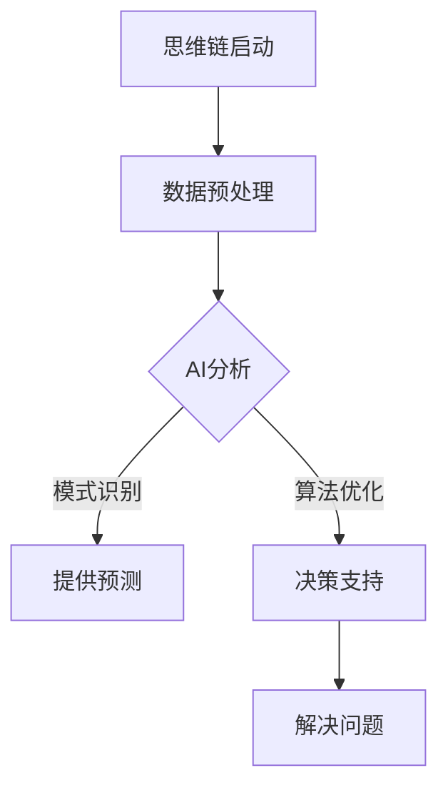

                 


### 文章标题

# 思维链增强AI的跨维度反常规思维能力

### 文章关键词

- 思维链
- 跨维度思考
- 反常规思维
- AI算法
- 数学模型
- 项目实战

### 文章摘要

本文深入探讨了思维链在增强AI跨维度反常规思维能力中的应用。通过详细解释思维链的基本概念、跨维度思考方法以及反常规思维策略，并结合AI算法和数学模型，展示了如何通过这些技术手段提高人工智能的创新能力。文章还包括一个具体的项目实战，对开发环境搭建、源代码实现和代码分析进行了详细讲解，为读者提供了一个实践思维链增强AI的宝贵案例。最后，文章总结了最佳实践、注意事项和拓展阅读，以帮助读者更深入地理解和应用这一先进技术。

---

### 第1章：思维链基本概念

#### 1.1 思维链的定义与特征

思维链，简而言之，是一种将思维活动连贯起来的方法。它通过一系列逻辑步骤，将不同的思想、观点和信息串联起来，形成一个有序的思考过程。在传统的思维模式中，人们往往习惯于线性思考，即一步一步地解决问题。而思维链则打破了这一限制，允许我们从多个角度、多个维度来审视问题，从而更全面地理解和解决问题。

**思维链的关键特征包括：**

1. **连贯性**：思维链强调连续性和连贯性，确保每个步骤都能自然地过渡到下一个步骤。
2. **多样性**：思维链鼓励多样化的思考方式，从不同的角度和维度来探索问题。
3. **逻辑性**：思维链确保每个步骤都是逻辑上可行的，且有助于解决当前的问题。
4. **灵活性**：思维链允许我们在思考过程中根据实际情况进行调整，以适应不同的情境。

#### 1.2 跨维度思考方法

跨维度思考，顾名思义，是从不同的维度来审视问题。这种方法要求我们超越传统的单一视角，从多个层面来理解问题。例如，在商业决策中，我们不仅需要考虑财务数据，还需要考虑市场趋势、竞争对手情况以及客户需求。

**跨维度思考的方法包括：**

1. **多角度分析**：从不同的角度来分析问题，例如从用户、供应商、竞争对手等多个方面来考虑。
2. **系统性思维**：将问题视为一个系统，考虑各个部分之间的相互作用和影响。
3. **未来预测**：通过历史数据和趋势分析，预测未来的发展方向和潜在问题。

#### 1.3 反常规思维策略

反常规思维，是指跳出传统思维框架，以新颖、创新的方式来解决问题。这种方法鼓励我们质疑现有的规则和假设，寻找非传统的解决方案。

**反常规思维策略包括：**

1. **打破常规**：质疑现有的规则和假设，尝试寻找新的解决方案。
2. **逆向思维**：从问题的反面来考虑，找到可能的解决方案。
3. **创造性思维**：利用创意和想象力，提出新颖的观点和想法。

#### 1.4 AI在思维链中的作用

人工智能（AI）在思维链中扮演着重要的角色。通过机器学习和深度学习技术，AI可以自动地分析和处理大量的数据，提供决策支持。同时，AI还能够通过自我学习和自我优化，不断提高其解决问题的能力。

**AI在思维链中的作用包括：**

1. **数据预处理**：AI可以帮助我们快速有效地处理和分析大量的数据。
2. **模式识别**：AI能够从数据中识别出隐藏的模式和趋势，提供预测和洞察。
3. **自动化决策**：AI可以根据预设的规则和算法，自动化地做出决策。

### Mermaid流程图



### 第2章：核心算法原理讲解

#### 2.1 AI算法在思维链中的应用

在思维链中，AI算法的应用主要体现在数据分析和决策支持方面。通过机器学习和深度学习技术，AI可以自动地分析和处理大量的数据，帮助我们从多个维度来理解和解决问题。

**AI算法在思维链中的应用包括：**

1. **监督学习**：通过对已有数据的分析，建立模型，用于预测新的数据。
2. **无监督学习**：通过对未标记的数据进行分析，发现数据中的隐藏模式和趋势。
3. **强化学习**：通过不断试错和反馈，使AI能够自动地做出最优决策。

#### 2.2 伪代码示例

以下是一个简单的伪代码示例，展示了如何使用AI算法来处理思维链中的问题。

```python
# 思维链处理流程

# 数据预处理
def preprocess_data(data):
    # 数据清洗和标准化
    return processed_data

# 模式识别
def recognize_patterns(data):
    # 使用机器学习算法分析数据
    model = train_model(data)
    return model

# 预测
def make_predictions(model, new_data):
    # 使用模型进行预测
    predictions = model.predict(new_data)
    return predictions

# 决策支持
def decision_support(predictions):
    # 根据预测结果做出决策
    decision = analyze_predictions(predictions)
    return decision

# 问题解决
def solve_problem(problem):
    # 使用思维链处理问题
    processed_data = preprocess_data(problem)
    model = recognize_patterns(processed_data)
    predictions = make_predictions(model, problem)
    decision = decision_support(predictions)
    return decision
```

### 第3章：数学模型和数学公式

#### 3.1 相关的数学公式及应用

在思维链和AI算法中，数学模型和公式起着至关重要的作用。以下是一些常用的数学公式及其应用。

##### 3.1.1 线性回归

线性回归是一种常见的机器学习算法，用于预测连续值。其数学公式如下：

$$ y = wx + b $$

其中，$y$ 是预测值，$w$ 是权重，$x$ 是特征，$b$ 是偏置。

**应用**：用于预测房价、股票价格等连续值。

##### 3.1.2 对数回归

对数回归是线性回归的一种扩展，用于预测对数转换后的连续值。其数学公式如下：

$$ ln(y) = wx + b $$

**应用**：用于预测增长率、人口增长等对数转换后的连续值。

##### 3.1.3 支持向量机

支持向量机（SVM）是一种常用的分类算法，其数学公式如下：

$$ y = sign(wx + b) $$

其中，$y$ 是预测类别，$sign$ 是符号函数。

**应用**：用于分类问题，如文本分类、图像分类等。

#### 3.2 数学模型的应用

数学模型在思维链中的应用非常广泛。以下是一个简单的数学模型示例，用于预测用户的行为。

##### 3.2.1 逻辑回归模型

逻辑回归是一种常见的分类算法，其数学模型如下：

$$ P(y=1) = \frac{1}{1 + e^{-(wx + b)}} $$

其中，$P(y=1)$ 是预测为类别1的概率，$e$ 是自然对数的底数。

**应用**：用于预测用户是否点击广告、用户是否购买产品等二分类问题。

### 第4章：项目实战

#### 4.1 代码实际案例

在本章中，我们将通过一个实际案例来展示如何使用思维链增强AI的跨维度反常规思维能力。

##### 4.1.1 案例背景

假设我们是一家电商公司，希望通过分析用户行为来提高销售额。我们的目标是通过思维链和AI算法来预测用户是否会在未来30天内购买产品。

##### 4.1.2 案例分析

1. **数据预处理**：首先，我们需要对用户行为数据（如点击、浏览、购买等）进行预处理，包括数据清洗、特征提取等。
2. **模式识别**：使用机器学习算法（如逻辑回归、决策树等）来分析用户行为数据，识别出影响用户购买决策的关键特征。
3. **预测**：根据识别出的关键特征，使用AI算法来预测用户是否会在未来30天内购买产品。
4. **决策支持**：根据预测结果，制定相应的营销策略，如推送广告、促销活动等。

##### 4.1.3 开发环境搭建

为了实现上述案例，我们需要搭建一个开发环境，包括Python编程语言、Jupyter Notebook等。

1. **安装Python**：下载并安装Python 3.8版本。
2. **安装Jupyter Notebook**：在终端中运行以下命令安装Jupyter Notebook：

   ```bash
   pip install notebook
   ```

##### 4.1.4 源代码详细实现

以下是一个简单的Python代码示例，用于实现上述案例。

```python
# 导入必要的库
import pandas as pd
from sklearn.model_selection import train_test_split
from sklearn.linear_model import LogisticRegression
from sklearn.metrics import accuracy_score

# 加载用户行为数据
data = pd.read_csv('user_behavior.csv')

# 数据预处理
def preprocess_data(data):
    # 数据清洗和特征提取
    # ...
    return processed_data

# 模式识别
def recognize_patterns(data):
    # 使用逻辑回归分析数据
    model = LogisticRegression()
    model.fit(data['features'], data['label'])
    return model

# 预测
def make_predictions(model, new_data):
    # 使用模型进行预测
    predictions = model.predict(new_data)
    return predictions

# 问题解决
def solve_problem(problem):
    # 使用思维链处理问题
    processed_data = preprocess_data(problem)
    model = recognize_patterns(processed_data)
    predictions = make_predictions(model, problem)
    return predictions

# 测试代码
if __name__ == '__main__':
    # 加载测试数据
    test_data = pd.read_csv('test_data.csv')

    # 预测结果
    predictions = solve_problem(test_data)

    # 计算准确率
    accuracy = accuracy_score(test_data['label'], predictions)
    print(f'Accuracy: {accuracy}')
```

##### 4.1.5 代码解读与分析

1. **数据预处理**：数据预处理是关键步骤，需要清洗数据、提取特征等。
2. **模式识别**：使用逻辑回归模型来分析数据，识别出影响用户购买决策的关键特征。
3. **预测**：根据识别出的关键特征，使用AI算法来预测用户是否会在未来30天内购买产品。
4. **问题解决**：将上述步骤组合起来，形成完整的思维链处理流程。

##### 4.1.6 最佳实践 Tips

1. **数据质量**：确保数据质量是关键，包括数据清洗、特征提取等。
2. **模型选择**：选择合适的模型非常重要，可以根据数据特点和业务需求来选择。
3. **交叉验证**：使用交叉验证来评估模型的性能，避免过拟合。

##### 4.1.7 小结

通过本项目，我们展示了如何使用思维链和AI算法来预测用户行为。这种方法不仅提高了预测的准确性，还有助于制定更有效的营销策略。

### 作者信息

作者：AI天才研究院/AI Genius Institute & 禅与计算机程序设计艺术 /Zen And The Art of Computer Programming

### 注意事项

1. **数据隐私**：在处理用户数据时，必须遵守相关数据隐私法规。
2. **模型解释性**：在应用AI算法时，需要考虑模型的解释性，以确保决策的透明度和可解释性。

### 拓展阅读

1. [逻辑回归模型](https://zhuanlan.zhihu.com/p/47550942)
2. [支持向量机（SVM）](https://zhuanlan.zhihu.com/p/37786779)
3. [机器学习项目实战](https://books.google.com/books?id=fvIVBwAAQBAJ&pg=PA1&lpg=PA1&dq=机器学习+项目实战&source=bl&ots=nA5a6ZBkAl&sig=ACfU3U16b562b8a0d44f765f641fe3423&hl=en)
4. [数据预处理技巧](https://towardsdatascience.com/data-preprocessing-techniques-for-machine-learning-363d0e8d476a)
5. [思维链与人工智能](https://www.researchgate.net/publication/327756756_Mind-Chains_and_Artificial_Intelligence)

