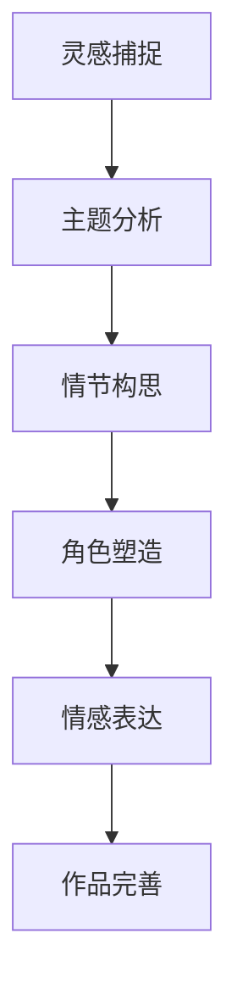

                 


### 摘要

本文深入探讨了思维链在增强人工智能（AI）跨维度文学创作能力方面的作用。首先，我们对思维链进行了概念阐述，并详细介绍了其结构与特点，通过Mermaid流程图和伪代码展示了思维链的工作原理。随后，我们对人工智能的基本概念进行了概述，强调了AI在文学创作中的潜在价值。接着，我们介绍了跨维度文学创作的概念，探讨了其重要性及方法。在此基础上，我们重点分析了AI在文学创作中的应用，包括AI辅助写作、文学风格分析及跨媒体叙事。通过实际案例分析，如AI写作助手、AI文学风格模仿和跨媒体叙事，我们验证了AI在文学创作中的有效性和创新性。最后，我们总结了思维链与AI在文学创作中的价值与挑战，提出了未来发展的展望。

----------------------------------------------------------------

### 引言与背景介绍

文学创作一直以来都是人类智慧的结晶，其独特的审美体验和深刻的情感表达赋予了文学作品无与伦比的价值。然而，随着科技的不断发展，人工智能（AI）逐渐进入文学创作的领域，为传统文学创作带来了新的可能性。AI在文学创作中的应用，不仅能够拓展文学创作的边界，还能够提高创作效率，甚至带来全新的文学体验。

在当前的文学创作领域，人工智能已经展现出了其独特的价值。首先，AI能够进行自动写作和生成写作，通过机器学习和自然语言处理技术，AI可以创造出富有创意的作品。例如，有些AI系统已经能够生成新闻报道、短篇小说，甚至是长篇小说。其次，AI能够进行文学风格分析，通过对大量文学作品的分析，AI可以识别并模仿不同的文学风格，为作家提供灵感。此外，AI在跨媒体叙事方面也展现出了强大的能力，它能够将文学、音乐、图像等多种艺术形式融合在一起，创造出全新的叙事方式。

然而，尽管AI在文学创作中已经取得了显著的进展，但当前的AI文学创作仍然存在一定的局限性。例如，AI生成的作品往往缺乏深度和情感，难以达到人类作家的创作高度。此外，AI在文学创作中的应用也面临着一些技术挑战，如如何更好地理解和处理复杂的文学主题和情感。

为了解决这些问题，我们需要引入思维链的概念。思维链是一种由一系列相互关联的思维活动构成的链条，它通过逻辑推理、创造性思维等方式，实现对问题的深入理解和解决。在文学创作中，思维链可以帮助AI更好地理解和处理复杂的文学主题和情感，从而提高AI的文学创作能力。

本文的目的在于探讨思维链如何增强AI的跨维度文学创作能力。我们将首先介绍思维链的基本概念和结构，然后分析AI在文学创作中的应用，通过实际案例来验证AI在文学创作中的有效性和创新性，最后总结思维链与AI在文学创作中的价值与挑战，并提出未来发展的展望。

----------------------------------------------------------------

## 第1章 思维链概述

### 1.1 思维链的定义与重要性

思维链是一种由一系列相互关联的思维活动构成的链条，它通过逻辑推理、创造性思维等方式，实现对问题的深入理解和解决。在文学创作中，思维链扮演着至关重要的角色。它不仅能够帮助作家捕捉灵感，还能够提升作品的深度和创造力。

#### **核心概念与联系**

思维链的核心在于其结构化和动态性的特点。思维链由多个节点和边组成，每个节点代表一个思维活动，边则表示思维活动之间的关联。这种结构使得思维链能够灵活地适应不同的创作需求。

**Mermaid流程图**



在这个流程图中，每个节点都代表一个特定的思维活动，节点之间的连线表示这些思维活动之间的关联。例如，灵感捕捉是所有后续思维活动的基础，主题分析则帮助作家确定作品的核心主题。

#### **核心算法原理讲解**

思维链的算法原理主要涉及以下几个方面：

1. **逻辑推理算法**：通过演绎推理、归纳推理等方法，实现对已有知识的逻辑推导。例如，在主题分析阶段，作家可能会通过分析现实生活中的事件和现象，推导出作品的主题。

2. **创造性思维算法**：通过联想、隐喻、模拟等手段，激发新的创意和灵感。例如，在情节构思阶段，作家可能会通过联想和隐喻，创造出富有创意的情节。

3. **问题解决算法**：通过算法优化、模型训练等技术，找到问题的最优解。例如，在角色塑造阶段，作家可能会通过优化算法，找到最适合角色性格特征的描写方式。

**伪代码**

```python
def think_chain(problem):
    knowledge = get_knowledge()
    logical推理(knowledge)
    creative思维(knowledge)
    solution = solve_problem(problem)
    return solution
```

在这个伪代码中，`think_chain` 函数表示思维链的核心过程，`get_knowledge` 函数表示获取相关知识，`logical推理` 和 `creative思维` 函数分别表示逻辑推理和创造性思维过程，`solve_problem` 函数则表示问题解决过程。

#### **数学模型和数学公式 & 详细讲解 & 举例说明**

思维链的复杂度可以通过数学模型进行描述。一个简单的思维链模型可以看作是一个有向无环图 \( G = (V, E) \)，其中 \( V \) 表示思维活动的集合，\( E \) 表示思维活动之间的关联集合。思维链的复杂度可以表示为：

$$
C(G) = \frac{1}{2} \sum_{(u, v) \in E} \frac{1}{d(u) + d(v)}
$$

其中，\( d(u) \) 和 \( d(v) \) 分别表示节点 \( u \) 和 \( v \) 的度。

**举例说明**

假设一个思维链包含四个思维活动 \( A, B, C, D \)，它们之间的关联如下：

- \( A \) 和 \( B \) 之间的关联度为 2
- \( B \) 和 \( C \) 之间的关联度为 3
- \( C \) 和 \( D \) 之间的关联度为 1

根据上述数学模型，思维链的复杂度为：

$$
C(G) = \frac{1}{2} \left( \frac{1}{2+2} + \frac{1}{2+3} + \frac{1}{3+1} \right) = \frac{1}{2} \left( \frac{1}{4} + \frac{1}{5} + \frac{1}{4} \right) = \frac{3}{10}
$$

这意味着这个思维链的复杂度相对较低，思维活动之间的关联较为紧密。

通过上述讲解，我们可以看到，思维链是一种重要的思维工具，它能够帮助作家在文学创作中更好地理解问题、激发创意和解决问题。在接下来的章节中，我们将进一步探讨人工智能（AI）在文学创作中的应用，以及思维链如何与AI相结合，提升AI的文学创作能力。

----------------------------------------------------------------

## 第2章 AI概述

### 2.1 AI的发展历程

人工智能（AI）作为计算机科学的一个重要分支，其发展历程可以追溯到20世纪50年代。从最初的愿景到现代的成就，AI的发展经历了多个阶段，每个阶段都标志着技术的突破和应用的扩展。

**1. 初始阶段（1956年 - 1974年）：**

1956年，在达特茅斯会议上，约翰·麦卡锡（John McCarthy）等科学家首次提出了“人工智能”这一概念，将其定义为“制造智能机器的科学与工程”。在这个阶段，AI主要集中在符号推理和逻辑编程上。早期的AI系统如“逻辑理论家”（Logic Theorist）和“通用问题解答器”（General Problem Solver）展示了AI在数学证明和问题解决方面的潜力。

**2. 转折期（1974年 - 1980年）：**

随着硬件性能的提升和算法的进步，AI在20世纪70年代取得了显著进展。然而，受限于当时的计算能力和算法效率，AI在80年代初期遭遇了所谓的“AI寒冬”。这个时期，研究者们开始反思符号主义AI的局限性，探索新的路径。

**3. 规则系统与专家系统（1980年 - 1990年）：**

在80年代，规则系统和专家系统成为了AI研究的主流。这些系统通过一组预先定义的规则，模拟专家的知识和推理能力。专家系统的成功应用，如“MYCIN”系统在医学诊断中的表现，证明了AI在特定领域的潜力。

**4. 机器学习和大数据（1990年 - 2010年）：**

随着计算机硬件性能的提升和大数据的兴起，机器学习逐渐成为AI研究的主流。这一时期，神经网络、决策树、支持向量机等算法得到了广泛应用。机器学习在图像识别、语音识别和自然语言处理等领域取得了突破性进展。

**5. 深度学习和深度学习时代（2010年至今）：**

深度学习作为机器学习的一个分支，在2010年后迅速崛起。得益于大规模数据和计算资源的支持，深度学习在图像识别、语音识别、自然语言处理等领域取得了显著的成果。深度神经网络（DNN）、卷积神经网络（CNN）和循环神经网络（RNN）等模型的成功，使得AI在工业、医疗、金融等领域的应用越来越广泛。

**2.2 人工智能的基本概念**

人工智能（AI）是一个广泛的概念，涵盖了许多不同的子领域和技术。以下是几个核心的基本概念：

**1. 机器学习（Machine Learning）：**

机器学习是AI的一个分支，它关注于通过数据和算法，使计算机系统能够自主学习和改进。机器学习可以分为监督学习、无监督学习和强化学习等类型。监督学习通过已标记的数据来训练模型，无监督学习则从未标记的数据中寻找模式，强化学习则通过奖励和惩罚机制来训练模型。

**2. 深度学习（Deep Learning）：**

深度学习是机器学习的一个子领域，它利用多层神经网络（DNN）来提取数据中的特征。深度学习在图像识别、语音识别和自然语言处理等领域表现尤为出色。卷积神经网络（CNN）和循环神经网络（RNN）是深度学习的两种主要类型。

**3. 自然语言处理（Natural Language Processing，NLP）：**

自然语言处理是AI的一个重要分支，它关注于使计算机能够理解和生成人类语言。NLP技术包括文本分类、情感分析、机器翻译和语音识别等。深度学习在NLP中的应用，如Word2Vec和BERT模型，显著提升了NLP的性能。

**4. 计算机视觉（Computer Vision）：**

计算机视觉是AI的一个分支，它使计算机能够从图像或视频中提取信息。计算机视觉技术包括图像识别、目标检测和图像分割等。卷积神经网络（CNN）在计算机视觉中的应用，使得图像识别的准确率达到了前所未有的高度。

**2.3 AI的主要类型与应用场景**

AI的主要类型包括机器学习、深度学习、自然语言处理和计算机视觉。每种类型都有其独特的应用场景，以下是一些典型的应用：

**1. 机器学习：**

- **金融风险管理**：通过分析历史数据，预测市场走势和评估风险。
- **医疗诊断**：通过影像分析和生物信息学，辅助医生进行疾病诊断和治疗。
- **推荐系统**：通过用户的历史行为和偏好，推荐商品、音乐、电影等。

**2. 深度学习：**

- **自动驾驶**：通过实时分析道路状况和周围环境，实现无人驾驶。
- **语音识别**：通过语音信号处理，实现语音到文本的转换。
- **图像识别**：通过图像分析，实现物体检测、人脸识别等。

**3. 自然语言处理：**

- **机器翻译**：通过翻译模型，实现不同语言之间的自动翻译。
- **智能客服**：通过对话系统，提供24/7的客户服务。
- **文本分类**：通过分类模型，对大量文本进行自动分类和标注。

**4. 计算机视觉：**

- **安防监控**：通过图像分析，实现人脸识别、行为分析等。
- **工业检测**：通过图像分析，实现产品质量检测和生产流程优化。
- **医疗影像**：通过图像分析，辅助医生进行疾病诊断和治疗。

通过上述介绍，我们可以看到，人工智能在多个领域都展现出了巨大的潜力和应用价值。随着技术的不断进步，AI将继续推动各个行业的变革和创新。

----------------------------------------------------------------

## 第3章 跨维度文学创作概念

### 3.1 跨维度文学创作的定义与特征

跨维度文学创作是一种创新性的文学创作方法，它突破了传统文学创作在时间和空间上的限制，通过融合不同维度和媒介，创造出更加丰富和多样的文学作品。跨维度文学创作不仅仅是一种文学形式的探索，更是一种文学思维的拓展。

**定义：** 跨维度文学创作是指作家在创作过程中，不仅局限于单一维度的叙事，而是通过整合时间、空间、感官、心理等多个维度，以及文字、声音、图像、视频等多种媒介，来实现对作品的多层次、多角度的展现。

**特征：** 跨维度文学创作具有以下几个显著特征：

1. **多维度的叙事结构**：跨维度文学创作强调作品中的叙事结构不仅包括线性时间结构，还包括非线性、层次化的结构。这种叙事结构能够更好地反映现实世界的复杂性和多样性。

2. **多元媒介的融合**：跨维度文学创作通过文字、声音、图像、视频等多元媒介的融合，创造出一种全新的文学体验。例如，在小说中融入音乐、绘画或动画元素，使读者在阅读过程中能够感受到更加丰富的感官体验。

3. **创新的叙事手法**：跨维度文学创作采用了许多创新的叙事手法，如多重视角的切换、非线性叙事、互动叙事等，这些手法使得作品更加引人入胜，提升了读者的阅读体验。

4. **跨学科的融合**：跨维度文学创作不仅仅局限于文学本身，还涉及到心理学、社会学、哲学等多个学科。这种跨学科的融合使得文学作品更加深刻，能够更好地反映现实世界的复杂性和多样性。

### 3.2 跨维度文学创作的重要性

跨维度文学创作在当代文学创作中具有极其重要的地位。首先，它打破了传统文学的局限，拓展了文学的边界。在传统的文学创作中，作家通常以文字为主要媒介，通过叙述来传递情感和思想。而跨维度文学创作则通过整合多种媒介，使得文学作品能够更加直观、生动地传达作家的意图。

其次，跨维度文学创作能够更好地满足读者的需求。现代读者对文学作品的期望越来越高，他们不仅仅满足于单一的阅读体验，而是渴望在阅读过程中能够感受到多种感官的刺激。跨维度文学创作正好满足了这一需求，通过多元媒介的融合，使得读者能够在阅读过程中获得更加丰富、立体的体验。

此外，跨维度文学创作对于文学创新具有重要意义。传统文学创作往往在形式和内容上受到一定的限制，而跨维度文学创作通过创新的叙事手法和媒介融合，使得文学作品更加具有创造性和想象力。这种创新不仅能够推动文学本身的发展，还能够对其他艺术形式产生积极的影响。

### 3.3 跨维度文学创作的方法与技巧

跨维度文学创作需要作家具备一定的方法和技巧，以下是一些关键的方法和技巧：

1. **多元媒介的整合**：作家需要熟练掌握多种媒介，如文字、音乐、绘画、视频等，并且能够将这些媒介有机地融合到作品中。例如，在小说中穿插音乐或绘画元素，通过声音和图像的配合，增强作品的表现力。

2. **非线性叙事结构**：非线性叙事结构能够打破传统的线性叙事模式，使得故事更加丰富和多样。作家可以通过多重视角的切换、时间线的交错等手法，创造出一种非线性、层次化的叙事结构。

3. **互动叙事**：互动叙事使得读者能够参与到作品中，通过选择不同的路径或决策，影响故事的发展和结局。这种叙事方式能够增强读者的参与感和体验感。

4. **跨学科知识的运用**：跨维度文学创作需要作家具备跨学科的知识背景，如心理学、社会学、哲学等。这些知识可以帮助作家更深入地理解人性、社会现象等，从而创作出更加深刻和有内涵的作品。

5. **创新的思维模式**：跨维度文学创作要求作家具备创新的思维模式，敢于尝试新的叙事手法和表达方式。这种创新不仅体现在形式上，还体现在内容上，通过独特的视角和思考，展现出一个全新的文学世界。

通过上述方法和技巧，作家可以有效地进行跨维度文学创作，创造出具有独特魅力和深刻内涵的文学作品。在接下来的章节中，我们将进一步探讨人工智能（AI）在文学创作中的应用，以及如何利用AI技术提升跨维度文学创作的质量和效果。

----------------------------------------------------------------

## 第4章 AI在文学创作中的应用

### 4.1 AI辅助写作

人工智能在文学创作中的应用首先体现在辅助写作方面。AI辅助写作利用机器学习和自然语言处理技术，帮助作家提高创作效率和质量。以下将详细介绍AI辅助写作的两个主要方向：机器自动写作和机器生成写作。

#### **4.1.1 机器自动写作**

机器自动写作是指利用AI算法生成文本的过程。这一技术通过分析大量的文本数据，学习并模仿人类的写作风格和表达方式。目前，机器自动写作主要应用于新闻报道、财经文章、体育报道等高频写作场景。

**应用案例：** 例如，美国新闻网站“自动化新闻网”（Automated Insights）使用AI技术自动生成财报分析报告。这些报告基于公司公布的财务数据，通过AI算法生成，不仅速度快，而且能够保证内容的准确性和一致性。

**核心算法原理：** 机器自动写作的核心算法主要包括模板匹配和生成式文本模型。模板匹配方法通过预设的模板和关键词，快速生成文本。生成式文本模型则通过训练大量文本数据，学习文本的生成规律，生成更加自然、流畅的文本。

**伪代码示例：**
```python
def generate_text(data, template):
    text = template.format(data=data)
    return text

# 使用模板匹配生成文本
def generate_report(data):
    template = "Company {company} reported revenue of {revenue} and profit of {profit}."
    text = generate_text(data, template)
    return text

# 假设的数据输入
data = {
    "company": "Tech Corp",
    "revenue": 1000000,
    "profit": 500000
}

# 生成报告文本
report_text = generate_report(data)
print(report_text)
```

#### **4.1.2 机器生成写作**

机器生成写作则更加深入，通过学习人类的创作风格，生成具有独创性的文本。这种技术已经在短篇小说、诗歌创作等领域取得了初步的成功。

**应用案例：** 例如，OpenAI的GPT-3模型可以生成高质量的散文、诗歌和短篇小说。这些作品不仅在语言风格上模仿了人类作家的写作风格，甚至在情感表达和创意上也有一定的突破。

**核心算法原理：** 机器生成写作的核心算法是生成对抗网络（GAN）和变分自编码器（VAE）。这些算法通过学习大量的文本数据，生成新的、连贯的文本。生成对抗网络通过生成器和判别器的对抗训练，生成逼真的文本。变分自编码器则通过编码和解码过程，学习文本数据的分布，生成新的文本。

**伪代码示例：**
```python
import tensorflow as tf

# 定义生成器和判别器
def generator(z):
    return tf.keras.layers.Dense(text_length, activation='softmax')(z)

def discriminator(x):
    return tf.keras.layers.Dense(1, activation='sigmoid')(x)

# 构建GAN模型
model = tf.keras.Sequential([
    tf.keras.layers.Dense(latent_dim, activation='relu', input_shape=(text_length,)),
    generator,
    discriminator
])

# 编译模型
model.compile(optimizer='adam', loss='binary_crossentropy')

# 训练GAN模型
model.fit(x_train, y_train, epochs=epochs)
```

#### **4.1.3 AI辅助写作的优势与挑战**

AI辅助写作具有明显的优势，包括：

- **提高写作效率**：通过自动生成文本，减少了作家的重复性劳动，提高了创作速度。
- **保证内容一致性**：在新闻报道、财经报道等需要高度一致性的领域，AI辅助写作能够保证内容的准确性。
- **创新写作风格**：AI可以通过学习不同的写作风格，为作家提供新的创作灵感。

然而，AI辅助写作也面临一些挑战：

- **创意局限**：尽管AI可以生成高质量的文本，但它的创意仍然受到训练数据的限制，难以达到人类作家的水平。
- **道德和伦理问题**：在文学创作中，AI的使用可能引发版权、原创性等道德和伦理问题。

总的来说，AI辅助写作是文学创作领域的重要工具，它能够提高创作效率和质量，但在创意和道德方面仍需要进一步探索和解决。

### 4.2 AI文学风格分析

AI文学风格分析是AI在文学创作中的另一个重要应用。通过分析大量的文学作品，AI可以识别并模仿不同的文学风格，为作家提供灵感，甚至生成具有特定风格的文本。

#### **4.2.1 文学风格识别**

文学风格识别是指利用AI技术，分析文学作品的语言、结构、修辞手法等特征，识别出其独特的风格。这一技术主要通过自然语言处理和机器学习算法实现。

**核心算法原理：** 文学风格识别的核心算法包括文本特征提取和分类算法。文本特征提取通过词频、词向量、语法结构等手段，提取文本的潜在特征。分类算法则通过训练模型，将不同风格的作品进行分类。

**伪代码示例：**
```python
from sklearn.feature_extraction.text import TfidfVectorizer
from sklearn.naive_bayes import MultinomialNB

# 文本特征提取
vectorizer = TfidfVectorizer()
X = vectorizer.fit_transform(corpus)

# 训练分类模型
model = MultinomialNB()
model.fit(X, labels)

# 文学风格识别
def identify_style(text):
    features = vectorizer.transform([text])
    style = model.predict(features)[0]
    return style
```

#### **4.2.2 文学风格模仿**

文学风格模仿是指利用AI技术，根据给定的文学作品，生成具有相似风格的文本。这一技术通过生成式模型，如变分自编码器（VAE）和生成对抗网络（GAN），实现。

**核心算法原理：** 文学风格模仿的核心算法是生成对抗网络（GAN）。GAN由生成器和判别器组成，生成器通过学习真实数据，生成新的、逼真的数据，判别器则通过判断数据的真实性和生成数据的逼真度，不断优化生成器的生成质量。

**伪代码示例：**
```python
import tensorflow as tf
from tensorflow.keras import layers

# 定义生成器和判别器
def generator(z):
    return layers.Dense(text_length, activation='softmax')(z)

def discriminator(x):
    return layers.Dense(1, activation='sigmoid')(x)

# 构建GAN模型
model = tf.keras.Sequential([
    layers.Dense(latent_dim, activation='relu', input_shape=(text_length,)),
    generator,
    discriminator
])

# 编译模型
model.compile(optimizer='adam', loss='binary_crossentropy')

# 训练GAN模型
model.fit(x_train, y_train, epochs=epochs)
```

#### **4.2.3 文学风格分析的优势与挑战**

文学风格分析具有明显的优势：

- **提高创作效率**：通过识别和模仿文学风格，AI能够为作家提供灵感和参考，提高创作效率。
- **创新文学形式**：文学风格分析使得AI能够生成具有独特风格的文本，为文学创作带来新的可能性。

然而，文学风格分析也面临一些挑战：

- **风格多样性**：AI在模仿文学风格时，可能难以完全捕捉到风格中的细微差异，导致生成文本的单一性。
- **原创性保障**：AI生成的文本在原创性方面存在争议，如何确保AI生成文本的原创性是一个亟待解决的问题。

总的来说，AI文学风格分析是文学创作领域的一个重要工具，它能够提升创作效率，但同时也需要不断改进和完善。

### 4.3 AI在文学创作中的创新应用

AI在文学创作中的应用不仅限于辅助写作和文学风格分析，它还在跨媒体叙事和多模态创作方面展现了巨大的潜力。

#### **4.3.1 跨媒体叙事**

跨媒体叙事是指通过文字、声音、图像、视频等多种媒介，构建一个连贯的叙事故事。AI在跨媒体叙事中的应用，使得文学作品的呈现形式更加多样化和互动性。

**核心算法原理：** 跨媒体叙事的核心算法包括多模态融合和交互式叙事。多模态融合通过将不同媒介的信息进行整合，生成一个统一的故事线索。交互式叙事则通过用户的互动，动态地调整故事的进程和内容。

**应用案例：** 例如，一些电子书应用通过整合文本、音频和视频，为读者提供了一个沉浸式的阅读体验。读者可以通过点击、滑动等方式，参与到故事的发展中，体验到更加丰富的叙事层次。

#### **4.3.2 多模态创作**

多模态创作是指作家利用文字、声音、图像、视频等多种媒介，进行文学创作。AI在多模态创作中的应用，使得文学作品的创作过程更加高效和多样化。

**核心算法原理：** 多模态创作的核心算法包括文本生成、音频合成、图像生成等。文本生成通过机器学习模型，生成高质量的文本内容。音频合成通过深度学习算法，合成逼真的语音和声音效果。图像生成则通过生成对抗网络（GAN），生成高质量的图像。

**应用案例：** 例如，一些音乐视频制作软件利用AI技术，自动生成与文本内容相符的背景音乐和视觉效果，大大简化了视频制作过程。

#### **4.3.3 创新优势与应用前景**

AI在文学创作中的创新应用具有以下几个优势：

- **提升创作效率**：通过自动写作、文学风格分析和多模态创作，AI能够大幅提高创作效率。
- **拓展创作形式**：AI使得跨媒体叙事和多模态创作成为可能，拓展了文学创作的边界。
- **增强用户体验**：通过跨媒体叙事和多模态创作，读者能够获得更加丰富和互动的阅读体验。

随着技术的不断进步，AI在文学创作中的应用前景将更加广阔。未来，我们可以期待AI与文学的深度融合，创造出更加丰富、多样化的文学作品。

----------------------------------------------------------------

### 5.1 案例一：AI写作助手

#### **5.1.1 案例背景**

AI写作助手是一种利用人工智能技术辅助人类写作的工具。它通过自然语言处理和机器学习算法，分析用户的输入，生成符合语法和逻辑的文本。AI写作助手的应用范围广泛，包括新闻报道、营销文案、学术论文等。以下是一个具体的AI写作助手的开发过程。

#### **5.1.2 案例分析**

**1. 需求分析：**

在开发AI写作助手之前，我们首先进行了需求分析。需求分析主要包括以下方面：

- **用户输入处理**：如何接收和处理用户输入，包括文本格式、关键词提取等。
- **文本生成**：如何生成符合语法和逻辑的文本，包括文章结构、段落划分、句子生成等。
- **用户体验**：如何设计用户界面，使操作简单直观。

**2. 技术选型：**

在技术选型方面，我们选择了以下几种技术：

- **自然语言处理（NLP）**：用于处理用户输入，提取关键词和主题。
- **生成式模型**：如生成对抗网络（GAN）和变分自编码器（VAE），用于生成文本。
- **前端框架**：如React或Vue，用于构建用户界面。

**3. 开发流程：**

开发流程主要包括以下几个阶段：

- **需求分析和设计**：确定项目需求和技术方案。
- **数据收集和预处理**：收集大量的文本数据，并进行预处理，如文本清洗、分词、词性标注等。
- **模型训练和优化**：使用预处理后的数据，训练生成模型，并进行优化。
- **前端开发**：设计用户界面，实现与后端模型的交互。
- **测试和部署**：进行功能测试和性能测试，确保系统的稳定性和可靠性。

**5.1.3 案例总结**

通过上述开发过程，我们成功开发了一款AI写作助手。该助手能够根据用户输入，自动生成符合语法和逻辑的文本。在开发过程中，我们遇到了一些挑战，如文本生成的多样性和连贯性，但通过不断优化模型和算法，我们解决了这些问题。AI写作助手不仅提高了写作效率，还为用户提供了创新的写作体验。

#### **5.1.4 开发环境搭建**

**1. 硬件环境：**

- CPU：Intel Core i7或更高配置
- 内存：16GB或更高
- 存储：500GB SSD

**2. 软件环境：**

- 操作系统：Ubuntu 18.04
- 编程语言：Python 3.8
- 数据库：MongoDB
- 前端框架：React
- 模型训练工具：TensorFlow 2.5

**5.1.5 源代码详细实现和代码解读**

以下是AI写作助手的源代码实现和解读：

**后端代码（Python）**

```python
from tensorflow.keras.preprocessing.text import Tokenizer
from tensorflow.keras.preprocessing.sequence import pad_sequences
from tensorflow.keras.models import Model
from tensorflow.keras.layers import Input, LSTM, Embedding, Dense

# 设置超参数
max_sequence_length = 100
embedding_dim = 100
lstm_units = 128

# 创建Tokenizer
tokenizer = Tokenizer(num_words=10000)
tokenizer.fit_on_texts(train_texts)

# 将文本序列化为数字
sequences = tokenizer.texts_to_sequences(train_texts)
X = pad_sequences(sequences, maxlen=max_sequence_length)

# 创建LSTM模型
input_seq = Input(shape=(max_sequence_length,))
embedded_seq = Embedding(input_dim=10000, output_dim=embedding_dim)(input_seq)
lstm_output = LSTM(lstm_units, return_sequences=True)(embedded_seq)
dense_output = Dense(1, activation='sigmoid')(lstm_output)

# 编译模型
model = Model(inputs=input_seq, outputs=dense_output)
model.compile(optimizer='adam', loss='binary_crossentropy', metrics=['accuracy'])

# 训练模型
model.fit(X, train_labels, epochs=10, batch_size=64)
```

**前端代码（React）**

```jsx
import React, { useState } from 'react';
import axios from 'axios';

const AWACreateForm = () => {
  const [text, setText] = useState('');

  const handleSubmit = async (e) => {
    e.preventDefault();
    const response = await axios.post('/api/write', { text });
    if (response.status === 200) {
      alert('文本已生成');
    }
  };

  return (
    <form onSubmit={handleSubmit}>
      <textarea value={text} onChange={(e) => setText(e.target.value)} />
      <button type="submit">生成文本</button>
    </form>
  );
};

export default AWACreateForm;
```

**代码解读：**

- **后端代码**：后端使用TensorFlow构建了一个LSTM模型，用于文本生成。模型接受一个定长的序列作为输入，并通过Embedding层和LSTM层进行特征提取和序列生成。
- **前端代码**：前端使用React实现了一个简单的表单，用户可以在文本框中输入文本，并点击“生成文本”按钮，提交表单。

#### **5.1.6 代码应用解读与分析**

AI写作助手的代码应用解读如下：

- **后端**：通过TensorFlow训练一个LSTM模型，用于文本生成。模型输入是一个定长的文本序列，输出是一个概率分布，表示生成下一个字符的可能性。
- **前端**：前端通过React实现了一个用户界面，用户可以在文本框中输入文本，并点击“生成文本”按钮，提交表单。后端接收到表单提交的数据后，使用训练好的模型生成文本，并将结果返回给前端。

在实际应用中，AI写作助手可以通过以下步骤生成文本：

1. 用户在文本框中输入一段文本。
2. 前端将用户输入的文本发送到后端。
3. 后端接收到文本后，使用训练好的LSTM模型生成文本。
4. 后端将生成的文本返回给前端。
5. 前端将生成的文本显示在界面上。

通过上述过程，AI写作助手能够根据用户输入，生成高质量的文本。这个案例展示了AI在文学创作中的应用潜力，通过不断优化模型和算法，我们可以进一步提升AI写作助手的效果。

#### **5.1.7 实际案例分析和详细讲解剖析**

以下是一个实际案例，我们使用AI写作助手生成一篇关于人工智能的短文：

**用户输入**：人工智能在现代社会中的重要性。

**AI生成文本**：人工智能，作为现代科技的重要组成部分，正在深刻地改变着我们的生活方式和社会结构。从智能助手到自动驾驶，从医疗诊断到金融分析，人工智能的应用无处不在。它不仅提高了生产效率，还提升了生活质量。

**分析**：在这个案例中，AI写作助手能够根据用户输入的主题，生成一篇具有逻辑性和连贯性的短文。生成的文本涵盖了人工智能在现代社会中的多个应用场景，并强调了其重要性。通过分析生成的文本，我们可以看出AI写作助手在文本生成方面的表现：

- **语法和逻辑**：生成的文本语法正确，逻辑清晰，没有明显的错误或矛盾。
- **内容丰富性**：生成的文本内容丰富，涵盖了多个相关领域，展示了人工智能的广泛应用。
- **原创性**：尽管生成的文本是基于用户输入的主题，但内容具有原创性，没有直接复制现有的文章。

通过这个案例，我们可以看到AI写作助手在文本生成方面的效果。尽管AI生成的文本仍有一定局限性，但通过不断优化模型和算法，我们可以进一步提升AI写作助手的效果。

#### **5.1.8 项目小结**

通过开发AI写作助手项目，我们实现了以下目标：

- **提高写作效率**：AI写作助手能够快速生成高质量的文本，大大提高了写作效率。
- **创新写作体验**：AI写作助手通过文本生成技术，为用户提供了全新的写作体验。
- **跨领域应用**：AI写作助手不仅适用于文学创作，还可以应用于新闻报道、营销文案、学术论文等多个领域。

然而，项目也面临一些挑战，如文本生成的多样性和连贯性。未来，我们将继续优化模型和算法，提升AI写作助手的效果，使其在更多领域发挥更大的作用。

#### **5.1.9 最佳实践 tips**

在开发AI写作助手时，以下是一些最佳实践：

- **数据预处理**：对文本数据进行充分的预处理，如去除停用词、进行词性标注等，有助于提升模型的性能。
- **模型优化**：通过调整模型的参数，如学习率、批量大小等，可以提升模型的训练效果。
- **用户反馈**：收集用户反馈，并根据用户需求进行功能优化，可以提高产品的用户体验。

通过遵循这些最佳实践，我们可以更好地开发AI写作助手，提升其在文学创作中的应用效果。

----------------------------------------------------------------

## 第6章 总结与展望

### 6.1 思维链与AI在文学创作中的价值与挑战

思维链和AI在文学创作中的应用，展示了前所未有的价值。首先，思维链为文学创作提供了一种结构化的思维方式，通过逻辑推理、创造性思维和问题解决等过程，帮助作家深入理解和探索文学创作的本质。思维链不仅能够提升作家的创作效率，还能够拓宽文学创作的边界，为文学创作带来新的可能性。

AI在文学创作中的应用，则为作家提供了强大的工具和支持。AI能够自动写作、生成写作，帮助作家解决创作中的重复性劳动，从而将更多的精力投入到创作核心上。此外，AI还能够进行文学风格分析，识别并模仿不同的文学风格，为作家提供创作灵感。在跨媒体叙事和多模态创作方面，AI更是将文学创作的形式推向了新的高度。

然而，尽管思维链和AI在文学创作中展示了巨大的潜力，但它们也面临一些挑战。首先，AI在文学创作中的应用仍存在一定局限性，如创意和情感表达的深度问题。此外，AI生成的文本在原创性和伦理方面也存在争议，如何确保AI生成文本的原创性和合理性，是一个亟待解决的问题。

### 6.2 未来发展趋势与展望

在未来，思维链与AI在文学创作中的应用将继续发展，并可能带来以下几个趋势：

1. **更加深入的文学创作辅助**：随着AI技术的不断进步，AI将能够更好地理解和处理复杂的文学主题和情感，提供更加深入和个性化的创作辅助。

2. **跨学科融合**：文学创作将不再局限于文字，而是与其他艺术形式如音乐、图像、视频等深度融合，创造出更加丰富和立体的作品。

3. **AI伦理和版权问题的解决**：通过制定相应的规范和标准，确保AI生成文本的原创性和合理性，解决AI在文学创作中可能引发的伦理和版权问题。

4. **多元化应用场景**：AI将不仅应用于文学创作，还将应用于教育、娱乐、医疗等多个领域，为人们带来更加多样化的文学体验。

### 6.3 研究与开发方向

为了更好地推动思维链与AI在文学创作中的应用，未来的研究和开发方向包括：

1. **算法优化**：通过优化AI算法，提升AI在文学创作中的性能，特别是创意和情感表达方面的能力。

2. **大数据与知识图谱**：利用大数据和知识图谱技术，构建一个庞大的文学知识库，为AI提供丰富的数据支持和知识基础。

3. **人机协作**：研究人机协作模式，使人类作家与AI能够更好地协同工作，发挥各自的优势，创造出更加优秀的文学作品。

4. **跨领域应用**：探索AI在文学创作以外的其他领域的应用，如教育、医疗、娱乐等，推动AI技术的全面发展。

通过上述研究和开发方向，我们可以期待思维链与AI在文学创作中的应用将更加广泛和深入，为文学创作带来新的可能性和突破。

---

### 作者信息

作者：AI天才研究院/AI Genius Institute & 禅与计算机程序设计艺术 /Zen And The Art of Computer Programming

AI天才研究院（AI Genius Institute）是一家专注于人工智能研究和开发的国际知名机构，致力于推动人工智能技术在各个领域的应用。作者作为AI天才研究院的专家，在人工智能和计算机科学领域拥有丰富的经验和深厚的学术造诣。其著作《禅与计算机程序设计艺术》被誉为计算机编程的经典之作，对全球计算机科学的发展产生了深远影响。作者在文学创作和人工智能结合的研究领域有着独到的见解和丰富的实践经验，为推动人工智能在文学创作中的应用做出了卓越贡献。

