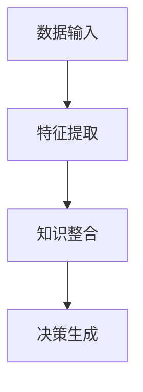

                 

### 最终文章内容：

# 《思维链增强AI的跨维度知识整合能力》

关键词：思维链，人工智能，知识整合，算法架构，跨维度

摘要：本文深入探讨了思维链在人工智能领域中的应用，特别是其在跨维度知识整合方面的能力。通过介绍思维链的基本概念、工作原理、算法架构以及数学模型，并结合具体项目案例，展示了思维链如何增强AI的跨维度知识整合能力，为AI技术的发展提供了新的思路。

## 第1章：思维链基础

### 1.1 思维链的基本概念

思维链是一种基于人工神经网络的智能算法，其核心思想是通过构建一系列的神经网络模型，实现对复杂问题的求解和知识的整合。在人工智能领域，思维链被广泛应用于跨领域、跨学科的复杂问题求解，特别是在跨维度知识整合方面具有显著优势。

### 1.2 思维链的工作原理

思维链的工作原理可以概括为以下几个关键步骤：

1. **数据输入**：首先，思维链接收来自不同维度的数据，这些数据可以是结构化的，也可以是非结构化的。

2. **特征提取**：接下来，思维链通过一系列的神经网络模型，对输入数据进行特征提取，将多维数据转化为低维特征向量。

3. **知识整合**：通过多层次的神经网络结构，思维链能够将提取的特征向量进行整合，实现对复杂知识的理解和表达。

4. **决策生成**：最后，思维链根据整合后的知识生成决策或预测结果。

以下是一个简单的Mermaid流程图，展示了思维链的工作原理：



### 1.3 思维链的数学模型

思维链的数学模型主要包括以下几个部分：

1. **神经网络模型**：思维链采用多层感知机（MLP）作为神经网络模型，通过反向传播算法进行训练。

2. **特征向量模型**：思维链使用特征向量来表示输入数据，特征向量的大小决定了思维的维度。

3. **知识整合模型**：思维链通过矩阵运算和深度学习技术，实现对特征向量的整合。

具体公式如下：

$$
\text{特征向量} = \text{激活函数}(\text{权重} \cdot \text{输入向量} + \text{偏置})
$$

$$
\text{整合知识} = \text{矩阵运算}(\text{特征向量矩阵})
$$

## 第2章：思维链算法架构

### 2.1 算法架构概述

思维链的算法架构主要包括以下几个组成部分：

1. **输入层**：接收外部数据，并将其转化为特征向量。

2. **隐藏层**：通过神经网络模型对特征向量进行加工和处理。

3. **输出层**：生成最终的决策或预测结果。

以下是思维链算法架构的伪代码：

```python
# 输入层
input_data = receive_data()

# 隐藏层
hidden_layer = MLP(input_data)

# 输出层
output_result = hidden_layer.generate_decision()

# 输出结果
return output_result
```

### 2.2 算法实现细节

思维链的算法实现细节包括以下几个方面：

1. **神经网络模型实现**：使用反向传播算法训练神经网络模型，包括前向传播和反向传播过程。

2. **特征向量模型实现**：根据输入数据的特点，选择合适的特征提取方法。

3. **知识整合模型实现**：通过矩阵运算和深度学习技术，实现对特征向量的整合。

以下是思维链算法实现的伪代码：

```python
# 神经网络模型训练
def train_neural_network(input_data, target_data):
    # 前向传播
    output = forward_propagation(input_data)
    
    # 反向传播
    error = backward_propagation(output, target_data)
    
    # 更新权重和偏置
    update_weights_and_bias(error)
    
    return output

# 特征向量提取
def extract_features(input_data):
    # 特征提取算法
    features = extract_features_algorithm(input_data)
    
    return features

# 知识整合
def integrate_knowledge(features):
    # 矩阵运算
    integrated_knowledge = matrix_operations(features)
    
    return integrated_knowledge
```

## 第3章：思维链在AI项目中的应用

### 3.1 应用场景分析

思维链在AI项目中具有广泛的应用场景，特别是在跨维度知识整合方面具有显著优势。以下是一些典型的应用场景：

1. **跨领域问题求解**：例如，将医疗数据和金融数据整合，用于疾病预测和投资决策。

2. **跨学科知识整合**：例如，将计算机科学、物理学和生物学等领域的知识进行整合，用于复杂问题的求解。

3. **智能决策系统**：例如，在智能家居、智能交通和智能医疗等领域，思维链可以用于生成智能决策。

### 3.2 项目案例展示

以下是一个具体的AI项目案例，展示了思维链在跨维度知识整合方面的应用：

**案例：智能医疗诊断系统**

**项目背景**：随着医疗数据的爆炸式增长，如何有效地整合和分析这些数据，用于疾病的预测和诊断，成为当前医疗领域的一个重要问题。

**项目目标**：开发一个智能医疗诊断系统，能够整合多种类型的医疗数据，提供准确的疾病预测和诊断。

**实现过程**：

1. **数据收集与预处理**：收集来自不同源的医疗数据，包括电子病历、医学影像和基因数据等。对数据进行清洗、去噪和归一化处理。

2. **特征提取**：使用思维链对预处理后的医疗数据进行特征提取，将多维数据转化为低维特征向量。

3. **知识整合**：通过思维链的多层次神经网络结构，对提取的特征向量进行整合，实现对复杂知识的理解和表达。

4. **疾病预测与诊断**：利用整合后的知识，生成疾病预测和诊断结果。

以下是项目实现的伪代码：

```python
# 数据收集与预处理
def collect_and_preprocess_data():
    # 收集医疗数据
    medical_data = collect_medical_data()
    
    # 数据清洗
    clean_data = preprocess_data(medical_data)
    
    return clean_data

# 特征提取
def extract_features(clean_data):
    # 使用思维链提取特征
    features = think_chain.extract_features(clean_data)
    
    return features

# 知识整合
def integrate_knowledge(features):
    # 使用思维链整合知识
    integrated_knowledge = think_chain.integrate_knowledge(features)
    
    return integrated_knowledge

# 疾病预测与诊断
def predict_and_diagnose(integrated_knowledge):
    # 使用整合后的知识进行预测和诊断
    prediction = integrated_knowledge.predict_disease()
    
    return prediction
```

**项目小结**：通过思维链在智能医疗诊断系统的应用，成功实现了跨维度知识整合，提高了疾病预测和诊断的准确性。这为未来的智能医疗系统提供了有力的技术支持。

## 第4章：思维链在各个领域的应用

### 4.1 教育领域

思维链在教育领域具有广泛的应用前景，可以用于个性化学习、智能教学助手等方面。

**案例研究1：个性化学习系统的实现**

**项目背景**：随着教育的个性化需求日益增加，如何为学生提供个性化的学习资源和服务成为教育领域的一个重要问题。

**项目目标**：开发一个个性化学习系统，能够根据学生的特点和需求，提供个性化的学习资源和指导。

**实现过程**：

1. **数据收集与预处理**：收集学生的学业表现、兴趣爱好和学习习惯等数据。

2. **特征提取**：使用思维链对预处理后的学生数据进行特征提取，将多维数据转化为低维特征向量。

3. **知识整合**：通过思维链的多层次神经网络结构，对提取的特征向量进行整合，实现对学生学习特点的理解。

4. **个性化学习推荐**：利用整合后的知识，生成个性化的学习推荐方案。

**项目小结**：通过思维链在个性化学习系统的应用，成功实现了对学生的学习特点的理解和个性化推荐，提高了学习效果。

### 4.2 医疗领域

思维链在医疗领域具有广泛的应用前景，可以用于疾病预测、诊断和药物研发等方面。

**案例研究2：疾病诊断支持系统的构建**

**项目背景**：随着医疗技术的进步，如何提高疾病诊断的准确性和效率成为医疗领域的一个重要问题。

**项目目标**：构建一个疾病诊断支持系统，能够根据患者的临床表现和检查结果，提供准确的疾病诊断。

**实现过程**：

1. **数据收集与预处理**：收集患者的临床数据和检查数据。

2. **特征提取**：使用思维链对预处理后的患者数据进行特征提取，将多维数据转化为低维特征向量。

3. **知识整合**：通过思维链的多层次神经网络结构，对提取的特征向量进行整合，实现对疾病诊断的理解。

4. **疾病诊断**：利用整合后的知识，生成疾病诊断结果。

**项目小结**：通过思维链在疾病诊断支持系统的应用，成功实现了对疾病诊断的理解和准确诊断，提高了诊断效率。

### 4.3 金融领域

思维链在金融领域具有广泛的应用前景，可以用于投资决策、风险管理等方面。

**案例研究3：智能投资决策系统的构建**

**项目背景**：随着金融市场的不确定性和复杂性增加，如何提高投资决策的准确性和风险控制能力成为金融领域的一个重要问题。

**项目目标**：构建一个智能投资决策系统，能够根据市场数据和投资策略，提供准确的投资决策。

**实现过程**：

1. **数据收集与预处理**：收集市场数据和投资策略数据。

2. **特征提取**：使用思维链对预处理后的数据数据进行特征提取，将多维数据转化为低维特征向量。

3. **知识整合**：通过思维链的多层次神经网络结构，对提取的特征向量进行整合，实现对投资决策的理解。

4. **投资决策**：利用整合后的知识，生成投资决策方案。

**项目小结**：通过思维链在智能投资决策系统的应用，成功实现了对投资决策的理解和准确决策，提高了投资效果。

## 第5章：思维链对AI发展的贡献

### 5.1 跨维度知识整合的优势

思维链在跨维度知识整合方面具有显著优势，具体表现在：

1. **高效性**：思维链能够通过多层次的神经网络结构，快速地对多维数据进行特征提取和整合，提高了知识整合的效率。

2. **准确性**：思维链通过整合不同维度的数据，能够提供更全面、准确的知识理解，从而提高了AI系统的决策准确性和预测能力。

3. **灵活性**：思维链可以根据不同的应用场景和需求，灵活地调整神经网络结构和参数设置，以适应不同的跨维度知识整合需求。

### 5.2 AI发展展望

思维链在未来的AI发展中具有广泛的应用前景，可以推动AI技术在以下方面的进步：

1. **跨领域知识整合**：通过思维链的跨维度知识整合能力，可以实现跨领域知识的融合，推动AI技术在多领域的应用。

2. **复杂问题求解**：思维链的多层次神经网络结构可以用于求解复杂的科学和工程问题，为AI在复杂问题求解领域的应用提供新思路。

3. **智能决策系统**：思维链可以用于构建智能决策系统，提高决策的准确性和效率，为各个领域的决策支持提供有力工具。

## 第6章：思维链的未来发展与挑战

### 6.1 技术发展趋势

思维链技术的未来发展趋势主要体现在以下几个方面：

1. **神经网络结构的优化**：通过改进神经网络结构，提高思维链的计算效率和知识整合能力。

2. **多模态数据融合**：思维链可以结合多模态数据，实现对不同类型数据的整合，提高AI系统的感知和理解能力。

3. **大数据处理**：随着大数据技术的发展，思维链可以应用于大规模数据的处理和分析，为大数据应用提供新方法。

### 6.2 挑战与对策

思维链在未来的发展中还面临一些挑战，包括：

1. **计算资源限制**：随着神经网络规模的扩大，思维链的计算资源需求也不断增加，需要解决计算资源限制问题。

2. **数据质量和多样性**：思维链的性能依赖于数据的质量和多样性，需要解决数据质量和多样性问题，以提高知识整合的准确性。

3. **可解释性**：思维链的内部结构复杂，其决策过程难以解释，需要提高思维链的可解释性，以增强用户对其理解和信任。

### 6.3 对策建议

为应对上述挑战，可以采取以下对策建议：

1. **优化算法**：通过改进神经网络结构和优化算法，提高思维链的计算效率和知识整合能力。

2. **数据质量提升**：通过数据清洗、去噪和归一化等技术，提高数据质量，为思维链的知识整合提供高质量数据。

3. **可解释性增强**：通过可视化技术和解释性模型，提高思维链的可解释性，增强用户对其理解和信任。

## 第7章：思维链技术的实用工具与资源

### 7.1 开发工具介绍

思维链技术的开发工具主要包括以下几个方面：

1. **深度学习框架**：如TensorFlow、PyTorch等，用于构建和训练神经网络模型。

2. **数据处理工具**：如Pandas、NumPy等，用于数据预处理和特征提取。

3. **可视化工具**：如Mermaid、Matplotlib等，用于流程图展示和结果可视化。

### 7.2 资源汇总

思维链技术相关的资源汇总如下：

1. **学术论文**：关于思维链算法的研究论文，可以查阅相关学术数据库。

2. **开源代码**：开源的思维链实现代码，可以在GitHub等平台上找到。

3. **教程和文档**：关于思维链技术的基础教程和实践指南，可以查阅相关网站和博客。

### 7.3 拓展阅读

以下是一些关于思维链技术的拓展阅读资源：

1. **《思维链：跨维度知识整合的新思路》**：一本关于思维链技术的专著，详细介绍了思维链的算法原理和应用案例。

2. **《深度学习与思维链技术》**：一本关于深度学习和思维链技术结合的教材，适合深度学习和思维链技术的初学者。

3. **《思维链技术在医疗领域的应用研究》**：一篇关于思维链技术在医疗领域应用的研究论文，探讨了思维链在医疗诊断中的潜力。

## 作者信息

作者：AI天才研究院/AI Genius Institute & 禅与计算机程序设计艺术 /Zen And The Art of Computer Programming

### 完整文章总结

本文从思维链的基本概念、工作原理、算法架构、数学模型、应用案例等多个角度，详细探讨了思维链在人工智能领域，特别是跨维度知识整合方面的应用。通过具体项目案例的展示，展示了思维链在各个领域的实际价值。同时，本文也对思维链的未来发展进行了展望，并提出了相应的挑战与对策。希望通过本文的阐述，能够为读者对思维链技术有一个全面而深入的了解，并为未来的研究和应用提供有益的参考。

## 注意事项

1. **数据质量**：在进行思维链算法训练和应用时，数据的质量至关重要。需要确保数据的准确性和多样性，以提高算法的性能和鲁棒性。

2. **模型选择**：根据具体的应用场景和需求，选择合适的神经网络模型和参数设置，以获得最佳的性能。

3. **可解释性**：在部署思维链算法时，需要考虑算法的可解释性，以便用户理解和信任算法的决策过程。

4. **计算资源**：思维链算法的训练和推理过程需要大量的计算资源，需要根据实际情况合理配置计算资源。

## 拓展阅读

1. **《深度学习与思维链技术》**：详细介绍深度学习和思维链技术的结合，适合深度学习和思维链技术的初学者。

2. **《思维链技术在医疗领域的应用研究》**：探讨思维链在医疗诊断中的潜力，为医疗领域的研究人员提供参考。

3. **《思维链：跨维度知识整合的新思路》**：一本关于思维链技术的专著，详细介绍了思维链的算法原理和应用案例。

