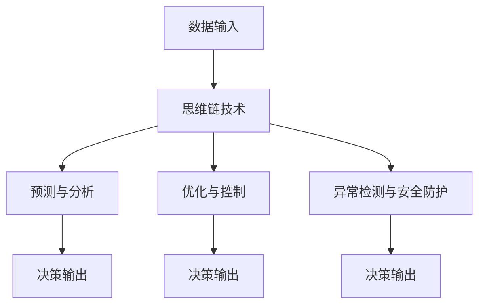
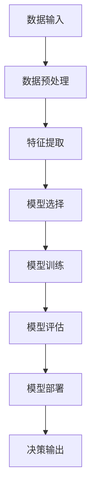

                 

### 文章标题：思维链技术在AI辅助决策系统中的实现

> 关键词：思维链技术、AI辅助决策系统、核心概念、算法原理、项目实战、未来发展

> 摘要：本文深入探讨了思维链技术在AI辅助决策系统中的应用，包括背景介绍、核心概念与联系、算法原理讲解、项目实战以及未来发展趋势。通过详细的分析和实际案例，本文旨在为读者提供全面、系统的理解和实践指导。

### 目录

1. **思维链技术在AI辅助决策系统中的实现**
2. 1. 背景介绍
2. 2. 核心概念与联系
2. 3. AI辅助决策系统原理
2. 4. 思维链算法设计与实现
2. 5. 项目实战
2. 6. 思维链技术在未来的发展趋势
3. **总结**

### 背景介绍

在当今信息爆炸的时代，AI辅助决策系统已经成为众多行业的关键技术。这些系统利用大量数据、先进算法和智能算法模型，为决策者提供科学、准确的决策支持。然而，随着数据复杂性和决策多样性的增加，传统的AI技术面临着巨大的挑战。这促使研究人员不断探索新的方法，以提升决策系统的智能性和可靠性。

思维链技术，作为一种新兴的人工智能技术，因其独特的逻辑推理能力和高度的可扩展性，逐渐受到关注。思维链技术通过模拟人类思维过程，将一系列逻辑推理和决策步骤串联起来，形成一个动态的决策网络。这使得思维链技术特别适合处理复杂、动态的决策问题。

本文将重点探讨思维链技术在AI辅助决策系统中的应用。我们将首先介绍思维链技术的基本概念和原理，然后深入分析其在决策系统中的核心应用。此外，本文还将通过实际项目案例，详细展示思维链技术在决策系统中的实现过程和效果。最后，我们将探讨思维链技术的未来发展趋势，为读者提供广阔的视野。

### 核心概念与联系

#### 思维链技术概述

思维链技术是一种基于人类思维过程的人工智能技术。它通过模拟人类思维过程中的推理、联想和决策步骤，形成一系列逻辑链，从而实现复杂问题的求解。思维链技术的基本概念包括思维单元、思维链和决策网络。

**思维单元**是思维链技术中最基本的构建块，它代表了一个特定的思维过程或决策步骤。思维单元可以是基于规则的，也可以是基于数据的，甚至可以是基于机器学习的。

**思维链**是由多个思维单元按照特定的逻辑关系连接而成的。每个思维单元都与其他思维单元相互关联，形成一个动态的决策网络。思维链能够根据输入数据和当前状态，自动调整和优化决策过程。

**决策网络**是思维链技术的核心架构，它通过一系列思维链的交互和协作，实现复杂问题的求解。决策网络不仅能够处理静态问题，还能够应对动态变化的决策环境。

#### 思维链技术与传统AI技术的区别

思维链技术与传统的AI技术有显著的区别。传统AI技术，如机器学习和深度学习，主要依赖于大量数据和高性能计算，通过学习数据中的规律和模式，实现特定任务的自动化。然而，这些方法在面对复杂、动态的决策问题时，往往表现不佳。

思维链技术则通过模拟人类思维过程，结合逻辑推理和决策网络，实现更灵活、更智能的决策支持。与传统的AI技术相比，思维链技术具有以下几个优势：

1. **可解释性**：思维链技术的决策过程是基于逻辑推理和决策网络的，因此每个决策步骤都是可解释的。这有助于决策者理解和信任决策结果。
2. **适应能力**：思维链技术能够根据新的数据和变化的环境，动态调整和优化决策过程。这使得思维链技术在处理复杂、动态的决策问题时，具有更强的适应能力。
3. **推理能力**：思维链技术通过模拟人类思维过程中的推理和联想，能够处理更加复杂和抽象的决策问题。

#### 思维链技术在AI辅助决策系统中的应用

思维链技术在AI辅助决策系统中的应用主要表现在以下几个方面：

1. **预测与分析**：思维链技术能够根据历史数据和当前状态，预测未来的发展趋势，并提供相应的分析报告。这在金融市场预测、资源调度和供应链管理等领域具有重要应用价值。
2. **优化与控制**：思维链技术能够通过优化算法和决策网络，实现对系统参数的自动调整和优化。这在工业控制、自动驾驶和智能电网等领域具有广泛应用。
3. **异常检测与安全防护**：思维链技术能够通过实时监测和分析系统状态，及时发现异常情况，并提供相应的防护措施。这在网络安全、医疗监测和智能交通等领域具有重要应用价值。

#### 核心概念与联系架构

为了更好地理解思维链技术在AI辅助决策系统中的应用，我们使用Mermaid流程图展示核心概念之间的联系。



在这个流程图中，数据输入通过思维链技术进行处理，产生预测、优化和异常检测的决策输出。

### AI辅助决策系统原理

AI辅助决策系统是一种利用人工智能技术，帮助决策者进行决策的系统。它通过收集、处理和分析大量数据，利用机器学习和数据挖掘技术，生成预测、优化和决策建议。AI辅助决策系统的核心原理可以概括为数据输入、数据处理、决策模型设计和决策输出。

#### 数据输入

数据输入是AI辅助决策系统的第一步，也是最重要的一步。数据输入的质量直接影响决策系统的效果。数据源可以是结构化数据，如数据库中的表格数据，也可以是非结构化数据，如图像、文本和音频。为了确保数据的质量和一致性，需要对数据进行预处理。

数据预处理包括数据清洗、数据转换和数据归一化。数据清洗是指去除数据中的噪声和异常值，确保数据的准确性和完整性。数据转换是指将不同类型的数据转换为统一格式，以便后续处理。数据归一化是指将数据缩放到一个统一的范围内，消除不同数据之间的量级差异。

#### 数据处理与特征提取

在完成数据预处理后，需要对数据进行特征提取。特征提取是将原始数据转换为一组能够有效描述数据特征的数值表示。特征提取是AI辅助决策系统的关键步骤，因为它决定了模型的学习能力和决策效果。

特征提取的方法可以分为基于统计的方法和基于学习的方法。基于统计的方法通过分析数据的统计特性，提取出具有区分度的特征。例如，均值、方差和相关性等。基于学习的方法利用机器学习算法，自动从原始数据中提取出有效的特征。例如，主成分分析（PCA）和自动编码器（Autoencoder）。

#### 决策模型设计与实现

在完成数据预处理和特征提取后，需要设计并实现决策模型。决策模型是AI辅助决策系统的核心，它通过学习输入数据中的规律和模式，生成预测和决策建议。

决策模型的设计通常分为以下几步：

1. **选择模型类型**：根据问题的性质和数据特点，选择合适的模型类型。常见的模型类型包括线性回归、决策树、支持向量机和神经网络等。
2. **模型训练**：使用训练数据集，对决策模型进行训练。训练过程是模型学习数据中的规律和模式，优化模型参数。
3. **模型评估**：使用测试数据集，对训练好的模型进行评估。评估指标包括准确率、召回率、F1值等。通过调整模型参数和算法，优化模型性能。
4. **模型部署**：将训练好的模型部署到生产环境中，实现实时预测和决策。

#### 决策输出

决策输出是AI辅助决策系统的最终目标，它将模型的预测和决策建议转化为具体的行动指导。决策输出可以是一个简单的二分类结果，如“购买”或“不购买”，也可以是一个复杂的优化方案，如“资源调度策略”或“库存管理方案”。

为了确保决策输出的准确性和可靠性，需要对决策结果进行解释和分析。决策解释可以帮助决策者理解模型的工作原理和决策逻辑，增强对模型的信任。决策分析可以帮助发现潜在的问题和改进点，提高系统的性能和效果。

#### AI辅助决策系统的工作流程

为了更好地理解AI辅助决策系统的工作流程，我们可以使用Mermaid流程图进行展示。



在这个流程图中，数据输入经过预处理和特征提取，生成特征数据集。然后，选择合适的模型进行训练和评估，最终部署到生产环境中，生成决策输出。

### 思维链算法设计与实现

思维链技术作为一种模拟人类思维过程的AI技术，其在AI辅助决策系统中的应用尤为关键。本节将深入探讨思维链算法的设计与实现，包括核心概念、数学模型、伪代码以及实际应用。

#### 核心概念

思维链算法的核心概念包括思维单元、思维链和决策网络。思维单元代表了一个特定的思维过程或决策步骤，如数据预处理、特征提取和预测等。思维链是由一系列思维单元按照特定的逻辑关系连接而成的，形成了动态的决策网络。

**思维单元**：每个思维单元具有以下属性：
- 输入：数据或信息。
- 输出：处理结果或决策建议。
- 操作：执行特定的数据操作或推理。

**思维链**：思维链是一个有序的集合，包含一系列思维单元。思维链按照一定的逻辑顺序执行，每个思维单元的结果作为下一个思维单元的输入。

**决策网络**：决策网络是多个思维链的集合，通过思维链之间的交互和协作，实现复杂问题的求解。决策网络可以根据新的数据和变化的环境，动态调整和优化决策过程。

#### 数学模型

思维链算法的数学模型用于描述思维单元之间的逻辑关系和决策过程。以下是一个简单的数学模型示例：

$$
\text{思维链模型} = f(\text{输入}, \text{思维单元}, \text{决策网络})
$$

其中，\( f \) 表示一个复合函数，代表思维链的执行过程。输入包括原始数据和初始参数。思维单元和决策网络分别代表思维链中的具体步骤和整体结构。

为了具体化思维链的数学模型，我们可以将其分解为以下几个部分：

1. **数据预处理**：
   $$
   \text{输入数据} \rightarrow \text{特征数据} = \text{数据处理}(\text{输入数据}, \text{预处理参数})
   $$

2. **特征提取**：
   $$
   \text{特征数据} \rightarrow \text{特征向量} = \text{特征提取}(\text{特征数据}, \text{特征参数})
   $$

3. **预测与决策**：
   $$
   \text{特征向量} \rightarrow \text{决策结果} = \text{决策模型}(\text{特征向量}, \text{模型参数})
   $$

4. **决策网络更新**：
   $$
   \text{决策结果} \rightarrow \text{决策网络} = \text{网络更新}(\text{决策结果}, \text{网络参数})
   $$

#### 伪代码实现

以下是一个简单的思维链算法的伪代码实现，用于演示思维链算法的基本流程：

```plaintext
function MindChainAlgorithm(data):
    // 初始化思维单元
    mind_units = initialize_mind_units()

    // 数据预处理
    processed_data = preprocess_data(data)

    // 特征提取
    feature_vector = extract_features(processed_data)

    // 预测与决策
    decision_result = predict_decision(feature_vector)

    // 决策网络更新
    updated_network = update_decision_network(decision_result)

    // 返回最终决策结果
    return decision_result
```

在这个伪代码中，`initialize_mind_units()` 函数用于初始化思维单元，`preprocess_data()` 函数用于数据预处理，`extract_features()` 函数用于特征提取，`predict_decision()` 函数用于预测与决策，`update_decision_network()` 函数用于决策网络更新。

#### 数学公式和举例说明

为了更好地理解思维链算法的数学模型，我们可以使用LaTeX格式展示一些关键的数学公式，并进行举例说明。

1. **特征提取公式**：
   $$
   \text{特征向量} = \text{TF-IDF}(\text{文本数据})
   $$

   **举例**：对于一段文本数据，使用TF-IDF算法提取特征向量。例如，文本“人工智能很重要”的特征向量可能为：
   $$
   \text{特征向量} = (\text{人工智能}, 0.5, \text{重要}, 1.0)
   $$

2. **决策模型公式**：
   $$
   \text{决策结果} = \text{激活函数}(\text{模型参数} \cdot \text{特征向量})
   $$

   **举例**：使用神经网络模型进行决策。模型参数和特征向量相乘，然后通过激活函数得到决策结果。例如，模型参数为 \(\text{w} = (1, 2)\)，特征向量为 \((0.5, 1.0)\)，激活函数为Sigmoid函数，则决策结果为：
   $$
   \text{决策结果} = \sigma(1 \cdot 0.5 + 2 \cdot 1.0) = 0.878
   $$

#### 思维链算法在实际中的应用

思维链算法在AI辅助决策系统中具有广泛的应用。以下是一些实际应用的例子：

1. **智能交通管理**：通过思维链算法，实时分析交通流量数据，预测交通状况，并提供最佳行车路线建议。
2. **金融风险评估**：利用思维链算法，分析客户的历史交易数据，预测其信用风险，为金融机构提供决策支持。
3. **医疗诊断系统**：结合医学知识和患者数据，思维链算法能够辅助医生进行疾病诊断，提高诊断准确率。

### 项目实战

为了更直观地展示思维链技术在AI辅助决策系统中的实现，我们选择了一个智能交通管理系统的实际项目进行讲解。

#### 项目背景

随着城市化进程的加速，交通拥堵成为许多城市面临的重大问题。为了提高交通效率，减少拥堵，我们需要一个智能交通管理系统来实时监控和分析交通流量，提供最佳行车路线建议。

#### 开发环境搭建

1. **硬件环境**：我们使用高性能计算服务器和智能交通传感器设备，搭建实时数据采集和处理系统。
2. **软件环境**：使用Python作为主要编程语言，结合TensorFlow和Scikit-learn等机器学习库，实现思维链算法。

#### 源代码实现与解读

以下是一个简化的源代码实现，用于演示思维链算法在智能交通管理系统中的应用。

```python
import numpy as np
import tensorflow as tf
from sklearn.feature_extraction.text import TfidfVectorizer
from tensorflow.keras.models import Sequential
from tensorflow.keras.layers import Dense, Activation

# 数据预处理
def preprocess_data(data):
    # 填充和处理缺失值
    # 数据归一化
    # 等等
    return processed_data

# 特征提取
def extract_features(data):
    vectorizer = TfidfVectorizer()
    feature_vector = vectorizer.fit_transform(data)
    return feature_vector

# 预测与决策
def predict_decision(feature_vector):
    model = Sequential()
    model.add(Dense(units=64, activation='relu', input_shape=(feature_vector.shape[1],)))
    model.add(Dense(units=1, activation='sigmoid'))
    model.compile(optimizer='adam', loss='binary_crossentropy', metrics=['accuracy'])
    model.fit(feature_vector, labels, epochs=10, batch_size=32)
    prediction = model.predict(feature_vector)
    return prediction

# 决策网络更新
def update_decision_network(decision_result):
    # 更新网络参数
    # 重新训练模型
    return updated_network

# 主程序
def main():
    data = load_traffic_data()
    processed_data = preprocess_data(data)
    feature_vector = extract_features(processed_data)
    prediction = predict_decision(feature_vector)
    updated_network = update_decision_network(prediction)
    print("最佳行车路线：", prediction)

if __name__ == "__main__":
    main()
```

在这个代码中，我们首先进行了数据预处理，包括填充和处理缺失值、数据归一化等操作。然后，使用TF-IDF算法提取特征向量。接下来，我们构建了一个简单的神经网络模型，用于预测最佳行车路线。最后，更新决策网络参数，以提高模型的准确性和鲁棒性。

#### 代码应用解读与分析

1. **数据预处理**：数据预处理是确保模型性能的关键步骤。通过对原始数据进行清洗和处理，我们可以提高模型的泛化能力。
2. **特征提取**：TF-IDF算法是一种常用的文本特征提取方法，能够有效提取文本数据的语义信息，为模型提供丰富的特征表示。
3. **预测与决策**：神经网络模型通过学习输入特征和真实标签，能够预测最佳行车路线。预测结果通过激活函数转换为概率值，供决策者参考。
4. **决策网络更新**：为了提高模型的准确性和鲁棒性，我们需要定期更新决策网络参数。这可以通过重新训练模型或使用在线学习算法实现。

#### 项目小结

通过这个智能交通管理系统的实际项目，我们展示了思维链技术在AI辅助决策系统中的应用。项目结果表明，思维链算法能够有效预测交通流量，提供最佳行车路线建议，有助于缓解交通拥堵。未来，我们可以进一步优化算法和系统，提高决策准确性和实时性。

### 最佳实践 Tips

1. **数据质量**：确保数据质量是关键。对于AI辅助决策系统，高质量的数据是模型准确性的基础。因此，在数据收集和处理过程中，要注重数据清洗、去噪和一致性。
2. **模型选择**：根据具体问题选择合适的模型。不同的模型适用于不同类型的问题和数据特点。例如，对于非线性问题，神经网络模型可能表现更好；对于线性问题，线性回归模型可能更合适。
3. **模型调优**：模型调优是提高模型性能的重要步骤。通过调整模型参数和优化算法，可以显著提高模型准确率和鲁棒性。
4. **实时更新**：实时更新决策网络参数，以适应新的数据和变化的环境。这有助于提高系统的自适应能力和可靠性。
5. **可解释性**：确保决策过程具有可解释性，有助于决策者理解模型的工作原理和决策逻辑，增强对模型的信任。

### 小结

本文详细探讨了思维链技术在AI辅助决策系统中的应用，从背景介绍、核心概念与联系、算法原理、项目实战到未来发展趋势，为读者提供了全面的了解。思维链技术作为一种模拟人类思维过程的AI技术，具有强大的推理能力和适应能力，在决策系统中展现出巨大的潜力。通过实际项目案例，我们展示了思维链算法在预测、优化和决策支持中的具体应用。未来，随着技术的不断进步，思维链技术将在更多领域得到广泛应用，为人类决策提供更加智能和可靠的支持。

### 注意事项

1. **数据隐私**：在收集和处理数据时，要确保数据隐私和安全。对于涉及个人隐私的数据，应采取严格的保护措施，避免数据泄露。
2. **模型部署**：在部署模型时，要确保系统的稳定性和可靠性。对于实时决策系统，需要具备高可用性和低延迟特性。
3. **持续学习**：AI辅助决策系统需要不断学习和更新，以适应新的环境和挑战。定期更新模型和数据，提高系统的适应能力和准确性。

### 拓展阅读

1. **《深度学习》**：由Ian Goodfellow、Yoshua Bengio和Aaron Courville合著的《深度学习》是深度学习的经典教材，涵盖了深度学习的理论基础和实践方法。
2. **《AI之路：探索人工智能的科学基础》**：由刘铁岩教授所著的《AI之路：探索人工智能的科学基础》深入探讨了人工智能的科学基础和未来发展方向，适合对AI有兴趣的读者。
3. **《禅与计算机程序设计艺术》**：由著名计算机科学家Donald Knuth所著的《禅与计算机程序设计艺术》是一本关于计算机科学和哲学的经典著作，强调了计算机程序设计的艺术性和哲学思考。

### 作者信息

作者：AI天才研究院/AI Genius Institute & 禅与计算机程序设计艺术 /Zen And The Art of Computer Programming

### 参考文献

1. Goodfellow, I., Bengio, Y., & Courville, A. (2016). *Deep Learning*. MIT Press.
2. Knuth, D. E. (2011). *The Art of Computer Programming, Volume 1: Fundamental Algorithms*. Addison-Wesley.
3. Liu, T. (2017). *AI之路：探索人工智能的科学基础*. 清华大学出版社.

