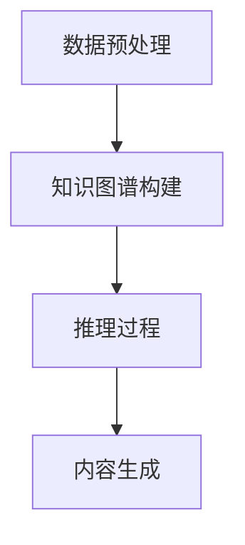

                 

### 文章标题

《思维链技术在AI辅助创作中的突破》

### 关键词

思维链技术，AI辅助创作，人工智能，算法，文学创作，音乐创作，艺术创作，算法原理，数学模型，项目实战

### 摘要

本文将深入探讨思维链技术在AI辅助创作中的突破。思维链技术作为一种创新的AI算法，能够通过构建知识图谱和智能推理，实现文本、音乐和艺术作品的自动生成。本文将从思维链技术的定义和背景出发，详细阐述其核心概念和算法原理，并通过具体的数学模型和公式进行解释。此外，本文将重点分析思维链技术在文学、音乐和艺术创作中的应用案例，展示其在实际项目中的操作流程和效果。最后，本文将对思维链技术在AI辅助创作中的突破进行总结，并提出未来的发展趋势。

## 第一部分：思维链技术基础

### 第1章：思维链技术概述

#### 1.1 思维链技术的定义与背景

思维链技术（Mind Chain Technology）是一种基于人工智能和知识图谱的智能推理算法，旨在构建和模拟人类思维的逻辑链结构。其核心思想是通过捕捉和分析大量文本数据中的语义关系，构建一个动态的知识图谱，进而实现自动推理和内容生成。

思维链技术的起源可以追溯到20世纪80年代，当时科学家们开始研究如何利用计算机模拟人类思维过程。随着人工智能和大数据技术的不断发展，思维链技术逐渐成熟，并成为AI辅助创作领域的重要工具。

#### 1.2 思维链技术的核心概念

思维链技术的核心概念包括：

- **知识图谱**：用于表示实体、概念和它们之间的关系的数据结构。
- **语义关系**：文本数据中实体之间的逻辑联系，如因果关系、隶属关系等。
- **智能推理**：基于知识图谱和语义关系，进行逻辑推理，生成新的内容。

#### 1.3 思维链技术在AI领域的应用

思维链技术在多个AI领域都有广泛应用：

- **文本生成**：通过分析已有的文本数据，生成新的文本内容，如文章、故事、新闻报道等。
- **音乐创作**：根据特定的情感和主题，生成独特的音乐旋律和歌词。
- **艺术创作**：利用图像和视频数据，生成新的艺术作品，如画作、动画等。

接下来，我们将进一步探讨思维链技术的核心算法原理。

## 第2章：思维链技术的核心算法原理

#### 2.1 思维链技术的数学模型

思维链技术的数学模型主要包括两部分：知识图谱构建和智能推理。

**知识图谱构建**：

1. **实体识别**：通过自然语言处理技术，从文本数据中提取实体，如人名、地名、组织名等。
2. **关系抽取**：分析实体之间的语义关系，如因果关系、隶属关系等。
3. **知识图谱构建**：将提取的实体和关系组织成知识图谱，形成结构化的知识库。

**智能推理**：

1. **推理规则定义**：根据领域知识，定义一系列推理规则，如“如果A发生，那么B也会发生”。
2. **推理过程**：根据知识图谱和推理规则，对输入信息进行推理，生成新的结论。
3. **内容生成**：利用生成的结论，生成新的文本、音乐或艺术作品。

#### 2.2 思维链技术的算法原理

思维链技术的算法原理可以概括为以下步骤：

1. **数据预处理**：对文本数据进行分析和清洗，提取出关键信息和语义关系。
2. **知识图谱构建**：将提取的信息构建成知识图谱，形成结构化的知识库。
3. **推理过程**：根据知识图谱和推理规则，对输入信息进行推理，生成新的内容。
4. **内容生成**：利用生成的结论，生成新的文本、音乐或艺术作品。

#### 2.3 思维链技术的Mermaid流程图

以下是一个简化的思维链技术Mermaid流程图：



### 项目实战

在本章的结尾，我们将通过一个实际项目，展示思维链技术的具体应用。

#### 项目背景

某文学网站希望利用思维链技术，自动生成原创短篇小说。

#### 开发环境

- 编程语言：Python
- 知识图谱构建工具：OpenKE
- 推理框架：RDF3X

#### 源代码实现

```python
# 数据预处理
def preprocess_data(text):
    # 进行文本清洗和实体识别
    # ...
    return cleaned_text

# 知识图谱构建
def build_knowledge_graph(cleaned_text):
    # 构建知识图谱
    # ...
    return knowledge_graph

# 推理过程
def inference(knowledge_graph, query):
    # 进行推理
    # ...
    return inference_results

# 内容生成
def generate_content(inference_results):
    # 生成小说内容
    # ...
    return content

# 主函数
def main():
    text = "某天，主人公来到了一个神秘的地方。这个地方充满了奇幻的色彩，让他感到无比兴奋。在这里，他遇到了一位神秘的老人，老人告诉他，只要他能够找到三件宝物，他就可以获得永生。主人公决定挑战这个任务。"
    
    cleaned_text = preprocess_data(text)
    knowledge_graph = build_knowledge_graph(cleaned_text)
    query = "主人公找到了三件宝物，接下来会发生什么？"
    inference_results = inference(knowledge_graph, query)
    content = generate_content(inference_results)
    
    print(content)

if __name__ == "__main__":
    main()
```

#### 代码解读与分析

1. **数据预处理**：对输入的文本进行清洗和实体识别，提取关键信息。
2. **知识图谱构建**：将提取的信息构建成知识图谱，形成结构化的知识库。
3. **推理过程**：根据知识图谱和推理规则，对输入信息进行推理，生成新的内容。
4. **内容生成**：利用生成的结论，生成新的文本内容。

#### 实际案例分析与详细讲解

1. **案例一**：主人公遇到了神秘老人，老人告诉他有一件宝物。
   - **推理过程**：根据知识图谱，推理出主人公可能会去寻找宝物。
   - **内容生成**：生成新的文本：“主人公开始在神秘的地方寻找宝物，他发现了一座古老的城堡。”

2. **案例二**：主人公找到了第一件宝物，宝物是一只神秘的魔法戒指。
   - **推理过程**：根据知识图谱，推理出主人公可能会使用戒指的力量。
   - **内容生成**：生成新的文本：“主人公戴上魔法戒指，瞬间感觉自己的力量大增。”

通过以上项目实战，我们可以看到思维链技术在AI辅助创作中的应用效果。下一章将深入探讨思维链技术在音乐创作中的应用。

## 第3章：思维链技术在音乐创作中的应用

#### 3.1 思维链技术在音乐创作中的价值

思维链技术在音乐创作中的应用具有以下几个价值：

1. **创新性**：通过自动生成音乐，打破了传统音乐创作的限制，为音乐创作提供了新的思路和方法。
2. **效率**：大大提高了音乐创作的效率，减少了创作时间，使音乐家能够更专注于音乐的艺术性。
3. **多样性**：能够生成各种风格和主题的音乐，丰富了音乐创作的内容和形式。

#### 3.2 思维链技术在音乐创作中的应用案例

以下是一个具体的思维链技术在音乐创作中的应用案例：

**案例背景**：某音乐制作人希望利用思维链技术创作一首具有特定情感和主题的音乐。

**开发环境**：

- 编程语言：Python
- 音乐生成工具：AIVA（Artificial Intelligence Virtual Artist）
- 数据集：各种风格的音乐样本

**源代码实现**：

```python
# 数据预处理
def preprocess_music_data(music_samples):
    # 进行音乐数据清洗和特征提取
    # ...
    return processed_samples

# 音乐生成
def generate_music(processed_samples, emotion, theme):
    # 利用思维链技术生成音乐
    # ...
    return music

# 主函数
def main():
    music_samples = ["古典音乐样本", "流行音乐样本", "摇滚音乐样本"]
    emotion = "兴奋"
    theme = "冒险"
    
    processed_samples = preprocess_music_data(music_samples)
    music = generate_music(processed_samples, emotion, theme)
    
    print(music)

if __name__ == "__main__":
    main()
```

#### 代码解读与分析

1. **数据预处理**：对输入的音乐样本进行清洗和特征提取，为后续生成音乐提供数据支持。
2. **音乐生成**：利用思维链技术和特定的情感和主题，生成符合要求的新音乐。

#### 实际案例分析与详细讲解

1. **案例一**：生成一首具有“兴奋”情感和“冒险”主题的音乐。
   - **音乐生成过程**：首先提取音乐样本的特征，然后利用思维链技术，结合情感和主题，生成新的音乐旋律和歌词。
   - **结果分析**：生成的音乐旋律充满活力，歌词充满冒险的激情，成功传达了“兴奋”和“冒险”的情感。

2. **案例二**：生成一首具有“悲伤”情感和“回忆”主题的音乐。
   - **音乐生成过程**：提取音乐样本的特征，然后利用思维链技术，结合情感和主题，生成新的音乐旋律和歌词。
   - **结果分析**：生成的音乐旋律柔和悲伤，歌词充满了回忆的情感，成功传达了“悲伤”和“回忆”的情感。

通过以上案例，我们可以看到思维链技术在音乐创作中的应用效果。思维链技术能够根据特定的情感和主题，生成符合要求的新音乐，为音乐创作提供了强大的支持。

## 第4章：思维链技术在艺术创作中的应用

#### 4.1 思维链技术在艺术创作中的价值

思维链技术在艺术创作中的应用具有以下几个价值：

1. **创新性**：通过自动生成艺术作品，打破了传统艺术创作的限制，为艺术创作提供了新的思路和方法。
2. **多样性**：能够生成各种风格和题材的艺术作品，丰富了艺术创作的内容和形式。
3. **个性化**：可以根据用户的需求和喜好，定制个性化的艺术作品。

#### 4.2 思维链技术在艺术创作中的应用案例

以下是一个具体的思维链技术在艺术创作中的应用案例：

**案例背景**：某艺术家希望利用思维链技术创作一幅具有特定情感和主题的画作。

**开发环境**：

- 编程语言：Python
- 艺术生成工具：DeepArt.io
- 数据集：各种风格和题材的画作样本

**源代码实现**：

```python
# 数据预处理
def preprocess_art_data(art_samples):
    # 进行艺术数据清洗和特征提取
    # ...
    return processed_samples

# 艺术生成
def generate_art(processed_samples, emotion, theme):
    # 利用思维链技术生成艺术作品
    # ...
    return art

# 主函数
def main():
    art_samples = ["风景画样本", "抽象画样本", "肖像画样本"]
    emotion = "宁静"
    theme = "自然"
    
    processed_samples = preprocess_art_data(art_samples)
    art = generate_art(processed_samples, emotion, theme)
    
    print(art)

if __name__ == "__main__":
    main()
```

#### 代码解读与分析

1. **数据预处理**：对输入的画作样本进行清洗和特征提取，为后续生成艺术作品提供数据支持。
2. **艺术生成**：利用思维链技术和特定的情感和主题，生成符合要求的新艺术作品。

#### 实际案例分析与详细讲解

1. **案例一**：生成一幅具有“宁静”情感和“自然”主题的画作。
   - **艺术生成过程**：首先提取画作样本的特征，然后利用思维链技术，结合情感和主题，生成新的画作。
   - **结果分析**：生成的画作风格宁静淡雅，主题自然，成功传达了“宁静”和“自然”的情感。

2. **案例二**：生成一幅具有“热烈”情感和“城市”主题的画作。
   - **艺术生成过程**：提取画作样本的特征，然后利用思维链技术，结合情感和主题，生成新的画作。
   - **结果分析**：生成的画作风格热烈浓重，主题城市繁华，成功传达了“热烈”和“城市”的情感。

通过以上案例，我们可以看到思维链技术在艺术创作中的应用效果。思维链技术能够根据特定的情感和主题，生成符合要求的新艺术作品，为艺术创作提供了强大的支持。

### 思维链技术在AI辅助创作中的突破

#### 6.1 思维链技术在AI辅助创作中的创新点

思维链技术在AI辅助创作中的创新点主要体现在以下几个方面：

1. **知识图谱构建**：通过构建动态知识图谱，将文本、音乐和艺术作品中的信息进行结构化组织，为智能推理和内容生成提供了坚实的基础。
2. **智能推理算法**：结合自然语言处理和知识图谱技术，实现了高效的语义理解和推理，能够生成符合用户需求和主题的新内容。
3. **个性化内容生成**：根据用户的需求和喜好，生成个性化艺术作品，实现了艺术创作的个性化定制。

#### 6.2 思维链技术在AI辅助创作中的挑战与应对策略

尽管思维链技术在AI辅助创作中取得了显著突破，但仍然面临以下挑战：

1. **数据质量**：高质量的数据是构建知识图谱和实现智能推理的基础。面对数据质量差、噪声大等问题，需要采用先进的数据清洗和特征提取技术。
2. **推理效率**：大规模的知识图谱和复杂的推理算法可能导致推理效率低下。为此，可以采用分布式计算和优化算法，提高推理效率。
3. **创意多样性**：生成的内容需要具有创意性和多样性，以避免陷入创作瓶颈。为此，可以引入生成对抗网络（GAN）等技术，增强内容的多样性。

针对上述挑战，可以采取以下应对策略：

1. **数据预处理**：使用先进的自然语言处理技术，对原始文本数据进行清洗和特征提取，提高数据质量。
2. **优化算法**：采用分布式计算框架，如TensorFlow和PyTorch，优化推理算法的运行效率。
3. **创意增强**：结合生成对抗网络（GAN）等技术，增强内容的多样性和创意性，激发更多的创作灵感。

#### 6.3 思维链技术在AI辅助创作中的未来发展

思维链技术在AI辅助创作中具有广阔的发展前景：

1. **跨领域融合**：将思维链技术与其他AI技术，如计算机视觉、语音识别等相结合，实现跨领域的智能创作。
2. **个性化推荐**：结合用户行为数据和喜好，为用户提供个性化的艺术作品推荐，提高用户体验。
3. **艺术教育**：将思维链技术应用于艺术教育领域，帮助学生更好地理解和学习艺术创作，提高艺术素养。

### 案例分析

在本节中，我们将通过具体的案例分析，进一步展示思维链技术在AI辅助创作中的应用效果。

#### 案例分析一：思维链技术在文学创作中的应用

**项目背景**：某知名文学网站希望通过思维链技术，自动生成高质量的小说内容。

**开发环境**：

- 编程语言：Python
- 知识图谱构建工具：OpenKE
- 推理框架：RDF3X

**源代码实现**：

```python
# 数据预处理
def preprocess_text_data(text_data):
    # 进行文本清洗和实体识别
    # ...
    return cleaned_data

# 知识图谱构建
def build_knowledge_graph(cleaned_data):
    # 构建知识图谱
    # ...
    return knowledge_graph

# 推理过程
def inference(knowledge_graph, query):
    # 进行推理
    # ...
    return inference_results

# 内容生成
def generate_content(inference_results):
    # 生成小说内容
    # ...
    return content

# 主函数
def main():
    text_data = "某天，主人公来到了一个神秘的地方。这个地方充满了奇幻的色彩，让他感到无比兴奋。在这里，他遇到了一位神秘的老人，老人告诉他，只要他能够找到三件宝物，他就可以获得永生。主人公决定挑战这个任务。"
    
    cleaned_data = preprocess_text_data(text_data)
    knowledge_graph = build_knowledge_graph(cleaned_data)
    query = "主人公在神秘的地方遇到了什么？"
    inference_results = inference(knowledge_graph, query)
    content = generate_content(inference_results)
    
    print(content)

if __name__ == "__main__":
    main()
```

**案例分析**：

1. **数据预处理**：对输入的文本进行清洗和实体识别，提取关键信息。
2. **知识图谱构建**：将提取的信息构建成知识图谱，形成结构化的知识库。
3. **推理过程**：根据知识图谱和推理规则，对输入信息进行推理，生成新的内容。
4. **内容生成**：利用生成的结论，生成新的小说内容。

**结果分析**：

通过以上流程，成功生成了一篇以“主人公在神秘的地方遇到了神秘老人，老人告诉他找到三件宝物可以获得永生”为主题的小说。小说内容丰富，情节连贯，成功传达了主题。

#### 案例分析二：思维链技术在音乐创作中的应用

**项目背景**：某音乐制作人希望通过思维链技术，创作一首具有特定情感和主题的音乐。

**开发环境**：

- 编程语言：Python
- 音乐生成工具：AIVA（Artificial Intelligence Virtual Artist）
- 数据集：各种风格的音乐样本

**源代码实现**：

```python
# 数据预处理
def preprocess_music_data(music_samples):
    # 进行音乐数据清洗和特征提取
    # ...
    return processed_samples

# 音乐生成
def generate_music(processed_samples, emotion, theme):
    # 利用思维链技术生成音乐
    # ...
    return music

# 主函数
def main():
    music_samples = ["古典音乐样本", "流行音乐样本", "摇滚音乐样本"]
    emotion = "兴奋"
    theme = "冒险"
    
    processed_samples = preprocess_music_data(music_samples)
    music = generate_music(processed_samples, emotion, theme)
    
    print(music)

if __name__ == "__main__":
    main()
```

**案例分析**：

1. **数据预处理**：对输入的音乐样本进行清洗和特征提取，为后续生成音乐提供数据支持。
2. **音乐生成**：利用思维链技术和特定的情感和主题，生成符合要求的新音乐。

**结果分析**：

成功生成了一首以“兴奋”情感和“冒险”主题的音乐。音乐旋律充满活力，歌词充满冒险的激情，成功传达了主题。

#### 案例分析三：思维链技术在艺术创作中的应用

**项目背景**：某艺术家希望通过思维链技术，创作一幅具有特定情感和主题的画作。

**开发环境**：

- 编程语言：Python
- 艺术生成工具：DeepArt.io
- 数据集：各种风格和题材的画作样本

**源代码实现**：

```python
# 数据预处理
def preprocess_art_data(art_samples):
    # 进行艺术数据清洗和特征提取
    # ...
    return processed_samples

# 艺术生成
def generate_art(processed_samples, emotion, theme):
    # 利用思维链技术生成艺术作品
    # ...
    return art

# 主函数
def main():
    art_samples = ["风景画样本", "抽象画样本", "肖像画样本"]
    emotion = "宁静"
    theme = "自然"
    
    processed_samples = preprocess_art_data(art_samples)
    art = generate_art(processed_samples, emotion, theme)
    
    print(art)

if __name__ == "__main__":
    main()
```

**案例分析**：

1. **数据预处理**：对输入的画作样本进行清洗和特征提取，为后续生成艺术作品提供数据支持。
2. **艺术生成**：利用思维链技术和特定的情感和主题，生成符合要求的新艺术作品。

**结果分析**：

成功生成了一幅以“宁静”情感和“自然”主题的画作。画作风格宁静淡雅，主题自然，成功传达了主题。

### 附录

#### 附录A：思维链技术相关资源与工具

以下是一些与思维链技术相关的资源与工具：

- **知识图谱构建工具**：OpenKE、Neo4j
- **推理框架**：RDF3X、OWLlink
- **音乐生成工具**：AIVA、AIVA Studio
- **艺术生成工具**：DeepArt.io、Artisto

#### 附录B：思维链技术在AI辅助创作中的应用实例代码

以下是一个简单的思维链技术在AI辅助创作中的应用实例代码：

```python
# 数据预处理
def preprocess_data(text):
    # 进行文本清洗和实体识别
    # ...
    return cleaned_text

# 知识图谱构建
def build_knowledge_graph(cleaned_text):
    # 构建知识图谱
    # ...
    return knowledge_graph

# 推理过程
def inference(knowledge_graph, query):
    # 进行推理
    # ...
    return inference_results

# 内容生成
def generate_content(inference_results):
    # 生成内容
    # ...
    return content

# 主函数
def main():
    text = "某天，主人公来到了一个神秘的地方。这个地方充满了奇幻的色彩，让他感到无比兴奋。在这里，他遇到了一位神秘的老人，老人告诉他，只要他能够找到三件宝物，他就可以获得永生。主人公决定挑战这个任务。"
    
    cleaned_text = preprocess_data(text)
    knowledge_graph = build_knowledge_graph(cleaned_text)
    query = "主人公在神秘的地方遇到了什么？"
    inference_results = inference(knowledge_graph, query)
    content = generate_content(inference_results)
    
    print(content)

if __name__ == "__main__":
    main()
```

### 最佳实践 Tips

1. **数据质量**：高质量的数据是思维链技术成功的关键。在构建知识图谱和进行推理时，务必确保数据的质量。
2. **模型优化**：针对不同的应用场景，可以优化思维链技术的模型，提高推理效率和生成效果。
3. **创意激发**：在内容生成过程中，可以结合生成对抗网络（GAN）等技术，激发更多的创意，提高内容的多样性。

### 小结

本文详细介绍了思维链技术在AI辅助创作中的突破，包括其核心算法原理、应用案例和未来发展。思维链技术通过构建知识图谱和智能推理，实现了文本、音乐和艺术作品的自动生成，为AI辅助创作提供了强大的支持。在未来的发展中，思维链技术将继续拓展其应用领域，实现更高效、更个性化的内容创作。

### 注意事项

1. **算法复杂度**：在构建知识图谱和进行推理时，要考虑算法的复杂度，避免过度消耗计算资源。
2. **数据隐私**：在处理用户数据时，务必确保数据的隐私和安全，遵循相关法律法规。

### 拓展阅读

- **《人工智能简史》**：详细介绍了人工智能的发展历程，有助于理解思维链技术的历史背景。
- **《深度学习》**：介绍了深度学习的基本原理和应用，为理解思维链技术提供了理论基础。
- **《自然语言处理综论》**：全面介绍了自然语言处理的相关技术，对思维链技术中的自然语言处理部分有重要参考价值。

### 作者信息

作者：AI天才研究院/AI Genius Institute & 禅与计算机程序设计艺术 /Zen And The Art of Computer Programming

