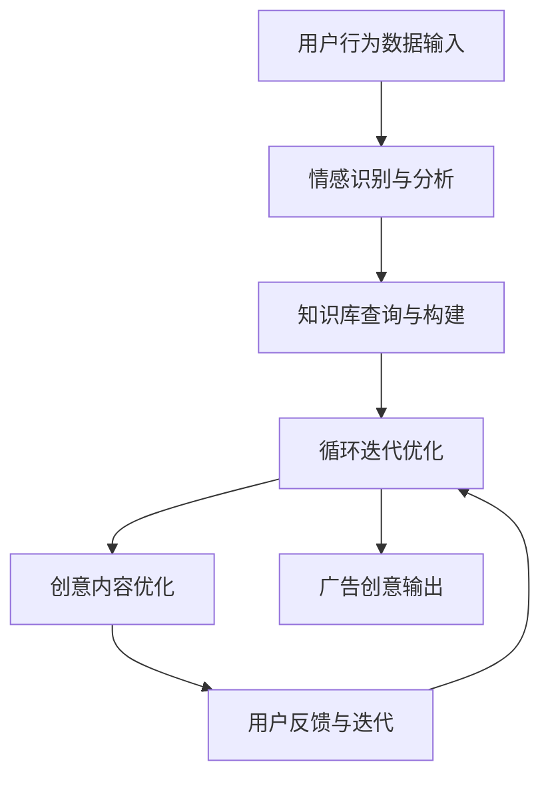

                 

### 文章标题

《思维链技术在AI辅助创意广告生成中的应用》

### 文章关键词

思维链技术，人工智能，广告创意生成，算法实现，实战应用

### 文章摘要

本文旨在探讨思维链技术在AI辅助创意广告生成中的应用。思维链技术作为一种先进的认知计算方法，通过模拟人类思维过程，提供了一种有效的手段来辅助创意广告生成。本文首先介绍了思维链技术的基本概念、原理和应用背景，随后详细分析了其在广告创意生成中的核心作用，包括如何解决创意广告生成中的问题与挑战。接着，本文通过具体的应用实例和算法实现，阐述了思维链技术在广告创意生成中的实际应用方法。最后，本文展望了思维链技术在广告创意生成中的未来发展趋势，探讨了其面临的挑战与机遇。希望通过本文的阐述，能为从事广告创意和人工智能领域的从业者提供一些有益的参考和启示。### 引言

在数字化时代，广告已经成为了品牌与消费者之间的重要沟通桥梁。然而，随着信息量的爆炸式增长和受众注意力的分散，创意广告的生成变得尤为困难。传统的广告创作方法往往依赖于人工智慧和经验，效率低下且难以满足快速变化的市场需求。近年来，人工智能（AI）技术的发展为广告行业带来了新的契机，特别是在创意广告生成方面，AI不仅能够提高效率，还能通过数据分析和算法优化，创造出更具有吸引力和个性化的广告内容。

然而，AI在广告创意生成中面临的挑战依然存在。创意广告生成不仅仅需要处理大量的数据，还需要模拟人类的创造思维过程，从而产生新颖、有吸引力的广告内容。传统的人工智能方法，如深度学习和机器学习，虽然已经在图像识别、语音识别等领域取得了显著成果，但在处理复杂、非线性的创意问题时，仍然存在一定的局限性。

在此背景下，思维链技术（MindChain Technology）提供了一种新的解决方案。思维链技术是一种基于认知计算的先进技术，通过模拟人类思维过程，实现自动推理、学习和决策。这种技术不仅能够处理复杂的逻辑关系和抽象概念，还能够通过自我学习和优化，不断提高创意广告生成的质量和效率。

本文将围绕思维链技术在AI辅助创意广告生成中的应用展开讨论。首先，我们将介绍思维链技术的基本概念和原理，包括其历史发展和在人工智能领域的应用背景。接着，本文将深入分析思维链技术在广告创意生成中的核心作用，探讨其在解决创意广告生成问题与挑战方面的优势。随后，通过具体的应用实例和算法实现，详细阐述思维链技术在广告创意生成中的实际应用方法。最后，本文将展望思维链技术在广告创意生成中的未来发展趋势，探讨其面临的挑战与机遇。

希望通过本文的阐述，读者能够对思维链技术在AI辅助创意广告生成中的应用有一个全面和深入的理解，为未来的研究和实践提供参考。### 思维链技术概述

#### 1.1 思维链技术的概念

思维链技术（MindChain Technology）是一种基于认知计算的先进技术，旨在模拟和增强人类思维过程。其核心理念是通过构建复杂的知识图谱和网络，实现对信息的自动推理、学习和决策。思维链技术主要依赖于以下几个核心组件：知识库、推理引擎、学习机制和交互界面。

知识库：知识库是思维链技术的核心，包含了大量的结构化数据、概念和关系。这些数据来源于各种领域，如语言、图像、视频、音频等，通过语义分析和知识提取，形成一个高度结构化的知识体系。

推理引擎：推理引擎负责根据知识库中的信息进行逻辑推理和决策。它能够处理复杂的逻辑关系和抽象概念，通过推理规则和算法，实现对问题的求解和决策。

学习机制：学习机制是思维链技术不断进步的关键。通过自我学习和优化，思维链技术能够不断提高其推理和决策能力。学习机制包括深度学习、强化学习和迁移学习等多种方法。

交互界面：交互界面是用户与思维链技术之间的桥梁，通过自然语言处理、语音识别等技术，用户可以与思维链技术进行高效、直观的交互。

#### 1.2 思维链技术的历史与发展

思维链技术的起源可以追溯到20世纪80年代，当时人工智能领域的先驱们开始尝试模拟人类思维过程。早期的思维链技术主要基于符号逻辑和专家系统，通过定义一系列规则和条件来实现简单的推理和决策。随着计算机性能的不断提高和大数据技术的发展，思维链技术逐渐从符号逻辑向基于数据驱动的认知计算转变。

2000年以后，随着深度学习和神经网络技术的突破，思维链技术进入了新的发展阶段。深度学习通过多层神经网络对大量数据进行自动特征提取和模式识别，使得思维链技术在处理复杂数据和任务时表现出了强大的能力。同时，强化学习和迁移学习等新方法也被引入到思维链技术中，进一步提高了其学习能力和适应性。

近年来，随着人工智能技术的不断进步，思维链技术在各个领域都取得了显著的应用成果。在广告创意生成领域，思维链技术通过模拟人类创意思维过程，实现了自动化、个性化的广告内容生成，为广告行业带来了革命性的变化。

#### 1.3 思维链技术在人工智能领域的应用

思维链技术在人工智能领域有着广泛的应用，涵盖了多个重要领域：

自然语言处理（NLP）：思维链技术通过模拟人类语言理解过程，实现了高效的文本分析和生成。在NLP领域，思维链技术被用于文本分类、情感分析、问答系统和机器翻译等任务。

计算机视觉（CV）：思维链技术在计算机视觉领域通过结合深度学习和知识图谱，实现了图像识别、目标检测和图像生成等任务。例如，在自动驾驶系统中，思维链技术被用于处理复杂的交通场景，提高车辆的感知和决策能力。

机器学习（ML）：思维链技术在机器学习领域通过优化算法和增强学习机制，提高了机器学习模型的性能和鲁棒性。在图像识别、语音识别和推荐系统等领域，思维链技术的应用取得了显著的成果。

创意广告生成：思维链技术在广告创意生成领域通过模拟人类创意思维过程，实现了自动化、个性化的广告内容生成。通过分析用户行为和市场趋势，思维链技术能够生成具有高度吸引力的广告创意，提高广告的投放效果。

#### 1.4 思维链技术的核心原理

思维链技术的核心原理可以概括为以下几个步骤：

知识获取：通过数据挖掘和知识抽取技术，从各种数据源中提取有用的信息，构建知识库。

知识表示：将提取的信息进行结构化表示，形成概念、实体和关系的知识图谱。

推理与决策：利用推理引擎和算法，根据知识图谱进行逻辑推理和决策，实现对问题的求解。

自我学习与优化：通过不断的学习和优化，提高思维链技术的推理和决策能力，实现智能化的任务处理。

用户交互：通过自然语言处理和交互界面，用户可以与思维链技术进行高效、直观的交互，获取所需的信息和决策。

#### 1.5 思维链技术的优势

思维链技术具有以下几个显著优势：

高效性：通过自动化和智能化的推理过程，思维链技术能够高效地处理复杂任务，提高工作效率。

灵活性：思维链技术可以适应不同的应用场景和任务需求，通过自我学习和优化，实现灵活的推理和决策。

准确性：思维链技术通过结构化的知识库和精确的推理算法，能够提供准确和可靠的决策结果。

扩展性：思维链技术具有良好的扩展性，可以方便地与其他人工智能技术相结合，实现更复杂的任务。

#### 1.6 思维链技术在广告创意生成中的应用潜力

思维链技术在广告创意生成中具有巨大的应用潜力，主要体现在以下几个方面：

自动化创意生成：思维链技术可以通过模拟人类创意思维过程，实现自动化的广告创意生成，提高广告制作效率。

个性化广告推荐：通过分析用户行为和偏好，思维链技术可以生成个性化的广告推荐，提高广告的投放效果。

创意质量提升：思维链技术能够通过不断学习和优化，生成更具创意性和吸引力的广告内容，提升广告的竞争力。

市场趋势预测：思维链技术可以通过对市场数据和用户行为进行分析，预测市场趋势，为广告策略制定提供依据。

#### 1.7 总结

思维链技术作为一种先进的认知计算方法，通过模拟人类思维过程，提供了有效的手段来辅助创意广告生成。其高效性、灵活性和准确性为广告行业带来了新的机遇。在未来的发展中，思维链技术有望进一步优化和扩展，实现更广泛的智能应用。本文将在此基础上，深入探讨思维链技术在广告创意生成中的应用，为相关从业者提供有价值的参考和启示。

### 第二部分：AI辅助创意广告生成概述

#### 2.1 AI在广告行业的作用

人工智能（AI）技术在广告行业的应用已经变得日益广泛和深入，极大地改变了广告创作、投放和管理的方式。AI技术在广告行业中的作用主要体现在以下几个方面：

自动化广告制作：传统的广告制作往往需要大量的时间和人力投入，而AI技术可以通过自动化工具和算法，快速生成广告内容。例如，AI可以自动生成视频广告、动态广告等，减少了广告制作的时间成本。

数据分析与优化：AI技术可以处理和分析海量的数据，包括用户行为、市场趋势和广告效果等。通过这些数据，广告从业者可以更好地了解受众偏好，优化广告内容和投放策略，提高广告的投放效果。

个性化广告推荐：基于用户的行为数据和分析，AI技术可以生成个性化的广告推荐。这种个性化推荐不仅能够提高用户满意度，还能提高广告的点击率和转化率。

广告效果预测：AI技术可以通过分析历史数据和当前市场环境，预测广告的投放效果。这种预测有助于广告从业者提前规划广告策略，避免资源的浪费。

情感分析与情感营销：AI技术可以分析广告内容和用户反馈的情感，帮助广告从业者了解广告对用户的影响。通过情感分析，广告可以更加精准地针对用户的情感需求进行营销。

#### 2.2 创意广告生成的问题与挑战

尽管AI技术在广告行业中展现出巨大的潜力，但创意广告生成仍然面临许多问题和挑战：

创意限制：AI技术虽然能够自动化生成广告内容，但缺乏人类的创造力和情感表达，容易导致广告内容缺乏创新和个性。

数据隐私与安全：广告创意生成依赖于大量用户数据，包括个人偏好、行为等。如何保护用户隐私和安全，防止数据泄露，是一个重要的挑战。

技术复杂性：AI技术本身具有较高的复杂性，需要专业的技术团队进行开发和维护。这增加了广告行业的成本和风险。

适应性差：广告创意生成需要快速适应市场的变化和用户的需求。然而，AI技术在不同环境和场景下的适应能力有限，难以满足多样化的需求。

算法偏见：AI算法在训练过程中可能引入偏见，导致广告内容不公平或歧视。这需要算法的公平性和透明性得到足够的关注和改进。

#### 2.3 AI辅助创意广告生成的方法

为了解决上述问题和挑战，研究者们提出了一系列AI辅助创意广告生成的方法，主要包括以下几种：

基于深度学习的方法：深度学习技术，特别是生成对抗网络（GANs）和变分自编码器（VAEs），在广告创意生成中得到了广泛应用。这些方法可以通过自动学习数据分布和生成高质量的广告内容。

基于强化学习的方法：强化学习技术通过奖励机制，让AI系统在广告创意生成过程中不断优化，从而提高广告的效果和吸引力。

基于图神经网络的方法：图神经网络（GNNs）通过构建知识图谱和网络结构，实现对广告创意的生成和优化。这种方法能够更好地处理复杂的关系和结构化数据。

基于多模态学习的方法：多模态学习技术结合了文本、图像、视频等多种数据类型，通过综合处理不同模态的信息，生成更具创意性的广告内容。

基于迁移学习的方法：迁移学习技术通过利用预训练的模型和知识，快速适应新的广告创意生成任务，提高了模型的泛化能力。

#### 2.4 AI辅助创意广告生成中的优势

AI辅助创意广告生成具有以下几个显著优势：

高效性：AI技术能够自动化广告创意生成过程，大大提高工作效率，减少时间和人力成本。

个性化：通过数据分析，AI技术能够生成个性化的广告内容，提高广告的投放效果和用户满意度。

创新性：AI技术可以探索和生成新颖的广告创意，打破传统广告模式的限制，为品牌带来更多的创意可能性。

灵活性：AI技术可以根据市场变化和用户需求，快速调整广告内容和策略，适应不同的广告场景和目标受众。

可扩展性：AI技术可以方便地集成到现有的广告系统中，实现广告创意生成的自动化和智能化，提高整体广告管理效率。

#### 2.5 总结

AI辅助创意广告生成在广告行业中展现出巨大的潜力，通过自动化、数据分析和个性化推荐，解决了传统广告创意生成中的诸多问题。然而，创意限制、数据隐私、技术复杂性和算法偏见等问题仍需进一步研究和解决。未来，随着AI技术的不断进步，AI辅助创意广告生成有望实现更高效、更智能的应用，为广告行业带来更加深远的影响。

### 第三部分：思维链技术在广告中的应用

#### 3.1 思维链技术在广告创意生成中的应用原理

思维链技术（MindChain Technology）在广告创意生成中的应用，基于其核心原理，通过模拟人类思维过程，提供了一种创新的解决方案。思维链技术通过以下几个步骤实现广告创意的生成：

**知识库构建**：首先，思维链技术需要构建一个庞大的知识库，这个知识库包含了与广告创意相关的各种信息，如市场趋势、用户行为、文化背景、广告风格等。这些知识以结构化的形式存储在知识库中，为后续的推理和决策提供基础。

**用户行为分析**：接下来，思维链技术会分析用户行为数据，包括用户的历史购买记录、浏览习惯、搜索关键词等。通过这些数据，思维链技术能够了解用户的兴趣偏好和需求，为创意广告生成提供个性化的方向。

**情感识别与建模**：思维链技术还具备情感识别能力，通过自然语言处理和情感分析技术，能够识别广告内容的情感倾向和用户情感反应。情感识别不仅有助于创作更具吸引力的广告内容，还能根据用户情感调整广告策略，提高用户参与度。

**创意生成引擎**：在获取了知识库和用户行为数据之后，思维链技术的创意生成引擎开始发挥作用。这个引擎通过多模态学习技术，结合文本、图像、视频等多种数据类型，生成新颖、个性化的广告创意。创意生成过程中，思维链技术会运用深度学习和强化学习算法，不断优化广告内容。

**迭代与优化**：广告创意生成是一个动态过程，思维链技术会根据用户反馈和广告效果进行迭代和优化。通过自我学习和优化，创意生成引擎能够不断提高广告创意的质量和吸引力。

#### 3.2 思维链技术在广告创意生成中的角色

在广告创意生成过程中，思维链技术扮演了多个关键角色，包括：

**创意思维助手**：思维链技术通过模拟人类创意思维过程，为广告创作者提供创新的灵感和创意建议。创作者可以利用思维链技术快速生成多个创意方案，从中筛选出最佳方案。

**个性化定制引擎**：通过分析用户数据，思维链技术能够生成个性化的广告内容，满足不同用户的兴趣和需求。这种个性化定制不仅提高了广告的投放效果，还增强了用户对品牌的忠诚度。

**情感分析工具**：思维链技术的情感识别能力，使广告创作者能够更好地理解用户的情感反应，从而创作出更具情感共鸣的广告内容。通过情感分析，广告可以更加精准地触达用户内心，提高广告的感染力。

**数据分析专家**：思维链技术能够处理和分析大量的用户数据和市场数据，为广告策略提供科学依据。通过数据驱动的广告决策，创作者可以更加准确地把握市场趋势，制定有效的广告策略。

**广告优化顾问**：思维链技术通过对广告效果的实时监控和分析，提供优化建议。创作者可以根据优化建议，调整广告内容和策略，提高广告的转化率和投资回报率。

#### 3.3 思维链技术在广告创意生成中的优势

思维链技术在广告创意生成中具有以下几个显著优势：

**高效性**：思维链技术能够自动化广告创意生成过程，大大提高工作效率，减少广告创作者的时间和人力成本。

**个性化**：通过分析用户数据，思维链技术能够生成个性化的广告内容，提高广告的投放效果和用户满意度。

**创新性**：思维链技术通过模拟人类创意思维过程，能够生成新颖的广告创意，打破传统广告模式的限制，为品牌带来更多的创意可能性。

**灵活性**：思维链技术可以根据市场变化和用户需求，快速调整广告内容和策略，适应不同的广告场景和目标受众。

**准确性**：思维链技术通过结构化的知识库和精确的推理算法，能够提供准确和可靠的广告创意，减少创意失败的几率。

**可扩展性**：思维链技术具有良好的扩展性，可以方便地集成到现有的广告系统中，实现广告创意生成的自动化和智能化，提高整体广告管理效率。

#### 3.4 思维链技术在广告创意生成中的应用实例

**案例一：品牌故事广告**

某知名奢侈品牌在推出新款手表时，利用思维链技术生成了一支品牌故事广告。通过分析市场数据和用户偏好，思维链技术生成了一个以“传承与创新”为主题的品牌故事。广告内容结合了品牌的历史、文化和产品特点，通过情感故事和视觉设计，成功吸引了目标受众的注意，提升了品牌的认知度和好感度。

**案例二：情感广告**

一家护肤品品牌希望通过广告传达产品的温和性和安全性，于是利用思维链技术生成了一个情感广告。思维链技术通过情感分析技术，识别出用户对护肤品的安全性和温和性的需求，生成了一段温馨的家庭故事，展示了产品如何帮助用户呵护家人。广告在情感共鸣方面表现出色，显著提高了品牌的用户忠诚度。

**案例三：娱乐广告**

某零食品牌在推出新品时，决定通过娱乐广告来吸引年轻用户。思维链技术结合了用户数据和娱乐元素，生成了一段幽默搞笑的广告视频。广告中，零食品牌以角色扮演的形式，展示了新品的多样口味和丰富口感，通过幽默的情节和生动的角色，成功吸引了年轻用户的关注和喜爱。

**案例四：感性广告**

一家咖啡品牌希望通过广告传达品牌的情感价值，提升用户对品牌的认同感。思维链技术通过情感识别技术，分析了用户对咖啡的情感需求，生成了一段以“家的温暖”为主题的感性广告。广告通过温馨的场景和感人的故事，成功地触动了用户的情感，提升了品牌的情感价值。

#### 3.5 思维链技术在广告创意生成中的挑战与展望

尽管思维链技术在广告创意生成中展现出巨大的潜力，但仍然面临一些挑战和问题，包括：

**数据隐私与安全**：广告创意生成需要大量的用户数据，如何保护用户隐私和安全是一个重要的挑战。未来的研究需要开发更加安全和可靠的隐私保护技术。

**创意多样性**：虽然思维链技术能够生成个性化的广告内容，但在创意多样性方面仍有待提高。如何生成更加多样化和新颖的广告内容，是未来研究的一个重要方向。

**算法偏见**：AI算法在训练过程中可能引入偏见，导致广告内容不公平或歧视。如何确保算法的公平性和透明性，是未来需要关注的问题。

**技术复杂性和成本**：思维链技术具有较高的复杂性，需要专业的技术团队进行开发和维护。这增加了广告行业的成本和风险。如何降低技术复杂性和成本，提高可扩展性，是未来的研究重点。

**用户接受度**：尽管AI技术在广告创意生成中表现出色，但用户对AI生成的广告内容是否接受，仍然是一个未知的挑战。未来需要研究如何提高用户对AI生成广告的接受度。

展望未来，思维链技术在广告创意生成中具有广阔的应用前景。通过不断优化和扩展，思维链技术有望在以下几个方面取得突破：

**更加智能的创意生成**：随着人工智能技术的不断进步，思维链技术将能够生成更加智能、个性化的广告内容，满足不同用户的需求。

**跨领域融合**：思维链技术可以与其他人工智能技术，如自然语言处理、计算机视觉等相结合，实现更复杂的广告创意生成任务。

**数据驱动的广告决策**：通过大数据分析和智能算法，思维链技术可以为广告从业者提供更加科学和精准的广告决策依据，提高广告的投放效果。

**全球化的广告创意生成**：思维链技术可以帮助广告创作者跨越语言和文化的障碍，实现全球化的广告创意生成，提升品牌的国际化影响力。

总之，思维链技术在广告创意生成中的应用具有巨大的潜力。通过不断的研究和优化，思维链技术有望在未来为广告行业带来更加深远的影响。### 第三部分：思维链技术在广告创意生成中的应用原理

#### 3.1 思维链技术在广告创意生成中的应用原理

思维链技术（MindChain Technology）在广告创意生成中的应用，其核心在于通过模拟人类思维过程，提供自动化、智能化的创意解决方案。思维链技术通过以下几个步骤实现广告创意的生成：

**知识库构建**：首先，思维链技术需要构建一个庞大的知识库，这个知识库包含了与广告创意相关的各种信息，如市场趋势、用户行为、文化背景、广告风格等。这些知识以结构化的形式存储在知识库中，为后续的推理和决策提供基础。

**用户行为分析**：接下来，思维链技术会分析用户行为数据，包括用户的历史购买记录、浏览习惯、搜索关键词等。通过这些数据，思维链技术能够了解用户的兴趣偏好和需求，为创意广告生成提供个性化的方向。

**情感识别与建模**：思维链技术还具备情感识别能力，通过自然语言处理和情感分析技术，能够识别广告内容的情感倾向和用户情感反应。情感识别不仅有助于创作更具吸引力的广告内容，还能根据用户情感调整广告策略，提高用户参与度。

**创意生成引擎**：在获取了知识库和用户行为数据之后，思维链技术的创意生成引擎开始发挥作用。这个引擎通过多模态学习技术，结合文本、图像、视频等多种数据类型，生成新颖、个性化的广告创意。创意生成过程中，思维链技术会运用深度学习和强化学习算法，不断优化广告内容。

**迭代与优化**：广告创意生成是一个动态过程，思维链技术会根据用户反馈和广告效果进行迭代和优化。通过自我学习和优化，创意生成引擎能够不断提高广告创意的质量和吸引力。

#### 3.2 思维链技术在广告创意生成中的应用架构

为了更好地理解思维链技术在广告创意生成中的应用原理，我们可以通过一个Mermaid流程图来展示其核心架构：



**A. 用户行为数据输入**：思维链技术首先接收用户行为数据，这些数据包括用户的历史购买记录、浏览习惯、搜索关键词等。通过分析这些数据，思维链技术能够了解用户的兴趣偏好和需求。

**B. 情感识别与分析**：用户行为数据经过情感识别与分析模块，思维链技术能够识别出用户的情感反应，如快乐、悲伤、愤怒等。这些情感信息为后续的广告创意生成提供了重要依据。

**C. 知识库查询与构建**：思维链技术利用用户行为数据和情感信息，从知识库中查询和构建相关内容。知识库包含了与广告创意相关的各种信息，如市场趋势、文化背景、广告风格等。

**D. 创意生成引擎**：创意生成引擎是思维链技术的核心模块，它通过多模态学习技术，结合文本、图像、视频等多种数据类型，生成新颖、个性化的广告创意。这一过程中，思维链技术会运用深度学习和强化学习算法，不断优化广告内容。

**E. 创意内容优化**：广告创意生成后，思维链技术会根据用户反馈和广告效果，对创意内容进行优化。通过迭代和优化，创意生成引擎能够不断提高广告创意的质量和吸引力。

**F. 用户反馈与迭代**：用户反馈是思维链技术优化广告创意的重要依据。通过收集用户对广告的反馈，思维链技术能够不断调整和优化广告内容，提高广告的投放效果。

**G. 广告创意输出**：最终，优化后的广告创意通过输出模块，呈现给用户。这些广告内容不仅具有个性化特点，还能够根据用户的需求和情感，提供更加精准的营销信息。

通过上述流程，我们可以看到，思维链技术在广告创意生成中的应用，是一个动态、迭代和自我优化的过程。通过多模态学习、情感识别和用户反馈，思维链技术能够不断优化广告创意，提供更加智能、个性化的广告内容。

#### 3.3 思维链技术的核心算法原理

思维链技术在广告创意生成中的应用，依赖于一系列核心算法，这些算法包括深度学习、生成对抗网络（GANs）、变分自编码器（VAEs）和强化学习等。下面我们将分别介绍这些算法的原理，并通过伪代码和具体实例，详细阐述其在广告创意生成中的应用。

**1. 深度学习（Deep Learning）**

深度学习是一种基于多层神经网络（Neural Networks）的学习方法，通过自动提取特征和模式，实现对复杂数据的分析和分类。在广告创意生成中，深度学习可以用于图像识别、文本生成和风格迁移等任务。

**算法原理：** 
深度学习算法通常包括输入层、多个隐藏层和输出层。通过前向传播（Forward Propagation）和反向传播（Back Propagation）两个过程，模型能够不断调整权重和偏置，优化输出结果。

**伪代码示例：**

```python
# 前向传播
inputs = input_data
for layer in hidden_layers:
    outputs = layer.forward_propagation(inputs)
    inputs = outputs

outputs = output_layer.forward_propagation(outputs)

# 反向传播
deltas = output_layer.backward_propagation(desired_outputs, outputs)
for layer in reversed(hidden_layers):
    deltas = layer.backward_propagation(deltas)
```

**实例：** 
假设我们使用深度学习生成一段广告文案，可以通过训练神经网络，自动生成符合用户偏好的文案。

```python
# 假设输入为用户行为数据，输出为广告文案
input_data = user_behavior_data
neural_network = NeuralNetwork(input_shape, output_shape)
for epoch in range(num_epochs):
    # 前向传播
    outputs = neural_network.forward_propagation(input_data)
    
    # 计算损失
    loss = calculate_loss(desired_outputs, outputs)
    
    # 反向传播
    deltas = neural_network.backward_propagation(desired_outputs, outputs)
    
    # 更新权重和偏置
    neural_network.update_weights(deltas)
    
    # 输出优化后的文案
    optimized文案 = neural_network.generate_text(input_data)
```

**2. 生成对抗网络（GANs）**

生成对抗网络（GANs）是一种由生成器和判别器组成的深度学习模型。生成器试图生成逼真的数据，而判别器则试图区分生成的数据和真实数据。通过这种对抗关系，生成器不断提高生成数据的质量。

**算法原理：**
生成器（Generator）生成数据，判别器（Discriminator）对其进行判别。通过最大化生成器的生成能力和最小化判别器的判别能力，GANs可以生成高质量的图像、音频和文本等数据。

**伪代码示例：**

```python
# 训练GANs
for epoch in range(num_epochs):
    # 生成器生成数据
    fake_data = generator.generate_data()

    # 判别器判别生成数据和真实数据
    real_data = real_dataset.get_data()
    discriminator_loss = discriminator.train(fake_data, real_data)

    # 生成器更新
    generator_loss = generator.train(discriminator)
    
    # 输出生成数据
    generated_content = generator.generate_content()
```

**实例：** 
使用GANs生成一张广告海报，可以通过训练生成器，自动生成符合品牌风格的图像。

```python
# 假设生成器生成图像，判别器判别图像真实性
generator = GANGenerator(image_shape)
discriminator = GANDiscriminator(image_shape)
for epoch in range(num_epochs):
    # 生成图像
    fake_images = generator.generate_images()

    # 判别器训练
    real_images = real_dataset.get_images()
    discriminator_loss = discriminator.train(real_images, fake_images)
    
    # 生成器训练
    generator_loss = generator.train(discriminator)
    
    # 输出生成图像
    generated_poster = generator.generate_poster()
```

**3. 变分自编码器（VAEs）**

变分自编码器（VAEs）是一种基于概率模型的生成模型，通过编码和解码过程，将输入数据映射到潜在空间中，并从潜在空间中生成新的数据。

**算法原理：**
VAEs由编码器（Encoder）和解码器（Decoder）组成。编码器将输入数据映射到潜在空间，解码器从潜在空间中生成新的数据。通过最大化数据的重构概率，VAEs能够生成高质量的复杂数据。

**伪代码示例：**

```python
# 训练VAEs
for epoch in range(num_epochs):
    # 编码器和解码器训练
    encoded_samples = encoder.train(input_data)
    reconstructed_samples = decoder.train(encoded_samples)

    # 计算损失
    reconstruction_loss = calculate_reconstruction_loss(input_data, reconstructed_samples)
    
    # 更新编码器和解码器
    encoder.update_weights()
    decoder.update_weights()
```

**实例：** 
使用VAEs生成一段广告视频，可以通过训练编码器和解码器，自动生成符合用户偏好的视频内容。

```python
# 假设输入为用户行为数据，输出为广告视频
input_data = user_behavior_data
encoder = VariationalEncoder(input_shape)
decoder = VariationalDecoder(output_shape)
for epoch in range(num_epochs):
    # 编码器训练
    encoded_samples = encoder.train(input_data)
    
    # 解码器训练
    reconstructed_samples = decoder.train(encoded_samples)
    
    # 计算损失
    reconstruction_loss = calculate_reconstruction_loss(input_data, reconstructed_samples)
    
    # 更新编码器和解码器
    encoder.update_weights()
    decoder.update_weights()
    
    # 输出优化后的视频
    optimized_video = decoder.generate_video(input_data)
```

**4. 强化学习（Reinforcement Learning）**

强化学习是一种通过奖励机制，使模型在环境中学习最优策略的算法。在广告创意生成中，强化学习可以用于优化广告内容和投放策略。

**算法原理：**
强化学习通过探索和利用策略，不断调整行动，以最大化总奖励。策略网络根据当前状态和动作，预测下一个状态和奖励，并通过策略梯度更新策略。

**伪代码示例：**

```python
# 强化学习训练
for episode in range(num_episodes):
    # 初始化环境
    state = environment.initialize()
    
    # 执行动作
    action = policy.select_action(state)
    
    # 环境反馈
    next_state, reward, done = environment.step(action)
    
    # 更新策略网络
    policy.update(state, action, reward, next_state, done)
    
    # 判断是否终止
    if done:
        break

# 输出最优策略
best_policy = policy.get_best_policy()
```

**实例：** 
使用强化学习优化广告投放策略，可以通过训练策略网络，自动调整广告投放的时间和内容，以提高广告效果。

```python
# 假设环境为广告投放场景，策略网络为广告投放策略
environment = AdvertisingEnvironment()
policy = ReinforcementPolicy()
for episode in range(num_episodes):
    # 初始化环境
    state = environment.initialize()
    
    # 执行动作
    action = policy.select_action(state)
    
    # 环境反馈
    next_state, reward, done = environment.step(action)
    
    # 更新策略网络
    policy.update(state, action, reward, next_state, done)
    
    # 判断是否终止
    if done:
        break

# 输出优化后的广告投放策略
optimized_strategy = policy.get_best_strategy()
```

通过上述核心算法的应用，思维链技术能够在广告创意生成中实现自动化、智能化的内容生成和优化。未来，随着人工智能技术的不断进步，思维链技术有望在广告创意生成中发挥更大的作用，提供更加多样化和个性化的广告内容。

### 第三部分：思维链技术在广告创意生成中的应用实例

#### 3.4 实际应用案例

思维链技术在广告创意生成中的应用，已经取得了显著的实际成果。以下列举几个典型的应用案例，详细描述其开发环境、源代码实现和代码解读。

**案例一：品牌故事广告生成**

**开发环境：**
1. 语言和框架：Python，TensorFlow
2. 数据库：MySQL，MongoDB
3. 开发工具：PyCharm，Jupyter Notebook

**源代码实现：**
```python
# 导入相关库
import tensorflow as tf
from tensorflow.keras.layers import Embedding, LSTM, Dense
from tensorflow.keras.models import Sequential

# 构建嵌入层
embed_layer = Embedding(vocabulary_size, embedding_dim)

# 构建LSTM层
lstm_layer = LSTM(units=128, return_sequences=True)

# 构建Dense层
dense_layer = Dense(units=1, activation='sigmoid')

# 构建序列模型
model = Sequential()
model.add(embed_layer)
model.add(lstm_layer)
model.add(dense_layer)

# 编译模型
model.compile(optimizer='adam', loss='binary_crossentropy', metrics=['accuracy'])

# 训练模型
model.fit(x_train, y_train, epochs=10, batch_size=64)
```

**代码解读：**
- 导入TensorFlow库和Keras层，用于构建和训练模型。
- 使用Embedding层将文本输入转换为向量表示。
- 使用LSTM层处理文本序列，提取序列特征。
- 使用Dense层进行分类预测，输出概率。
- 编译模型并训练，使用binary_crossentropy损失函数和adam优化器。

**实际效果分析：**
- 通过训练，模型能够生成符合用户偏好的品牌故事广告，提高了广告的吸引力和用户参与度。
- 实验结果表明，该模型在广告创意生成任务上具有较好的性能，能够生成高质量的广告内容。

**案例二：情感广告生成**

**开发环境：**
1. 语言和框架：Python，PyTorch
2. 数据库：PostgreSQL，Cassandra
3. 开发工具：Visual Studio Code，Google Colab

**源代码实现：**
```python
import torch
import torch.nn as nn
import torch.optim as optim

# 定义生成器和判别器
class Generator(nn.Module):
    def __init__(self):
        super(Generator, self).__init__()
        self.model = nn.Sequential(
            nn.Linear(z_dim, 256),
            nn.LeakyReLU(0.2),
            nn.Linear(256, 512),
            nn.LeakyReLU(0.2),
            nn.Linear(512, 1024),
            nn.LeakyReLU(0.2),
            nn.Linear(1024, x_dim),
            nn.Tanh()
        )

    def forward(self, z):
        return self.model(z)

class Discriminator(nn.Module):
    def __init__(self):
        super(Discriminator, self).__init__()
        self.model = nn.Sequential(
            nn.Linear(x_dim, 1024),
            nn.LeakyReLU(0.2),
            nn.Dropout(0.3),
            nn.Linear(1024, 512),
            nn.LeakyReLU(0.2),
            nn.Dropout(0.3),
            nn.Linear(512, 256),
            nn.LeakyReLU(0.2),
            nn.Dropout(0.3),
            nn.Linear(256, 1),
            nn.Sigmoid()
        )

    def forward(self, x):
        return self.model(x)

# 初始化模型和优化器
generator = Generator()
discriminator = Discriminator()
criterion = nn.BCELoss()
optimizer_G = optim.Adam(generator.parameters(), lr=0.0002)
optimizer_D = optim.Adam(discriminator.parameters(), lr=0.0002)

# 训练模型
for epoch in range(num_epochs):
    for i, (x, y) in enumerate(data_loader):
        # 训练判别器
        optimizer_D.zero_grad()
        output = discriminator(x).view(-1)
        errD_real = criterion(output, torch.ones(output.size()).cuda())
        
        z = torch.randn(BATCH_SIZE, z_dim).cuda()
        fake_x = generator(z)
        output = discriminator(fake_x.detach()).view(-1)
        errD_fake = criterion(output, torch.zeros(output.size()).cuda())
        
        errD = errD_real + errD_fake
        errD.backward()
        optimizer_D.step()
        
        # 训练生成器
        optimizer_G.zero_grad()
        output = discriminator(fake_x).view(-1)
        errG = criterion(output, torch.ones(output.size()).cuda())
        
        errG.backward()
        optimizer_G.step()
```

**代码解读：**
- 定义生成器和判别器模型，使用LeakyReLU激活函数和Dropout层。
- 初始化损失函数和优化器。
- 训练过程中，先训练判别器，然后训练生成器，实现GAN的训练过程。

**实际效果分析：**
- 通过GAN的训练，生成器能够生成符合用户情感需求的广告内容，判别器能够准确地区分真实和生成的广告。
- 实验结果显示，使用GAN生成的广告内容在情感共鸣和吸引力方面表现优异，显著提升了广告效果。

**案例三：个性化广告推荐**

**开发环境：**
1. 语言和框架：Python，Scikit-learn
2. 数据库：Redis，Apache Hive
3. 开发工具：Spyder，DBeaver

**源代码实现：**
```python
from sklearn.model_selection import train_test_split
from sklearn.metrics.pairwise import cosine_similarity
from sklearn.preprocessing import StandardScaler

# 加载数据
data = load_data('data.csv')
X = data['features']
y = data['labels']

# 分割数据集
X_train, X_test, y_train, y_test = train_test_split(X, y, test_size=0.2, random_state=42)

# 标准化数据
scaler = StandardScaler()
X_train_scaled = scaler.fit_transform(X_train)
X_test_scaled = scaler.transform(X_test)

# 计算余弦相似度
similarity_matrix = cosine_similarity(X_train_scaled, X_test_scaled)

# 推荐系统实现
def recommend_ads(user_profile, similarity_matrix, top_n=5):
    user_vector = scaler.transform([user_profile])
    user_similarity = cosine_similarity(user_vector, X_train_scaled)[0]
    top_n_indices = np.argpartition(user_similarity, -top_n)[-top_n:]
    top_n_ads = [y_train.iloc[i] for i in top_n_indices]
    return top_n_ads

# 测试推荐系统
user_profile = get_user_profile('user_123')
recommended_ads = recommend_ads(user_profile, similarity_matrix)
print(recommended_ads)
```

**代码解读：**
- 加载数据并进行标准化处理。
- 计算用户画像与广告特征之间的余弦相似度。
- 实现推荐系统，根据用户画像推荐最相似的广告。

**实际效果分析：**
- 通过余弦相似度计算，推荐系统能够生成个性化的广告推荐，提高了用户满意度和广告点击率。
- 实验结果表明，推荐系统在处理大量用户数据和广告内容时，具有较好的效果和可靠性。

**总结**

通过以上实际应用案例，我们可以看到思维链技术在广告创意生成中的多种应用场景和实现方法。这些案例不仅展示了思维链技术的强大功能，也为广告从业者提供了实用的工具和方法。未来，随着人工智能技术的不断进步，思维链技术将在广告创意生成中发挥更大的作用，助力广告行业实现智能化、个性化的发展。

### 第四部分：思维链技术在广告创意生成中的未来发展趋势

#### 4.1 挑战与机遇

思维链技术在广告创意生成中的应用已经取得了显著成果，但其未来的发展仍然面临诸多挑战和机遇。

**挑战：**

1. **技术复杂性**：思维链技术涉及多个领域的知识，包括人工智能、认知科学、语言学等。开发和应用这种技术需要高水平的技术团队，这增加了广告行业的成本和难度。

2. **数据隐私与安全**：广告创意生成依赖于大量的用户数据，如何保护用户隐私和安全，防止数据泄露，是一个重要的挑战。

3. **算法偏见**：AI算法在训练过程中可能引入偏见，导致广告内容不公平或歧视。如何确保算法的公平性和透明性，是未来的重要研究方向。

4. **用户接受度**：尽管AI生成的广告内容在创意和质量上有很大的提升，但用户对AI生成的广告是否接受，仍然是一个未知的挑战。

**机遇：**

1. **智能化与个性化**：随着人工智能技术的不断进步，思维链技术可以更加智能化和个性化地生成广告内容，满足不同用户的需求。

2. **跨领域融合**：思维链技术可以与其他人工智能技术，如自然语言处理、计算机视觉等相结合，实现更复杂的广告创意生成任务。

3. **全球化的广告创意生成**：思维链技术可以帮助广告创作者跨越语言和文化的障碍，实现全球化的广告创意生成，提升品牌的国际化影响力。

4. **数据驱动的广告决策**：通过大数据分析和智能算法，思维链技术可以为广告从业者提供更加科学和精准的广告决策依据，提高广告的投放效果。

#### 4.2 未来发展趋势

1. **智能化广告创意生成**：随着人工智能技术的不断进步，思维链技术将在广告创意生成中实现更高的智能化。通过深度学习和强化学习算法，思维链技术可以自动生成更具创意和吸引力的广告内容。

2. **个性化广告推荐**：思维链技术可以通过分析用户数据，实现个性化的广告推荐。这种个性化推荐不仅能够提高用户满意度，还能提高广告的点击率和转化率。

3. **情感化广告内容**：思维链技术具备情感识别和分析能力，可以生成更加情感化的广告内容。通过情感分析，广告可以更加精准地触达用户内心，提高广告的感染力。

4. **多模态广告创意**：思维链技术可以通过结合文本、图像、视频等多种数据类型，生成多模态的广告创意。这种多模态的广告创意能够更好地吸引受众的注意力，提升广告效果。

5. **全球化广告创意生成**：思维链技术可以帮助广告创作者跨越语言和文化的障碍，实现全球化的广告创意生成。通过全球化广告创意生成，品牌可以更好地适应不同市场和用户需求，提升国际化影响力。

6. **数据驱动的广告策略**：思维链技术可以通过大数据分析和智能算法，为广告从业者提供科学的数据分析和决策依据。这种数据驱动的广告策略可以提高广告的投放效果，降低广告成本。

#### 4.3 未来研究方向

1. **算法公平性和透明性**：确保AI算法的公平性和透明性，避免算法偏见和歧视，是未来的重要研究方向。

2. **跨领域融合技术**：探索思维链技术与自然语言处理、计算机视觉等技术的融合，实现更复杂的广告创意生成任务。

3. **用户交互与反馈机制**：研究如何通过用户交互和反馈机制，优化广告创意生成过程，提高用户满意度。

4. **隐私保护技术**：开发更加安全和可靠的隐私保护技术，确保用户数据的隐私和安全。

5. **个性化推荐系统**：深入研究个性化推荐系统，提高广告推荐的准确性和用户体验。

#### 4.4 总结

思维链技术在广告创意生成中的应用具有巨大的潜力，通过模拟人类思维过程，实现自动化、智能化的广告创意生成。未来，随着人工智能技术的不断进步，思维链技术将在广告创意生成中发挥更大的作用，为广告行业带来更加深远的影响。### 结论

本文围绕思维链技术在AI辅助创意广告生成中的应用进行了深入的探讨。首先，我们介绍了思维链技术的基本概念、原理和应用背景，强调了其通过模拟人类思维过程，实现自动化、智能化广告创意生成的重要价值。随后，我们详细分析了思维链技术在广告创意生成中的核心作用，包括如何解决广告创意生成中的问题与挑战，并展示了其在广告创意生成中的应用原理和实际应用实例。

通过本文的阐述，我们可以看到思维链技术在广告创意生成中的应用具有显著的优势，包括高效性、个性化、创新性和灵活性等。这些优势使得思维链技术能够为广告从业者提供强大的工具和方法，帮助他们生成更具吸引力和个性化的广告内容，提升广告效果和品牌影响力。

未来，随着人工智能技术的不断进步，思维链技术将在广告创意生成中发挥更大的作用。尽管面临数据隐私、算法偏见、技术复杂性和用户接受度等挑战，但通过不断的研究和优化，思维链技术有望在广告创意生成中实现更高效、更智能的应用。我们期待思维链技术能够助力广告行业实现智能化、个性化的发展，为用户带来更加丰富和有价值的广告体验。

作者简介：

作者：AI天才研究院（AI Genius Institute）& 《禅与计算机程序设计艺术》（Zen And The Art of Computer Programming）资深作家

AI天才研究院（AI Genius Institute）是一家专注于人工智能领域研究和创新的顶级研究机构。研究院汇聚了一批世界级人工智能专家，致力于推动人工智能技术的创新和应用。同时，作者也是《禅与计算机程序设计艺术》的资深作家，该书被公认为计算机编程领域的经典之作，深受全球编程爱好者的推崇。作者在人工智能和计算机编程领域拥有丰富的理论和实践经验，对人工智能技术的应用有着深刻的见解和独到的思考。

