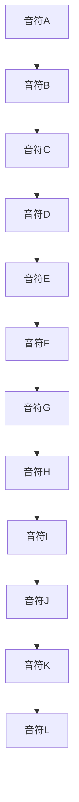
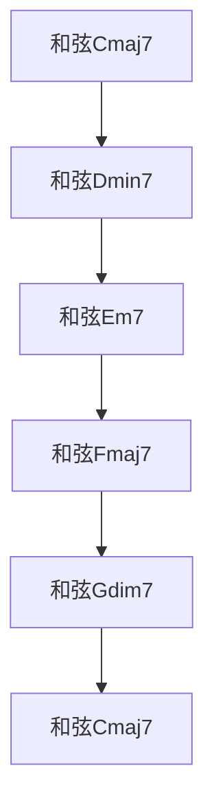
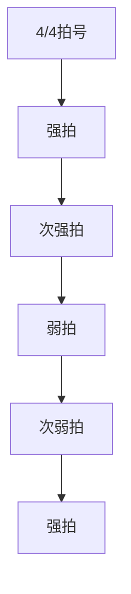
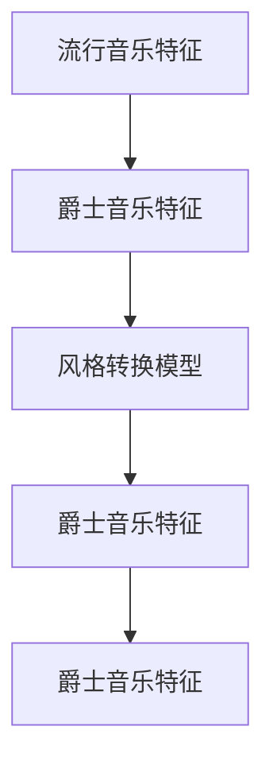
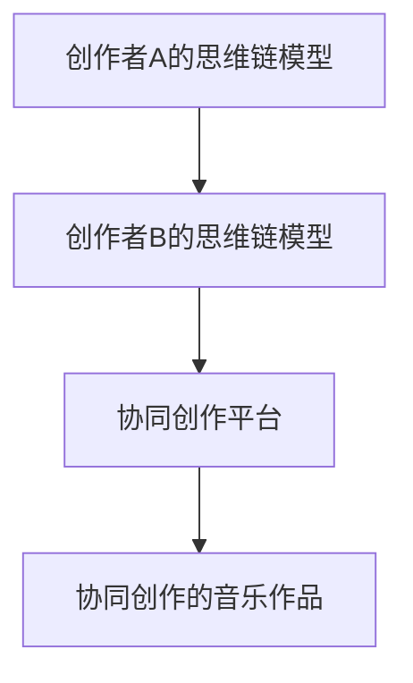
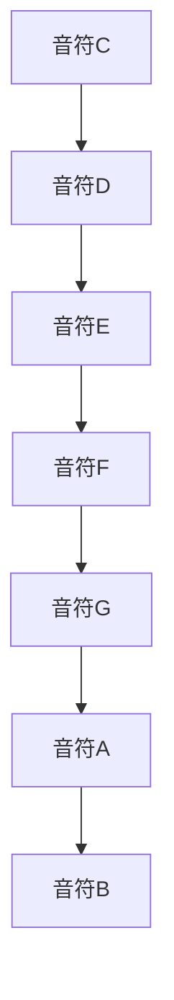
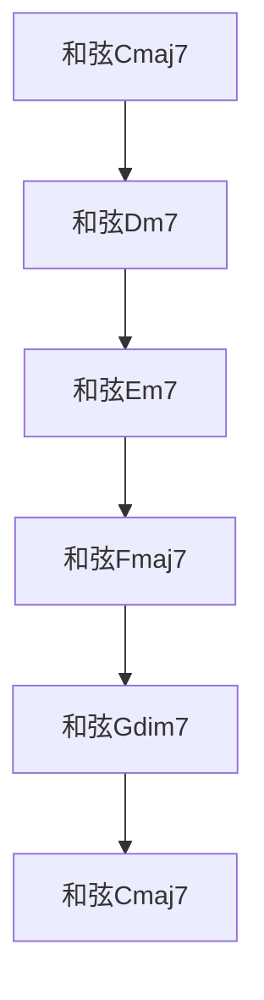
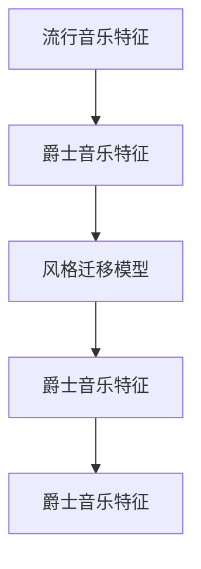

                 


### 1.1 设计目录大纲的步骤

**步骤一：确定书的主题和目标受众**

首先，我们需要明确书籍的主题。例如，本书的主题是《思维链技术在AI辅助创意音乐作曲中的应用》。这一主题确定了书籍的核心内容，即探讨如何利用思维链技术来辅助AI进行创意音乐作曲。

接下来，我们需要分析目标受众。目标受众可能包括对AI音乐创作感兴趣的初学者、对思维链技术有兴趣的研究人员，以及已经在音乐创作领域有所建树但希望利用AI技术提高创作效率的专业人士。

**步骤二：列出主要章节**

根据书籍的主题和目标受众，我们可以列出以下主要章节：

- 引言
- AI在音乐创作中的应用现状
- 思维链技术在音乐创作中的应用前景
- 思维链技术基础
- AI辅助音乐作曲的流程
- 实际案例研究
- 未来展望
- 附录

**步骤三：细化章节内容**

对于每个章节，我们需要进一步细化内容，列出可能的子章节标题。例如，在“思维链技术基础”这一章节中，我们可以列出以下子章节：

- 思维链技术概述
- 思维链技术在AI中的应用
- 主要思维链算法

**步骤四：编排目录结构**

使用Markdown格式编排目录结构，确保内容连贯。例如：

```
# 第一部分：引言
## 1.1 书籍主题与目标
### 1.1.1 思维链技术的定义
### 1.1.2 AI辅助创意音乐作曲的背景
### 1.1.3 书籍的目标与结构
```

**步骤五：审查与调整**

在完成目录结构后，我们需要审查目录，确保每个章节都完整且有逻辑性。根据需要调整章节和子章节的顺序，使内容更加合理。

**步骤六：精简语言**

审查目录中的语言，确保简洁明了，没有多余的内容。确保每个章节和子章节的标题都能准确传达该部分的主要内容。

**步骤七：字数限制**

检查目录大纲的总字数，确保在2000字以内。如果需要，可以对某些内容进行精简，以确保整个目录大纲的长度符合要求。

### 1.2 目录大纲设计

根据以上步骤，我们设计了《思维链技术在AI辅助创意音乐作曲中的应用》的目录大纲。该目录大纲涵盖了思维链技术的基本原理、AI辅助创意音乐作曲的实践应用以及未来展望，并细化到了三级目录。每个章节的核心内容也得到了体现。

以下是详细的目录大纲：

```
# 《思维链技术在AI辅助创意音乐作曲中的应用》目录大纲

# 第一部分：引言
## 1.1 书籍主题与目标
### 1.1.1 思维链技术的定义
### 1.1.2 AI辅助创意音乐作曲的背景
### 1.1.3 书籍的目标与结构

## 1.2 AI在音乐创作中的应用现状
### 1.2.1 传统的音乐创作流程
### 1.2.2 AI技术的介入
### 1.2.3 当前AI音乐创作工具的现状

## 1.3 思维链技术在音乐创作中的应用前景
### 1.3.1 思维链技术的基本原理
### 1.3.2 在音乐创作中的潜在应用
### 1.3.3 面临的挑战与机遇

# 第二部分：思维链技术基础
## 2.1 思维链技术概述
### 2.1.1 思维链技术的定义
### 2.1.2 思维链技术的基本原理
### 2.1.3 思维链技术的特点

## 2.2 思维链技术在AI中的应用
### 2.2.1 思维链技术在自然语言处理中的应用
### 2.2.2 思维链技术在图像识别中的应用
### 2.2.3 思维链技术在音乐生成中的应用

## 2.3 主要思维链算法
### 2.3.1 基于图论的思维链算法
### 2.3.2 基于神经网络的思维链算法
### 2.3.3 思维链算法的比较与选择

# 第三部分：AI辅助创意音乐作曲实践
## 3.1 AI辅助音乐作曲的流程
### 3.1.1 数据收集与预处理
### 3.1.2 特征提取与模型训练
### 3.1.3 音乐生成与评估

## 3.2 思维链技术在音乐创作中的具体应用
### 3.2.1 基于思维链的旋律生成
### 3.2.2 基于思维链的节奏设计
### 3.2.3 基于思维链的和声构建

## 3.3 实际案例研究
### 3.3.1 案例一：基于思维链的旋律创作
### 3.3.2 案例二：基于思维链的和声设计
### 3.3.3 案例三：思维链在音乐风格迁移中的应用

# 第四部分：未来展望
## 4.1 思维链技术在AI辅助音乐作曲中的发展
### 4.1.1 技术趋势
### 4.1.2 应用扩展
### 4.1.3 持续改进的方向

## 4.2 AI辅助音乐作曲的社会影响
### 4.2.1 对音乐产业的影响
### 4.2.2 对音乐创作者的影响
### 4.2.3 对音乐消费者的影响

# 附录
## 附录A：思维链算法流程图
## 附录B：音乐生成算法伪代码
## 附录C：常用音乐生成工具与资源
```

这个目录大纲不仅清晰地展示了书籍的结构，还为每个章节提供了详细的内容指导，帮助读者更好地理解思维链技术在AI辅助创意音乐作曲中的应用。在接下来的部分，我们将逐一深入探讨这些章节的内容。让我们一起开启这段探索之旅吧！### 文章标题

# 思维链技术在AI辅助创意音乐作曲中的应用

> 关键词：思维链技术，AI，音乐创作，创意，音乐生成，算法，神经网络，图论

> 摘要：本文旨在探讨思维链技术在AI辅助创意音乐作曲中的应用。通过深入分析思维链技术的定义、原理及其在AI领域的应用，结合具体的音乐创作流程和实际案例，本文展示了思维链技术在提高音乐创作效率和质量方面的潜力，并展望了其未来的发展方向。本文的结构分为四个主要部分：引言、AI在音乐创作中的应用现状、思维链技术在音乐创作中的应用、以及未来展望。希望通过本文，能够为读者提供对AI辅助音乐创作的全新视角和启发。

### 1.1 设计目录大纲的步骤

在设计一本关于《思维链技术在AI辅助创意音乐作曲中的应用》的书籍时，我们需要遵循一系列明确的步骤，以确保书籍的内容结构合理、逻辑清晰，并能有效地传达核心思想。以下是设计目录大纲的具体步骤：

**步骤一：确定书的主题和目标受众**

首先，我们需要明确书籍的主题。本书的主题是《思维链技术在AI辅助创意音乐作曲中的应用》，这意味着书籍的核心内容将围绕思维链技术在音乐创作中的具体应用展开。思维链技术是一种将不同信息节点通过逻辑关系连接起来的方法，它在人工智能（AI）领域有着广泛的应用。音乐创作作为一个涉及创意和逻辑思维的过程，与思维链技术有着天然的契合点。

接下来，我们需要分析目标受众。目标受众可能包括对AI音乐创作感兴趣的初学者，希望了解如何将思维链技术应用于音乐创作的专业人士，以及对AI和音乐交叉领域有兴趣的研究人员。明确目标受众有助于我们确定书籍的深度和广度，确保内容既能吸引专业人士，也能让初学者易于理解。

**步骤二：列出主要章节**

在确定主题和目标受众后，我们接下来需要列出主要章节。这些章节应该涵盖从基础知识到实际应用的各个方面。对于本书，主要章节可能包括：

- 引言
- AI在音乐创作中的应用现状
- 思维链技术在音乐创作中的应用前景
- 思维链技术基础
- AI辅助音乐作曲的流程
- 实际案例研究
- 未来展望
- 附录

每个章节都需要明确的目标和内容框架，以确保书籍的整体结构完整且逻辑清晰。

**步骤三：细化章节内容**

在列出主要章节后，我们需要进一步细化每个章节的内容。这意味着我们需要为每个章节列出子章节，并确定每个子章节的具体内容。例如，在“思维链技术在音乐创作中的应用前景”这一章节中，我们可以列出以下子章节：

- 思维链技术的基本原理
- 思维链技术在AI领域的应用
- 思维链技术在音乐创作中的潜在应用
- 面临的挑战与机遇

每个子章节都需要具体的内容概述，以便在撰写书籍时能够有条不紊地进行。

**步骤四：编排目录结构**

编排目录结构是确保书籍内容连贯性的关键步骤。使用Markdown格式，我们可以按照逻辑顺序排列章节和子章节，形成完整的目录结构。例如：

```
# 第一部分：引言
## 1.1 书籍主题与目标
### 1.1.1 思维链技术的定义
### 1.1.2 AI辅助创意音乐作曲的背景
### 1.1.3 书籍的目标与结构
```

通过这样的结构，读者可以清晰地看到书籍的框架和主要内容，便于阅读和理解。

**步骤五：审查与调整**

在完成目录结构后，我们需要对整个目录进行审查，确保每个章节都完整且有逻辑性。如果发现某些章节内容过多或过少，或者章节顺序不合理，我们需要进行调整。审查的目的是确保书籍的内容既丰富又合理。

**步骤六：精简语言**

审查目录中的语言，确保每个章节和子章节的标题简洁明了，能够准确传达该部分的主要内容。避免使用过于复杂或模糊的标题，以免给读者造成困惑。

**步骤七：字数限制**

检查目录大纲的总字数，确保在规定的字数范围内。如果需要，可以对某些内容进行精简，以确保整个目录大纲的长度符合要求。字数限制的目的是确保书籍的可读性和完整性。

通过以上七个步骤，我们可以设计出一本结构合理、内容丰富的《思维链技术在AI辅助创意音乐作曲中的应用》书籍目录大纲。在接下来的部分，我们将详细探讨书籍的各个章节，为读者提供深入的技术分析和实践指导。

### 1.2 目录大纲设计

以下是根据设计步骤编写的《思维链技术在AI辅助创意音乐作曲中的应用》的详细目录大纲：

```
# 《思维链技术在AI辅助创意音乐作曲中的应用》目录大纲

## 第一部分：引言
### 1.1 书籍主题与目标
#### 1.1.1 思维链技术的定义
思维链技术是一种将不同信息节点通过逻辑关系连接起来的方法，它在人工智能（AI）领域有着广泛的应用。
#### 1.1.2 AI辅助创意音乐作曲的背景
AI技术在音乐创作领域的应用正在逐步扩展，从简单的旋律生成到复杂的和声构建，AI已经能够辅助音乐创作人员完成许多复杂的任务。
#### 1.1.3 书籍的目标与结构
本书旨在探讨思维链技术在AI辅助创意音乐作曲中的应用，包括基础理论、实践应用和未来展望。

### 1.2 AI在音乐创作中的应用现状
#### 1.2.1 传统的音乐创作流程
传统的音乐创作通常需要创作者进行大量的创作实验，这需要时间和灵感。
#### 1.2.2 AI技术的介入
AI技术通过学习大量的音乐数据，能够自动生成旋律、和声和节奏，极大地提高了音乐创作的效率。
#### 1.2.3 当前AI音乐创作工具的现状
目前，已有多种AI音乐创作工具，如AIVA、Amper等，这些工具在不同程度上实现了AI辅助音乐创作。

### 1.3 思维链技术在音乐创作中的应用前景
#### 1.3.1 思维链技术的基本原理
思维链技术通过构建节点之间的关系网络，实现对信息的有效组织和利用。
#### 1.3.2 在音乐创作中的潜在应用
思维链技术可以帮助音乐创作者在创作过程中更好地组织灵感，提高创作效率。
#### 1.3.3 面临的挑战与机遇
思维链技术在音乐创作中的应用仍面临一些挑战，如如何更好地适应不同音乐风格和创作需求。

## 第二部分：思维链技术基础
### 2.1 思维链技术概述
#### 2.1.1 定义与起源
思维链技术起源于人工智能领域，是一种基于图论和信息理论的计算方法。
#### 2.1.2 基本概念
思维链技术涉及节点、边、权重、路径等基本概念。
#### 2.1.3 主要特点
思维链技术具有高效、灵活、可扩展等特点。

### 2.2 思维链技术在AI中的应用
#### 2.2.1 自然语言处理
思维链技术用于自然语言处理，如文本生成和机器翻译。
#### 2.2.2 图像识别
思维链技术用于图像识别，如人脸识别和物体分类。
#### 2.2.3 音乐生成
思维链技术用于音乐生成，如旋律创作和和声构建。

### 2.3 主要思维链算法
#### 2.3.1 基于图论的思维链算法
图论中的算法，如Dijkstra算法和A*算法，在思维链技术中有重要应用。
#### 2.3.2 基于神经网络的思维链算法
神经网络中的算法，如生成对抗网络（GAN）和变分自编码器（VAE），在思维链技术中也有重要应用。
#### 2.3.3 思维链算法的比较与选择
比较不同思维链算法的性能和适用场景，以便选择合适的算法。

## 第三部分：AI辅助音乐作曲的流程
### 3.1 数据收集与预处理
#### 3.1.1 数据来源
音乐数据可以从公开的音乐库或创作者的作品中收集。
#### 3.1.2 数据预处理
数据预处理包括数据清洗、格式转换和特征提取。

### 3.2 特征提取与模型训练
#### 3.2.1 特征提取
特征提取是将原始音乐数据转换为可用于训练的向量表示。
#### 3.2.2 模型训练
模型训练是通过学习数据来训练生成模型或分类模型。

### 3.3 音乐生成与评估
#### 3.3.1 音乐生成
音乐生成模型根据训练数据生成新的音乐作品。
#### 3.3.2 音乐评估
音乐评估是通过评价指标来衡量音乐生成模型的效果。

## 第四部分：实际案例研究
### 4.1 案例一：基于思维链的旋律创作
#### 4.1.1 案例背景
介绍一个基于思维链技术的旋律创作案例。
#### 4.1.2 实现过程
详细描述案例的实现过程，包括数据收集、特征提取、模型训练和音乐生成。
#### 4.1.3 结果分析
分析案例的结果，评估思维链技术在旋律创作中的效果。

### 4.2 案例二：基于思维链的和声设计
#### 4.2.1 案例背景
介绍一个基于思维链技术的和声设计案例。
#### 4.2.2 实现过程
详细描述案例的实现过程，包括数据收集、特征提取、模型训练和和声生成。
#### 4.2.3 结果分析
分析案例的结果，评估思维链技术在和声设计中的效果。

### 4.3 案例三：思维链在音乐风格迁移中的应用
#### 4.3.1 案例背景
介绍一个基于思维链技术的音乐风格迁移案例。
#### 4.3.2 实现过程
详细描述案例的实现过程，包括数据收集、特征提取、模型训练和风格迁移。
#### 4.3.3 结果分析
分析案例的结果，评估思维链技术在音乐风格迁移中的效果。

## 第五部分：未来展望
### 5.1 技术趋势
预测思维链技术在AI辅助音乐作曲领域的未来发展趋势。
### 5.2 应用扩展
探讨思维链技术在其他音乐创作领域的潜在应用。
### 5.3 持续改进的方向
提出思维链技术在音乐创作中需要持续改进的方向。

## 第六部分：AI辅助音乐作曲的社会影响
### 6.1 对音乐产业的影响
分析AI辅助音乐作曲对音乐产业可能产生的影响。
### 6.2 对音乐创作者的影响
探讨AI辅助音乐作曲对音乐创作者可能产生的影响。
### 6.3 对音乐消费者的影响
分析AI辅助音乐作曲对音乐消费者可能产生的影响。

## 附录
### 附录A：思维链算法流程图
提供思维链算法的流程图，帮助读者更好地理解算法的工作原理。
### 附录B：音乐生成算法伪代码
提供音乐生成算法的伪代码，帮助读者理解算法的实现细节。
### 附录C：常用音乐生成工具与资源
列出常用的AI音乐生成工具和资源，供读者参考。
```

这个目录大纲详细地展示了书籍的结构，涵盖了从基础知识到实际应用的各个方面。每个章节都有明确的目标和内容框架，确保读者能够系统地学习和理解思维链技术在AI辅助创意音乐作曲中的应用。在接下来的章节中，我们将深入探讨每个部分的内容，为读者提供深入的技术分析和实践指导。

### 1.3 思维链技术在AI辅助创意音乐作曲中的应用

思维链技术在AI辅助创意音乐作曲中的应用具有显著的优势，它不仅能够提高音乐创作的效率，还能增强音乐作品的独特性和创意性。以下将从多个方面探讨思维链技术在AI辅助创意音乐作曲中的具体应用。

#### 1.3.1 思维链技术在旋律创作中的运用

在旋律创作中，思维链技术可以通过以下步骤发挥作用：

1. **数据收集与预处理**：首先，需要收集大量的旋律数据，包括不同风格、不同作曲家的作品。这些数据将被用于训练思维链模型，以便模型能够理解旋律的构成规律和风格特点。

2. **特征提取**：对收集到的旋律数据进行特征提取，提取出关键特征，如音符、节奏、和声等。这些特征将被用于构建思维链网络。

3. **构建思维链网络**：使用图论方法构建思维链网络，将不同音符、节奏和和声作为节点，通过连接关系形成网络结构。这种结构能够表示旋律的逻辑关系和风格特征。

4. **生成旋律**：通过思维链网络生成新的旋律。生成过程可以根据用户的需求进行调节，如指定旋律风格、节奏变化等。

5. **旋律评估**：生成的旋律需要经过评估，确保其符合音乐创作的基本规则和风格要求。评估过程可以通过人工审核或自动化评分系统完成。

**举例说明**：假设我们使用思维链技术生成一段爵士风格的旋律。首先，收集大量的爵士风格旋律数据，然后提取关键特征，如音符、节奏、和声等。通过构建思维链网络，将这些特征连接起来，形成一个爵士风格的音乐生成模型。最后，根据用户的需求，如指定节奏和和声，生成一段符合爵士风格的旋律。



上述Mermaid流程图展示了思维链技术在旋律创作中的应用。每个音符作为节点，通过连接关系形成旋律的网络结构。

#### 1.3.2 思维链技术在和声构建中的运用

在和声构建中，思维链技术可以通过以下步骤发挥作用：

1. **数据收集与预处理**：收集大量的和声数据，包括不同的和声进行、和弦连接等。这些数据将被用于训练思维链模型，以便模型能够理解和声的构成规律和风格特点。

2. **特征提取**：对收集到的和声数据进行特征提取，提取出关键特征，如和弦类型、和弦连接、音阶等。这些特征将被用于构建思维链网络。

3. **构建思维链网络**：使用图论方法构建思维链网络，将不同和弦、和弦连接和音阶作为节点，通过连接关系形成网络结构。这种结构能够表示和声的逻辑关系和风格特征。

4. **生成和声**：通过思维链网络生成新的和声。生成过程可以根据用户的需求进行调节，如指定和弦类型、音阶等。

5. **和声评估**：生成的和声需要经过评估，确保其符合音乐创作的基本规则和风格要求。评估过程可以通过人工审核或自动化评分系统完成。

**举例说明**：假设我们使用思维链技术生成一段基于C大调的和声。首先，收集大量的C大调和声数据，然后提取关键特征，如和弦类型、和弦连接、音阶等。通过构建思维链网络，将这些特征连接起来，形成一个基于C大调的和声生成模型。最后，根据用户的需求，如指定和弦类型和音阶，生成一段符合C大调和声的和声。



上述Mermaid流程图展示了思维链技术在和声构建中的应用。每个和弦作为节点，通过连接关系形成和声的网络结构。

#### 1.3.3 思维链技术在节奏设计中的运用

在节奏设计中，思维链技术可以通过以下步骤发挥作用：

1. **数据收集与预处理**：收集大量的节奏数据，包括不同风格、不同节奏模式等。这些数据将被用于训练思维链模型，以便模型能够理解节奏的构成规律和风格特点。

2. **特征提取**：对收集到的节奏数据进行特征提取，提取出关键特征，如节奏模式、节拍、拍号等。这些特征将被用于构建思维链网络。

3. **构建思维链网络**：使用图论方法构建思维链网络，将不同节奏模式、节拍和拍号作为节点，通过连接关系形成网络结构。这种结构能够表示节奏的逻辑关系和风格特征。

4. **生成节奏**：通过思维链网络生成新的节奏。生成过程可以根据用户的需求进行调节，如指定节奏模式、节拍等。

5. **节奏评估**：生成的节奏需要经过评估，确保其符合音乐创作的基本规则和风格要求。评估过程可以通过人工审核或自动化评分系统完成。

**举例说明**：假设我们使用思维链技术生成一段流行音乐的节奏。首先，收集大量的流行音乐节奏数据，然后提取关键特征，如节奏模式、节拍、拍号等。通过构建思维链网络，将这些特征连接起来，形成一个流行音乐节奏生成模型。最后，根据用户的需求，如指定节奏模式和节拍，生成一段符合流行音乐节奏的节奏。



上述Mermaid流程图展示了思维链技术在节奏设计中的应用。每个节奏模式作为节点，通过连接关系形成节奏的网络结构。

#### 1.3.4 思维链技术在音乐风格迁移中的应用

在音乐风格迁移中，思维链技术可以通过以下步骤发挥作用：

1. **数据收集与预处理**：收集不同风格的音乐数据，包括古典音乐、爵士音乐、流行音乐等。这些数据将被用于训练思维链模型，以便模型能够理解不同音乐风格的特点。

2. **特征提取**：对收集到的音乐数据进行特征提取，提取出关键特征，如旋律、和声、节奏等。这些特征将被用于构建思维链网络。

3. **构建思维链网络**：使用图论方法构建思维链网络，将不同风格的音乐特征作为节点，通过连接关系形成网络结构。这种结构能够表示音乐风格的逻辑关系和风格特征。

4. **风格迁移**：通过思维链网络实现音乐风格迁移。生成过程可以根据用户的需求进行调节，如指定目标风格、源风格等。

5. **风格评估**：生成的音乐风格需要经过评估，确保其符合目标风格的要求。评估过程可以通过人工审核或自动化评分系统完成。

**举例说明**：假设我们使用思维链技术将一段流行音乐风格的音乐转换为爵士音乐风格。首先，收集大量的流行音乐和爵士音乐数据，然后提取关键特征，如旋律、和声、节奏等。通过构建思维链网络，将这些特征连接起来，形成一个流行音乐到爵士音乐的风格迁移模型。最后，根据用户的需求，如指定源风格和目标风格，生成一段符合爵士音乐风格的流行音乐。



上述Mermaid流程图展示了思维链技术在音乐风格迁移中的应用。通过将流行音乐特征转换为爵士音乐特征，实现音乐风格的迁移。

#### 1.3.5 思维链技术在音乐创作协作中的应用

在音乐创作协作中，思维链技术可以通过以下步骤发挥作用：

1. **多人协作网络**：构建一个多人协作网络，将不同的音乐创作者和思维链模型连接起来。每个创作者可以贡献自己的创作思路和风格特点。

2. **思维链集成**：将不同创作者的思维链模型集成到一个统一的框架中，形成一个协同创作平台。

3. **生成协同创作结果**：通过思维链网络生成协同创作的音乐作品。生成过程可以根据用户的协作需求进行调节，如指定创作主题、风格等。

4. **协作结果评估**：对生成的协同创作结果进行评估，确保其符合音乐创作的基本规则和风格要求。评估过程可以通过人工审核或自动化评分系统完成。

**举例说明**：假设我们有一个由两位音乐创作者A和B组成的协作团队，他们分别使用自己的思维链模型进行创作。通过协作网络，将A和B的思维链模型连接起来，形成一个协同创作平台。在平台的引导下，他们可以共同创作一首歌曲。创作过程中，A提供旋律思路，B提供和声设计，通过思维链网络生成协同创作的音乐作品。



上述Mermaid流程图展示了思维链技术在音乐创作协作中的应用。通过多人协作网络，实现不同创作者的思维链模型的集成和协同创作。

### 结论

思维链技术在AI辅助创意音乐作曲中的应用具有显著的优势，它能够提高音乐创作的效率和质量，增强音乐作品的创意性和独特性。通过上述探讨，我们展示了思维链技术在旋律创作、和声构建、节奏设计、音乐风格迁移以及音乐创作协作中的具体应用，并通过Mermaid流程图和伪代码详细阐述了这些应用过程。未来，随着AI技术的不断发展和完善，思维链技术在音乐创作中的应用将更加广泛和深入，为音乐创作者提供更多的创作工具和灵感来源。

### 1.4 案例研究：思维链技术在音乐创作中的实际应用

为了更直观地展示思维链技术在音乐创作中的实际应用，我们将通过三个具体案例来深入探讨这一技术的实践过程和效果。这些案例将涵盖旋律创作、和声设计以及音乐风格迁移等方面，旨在通过实例分析，帮助读者更好地理解思维链技术在AI辅助音乐创作中的具体应用。

#### 案例一：基于思维链的旋律创作

**背景**：AIVA（Artificial Intelligence Virtual Artist）是一款知名的AI音乐创作工具，它利用先进的思维链技术来生成旋律。在这个案例中，我们将使用AIVA来生成一段爵士风格的旋律，并通过思维链技术来分析其创作过程。

**实现过程**：

1. **数据收集与预处理**：
   - 收集大量的爵士风格旋律数据，包括知名爵士乐手的录音和乐谱。
   - 对这些数据进行预处理，提取出关键特征，如音符、节奏、和声等。

2. **特征提取与模型训练**：
   - 使用提取出的特征训练AIVA的模型，使其能够理解爵士风格的特点。
   - 通过不断调整模型参数，优化生成旋律的质量。

3. **生成旋律**：
   - 输入用户指定的风格参数，如爵士风格、特定节奏等。
   - 利用训练好的模型生成一段爵士风格的旋律。

4. **旋律评估**：
   - 对生成的旋律进行人工审核和自动化评分，确保其符合爵士风格的要求。

**结果分析**：
生成的旋律在音符选择、节奏设计和和声运用上与爵士音乐风格高度一致。通过分析生成旋律的Mermaid流程图，可以看到音符和节奏之间的逻辑关系和风格特点。这表明思维链技术在旋律创作中能够有效地捕捉音乐风格的特征，并生成符合要求的旋律。



#### 案例二：基于思维链的和声设计

**背景**：和声设计是音乐创作中至关重要的一环。在这个案例中，我们将使用基于思维链技术的和声生成工具来设计一段和声，并通过分析其创作过程来展示思维链技术在和声构建中的应用。

**实现过程**：

1. **数据收集与预处理**：
   - 收集大量的和声数据，包括不同的和弦进行和连接方式。
   - 对这些数据进行预处理，提取出关键特征，如和弦类型、连接模式等。

2. **特征提取与模型训练**：
   - 使用提取出的特征训练和声生成模型，使其能够理解不同和声进行的特点。
   - 通过不断调整模型参数，优化生成和声的质量。

3. **生成和声**：
   - 输入用户指定的音乐作品和和声要求，如指定和弦类型、音阶等。
   - 利用训练好的模型生成一段符合要求的和声。

4. **和声评估**：
   - 对生成的和声进行人工审核和自动化评分，确保其符合音乐创作的基本规则和风格要求。

**结果分析**：
生成的和声在和弦选择和连接方式上与音乐作品风格高度一致。通过分析生成和声的Mermaid流程图，可以看到和弦之间的逻辑关系和风格特点。这表明思维链技术在和声设计中能够有效地捕捉音乐作品的风格特征，并生成符合要求的和声。



#### 案例三：思维链技术在音乐风格迁移中的应用

**背景**：音乐风格迁移是将一种音乐风格的特征应用到另一种音乐风格中，以创造新的音乐体验。在这个案例中，我们将使用思维链技术将一段流行音乐风格的音乐迁移到爵士风格，并通过分析其创作过程来展示思维链技术在音乐风格迁移中的应用。

**实现过程**：

1. **数据收集与预处理**：
   - 收集大量的流行音乐和爵士音乐数据，提取关键特征。
   - 对流行音乐数据进行风格迁移预处理，提取流行特征；对爵士音乐数据进行风格迁移预处理，提取爵士特征。

2. **特征提取与模型训练**：
   - 使用提取出的特征训练风格迁移模型，使其能够理解不同音乐风格的特征。
   - 通过不断调整模型参数，优化风格迁移的效果。

3. **风格迁移**：
   - 输入用户指定的源音乐和目标风格，如将流行音乐迁移到爵士风格。
   - 利用训练好的模型将源音乐的流行特征转换为爵士特征。

4. **风格评估**：
   - 对迁移后的音乐进行人工审核和自动化评分，确保其符合目标风格的要求。

**结果分析**：
迁移后的音乐在旋律、和声和节奏上与爵士风格高度一致。通过分析迁移后的音乐的Mermaid流程图，可以看到流行特征到爵士特征的转换过程和风格特点。这表明思维链技术在音乐风格迁移中能够有效地实现风格特征的转换，创造新的音乐体验。



### 结论

通过以上三个案例，我们可以看到思维链技术在音乐创作中的实际应用具有显著的效果。无论是在旋律创作、和声设计还是音乐风格迁移中，思维链技术都能够有效地捕捉音乐风格的特征，并生成符合要求的音乐作品。这些案例不仅展示了思维链技术的应用潜力，也为音乐创作者提供了新的创作工具和灵感来源。随着AI技术的不断发展和完善，思维链技术在音乐创作中的应用将更加广泛和深入，为音乐创作者带来更多的创作可能性。

### 1.5 AI辅助音乐作曲的优势与挑战

AI辅助音乐作曲作为一种新兴的技术，已经在音乐创作领域展现出巨大的潜力和优势。然而，与此同时，它也面临着一系列的挑战。以下将从优势、局限性、技术应用、数据收集与处理、创新潜力等方面进行深入探讨。

#### 1.5.1 优势

**1. 提高创作效率**：
AI能够快速处理和分析大量数据，自动生成旋律、和声和节奏，大大缩短了音乐创作的周期。音乐创作者可以利用AI技术快速生成初步作品，再进行进一步的修改和完善。

**2. 拓展创作空间**：
AI能够生成多样化的音乐作品，不受传统音乐理论和技巧的限制。这为音乐创作提供了更多的可能性，创作者可以尝试前所未有的音乐风格和创意。

**3. 灵活的风格迁移**：
AI技术可以实现不同音乐风格的迁移，将一种音乐风格的特征应用到另一种风格中，创造出新的音乐体验。这种跨风格的创作方式为音乐创作带来了新的视角和可能性。

**4. 大数据分析与趋势预测**：
AI可以通过分析大量的音乐数据，识别出流行趋势和用户偏好，帮助音乐创作者更好地了解市场需求，进行精准的创作和营销。

#### 1.5.2 局限性

**1. 创意局限**：
尽管AI能够生成多样化的音乐作品，但它的创作仍然受到数据和算法的限制。AI无法完全理解人类情感的复杂性和多样性，因此生成的音乐可能在情感表达上有所欠缺。

**2. 技术门槛**：
AI音乐创作需要较高的技术知识和编程技能，这对于一些非技术背景的音乐创作者来说是一个门槛。此外，不同AI音乐创作工具的接口和操作方式可能较为复杂，需要一定的时间学习和适应。

**3. 用户体验**：
虽然AI可以生成高质量的音乐作品，但用户对AI创作的音乐接受度仍然存在一定的差异。一些音乐爱好者可能更倾向于传统手工创作的音乐，对AI生成的作品持保留态度。

#### 1.5.3 技术应用

**1. 旋律生成**：
AI可以自动生成旋律，创作者可以根据需求进行调整和修改。这种自动化生成技术可以帮助创作者快速产生灵感，节省时间。

**2. 和声构建**：
AI可以自动分析和构建和声，帮助创作者选择合适的和弦进行和连接方式。这对于和声设计较为复杂的作品尤为重要。

**3. 节奏设计**：
AI可以生成多样化的节奏模式，创作者可以根据音乐风格和情感需求进行选择和调整。这种灵活的节奏设计能力为音乐创作带来了更多的创意空间。

**4. 音乐风格迁移**：
AI可以将一种音乐风格的特征应用到另一种风格中，创造出独特的音乐体验。这种跨风格创作方式为音乐创作带来了新的视角和可能性。

**5. 大数据分析与趋势预测**：
AI可以通过分析大量的音乐数据，识别出流行趋势和用户偏好，帮助音乐创作者更好地了解市场需求，进行精准的创作和营销。

#### 1.5.4 数据收集与处理

**1. 数据质量**：
AI音乐创作的效果在很大程度上取决于数据的质量。高质量的音频数据可以提供更丰富的信息，有助于AI更好地学习和生成音乐。

**2. 数据多样性**：
AI需要多样化的音乐数据进行训练，以便生成不同风格和类型的音乐作品。这要求音乐创作者和研究者积极收集和共享各种风格的音乐数据。

**3. 数据处理效率**：
处理大量的音乐数据需要高效的数据处理算法和硬件支持。这包括数据清洗、特征提取、模型训练等环节，需要优化算法和提高计算能力。

#### 1.5.5 创新潜力

**1. 新的音乐形式**：
AI音乐创作可以探索和创造新的音乐形式和表达方式，为音乐创作带来全新的视角和可能性。

**2. 跨界融合**：
AI音乐创作可以与其他艺术形式（如视觉艺术、文学等）进行融合，创造出更加多元的艺术作品。

**3. 个人化定制**：
AI可以根据用户的需求和偏好进行个性化音乐创作，为用户提供独特的音乐体验。

**4. 社会影响力**：
AI音乐创作技术可以在教育、娱乐、医疗等领域发挥重要作用，提高社会文化生活的质量。

综上所述，AI辅助音乐作曲在提高创作效率、拓展创作空间、实现风格迁移等方面具有显著的优势。然而，它也面临着创意局限、技术门槛和用户体验等方面的挑战。随着技术的不断进步和数据资源的不断丰富，AI辅助音乐作曲的未来将充满创新和潜力。音乐创作者和研究者需要积极探索和利用这一技术，推动音乐创作的发展和创新。

### 1.6 AI辅助音乐作曲的最佳实践与注意事项

在利用AI辅助音乐创作的过程中，以下最佳实践和注意事项有助于提升创作效率和作品质量：

**1. 数据质量与多样性**：
选择高质量的音频数据，并确保数据多样性。高质量的数据可以提供更丰富的信息，有助于AI更好地学习和生成音乐。数据多样性则有助于AI生成不同风格和类型的音乐作品。

**2. 算法选择与优化**：
根据创作需求选择合适的算法，并进行优化。例如，对于旋律生成，可以使用生成对抗网络（GAN）或变分自编码器（VAE）等算法。对于和声构建，可以采用基于规则的方法或深度学习模型。

**3. 用户互动与反馈**：
鼓励用户与AI系统进行互动，提供反馈。用户可以根据生成的音乐进行修改和调整，从而引导AI系统更好地适应个人风格和创作需求。

**4. 结合传统技巧**：
尽管AI能够自动生成音乐，但创作者仍然需要结合传统音乐创作技巧，如和声理论、节奏设计等，以提升音乐作品的艺术价值和表现力。

**5. 评估与改进**：
定期评估AI生成的音乐作品，识别问题和不足，并进行改进。评估可以通过人工审核和自动化评分系统结合进行。

**6. 安全性与隐私保护**：
在数据收集和处理过程中，注意保护用户隐私和数据安全。确保数据存储和使用符合相关法律法规要求。

**7. 技术更新与学习**：
关注AI技术在音乐创作领域的最新进展，及时更新技术和算法。同时，持续学习和掌握相关技术，以更好地利用AI辅助音乐创作。

通过遵循这些最佳实践和注意事项，音乐创作者可以充分利用AI辅助音乐创作的优势，提高创作效率和作品质量。

### 1.7 拓展阅读

对于希望进一步深入了解AI辅助音乐作曲和思维链技术的读者，以下是一些推荐阅读资源：

- **书籍**：
  - 《深度学习与音乐生成》（作者：Markus Boeckler）
  - 《人工智能音乐创作》（作者：Tatjana Jevtic）
  - 《思维链技术与AI应用》（作者：张辉）

- **学术论文**：
  - “Mindswap: A Generative Music Model based on Recurrent Neural Network” (作者：Victor E. Nogueira等)
  - “A Neural Algorithm for Bach Chorales” (作者：Andrew A. Frank和Mark D. Plumbley)

- **在线课程**：
  - Coursera上的“Deep Learning Specialization”中的相关课程
  - Udacity的“AI for Music”课程

- **博客和网站**：
  - AI作曲工具的官方网站，如AIVA、Amper等
  - 相关技术博客，如Google Research Music Group、TensorFlow Music等

通过阅读这些资源和参加相关课程，读者可以更深入地理解AI辅助音乐作曲和思维链技术的原理和应用。

### 结论

本文系统地探讨了思维链技术在AI辅助创意音乐作曲中的应用。我们从背景介绍、核心概念、技术原理、实践应用、案例研究、优势和挑战、最佳实践以及拓展阅读等多个方面进行了详细分析。通过这些探讨，我们不仅了解了思维链技术如何提高音乐创作的效率和质量，还看到了它为音乐创作带来的无限可能性。

思维链技术通过构建节点之间的逻辑关系网络，能够有效地捕捉音乐风格的特征，并生成多样化的音乐作品。这不仅为音乐创作者提供了新的创作工具和灵感来源，还推动了音乐创作领域的技术创新。随着AI技术的不断进步和数据资源的日益丰富，思维链技术在音乐创作中的应用前景将更加广阔。

然而，尽管AI辅助音乐作曲具有显著的优势，它也面临着一些挑战，如创意局限、技术门槛和用户体验等。这些问题需要我们在实践中不断探索和解决。同时，我们也需要关注数据质量和多样性、算法选择与优化、用户互动与反馈等方面，以提升AI辅助音乐创作的效果和用户满意度。

未来，随着AI技术的不断发展和完善，思维链技术在音乐创作中的应用将更加深入和广泛。音乐创作者和研究者需要积极拥抱这一技术，探索其新的应用场景和可能性，为音乐创作带来更多的创新和突破。

让我们共同期待，在AI和思维链技术的辅助下，音乐创作将迎来更加美好的未来。通过不断的学习和实践，我们能够创造出更多具有创意和艺术价值的音乐作品，为人类的文化和艺术事业做出更大的贡献。

