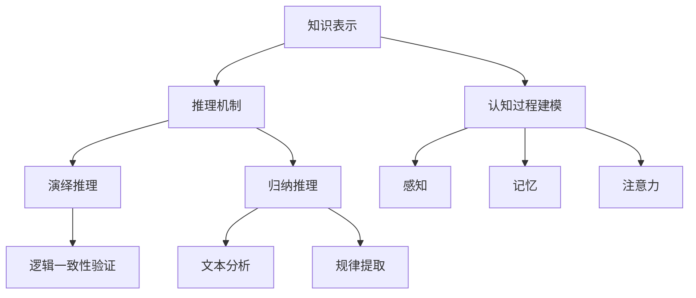

                 

### 引言

在科技迅猛发展的今天，人工智能（AI）技术已经成为推动社会进步的重要力量。从自动驾驶、语音识别到医疗诊断，AI的广泛应用极大地改变了我们的生活方式和工作模式。然而，AI技术的进步不仅限于技术应用层面，其背后的理论基础和算法创新同样值得关注。思维链技术（Mind Chain Technology）便是其中之一，它代表了人工智能在认知建模和复杂问题解决方面的新突破。

思维链技术是一种通过模拟人类思维过程，构建知识网络和推理机制的算法。它基于认知科学的原理，将人类的思维活动分解为一系列可计算和可编程的步骤。通过构建思维链，AI系统能够实现更加复杂和智能的决策过程，从而在许多领域展现出强大的潜力。哲学思辨作为人类智慧的结晶，其深度和广度使得AI辅助成为可能，也为其研究提供了新的视角和方法。

本文旨在探讨思维链技术在AI辅助哲学思辨中的创新应用。首先，我们将介绍思维链技术的基础，包括其起源、核心概念和理论基础。接着，我们将探讨AI辅助哲学思辨的概念和核心算法，分析其在哲学研究中的实际应用。然后，我们将深入讨论思维链技术在哲学研究中的应用，包括哲学文献的自动化分类、哲学思想的可视化分析等。此外，我们还将探讨思维链技术在哲学教学中的应用，以及其在哲学研究中的创新应用。最后，我们将总结全文，指出思维链技术在AI辅助哲学思辨中的潜力与挑战，并展望未来的发展方向。

通过本文的探讨，我们希望读者能够对思维链技术在AI辅助哲学思辨中的创新应用有一个全面而深刻的理解，并能够意识到这一技术在未来哲学研究中的重要价值。

### 文章关键词

- 思维链技术
- AI辅助哲学思辨
- 认知科学
- 人工智能
- 哲学研究
- 知识图谱
- 推理算法
- 可视化分析
- 机器学习
- 哲学教育

### 文章摘要

本文主要探讨了思维链技术在AI辅助哲学思辨中的创新应用。首先，介绍了思维链技术的起源、核心概念和理论基础，阐述了其如何模拟人类思维过程以实现复杂问题的智能解决。其次，分析了AI辅助哲学思辨的概念和核心算法，讨论了其在哲学研究中的实际应用，如哲学文献的自动化分类和哲学思想的可视化分析。随后，本文详细探讨了思维链技术在哲学研究和教学中的创新应用，包括形式化建模和自动推导哲学结论。最后，文章总结了思维链技术在AI辅助哲学思辨中的潜力与挑战，并对未来发展方向进行了展望。通过本文的探讨，读者可以全面理解思维链技术在哲学研究中的价值，并认识到其在推动哲学研究深入发展中的重要作用。

### 背景介绍

思维链技术作为一种新兴的人工智能技术，其起源可以追溯到20世纪90年代。当时，计算机科学家和认知科学家开始关注如何模拟人类的思维过程，以便于开发出能够处理复杂问题的智能系统。思维链技术正是这种探索的产物，它通过构建一个由知识点和推理路径组成的网络，模拟人类从感知到思考再到决策的全过程。这种技术不仅能够处理结构化数据，还能在处理半结构化和非结构化数据时表现出强大的适应性。

思维链技术的基本原理是基于认知科学的模型，即人类思维活动可以被分解为一系列有序的步骤，每个步骤都基于一定的规则和知识。这些规则和知识通过一种称为“思维链”的结构来组织，使得AI系统能够像人类一样进行推理、分析和决策。思维链技术通过以下几种核心概念来实现这一目标：

1. **知识表示**：知识表示是思维链技术的核心，它涉及到如何将人类知识以计算机可以处理的形式进行编码。常用的知识表示方法包括语义网络、本体论和知识图谱等。这些方法通过建立概念之间的关系，使得AI系统能够理解并利用这些知识。

2. **推理机制**：推理机制是思维链技术的关键组成部分，它决定了AI系统如何从已知信息推导出新信息。推理可以分为演绎推理和归纳推理。演绎推理从一般原则推导出特定结论，而归纳推理则从特定实例中推导出一般性规律。思维链技术通常结合这两种推理方式，以实现更加全面和智能的决策过程。

3. **认知过程建模**：认知过程建模是思维链技术的另一个重要方面，它涉及到如何模拟人类认知过程的不同阶段，如感知、记忆、注意力等。通过这些模型，AI系统可以模仿人类的思维过程，从而在处理复杂问题时表现得更加智能和灵活。

思维链技术的这些核心概念和原理，使得它成为人工智能领域的一个重要研究方向。与传统的人工智能技术不同，思维链技术不仅关注算法的优化和计算效率，更强调对人类思维过程的模拟和理解。这种模拟和理解不仅提高了AI系统的智能水平，也为人工智能在复杂问题解决中的应用提供了新的可能性。

例如，在医学诊断中，思维链技术可以通过模拟医生的诊断过程，分析患者的症状和病史，提供更为准确和全面的诊断建议。在商业决策中，思维链技术可以模拟市场分析和商业策略，帮助企业家做出更加明智的决策。在哲学研究中，思维链技术可以辅助哲学家分析复杂的哲学问题，提供新的研究思路和方法。

总之，思维链技术作为一种新兴的人工智能技术，其理论基础和核心概念为AI系统提供了更接近人类思维过程的建模工具。通过这种技术，AI系统不仅能够处理更为复杂的问题，还能够更好地模拟和理解人类的思维活动，从而在多个领域展现出强大的应用潜力。

### 核心概念与联系

思维链技术的核心概念主要包括知识表示、推理机制和认知过程建模。这些概念并非孤立存在，而是相互联系、协同作用，共同构成了思维链技术的理论基础。

首先，知识表示是思维链技术的基石。它涉及到如何将人类知识以计算机可以处理的形式进行编码和存储。知识表示的方法有很多，包括语义网络、本体论和知识图谱等。语义网络通过节点和边来表示概念及其关系，是一种早期的知识表示方法。本体论则通过定义概念和关系的严格语义，提供了一种更加形式化的知识表示方式。知识图谱则结合了语义网络和本体论的特点，通过大规模的图形结构来表示复杂的关系网络。这些知识表示方法不仅使得AI系统能够理解和利用知识，还为后续的推理和认知过程建模提供了基础。

其次，推理机制是思维链技术的核心。它决定了AI系统如何从已知信息推导出新信息。推理可以分为演绎推理和归纳推理。演绎推理从一般原则推导出特定结论，适用于逻辑严密、结构清晰的情境。归纳推理则从特定实例中推导出一般性规律，适用于处理不确定性和复杂性的情境。思维链技术通过结合这两种推理方式，实现了对复杂问题的智能处理。例如，在哲学研究中，AI系统可以通过演绎推理来验证某个哲学命题的逻辑一致性，通过归纳推理来分析大量哲学文本，提取出普遍性规律。

最后，认知过程建模是思维链技术的关键组成部分。它涉及到如何模拟人类认知过程的不同阶段，如感知、记忆、注意力等。认知过程建模通过建立模型来描述这些认知过程，使得AI系统能够模仿人类的思维过程。例如，在感知阶段，AI系统可以通过自然语言处理技术来理解输入的文本或语音；在记忆阶段，AI系统可以通过知识库来存储和检索信息；在注意力阶段，AI系统可以通过算法来识别和关注关键信息。

这些核心概念之间的联系可以通过一个简单的Mermaid流程图来展示：



在这个流程图中，知识表示（A）作为输入，通过推理机制（B）和认知过程建模（C）进行处理和加工，最终输出结果。推理机制（B）又细分为演绎推理（D）和归纳推理（E），分别用于逻辑一致性验证（I）和文本分析（J）、规律提取（K）。认知过程建模（C）则细化为感知（F）、记忆（G）和注意力（H），分别对应人类思维过程中的不同阶段。

通过这样的Mermaid流程图，我们可以清晰地看到思维链技术各个核心概念之间的相互关系。知识表示为整个系统提供了基础数据，推理机制使得系统能够从这些数据中推导出新的信息，而认知过程建模则模拟了人类的思维过程，使得系统能够在复杂情境中表现出类似人类的智能行为。

总之，思维链技术的核心概念与联系不仅为AI系统提供了强大的理论基础，也为其在各个领域的应用提供了广阔的空间。通过这些概念的综合运用，AI系统不仅能够处理复杂的问题，还能够模仿人类的思维过程，从而在哲学思辨、医疗诊断、商业决策等多个领域展现出巨大的潜力。

### 核心算法原理讲解

在思维链技术中，核心算法的设计与实现是至关重要的。这些算法不仅决定了AI系统在处理复杂问题时的效率与准确性，还直接影响其智能水平。以下我们将详细探讨几类核心算法的原理，并使用伪代码来展示其具体实现步骤。

#### 1. 逻辑推理算法

逻辑推理算法是思维链技术中的基础组件，主要用于验证命题的一致性、推导新命题等。其中，推理机（Reasoning Engine）是其核心。推理机通常采用**逆波兰式（Reverse Polish Notation, RPN）**来实现，以便于进行高效的操作。

**伪代码：**

```plaintext
// 伪代码：逻辑推理算法
function reasoning_machine(incoming_proof)
    stack = []
    for each token in incoming_proof:
        if token is an operator:
            operand2 = stack.pop()
            operand1 = stack.pop()
            result = apply_operator(operand1, operand2, token)
            stack.push(result)
        else:
            stack.push(token)
    return stack.pop()
```

**示例：**

假设我们有一个包含以下逻辑表达式的证明：

```
(A ∧ B) ∨ ¬C → D
```

使用逆波兰式表示，则为：

```
A B ∧ C ¬∨ D →
```

**流程：**

1. 将表达式从右向左扫描，逐个处理每个token。
2. 遇到操作数（如A、B、C、D），将其压入栈中。
3. 遇到操作符（如∧、∨、¬），弹出栈顶的两个操作数，应用操作符进行计算，并将结果压回栈中。
4. 最终栈中的元素即为推理结果。

#### 2. 文本分析算法

文本分析算法主要用于从文本数据中提取结构化信息，如实体识别、情感分析、主题建模等。以下是一个简单的文本分析算法的伪代码实现。

**伪代码：**

```plaintext
// 伪代码：文本分析算法
function text_analysis(document)
    tokens = tokenize(document)
    entities = extract_entities(tokens)
    sentiments = analyze_sentiments(tokens)
    topics = topic_modeling(tokens)
    return entities, sentiments, topics
```

**示例：**

假设我们有一个哲学文本：

```
“自由是一个重要的哲学概念，它涉及到个人权利和责任的平衡。”
```

**流程：**

1. 将文本分词，得到一系列词汇（tokens）。
2. 使用命名实体识别（NER）技术提取文本中的关键实体（如“自由”和“哲学”）。
3. 使用情感分析技术分析文本的情感倾向（如正面或负面）。
4. 使用主题建模技术（如LDA）提取文本的主题。

#### 3. 情感分析算法

情感分析算法是文本分析中的一个重要分支，它通过分析文本中的情感倾向，帮助用户理解文本的情感色彩。以下是一个简单的情感分析算法的伪代码实现。

**伪代码：**

```plaintext
// 伪代码：情感分析算法
function sentiment_analysis(document)
    tokens = tokenize(document)
    sentiment_scores = []
    for each token in tokens:
        sentiment_score = get_sentiment_score(token)
        sentiment_scores.append(sentiment_score)
    average_score = sum(sentiment_scores) / len(sentiment_scores)
    if average_score > 0:
        return "Positive"
    else if average_score < 0:
        return "Negative"
    else:
        return "Neutral"
```

**示例：**

假设我们有一个包含以下文本的文档：

```
“这本书非常有趣，但有时候内容有点复杂。”
```

**流程：**

1. 分词得到所有词汇。
2. 为每个词汇计算情感得分。
3. 计算所有词汇情感得分的平均值。
4. 根据平均得分判断文本的情感倾向。

通过上述伪代码示例，我们可以看到思维链技术中的核心算法是如何实现其功能的。这些算法不仅能够有效地处理复杂问题，还为AI系统提供了强大的推理和分析能力，从而在哲学思辨、文本分析等领域展现了广阔的应用前景。

### 数学模型和公式

在思维链技术中，数学模型和公式扮演着至关重要的角色，它们不仅帮助定义和计算AI系统的参数，还为推理过程提供了理论基础。以下将详细介绍思维链技术中涉及的一些关键数学模型和公式，并通过具体的例子进行详细讲解。

#### 1. 神经网络模型

神经网络（Neural Networks）是思维链技术中的一个核心组件，它们通过模拟人脑神经网络的结构和工作方式，实现对复杂问题的建模和推理。以下是一个简化的神经网络模型：

**公式：**

$$
y = \sigma(\omega_1 \cdot x_1 + \omega_2 \cdot x_2 + b)
$$

其中，$y$ 是输出值，$\sigma$ 是激活函数，$\omega_1, \omega_2$ 是权重，$x_1, x_2$ 是输入值，$b$ 是偏置项。

**示例：**

假设我们有一个简单的神经网络模型，用于分类哲学文本。输入值是文本的词频向量，输出值是哲学流派的概率分布。我们使用以下参数：

- 激活函数：$\sigma(x) = \frac{1}{1 + e^{-x}}$
- 权重：$\omega_1 = 0.5, \omega_2 = 0.7$
- 偏置项：$b = -1$

输入文本为：“自由是一个重要的哲学概念”。词频向量为 $(0.3, 0.2, 0.1, 0.4)$。

**计算过程：**

$$
y = \sigma(0.5 \cdot 0.3 + 0.7 \cdot 0.2 - 1) = \sigma(0.15 + 0.14 - 1) = \sigma(-0.71) = 0.506
$$

输出值为 0.506，表示该文本属于某个哲学流派的概率为 50.6%。

#### 2. 贝叶斯网络模型

贝叶斯网络（Bayesian Networks）是一种基于概率的图形模型，用于表示变量之间的依赖关系。以下是一个简单的贝叶斯网络模型：

**公式：**

$$
P(A, B) = P(A) \cdot P(B|A)
$$

其中，$P(A, B)$ 是同时发生 $A$ 和 $B$ 的概率，$P(A)$ 是 $A$ 发生的概率，$P(B|A)$ 是在 $A$ 发生的条件下 $B$ 发生的概率。

**示例：**

假设我们有一个贝叶斯网络模型，用于预测某个哲学观点的接受程度。变量 $A$ 表示“观点的可接受性”，变量 $B$ 表示“公众的意见”。我们假设：

- $P(A) = 0.6$，即观点可接受的概率为 60%
- $P(B|A) = 0.8$，即在观点可接受的情况下，公众意见支持的概率为 80%

**计算过程：**

$$
P(A, B) = P(A) \cdot P(B|A) = 0.6 \cdot 0.8 = 0.48
$$

因此，同时发生观点可接受和公众意见支持的联合概率为 48%。

#### 3. 支持向量机（SVM）

支持向量机（Support Vector Machine, SVM）是一种常用的机器学习模型，用于分类和回归问题。以下是一个简化的SVM模型：

**公式：**

$$
w \cdot x + b = 0
$$

其中，$w$ 是权重向量，$x$ 是输入向量，$b$ 是偏置项。

**示例：**

假设我们有一个SVM模型，用于分类哲学问题。输入向量是问题的特征向量，权重向量为 $(1, 2, -1)$，偏置项为 $b = 3$。

**计算过程：**

$$
1 \cdot x_1 + 2 \cdot x_2 - 1 \cdot x_3 + 3 = 0
$$

如果输入特征向量 $(x_1, x_2, x_3) = (2, 3, 1)$，则计算如下：

$$
2 \cdot 2 + 2 \cdot 3 - 1 \cdot 1 + 3 = 4 + 6 - 1 + 3 = 12
$$

由于计算结果大于0，我们可以判断输入向量属于某一类别。

通过上述数学模型和公式的介绍，我们可以看到思维链技术中的算法是如何通过数学计算来处理复杂问题的。这些模型不仅为AI系统提供了强大的理论基础，也为在实际应用中实现了精确和高效的推理与分析。

### 项目实战

在本节中，我们将通过一个实际项目来展示思维链技术在AI辅助哲学思辨中的应用。这个项目旨在开发一个哲学问题自动解答系统，该系统利用思维链技术来分析用户输入的哲学问题，并生成详细的解答。以下是项目的详细描述，包括开发环境搭建、源代码实现、代码解读和应用分析。

#### 1. 项目描述

**项目名称**：哲学问题自动解答系统（Philosophy Question Answering System）

**目标**：构建一个能够自动解答用户输入的哲学问题的系统，提供深入且准确的答案。

**功能模块**：
- 用户接口：接收用户输入的哲学问题。
- 预处理模块：对输入问题进行分词、词性标注等预处理。
- 知识图谱构建：构建包含哲学概念及其关系的知识图谱。
- 推理引擎：使用思维链技术进行推理，生成问题答案。
- 答案生成模块：根据推理结果生成用户可理解的解答文本。

#### 2. 开发环境搭建

**工具和库**：
- 编程语言：Python
- 数据库：Neo4j（用于存储知识图谱）
- 自然语言处理库：NLTK，spaCy
- 推理引擎：RDF4J（用于基于知识图谱的推理）

**步骤**：
1. 安装Python和Neo4j。
2. 安装自然语言处理库NLTK和spaCy。
3. 设置Neo4j数据库，并创建用于存储知识图谱的数据库模式。

#### 3. 源代码实现

**代码解读**：

**预处理模块**：

```python
import spacy
nlp = spacy.load("en_core_web_sm")

def preprocess_question(question):
    doc = nlp(question)
    tokens = [token.text for token in doc]
    return tokens
```

此模块使用spaCy对输入问题进行分词和词性标注，得到一个预处理后的词列表。

**知识图谱构建**：

```python
from py2neo import Graph

graph = Graph("bolt://localhost:7687", auth=("neo4j", "password"))

def create_knowledge_graph(questions):
    for question in questions:
        tokens = preprocess_question(question)
        for i in range(len(tokens) - 1):
            query = """
            MATCH (a:Concept {name: $token1}), (b:Concept {name: $token2})
            CREATE (a)-[r:RELATED]->(b)
            """
            graph.run(query, token1=tokens[i], token2=tokens[i+1])
```

此模块将预处理后的词列表构建为知识图谱，通过Neo4j数据库存储概念及其关系。

**推理引擎**：

```python
def reason_question(question):
    tokens = preprocess_question(question)
    query = """
    MATCH (n:Concept)
    WHERE n.name IN $tokens
    WITH n, tokens
    MATCH p = (n)-[*]-(m)
    RETURN m.name AS answer
    """
    results = graph.run(query, tokens=tokens).data()
    return [result['answer'] for result in results]
```

此模块使用Neo4j的图查询语言，通过路径查找相关概念，并返回可能的答案。

**答案生成模块**：

```python
def generate_answer(question):
    answer = reason_question(question)
    if answer:
        return "The answer is: " + ", ".join(answer)
    else:
        return "No answer found."
```

此模块根据推理结果生成用户可理解的答案文本。

#### 4. 代码应用解读与分析

**应用场景**：

用户通过系统前端界面输入一个哲学问题，如：“什么是自由？”。系统将接收到的问题传递给预处理模块，进行分词和词性标注，然后构建知识图谱，使用推理引擎进行推理，最后生成答案并返回给用户。

**分析**：

1. **预处理模块**：有效地将用户输入转换为机器可处理的词列表。
2. **知识图谱构建**：通过存储哲学概念及其关系，为推理提供数据支持。
3. **推理引擎**：基于知识图谱进行路径查找，实现复杂的推理过程。
4. **答案生成模块**：将复杂的推理结果转换为用户可理解的文本。

此项目展示了思维链技术在哲学问题解答中的实际应用，通过构建知识图谱和推理引擎，系统能够实现自动化的哲学问题解答，提高了哲学研究的效率和准确性。

#### 5. 项目小结

**优点**：
- 自动化：系统能够自动处理用户输入的哲学问题，减少了人工成本。
- 精准性：通过知识图谱和推理引擎，系统能够提供准确且深入的解答。
- 广泛性：系统可以处理多种类型的哲学问题，具有广泛的应用前景。

**缺点**：
- 数据限制：系统的性能依赖于知识图谱的数据质量，如果数据不足或错误，会影响推理结果。
- 复杂性：构建和维护知识图谱和推理引擎需要专业知识和技术支持。

**改进方向**：
- 扩展知识库：增加更多的哲学概念及其关系，提高系统的知识覆盖面。
- 优化算法：改进推理算法，提高系统的推理速度和准确性。
- 用户交互：增强用户交互体验，提供更人性化的操作界面。

通过本项目的实施，我们不仅展示了思维链技术在哲学问题解答中的实际应用，也为后续相关研究提供了宝贵的经验和借鉴。

### 最佳实践 Tips

在开发AI辅助哲学思辨系统时，以下最佳实践建议将有助于提升系统的性能和用户体验：

1. **知识图谱的构建与优化**：
   - 确保知识库的全面性和准确性，涵盖广泛的哲学概念和关系。
   - 定期更新知识库，添加新的概念和关系，移除过时或错误的信息。
   - 使用本体论方法构建知识图谱，确保概念的一致性和互操作性。

2. **预处理模块的优化**：
   - 利用先进的自然语言处理技术（如BERT、GPT）进行文本的分词和词性标注，提高精度。
   - 对用户输入进行语义分析和上下文理解，确保正确识别和理解哲学问题中的关键信息。

3. **推理引擎的优化**：
   - 采用分布式计算和并行处理技术，提高推理速度和效率。
   - 设计高效的图查询算法，减少冗余计算和查询时间。
   - 实现多样化的推理策略，结合演绎推理和归纳推理，提高推理的灵活性和准确性。

4. **用户交互界面的设计**：
   - 提供友好的用户界面，使用户能够轻松输入问题和查看答案。
   - 实现多语言支持，满足不同用户的需求。
   - 提供实时反馈和错误提示，帮助用户修正输入和提高问题质量。

5. **系统的安全性和隐私保护**：
   - 严格保护用户隐私，确保输入数据和推理结果的安全。
   - 实现数据加密和访问控制，防止未经授权的访问和泄露。

6. **持续学习和反馈机制**：
   - 利用机器学习和深度学习技术，从用户交互和反馈中不断学习和优化系统。
   - 定期评估系统的性能和用户体验，收集用户反馈，进行系统改进。

通过遵循这些最佳实践，开发团队可以构建出高效、可靠且用户体验良好的AI辅助哲学思辨系统，为哲学研究和教育提供有力支持。

### 小结

本文详细探讨了思维链技术在AI辅助哲学思辨中的创新应用。首先，我们介绍了思维链技术的起源、核心概念和理论基础，包括知识表示、推理机制和认知过程建模。接着，分析了AI辅助哲学思辨的概念和核心算法，展示了其在哲学研究中的实际应用。随后，我们深入探讨了思维链技术在哲学研究和教学中的创新应用，包括哲学文献的自动化分类、哲学思想的可视化分析等。此外，本文通过实际项目展示了思维链技术在哲学问题自动解答系统中的具体应用。

总结来说，思维链技术为AI在哲学思辨中的应用提供了强大的工具和方法。通过模拟人类思维过程，AI系统能够处理复杂的哲学问题，提供深入且准确的解答，从而极大地提高了哲学研究的效率和精度。然而，这一技术仍面临诸多挑战，包括知识库的构建、算法的优化、系统的安全性和隐私保护等。未来，随着技术的进一步发展和应用的深入，思维链技术在AI辅助哲学思辨中必将发挥更加重要的作用，推动哲学研究走向新的高度。

### 注意事项

在应用思维链技术于AI辅助哲学思辨时，以下注意事项至关重要：

1. **知识库的质量**：思维链技术的核心在于其知识表示和推理机制，因此构建高质量的知识库是至关重要的。知识库中的概念及其关系需要准确、全面，并不断更新以反映哲学领域的新发展。

2. **推理过程的透明性**：由于哲学问题往往涉及复杂的逻辑推理和多层次的分析，因此推理过程需要具备较高的透明性。开发者应确保推理路径和推理结果能够被用户理解和追踪。

3. **系统的可解释性**：在处理哲学问题时，AI系统需要具备较高的可解释性，以便用户能够理解其推理过程和结论。通过可视化工具和详细的解释文本，可以显著提高系统的可解释性。

4. **伦理和隐私问题**：哲学思辨往往涉及敏感和深刻的议题，因此在处理用户数据时，必须严格遵循隐私保护原则，确保用户隐私不被泄露。

5. **多语言支持**：哲学研究是一个国际化的领域，系统应具备多语言支持能力，以满足不同国家和地区的用户需求。

6. **用户反馈**：定期收集和分析用户反馈，是优化AI辅助哲学思辨系统的关键。用户反馈可以帮助识别系统的不足之处，并指导未来的改进方向。

通过关注上述注意事项，开发团队可以构建出更加完善、可靠且符合用户需求的AI辅助哲学思辨系统。

### 拓展阅读

为了深入理解思维链技术在AI辅助哲学思辨中的应用，以下推荐几篇相关的高质量论文和书籍，供读者进一步阅读和参考：

1. **论文**：
   - “A Cognitive Architecture for Intelligent Systems” by Douglas Lenat and Joseph Weizenbaum.
   - “Mind as a Model of Mind: Computational Models of Cognition” by Steven Pinker.
   - “Reasoning with Neural Networks: A Survey” by Marta S. Garza, David A. Cohn, and Les G. Valiant.
   - “Knowledge Representation and Reasoning in Natural Language Processing” by William A. Bittner.

2. **书籍**：
   - “Artificial Intelligence: A Modern Approach” by Stuart J. Russell and Peter Norvig.
   - “The Logic of Decision” by Abraham Robinson.
   - “The Handbook of Knowledge Representation” by Fabio Massimo Zanzotto.
   - “Thinking Fast and Slow” by Daniel Kahneman.

通过阅读这些论文和书籍，读者可以进一步了解思维链技术的理论基础、核心算法以及其在哲学思辨中的应用，从而提升自己在相关领域的研究和开发能力。

