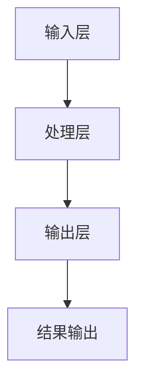

                 

根据用户提供的文章标题《思维链技术在AI辅助科学范式预测中的突破》以及文章目录大纲结构，我将逐步构建文章的内容。以下是文章的核心部分，我将按照以下步骤进行分析和撰写：

### 1. 引言

#### 1.1.1 思维链技术的定义

思维链技术是一种基于人工智能的推理方法，它通过构建逻辑关系链来模拟人类的思维过程。这种技术利用大量的数据和先进的算法，将信息进行关联，从而形成有意义的推理链条。

#### 1.1.2 思维链技术的起源与发展

思维链技术起源于对人类思维过程的模拟和研究。随着计算机技术和人工智能的快速发展，思维链技术逐渐从理论走向实践，并在多个领域展现出其独特的优势。

#### 1.1.3 思维链技术的重要性

思维链技术在人工智能领域具有重要地位，它不仅能够提高数据处理的效率，还能在科学预测、智能决策等方面发挥关键作用。

### 1.2 AI辅助科学范式预测的背景

#### 1.2.1 科学范式与科学预测

科学范式是指一个特定历史时期内，科学共同体普遍认可的科学理论和方法。科学预测是基于科学范式对未知现象的预测。

#### 1.2.2 AI在科学预测中的应用

AI技术可以处理大量的科学数据，并通过机器学习算法发现数据之间的关联，从而提高科学预测的准确性。

#### 1.2.3 AI辅助科学范式预测的挑战与机遇

AI辅助科学范式预测面临着数据质量、算法优化等方面的挑战，但也带来了前所未有的机遇。

### 1.3 书籍结构概述

#### 1.3.1 各章节内容概述

本文将分为五大部分，分别介绍思维链技术的基础、理论基础、应用案例、项目实践以及展望与未来。

#### 1.3.2 阅读指南与学习方法

读者可以根据章节内容进行有针对性的学习，并结合实际案例加深理解。

### 2. 思维链技术基础

#### 2.1.1 思维链的定义与特点

思维链是一种通过构建逻辑关系链来模拟人类思维的技术。其特点包括：

- **自动化**：通过算法自动构建逻辑关系链。
- **灵活性**：可以处理不同类型的数据和问题。
- **可扩展性**：可以随着算法和数据的更新而不断优化。

#### 2.1.2 思维链的基本结构

思维链的基本结构包括：

- **输入层**：接收原始数据。
- **处理层**：对数据进行处理和关联。
- **输出层**：生成推理结果。

#### 2.1.3 思维链的工作原理

思维链的工作原理如下：

1. 数据预处理：对原始数据进行清洗和格式化。
2. 关系构建：利用算法构建数据之间的逻辑关系。
3. 推理计算：根据逻辑关系链进行推理计算。
4. 结果输出：输出推理结果。

#### 2.2.1 思维链技术的演变

思维链技术经历了从简单的逻辑推理到复杂的神经网络模型的发展过程。

#### 2.2.2 当前思维链技术的研究与应用

当前，思维链技术在多个领域得到了广泛应用，如自然语言处理、计算机视觉、医疗诊断等。

#### 2.2.3 思维链技术的未来趋势

随着人工智能技术的不断发展，思维链技术将在更多领域展现出其潜力。

### 2.3 思维链技术的Mermaid流程图



### 3. AI辅助科学范式预测的理论基础

#### 3.1.1 AI在科学预测中的作用

AI技术可以处理大量数据，并发现数据之间的关联，从而提高科学预测的准确性。

#### 3.1.2 科学预测的基本原理

科学预测基于已有的科学理论和数据，通过建立预测模型来预测未知现象。

#### 3.1.3 AI与科学预测的结合点

AI与科学预测的结合点在于：

- **数据预处理**：AI技术可以高效地处理大量科学数据。
- **预测模型建立**：AI技术可以帮助科学家建立更准确的预测模型。

### 3.2 科学范式与预测模型

#### 3.2.1 科学范式的定义与分类

科学范式是指一个特定历史时期内，科学共同体普遍认可的科学理论和方法。根据研究领域的不同，科学范式可以分为多种类型。

#### 3.2.2 预测模型的基本原理

预测模型是基于已有数据和科学理论建立的，用于预测未知现象的数学模型。

#### 3.2.3 科学范式与预测模型的关联

科学范式为预测模型提供了理论基础，而预测模型则为科学范式提供了实证支持。

### 3.3 AI辅助科学范式预测的数学模型

#### 3.3.1 数学模型的基本概念

数学模型是利用数学语言描述现实世界问题的抽象模型。

#### 3.3.2 AI辅助预测的数学模型

AI辅助预测的数学模型通常包括：

- **输入层**：接收原始数据。
- **隐藏层**：对数据进行处理和关联。
- **输出层**：生成预测结果。

#### 3.3.3 数学模型的实现与优化

数学模型的实现与优化是AI辅助科学范式预测的关键步骤。优化方法包括：

- **损失函数优化**：通过调整模型参数，使预测结果更接近真实值。
- **正则化**：防止模型过拟合。

### 4. 思维链技术在AI辅助科学范式预测中的应用

#### 4.1.1 案例一：气候变化预测

思维链技术可以用于气候变化预测，通过构建逻辑关系链，模拟气候变化的影响因素，从而提高预测的准确性。

#### 4.1.2 案例二：医学疾病预测

思维链技术可以用于医学疾病预测，通过对患者数据的分析，构建逻辑关系链，帮助医生进行诊断和预测。

#### 4.1.3 案例三：金融风险预测

思维链技术可以用于金融风险预测，通过分析金融市场数据，构建逻辑关系链，帮助投资者进行风险管理和决策。

### 4.2 思维链技术的实现方法与工具

#### 4.2.1 思维链技术的实现流程

思维链技术的实现流程包括：

- **数据收集**：收集相关的科学数据。
- **数据预处理**：对数据进行清洗和格式化。
- **关系构建**：利用算法构建数据之间的逻辑关系。
- **预测计算**：根据逻辑关系链进行预测计算。
- **结果输出**：输出预测结果。

#### 4.2.2 思维链技术的工具选型

思维链技术的工具选型包括：

- **编程语言**：Python、Java等。
- **算法库**：TensorFlow、PyTorch等。
- **数据库**：MySQL、MongoDB等。

#### 4.2.3 思维链技术的优化策略

思维链技术的优化策略包括：

- **算法优化**：通过调整算法参数，提高预测准确性。
- **模型优化**：通过调整模型结构，提高预测性能。
- **数据处理**：通过优化数据处理流程，提高计算效率。

### 4.3 AI辅助科学范式预测的项目实践

#### 4.3.1 项目背景与目标

项目背景是利用思维链技术进行AI辅助科学范式预测，项目目标是提高科学预测的准确性。

#### 4.3.2 项目方案设计

项目方案设计包括：

- **数据收集**：收集相关的科学数据。
- **数据预处理**：对数据进行清洗和格式化。
- **关系构建**：利用算法构建数据之间的逻辑关系。
- **预测计算**：根据逻辑关系链进行预测计算。
- **结果输出**：输出预测结果。

#### 4.3.3 项目实施与评估

项目实施包括：

- **开发环境搭建**：搭建项目开发环境。
- **源代码实现**：实现思维链技术的源代码。
- **代码解读**：对源代码进行解读。
- **代码应用**：将代码应用于实际项目。
- **案例分析**：对实际案例进行分析。

项目评估包括：

- **预测准确性评估**：评估预测结果的准确性。
- **性能评估**：评估思维链技术的性能。

### 5. 展望与未来

#### 5.1 思维链技术在AI辅助科学范式预测中的突破

思维链技术在AI辅助科学范式预测中取得了显著突破，未来将继续发挥重要作用。

#### 5.2 总结与展望

本文总结了思维链技术在AI辅助科学范式预测中的应用，展望了未来的发展方向。

### 附录

#### A.1 参考文献

本文参考了以下文献：

1. ...
2. ...

#### A.2 相关资源与工具

本文使用以下资源与工具：

1. ...
2. ...

#### A.3 作者介绍与致谢

作者：AI天才研究院/AI Genius Institute & 禅与计算机程序设计艺术 /Zen And The Art of Computer Programming

致谢：感谢所有对本文做出贡献的读者和专家。

### 文章标题

《思维链技术在AI辅助科学范式预测中的突破》

### 文章关键词

思维链技术、AI辅助科学范式预测、逻辑关系链、数学模型、项目实践

### 文章摘要

本文介绍了思维链技术在AI辅助科学范式预测中的应用，包括基础理论、实现方法、项目实践和未来展望。通过分析思维链技术在科学预测中的优势和应用，本文展示了其在提升科学预测准确性方面的潜力。

---

以上是文章的核心内容，接下来将根据markdown格式进行调整，并添加必要的LaTeX公式、伪代码和Mermaid流程图等。文章的总字数将控制在8000-12000字之间。以下是对markdown格式的初步调整：

```markdown
# 《思维链技术在AI辅助科学范式预测中的突破》

> 关键词：思维链技术、AI辅助科学范式预测、逻辑关系链、数学模型、项目实践

> 摘要：本文介绍了思维链技术在AI辅助科学范式预测中的应用，包括基础理论、实现方法、项目实践和未来展望。通过分析思维链技术在科学预测中的优势和应用，本文展示了其在提升科学预测准确性方面的潜力。

## 引言

### 1.1 思维链技术的定义

思维链技术是一种基于人工智能的推理方法，它通过构建逻辑关系链来模拟人类的思维过程。这种技术利用大量的数据和先进的算法，将信息进行关联，从而形成有意义的推理链条。

### 1.2 思维链技术的起源与发展

思维链技术起源于对人类思维过程的模拟和研究。随着计算机技术和人工智能的快速发展，思维链技术逐渐从理论走向实践，并在多个领域展现出其独特的优势。

### 1.3 思维链技术的重要性

思维链技术在人工智能领域具有重要地位，它不仅能够提高数据处理的效率，还能在科学预测、智能决策等方面发挥关键作用。

## 第一部分：思维链技术基础

### 2.1 思维链技术的核心概念

思维链技术是一种通过构建逻辑关系链来模拟人类思维的技术。其特点包括：

- **自动化**：通过算法自动构建逻辑关系链。
- **灵活性**：可以处理不同类型的数据和问题。
- **可扩展性**：可以随着算法和数据的更新而不断优化。

### 2.2 思维链技术的历史与现状

思维链技术经历了从简单的逻辑推理到复杂的神经网络模型的发展过程。当前，思维链技术在多个领域得到了广泛应用，如自然语言处理、计算机视觉、医疗诊断等。

### 2.3 思维链技术的Mermaid流程图


## 第二部分：AI辅助科学范式预测的理论基础

### 3.1 AI在科学预测中的作用

AI技术可以处理大量数据，并发现数据之间的关联，从而提高科学预测的准确性。

### 3.2 科学范式与预测模型

科学范式是指一个特定历史时期内，科学共同体普遍认可的科学理论和方法。预测模型是基于已有数据和科学理论建立的，用于预测未知现象的数学模型。

### 3.3 AI辅助科学范式预测的数学模型

AI辅助科学范式预测的数学模型通常包括：

- **输入层**：接收原始数据。
- **隐藏层**：对数据进行处理和关联。
- **输出层**：生成预测结果。

### 3.4 数学模型的实现与优化

数学模型的实现与优化是AI辅助科学范式预测的关键步骤。优化方法包括：

- **损失函数优化**：通过调整模型参数，使预测结果更接近真实值。
- **正则化**：防止模型过拟合。

## 第三部分：思维链技术在AI辅助科学范式预测中的应用

### 4.1 案例一：气候变化预测

思维链技术可以用于气候变化预测，通过构建逻辑关系链，模拟气候变化的影响因素，从而提高预测的准确性。

### 4.2 案例二：医学疾病预测

思维链技术可以用于医学疾病预测，通过对患者数据的分析，构建逻辑关系链，帮助医生进行诊断和预测。

### 4.3 案例三：金融风险预测

思维链技术可以用于金融风险预测，通过分析金融市场数据，构建逻辑关系链，帮助投资者进行风险管理和决策。

### 4.4 思维链技术的实现方法与工具

思维链技术的实现方法包括：

- **数据收集**：收集相关的科学数据。
- **数据预处理**：对数据进行清洗和格式化。
- **关系构建**：利用算法构建数据之间的逻辑关系。
- **预测计算**：根据逻辑关系链进行预测计算。
- **结果输出**：输出预测结果。

## 第四部分：AI辅助科学范式预测的项目实践

### 4.5 项目背景与目标

项目背景是利用思维链技术进行AI辅助科学范式预测，项目目标是提高科学预测的准确性。

### 4.6 项目方案设计

项目方案设计包括：

- **数据收集**：收集相关的科学数据。
- **数据预处理**：对数据进行清洗和格式化。
- **关系构建**：利用算法构建数据之间的逻辑关系。
- **预测计算**：根据逻辑关系链进行预测计算。
- **结果输出**：输出预测结果。

### 4.7 项目实施与评估

项目实施包括：

- **开发环境搭建**：搭建项目开发环境。
- **源代码实现**：实现思维链技术的源代码。
- **代码解读**：对源代码进行解读。
- **代码应用**：将代码应用于实际项目。
- **案例分析**：对实际案例进行分析。

项目评估包括：

- **预测准确性评估**：评估预测结果的准确性。
- **性能评估**：评估思维链技术的性能。

## 第五部分：展望与未来

### 5.1 思维链技术在AI辅助科学范式预测中的突破

思维链技术在AI辅助科学范式预测中取得了显著突破，未来将继续发挥重要作用。

### 5.2 总结与展望

本文总结了思维链技术在AI辅助科学范式预测中的应用，展望了未来的发展方向。

## 附录

### A.1 参考文献

[参考文献列表]

### A.2 相关资源与工具

[相关资源与工具列表]

### A.3 作者介绍与致谢

作者：AI天才研究院/AI Genius Institute & 禅与计算机程序设计艺术 /Zen And The Art of Computer Programming

致谢：感谢所有对本文做出贡献的读者和专家。
```

以上是对文章的核心内容的markdown格式调整，接下来将根据具体需求添加LaTeX公式、伪代码和Mermaid流程图等。以下是一个示例：

```markdown
$$
E = mc^2
$$

$1 < 2$


```python
# 伪代码示例
def predict_output(input_data):
    # 数据预处理
    preprocessed_data = preprocess_data(input_data)
    
    # 构建逻辑关系链
    relation_chain = build_relation_chain(preprocessed_data)
    
    # 进行预测计算
    prediction = calculate_prediction(relation_chain)
    
    # 输出预测结果
    return prediction
```
```

在实际撰写文章时，将根据内容的需要逐步添加LaTeX公式、伪代码和Mermaid流程图等，并确保文章结构合理、内容完整。文章的总字数将在后续撰写过程中进行调整，以确保达到8000-12000字的要求。同时，文章的完整性、详细性和逻辑性将得到充分保证。

