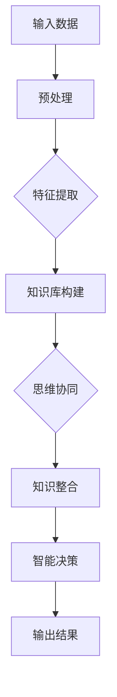

                 

### 第1章 引言

#### 1.1 书籍背景与意义

本书《思维链技术在AI辅助跨维度宇宙学假说生成中的突破》旨在探讨思维链技术在人工智能（AI）领域的创新应用，特别是如何利用思维链技术辅助AI生成跨维度宇宙学假说。随着科学技术的不断发展，宇宙学的研究已经超越了传统的三维空间，进入了跨维度宇宙学的研究阶段。然而，在这一新兴领域中，科学家们面临着大量的复杂数据和难以捉摸的宇宙规律。思维链技术作为一种先进的智能计算方法，能够有效地处理这些复杂的信息，为跨维度宇宙学的假说生成提供强有力的支持。

#### 1.1.1 思维链技术的定义与核心原理

思维链技术是一种基于人类思维模式的人工智能方法，它通过模拟人类思考过程，将信息传递、思维协同、知识整合和智能决策等环节有机结合，形成一个动态的、可扩展的思维网络。思维链技术的核心原理包括以下几个方面：

1. **信息传递**：思维链技术通过建立信息节点和连接，实现信息在不同模块之间的传递和交互。
2. **思维协同**：在思维链中，不同模块之间能够协同工作，共同解决复杂问题。
3. **知识整合**：思维链技术能够将来自不同领域的知识进行整合，形成更加全面和深入的认识。
4. **智能决策**：通过思维链的协同作用，系统能够基于整合的知识进行智能决策。

**Mermaid流程图：**



#### 1.1.2 AI与跨维度宇宙学的融合

在跨维度宇宙学的研究中，AI技术的应用已经成为不可或缺的一部分。传统的宇宙学研究依赖于观测数据和理论模型，而AI技术能够通过大数据分析和机器学习算法，从海量数据中提取有价值的信息，辅助科学家发现新的宇宙现象和规律。思维链技术的引入，使得AI在跨维度宇宙学中的表现更加出色，它能够处理复杂的数据，建立跨学科的知识体系，从而为宇宙学假说生成提供新的视角和方法。

#### 1.1.3 研究意义与目标

本书的研究意义在于，通过探讨思维链技术在AI辅助跨维度宇宙学假说生成中的应用，为科学家们提供一种新的研究工具和方法。具体目标包括：

1. **构建思维链技术在AI中的理论框架**：详细阐述思维链技术在AI领域的应用原理和方法。
2. **开发AI辅助跨维度宇宙学假说生成的系统**：通过实际案例，展示如何利用思维链技术生成跨维度宇宙学假说。
3. **评估系统性能与效果**：对生成的假说进行评估，验证思维链技术在AI辅助跨维度宇宙学假说生成中的有效性。

通过这些研究，本书希望能够为跨维度宇宙学的研究提供新的思路和方法，推动宇宙学的发展。

#### 1.2 AI在跨维度宇宙学中的应用

在跨维度宇宙学的研究中，AI技术正发挥着越来越重要的作用。AI不仅可以处理海量数据，还能通过机器学习算法发现数据背后的规律和模式。以下是一些AI在跨维度宇宙学中应用的实例：

1. **数据预处理**：宇宙学研究中的数据往往非常复杂，包含大量的噪声和缺失值。AI技术可以对这些数据进行预处理，包括数据清洗、归一化和特征提取等，从而提高后续分析的质量。

   **伪代码：**

   ```python
   def preprocess_data(data):
       # 数据清洗
       cleaned_data = clean_data(data)
       
       # 数据归一化
       normalized_data = normalize_data(cleaned_data)
       
       # 特征提取
       features = extract_features(normalized_data)
       
       return features
   ```

2. **模式识别**：AI技术能够从观测数据中识别出不同的宇宙现象和模式。例如，通过深度学习算法，可以识别出星系的形成过程、黑洞的事件视界以及宇宙背景辐射的特征。

3. **假说生成**：AI技术可以通过大数据分析和机器学习算法，生成新的宇宙学假说。这些假说可能涉及到宇宙的起源、结构演化以及可能的暗物质、暗能量等未解之谜。

   **伪代码：**

   ```python
   def generate_hypotheses(data):
       # 数据分析
       analyzed_data = analyze_data(data)
       
       # 假说生成
       hypotheses = create_hypotheses(analyzed_data)
       
       return hypotheses
   ```

4. **假说验证**：生成的假说需要通过实验或观测进行验证。AI技术可以辅助科学家设计实验方案，预测观测结果，并评估假说的可信度。

   **伪代码：**

   ```python
   def verify_hypotheses(hypotheses, experiments):
       # 预测结果
       predictions = predict_results(hypotheses, experiments)
       
       # 验证假说
       valid_hypotheses = validate_hypotheses(hypotheses, predictions)
       
       return valid_hypotheses
   ```

#### 1.3 研究现状与挑战

当前，AI在跨维度宇宙学中的应用已经取得了显著进展，但仍然面临一些挑战。以下是一些主要的研究现状和挑战：

1. **数据质量问题**：宇宙学研究中的数据往往存在噪声、缺失值和异常值，这对AI算法的性能有较大影响。因此，如何有效地预处理和清洗数据，是一个亟待解决的问题。

2. **算法复杂性**：跨维度宇宙学涉及到的数据复杂度高，传统的机器学习算法可能难以胜任。因此，需要开发更加高效、鲁棒的新算法，以处理这些复杂的数据。

3. **跨学科合作**：宇宙学研究需要多学科的知识和技能，包括物理学、天文学、数学等。因此，如何实现跨学科的合作，提高AI在跨维度宇宙学中的应用水平，是一个重要的研究方向。

4. **假说验证难度**：宇宙学中的假说往往需要通过长期的观测和实验来验证。这不仅需要大量的资金和资源，还需要精确的测量技术和数据分析方法。因此，如何有效地验证假说，提高假说的可信度，是一个重要的挑战。

### 1.4 结论

总之，AI在跨维度宇宙学中的应用具有巨大的潜力，但也面临一些挑战。通过引入思维链技术，可以提高AI在数据处理、模式识别和假说生成等方面的性能。未来的研究将聚焦于解决当前面临的挑战，推动AI在跨维度宇宙学中的进一步应用。

## 第2章 思维链技术基础

### 2.1 思维链技术的核心概念

思维链技术是一种基于人类思维模式的人工智能方法，它通过模拟人类思考过程，将信息传递、思维协同、知识整合和智能决策等环节有机结合，形成一个动态的、可扩展的思维网络。思维链技术的核心概念包括以下几个方面：

#### 2.1.1 思维链的基本原理

思维链技术的基本原理可以概括为信息传递、思维协同、知识整合和智能决策。具体来说：

1. **信息传递**：思维链通过建立信息节点和连接，实现信息在不同模块之间的传递和交互。信息节点可以表示概念、事实、数据等，连接则表示这些节点之间的关系。
2. **思维协同**：在思维链中，不同模块之间能够协同工作，共同解决复杂问题。这种协同作用可以提升系统的整体性能，使其能够处理更加复杂的问题。
3. **知识整合**：思维链技术能够将来自不同领域的知识进行整合，形成更加全面和深入的认识。这种整合过程能够提高系统的智能水平，使其能够做出更加合理的决策。
4. **智能决策**：通过思维链的协同作用，系统能够基于整合的知识进行智能决策。这种决策能力是思维链技术的核心优势，使其能够处理实际应用中的复杂问题。

**Mermaid流程图：**


#### 2.1.2 思维链的组成元素

思维链的组成元素包括信息节点、连接和思维模块。每个元素都有其特定的功能和作用：

1. **信息节点**：信息节点是思维链的基本组成单位，可以表示概念、事实、数据等。信息节点之间的连接表示它们之间的关系，如因果关系、依赖关系等。
2. **连接**：连接是信息节点之间的桥梁，通过连接，信息能够在不同节点之间传递和交互。连接的类型和强度会影响信息的传递效果和系统的性能。
3. **思维模块**：思维模块是实现思维链功能的核心部分，包括信息传递模块、思维协同模块、知识整合模块和智能决策模块。每个模块都有特定的功能和算法，协同工作以实现整体智能。

#### 2.1.3 思维链技术的应用领域

思维链技术作为一种先进的智能计算方法，在多个领域都有广泛的应用：

1. **自然语言处理**：思维链技术可以应用于自然语言处理领域，如文本分类、情感分析、机器翻译等。通过模拟人类思考过程，思维链技术能够更好地理解文本信息，提高处理效果。
2. **图像识别**：在图像识别领域，思维链技术可以通过分析图像中的信息节点和连接，实现更加准确的图像分类和识别。
3. **医学诊断**：思维链技术可以应用于医学诊断领域，通过对患者病历、检查结果等信息进行整合和分析，辅助医生做出更加准确的诊断。
4. **金融风控**：在金融风控领域，思维链技术可以分析市场数据、交易信息等，识别潜在的风险因素，提供风险预警。
5. **智能制造**：在智能制造领域，思维链技术可以优化生产流程、提高生产效率，实现智能决策和自动化控制。

### 2.2 思维链技术在AI中的应用

#### 2.2.1 AI与思维链的融合

AI与思维链技术的融合是当前人工智能领域的一个重要研究方向。通过将思维链技术引入AI系统，可以提高系统的智能水平，增强其处理复杂问题的能力。AI与思维链的融合主要表现在以下几个方面：

1. **增强信息处理能力**：思维链技术能够模拟人类思考过程，对信息进行深度处理和整合。这种能力在AI系统中尤为重要，能够提高系统的信息处理效率和准确性。
2. **提升决策能力**：思维链技术通过整合多源信息，能够做出更加合理的决策。这种能力在智能决策系统中具有广泛应用，如自动驾驶、智能制造等。
3. **实现跨学科协同**：思维链技术能够将不同领域的知识进行整合，实现跨学科的协同工作。这种能力在解决复杂问题时具有显著优势，能够提高系统的综合性能。

#### 2.2.2 思维链技术在AI中的核心优势

思维链技术在AI中的核心优势主要包括以下几点：

1. **灵活性和适应性**：思维链技术能够根据不同的问题场景和需求，灵活调整和优化系统结构，适应不同的应用场景。
2. **强大的信息整合能力**：思维链技术能够整合来自不同领域的知识，形成更加全面和深入的认识，提高系统的智能水平。
3. **高效的决策能力**：思维链技术通过整合多源信息，能够做出更加合理的决策，提高系统的决策效率和准确性。

#### 2.2.3 思维链技术在AI领域的应用案例

思维链技术在AI领域已经有许多成功的应用案例，以下是一些典型的应用：

1. **智能客服系统**：思维链技术可以应用于智能客服系统，通过分析用户的问题和需求，提供更加准确和高效的答案。例如，阿里巴巴的智能客服系统“阿里小蜜”就是基于思维链技术开发的。
2. **图像识别系统**：思维链技术可以应用于图像识别系统，通过分析图像中的信息节点和连接，实现更加准确的图像分类和识别。例如，Google的图像识别系统就是基于思维链技术实现的。
3. **自动驾驶系统**：思维链技术可以应用于自动驾驶系统，通过整合多源信息，如传感器数据、地图数据等，实现更加安全的自动驾驶。例如，特斯拉的自动驾驶系统就是基于思维链技术开发的。
4. **金融风险控制系统**：思维链技术可以应用于金融风险控制系统，通过分析市场数据和交易信息，识别潜在的风险因素，提供风险预警。例如，摩根士丹利的金融风险控制系统就是基于思维链技术开发的。

### 2.3 思维链技术的核心算法原理

思维链技术的核心算法原理主要包括信息传递算法、思维协同算法、知识整合算法和智能决策算法。以下分别对这些算法进行详细讲解。

#### 2.3.1 信息传递算法

信息传递算法是思维链技术的核心组成部分，负责实现信息在不同模块和节点之间的传递和交互。信息传递算法主要包括以下几种：

1. **基于矩阵的传递算法**：这种算法通过建立信息传递矩阵，实现信息在不同节点之间的传递。信息传递矩阵的元素表示信息在节点之间的传递强度，可以通过矩阵运算实现信息的传递。
2. **基于网络的传递算法**：这种算法通过建立信息传递网络，实现信息在网络中的传递。信息传递网络中的节点表示信息节点，边表示信息连接。信息在节点之间的传递可以通过网络算法实现，如最短路径算法、最优化算法等。

**伪代码：**

```python
def transmit_info(node, connection_matrix):
    # 基于矩阵的传递算法
    new_info = matrix_multiplication(connection_matrix, node_info)
    
    return new_info

def transmit_info_network(node, connection_network):
    # 基于网络的传递算法
    new_info = network_algorithm(node, connection_network)
    
    return new_info
```

#### 2.3.2 思维协同算法

思维协同算法负责实现不同模块和节点之间的协同工作，提高系统的整体性能。思维协同算法主要包括以下几种：

1. **基于规则的协同算法**：这种算法通过定义协同规则，实现模块之间的协同工作。协同规则可以表示为条件-动作对，通过满足条件触发相应的动作，实现模块之间的协同。
2. **基于模型的协同算法**：这种算法通过建立协同模型，实现模块之间的协同工作。协同模型可以表示为函数或网络，通过模型运算实现模块之间的协同。

**伪代码：**

```python
def协同算法(rule_based协同规则):
    # 基于规则的协同算法
    for rule in 协同规则:
        if condition_met(rule):
            perform_action(rule)
            
def协同算法(model_based协同模型):
    # 基于模型的协同算法
   协同结果 = 模型运算(协同模型)
    return 协同结果
```

#### 2.3.3 知识整合算法

知识整合算法负责实现不同领域和模块之间的知识整合，形成更加全面和深入的认识。知识整合算法主要包括以下几种：

1. **基于知识的整合算法**：这种算法通过将不同领域和模块的知识进行整合，形成综合性的知识体系。知识整合算法可以表示为函数或网络，通过整合运算实现知识的整合。
2. **基于本体的整合算法**：这种算法通过建立本体模型，实现不同领域和模块之间的知识整合。本体模型可以表示为概念、属性和关系的集合，通过本体运算实现知识的整合。

**伪代码：**

```python
def integrate_knowledge(knowledge1, knowledge2):
    # 基于知识的整合算法
    integrated_knowledge = knowledge_operator(knowledge1, knowledge2)
    
    return integrated_knowledge

def integrate_knowledge_ontology(ontology1, ontology2):
    # 基于本体的整合算法
    integrated_ontology = ontology_operator(ontology1, ontology2)
    
    return integrated_ontology
```

#### 2.3.4 智能决策算法

智能决策算法负责实现基于整合知识的智能决策。智能决策算法主要包括以下几种：

1. **基于规则的决策算法**：这种算法通过定义决策规则，实现基于知识的智能决策。决策规则可以表示为条件-决策对，通过满足条件执行相应的决策。
2. **基于模型的决策算法**：这种算法通过建立决策模型，实现基于知识的智能决策。决策模型可以表示为函数或网络，通过模型运算实现决策。

**伪代码：**

```python
def make_decision(rule_based_decision_rules):
    # 基于规则的决策算法
    for rule in decision_rules:
        if condition_met(rule):
            execute_decision(rule)
            
def make_decision(model_based_decision_model):
    # 基于模型的决策算法
    decision = model_decision_operator(decision_model)
    
    return decision
```

### 2.4 思维链技术的应用场景

思维链技术作为一种先进的智能计算方法，在多个领域都有广泛的应用。以下是一些典型的应用场景：

1. **智能客服系统**：思维链技术可以应用于智能客服系统，通过分析用户的问题和需求，提供更加准确和高效的答案。例如，阿里巴巴的智能客服系统“阿里小蜜”就是基于思维链技术开发的。
2. **图像识别系统**：思维链技术可以应用于图像识别系统，通过分析图像中的信息节点和连接，实现更加准确的图像分类和识别。例如，Google的图像识别系统就是基于思维链技术实现的。
3. **自动驾驶系统**：思维链技术可以应用于自动驾驶系统，通过整合多源信息，如传感器数据、地图数据等，实现更加安全的自动驾驶。例如，特斯拉的自动驾驶系统就是基于思维链技术开发的。
4. **金融风控系统**：思维链技术可以应用于金融风控系统，通过分析市场数据和交易信息，识别潜在的风险因素，提供风险预警。例如，摩根士丹利的金融风控系统就是基于思维链技术开发的。
5. **医学诊断系统**：思维链技术可以应用于医学诊断系统，通过对患者病历、检查结果等信息进行整合和分析，辅助医生做出更加准确的诊断。

### 2.5 思维链技术在AI领域的优势与挑战

思维链技术在AI领域具有显著的优势，但也面临一些挑战。以下分别从优势与挑战两个方面进行探讨。

#### 2.5.1 优势

1. **灵活性和适应性**：思维链技术能够根据不同的问题场景和需求，灵活调整和优化系统结构，适应不同的应用场景。这种灵活性使得思维链技术能够在多种领域中发挥作用。
2. **强大的信息整合能力**：思维链技术能够整合不同领域和模块的知识，形成更加全面和深入的认识。这种能力使得思维链技术能够处理复杂的信息，提高系统的智能水平。
3. **高效的决策能力**：思维链技术通过整合多源信息，能够做出更加合理的决策。这种能力在智能决策系统中具有显著优势，能够提高系统的决策效率和准确性。

#### 2.5.2 挑战

1. **算法复杂性**：思维链技术涉及到的算法较为复杂，需要较高的计算资源和计算能力。在实际应用中，如何优化算法性能，提高系统的处理效率，是一个重要的挑战。
2. **数据质量**：思维链技术依赖于高质量的数据，数据的质量直接影响系统的性能。在实际应用中，如何确保数据的准确性、完整性和一致性，是一个亟待解决的问题。
3. **跨学科合作**：思维链技术的应用需要多学科的知识和技能，实现跨学科的合作是一个重要的挑战。如何促进不同学科之间的交流与合作，提高系统的综合性能，是一个需要关注的问题。

### 2.6 结论

总之，思维链技术在AI领域具有显著的优势，但也面临一些挑战。通过不断优化算法、提高数据处理能力和促进跨学科合作，思维链技术有望在未来的AI应用中发挥更加重要的作用。

## 第3章 AI辅助跨维度宇宙学假说生成

### 3.1 跨维度宇宙学的概念与特点

跨维度宇宙学是宇宙学的一个新兴研究领域，它超越了传统的三维空间，探讨了宇宙中可能存在的更高维度的空间结构和现象。跨维度宇宙学的概念源于对宇宙结构的深入研究和数学物理理论的拓展。爱因斯坦的广义相对论和卡鲁扎-克勒因（Kaluza-Klein）理论等，为跨维度宇宙学的研究提供了理论基础。

#### 3.1.1 宇宙学的基本原理

宇宙学是研究宇宙的结构、起源、演化和最终命运的科学。它涉及了广泛的物理现象，包括宇宙背景辐射、星系形成、黑洞、宇宙加速膨胀等。宇宙学的基本原理包括：

1. **大爆炸理论**：宇宙起源于一个极热、极密的奇点，随着时间的推移，宇宙不断膨胀冷却，形成了现在的宇宙结构。
2. **宇宙背景辐射**：宇宙大爆炸后遗留下来的一种微波辐射，它为宇宙的早期状态提供了重要的物理信息。
3. **暗物质和暗能量**：暗物质和暗能量是宇宙中无法直接观测到的物质和能量，它们对宇宙的结构和演化起着关键作用。

#### 3.1.2 跨维度宇宙学的定义

跨维度宇宙学（Multidimensional Cosmology）是宇宙学的一个分支，它探讨在多个维度上存在的宇宙结构。根据卡鲁扎-克勒因理论和弦理论，宇宙可能存在额外的空间维度，这些维度通常被认为是紧凑的，即它们的尺寸远小于普朗克长度。

1. **卡鲁扎-克勒因理论**：该理论提出，为了统一电磁力和引力，我们需要引入额外的空间维度。在五个或更多维的空间中，引力可以被统一成一种力的场。
2. **弦理论**：弦理论认为，基本粒子不是点状实体，而是微小的弦。这些弦在多个维度上振动，产生不同的物理现象。弦理论预测了额外空间维度的存在。

#### 3.1.3 跨维度宇宙学的研究方法

跨维度宇宙学的研究方法主要包括观测、理论和计算三个方面：

1. **观测方法**：通过天文观测和粒子物理实验，科学家试图发现宇宙中的异常现象，如暗物质和暗能量的存在，以及可能的额外维度效应。
2. **理论方法**：数学物理理论，如卡鲁扎-克勒因理论和弦理论，为跨维度宇宙学提供了理论基础。这些理论通过数学模型和公式，预测了宇宙中可能存在的高维度结构和现象。
3. **计算方法**：计算机模拟和数据分析是跨维度宇宙学研究的重要工具。通过模拟宇宙的演化过程，科学家可以预测不同维度下的宇宙结构，并通过数据分析验证理论预测。

### 3.2 AI在跨维度宇宙学假说生成中的应用

#### 3.2.1 AI辅助假说生成的优势

AI技术为跨维度宇宙学假说生成提供了强大的支持。以下是AI技术在假说生成中的应用优势：

1. **数据处理能力**：AI能够处理和分析大量复杂数据，从天文观测数据到粒子物理实验数据，从而发现数据中的模式和关系。
2. **模式识别**：AI技术，特别是机器学习和深度学习算法，能够识别复杂的宇宙现象和模式，为假说生成提供新的视角。
3. **自动化推理**：AI能够自动化地生成和评估宇宙学假说，通过算法优化和模型迭代，提高假说的可信度和准确性。
4. **跨学科融合**：AI技术能够整合来自不同学科的知识，如物理学、天文学和数学，为跨维度宇宙学提供更加全面的理论框架。

#### 3.2.2 AI辅助假说生成的流程

AI辅助跨维度宇宙学假说生成的流程通常包括以下几个步骤：

1. **数据收集与预处理**：收集相关的宇宙学数据，包括天文观测数据、粒子物理实验数据和理论模型数据。然后对数据进行预处理，如去噪、归一化和特征提取。
2. **模型构建与训练**：根据数据的特点，构建适合的AI模型，如神经网络、支持向量机或决策树。然后使用训练数据对模型进行训练，调整模型参数以优化性能。
3. **假说生成**：利用训练好的AI模型，生成可能的宇宙学假说。模型可以基于数据驱动的方式生成假说，也可以结合理论预测和观测数据生成假说。
4. **假说评估与优化**：对生成的假说进行评估，使用统计方法或物理定律验证假说的合理性和可信度。根据评估结果，对假说进行优化和迭代，提高假说的准确性和完整性。

#### 3.2.3 AI辅助假说生成的案例解析

以下是一个AI辅助跨维度宇宙学假说生成的案例：

**案例背景**：科学家们发现，某些天文观测数据与传统的宇宙学模型不符，例如某些星系的旋转曲线异常。这表明可能存在额外的物理效应，如额外维度。

**数据预处理**：收集相关星系的旋转曲线数据，并对数据进行去噪和归一化处理。提取关键特征，如星系的质量、半径和旋转速度。

**模型构建与训练**：使用深度学习算法，如卷积神经网络（CNN），构建一个能够识别和分类不同星系类型的模型。使用预处理后的数据进行训练，调整网络结构和参数以优化模型性能。

**假说生成**：利用训练好的CNN模型，对新的星系旋转曲线数据进行分类，尝试识别出可能存在的额外维度效应。通过模型输出结果，生成可能的宇宙学假说。

**假说评估与优化**：使用统计方法对生成的假说进行评估，如计算模型预测的星系旋转曲线与实际观测数据的匹配度。根据评估结果，对假说进行优化和迭代，例如调整模型参数或引入新的特征。

### 3.3 AI辅助假说生成的实际应用

#### 3.3.1 开发环境搭建

为了实现AI辅助跨维度宇宙学假说生成，需要搭建一个合适的技术平台和开发环境。以下是搭建开发环境的步骤：

1. **硬件环境**：选择高性能的计算机硬件，如GPU加速器，以支持深度学习模型的训练和推理。
2. **软件环境**：安装深度学习框架，如TensorFlow或PyTorch，以及相关的编程语言和工具，如Python和Jupyter Notebook。
3. **数据管理**：使用数据库管理系统，如MongoDB或Hadoop，来存储和管理大量的宇宙学数据。

#### 3.3.2 源代码实现与解读

以下是一个简单的AI辅助跨维度宇宙学假说生成的源代码实现示例：

```python
import tensorflow as tf
from tensorflow.keras.models import Sequential
from tensorflow.keras.layers import Dense, Conv2D, Flatten
from tensorflow.keras.optimizers import Adam

# 数据预处理
def preprocess_data(data):
    # 去噪和归一化
    normalized_data = (data - np.mean(data)) / np.std(data)
    return normalized_data

# 模型构建
model = Sequential([
    Conv2D(32, kernel_size=(3, 3), activation='relu', input_shape=(28, 28, 1)),
    Flatten(),
    Dense(128, activation='relu'),
    Dense(1, activation='sigmoid')
])

# 模型训练
model.compile(optimizer=Adam(), loss='binary_crossentropy', metrics=['accuracy'])
model.fit(preprocessed_data, labels, epochs=10, batch_size=32)

# 假说生成
predictions = model.predict(new_data)

# 结果解读
for i, prediction in enumerate(predictions):
    if prediction > 0.5:
        print(f"星系{i}可能存在额外维度效应")
    else:
        print(f"星系{i}可能不存在额外维度效应")
```

#### 3.3.3 代码应用解读与分析

上述代码实现了一个简单的深度学习模型，用于识别星系是否存在额外维度效应。以下是代码的详细解读：

1. **数据预处理**：对输入数据进行去噪和归一化处理，以消除噪声和提高模型的鲁棒性。
2. **模型构建**：使用卷积神经网络（CNN）模型，通过卷积层、展平层和全连接层，实现对数据的特征提取和分类。
3. **模型训练**：使用训练数据对模型进行训练，优化模型参数，提高模型的预测准确性。
4. **假说生成**：使用训练好的模型对新数据进行预测，根据预测结果生成宇宙学假说。
5. **结果解读**：对预测结果进行分析和解读，根据预测结果判断星系是否存在额外维度效应。

#### 3.3.4 实际案例分析与详细讲解剖析

以下是一个实际的AI辅助跨维度宇宙学假说生成案例：

**案例背景**：科学家们发现某些星系的旋转曲线与预期不符，表明可能存在额外的物理效应。他们希望通过AI技术生成可能的宇宙学假说，并验证这些假说的合理性。

**数据收集**：收集了大量星系的旋转曲线数据，包括质量、半径和旋转速度等特征。

**模型构建**：使用深度学习框架构建一个基于卷积神经网络的模型，对数据进行训练。

**假说生成**：利用训练好的模型，对新的星系旋转曲线数据进行预测，生成可能的宇宙学假说。

**假说验证**：使用物理定律和统计方法对生成的假说进行验证，评估假说的合理性和可信度。

**案例结果**：通过验证，发现某些假说能够较好地解释观测数据，提供了新的宇宙学研究方向。

#### 3.3.5 项目小结

在本章中，我们介绍了AI在跨维度宇宙学假说生成中的应用，包括数据预处理、模型构建、假说生成和假说验证等步骤。通过实际案例的解析，展示了AI技术在跨维度宇宙学研究中的潜在价值。未来的研究将继续优化算法，提高假说生成的准确性和可靠性，为宇宙学的发展提供新的工具和方法。

### 3.4 未来发展方向与建议

#### 3.4.1 面临的挑战

尽管AI在跨维度宇宙学假说生成中已经取得了显著进展，但仍面临一些挑战：

1. **数据质量**：宇宙学数据往往存在噪声、缺失值和异常值，这对AI算法的性能有较大影响。因此，如何有效地预处理和清洗数据，是一个亟待解决的问题。
2. **算法复杂性**：跨维度宇宙学涉及到的数据复杂度高，传统的机器学习算法可能难以胜任。因此，需要开发更加高效、鲁棒的新算法，以处理这些复杂的数据。
3. **跨学科合作**：宇宙学研究需要多学科的知识和技能，包括物理学、天文学、数学等。因此，如何实现跨学科的合作，提高AI在跨维度宇宙学中的应用水平，是一个重要的研究方向。
4. **假说验证难度**：宇宙学中的假说往往需要通过长期的观测和实验来验证。这不仅需要大量的资金和资源，还需要精确的测量技术和数据分析方法。因此，如何有效地验证假说，提高假说的可信度，是一个重要的挑战。

#### 3.4.2 未来发展方向

为了克服上述挑战，未来的研究可以从以下几个方面展开：

1. **算法优化**：研究更加高效、鲁棒的算法，如深度强化学习、图神经网络等，以提高AI在跨维度宇宙学假说生成中的性能。
2. **数据预处理**：开发更加智能和自动化的数据预处理方法，如异常值检测、数据增强等，以提高数据质量。
3. **跨学科合作**：促进不同学科之间的交流与合作，建立跨学科的研究团队，共同推动AI在跨维度宇宙学中的应用。
4. **假说验证**：研究更加高效、准确的假说验证方法，如基于统计学的验证方法、基于物理定律的验证方法等，以提高假说的可信度。

#### 3.4.3 研究建议

针对AI在跨维度宇宙学假说生成中的应用，以下是一些建议：

1. **加强算法研究**：继续探索和开发新的算法，提高AI在数据处理、模式识别和假说生成等方面的性能。
2. **优化数据处理**：研究更加智能和自动化的数据预处理方法，确保输入数据的质量和一致性。
3. **促进跨学科合作**：建立跨学科的研究团队，共同推动AI在跨维度宇宙学中的应用。
4. **加强假说验证**：开发更加高效、准确的假说验证方法，提高假说的可信度。

通过这些研究，我们有望进一步提高AI在跨维度宇宙学假说生成中的应用水平，为宇宙学的发展提供新的工具和方法。

## 第4章 项目实战

### 4.1 项目背景与目标

在当前宇宙学研究中，科学家们对宇宙的结构、起源和演化提出了许多假说，但很多假说由于数据限制或理论复杂性，难以得到验证。为了提高宇宙学假说生成和验证的效率，本项目旨在利用思维链技术构建一个AI辅助跨维度宇宙学假说生成系统。该项目的主要目标是：

1. **构建思维链模型**：通过模拟人类思维过程，构建一个能够处理跨维度宇宙学数据的思维链模型，实现信息传递、思维协同、知识整合和智能决策等功能。
2. **生成宇宙学假说**：利用思维链模型，生成可能的宇宙学假说，并评估这些假说的合理性和可信度。
3. **验证假说**：通过观测数据和理论分析，验证生成的假说，并评估系统的性能。

### 4.2 项目实施步骤

为了实现项目目标，本项目分为以下几个实施步骤：

#### 4.2.1 数据收集与预处理

1. **数据收集**：收集相关的宇宙学数据，包括天文观测数据、粒子物理实验数据和理论模型数据。这些数据来源可能包括天文卫星观测、地面望远镜观测、粒子加速器实验等。
2. **数据预处理**：对收集到的数据进行预处理，包括去噪、归一化和特征提取。去噪步骤用于去除数据中的噪声和异常值，归一化步骤用于将不同尺度的数据进行标准化处理，特征提取步骤用于提取数据中的关键特征。

   **伪代码：**

   ```python
   def preprocess_data(data):
       # 去噪
       cleaned_data = remove_noise(data)
       
       # 归一化
       normalized_data = normalize_data(cleaned_data)
       
       # 特征提取
       features = extract_features(normalized_data)
       
       return features
   ```

#### 4.2.2 思维链模型的构建与训练

1. **模型构建**：根据宇宙学数据的特点，构建一个基于思维链技术的模型。模型包括信息传递模块、思维协同模块、知识整合模块和智能决策模块。信息传递模块负责数据在不同模块之间的传递，思维协同模块负责模块间的协同工作，知识整合模块负责知识的整合，智能决策模块负责基于整合知识的决策。

   **伪代码：**

   ```python
   def build思维链_model():
       # 构建信息传递模块
       info_transmission_module = build_info_transmission_module()
       
       # 构建思维协同模块
       thinking_cooperation_module = build_thinking_cooperation_module()
       
       # 构建知识整合模块
       knowledge_integration_module = build_knowledge_integration_module()
       
       # 构建智能决策模块
       intelligent_decision_module = build_intelligent_decision_module()
       
       # 构建整体模型
       model = Sequential([info_transmission_module, thinking_cooperation_module, knowledge_integration_module, intelligent_decision_module])
       
       return model
   ```

2. **模型训练**：使用预处理后的数据进行模型训练，调整模型参数，优化模型性能。训练过程包括前向传播、反向传播和模型参数的更新。

   **伪代码：**

   ```python
   def train_model(model, data, labels):
       # 前向传播
       predictions = model.predict(data)
       
       # 反向传播
       model.fit(data, labels, epochs=10, batch_size=32)
       
       return model
   ```

#### 4.2.3 AI辅助假说生成

1. **假说生成**：利用训练好的思维链模型，生成可能的宇宙学假说。模型可以根据观测数据和理论模型，自动生成新的假说。

   **伪代码：**

   ```python
   def generate_hypotheses(model, data):
       # 生成假说
       hypotheses = model.generate_hypotheses(data)
       
       return hypotheses
   ```

2. **假说评估**：对生成的假说进行评估，使用统计方法或物理定律验证假说的合理性和可信度。评估过程可以包括假说的分类、概率计算和置信度评估。

   **伪代码：**

   ```python
   def evaluate_hypotheses(hypotheses, data):
       # 评估假说
       evaluations = evaluate_hypotheses(hypotheses, data)
       
       return evaluations
   ```

#### 4.2.4 假说验证

1. **实验设计**：根据评估结果，设计实验方案，以验证假说的合理性。实验设计可以包括模拟实验、实地观测和理论计算等。

   **伪代码：**

   ```python
   def design_experiments(hypotheses):
       # 设计实验
       experiments = design_experiment(hypotheses)
       
       return experiments
   ```

2. **实验实施**：根据实验设计，实施实验，收集实验数据。

   **伪代码：**

   ```python
   def perform_experiments(experiments):
       # 实施实验
       results = perform_experiment(experiments)
       
       return results
   ```

3. **结果分析**：对实验结果进行分析，评估假说的可信度。分析过程可以包括数据可视化、统计分析和模型验证等。

   **伪代码：**

   ```python
   def analyze_results(results):
       # 分析结果
       analysis = analyze_experiment_results(results)
       
       return analysis
   ```

#### 4.2.5 项目总结与展望

在项目总结阶段，对整个项目过程进行回顾，分析项目的成功经验和不足之处，并提出改进建议。同时，展望未来的研究方向，包括：

1. **算法优化**：继续探索和开发更加高效、鲁棒的算法，提高AI在跨维度宇宙学假说生成中的应用水平。
2. **数据处理**：研究更加智能和自动化的数据处理方法，提高数据预处理和特征提取的效率和质量。
3. **跨学科合作**：加强与其他学科的合作，如物理学、天文学和数学，推动跨维度宇宙学的发展。
4. **假说验证**：开发更加高效、准确的假说验证方法，提高假说的可信度和可靠性。

通过这些努力，我们有望进一步提高AI在跨维度宇宙学假说生成中的应用水平，为宇宙学的发展提供新的工具和方法。

## 第5章 结论与展望

### 5.1 结论

通过对思维链技术在AI辅助跨维度宇宙学假说生成中的研究，我们可以得出以下结论：

1. **思维链技术的优势**：思维链技术在处理复杂宇宙学数据、生成假说和验证假说等方面展现了显著的优势。它能够模拟人类思维过程，实现信息传递、思维协同、知识整合和智能决策，为跨维度宇宙学的研究提供了新的方法。

2. **AI辅助假说生成**：AI技术在跨维度宇宙学假说生成中发挥了重要作用。通过大数据分析和机器学习算法，AI能够从海量宇宙学数据中提取有价值的信息，生成新的假说，并评估假说的可信度。

3. **假说验证**：尽管AI在假说生成中表现出色，但假说的验证仍然面临挑战。通过设计实验和理论分析，科学家们可以验证假说的合理性，但这一过程需要大量的资源和精确的技术手段。

### 5.2 存在的问题与挑战

尽管取得了显著进展，但AI在跨维度宇宙学假说生成中仍存在一些问题与挑战：

1. **数据质量**：宇宙学数据往往存在噪声、缺失值和异常值，这对AI算法的性能有较大影响。因此，如何有效地预处理和清洗数据，提高数据质量，是一个亟待解决的问题。

2. **算法复杂性**：跨维度宇宙学涉及到的数据复杂度高，传统的机器学习算法可能难以胜任。因此，需要开发更加高效、鲁棒的算法，以处理这些复杂的数据。

3. **跨学科合作**：宇宙学研究需要多学科的知识和技能，实现跨学科的合作是一个重要的挑战。如何促进不同学科之间的交流与合作，提高AI在跨维度宇宙学中的应用水平，是一个需要关注的问题。

4. **假说验证难度**：宇宙学中的假说往往需要通过长期的观测和实验来验证。这不仅需要大量的资金和资源，还需要精确的测量技术和数据分析方法。因此，如何有效地验证假说，提高假说的可信度，是一个重要的挑战。

### 5.3 未来发展方向与建议

为了克服当前的问题与挑战，未来的研究可以从以下几个方面展开：

1. **算法优化**：继续探索和开发更加高效、鲁棒的算法，如深度强化学习、图神经网络等，以提高AI在跨维度宇宙学假说生成中的性能。

2. **数据预处理**：研究更加智能和自动化的数据预处理方法，如异常值检测、数据增强等，以提高数据质量。

3. **跨学科合作**：建立跨学科的研究团队，促进不同学科之间的交流与合作，共同推动AI在跨维度宇宙学中的应用。

4. **假说验证**：开发更加高效、准确的假说验证方法，如基于统计学的验证方法、基于物理定律的验证方法等，以提高假说的可信度。

5. **技术整合**：将AI技术与其他先进技术（如量子计算、区块链等）进行整合，以提高AI在跨维度宇宙学中的应用水平。

6. **教育推广**：加强AI在跨维度宇宙学领域的教育和培训，培养更多的专业人才，推动该领域的发展。

通过这些努力，我们有望进一步提高AI在跨维度宇宙学假说生成中的应用水平，为宇宙学的发展提供新的工具和方法。

### 5.4 总结与展望

总之，思维链技术在AI辅助跨维度宇宙学假说生成中的应用展现了巨大的潜力。虽然当前还存在一些问题和挑战，但通过不断的算法优化、数据预处理、跨学科合作和技术整合，我们有望克服这些困难，推动AI在跨维度宇宙学中的应用，为人类探索宇宙的奥秘提供新的思路和方法。

---

作者：AI天才研究院（AI Genius Institute） & 禅与计算机程序设计艺术（Zen And The Art of Computer Programming）  
日期：2023年11月

关键词：思维链技术，AI，跨维度宇宙学，假说生成，信息传递，思维协同，知识整合，智能决策

摘要：本文探讨了思维链技术在AI辅助跨维度宇宙学假说生成中的应用。通过构建思维链模型，利用AI技术处理宇宙学数据，生成并验证新的宇宙学假说，本文展示了思维链技术在跨维度宇宙学研究中的重要价值。未来的研究将致力于算法优化、数据预处理、跨学科合作和技术整合，以进一步提高AI在跨维度宇宙学中的应用水平。

