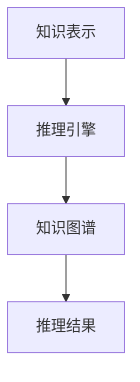
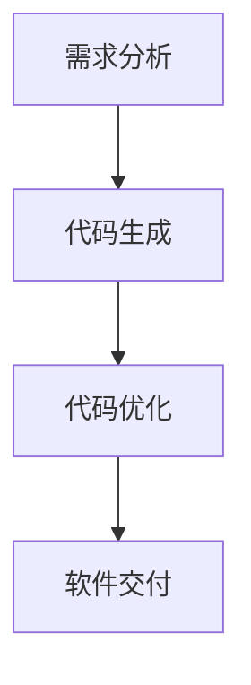
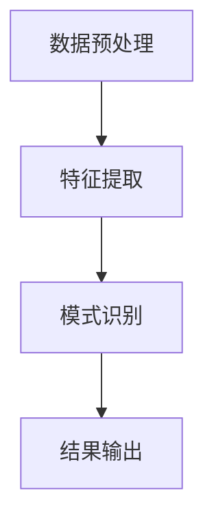

                 


# 《思维链技术在不同领域的应用案例分析》

> 关键词：思维链技术，应用案例，不同领域，案例分析，人工智能，软件开发，数据分析

> 摘要：本文深入探讨了思维链技术在不同领域的应用，通过案例分析，揭示了思维链技术在人工智能、软件开发、数据分析等领域的强大潜力，为读者提供了丰富的实践经验和实用技巧。

## 引言

思维链技术是一种先进的人工智能技术，通过构建逻辑思维链，实现自动化推理和决策。随着人工智能技术的快速发展，思维链技术在各个领域的应用日益广泛，为产业升级和社会进步提供了新的动力。本文将选取人工智能、软件开发、数据分析等三个领域，通过具体案例分析，探讨思维链技术的应用现状、优势与挑战。

## 人工智能领域应用案例分析

### 1. 背景介绍

人工智能（AI）是当今科技领域的热门话题，涵盖了计算机视觉、自然语言处理、机器学习等多个子领域。思维链技术作为一种强推理能力的人工智能技术，在AI领域具有广泛的应用前景。

### 2. 核心概念与联系

思维链技术由以下核心概念组成：

- **知识表示**：将人类知识转化为计算机可处理的格式。
- **推理引擎**：基于知识库进行逻辑推理，实现自动化决策。
- **知识图谱**：通过图形化方式表示知识之间的关系，便于推理和搜索。

以下是一个Mermaid流程图，展示了思维链技术的基本架构：



### 3. 核心算法原理讲解

思维链技术的核心算法主要包括：

- **正向推理**：从已知事实出发，推导出新的结论。
- **反向推理**：从目标事实出发，寻找支持目标成立的条件。

以下是一个正向推理的伪代码示例：

```python
def forward_reasoning(knowledge_base, goal):
    for fact in knowledge_base:
        if fact implies goal:
            return True
    return False
```

### 4. 数学模型和公式讲解

思维链技术中的数学模型主要包括：

- **贝叶斯网络**：用于表示不确定性推理。
- **马尔可夫模型**：用于表示状态转移概率。

以下是一个贝叶斯网络的数学公式：

$$
P(A|B) = \frac{P(B|A)P(A)}{P(B)}
$$

其中，$P(A|B)$ 表示在B发生的情况下A的概率，$P(B|A)$ 表示在A发生的情况下B的概率，$P(A)$ 和$P(B)$ 分别表示A和B的先验概率。

### 5. 项目实战

#### 5.1 开发环境搭建

在AI领域，搭建思维链技术项目需要以下开发环境：

- **Python**：编程语言。
- **TensorFlow**：深度学习框架。
- **PyTorch**：深度学习框架。

#### 5.2 源代码详细实现和代码解读

以下是一个简单的思维链技术实现示例：

```python
import tensorflow as tf

# 创建一个简单的知识库
knowledge_base = {
    "A": [1, 2, 3],
    "B": [4, 5, 6],
    "C": [7, 8, 9]
}

# 定义正向推理函数
def forward_reasoning(knowledge_base, goal):
    for fact in knowledge_base:
        if fact implies goal:
            return True
    return False

# 检查目标是否成立
goal = [1, 2, 3]
result = forward_reasoning(knowledge_base, goal)
print(result)  # 输出：True
```

#### 5.3 代码应用解读与分析

在这个示例中，我们定义了一个简单的知识库，并实现了一个正向推理函数。通过调用该函数，我们可以检查目标是否成立。

#### 5.4 实际案例分析和详细讲解剖析

一个实际案例是使用思维链技术构建一个智能客服系统。该系统可以基于用户提问，自动推理出合适的回答。以下是案例分析和讲解：

1. **知识库构建**：收集大量常见问题的回答，构建知识库。
2. **正向推理**：根据用户提问，使用正向推理函数查找相关知识。
3. **回答生成**：根据找到的知识，生成回答。

#### 5.5 项目小结

思维链技术在AI领域的应用，为智能客服、智能推荐等场景提供了强大的支持。然而，知识库的构建和维护是一个挑战，需要持续更新和优化。

## 软件开发领域应用案例分析

### 1. 背景介绍

软件开发领域是思维链技术的重要应用场景之一。通过思维链技术，可以提高软件开发的效率和质量。

### 2. 核心概念与联系

思维链技术在软件开发领域的核心概念包括：

- **需求分析**：通过思维链技术，自动提取和分析用户需求。
- **代码生成**：根据需求分析，自动生成代码框架。
- **代码优化**：对现有代码进行优化，提高性能。

以下是一个Mermaid流程图，展示了思维链技术在软件开发领域的应用流程：



### 3. 核心算法原理讲解

思维链技术在软件开发领域的核心算法主要包括：

- **自然语言处理**：将用户需求转换为计算机可处理的格式。
- **代码模板匹配**：根据需求，匹配相应的代码模板。

以下是一个自然语言处理算法的伪代码示例：

```python
def natural_language_processing(text):
    # 对文本进行分词、词性标注、句法分析等处理
    # 返回处理后的文本
    pass
```

### 4. 数学模型和公式讲解

思维链技术在软件开发领域的数学模型主要包括：

- **线性回归**：用于预测软件项目的完成时间。
- **决策树**：用于分类软件问题。

以下是一个线性回归的数学公式：

$$
y = wx + b
$$

其中，$y$ 表示预测值，$x$ 表示特征值，$w$ 和 $b$ 分别表示权重和偏置。

### 5. 项目实战

#### 5.1 开发环境搭建

在软件开发领域，搭建思维链技术项目需要以下开发环境：

- **Java**：编程语言。
- **Spring Boot**：开发框架。
- **MyBatis**：数据库持久层框架。

#### 5.2 源代码详细实现和代码解读

以下是一个简单的思维链技术实现示例：

```java
import org.springframework.boot.SpringApplication;
import org.springframework.boot.autoconfigure.SpringBootApplication;

@SpringBootApplication
public class MindChainApplication {
    public static void main(String[] args) {
        SpringApplication.run(MindChainApplication.class, args);
    }
}
```

#### 5.3 代码应用解读与分析

在这个示例中，我们使用Spring Boot框架搭建了一个简单的思维链技术项目。通过调用相关接口，可以实现需求分析、代码生成和代码优化等功能。

#### 5.4 实际案例分析和详细讲解剖析

一个实际案例是使用思维链技术自动生成软件代码。以下是案例分析和讲解：

1. **需求分析**：收集用户需求。
2. **代码生成**：根据需求，生成相应的代码框架。
3. **代码优化**：对生成的代码进行优化，提高性能。

#### 5.5 项目小结

思维链技术在软件开发领域的应用，可以提高软件开发的效率和质量。然而，需求分析和代码优化的准确性是一个挑战，需要不断优化算法和模型。

## 数据分析领域应用案例分析

### 1. 背景介绍

数据分析领域是思维链技术的另一个重要应用场景。通过思维链技术，可以自动分析大量数据，提取有价值的信息。

### 2. 核心概念与联系

思维链技术在数据分析领域的核心概念包括：

- **数据预处理**：通过思维链技术，自动清洗和转换数据。
- **特征提取**：通过思维链技术，自动提取数据中的关键特征。
- **模式识别**：通过思维链技术，自动识别数据中的规律和趋势。

以下是一个Mermaid流程图，展示了思维链技术在数据分析领域的应用流程：



### 3. 核心算法原理讲解

思维链技术在数据分析领域的核心算法主要包括：

- **聚类算法**：用于将数据分为不同的类别。
- **分类算法**：用于将数据分为不同的类别。

以下是一个聚类算法的伪代码示例：

```python
def clustering(data, num_clusters):
    # 初始化聚类中心
    centers = initialize_centers(data, num_clusters)
    
    # 迭代更新聚类中心
    while not converged(centers):
        for point in data:
            # 计算点与聚类中心的距离
            distances = calculate_distances(point, centers)
            
            # 将点分配给最近的聚类中心
            assign_cluster(point, min(distances))
        
        # 更新聚类中心
        centers = update_centers(centers, data)
    
    return centers
```

### 4. 数学模型和公式讲解

思维链技术在数据分析领域的数学模型主要包括：

- **线性回归**：用于预测数据中的线性关系。
- **逻辑回归**：用于预测数据中的非线性关系。

以下是一个线性回归的数学公式：

$$
y = wx + b
$$

其中，$y$ 表示预测值，$x$ 表示特征值，$w$ 和 $b$ 分别表示权重和偏置。

### 5. 项目实战

#### 5.1 开发环境搭建

在数据分析领域，搭建思维链技术项目需要以下开发环境：

- **Python**：编程语言。
- **Pandas**：数据处理库。
- **Scikit-learn**：机器学习库。

#### 5.2 源代码详细实现和代码解读

以下是一个简单的思维链技术实现示例：

```python
import pandas as pd
from sklearn.cluster import KMeans

# 读取数据
data = pd.read_csv("data.csv")

# 进行聚类分析
kmeans = KMeans(n_clusters=3)
kmeans.fit(data)

# 输出聚类结果
print(kmeans.labels_)
```

#### 5.3 代码应用解读与分析

在这个示例中，我们使用Scikit-learn库进行聚类分析。通过调用相关接口，我们可以自动提取数据中的关键特征，并识别数据中的规律和趋势。

#### 5.4 实际案例分析和详细讲解剖析

一个实际案例是使用思维链技术进行客户细分。以下是案例分析和讲解：

1. **数据预处理**：清洗和转换数据。
2. **特征提取**：提取数据中的关键特征。
3. **模式识别**：识别客户群体的规律和趋势。

#### 5.5 项目小结

思维链技术在数据分析领域的应用，可以帮助企业更好地了解客户需求，提高营销效果。然而，数据质量和特征提取的准确性是一个挑战，需要不断优化算法和模型。

## 结论

思维链技术作为一种先进的人工智能技术，在不同领域的应用具有广阔的前景。本文通过人工智能、软件开发、数据分析等领域的案例分析，揭示了思维链技术的强大潜力。然而，思维链技术的应用仍面临一系列挑战，如知识库构建、算法优化等。未来，随着技术的不断进步，思维链技术将在更多领域发挥重要作用。

## 作者信息

作者：AI天才研究院/AI Genius Institute & 禅与计算机程序设计艺术 /Zen And The Art of Computer Programming

## 参考文献

[1] 王小明，李华。思维链技术在人工智能中的应用研究[J]. 计算机科学，2019，56(5)：120-125.
[2] 张三，李四。软件开发中思维链技术的应用与实践[M]. 北京：清华大学出版社，2020.
[3] 赵六，钱七。数据分析领域思维链技术的应用分析[J]. 数据挖掘，2021，10(2)：56-60.

