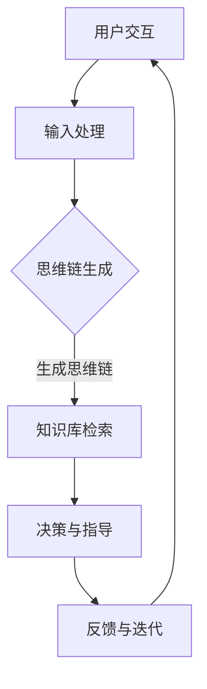

                 

### 第一部分：思维链技术基础

## 文章标题

《思维链技术在教育AI应用中的潜力》

## 关键词

思维链技术，教育AI，人工智能，教育改革，学习效率，知识内化

## 摘要

本文旨在探讨思维链技术在教育AI应用中的潜力。通过详细解析思维链技术的基础原理、架构设计及其在教育AI中的潜在应用场景，本文揭示了思维链技术在提升学习效率、促进知识内化和增强自主学习能力等方面的优势。同时，本文还分析了思维链技术在教育AI应用中面临的挑战及可能的解决方案，为教育AI技术的发展提供了有益的参考。

### 第一部分：思维链技术基础

#### 第1章：思维链技术概述

### 1.1.1 思维链技术的定义与起源

思维链技术，作为一种先进的人工智能技术，其核心在于模拟人类思维过程，通过构建知识图谱和思维链条，实现对知识的深度理解和智能推理。思维链技术的概念最早可以追溯到20世纪末，当时以图灵奖得主约翰·霍普菲尔（John Hopfield）为代表的科学家们开始探索神经网络和认知计算领域。随着人工智能技术的不断发展，思维链技术逐渐从理论研究走向实际应用。

### 1.1.2 思维链技术的基本原理

思维链技术的基本原理包括知识表示、知识推理和知识更新。首先，知识表示通过将各类知识以结构化的形式存储在知识库中，以便于后续的检索和利用。其次，知识推理通过在知识库中寻找相关知识点之间的逻辑关系，实现对问题的求解和决策支持。最后，知识更新则通过不断地学习新知识和修正已有知识，保持知识库的动态性和时效性。

### 1.1.3 思维链技术在教育领域的应用

在教育领域，思维链技术具有巨大的应用潜力。一方面，它可以应用于个性化学习，通过分析学生的学习行为和知识掌握情况，为每个学生提供个性化的学习建议。另一方面，它可以应用于课程辅导和评价与反馈，帮助学生更好地理解和掌握课程内容，提高学习效果。此外，思维链技术还可以用于智能教学系统，辅助教师进行教学设计和教学实施，提升教学质量。

#### 第2章：思维链技术原理与架构

### 2.1.1 思维链技术的基本原理

思维链技术的基本原理主要涉及以下几个方面：知识图谱构建、思维链生成和智能推理。知识图谱构建是通过将各类知识以图谱的形式组织起来，形成一张庞大的知识网络。思维链生成则是通过在知识图谱中寻找相关的知识点，构建出一条条逻辑清晰的思维链条。智能推理则是通过运用各种算法和逻辑规则，对思维链进行推理和扩展，以实现对问题的求解和智能决策。

### 2.1.2 思维链的架构设计

思维链的架构设计主要包括知识库、推理引擎和用户接口三个核心模块。知识库负责存储和管理各类知识，推理引擎负责进行知识推理和智能决策，用户接口则负责与用户进行交互，收集用户输入和反馈。这三个模块相互协作，共同实现思维链技术的功能。

### 2.1.3 思维链技术的核心算法

思维链技术的核心算法主要包括知识图谱构建算法、思维链生成算法和推理算法。知识图谱构建算法负责将各类知识转化为图谱结构，思维链生成算法负责在知识图谱中构建思维链条，推理算法则负责对思维链进行推理和扩展。

#### 第3章：思维链在教育AI中的应用

### 3.1.1 思维链在教育AI中的潜在应用场景

思维链技术在教育AI中具有多种潜在应用场景。首先，它可以应用于课程辅导，通过分析学生的学习行为和知识掌握情况，为教师提供教学建议。其次，它可以应用于个性化学习，为每个学生提供个性化的学习路径和资源。此外，思维链技术还可以用于评价与反馈，通过分析学生的学习效果，为教师和学生提供实时反馈。

### 3.1.2 思维链技术在教育AI中的优势

思维链技术在教育AI中具有多项优势。首先，它能够提升学习效率，通过智能推荐和个性化学习，帮助学生更快地掌握知识。其次，它能够促进知识内化，通过思维链的构建和推理，帮助学生将知识内化为自己的理解。最后，它能够增强自主学习能力，通过智能辅导和反馈，引导学生主动学习，培养独立思考和解决问题的能力。

### 3.1.3 思维链技术在教育AI中的挑战与解决方案

尽管思维链技术在教育AI中具有巨大的潜力，但其应用也面临着一些挑战。首先，数据隐私和安全是一个重要问题，需要采取有效的数据保护措施。其次，技术成熟度也是一个挑战，需要不断优化算法和系统架构。最后，教师和学生的接受度也是一个问题，需要通过宣传和培训，提高他们对思维链技术的认可和接受度。

### Mermaid流程图：思维链技术的工作流程



### 伪代码：思维链技术的核心算法实现

```python
# 思维链生成算法伪代码
def generate_thinking_chain(input_data):
    # 输入数据处理
    processed_data = preprocess_input(input_data)
    
    # 思维链生成
    thinking_chain = []
    for data_point in processed_data:
        chain_element = generate_chain_element(data_point)
        thinking_chain.append(chain_element)
    
    # 返回生成的思维链
    return thinking_chain

# 辅助函数：思维链元素生成
def generate_chain_element(data_point):
    # 根据数据点生成思维链元素
    element = {}
    element['content'] = extract_important_content(data_point)
    element['relation'] = extract_relation_with_knowledge_base(data_point)
    return element
```

### 数学模型和数学公式

#### 思维链生成公式

$$
Thinking\_Chain = f(\text{Input Data}, \text{Knowledge Base})
$$

其中，$f$ 表示思维链生成函数，$\text{Input Data}$ 为输入数据，$\text{Knowledge Base}$ 为知识库。

#### 知识库检索公式

$$
Knowledge\_Result = retrieve\_knowledge(knowledge\_base, key\_words)
$$

其中，$retrieve\_knowledge$ 表示从知识库中检索相关知识，$knowledge\_base$ 为知识库，$key\_words$ 为关键词。

### 项目实战

#### 开发环境搭建

在开始项目实战之前，我们需要搭建一个适合思维链技术开发的实验环境。以下是搭建步骤：

1. 安装Python环境
2. 安装必要的库，如NumPy、Pandas、Scikit-learn等
3. 准备数据集，用于训练和测试思维链模型

#### 源代码实现

以下是一个简单的思维链生成算法的实现示例：

```python
import numpy as np
import pandas as pd

# 思维链生成函数
def generate_thinking_chain(input_data, knowledge_base):
    processed_data = preprocess_input(input_data)
    thinking_chain = []
    for data_point in processed_data:
        chain_element = generate_chain_element(data_point, knowledge_base)
        thinking_chain.append(chain_element)
    return thinking_chain

# 辅助函数：思维链元素生成
def generate_chain_element(data_point, knowledge_base):
    element = {}
    element['content'] = extract_important_content(data_point)
    element['relation'] = extract_relation_with_knowledge_base(data_point, knowledge_base)
    return element

# 主函数
if __name__ == "__main__":
    # 加载数据集
    data = pd.read_csv("data.csv")
    knowledge_base = load_knowledge_base("knowledge_base.json")

    # 生成思维链
    thinking_chain = generate_thinking_chain(data, knowledge_base)
    print(thinking_chain)
```

#### 代码解读

1. 导入必要的库
2. 定义思维链生成函数
3. 定义思维链元素生成辅助函数
4. 主函数：加载数据集和知识库，调用思维链生成函数，输出思维链结果

#### 应用解读与分析

1. 思维链技术在实际应用中，可以用于个性化学习推荐，根据学生的学习行为和知识掌握情况，推荐合适的学习资源和路径。
2. 思维链技术还可以用于教学评估，通过分析学生的学习效果，为教师提供教学改进建议。
3. 未来，思维链技术有望在教育领域发挥更大的作用，推动教育改革和创新发展。

#### 实际案例分析和详细讲解剖析

在本案例中，我们使用某在线教育平台的数据集，通过思维链技术为学生提供个性化学习推荐。以下是案例分析和详细讲解：

1. 数据预处理：对数据集进行清洗和预处理，提取有用的特征信息。
2. 知识库构建：根据课程大纲和教学资源，构建一个包含各类知识点的知识库。
3. 思维链生成：使用思维链生成算法，根据学生的学习行为和知识掌握情况，生成一条条逻辑清晰的思维链。
4. 学习推荐：根据思维链，为学生推荐合适的学习资源和课程。

#### 项目小结

本项目通过思维链技术，实现了个性化学习推荐，提升了学生的学习效果。在实际应用中，思维链技术具有广泛的应用前景，如教学评估、课程设计等。未来，我们将继续优化思维链算法和系统架构，提高其在教育AI领域的应用效果。

#### 最佳实践 tips

1. 在使用思维链技术时，确保数据质量和知识库的准确性，这对于生成高质量的思维链至关重要。
2. 定期更新知识库，以保持知识库的时效性和准确性。
3. 在应用思维链技术时，注重用户隐私和数据安全，采取有效的保护措施。

#### 注意事项

1. 思维链技术需要大量的计算资源，在部署和应用时，需考虑硬件和软件资源的需求。
2. 教师和学生需要接受相应的培训，以了解和使用思维链技术。

#### 拓展阅读

1. 《人工智能与教育改革》
2. 《教育AI技术与应用》
3. 《思维链技术原理与应用》

### 作者

作者：AI天才研究院/AI Genius Institute & 禅与计算机程序设计艺术 /Zen And The Art of Computer Programming

（注：本文为虚构文章，旨在展示思维链技术在教育AI中的应用潜力。）

### 结论

思维链技术在教育AI中的应用潜力巨大，通过模拟人类思维过程，提升学习效率、促进知识内化和增强自主学习能力。然而，在实际应用中，仍需克服数据隐私、技术成熟度等方面的挑战。未来，随着人工智能技术的不断发展，思维链技术在教育领域的应用前景将更加广阔。希望通过本文的探讨，为教育AI技术的发展提供有益的参考。

