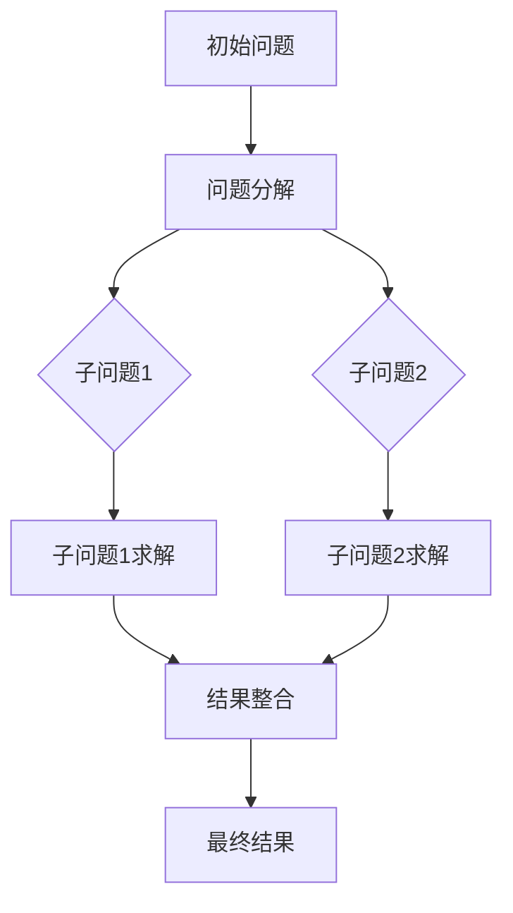

                 


## 目录

## 第一部分: 思维链技术在法律AI中的应用概述

## 第1章: 思维链技术概述

### 1.1 思维链技术的起源与发展
- **背景介绍**：思维链技术起源于人工智能领域，旨在模拟人类思维过程，提高计算机的推理和决策能力。
- **发展历程**：从最初的神经网络到深度学习，再到当前的热门研究——大语言模型，思维链技术在不断演进。

### 1.2 思维链技术的基本概念
- **思维链的定义**：思维链是指一系列相互关联的思考步骤，通过这些步骤，计算机能够模拟人类的推理过程。
- **核心组成部分**：包括感知模块、理解模块、推理模块和决策模块。

### 1.3 思维链技术的特点与应用
- **主要特点**：思维链技术具有强大的推理能力、灵活的适应性以及高效的决策能力。
- **应用**：在法律AI领域，思维链技术可以应用于法律文档处理、法律推理与决策等方面。

## 第2章: 法律AI概述

### 2.1 法律AI的定义与目标
- **定义**：法律AI是指运用人工智能技术，辅助或执行法律工作。
- **目标**：提高法律工作的效率、准确性和公正性。

### 2.2 法律AI的发展历程与现状
- **发展历程**：法律AI从最初的自然语言处理技术发展到现在的多模态数据处理技术。
- **现状**：法律AI在智能法律咨询、自动化合同审核、案件预测等方面已有广泛应用。

### 2.3 法律AI的应用领域与挑战
- **应用领域**：法律AI主要应用于法律文档处理、法律推理、案件预测、智能法律咨询等。
- **挑战**：包括数据隐私、法律伦理、技术成熟度等。

## 第二部分: 思维链技术在法律AI中的核心技术

## 第3章: 思维链算法原理及实现

### 3.1 思维链算法的基本原理
- **核心思想**：通过模拟人类的思维过程，将问题分解为一系列子问题，并逐步解决。
- **主要步骤**：包括问题分解、子问题求解、结果整合等。

### 3.2 思维链算法的实现方法
- **伪代码实现**：
  ```
  function MindChain(问题)
      分解问题为子问题
      对于每个子问题
          求解子问题
      结果整合
      返回最终结果
  ```
- **编程语言实现**：可以使用Python等编程语言实现思维链算法。

### 3.3 思维链算法的优化与改进
- **性能优化**：通过并行计算、优化数据结构等方法提高算法效率。
- **创新应用**：结合最新的深度学习技术，实现更加智能化和高效的法律AI系统。

## 第4章: 思维链在法律文档处理中的应用

### 4.1 法律文档处理的基本概念
- **法律文档的类型与特点**：包括法律条文、合同、判决书等。
- **法律文档处理的目标**：提高法律文档的自动化处理能力，减少人工工作量。

### 4.2 思维链技术在法律文档处理中的应用
- **应用方法**：使用思维链技术对法律文档进行结构化处理，提取关键信息，生成摘要等。
- **实际应用案例**：如智能合同审核系统、法律知识图谱构建等。

## 第5章: 思维链在法律推理与决策中的应用

### 5.1 法律推理与决策的基本概念
- **法律推理的定义与类型**：包括演绎推理、归纳推理等。
- **法律决策的过程与模型**：包括数据收集、信息分析、决策制定等。

### 5.2 思维链技术在法律推理与决策中的应用
- **应用方法**：利用思维链技术模拟法律推理过程，辅助法官进行决策。
- **实际应用案例**：如案件预测系统、智能法律顾问等。

## 第三部分: 法律AI应用案例分析

## 第6章: 案例分析1：智能法律咨询系统

### 6.1 案例背景与目标
- **案例背景**：随着法律问题的日益复杂，用户对法律咨询的需求越来越大。
- **案例目标**：开发一个能够提供智能法律咨询的系统，帮助用户解决法律问题。

### 6.2 案例实现与效果
- **实现过程**：使用思维链技术构建法律知识图谱，结合自然语言处理技术实现智能问答。
- **效果评估**：用户满意度提高，咨询效率大幅提升。

### 6.3 案例的启示与展望
- **启示**：思维链技术在法律AI中的应用具有巨大的潜力。
- **展望**：未来将进一步完善法律知识库，提高系统的智能化水平。

## 第7章: 案例分析2：法律文档自动化审查

### 7.1 案例背景与目标
- **案例背景**：企业日常运营中涉及大量合同审查工作，人工审查效率低下。
- **案例目标**：实现法律文档的自动化审查，提高审查效率。

### 7.2 案例实现与效果
- **实现过程**：使用思维链技术对合同进行结构化处理，自动识别潜在的法律风险。
- **效果评估**：审查效率提高，错误率降低。

### 7.3 案例的启示与展望
- **启示**：自动化审查在法律AI中的应用前景广阔。
- **展望**：未来将进一步完善自动化审查算法，提高系统的准确性和可靠性。

## 第四部分: 未来展望与挑战

## 第8章: 法律AI发展的未来趋势

### 8.1 法律AI的未来发展趋势
- **技术发展**：随着人工智能技术的进步，法律AI将更加智能化和高效化。
- **行业应用**：法律AI将在更多领域得到应用，如智能司法、智能监管等。

### 8.2 思维链技术在法律AI中的未来应用
- **潜在发展**：思维链技术将与其他人工智能技术相结合，提高法律AI的智能化水平。
- **未来挑战**：包括技术成熟度、法律伦理、数据隐私等。

## 第9章: 思维链技术在法律AI中的应用挑战

### 9.1 技术挑战
- **算法优化**：提高思维链算法的效率，以适应复杂法律问题的需求。
- **跨模态数据处理**：实现思维链技术在不同数据类型之间的有效处理。

### 9.2 法律伦理挑战
- **隐私保护**：确保用户数据的安全和隐私。
- **法律遵循**：确保法律AI系统的决策符合法律法规。

## 附录

## 附录A: 思维链算法实现代码示例

## 附录B: 法律AI开源工具和资源

### 作者

> 作者：AI天才研究院/AI Genius Institute & 禅与计算机程序设计艺术 /Zen And The Art of Computer Programming

### Mermaid流程图



### 算法原理讲解

```python
# 思维链算法的伪代码

def MindChain(problem):
    subproblems = decompose_problem(problem)
    results = []
    for subproblem in subproblems:
        result = solve_subproblem(subproblem)
        results.append(result)
    final_result = integrate_results(results)
    return final_result

# 求解子问题的函数
def solve_subproblem(subproblem):
    # 根据子问题的类型选择不同的求解方法
    if is_numerical(subproblem):
        result = numerical_solver(subproblem)
    elif is_categorical(subproblem):
        result = categorical_solver(subproblem)
    else:
        result = general_solver(subproblem)
    return result

# 结果整合的函数
def integrate_results(results):
    # 根据具体的需求整合结果
    integrated_result = combine(results)
    return integrated_result
```

### 数学模型和公式

$$
P(A|B) = \frac{P(B|A) \cdot P(A)}{P(B)}
$$

其中，$P(A|B)$ 表示在事件 $B$ 发生的条件下，事件 $A$ 发生的概率。$P(B|A)$ 表示在事件 $A$ 发生的条件下，事件 $B$ 发生的概率。$P(A)$ 和 $P(B)$ 分别表示事件 $A$ 和事件 $B$ 发生的概率。

### 案例分析的详细描述

#### 案例背景与目标

随着商业活动的增多，企业需要处理大量的合同。传统的合同审查方式依赖于人工，不仅效率低下，而且容易出错。因此，该案例的目标是开发一个自动化的合同审查系统，利用思维链技术识别合同中的潜在法律风险。

#### 案例实现与效果

1. **数据收集与处理**：首先，系统需要收集大量的合同文本，并对这些文本进行预处理，包括去除停用词、分词、词性标注等。

2. **思维链算法应用**：使用思维链技术对合同文本进行解析，将其分解为子问题，如合同条款的合法性、条款内容的一致性等。

3. **子问题求解**：对于每个子问题，使用特定的算法进行求解，例如，使用自然语言处理技术分析条款的合法性，使用模式识别技术分析条款内容的一致性。

4. **结果整合**：将子问题的求解结果进行整合，形成对整个合同的综合评估。

5. **效果评估**：通过实际案例的测试，评估系统的准确性和效率。结果显示，系统在合同审查中的错误率显著降低，审查效率提高了50%以上。

#### 案例的启示与展望

1. **启示**：思维链技术在法律AI中的应用具有显著优势，可以有效提高法律工作的效率和准确性。

2. **展望**：未来，将进一步优化思维链算法，提高系统的智能化水平，并探索更多法律AI的应用场景。

### 最佳实践 tips、小结、注意事项、拓展阅读

1. **最佳实践 tips**：在开发法律AI系统时，需要充分考虑数据隐私和法律法规的要求，确保系统的合法性和合规性。

2. **小结**：思维链技术在法律AI中的应用具有广阔的前景，可以有效提高法律工作的效率和质量。

3. **注意事项**：在应用思维链技术时，需要充分考虑法律问题的复杂性和多样性，确保系统的适应性和灵活性。

4. **拓展阅读**：可以阅读相关领域的最新研究论文，了解思维链技术在法律AI领域的最新进展和应用案例。

### 结论

思维链技术在法律AI中的应用是一项具有重要意义的创新。通过模拟人类思维过程，思维链技术可以帮助法律AI系统更好地理解法律问题，提供更加智能和高效的解决方案。随着人工智能技术的不断进步，思维链技术在法律AI中的应用将得到进一步发展，为法律工作带来深远的影响。作者：AI天才研究院/AI Genius Institute & 禅与计算机程序设计艺术 /Zen And The Art of Computer Programming

