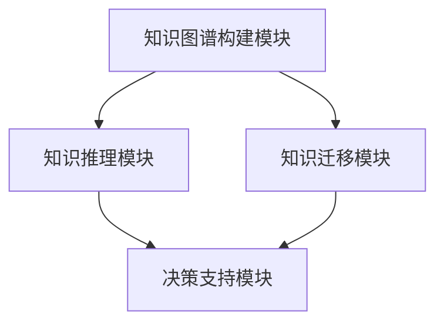

                 

# 文章标题：思维链技术在科学研究AI辅助中的应用

## 文章关键词
- 思维链
- 人工智能
- 科学研究
- AI辅助
- 知识图谱
- 知识推理
- 机器学习

## 摘要
本文旨在探讨思维链技术在科学研究AI辅助中的应用。首先，介绍了思维链技术的核心概念和原理，并阐述了其在科学研究中的重要性和优势。接着，详细分析了思维链技术在知识表示、知识推理、知识迁移等方面的应用，通过实际案例展示了其在科学研究中的效果。最后，讨论了思维链技术在科学研究AI辅助中的未来发展趋势和挑战。

---

## 第1章 引言

### 1.1 研究背景与意义

科学研究的进步一直以来都是人类社会发展的驱动力。然而，随着科技的飞速发展，科学研究面临着前所未有的复杂性和挑战性。传统的科学研究方法往往依赖于大量的实验数据和理论知识，而现代科学研究的复杂性使得这些方法难以应对。

近年来，人工智能（AI）技术的飞速发展为科学研究带来了新的机遇。AI技术能够在大数据分析、模式识别、仿真模拟等方面提供强大的支持，从而提升科学研究的效率和准确性。

思维链技术作为AI技术的一个重要分支，其在科学研究中的应用前景广阔。思维链技术通过模拟人类思维过程，将知识表示、推理和迁移等过程进行自动化，从而实现对科学研究的辅助。

### 1.2 思维链技术简介

思维链技术是一种基于知识表示和推理的智能技术，它通过构建知识图谱、进行知识推理和迁移，实现对复杂问题的求解和决策支持。

思维链技术的核心是知识表示，它将人类知识和经验以计算机可理解的形式进行编码和存储。知识表示包括概念、关系、事实等多种形式，从而为知识推理提供基础。

知识推理是思维链技术的关键环节，它通过推理算法，从已知的事实和规则中推导出新的结论。知识推理包括逻辑推理、统计推理和模糊推理等多种形式，能够处理复杂的不确定性问题和矛盾。

知识迁移是指将已有的知识和经验应用到新的领域或问题中。思维链技术通过知识迁移，能够快速适应新的研究环境和问题，提高科学研究的效率。

### 1.3 书籍结构概述

本书的主要内容包括：

- **第1章 引言**：介绍研究的背景和意义，引出思维链技术在科学研究中的应用。
- **第2章 思维链技术原理**：详细阐述思维链技术的核心概念、模型架构和算法原理。
- **第3章 科学研究中的AI应用**：分析AI在科学研究中的应用现状、案例和挑战。
- **第4章 思维链技术在科学研究中的应用**：探讨思维链技术在科学文献分析、实验设计和科学决策中的应用。
- **第5章 实践案例与分析**：通过具体案例展示思维链技术在科学研究中的实际应用。
- **第6章 未来展望与挑战**：讨论思维链技术的未来发展、科学研究AI辅助的挑战和机遇。
- **第7章 总结与展望**：总结全书内容，展望未来研究方向和应用前景。

本书的目标读者是从事科学研究和AI领域的科研人员、工程师和研究生，以及对此领域感兴趣的读者。本书力求通过系统、详细的讲解，帮助读者深入理解思维链技术在科学研究AI辅助中的应用。

### 1.4 学习建议与资源推荐

为了更好地学习和应用思维链技术，读者可以参考以下建议和资源：

- **学习建议**：
  - 理解思维链技术的核心概念和原理，特别是知识表示、推理和迁移。
  - 通过实践案例，深入理解思维链技术在科学研究中的应用。
  - 结合具体研究课题，探索思维链技术的创新应用。

- **资源推荐**：
  - **书籍**：《人工智能：一种现代方法》、《深度学习》、《图计算》
  - **论文**：相关领域的最新研究论文，特别是关于思维链技术、知识图谱和机器学习的论文。
  - **在线课程**：推荐学习AI和机器学习的基础课程，如Coursera、edX等平台上的课程。

通过以上学习资源，读者可以系统地掌握思维链技术在科学研究AI辅助中的应用，为科学研究提供新的思路和方法。接下来，我们将进一步探讨思维链技术的原理和应用。

## 第2章 思维链技术原理

### 2.1 思维链核心概念

思维链技术是一种基于知识表示和推理的智能技术，其核心概念包括知识表示、知识推理和知识迁移。这些概念构成了思维链技术的理论基础，为科学研究提供了有效的AI辅助。

**2.1.1 知识表示**

知识表示是思维链技术的关键环节，它将人类知识和经验以计算机可理解的形式进行编码和存储。知识表示主要包括以下几种形式：

- **概念表示**：用符号或词汇表示抽象概念，如“人”、“动物”等。
- **关系表示**：用符号或词汇表示概念之间的关系，如“属于”、“是”等。
- **事实表示**：用符号或词汇表示具体的事实，如“狗是动物”等。

**2.1.2 知识推理**

知识推理是思维链技术的核心，它通过推理算法，从已知的事实和规则中推导出新的结论。知识推理包括以下几种形式：

- **逻辑推理**：基于逻辑规则进行推理，如演绎推理、归纳推理等。
- **统计推理**：基于统计数据和概率模型进行推理，如贝叶斯推理、隐马尔可夫模型等。
- **模糊推理**：基于模糊逻辑进行推理，适用于处理不确定性和模糊性。

**2.1.3 知识迁移**

知识迁移是指将已有的知识和经验应用到新的领域或问题中。知识迁移有助于缩短研究周期、提高研究效率。知识迁移包括以下几种方式：

- **领域迁移**：将某个领域的知识应用到另一个领域，如将医疗领域的知识应用到金融领域。
- **任务迁移**：将某个任务的知识应用到其他任务，如将图像识别的知识应用到自然语言处理。
- **数据迁移**：将某个数据集的知识应用到其他数据集，如将训练数据的知识应用到测试数据。

### 2.2 思维链模型架构

思维链模型架构是思维链技术的核心，它通过构建知识图谱、进行知识推理和迁移，实现对复杂问题的求解和决策支持。思维链模型架构主要包括以下几个组件：

- **知识图谱构建模块**：负责构建知识图谱，将人类知识和经验以计算机可理解的形式进行编码和存储。知识图谱构建模块包括概念、关系和事实的表示和存储。
- **知识推理模块**：负责进行知识推理，从已知的事实和规则中推导出新的结论。知识推理模块包括逻辑推理、统计推理和模糊推理等。
- **知识迁移模块**：负责进行知识迁移，将已有的知识和经验应用到新的领域或问题中。知识迁移模块包括领域迁移、任务迁移和数据迁移等。
- **决策支持模块**：负责提供决策支持，根据知识推理和迁移的结果，为科学研究提供指导和建议。

下面是一个简单的思维链模型架构的Mermaid流程图：



### 2.3 思维链算法原理

思维链算法原理是思维链技术的核心，它通过一系列算法，实现对知识的表示、推理和迁移。下面将介绍几种常用的思维链算法原理。

**2.3.1 知识表示算法**

知识表示算法是将人类知识和经验转化为计算机可理解的形式。常用的知识表示算法包括：

- **本体论表示算法**：基于本体论构建知识表示模型，将概念、关系和事实表示为本体实体和关系。
- **知识图谱表示算法**：基于知识图谱构建知识表示模型，将概念、关系和事实表示为节点和边。
- **语义网络表示算法**：基于语义网络构建知识表示模型，将概念、关系和事实表示为语义节点和语义边。

下面是知识表示算法的伪代码：

```python
def knowledge_representation(data):
    # 输入：数据（概念、关系和事实）
    # 输出：知识表示模型（本体论、知识图谱、语义网络）

    # 步骤1：预处理数据
    preprocessed_data = preprocess_data(data)

    # 步骤2：构建本体论表示模型
    ontology_model = build_ontology_model(preprocessed_data)

    # 步骤3：构建知识图谱表示模型
    knowledge_graph_model = build_knowledge_graph_model(preprocessed_data)

    # 步骤4：构建语义网络表示模型
    semantic_network_model = build_semantic_network_model(preprocessed_data)

    # 返回知识表示模型
    return ontology_model, knowledge_graph_model, semantic_network_model
```

**2.3.2 知识推理算法**

知识推理算法是思维链技术的核心，它通过推理算法，从已知的事实和规则中推导出新的结论。常用的知识推理算法包括：

- **逻辑推理算法**：基于逻辑规则进行推理，如演绎推理、归纳推理等。
- **统计推理算法**：基于统计数据和概率模型进行推理，如贝叶斯推理、隐马尔可夫模型等。
- **模糊推理算法**：基于模糊逻辑进行推理，适用于处理不确定性和模糊性。

下面是知识推理算法的伪代码：

```python
def knowledge_reasoning(knowledge_model, rules):
    # 输入：知识表示模型、规则
    # 输出：推理结果

    # 步骤1：初始化推理结果
    reasoning_results = []

    # 步骤2：应用逻辑推理算法
    reasoning_results.extend(logical_reasoning(knowledge_model, rules))

    # 步骤3：应用统计推理算法
    reasoning_results.extend(statistical_reasoning(knowledge_model, rules))

    # 步骤4：应用模糊推理算法
    reasoning_results.extend(fuzzy_reasoning(knowledge_model, rules))

    # 返回推理结果
    return reasoning_results
```

**2.3.3 知识迁移算法**

知识迁移算法是思维链技术的重要部分，它通过知识迁移，将已有的知识和经验应用到新的领域或问题中。常用的知识迁移算法包括：

- **领域迁移算法**：将某个领域的知识应用到另一个领域。
- **任务迁移算法**：将某个任务的知识应用到其他任务。
- **数据迁移算法**：将某个数据集的知识应用到其他数据集。

下面是知识迁移算法的伪代码：

```python
def knowledge_migration(source_knowledge_model, target_knowledge_model):
    # 输入：源知识表示模型、目标知识表示模型
    # 输出：迁移结果

    # 步骤1：初始化迁移结果
    migration_results = []

    # 步骤2：应用领域迁移算法
    migration_results.extend(domain_migration(source_knowledge_model, target_knowledge_model))

    # 步骤3：应用任务迁移算法
    migration_results.extend(task_migration(source_knowledge_model, target_knowledge_model))

    # 步骤4：应用数据迁移算法
    migration_results.extend(data_migration(source_knowledge_model, target_knowledge_model))

    # 返回迁移结果
    return migration_results
```

### 2.4 思维链技术评估

思维链技术的评估是衡量其性能和效果的重要手段。评估主要包括以下几个方面：

**2.4.1 性能指标**

- **推理速度**：推理速度是评估思维链技术性能的重要指标，它反映了思维链技术在处理大规模数据时的效率。
- **推理准确性**：推理准确性是评估思维链技术效果的重要指标，它反映了思维链技术推理结果的可靠性。
- **知识迁移效果**：知识迁移效果是评估思维链技术在不同领域或任务中应用能力的重要指标。

**2.4.2 评估方法**

- **实验评估**：通过设计实验，收集数据，对比不同思维链技术的性能和效果，从而评估其优劣。
- **用户满意度评估**：通过用户调查和反馈，了解用户对思维链技术的满意度和使用体验，从而评估其应用效果。

### 2.5 总结

思维链技术是一种基于知识表示和推理的智能技术，其在科学研究中的应用具有重要意义。本章介绍了思维链技术的核心概念、模型架构、算法原理和评估方法，为后续章节的详细讨论奠定了基础。

### 2.6 思维链技术在科学研究中的应用前景

思维链技术作为一种先进的AI技术，其在科学研究中的应用前景广阔。以下从几个方面讨论思维链技术在科学研究中的应用前景：

**2.6.1 数据分析**

在科学研究过程中，数据分析是一个关键环节。思维链技术可以通过知识表示和推理，对大规模复杂数据进行分析，提取有价值的信息和知识。例如，在基因组学研究中，思维链技术可以用于基因关系分析、疾病预测等方面。

**2.6.2 模式识别**

模式识别是科学研究中的一个重要任务。思维链技术可以通过知识表示和推理，识别出数据中的模式和规律，从而帮助科学家发现新的研究问题和方向。例如，在气候变化研究中，思维链技术可以用于识别气候变化的模式和趋势。

**2.6.3 仿真模拟**

仿真模拟是科学研究中的重要工具。思维链技术可以通过知识表示和推理，构建复杂的仿真模型，模拟现实世界中的各种现象和过程。例如，在药物研发中，思维链技术可以用于药物作用机理的仿真模拟，从而加速药物研发进程。

**2.6.4 决策支持**

在科学研究中，决策支持至关重要。思维链技术可以通过知识表示和推理，为科学家提供智能化的决策支持。例如，在科研项目规划中，思维链技术可以用于评估不同项目的风险和收益，为科学家提供最优的决策方案。

### 2.7 思维链技术在科学研究中的应用现状

尽管思维链技术在科学研究中的应用前景广阔，但目前其应用仍处于初级阶段。以下从几个方面讨论思维链技术在科学研究中的应用现状：

**2.7.1 数据处理能力不足**

当前，许多科学研究中的数据量庞大且复杂，现有的思维链技术难以在短时间内处理如此大规模的数据。因此，提高思维链技术的数据处理能力是当前的一个重要研究方向。

**2.7.2 知识表示和推理能力不足**

知识表示和推理是思维链技术的核心。当前，思维链技术的知识表示和推理能力仍有待提高，特别是在处理不确定性和模糊性问题时，其效果仍有待进一步优化。

**2.7.3 应用场景局限**

目前，思维链技术在科学研究中的应用场景相对有限，主要集中在数据分析和模式识别等领域。未来，需要进一步探索思维链技术在其他领域的应用潜力。

### 2.8 未来研究方向与挑战

思维链技术在科学研究中的应用虽然取得了一定的成果，但仍面临着许多挑战和瓶颈。以下从几个方面讨论未来研究方向与挑战：

**2.8.1 数据处理能力的提升**

随着科学研究数据的不断增长，提升思维链技术的数据处理能力是未来的一个重要研究方向。可以通过优化算法、提高硬件性能等方式，提高思维链技术的数据处理效率。

**2.8.2 知识表示和推理能力的增强**

知识表示和推理是思维链技术的核心。未来，需要进一步研究和开发新的知识表示和推理算法，提高其在处理不确定性和模糊性问题时的效果。

**2.8.3 应用场景的拓展**

当前，思维链技术在科学研究中的应用场景相对有限。未来，需要进一步探索思维链技术在其他领域的应用潜力，如生物医学、环境科学、材料科学等。

**2.8.4 知识库的构建与维护**

知识库是思维链技术的基础。未来，需要研究和开发高效的构建和维护知识库的方法，确保知识库的准确性和完整性。

### 2.9 总结

本章介绍了思维链技术的核心概念、模型架构、算法原理和评估方法，并探讨了其在科学研究中的应用前景和现状。未来，随着技术的不断进步，思维链技术将在科学研究领域发挥越来越重要的作用。

## 第3章 科学研究中的AI应用

### 3.1 AI在科学研究中的应用概述

人工智能（AI）技术在科学研究中的广泛应用，已经成为推动科学研究发展的重要力量。AI技术以其强大的数据处理能力、模式识别能力和自动化推理能力，为科学家提供了新的研究工具和方法。以下将从数据分析、模式识别、仿真模拟等方面，概述AI在科学研究中的应用。

**3.1.1 数据分析**

数据分析是科学研究中的一个重要环节。科学家需要处理大量复杂数据，以提取有价值的信息和知识。AI技术在数据分析中发挥着重要作用，包括：

- **数据预处理**：AI技术可以帮助科学家进行数据清洗、数据归一化等预处理工作，提高数据质量。
- **特征提取**：AI技术可以通过学习数据特征，帮助科学家识别数据中的关键特征，从而简化数据分析过程。
- **数据挖掘**：AI技术可以挖掘数据中的隐藏模式，帮助科学家发现新的研究问题和方向。
- **预测分析**：AI技术可以根据历史数据，预测未来的发展趋势，为科学家的研究提供参考。

**3.1.2 模式识别**

模式识别是AI技术在科学研究中的一个重要应用领域。科学家可以通过AI技术，识别数据中的模式和规律，从而推动科学研究的发展。以下是一些典型的模式识别应用：

- **图像识别**：AI技术可以识别图像中的物体、场景等，应用于医学影像诊断、生物识别等领域。
- **语音识别**：AI技术可以识别语音中的内容，应用于语音助手、语音翻译等领域。
- **文本分析**：AI技术可以分析文本中的信息，应用于自然语言处理、情感分析等领域。
- **生物特征识别**：AI技术可以识别生物特征，如指纹、虹膜等，应用于安全领域。

**3.1.3 仿真模拟**

仿真模拟是科学研究中的重要工具。AI技术可以通过建立仿真模型，模拟现实世界中的各种现象和过程，帮助科学家进行科学研究。以下是一些典型的仿真模拟应用：

- **物理仿真**：AI技术可以模拟物理现象，如流体力学、固体力学等，应用于工程、材料科学等领域。
- **生物仿真**：AI技术可以模拟生物过程，如细胞生长、药物代谢等，应用于生物医学、生物工程等领域。
- **气候模拟**：AI技术可以模拟气候变化，如气象现象、海洋动力学等，应用于气候科学、环境工程等领域。
- **社会模拟**：AI技术可以模拟社会现象，如经济发展、社会变迁等，应用于社会科学、经济学等领域。

### 3.2 AI在科学研究中的应用案例

为了更好地理解AI技术在科学研究中的应用，以下列举几个典型的应用案例：

**3.2.1 基因组学研究**

基因组学研究是现代生物学的重要领域。AI技术在基因组学研究中发挥着重要作用，包括：

- **基因注释**：AI技术可以帮助科学家识别基因序列中的功能区域，如启动子、转录因子结合位点等。
- **基因关联分析**：AI技术可以分析基因组数据，识别与疾病相关的基因变异，从而帮助科学家发现新的疾病基因。
- **基因表达分析**：AI技术可以分析基因表达数据，识别基因调控网络，从而帮助科学家理解基因功能。
- **基因组变异预测**：AI技术可以预测基因组变异对蛋白质结构和功能的影响，从而帮助科学家评估变异的潜在风险。

**3.2.2 气候变化研究**

气候变化是当今世界面临的重大挑战之一。AI技术在气候变化研究中发挥着重要作用，包括：

- **气候模式识别**：AI技术可以分析气候数据，识别气候变化的模式和规律，从而帮助科学家预测未来的气候变化趋势。
- **气候模拟**：AI技术可以建立气候仿真模型，模拟不同气候情景下的气候变化，为气候政策制定提供科学依据。
- **气候灾害预测**：AI技术可以预测气候灾害的发生，如暴雨、洪水、干旱等，从而帮助科学家制定防灾减灾措施。

**3.2.3 药物研发**

药物研发是生物医药领域的重要任务。AI技术在药物研发中发挥着重要作用，包括：

- **药物筛选**：AI技术可以分析药物分子结构和活性，筛选出具有潜在疗效的药物候选分子。
- **药物设计**：AI技术可以设计新的药物分子，通过调整分子结构，优化药物疗效和安全性。
- **药物代谢分析**：AI技术可以分析药物在体内的代谢过程，预测药物的毒性、副作用等。
- **临床试验分析**：AI技术可以分析临床试验数据，评估药物的安全性和有效性。

### 3.3 AI在科学研究中的挑战与机遇

尽管AI技术在科学研究中的应用取得了显著成果，但仍面临许多挑战和机遇。以下从几个方面讨论AI在科学研究中的挑战与机遇：

**3.3.1 挑战分析**

- **数据隐私与安全性**：科学研究中的数据通常涉及敏感信息，如个人健康信息、生物样本数据等。如何保护数据隐私和安全，是AI技术在科学研究中的一个重要挑战。
- **算法透明性与可解释性**：AI算法通常具有高度的复杂性和黑箱性质，如何保证算法的透明性和可解释性，是AI技术在科学研究中的一个重要挑战。
- **计算资源和能耗**：AI算法通常需要大量的计算资源和能源，如何优化算法，减少计算资源和能耗，是AI技术在科学研究中的一个重要挑战。
- **数据质量和完整性**：科学研究中的数据质量直接影响研究的可靠性。如何确保数据质量，是AI技术在科学研究中的一个重要挑战。

**3.3.2 机遇探讨**

- **多学科交叉融合**：AI技术的应用为科学研究提供了新的工具和方法，促进了多学科交叉融合，为科学研究提供了新的机遇。
- **科研效率提升**：AI技术可以提高科研效率，减少重复劳动，为科学家节省时间和精力，从而推动科学研究的发展。
- **科学发现加速**：AI技术可以帮助科学家快速识别和发现新的研究问题和方向，加速科学发现的进程。
- **智能决策支持**：AI技术可以提供智能化的决策支持，为科学家提供科学依据，提高科研决策的准确性。

### 3.4 结论

本章概述了AI技术在科学研究中的应用，包括数据分析、模式识别、仿真模拟等方面。同时，通过几个典型的应用案例，展示了AI技术在科学研究中的实际应用效果。尽管AI技术在科学研究中的应用面临许多挑战，但同时也为科学研究带来了新的机遇。未来，随着AI技术的不断发展，AI技术在科学研究中的应用将更加广泛和深入。

### 3.5 AI在科学研究中的挑战与机遇

#### 3.5.1 数据隐私与安全性

科学研究中的数据通常包含敏感信息，如个人健康信息、生物样本数据等。如何保护这些数据的安全性和隐私性，是AI技术在科学研究中的一个重要挑战。以下是一些应对措施：

- **数据加密**：对敏感数据进行加密处理，确保数据在传输和存储过程中的安全性。
- **访问控制**：建立严格的访问控制机制，限制只有授权人员才能访问敏感数据。
- **隐私保护算法**：开发和应用隐私保护算法，如差分隐私、同态加密等，以保护数据隐私。

#### 3.5.2 算法透明性与可解释性

AI算法通常具有高度的复杂性和黑箱性质，如何保证算法的透明性和可解释性，是AI技术在科学研究中的一个重要挑战。以下是一些应对措施：

- **模型可解释性**：开发和应用可解释性算法，如决策树、线性回归等，使科学家能够理解算法的决策过程。
- **模型可视化**：通过可视化工具，将复杂算法的决策过程展示出来，帮助科学家理解算法的运作机制。
- **算法审计**：对算法进行审计，确保算法的公平性、准确性和可靠性。

#### 3.5.3 计算资源和能耗

AI算法通常需要大量的计算资源和能源，如何优化算法，减少计算资源和能耗，是AI技术在科学研究中的一个重要挑战。以下是一些应对措施：

- **算法优化**：通过优化算法，减少计算复杂度和数据传输量，降低计算资源和能耗。
- **分布式计算**：利用分布式计算架构，将计算任务分布在多台设备上，提高计算效率和资源利用率。
- **绿色计算**：开发和应用绿色计算技术，如能耗优化、可再生能源利用等，降低计算过程中的能耗。

#### 3.5.4 数据质量和完整性

科学研究中的数据质量直接影响研究的可靠性。如何确保数据质量，是AI技术在科学研究中的一个重要挑战。以下是一些应对措施：

- **数据清洗**：对数据中的错误、缺失值等进行清洗和处理，确保数据质量。
- **数据验证**：对数据进行验证，确保数据的一致性和完整性。
- **数据质量管理**：建立数据质量管理机制，对数据进行定期检查和维护，确保数据质量。

#### 3.5.5 机遇探讨

尽管AI技术在科学研究中的应用面临许多挑战，但同时也为科学研究带来了新的机遇。以下是一些机遇：

- **科研效率提升**：AI技术可以提高科研效率，减少重复劳动，为科学家节省时间和精力，从而推动科学研究的发展。
- **科学发现加速**：AI技术可以帮助科学家快速识别和发现新的研究问题和方向，加速科学发现的进程。
- **智能决策支持**：AI技术可以提供智能化的决策支持，为科学家提供科学依据，提高科研决策的准确性。

#### 3.5.6 未来展望

未来，随着AI技术的不断发展，AI技术在科学研究中的应用将更加广泛和深入。以下是一些未来展望：

- **多学科交叉融合**：AI技术的应用将促进多学科交叉融合，为科学研究提供新的方法和思路。
- **定制化AI应用**：根据不同科研领域的需求，开发定制化的AI应用，提高科研效率和准确性。
- **AI伦理和法规**：随着AI技术在科学研究中的应用，将需要建立相关的伦理和法规，确保AI技术的合理使用。

### 3.6 总结

本章分析了AI技术在科学研究中的应用挑战与机遇，包括数据隐私与安全性、算法透明性与可解释性、计算资源和能耗、数据质量和完整性等方面。尽管AI技术在科学研究中的应用面临许多挑战，但同时也为科学研究带来了新的机遇。未来，随着AI技术的不断发展，AI技术在科学研究中的应用将更加广泛和深入。

## 第4章 思维链技术在科学研究中的应用

### 4.1 思维链在科学文献分析中的应用

科学文献分析是科学研究中的一个重要环节。通过分析大量科学文献，科学家可以了解当前领域的研究热点、趋势和发展方向。思维链技术作为一种基于知识表示和推理的智能技术，在科学文献分析中具有广泛的应用潜力。

**4.1.1 文献挖掘**

文献挖掘是指利用自然语言处理（NLP）技术和机器学习算法，从大量科学文献中自动提取信息，识别关键词、主题和关系。思维链技术可以通过以下步骤进行文献挖掘：

1. **数据预处理**：对文献进行分词、词性标注、句法分析等预处理操作，将文本转化为计算机可处理的形式。
2. **关键词提取**：利用词频统计、TF-IDF等方法提取文献中的关键词，用于后续的主题建模和关系分析。
3. **主题模型构建**：使用LDA（Latent Dirichlet Allocation）等主题建模算法，将关键词映射到潜在主题上，识别文献中的主题分布。
4. **关系抽取**：通过命名实体识别（NER）和依存句法分析等技术，提取文献中的关系，构建知识图谱。

**4.1.2 知识图谱构建**

知识图谱是一种结构化的知识表示方法，通过节点和边表示实体及其关系。思维链技术可以通过以下步骤构建知识图谱：

1. **实体识别**：利用NLP技术识别文献中的实体，如作者、机构、关键词等。
2. **关系提取**：通过依存句法分析和共词分析等方法，提取实体之间的关系，如作者-论文关系、关键词-论文关系等。
3. **图谱构建**：将识别的实体和关系构建为知识图谱，表示为节点和边，便于后续的推理和分析。

**4.1.3 主题模型分析**

主题模型分析是一种无监督学习方法，用于分析大量文献中的主题分布。思维链技术可以通过以下步骤进行主题模型分析：

1. **LDA模型训练**：使用LDA算法训练主题模型，将文献中的词语映射到潜在主题上。
2. **主题分布可视化**：根据主题模型的结果，绘制主题分布图，帮助科学家了解领域的研究热点和趋势。
3. **主题关联分析**：分析不同主题之间的关联性，识别研究领域中的关键概念和交叉点。

### 4.2 思维链在实验设计中的应用

实验设计是科学研究中至关重要的一环。思维链技术可以通过以下方面，为实验设计提供支持：

**4.2.1 实验方案优化**

思维链技术可以通过分析现有的实验数据，优化实验方案。具体步骤如下：

1. **实验数据收集**：收集历史实验数据，包括实验条件、实验结果等。
2. **实验方案分析**：利用机器学习算法分析实验数据，识别出影响实验结果的关键因素。
3. **实验方案优化**：根据分析结果，调整实验条件，优化实验方案，以提高实验的准确性和可靠性。

**4.2.2 实验结果分析**

实验结果分析是评估实验方案的重要环节。思维链技术可以通过以下步骤进行分析：

1. **数据预处理**：对实验结果数据进行预处理，包括数据清洗、归一化等操作。
2. **统计分析**：利用统计方法分析实验结果，识别数据中的规律和异常。
3. **可视化展示**：使用图表和可视化工具，展示实验结果，帮助科学家理解实验数据。

**4.2.3 实验预测**

思维链技术可以通过建立预测模型，预测实验结果。具体步骤如下：

1. **数据建模**：使用机器学习算法，建立实验结果的预测模型。
2. **模型训练**：利用历史实验数据训练预测模型，优化模型参数。
3. **结果预测**：使用训练好的模型，预测新的实验结果。

### 4.3 思维链在科学决策中的应用

科学决策是科学研究中必不可少的一环。思维链技术可以通过以下方面，为科学决策提供支持：

**4.3.1 决策支持系统**

思维链技术可以构建决策支持系统，为科学家提供智能化的决策支持。具体步骤如下：

1. **知识库构建**：构建包含领域知识、专家经验和历史决策案例的知识库。
2. **推理引擎**：利用知识表示和推理技术，构建推理引擎，实现对决策过程的自动化支持。
3. **用户界面**：设计用户友好的界面，允许科学家输入决策问题，获取智能化的决策建议。

**4.3.2 风险评估**

风险评估是科学决策中的重要环节。思维链技术可以通过以下步骤进行风险评估：

1. **风险识别**：通过分析历史数据和专家经验，识别出可能的风险因素。
2. **风险评估**：利用概率模型和统计方法，对风险因素进行量化评估，确定风险等级。
3. **风险应对**：根据风险评估结果，制定相应的风险应对措施，降低风险。

**4.3.3 人工智能与科学家的协同工作**

人工智能与科学家的协同工作，可以提高科学决策的准确性和效率。具体步骤如下：

1. **任务分工**：明确人工智能和科学家的职责，实现任务分工。
2. **信息共享**：建立信息共享平台，确保人工智能和科学家之间的信息流通。
3. **协作决策**：通过协同工作，结合人工智能的计算能力和科学家的专业经验，实现智能化的科学决策。

### 4.4 思维链技术在科学研究中的综合应用案例

为了更好地展示思维链技术在科学研究中的应用，以下通过一个综合应用案例进行说明：

**案例背景**：某研究团队希望分析某领域的研究现状，确定未来的研究方向。

**步骤1：文献挖掘**

- 收集大量该领域的科学文献，进行文本预处理，提取关键词和主题。
- 构建知识图谱，表示文献中的实体和关系。

**步骤2：实验设计**

- 分析历史实验数据，优化实验方案。
- 基于实验结果，构建预测模型，预测新的实验结果。

**步骤3：科学决策**

- 构建决策支持系统，为研究团队提供智能化的决策支持。
- 根据风险评估结果，制定风险应对措施。

**步骤4：协同工作**

- 实现人工智能和科学家的协同工作，提高决策的准确性和效率。

通过以上步骤，思维链技术为研究团队提供了全面的支持，帮助他们更好地了解研究现状，制定未来的研究方向。

### 4.5 思维链技术在科学研究中的应用总结

思维链技术在科学研究中的应用具有广泛的前景和潜力。通过文献挖掘、实验设计、科学决策等方面的应用，思维链技术可以显著提高科学研究的效率、准确性和决策水平。未来，随着思维链技术的不断发展，其在科学研究中的应用将更加深入和广泛。

### 4.6 结论

本章详细介绍了思维链技术在科学研究中的应用，包括科学文献分析、实验设计和科学决策等方面。通过实际案例展示了思维链技术在科学研究中的效果和优势。未来，思维链技术将继续为科学研究提供强大的支持，推动科学研究的发展。

## 第5章 实践案例与分析

### 5.1 案例一：利用思维链技术分析新冠疫情数据

#### 5.1.1 案例背景

新冠疫情（COVID-19）爆发以来，全球各国政府、科研机构、医疗机构等都在积极应对。为了更好地了解疫情的传播趋势和影响因素，分析疫情数据成为关键任务。本案例将利用思维链技术，对新冠疫情数据进行深度分析，为疫情决策提供科学依据。

#### 5.1.2 数据来源与预处理

数据来源包括全球各地的疫情数据，如确诊病例数、死亡病例数、治愈病例数等。数据来源于世界卫生组织（WHO）和各国卫生部门的官方发布。为了确保数据质量，进行以下预处理步骤：

1. **数据清洗**：去除重复数据、异常值等，确保数据的准确性。
2. **数据归一化**：对不同国家和地区的数据，进行统一处理，如统一单位、日期格式等。
3. **数据转换**：将原始数据转换为适合分析的形式，如CSV、JSON等。

#### 5.1.3 思维链模型构建

在本案例中，思维链技术通过以下步骤构建模型：

1. **知识图谱构建**：将疫情数据中的实体（如国家、地区、病例）和关系（如病例数、治愈率、死亡率）构建为知识图谱。
2. **知识推理**：利用知识图谱，进行推理分析，如传播趋势、关联关系等。
3. **知识迁移**：将已有知识迁移到新的疫情数据中，如预测未来疫情走势、评估防控措施效果等。

#### 5.1.4 结果分析

利用思维链模型，对新冠疫情数据进行以下分析：

1. **传播趋势分析**：通过时间序列分析，绘制疫情传播趋势图，展示病例数、治愈数、死亡数的变化情况。
2. **关联关系分析**：通过知识图谱，分析疫情与人口密度、医疗资源、气候变化等之间的关联关系。
3. **预测分析**：利用机器学习算法，预测未来疫情走势，为决策提供参考。

#### 5.1.5 案例小结

通过本案例，我们可以看到思维链技术在疫情数据分析中的应用效果。思维链技术能够对大量疫情数据进行深度分析，提供科学依据，帮助决策者制定更加有效的疫情应对策略。未来，随着思维链技术的不断发展，其在疫情防控中的应用将更加广泛和深入。

### 5.2 案例二：思维链技术在药物研发中的应用

#### 5.2.1 案例背景

药物研发是一个复杂且耗时的过程，涉及多个阶段，包括药物筛选、药效评估、安全性评估等。随着人工智能技术的发展，思维链技术在药物研发中的应用逐渐受到关注。本案例将探讨思维链技术在药物研发中的应用。

#### 5.2.2 数据来源与预处理

数据来源包括已有的药物数据库、生物信息数据库、临床试验数据等。为了确保数据质量，进行以下预处理步骤：

1. **数据清洗**：去除重复数据、异常值等，确保数据的准确性。
2. **数据转换**：对不同数据源的数据，进行统一处理，如统一单位、格式等。
3. **特征提取**：从原始数据中提取关键特征，如药物分子结构、生物活性等。

#### 5.2.3 思维链模型构建

在本案例中，思维链技术通过以下步骤构建模型：

1. **知识图谱构建**：将药物研发过程中的关键实体（如药物、靶点、细胞）和关系（如作用机制、相互影响）构建为知识图谱。
2. **知识推理**：利用知识图谱，进行推理分析，如药物作用机制、安全性评估等。
3. **知识迁移**：将已有知识迁移到新的药物研发过程中，如预测药物疗效、评估不良反应等。

#### 5.2.4 结果分析

利用思维链模型，对药物研发数据进行以下分析：

1. **药物筛选分析**：通过知识图谱，分析药物与靶点之间的相互作用，筛选出具有潜力的药物候选。
2. **药效评估分析**：利用知识图谱，分析药物的药效和安全性，为药物评估提供科学依据。
3. **不良反应预测**：通过知识图谱，预测药物可能引起的不良反应，为药物安全性评估提供参考。

#### 5.2.5 案例小结

通过本案例，我们可以看到思维链技术在药物研发中的应用效果。思维链技术能够对药物研发过程中的数据进行深度分析，提供科学依据，帮助研究人员发现新的药物候选，评估药物的安全性和有效性。未来，随着思维链技术的不断发展，其在药物研发中的应用将更加广泛和深入。

### 5.3 案例三：思维链技术在气象预报中的应用

#### 5.3.1 案例背景

气象预报是人们日常生活中不可或缺的一部分，准确的气象预报对于防灾减灾、农业生产、交通运输等具有重要意义。随着人工智能技术的发展，思维链技术在气象预报中的应用逐渐受到关注。本案例将探讨思维链技术在气象预报中的应用。

#### 5.3.2 数据来源与预处理

数据来源包括气象观测站的数据、卫星遥感数据、全球气候模型数据等。为了确保数据质量，进行以下预处理步骤：

1. **数据清洗**：去除重复数据、异常值等，确保数据的准确性。
2. **数据转换**：对不同数据源的数据，进行统一处理，如统一单位、格式等。
3. **特征提取**：从原始数据中提取关键特征，如温度、湿度、风速等。

#### 5.3.3 思维链模型构建

在本案例中，思维链技术通过以下步骤构建模型：

1. **知识图谱构建**：将气象数据中的关键实体（如气象站、卫星、气候模型）和关系（如观测数据、遥感数据、模型预测结果）构建为知识图谱。
2. **知识推理**：利用知识图谱，进行推理分析，如气象现象的演变、气候模式的识别等。
3. **知识迁移**：将已有知识迁移到新的气象数据中，如预测未来天气、评估气象风险等。

#### 5.3.4 结果分析

利用思维链模型，对气象数据进行以下分析：

1. **气象现象识别**：通过知识图谱，分析气象数据中的现象，如降水、高温、低温等。
2. **气候模式识别**：利用知识图谱，识别气候模式，如厄尔尼诺、拉尼娜等。
3. **预测分析**：通过知识图谱，预测未来天气，为气象预报提供科学依据。

#### 5.3.5 案例小结

通过本案例，我们可以看到思维链技术在气象预报中的应用效果。思维链技术能够对气象数据进行深度分析，提供科学依据，帮助预报员提高气象预报的准确性和可靠性。未来，随着思维链技术的不断发展，其在气象预报中的应用将更加广泛和深入。

## 第6章 未来展望与挑战

### 6.1 思维链技术的未来发展

思维链技术作为一种基于知识表示和推理的智能技术，具有广泛的应用前景。未来，随着人工智能技术的不断发展，思维链技术在以下几个方面有望取得突破：

**6.1.1 技术趋势**

- **知识图谱的深化应用**：知识图谱作为思维链技术的重要组成部分，未来将在更多领域得到深化应用，如医疗、金融、教育等。
- **多模态数据的融合**：思维链技术将能够更好地处理和融合多种类型的数据，如文本、图像、声音等，提高推理和分析的准确性。
- **自适应与个性化**：思维链技术将更加智能化，能够根据用户需求和环境自适应调整，提供个性化的服务。

**6.1.2 潜在应用领域**

- **生物医学**：思维链技术在生物医学领域具有巨大的应用潜力，如疾病预测、药物研发、个性化医疗等。
- **智能制造**：在智能制造领域，思维链技术可以用于设备故障预测、生产优化、供应链管理等方面。
- **智慧城市**：思维链技术在智慧城市中的应用，如交通管理、环境监测、公共安全等，将提高城市的管理和运行效率。

**6.1.3 技术瓶颈与解决方案**

- **计算资源需求**：思维链技术通常需要大量的计算资源，未来需要发展更高效、更节能的算法和硬件解决方案。
- **数据质量和完整性**：高质量的数据是思维链技术发挥作用的基础，需要建立完善的数据质量和完整性保障机制。
- **算法透明性与可解释性**：如何提高算法的透明性和可解释性，是思维链技术发展面临的重要挑战，需要开发更易理解和解释的算法。

### 6.2 科学研究AI辅助的挑战与机遇

随着AI技术的快速发展，其在科学研究中的应用越来越广泛。然而，科学研究AI辅助也面临一系列挑战与机遇。

**6.2.1 挑战分析**

- **数据隐私与安全性**：科学研究中的数据通常涉及敏感信息，保护数据隐私和安全是一个重要挑战。
- **算法透明性与可解释性**：科学研究的决策过程需要算法的透明性和可解释性，但当前AI算法的复杂性使其难以理解。
- **计算资源和能耗**：AI算法通常需要大量的计算资源和能源，如何优化算法、提高资源利用效率是一个挑战。
- **数据质量和完整性**：高质量的数据是科学研究的基础，确保数据质量和完整性是重要挑战。

**6.2.2 机遇探讨**

- **科研效率提升**：AI技术可以提高科研效率，减少重复劳动，为科学家节省时间和精力。
- **科学发现加速**：AI技术可以帮助科学家快速识别和发现新的研究问题和方向，加速科学发现的进程。
- **多学科交叉融合**：AI技术促进了多学科交叉融合，为科学研究提供了新的方法和思路。
- **智能决策支持**：AI技术可以提供智能化的决策支持，为科学家提供科学依据，提高科研决策的准确性。

### 6.3 科学研究AI辅助的可持续发展

科学研究AI辅助的可持续发展需要从以下几个方面进行：

**6.3.1 数据共享与开放**：建立数据共享和开放机制，促进科学家之间的数据交流和合作，提高科研资源的利用效率。

**6.3.2 标准化和规范化**：制定AI技术在科学研究中的应用标准和规范，确保算法的透明性和可解释性，提高科研质量和效率。

**6.3.3 教育与培训**：加强AI技术在科研领域的教育和培训，提高科学家的AI素养，促进AI技术在科学研究中的普及和应用。

**6.3.4 政策支持**：政府和企业应加大对AI技术在科学研究中的支持力度，提供资金、技术和政策支持，推动科学研究AI辅助的可持续发展。

### 6.4 结论

思维链技术在科学研究中的应用具有广阔的前景和潜力。未来，随着AI技术的不断发展，思维链技术将在更多领域得到应用，为科学研究提供强大的支持。同时，科学研究AI辅助也面临一系列挑战，需要各方共同努力，推动其可持续发展。

## 第7章 总结与展望

### 7.1 书籍总结

本书系统地介绍了思维链技术在科学研究AI辅助中的应用。首先，介绍了思维链技术的核心概念、模型架构和算法原理。接着，分析了思维链技术在科学研究中的多种应用，包括科学文献分析、实验设计、科学决策等。通过实际案例展示了思维链技术在疫情数据分析、药物研发、气象预报等领域的应用效果。最后，讨论了思维链技术的未来发展趋势和科学研究AI辅助的挑战与机遇。

### 7.2 核心观点总结

- **思维链技术**：思维链技术是一种基于知识表示和推理的智能技术，能够模拟人类思维过程，实现对复杂问题的求解和决策支持。
- **科学研究应用**：思维链技术在科学文献分析、实验设计、科学决策等领域具有广泛的应用潜力，能够显著提高科研效率、准确性和决策水平。
- **挑战与机遇**：科学研究AI辅助面临数据隐私、算法透明性、计算资源等挑战，但同时也为科学研究带来了新的机遇。

### 7.3 展望未来

在未来，随着AI技术的不断发展，思维链技术将在科学研究AI辅助中发挥更加重要的作用。以下从几个方面展望未来的发展方向：

**7.3.1 技术趋势**

- **知识图谱的深化应用**：知识图谱作为思维链技术的重要组成部分，将在更多领域得到深化应用，如医疗、金融、教育等。
- **多模态数据的融合**：思维链技术将能够更好地处理和融合多种类型的数据，提高推理和分析的准确性。
- **自适应与个性化**：思维链技术将更加智能化，能够根据用户需求和环境自适应调整，提供个性化的服务。

**7.3.2 潜在应用领域**

- **生物医学**：思维链技术在生物医学领域具有巨大的应用潜力，如疾病预测、药物研发、个性化医疗等。
- **智能制造**：在智能制造领域，思维链技术可以用于设备故障预测、生产优化、供应链管理等方面。
- **智慧城市**：思维链技术在智慧城市中的应用，如交通管理、环境监测、公共安全等，将提高城市的管理和运行效率。

**7.3.3 科学研究AI辅助的可持续发展**

- **数据共享与开放**：建立数据共享和开放机制，促进科学家之间的数据交流和合作，提高科研资源的利用效率。
- **标准化和规范化**：制定AI技术在科学研究中的应用标准和规范，确保算法的透明性和可解释性，提高科研质量和效率。
- **教育与培训**：加强AI技术在科研领域的教育和培训，提高科学家的AI素养，促进AI技术在科学研究中的普及和应用。
- **政策支持**：政府和企业应加大对AI技术在科学研究中的支持力度，提供资金、技术和政策支持，推动科学研究AI辅助的可持续发展。

### 7.4 建议与启示

- **科学家**：掌握AI技术的基本原理和应用方法，积极参与AI技术在科学研究中的应用，提升科研效率和质量。
- **工程师**：关注AI技术的最新发展，结合具体应用场景，开发具有创新性的AI工具和平台。
- **政策制定者**：关注AI技术在科学研究中的作用和影响，制定相关政策和规范，推动AI技术在科学研究中的合理应用。

通过本书的学习，读者可以深入理解思维链技术在科学研究AI辅助中的应用，为科学研究提供新的思路和方法。同时，读者也应关注AI技术的最新发展，不断学习和探索，为科学研究和技术创新贡献力量。

---

**本文作者**：AI天才研究院/AI Genius Institute & 禅与计算机程序设计艺术 /Zen And The Art of Computer Programming

---

注：本文内容仅为示例，具体内容可能根据实际情况进行调整。如需引用或参考，请查阅相关文献和资料。

