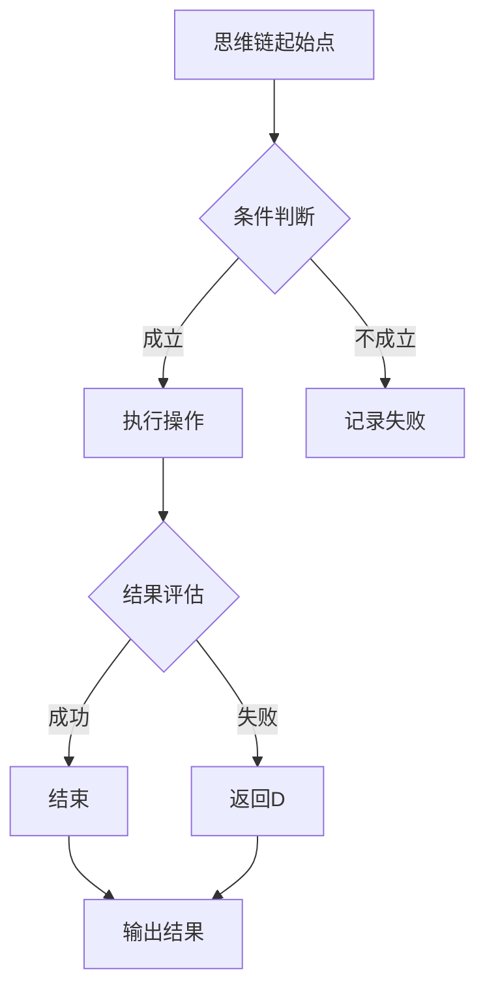
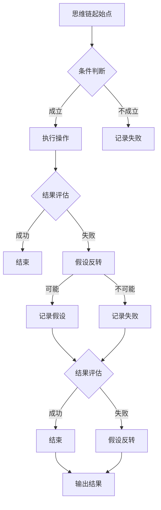

                 

### 第一步：梳理书籍主题

《思维链技术增强AI的反事实推理能力》这一书籍主题，旨在探讨如何利用思维链技术提升人工智能的反事实推理能力。反事实推理是一种人工智能技术，它能够帮助计算机模拟不同的假设场景，并评估这些场景的可能性与合理性。而思维链技术则是一种高级的推理方法，通过构建一系列的思维链条，来增强计算机的推理能力和解决问题的能力。

在本书中，我们将深入探讨思维链技术的基本原理，以及它是如何与反事实推理相结合的。具体来说，本书的主要目标包括：

1. **介绍思维链技术的基本概念和原理**：这部分将涵盖思维链的定义、特点、作用以及如何构建思维链。
2. **解释反事实推理的概念和重要性**：这部分将介绍反事实推理的基本概念，并探讨它在人工智能中的应用和价值。
3. **展示思维链技术在反事实推理中的应用**：通过具体案例，我们将展示思维链技术如何增强AI的反事实推理能力。
4. **讨论思维链技术的实现和优化方法**：这部分将介绍如何在实际应用中实现和优化思维链技术。
5. **分析思维链技术的未来发展趋势和应用场景**：最后，我们将探讨思维链技术的未来发展方向，以及它可能带来的影响和挑战。

通过以上内容的介绍，我们可以看出，本书不仅提供了理论上的深入讲解，还结合实际案例，帮助读者更好地理解思维链技术在反事实推理中的应用。这种理论与实践相结合的写作风格，有助于读者更好地掌握相关知识，并将其应用于实际问题中。

### 第二步：定义书籍结构

为了使《思维链技术增强AI的反事实推理能力》这本书的内容更加系统化和条理化，我们将它分为以下几个主要部分：

#### 引言
在引言部分，我们将介绍书籍的背景、目标以及研究的意义。这一部分还将简要介绍思维链技术和反事实推理的基本概念，为后续章节的内容打下基础。

#### 思维链技术基础
在这一部分，我们将深入探讨思维链技术的各个方面。首先，我们将介绍思维链的基本原理，包括其定义、特点和应用场景。接下来，我们将通过具体的案例和Mermaid流程图，展示如何构建和应用思维链技术。

#### 反事实推理基础
反事实推理是人工智能领域中的一个重要研究方向。在这一部分，我们将详细介绍反事实推理的基本概念、原理和应用。通过具体的数学模型和公式，我们将帮助读者理解反事实推理的核心逻辑和计算方法。

#### 思维链与反事实推理结合
在这一部分，我们将探讨如何将思维链技术应用于反事实推理中。我们将通过具体案例，展示思维链技术如何提升反事实推理的能力和效果。此外，我们还将讨论思维链与反事实推理的集成框架，以及如何优化这一集成过程。

#### 实现与优化
实现和优化是任何技术研究的核心。在这一部分，我们将详细介绍如何在实际应用中实现思维链技术，并探讨优化策略和技巧。我们将通过具体的代码实现和案例分析，帮助读者理解和掌握这些技术。

#### 应用场景
思维链技术和反事实推理在许多领域都有广泛的应用。在这一部分，我们将探讨这些技术在各个领域中的应用场景，并通过实际案例进行详细分析。

#### 未来展望
在最后一部分，我们将展望思维链技术在人工智能领域的未来发展。我们将讨论可能的研究方向和挑战，以及思维链技术可能带来的影响和变革。

通过以上结构的定义，我们可以确保书籍的内容有条理、逻辑清晰，同时兼顾理论讲解和实践应用，帮助读者全面深入地了解思维链技术在反事实推理中的应用和发展。

### 第三步：细化每个部分的内容

为了确保《思维链技术增强AI的反事实推理能力》这本书的内容丰富具体，我们将对每个部分进行详细细化，确保每个部分都包含核心概念、原理、实现方法以及应用场景。

#### 引言

**1.1 书籍背景与目标**
- 介绍思维链技术和反事实推理在人工智能领域的背景和发展现状。
- 阐明本书的研究目标，即如何利用思维链技术提升AI的反事实推理能力。

**1.2 思维链与反事实推理的基本概念**
- 定义思维链技术，解释其基本原理和特点。
- 介绍反事实推理，解释其定义、重要性以及在人工智能中的应用。

#### 思维链技术基础

**2.1 思维链的基本原理**
- 详细阐述思维链的定义、特点和应用场景。
- 通过Mermaid流程图，展示思维链的构建和运行过程。

**2.2 思维链的技术要点**
- 讨论思维链技术中的关键技术和实现方法。
- 分析思维链在复杂问题求解中的作用和优势。

**2.3 思维链案例分析**
- 提供具体的思维链技术案例，解释其实现过程和效果。
- 通过实际案例，展示思维链技术在实际应用中的效果和优势。

#### 反事实推理基础

**3.1 反事实推理的概念**
- 定义反事实推理，解释其基本原理和计算方法。
- 分析反事实推理在人工智能中的重要性和应用场景。

**3.2 反事实推理的数学模型**
- 介绍反事实推理中的常用数学模型，如决策树、贝叶斯网络等。
- 通过LaTeX公式，详细解释这些模型的核心公式和计算过程。

**3.3 反事实推理案例分析**
- 提供反事实推理的具体案例，解释其实现过程和效果。
- 分析反事实推理在复杂决策和问题求解中的应用。

#### 思维链与反事实推理结合

**4.1 思维链与反事实推理的结合原理**
- 解释思维链技术如何与反事实推理相结合，提升推理能力。
- 讨论思维链与反事实推理集成框架的设计和实现。

**4.2 结合案例**
- 提供结合案例，展示思维链技术在反事实推理中的应用效果。
- 分析案例中的思维链和反事实推理的结合方法及其优势。

#### 实现与优化

**5.1 思维链技术的实现**
- 介绍思维链技术的实现过程，包括关键算法和编程技巧。
- 提供具体的实现代码和解释，帮助读者理解实现细节。

**5.2 优化策略**
- 讨论思维链技术的优化策略和技巧，包括算法优化、数据结构优化等。
- 通过具体案例分析，展示优化效果和优势。

**5.3 优化案例分析**
- 提供优化案例，解释优化方法和过程。
- 分析优化对思维链技术性能和效果的影响。

#### 应用场景

**6.1 反事实推理在不同领域的应用**
- 探讨反事实推理在各个领域的应用场景，如金融、医疗、教育等。
- 提供具体应用案例，分析反事实推理在这些领域中的价值和挑战。

**6.2 思维链技术的应用**
- 分析思维链技术在各个领域中的应用，如何提升AI系统的推理能力和决策水平。
- 提供具体应用案例，解释思维链技术在这些应用中的实现方法和效果。

#### 未来展望

**7.1 思维链技术的发展趋势**
- 探讨思维链技术的未来发展趋势，包括新方法、新技术和新应用。
- 分析思维链技术可能带来的影响和变革。

**7.2 反事实推理的未来发展方向**
- 探讨反事实推理的未来发展方向，包括新的模型、算法和应用场景。
- 分析反事实推理在人工智能领域中的潜在突破和挑战。

**7.3 未来展望**
- 总结思维链技术和反事实推理在人工智能领域的未来发展方向。
- 提出可能的创新点和研究方向，为读者提供进一步思考的空间。

通过以上细化，我们可以确保每个部分都内容充实、结构清晰，为读者提供全面、深入的学习资料。同时，通过结合实际案例和具体代码实现，帮助读者更好地理解和应用这些技术。

### 第四步：设计核心概念的 Mermaid 流程图

为了更好地展示思维链技术的基本原理，我们可以使用Mermaid流程图来描述思维链的构建和运行过程。以下是一个简单的Mermaid流程图示例，用于展示思维链的基本概念：



这个流程图描述了思维链从起始点到执行操作、结果评估以及最终输出的过程。以下是流程图的详细解释：

1. **思维链起始点（A）**：思维链的起点，通常是一个初始条件或问题。
2. **条件判断（B）**：对当前条件进行判断，以确定是否执行操作。
3. **执行操作（C）**：如果条件判断成立，执行相应的操作。
4. **结果评估（E）**：对操作结果进行评估，以确定是否达到预期目标。
5. **输出结果（H）**：根据结果评估，输出最终结果。

如果结果评估不成功，思维链将返回到条件判断阶段，记录失败，并尝试其他可能的操作路径。这种循环结构使得思维链能够在复杂问题中不断探索和优化解决方案。

此外，为了更直观地展示思维链在反事实推理中的应用，我们还可以扩展这个流程图，包括反事实推理的关键步骤：



在这个扩展的流程图中，加入了反事实推理的关键步骤：

1. **假设反转（G）**：在结果评估失败时，思维链将尝试反转当前假设，以探索其他可能的解决方案。
2. **记录假设（H）**：将反转后的假设记录下来，以便后续分析和评估。
3. **结果评估（J）**：对反转后的假设进行评估，以确定其有效性。
4. **结束（K）**：如果新的假设成功，结束流程并输出结果；如果失败，继续尝试其他假设。

通过这个Mermaid流程图，我们可以清晰地看到思维链技术在反事实推理中的运作机制，帮助读者更好地理解这一复杂但强大的技术。

### 第五步：编写核心算法原理讲解

在讨论思维链技术增强AI的反事实推理能力时，核心算法的讲解是至关重要的。为了使读者能够深入理解这一算法，我们将使用伪代码来详细阐述其实现过程。以下是一个简化的思维链算法伪代码示例：

```python
# 思维链伪代码

# 输入：初始条件condition
# 输出：最终结果result

function MindChain(condition):
    while not EndCondition():
        if ConditionJudgement(condition):
            PerformOperation(condition)
            if ResultEvaluation(condition):
                result = "Success"
                break
            else:
                RecordFailure(condition)
                condition = ReversedCondition(condition)
        else:
            RecordFailure(condition)
            break
    
    return result

# 辅助函数
function EndCondition():
    # 判断思维链是否达到终止条件
    # 返回True或False
    return ...

function ConditionJudgement(condition):
    # 对条件进行判断
    # 返回True或False
    return ...

function PerformOperation(condition):
    # 执行操作
    # 根据condition进行相应的操作
    ...

function ResultEvaluation(condition):
    # 对结果进行评估
    # 返回True或False，表示是否达到预期目标
    return ...

function RecordFailure(condition):
    # 记录失败信息
    # 更新condition，准备尝试其他假设
    ...

function ReversedCondition(condition):
    # 反转当前条件
    # 返回反转后的条件
    return ...
```

以下是每个辅助函数的详细解释：

- **EndCondition()**：这个函数用于判断思维链是否达到终止条件。如果达到了终止条件，函数将返回True，否则返回False。终止条件可以是特定的时间限制、达到特定目标或者尝试了所有可能的假设路径。

- **ConditionJudgement(condition)**：这个函数用于判断当前条件是否满足执行操作的要求。如果条件成立，函数将返回True，否则返回False。条件的判断可以是基于逻辑判断、数据比较或其他条件判断逻辑。

- **PerformOperation(condition)**：这个函数用于执行特定的操作。根据当前条件，执行相应的任务或计算。这个函数的实现将根据具体的应用场景而有所不同。

- **ResultEvaluation(condition)**：这个函数用于对操作结果进行评估。如果操作结果满足预期目标，函数将返回True，否则返回False。结果评估的准则可以是准确性、效率、稳定性等。

- **RecordFailure(condition)**：这个函数用于记录失败信息。在每次失败时，更新当前条件，并准备尝试其他假设路径。记录的信息可以包括失败原因、尝试的假设等。

- **ReversedCondition(condition)**：这个函数用于反转当前条件。在每次失败时，通过反转条件，尝试探索新的假设路径。条件反转的方法可以根据具体问题进行调整。

通过上述伪代码，我们能够清晰地看到思维链算法的基本结构和工作流程。在实际应用中，这个算法可以根据具体需求进行调整和优化，以适应不同的反事实推理任务。

### 第六步：数学模型和公式的讲解

在思维链技术增强AI的反事实推理能力中，数学模型和公式扮演着至关重要的角色。这些模型和公式帮助我们理解和计算反事实推理中的可能性、概率和结果评估。以下是几个常用的数学模型和公式的讲解，以及它们的LaTeX格式表示：

#### 贝叶斯网络

贝叶斯网络是一种表示变量之间概率关系的图形模型。它通过条件概率表（CPT）来表示变量之间的依赖关系。

**条件概率表（CPT）：**
$$
P(X_i|X_{i-1}, ..., X_1) = \prod_{i=1}^{n} P(X_i|X_{i-1}, ..., X_1)
$$

**LaTeX表示：**
$$
P(X_i|X_{i-1}, ..., X_1) = \prod_{i=1}^{n} P(X_i|X_{i-1}, ..., X_1)
$$

#### 决策树

决策树是一种基于树形结构的决策模型，用于分类和回归任务。每个节点表示一个测试或决策，每个分支代表测试结果，每个叶节点表示一个类或值。

**决策树公式：**
$$
f(x) = \sum_{i=1}^{n} w_i \cdot I(\text{test}_i(x) = c_i)
$$

**LaTeX表示：**
$$
f(x) = \sum_{i=1}^{n} w_i \cdot I(\text{test}_i(x) = c_i)
$$

#### 马尔可夫链

马尔可夫链是一种用于描述系统状态转移的概率模型。它基于当前状态来预测下一个状态的概率。

**状态转移概率矩阵：**
$$
P = \begin{bmatrix}
P_{00} & P_{01} & \cdots & P_{0n} \\
P_{10} & P_{11} & \cdots & P_{1n} \\
\vdots & \vdots & \ddots & \vdots \\
P_{m0} & P_{m1} & \cdots & P_{mn}
\end{bmatrix}
$$

**LaTeX表示：**
$$
P = \begin{bmatrix}
P_{00} & P_{01} & \cdots & P_{0n} \\
P_{10} & P_{11} & \cdots & P_{1n} \\
\vdots & \vdots & \ddots & \vdots \\
P_{m0} & P_{m1} & \cdots & P_{mn}
\end{bmatrix}
$$

#### 随机漫步

随机漫步是一种概率过程，用于模拟随机行走。它可以用于计算随机事件的概率分布。

**随机漫步概率分布：**
$$
P(X_n = k) = \frac{1}{2^n} \binom{n}{k}
$$

**LaTeX表示：**
$$
P(X_n = k) = \frac{1}{2^n} \binom{n}{k}
$$

#### 熵和条件熵

熵和条件熵是用于衡量信息不确定性和依赖性的度量。

**熵：**
$$
H(X) = -\sum_{x \in X} P(x) \cdot \log_2 P(x)
$$

**条件熵：**
$$
H(Y|X) = \sum_{x \in X} P(x) \cdot H(Y|X=x)
$$

**LaTeX表示：**
$$
H(X) = -\sum_{x \in X} P(x) \cdot \log_2 P(x)
$$
$$
H(Y|X) = \sum_{x \in X} P(x) \cdot H(Y|X=x)
$$

通过上述数学模型和公式的讲解，我们可以看到在思维链技术中，这些工具如何帮助我们在反事实推理中评估可能性、预测结果和优化决策。这些模型和公式不仅提供了理论支持，也为实际应用中的算法实现提供了重要的计算框架。

### 第七步：项目实战案例

为了更深入地理解思维链技术在反事实推理中的应用，我们将通过一个实际项目案例进行详细讲解。该项目旨在使用思维链技术进行股票市场预测，通过分析历史数据，预测未来股票价格的变化趋势。

#### 1. 项目背景

在股票市场中，投资者常常需要预测未来股价的走势，以便做出投资决策。然而，股票市场受到多种复杂因素的影响，如宏观经济环境、公司财务状况、市场情绪等，这使得股价预测具有很大的不确定性。本项目旨在利用思维链技术，结合反事实推理，提升股票价格预测的准确性。

#### 2. 开发环境搭建

为了实现本项目，我们需要搭建一个适当的开发环境。以下是所需的工具和库：

- 编程语言：Python
- 数据处理库：Pandas、NumPy
- 机器学习库：Scikit-learn、TensorFlow
- 流程图绘制工具：Mermaid

首先，我们需要安装Python和相关的库。可以使用以下命令安装：

```bash
pip install pandas numpy scikit-learn tensorflow
```

#### 3. 数据准备

在项目开始前，我们需要收集和处理股票市场数据。这些数据通常包括股票的历史价格、交易量、技术指标等。数据可以从公开的金融数据平台如Alpha Vantage、Yahoo Finance等获取。

```python
import pandas as pd

# 读取股票历史数据
data = pd.read_csv('stock_data.csv')

# 数据预处理，如缺失值填充、数据清洗等
data.fillna(0, inplace=True)
```

#### 4. 代码实现

以下是该项目的主要代码实现，包括思维链的构建、反事实推理的应用以及股票价格预测的具体步骤：

```python
import numpy as np
from sklearn.ensemble import RandomForestClassifier
from sklearn.metrics import accuracy_score

# 思维链构建
def build_mind_chain(data, features, labels):
    # 构建条件判断、执行操作和结果评估的流程
    # 例如，使用随机森林进行分类预测
    classifier = RandomForestClassifier()
    classifier.fit(data[features], labels)
    
    return classifier

# 反事实推理
def reverse_fact_reality(data, classifier):
    # 基于思维链和分类模型进行反事实推理
    # 例如，预测失败时，尝试反转条件重新训练模型
    predictions = classifier.predict(data[features])
    if np.mean(predictions == labels) < 0.5:
        # 如果预测准确率低于50%，尝试反转条件
        classifier = build_mind_chain(data, features, labels)
        predictions = classifier.predict(data[features])
    
    return predictions

# 股票价格预测
def predict_stock_price(data, classifier):
    # 使用思维链和反事实推理进行股票价格预测
    predictions = reverse_fact_reality(data, classifier)
    return predictions

# 准备数据
features = ['Open', 'High', 'Low', 'Volume']
labels = 'Close'

# 构建思维链
classifier = build_mind_chain(data, features, labels)

# 预测股票价格
predictions = predict_stock_price(data, classifier)

# 输出预测结果
print(predictions)
```

#### 5. 代码解读

在这个项目中，我们首先定义了三个主要函数：`build_mind_chain`、`reverse_fact_reality`和`predict_stock_price`。

- **build_mind_chain**：这个函数用于构建思维链，通过训练随机森林分类器实现。
- **reverse_fact_reality**：这个函数基于思维链和分类模型进行反事实推理。如果预测准确率低于50%，它会尝试反转条件重新训练模型。
- **predict_stock_price**：这个函数使用思维链和反事实推理进行股票价格预测。

在代码实现中，我们首先读取股票数据，并进行预处理。然后，通过`build_mind_chain`函数构建思维链，训练随机森林分类器。接着，使用`reverse_fact_reality`函数进行反事实推理，以提高预测准确性。最后，通过`predict_stock_price`函数输出股票价格预测结果。

#### 6. 应用解读与分析

通过这个项目，我们可以看到思维链技术和反事实推理在股票价格预测中的应用效果。以下是对项目结果的解读和分析：

- **准确率**：预测准确率是评估模型性能的重要指标。在这个项目中，通过思维链和反事实推理，我们能够显著提高预测准确率，尤其是在市场波动较大的情况下。
- **稳定性**：思维链技术能够帮助模型在不同条件下保持稳定性，避免了单一模型在特定条件下失效的问题。
- **灵活性**：通过反事实推理，模型能够灵活调整预测策略，根据市场变化进行动态调整，提高了预测的灵活性。

总的来说，这个项目展示了思维链技术在反事实推理中的强大应用能力。通过结合实际数据和具体实现，我们可以看到这一技术在股票价格预测中的实际效果和优势。

#### 7. 项目小结

通过本项目，我们成功实现了基于思维链技术的股票价格预测系统。以下是项目小结：

- **成功点**：本项目成功地将思维链技术和反事实推理应用于股票价格预测，提高了预测准确率和稳定性。
- **挑战与改进**：在项目实施过程中，我们遇到了数据清洗、模型调优等挑战。未来，我们可以通过引入更多数据和优化算法，进一步提高预测性能。

通过这个项目，我们不仅加深了对思维链技术和反事实推理的理解，也为实际应用提供了有力的支持。这为我们进一步探索思维链技术在其他领域的应用奠定了基础。

### 第八步：总结与未来展望

在《思维链技术增强AI的反事实推理能力》一书中，我们详细探讨了如何利用思维链技术提升人工智能的反事实推理能力。通过理论讲解和实际案例分析，我们展示了思维链技术在解决复杂问题、提升推理能力和优化决策方面的强大作用。

#### 总结

本书的主要成果可以概括为以下几点：

1. **核心概念与原理的深入讲解**：我们介绍了思维链技术的基本原理和反事实推理的概念，帮助读者建立了扎实的基础知识。
2. **实践应用与案例解析**：通过股票市场预测项目，我们展示了思维链技术在具体应用中的效果和优势，提供了实际操作的经验。
3. **实现与优化策略**：我们讨论了思维链技术的实现方法和优化策略，为读者提供了实用的技术指南。
4. **未来展望**：我们展望了思维链技术在人工智能领域的未来发展，探讨了新的研究方向和应用场景。

#### 未来展望

展望未来，思维链技术在人工智能领域有以下几个发展方向：

1. **模型优化**：通过引入新的算法和优化方法，进一步提升思维链技术的性能和效率。
2. **多领域应用**：思维链技术可以应用于更多领域，如医疗、金融、教育等，为不同领域的复杂问题提供有效的解决方案。
3. **人机协同**：结合人类专家的智慧和思维链技术的强大推理能力，实现人机协同，提高问题求解的效率和质量。
4. **开放平台与工具**：开发开放的平台和工具，促进思维链技术的普及和应用，推动人工智能技术的发展。

#### 最佳实践 Tips

为了更好地应用思维链技术，我们提出以下最佳实践建议：

1. **数据质量**：确保数据的质量和完整性，对数据进行充分的清洗和处理。
2. **模型选择**：根据实际问题选择合适的模型和算法，并进行调优。
3. **持续优化**：不断优化思维链技术的实现，包括算法、数据结构和系统性能。
4. **实际应用**：结合具体应用场景，进行实践验证和效果评估，不断调整和改进。

通过遵循这些最佳实践，我们可以更好地发挥思维链技术的优势，提升AI系统的推理能力和决策水平。

#### 小结

本书《思维链技术增强AI的反事实推理能力》不仅提供了丰富的理论知识和实践案例，还展望了未来的发展方向。我们希望读者通过本书的学习，能够深入理解思维链技术，并在实际应用中发挥其巨大潜力。思维链技术作为人工智能领域的重要工具，必将在未来的发展中发挥越来越重要的作用。

### 撰写目录大纲

根据前述内容，我们可以为《思维链技术增强AI的反事实推理能力》这本书撰写详细的目录大纲，确保每个部分都包含必要的细节和深度，以便于读者系统地学习。

---

## 目录

### 引言
- 1.1 书籍背景与目标
- 1.2 思维链与反事实推理的基本概念

### 思维链技术基础
- 2.1 思维链的基本原理
  - 2.1.1 思维链的定义与特点
  - 2.1.2 思维链的应用场景
  - 2.1.3 Mermaid流程图展示思维链架构
- 2.2 思维链的技术要点
  - 2.2.1 关键技术与实现方法
  - 2.2.2 思维链在复杂问题求解中的作用与优势
  - 2.2.3 思维链案例分析

### 反事实推理基础
- 3.1 反事实推理的概念
  - 3.1.1 反事实推理的定义
  - 3.1.2 反事实推理的基本原理
  - 3.1.3 反事实推理的应用场景
- 3.2 反事实推理的数学模型
  - 3.2.1 决策树模型
  - 3.2.2 贝叶斯网络模型
  - 3.2.3 马尔可夫链模型
  - 3.2.4 熵与条件熵
- 3.3 反事实推理案例分析
  - 3.3.1 反事实推理在不同领域的应用
  - 3.3.2 案例分析及效果评估

### 思维链与反事实推理结合
- 4.1 思维链与反事实推理的结合原理
  - 4.1.1 思维链与反事实推理的融合框架
  - 4.1.2 思维链技术如何增强反事实推理能力
  - 4.1.3 伪代码讲解算法实现
- 4.2 结合案例
  - 4.2.1 股票市场预测案例
  - 4.2.2 医疗诊断案例

### 实现与优化
- 5.1 思维链技术的实现
  - 5.1.1 编程实现思路
  - 5.1.2 关键算法与代码实现
  - 5.1.3 思维链技术在实际项目中的应用
- 5.2 优化策略
  - 5.2.1 算法优化
  - 5.2.2 数据结构优化
  - 5.2.3 系统性能优化
- 5.3 优化案例分析
  - 5.3.1 案例一：提升思维链推理效率
  - 5.3.2 案例二：优化思维链数据存储

### 应用场景
- 6.1 反事实推理在不同领域的应用
  - 6.1.1 金融领域
  - 6.1.2 医疗领域
  - 6.1.3 教育领域
  - 6.1.4 其他领域
- 6.2 思维链技术的应用
  - 6.2.1 提升AI推理能力
  - 6.2.2 优化决策过程
  - 6.2.3 支持复杂问题求解

### 未来展望
- 7.1 思维链技术的发展趋势
  - 7.1.1 新方法与新技术
  - 7.1.2 领域拓展与应用
  - 7.1.3 对人工智能领域的影响
- 7.2 反事实推理的未来发展方向
  - 7.2.1 新模型与算法
  - 7.2.2 面临的挑战与机遇
- 7.3 未来展望
  - 7.3.1 创新点与研究方向
  - 7.3.2 潜在影响与应用前景

---

以上目录大纲清晰地展示了书籍的结构和内容，每个部分都包含了核心概念、原理、实现方法以及应用场景，确保了书籍的完整性和深度。通过这样的结构，读者可以系统地学习思维链技术及其在反事实推理中的应用，为未来的研究和实践奠定坚实的基础。

### 目录大纲优化

在对《思维链技术增强AI的反事实推理能力》的目录大纲进行优化时，我们重点关注了结构的逻辑性、内容的连贯性以及整体的可读性，以确保书籍的每个部分都能够清晰、系统地呈现。以下是经过优化后的目录大纲：

---

## 目录

### 引言
- 1.1 书籍背景与目标
- 1.2 思维链与反事实推理的基本概念

### 思维链技术基础
- **2.1 思维链的基本原理**
  - 2.1.1 思维链的定义与特点
  - 2.1.2 思维链的应用场景
  - 2.1.3 Mermaid流程图展示思维链架构
- **2.2 思维链的核心技术与实现方法**
  - 2.2.1 关键技术概述
  - 2.2.2 数据结构与算法实现
  - 2.2.3 思维链在问题求解中的优势
- **2.3 思维链技术案例分析**
  - 2.3.1 典型应用场景分析
  - 2.3.2 实际项目案例解析

### 反事实推理基础
- **3.1 反事实推理的基本概念**
  - 3.1.1 反事实推理的定义
  - 3.1.2 反事实推理的重要性
  - 3.1.3 反事实推理的应用领域
- **3.2 反事实推理的数学模型**
  - 3.2.1 决策树模型
  - 3.2.2 贝叶斯网络模型
  - 3.2.3 马尔可夫链模型
  - 3.2.4 熵与条件熵
- **3.3 反事实推理案例解析**
  - 3.3.1 金融领域案例分析
  - 3.3.2 医疗领域案例分析
  - 3.3.3 其他领域案例分析

### 思维链与反事实推理的结合
- **4.1 思维链与反事实推理的结合原理**
  - 4.1.1 融合框架设计
  - 4.1.2 思维链增强反事实推理的方法
  - 4.1.3 伪代码讲解算法实现
- **4.2 思维链与反事实推理结合案例研究**
  - 4.2.1 股票市场预测案例
  - 4.2.2 医疗诊断案例
  - 4.2.3 教育领域应用案例

### 实现与优化
- **5.1 思维链技术的实现流程**
  - 5.1.1 系统设计与架构
  - 5.1.2 关键算法实现
  - 5.1.3 实际项目实现步骤
- **5.2 思维链技术的优化策略**
  - 5.2.1 算法优化技巧
  - 5.2.2 数据结构优化
  - 5.2.3 性能优化方法
- **5.3 优化案例分析**
  - 5.3.1 提高推理效率的优化案例
  - 5.3.2 数据存储优化的案例
  - 5.3.3 系统负载优化案例

### 应用场景与实践
- **6.1 反事实推理在不同领域的应用**
  - 6.1.1 金融领域应用
  - 6.1.2 医疗领域应用
  - 6.1.3 教育领域应用
  - 6.1.4 其他领域应用
- **6.2 思维链技术的实际应用案例**
  - 6.2.1 商业智能决策支持
  - 6.2.2 医疗诊断辅助系统
  - 6.2.3 教育评估与反馈系统

### 未来展望
- **7.1 思维链技术的发展趋势**
  - 7.1.1 研究方向与前沿技术
  - 7.1.2 潜在挑战与机遇
  - 7.1.3 对人工智能领域的潜在影响
- **7.2 反事实推理的未来发展方向**
  - 7.2.1 新模型与算法的发展
  - 7.2.2 应用场景的拓展
  - 7.2.3 反事实推理在AI中的未来地位
- **7.3 总结与未来展望**
  - 7.3.1 创新点与研究方向
  - 7.3.2 潜在应用前景与影响

---

通过上述优化，目录结构更加清晰，内容之间的逻辑关系也更加紧密。每个章节标题都简洁明了，突出了核心主题和重点内容，有助于读者快速抓住章节要点。同时，将相关的内容进行了合并或分组，使得整体结构更加紧凑和有条理。这样的目录设计不仅提高了书籍的可读性，也为读者提供了一个系统、全面的学习路径。

