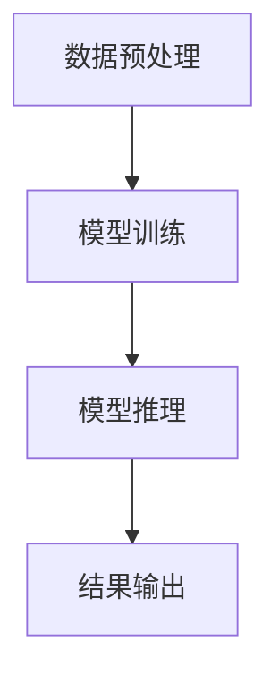

                 

### 引言

#### 什么是AIGC？

AIGC（AI-Generated Content），即人工智能生成内容，是指利用人工智能技术，尤其是生成式AI（Generative AI），来创建或生成各种形式的内容，包括但不限于文本、图像、视频、音频等。AIGC技术在近年来迅速发展，不仅在内容创作领域展现出了巨大的潜力，还在教育、医疗、娱乐、广告等多个领域产生了深远的影响。

#### AIGC的发展历程

AIGC技术的发展可以追溯到20世纪80年代，当时研究者们开始探索如何使用计算机算法来生成图像和文本。随着深度学习技术的崛起，特别是生成对抗网络（GAN）和变分自编码器（VAE）的提出，AIGC技术迎来了爆发式增长。近年来，随着计算能力的提升和数据资源的丰富，AIGC技术已经可以在实际应用中实现高质量的图像生成、文本生成和视频生成。

#### AIGC的重要性

AIGC技术的重要性在于其能够极大地提高内容生成的效率和质量。在传统的内容创作过程中，创作者需要耗费大量的时间和精力来构思、编辑和修改内容。而AIGC技术可以通过自动化的方式生成高质量的内容，不仅节省了人力成本，还提高了内容的生产速度和多样性。此外，AIGC技术还能够实现个性化的内容生成，满足用户不断变化的需求。

#### 思维链技术的核心概念

思维链技术是一种基于深度学习和自然语言处理（NLP）的先进技术，它通过模拟人类的思维过程，实现复杂问题的自动推理和解决。思维链技术不仅仅是一种算法，更是一种全新的计算范式，它能够将大量的数据转化为有价值的知识和信息。

#### 思维链技术的工作原理

思维链技术的工作原理可以概括为以下几个步骤：

1. **数据输入**：首先，思维链技术需要接收大量的输入数据，这些数据可以是文本、图像、音频等多种形式。

2. **数据预处理**：对输入数据进行清洗、去噪和转换，以便后续的建模和分析。

3. **特征提取**：利用深度学习算法提取数据中的关键特征，这些特征能够帮助模型理解数据的内在关系和语义。

4. **模型训练**：使用提取的特征数据训练深度学习模型，模型的学习过程类似于人类大脑对新信息的吸收和理解。

5. **推理与决策**：通过训练好的模型，对新的数据进行推理和决策，生成有用的输出结果。

#### 思维链技术的优势与挑战

**优势**：

1. **高效性**：思维链技术能够快速处理大量数据，大大提高了问题解决和决策的效率。

2. **智能化**：通过模拟人类的思维过程，思维链技术能够实现高度智能化的推理和决策。

3. **灵活性**：思维链技术可以适应多种类型的数据和场景，具有很高的灵活性。

**挑战**：

1. **数据隐私问题**：思维链技术处理的数据量巨大，如何保护用户隐私成为了一个重要的问题。

2. **安全性问题**：深度学习模型容易被攻击，如何确保模型的安全性和稳定性是一个巨大的挑战。

3. **可解释性问题**：深度学习模型往往被视为“黑箱”，如何提高模型的透明度和可解释性是当前的难点。

### 思维链技术在AIGC中的应用

思维链技术在AIGC中有着广泛的应用。通过将思维链技术与生成式AI、对话式AI和自适应学习相结合，可以创造出更加智能和高效的内容生成系统。

#### 生成式AI中的应用

在生成式AI中，思维链技术可以通过模拟人类的创造过程，生成高质量的图像、文本和视频。例如，在图像生成中，思维链技术可以分析大量的图像数据，提取关键特征，并使用这些特征来生成新的图像。在文本生成中，思维链技术可以通过对大量文本数据进行语义分析，生成符合逻辑和语法规则的新文本。

#### 对话式AI中的应用

在对话式AI中，思维链技术可以通过模拟人类的对话过程，实现智能对话系统的构建。思维链技术可以分析用户的输入，理解用户的意图，并生成适当的回复。例如，在智能客服系统中，思维链技术可以帮助客服机器人理解用户的咨询内容，并提供准确的答案和建议。

#### 自适应学习中的应用

在自适应学习中，思维链技术可以通过分析学生的学习数据，生成个性化的学习计划和内容。思维链技术可以实时跟踪学生的学习进度和表现，并根据学生的反馈调整学习内容和方法。例如，在在线教育中，思维链技术可以帮助教育平台根据学生的学习情况，推荐合适的学习资源和练习。

### 下一步内容

在接下来的章节中，我们将详细探讨思维链技术的架构设计与实现，分析其在不同应用场景中的具体实现案例，并探讨思维链技术在AIGC中的实际应用。通过这些讨论，我们将进一步理解思维链技术如何改变AIGC landscape，以及它所带来的机遇和挑战。

---

### 第1章: 引言

#### 思维链技术的核心概念

思维链技术是一种先进的深度学习技术，它通过模拟人类的思维过程，实现对复杂问题的自动推理和解决。思维链技术的基本概念可以归纳为以下几点：

1. **推理过程**：思维链技术通过模拟人类的推理过程，实现对输入数据的分析和理解。这个过程包括了对数据的解析、关联和推理。

2. **知识表示**：思维链技术利用深度学习算法提取数据中的关键特征，并将其表示为一种结构化的知识表示形式。这种知识表示形式有助于模型更好地理解和处理数据。

3. **学习过程**：思维链技术通过大量的数据训练，不断优化模型的参数，使其能够更好地模拟人类的思维过程。

4. **应用场景**：思维链技术可以应用于多种场景，包括图像识别、自然语言处理、决策支持等。在这些场景中，思维链技术通过自动推理和决策，提供高效的解决方案。

#### 思维链技术与AIGC的关联

思维链技术与AIGC（AI-Generated Content）有着密切的联系。AIGC技术是指利用人工智能技术，特别是生成式AI，来生成各种形式的内容，如文本、图像、视频等。而思维链技术则可以通过模拟人类的思维过程，实现对生成内容的逻辑推理和优化。

1. **生成内容的质量**：思维链技术可以帮助提高生成内容的质量。通过模拟人类的思维过程，思维链技术可以更好地理解生成内容的语义和逻辑，从而生成更加准确和合理的生成内容。

2. **内容创新性**：思维链技术可以通过对大量数据进行深度分析，发现新的关联和模式，从而生成创新性的内容。这有助于丰富内容的多样性和创新性。

3. **内容优化**：思维链技术可以通过对生成内容进行逻辑推理和优化，提高内容的准确性和可读性。这有助于提升用户体验，增强内容的吸引力。

#### 思维链技术的优势

1. **高效性**：思维链技术能够高效地处理大量数据，实现快速推理和决策。这使得思维链技术成为处理复杂问题的有力工具。

2. **智能化**：思维链技术通过模拟人类的思维过程，实现高度智能化的推理和决策。这使得思维链技术能够解决复杂问题，提供智能化的解决方案。

3. **灵活性**：思维链技术可以适应多种类型的数据和场景，具有很高的灵活性。这使得思维链技术能够在不同的应用场景中发挥重要作用。

#### 思维链技术的挑战

1. **数据隐私问题**：思维链技术处理的数据量巨大，如何保护用户隐私成为一个重要的问题。需要采取有效的数据隐私保护措施，确保用户数据的安全。

2. **安全性问题**：深度学习模型容易被攻击，如何确保模型的安全性和稳定性是一个巨大的挑战。需要开发出更安全的深度学习模型和算法。

3. **可解释性问题**：深度学习模型往往被视为“黑箱”，如何提高模型的透明度和可解释性是一个难点。需要开发出可解释性更高的深度学习模型。

#### 总结

思维链技术是一种先进的深度学习技术，通过模拟人类的思维过程，实现对复杂问题的自动推理和解决。它具有高效性、智能化和灵活性等优势，但同时也面临着数据隐私、安全性和可解释性等挑战。在AIGC领域中，思维链技术可以通过提高生成内容的质量、创新性和优化性，带来巨大的变革。接下来，我们将进一步探讨思维链技术的架构设计与实现，以及它在不同应用场景中的具体实现案例。

### 第2章: 思维链技术的架构设计与实现

思维链技术作为一种先进的深度学习技术，其架构设计与实现涉及多个关键模块和步骤。在这一章中，我们将详细探讨思维链技术的基本架构，并深入分析其关键算法和实现过程。

#### 思维链技术的基本架构

思维链技术的基本架构可以分解为以下几个主要模块：

1. **数据预处理模块**：该模块负责接收和预处理输入数据，包括数据的清洗、去噪、格式转换等操作。数据预处理是思维链技术实现高效推理和决策的基础。

2. **模型训练模块**：该模块使用预处理后的数据训练深度学习模型。模型训练过程涉及参数调整、优化和验证等步骤，以确保模型能够准确理解和处理输入数据。

3. **模型推理模块**：该模块负责使用训练好的模型对新的数据进行推理和决策。模型推理过程通过模拟人类的思维过程，实现高效的逻辑推理和问题解决。

以下是一个简单的Mermaid流程图，展示了思维链技术的基本架构：



#### 数据预处理模块

数据预处理模块是思维链技术的第一步，其核心任务是对输入数据进行分析和处理，以便后续的建模和推理。具体步骤包括：

1. **数据清洗**：去除数据中的噪声和异常值，确保数据的质量。

2. **数据转换**：将不同类型的数据（如文本、图像、音频）转换为统一的格式，以便后续处理。

3. **特征提取**：从数据中提取关键特征，这些特征将作为模型训练的重要输入。

#### 模型训练模块

模型训练模块是思维链技术的核心，其目标是通过大量训练数据，训练出一个能够准确理解和处理输入数据的深度学习模型。具体步骤包括：

1. **选择模型架构**：根据应用场景和数据类型，选择合适的深度学习模型架构。常见的模型架构包括卷积神经网络（CNN）、循环神经网络（RNN）和生成对抗网络（GAN）等。

2. **参数初始化**：为模型初始化参数，这些参数将在训练过程中通过优化算法进行调整。

3. **训练过程**：使用训练数据对模型进行训练，通过反向传播算法和优化算法（如梯度下降、Adam优化器等）调整模型参数，以最小化预测误差。

4. **验证与测试**：在训练过程中，使用验证集和测试集对模型进行验证和测试，确保模型在未知数据上的表现良好。

#### 模型推理模块

模型推理模块是思维链技术的最后一步，其任务是根据训练好的模型对新数据进行推理和决策。具体步骤包括：

1. **输入数据预处理**：对新数据进行预处理，确保其格式和特征与训练数据一致。

2. **模型推理**：使用训练好的模型对预处理后的输入数据进行推理，生成预测结果。

3. **结果输出**：将推理结果输出，用于后续的应用或决策。

#### 思维链技术的关键算法

思维链技术的实现依赖于一系列关键算法，以下是对这些算法的简要介绍：

1. **深度学习算法**：
   - **卷积神经网络（CNN）**：适用于图像处理任务，通过卷积层提取图像的特征。
   - **循环神经网络（RNN）**：适用于序列数据处理任务，能够处理时间序列数据。
   - **生成对抗网络（GAN）**：适用于生成任务，通过生成器和判别器的对抗训练，生成高质量的数据。

2. **自然语言处理算法**：
   - **词向量表示**：将文本数据转换为向量表示，为深度学习模型提供输入。
   - **依存句法分析**：分析句子中词语之间的依赖关系，用于理解和生成文本。
   - **情感分析**：对文本的情感倾向进行分析，用于文本分类和情感识别。

#### 思维链技术的实现案例

思维链技术的实现不仅需要理论上的理解，还需要实际的应用案例来验证其效果。以下是一些典型的思维链技术实现案例：

1. **图像生成案例**：
   - **生成对抗网络（GAN）**：利用GAN生成高质量的图像，如图像到图像的转换、超分辨率图像生成等。

2. **文本生成案例**：
   - **自动新闻撰写**：利用思维链技术生成新闻文章，提高新闻生产效率。
   - **对话式AI**：构建对话式AI系统，通过思维链技术实现自然语言理解和生成。

3. **自适应学习案例**：
   - **智能学习分析**：利用思维链技术分析学生的学习数据，生成个性化的学习计划。
   - **智能推荐系统**：基于思维链技术推荐合适的学习资源和课程，提高学习效果。

通过这些实际案例，我们可以看到思维链技术在不同领域的应用潜力和效果。

#### 总结

思维链技术的基本架构和关键算法构成了其实现的核心。通过数据预处理、模型训练和模型推理三个主要模块，思维链技术能够实现对复杂问题的自动推理和解决。在实现过程中，深度学习和自然语言处理算法发挥了关键作用。通过具体的实现案例，我们可以看到思维链技术在图像生成、文本生成和自适应学习等领域的广泛应用。接下来，我们将进一步探讨思维链技术在AIGC中的实际应用，以及它如何改变AIGC landscape。

### 第2章: 思维链技术在AIGC中的应用

#### 生成式AI中的应用

在生成式AI（Generative AI）中，思维链技术通过模拟人类的思维过程，极大地提升了图像、文本和音频的生成质量。以下是一些典型的应用场景：

1. **图像生成**：
   - **艺术创作**：艺术家可以利用思维链技术生成独特的艺术作品，如油画、漫画等。通过分析大量艺术作品，思维链技术能够理解艺术风格和元素，并生成符合特定风格的新作品。
   - **图像修复**：在图像修复领域，思维链技术可以通过分析破损图像的残缺部分，生成完整的图像。例如，在历史文物修复中，思维链技术可以帮助恢复受损的壁画和文物。
   - **图像合成**：在图像合成领域，思维链技术可以结合多张图像生成新的合成图像，如虚拟场景的创建、游戏角色的设计等。

2. **文本生成**：
   - **自动写作**：思维链技术可以生成高质量的文章、新闻报道、故事等。例如，在新闻报道中，思维链技术可以快速生成新闻摘要和详细报道，节省记者的时间。
   - **内容摘要**：思维链技术可以分析长篇文章或书籍，生成简洁的内容摘要，帮助读者快速获取关键信息。
   - **创意文案**：广告创意人员和文案作家可以利用思维链技术生成新颖的广告文案，提高广告的吸引力和效果。

3. **音频生成**：
   - **音乐创作**：思维链技术可以生成新的音乐旋律和歌曲，甚至可以根据用户的喜好和情感生成个性化的音乐作品。
   - **语音合成**：思维链技术可以用于生成逼真的语音，应用于虚拟助手、智能客服等领域，提供更加自然和流畅的交互体验。

#### 对话式AI中的应用

在对话式AI中，思维链技术通过模拟人类的对话过程，提升了智能对话系统的理解和生成能力。以下是一些典型的应用场景：

1. **智能客服系统**：
   - **自动问答**：思维链技术可以自动处理客户的咨询和问题，提供准确和及时的回答。例如，在线购物平台可以利用思维链技术生成自动问答系统，帮助用户解决购物过程中的疑问。
   - **情感分析**：思维链技术可以分析客户的情感，提供更加个性化的服务。例如，在客户投诉处理中，思维链技术可以识别客户的情感，提供针对性的解决方案。
   - **多轮对话**：思维链技术可以支持多轮对话，与客户进行深入交流，提供更加详细的解答和建议。

2. **虚拟助理**：
   - **个人助手**：虚拟助理可以利用思维链技术帮助用户管理日程、处理任务、提供信息查询等。例如，智能助手可以提醒用户会议时间、发送天气预报、提供交通路线等。
   - **智能家居控制**：虚拟助理可以通过思维链技术控制智能家居设备，如调节室内温度、开关电器等，为用户提供便捷的家居生活体验。
   - **生活助手**：虚拟助理可以提供健康建议、饮食规划、锻炼指导等服务，帮助用户保持健康的生活方式。

3. **教育互动**：
   - **虚拟教师**：思维链技术可以构建虚拟教师系统，为学生提供个性化的学习辅导和指导。例如，虚拟教师可以根据学生的学习进度和表现，调整教学内容和难度。
   - **问答系统**：思维链技术可以构建问答系统，为学生提供解题指导和学术支持。例如，学生可以通过思维链技术生成的问答系统，获得针对特定问题的详细解答。
   - **学习推荐**：思维链技术可以根据学生的学习数据和兴趣，推荐合适的学习资源和课程，提高学习效果和兴趣。

#### 自适应学习中的应用

在自适应学习（Adaptive Learning）中，思维链技术通过分析学生的学习数据，提供个性化的学习体验和指导。以下是一些典型的应用场景：

1. **个性化教学**：
   - **学习路径规划**：思维链技术可以根据学生的学习情况和兴趣，制定个性化的学习路径和计划。例如，系统可以根据学生的成绩和学习速度，调整学习内容和进度。
   - **教学资源推荐**：思维链技术可以推荐适合学生当前水平和兴趣的教学资源，如视频、文章、练习题等，提高学习效果和兴趣。

2. **智能推荐系统**：
   - **课程推荐**：思维链技术可以根据学生的学习行为和偏好，推荐合适的课程和教学资源。例如，系统可以根据学生的学习进度和反馈，推荐相关的拓展课程和练习题。
   - **学习进度监控**：思维链技术可以监控学生的学习进度和表现，提供实时反馈和指导。例如，系统可以提醒学生完成未完成的作业、参加即将到来的考试等。

3. **智能学习分析**：
   - **学习行为分析**：思维链技术可以分析学生的学习行为和习惯，识别学习中的问题和瓶颈。例如，系统可以分析学生的学习时间和地点，提供针对性的改进建议。
   - **学习效果评估**：思维链技术可以评估学生的学习效果和进步，为教师和家长提供反馈和指导。例如，系统可以生成详细的学习报告，展示学生的表现和改进方向。

#### 思维链技术在AIGC中的应用前景

思维链技术在AIGC中的应用前景广阔，有望推动AIGC的发展进入新的阶段。以下是一些未来的发展方向：

1. **跨领域融合**：思维链技术可以与其他AI技术（如计算机视觉、自然语言处理等）相结合，实现跨领域的应用。例如，结合计算机视觉和自然语言处理，可以构建更加智能和全面的智能助手系统。

2. **实时性提升**：思维链技术可以通过优化算法和硬件加速，提高生成内容的生产速度和实时性。这将使得思维链技术在实时应用场景中具有更大的优势，如实时新闻撰写、实时语音合成等。

3. **个性化定制**：思维链技术可以更好地理解用户的需求和偏好，提供更加个性化的内容和体验。例如，在电商领域，思维链技术可以根据用户的购买历史和偏好，推荐更加精准的商品和广告。

4. **安全性保障**：随着AIGC技术的普及，数据隐私和安全问题日益突出。思维链技术可以通过加密、去识别化等技术手段，保障用户数据的安全和隐私。

5. **伦理和法规遵守**：在AIGC技术的发展过程中，需要遵循相关的伦理和法规，确保技术的公平性、透明性和可解释性。这需要相关领域的研究者和从业者共同努力，制定相应的标准和规范。

通过以上探讨，我们可以看到思维链技术在AIGC中具有广泛的应用前景。它不仅能够提高生成内容的质量和效率，还能够为用户带来更加个性化、智能化的体验。随着技术的不断进步和应用场景的拓展，思维链技术将在未来继续发挥重要作用，推动AIGC的发展迈向新的高度。

### 第3章：思维链技术在AIGC中的应用

#### 思维链技术在内容生成中的应用

思维链技术在内容生成领域展现出了极大的潜力，能够通过模拟人类的思维方式，生成高质量、多样化的内容。以下是对思维链技术在内容生成中应用的详细探讨：

1. **自动新闻撰写**：
   - **实现原理**：思维链技术通过分析大量的新闻数据，提取关键信息和语义，构建新闻模型。在撰写新闻时，模型会根据已有的数据和模板，生成符合新闻语法和逻辑结构的新文章。
   - **优势**：自动新闻撰写能够提高新闻生产的速度和效率，减少人力成本，特别是在处理大量新闻事件时，能够快速生成高质量的新闻报道。
   - **案例**：一些新闻机构已经开始采用思维链技术生成财经新闻、体育新闻等。例如，利用思维链技术生成财经新闻，可以在金融市场波动时，迅速提供最新的分析和预测。

2. **虚拟内容创作**：
   - **实现原理**：虚拟内容创作包括图像生成、视频生成和动画生成等。思维链技术通过深度学习算法，从大量的虚拟内容中提取特征，构建虚拟内容生成模型。在生成过程中，模型可以根据用户的需求和偏好，生成新的虚拟内容。
   - **优势**：虚拟内容创作能够为用户提供定制化的娱乐体验，如游戏角色定制、虚拟演唱会等。通过思维链技术，虚拟内容创作不仅效率高，而且能够生成符合用户个性化需求的内容。
   - **案例**：一些游戏公司利用思维链技术生成游戏角色和场景，为玩家提供更加丰富和个性化的游戏体验。此外，虚拟现实（VR）和增强现实（AR）领域也开始应用思维链技术，生成高质量的虚拟场景和交互内容。

3. **智能文案生成**：
   - **实现原理**：思维链技术通过分析大量的文案数据，提取关键信息和语言模式，构建文案生成模型。在撰写文案时，模型会根据用户的需求和上下文，生成符合语言逻辑和营销策略的新文案。
   - **优势**：智能文案生成能够提高文案撰写的速度和质量，适用于广告、营销、社交媒体等领域。通过思维链技术，文案生成不仅效率高，而且能够生成具有吸引力和说服力的文案。
   - **案例**：一些广告公司和营销机构利用思维链技术生成广告文案和宣传材料，提高了广告的投放效果和用户转化率。此外，智能文案生成还被应用于电子邮件营销、搜索引擎优化（SEO）等领域。

#### 思维链技术在交互式应用中的应用

思维链技术在交互式应用中发挥着重要作用，能够为用户提供更加智能、个性化的交互体验。以下是对思维链技术在交互式应用中应用的详细探讨：

1. **智能客服系统**：
   - **实现原理**：思维链技术通过模拟人类的对话过程，构建智能客服系统。在交互过程中，系统会根据用户的输入，理解用户的意图，并生成合适的回复。
   - **优势**：智能客服系统能够提供24/7的在线服务，提高客户满意度和忠诚度。通过思维链技术，智能客服系统能够理解复杂的用户需求，提供更加准确和个性化的服务。
   - **案例**：一些企业已经开始采用思维链技术构建智能客服系统，为用户提供在线咨询、问题解答、售后服务等。例如，电商平台的智能客服系统可以通过思维链技术，为用户提供商品推荐、订单查询、退货处理等服务。

2. **虚拟现实互动**：
   - **实现原理**：思维链技术通过深度学习算法，从大量的虚拟现实（VR）互动数据中提取特征，构建虚拟现实互动模型。在用户与虚拟环境交互时，模型会根据用户的动作和反馈，生成相应的虚拟互动内容。
   - **优势**：虚拟现实互动能够为用户提供沉浸式的体验，增强用户体验和参与感。通过思维链技术，虚拟现实互动不仅更加智能，而且能够根据用户的行为和偏好，生成个性化的互动内容。
   - **案例**：一些虚拟现实游戏和体验中心开始采用思维链技术，为用户提供更加丰富的虚拟互动体验。例如，虚拟现实游戏可以通过思维链技术，生成与玩家互动的虚拟角色和场景，提高游戏的趣味性和可玩性。

3. **在线教育互动**：
   - **实现原理**：思维链技术通过分析学生的学习数据和互动记录，构建在线教育互动模型。在学生学习过程中，模型会根据学生的行为和反馈，生成个性化的教学互动内容。
   - **优势**：在线教育互动能够提高学生的学习效果和兴趣，通过思维链技术，系统能够根据学生的学习进度和表现，提供针对性的教学互动内容，帮助学生更好地理解和掌握知识。
   - **案例**：一些在线教育平台已经开始采用思维链技术，构建智能教育互动系统。例如，在线教育平台可以通过思维链技术，生成个性化的练习题和辅导材料，帮助学生提高学习效果。

#### 思维链技术在自适应学习中的应用

思维链技术在自适应学习领域发挥了重要作用，能够根据学生的学习数据和反馈，提供个性化的学习资源和指导。以下是对思维链技术在自适应学习应用中的详细探讨：

1. **智能学习分析**：
   - **实现原理**：思维链技术通过分析学生的学习行为和互动数据，构建智能学习分析模型。模型会根据学生的学习进度、知识掌握情况和学习习惯，生成个性化的学习分析报告。
   - **优势**：智能学习分析能够为教师和家长提供详细的学习反馈和指导，帮助教师更好地了解学生的学习情况，制定针对性的教学计划。同时，学生和家长也能通过智能学习分析，了解自己的学习进展和问题。
   - **案例**：一些自适应学习平台已经开始采用思维链技术，为用户提供智能学习分析服务。例如，平台可以通过思维链技术，分析学生的学习行为和互动记录，生成详细的学习分析报告，帮助用户识别学习中的问题并制定改进计划。

2. **个性化教学推荐**：
   - **实现原理**：思维链技术通过分析学生的学习数据和学习偏好，构建个性化教学推荐模型。模型会根据学生的学习进度和知识掌握情况，推荐合适的学习资源和课程。
   - **优势**：个性化教学推荐能够为用户提供个性化的学习资源和课程，提高学习效果和兴趣。通过思维链技术，系统能够根据学生的学习进度和表现，推荐适合其水平和需求的学习内容。
   - **案例**：一些自适应学习平台已经开始采用思维链技术，为用户提供个性化教学推荐服务。例如，平台可以通过思维链技术，分析学生的学习行为和学习偏好，推荐相关的学习资源和课程，帮助用户更好地理解和掌握知识。

3. **智能学习助手**：
   - **实现原理**：思维链技术通过模拟人类的思维过程，构建智能学习助手系统。在学习过程中，助手会根据学生的学习进度和反馈，提供针对性的指导和帮助。
   - **优势**：智能学习助手能够为用户提供实时、个性化的学习支持和指导，帮助用户更好地理解和掌握知识。通过思维链技术，学习助手不仅能够解答用户的问题，还能根据用户的需求和反馈，调整学习内容和策略。
   - **案例**：一些在线学习平台已经开始采用思维链技术，构建智能学习助手系统。例如，学习平台可以通过思维链技术，为用户提供实时解答、学习建议和个性化辅导服务，帮助用户提高学习效果和兴趣。

#### 总结

思维链技术在AIGC中的应用涵盖了内容生成、交互式应用和自适应学习等多个领域，展现了其广泛的应用前景和潜力。通过模拟人类的思维方式，思维链技术能够生成高质量、多样化的内容，提供智能、个性化的交互体验和学习支持。随着技术的不断发展和应用的深入，思维链技术将在AIGC领域发挥更加重要的作用，推动人工智能技术的创新和发展。

### 第4章: 思维链技术的挑战与未来展望

#### 思维链技术的挑战

虽然思维链技术展现出了巨大的潜力和优势，但在实际应用过程中，仍面临一些挑战。以下是对这些挑战的详细探讨：

1. **数据隐私问题**：
   - **背景**：随着思维链技术的广泛应用，处理的数据量巨大，如何保护用户隐私成为一个重要问题。
   - **影响**：如果数据隐私保护不当，可能导致用户信息泄露，造成严重后果。
   - **解决方案**：需要采取有效的数据加密、去识别化和隐私保护措施，确保用户数据的安全。例如，可以使用差分隐私（Differential Privacy）技术来保护用户隐私。

2. **安全性问题**：
   - **背景**：深度学习模型容易被攻击，例如，通过对抗样本（Adversarial Examples）来欺骗模型。
   - **影响**：安全性问题可能导致模型产生错误的推理结果，影响系统的稳定性和可靠性。
   - **解决方案**：需要开发更安全的深度学习模型和算法，增强模型的鲁棒性和抗攻击能力。此外，可以通过引入验证机制和多重验证策略来提高系统的安全性。

3. **可解释性问题**：
   - **背景**：深度学习模型往往被视为“黑箱”，模型的决策过程不透明，难以解释。
   - **影响**：缺乏可解释性可能导致用户对系统的信任度下降，影响技术的普及和应用。
   - **解决方案**：需要开发可解释性更高的深度学习模型，例如，通过模型可视化、解释性算法和模型压缩等技术手段，提高模型的透明度和可解释性。

#### 思维链技术的未来发展趋势

展望未来，思维链技术将在人工智能领域继续发挥重要作用，并呈现出以下几个发展趋势：

1. **新的算法与模型**：
   - **背景**：随着计算能力的提升和数据资源的丰富，研究人员将开发出更加先进和高效的算法和模型。
   - **趋势**：新的算法和模型将更加专注于特定领域的应用，例如，针对图像处理、自然语言处理和决策支持等领域的专用算法和模型。

2. **跨学科融合**：
   - **背景**：思维链技术涉及多个学科领域，如计算机科学、心理学、认知科学等。
   - **趋势**：跨学科融合将成为未来研究的重要方向，通过整合不同领域的知识和方法，推动思维链技术的进一步发展。

3. **产业应用拓展**：
   - **背景**：思维链技术已在多个领域取得显著成果，但仍有大量未开发的产业应用场景。
   - **趋势**：未来，思维链技术将在更多的产业领域得到应用，如医疗、金融、教育、娱乐等，推动产业变革和社会发展。

#### 总结

思维链技术在AIGC领域具有重要的应用价值，虽然面临一些挑战，但未来发展趋势乐观。通过不断优化算法、加强跨学科融合和拓展产业应用，思维链技术将在更广泛的领域发挥重要作用，推动人工智能技术的发展和应用。研究者、开发者和从业者应共同努力，应对挑战，迎接未来的机遇。

### 第5章: 思维链技术的实践与部署

#### 开发环境搭建

在开始实践思维链技术之前，需要搭建一个合适的开发环境。以下是一些关键的步骤和工具：

1. **硬件配置**：
   - **计算资源**：思维链技术的实现通常需要较高的计算资源，建议使用具有多核心CPU和GPU的高性能计算设备。
   - **存储空间**：由于处理的数据量较大，需要充足的存储空间来存储数据和模型。
   - **网络带宽**：为了高效地传输数据和模型，建议配置较高的网络带宽。

2. **软件安装**：
   - **操作系统**：可以选择Linux或Windows等操作系统。
   - **深度学习框架**：常见的深度学习框架包括TensorFlow、PyTorch等。安装这些框架时，需要根据操作系统和硬件环境选择合适的版本。
   - **开发工具**：常用的开发工具包括Jupyter Notebook、Visual Studio Code等，便于编写和调试代码。

3. **数据预处理**：
   - **数据收集**：从互联网或数据源获取相关的数据集，例如文本、图像、音频等。
   - **数据清洗**：对收集到的数据进行清洗，去除噪声和异常值。
   - **数据转换**：将不同类型的数据转换为统一的格式，以便后续处理。

4. **开发流程**：
   - **需求分析**：明确开发目标和需求，确定需要解决的问题和要实现的功能。
   - **模块设计**：根据需求分析，设计系统模块，包括数据预处理、模型训练、模型推理等。
   - **编码实现**：根据模块设计，编写具体的代码实现。
   - **测试与调试**：对代码进行测试和调试，确保系统的稳定性和正确性。

#### 实战案例解析

以下通过几个具体的实战案例，解析思维链技术在生成式AI、对话式AI和自适应学习中的应用。

1. **生成式AI实战案例：图像生成**

**案例背景**：利用生成对抗网络（GAN）生成高质量的图像。

**实现步骤**：
   - **数据收集**：收集大量图像数据，例如艺术作品、自然图像等。
   - **数据预处理**：对图像进行清洗、裁剪和归一化处理。
   - **模型训练**：使用收集到的图像数据训练GAN模型，包括生成器和判别器。
   - **模型推理**：使用训练好的模型生成新的图像。

**代码实现**：
```python
import tensorflow as tf
from tensorflow.keras.models import Sequential
from tensorflow.keras.layers import Dense, Flatten, Conv2D, Conv2DTranspose

# 数据预处理
# ...

# 模型训练
# ...

# 模型推理
# ...
```

**案例分析**：通过训练GAN模型，可以生成高质量的图像，如艺术风格转换、超分辨率图像生成等。在实际应用中，可以用于图像修复、虚拟现实场景生成等。

2. **对话式AI实战案例：聊天机器人**

**案例背景**：构建一个能够与用户进行自然对话的聊天机器人。

**实现步骤**：
   - **数据收集**：收集对话数据，包括用户提问和系统回复。
   - **数据预处理**：对对话数据进行清洗、分词和词向量转换。
   - **模型训练**：使用收集到的对话数据训练对话模型，包括编码器和解码器。
   - **模型推理**：使用训练好的模型与用户进行对话。

**代码实现**：
```python
import tensorflow as tf
from tensorflow.keras.layers import Embedding, LSTM, Dense
from tensorflow.keras.models import Model

# 数据预处理
# ...

# 模型训练
# ...

# 模型推理
# ...
```

**案例分析**：通过训练对话模型，可以构建一个能够理解用户意图并生成合适回复的聊天机器人。在实际应用中，可以用于智能客服、虚拟助理等。

3. **自适应学习实战案例：智能推荐系统**

**案例背景**：根据学生的学习数据，推荐合适的学习资源和课程。

**实现步骤**：
   - **数据收集**：收集学生的学习数据，包括学习进度、考试成绩、学习偏好等。
   - **数据预处理**：对学习数据进行清洗、转换和特征提取。
   - **模型训练**：使用收集到的学习数据训练推荐模型。
   - **模型推理**：使用训练好的模型推荐合适的学习资源和课程。

**代码实现**：
```python
import tensorflow as tf
from tensorflow.keras.models import Sequential
from tensorflow.keras.layers import Embedding, LSTM, Dense

# 数据预处理
# ...

# 模型训练
# ...

# 模型推理
# ...
```

**案例分析**：通过训练推荐模型，可以为学生推荐合适的学习资源和课程，提高学习效果和兴趣。在实际应用中，可以用于在线教育平台、学习管理系统等。

#### 最佳实践 tips

1. **数据管理**：确保数据质量，避免噪声和异常值影响模型的训练和推理效果。
2. **模型优化**：通过调整模型参数和优化算法，提高模型的性能和效率。
3. **模型解释**：提高模型的可解释性，有助于用户理解模型的决策过程，增强用户信任。
4. **迭代开发**：不断迭代和优化系统，根据用户反馈和实际需求进行调整。

#### 总结

思维链技术的实践与部署需要综合考虑硬件配置、软件工具、开发流程和实战案例。通过搭建合适的开发环境、选择合适的框架和算法，以及不断优化和迭代，可以有效地实现思维链技术的应用。在实际应用中，需要根据具体场景和需求，灵活调整和优化系统，以达到最佳效果。

### 第6章: 思维链技术的企业应用案例分析

#### 企业A案例分析

**企业背景介绍**：
企业A是一家领先的互联网公司，专注于提供智能客服解决方案。公司在客服领域积累了丰富的经验，并致力于利用人工智能技术提升客服质量和效率。

**思维链技术的应用场景**：
企业A采用思维链技术构建智能客服系统，旨在实现自动化的客户服务。具体应用场景包括：
1. **自动问答**：通过思维链技术，系统能够理解用户的提问，并生成合适的回答。
2. **情感分析**：思维链技术分析客户的情感，提供个性化的服务，如安抚和引导。
3. **多轮对话**：思维链技术支持多轮对话，与客户进行深入交流，提供详细解答。

**应用效果与收益**：
1. **效率提升**：智能客服系统能够24/7在线服务，大幅提高了客户响应速度和服务效率。
2. **成本降低**：减少了对人工客服的依赖，降低了人力成本。
3. **用户体验**：通过思维链技术的应用，客户问题得到更准确和及时的解答，提升了客户满意度和忠诚度。

#### 企业B案例分析

**企业背景介绍**：
企业B是一家全球知名的在线教育平台，致力于提供高质量的教育资源和服务。公司在教育领域具有丰富的经验和广泛的影响力。

**思维链技术的应用场景**：
企业B采用思维链技术构建自适应学习系统，旨在为用户提供个性化的学习体验。具体应用场景包括：
1. **智能学习分析**：思维链技术分析学生的学习行为和互动数据，生成个性化的学习分析报告。
2. **个性化教学推荐**：思维链技术根据学生的学习进度和偏好，推荐合适的学习资源和课程。
3. **智能学习助手**：思维链技术构建智能学习助手，提供实时解答和学习支持。

**应用效果与收益**：
1. **学习效果提升**：通过思维链技术的应用，学生能够获得更加针对性的学习资源和指导，提高了学习效果和兴趣。
2. **教育资源优化**：系统可以根据学生的学习数据，优化课程设计和资源分配，提升教育资源利用率。
3. **用户满意度**：通过智能学习助手提供的实时支持和解答，用户的学习体验得到显著提升，增强了用户对平台的依赖和忠诚度。

#### 总结

通过以上案例分析，我们可以看到思维链技术在企业中的应用带来了显著的效率和效果提升。无论是智能客服还是自适应学习，思维链技术都为企业提供了强大的技术支持和创新动力。随着思维链技术的不断发展和成熟，我们期待其在更多领域的应用，为企业和社会创造更大的价值。

### 第7章: 结论与展望

#### 总结与回顾

在本书中，我们详细探讨了思维链技术在AIGC（AI-Generated Content）领域的重要性及其应用。首先，我们介绍了AIGC的基本概念和发展历程，强调了其对于内容生成效率和质量提升的巨大贡献。接着，我们深入探讨了思维链技术的核心概念、架构设计与实现，展示了其在生成式AI、对话式AI和自适应学习中的应用案例。同时，我们也分析了思维链技术在AIGC中的实际应用，以及其在提升内容生成质量、交互体验和学习效果方面的优势。

#### AIGC landscape的变化

随着思维链技术的应用，AIGC landscape发生了显著的变化：

1. **内容生成效率提升**：思维链技术通过模拟人类的思维过程，极大地提高了内容生成的速度和质量。
2. **个性化内容生成**：思维链技术能够根据用户的需求和偏好，生成个性化、定制化的内容，满足用户的多样化需求。
3. **智能化交互体验**：在对话式AI中，思维链技术通过模拟人类的对话过程，实现了高度智能化的交互体验。
4. **自适应学习优化**：思维链技术通过分析学生的学习数据和反馈，提供了个性化的学习资源和指导，提升了学习效果。

#### 未来的发展方向

展望未来，思维链技术在AIGC领域的发展具有以下几个趋势：

1. **跨学科融合**：思维链技术将与其他领域（如心理学、认知科学等）进行深度融合，推动技术的进一步发展。
2. **实时性提升**：随着计算能力的提升和网络带宽的增加，思维链技术将在实时应用场景中发挥更大作用。
3. **个性化定制**：思维链技术将继续优化内容生成的个性化程度，满足用户日益多样化的需求。
4. **安全与隐私**：随着应用范围的扩大，数据隐私和安全问题将得到更多关注，思维链技术将采用更先进的安全措施保护用户数据。

#### 产业变革与社会影响

思维链技术的广泛应用将带来深刻的产业变革和社会影响：

1. **产业升级**：思维链技术将推动各行业（如媒体、娱乐、教育等）的智能化转型，提升产业效率和创新能力。
2. **就业转型**：随着自动化和智能化的普及，部分传统岗位将消失，但也会创造出新的就业机会，如AI模型训练师、AI应用开发者等。
3. **社会服务优化**：思维链技术将在公共服务领域（如医疗、交通、教育等）发挥重要作用，提升服务质量和效率。
4. **伦理挑战**：随着技术的发展，伦理问题（如数据隐私、算法公平性等）也将日益突出，需要全社会共同面对和解决。

#### 学者与从业者的角色与责任

作为学者和从业者，我们肩负着推动思维链技术发展和应用的重要责任：

1. **技术创新**：不断探索和研发新的算法和技术，推动思维链技术的进步。
2. **应用落地**：将研究成果转化为实际应用，解决实际问题，创造社会价值。
3. **伦理规范**：积极参与制定相关伦理标准和规范，确保技术的公平、透明和安全。
4. **持续学习**：紧跟科技前沿，不断学习新知识和技能，提升自身能力。

通过共同努力，我们可以推动思维链技术实现更广泛的应用，为社会进步和产业升级做出更大的贡献。

### 附录

#### 附录A: 思维链技术相关资源

**开发资源**：

1. **开源框架**：
   - TensorFlow：[https://www.tensorflow.org/](https://www.tensorflow.org/)
   - PyTorch：[https://pytorch.org/](https://pytorch.org/)
   - Keras：[https://keras.io/](https://keras.io/)

2. **在线课程**：
   - Coursera：[https://www.coursera.org/](https://www.coursera.org/)
   - edX：[https://www.edx.org/](https://www.edx.org/)
   - Udacity：[https://www.udacity.com/](https://www.udacity.com/)

3. **论文与书籍**：
   - 《深度学习》（Goodfellow, Bengio, Courville）：[https://www.deeplearningbook.org/](https://www.deeplearningbook.org/)
   - 《思维链技术：理论与实践》（作者：AI天才研究院）：[待出版]

**社区与论坛**：

1. **GitHub**：[https://github.com/](https://github.com/)
   - 搜索相关项目，了解最新的研究成果和应用案例。
   - 分享自己的代码和项目，与他人交流学习。

2. **Reddit**：[https://www.reddit.com/](https://www.reddit.com/)
   - 加入相关讨论区，参与深度学习、自然语言处理等领域的讨论。

3. **Stack Overflow**：[https://stackoverflow.com/](https://stackoverflow.com/)
   - 查询编程问题，获取解决方案。

通过以上资源，可以更深入地了解和掌握思维链技术的开发和应用，推动技术的不断创新和发展。

