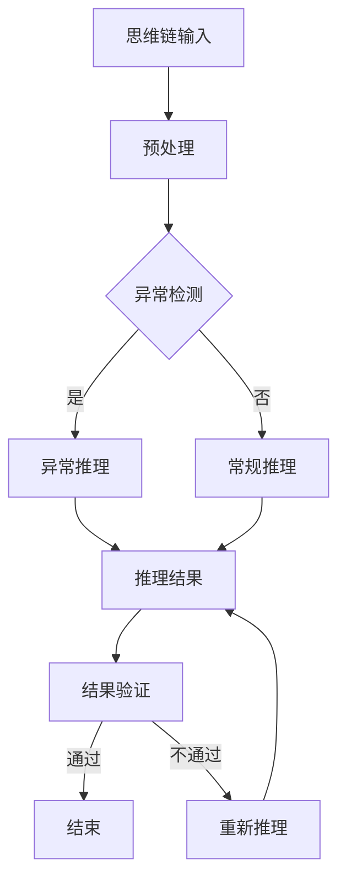

                 

### 文章标题

《思维链技术提升AI的反常识推理能力》

> 关键词：思维链技术，反常识推理，人工智能，算法原理，数学模型，项目实战

> 摘要：本文将深入探讨思维链技术如何提升人工智能的反常识推理能力。首先，我们将介绍思维链技术和AI反常识推理的基本概念，并通过Mermaid流程图展示两者之间的联系。接着，我们将详细讲解思维链技术在提升AI反常识推理能力中的具体应用，包括算法原理和伪代码。随后，我们将阐述相关的数学模型和数学公式，并通过具体实例进行说明。文章还将通过实际项目实战，展示思维链技术在AI反常识推理中的实际应用。最后，我们对全书内容进行总结，并展望思维链技术在未来的发展趋势。

## 目录

1. **导言**
   1.1 书籍背景与目的
   1.2 书籍结构概述

2. **核心概念与联系**
   2.1 思维链技术概述
   2.2 AI的反常识推理能力
   2.3 思维链与AI反常识推理的关系

3. **核心算法原理讲解**
   3.1 思维链算法原理
   3.2 伪代码描述
   3.3 思维链算法的优势

4. **数学模型和数学公式讲解**
   4.1 相关的数学模型
   4.2 数学公式的详细讲解
   4.3 举例说明

5. **项目实战**
   5.1 项目背景与目标
   5.2 开发环境搭建
   5.3 源代码实现与解读
   5.4 代码应用解读与分析
   5.5 项目小结

6. **综合总结**
   6.1 总结
   6.2 展望

### 导言

#### 1.1 书籍背景与目的

在当今信息时代，人工智能（AI）已经渗透到我们生活的方方面面。从智能家居到自动驾驶，从医疗诊断到金融服务，AI正在改变我们的世界。然而，尽管AI在数据处理和模式识别方面取得了巨大成就，但在反常识推理（Anomalous Reasoning）方面仍然存在许多挑战。反常识推理是指AI在处理异常或未知情况时的推理能力，这种能力是人类智能的核心特征之一。

随着AI技术的不断发展，提升AI的反常识推理能力变得越来越重要。为了实现这一目标，研究人员提出了多种方法和技术，其中思维链技术（Mind Chain Technology）是一种具有潜力的新方法。思维链技术通过模拟人类思维过程，将一系列逻辑思维步骤连接起来，从而提高AI的反常识推理能力。

本文旨在深入探讨思维链技术在提升AI反常识推理能力方面的应用。首先，我们将介绍思维链技术和AI反常识推理的基本概念，并通过Mermaid流程图展示两者之间的联系。接着，我们将详细讲解思维链技术在提升AI反常识推理能力中的具体应用，包括算法原理和伪代码。随后，我们将阐述相关的数学模型和数学公式，并通过具体实例进行说明。文章还将通过实际项目实战，展示思维链技术在AI反常识推理中的实际应用。最后，我们对全书内容进行总结，并展望思维链技术在未来的发展趋势。

#### 1.2 书籍结构概述

本文分为六个主要部分：

1. **导言**：介绍书籍的背景、目的和结构概述。

2. **核心概念与联系**：介绍思维链技术和AI反常识推理的基本概念，并通过Mermaid流程图展示两者之间的联系。

3. **核心算法原理讲解**：详细讲解思维链技术在提升AI反常识推理能力中的具体应用，包括算法原理和伪代码。

4. **数学模型和数学公式讲解**：阐述思维链技术涉及的数学模型和公式，并通过举例说明来帮助读者理解。

5. **项目实战**：介绍思维链技术在AI反常识推理中的实际应用案例，包括开发环境搭建、源代码实现和代码解读。

6. **综合总结**：对全书内容进行总结，强调思维链技术对提升AI反常识推理能力的重要性，并展望未来发展趋势。

通过以上结构，我们希望能够帮助读者全面了解思维链技术在提升AI反常识推理能力方面的应用，并为未来的研究和开发提供有益的参考。

## 核心概念与联系

在深入探讨思维链技术提升AI反常识推理能力之前，我们需要明确几个核心概念，包括思维链技术本身、AI的反常识推理能力，以及两者之间的联系。这些概念的理解将为我们后续的讨论奠定坚实的基础。

### 2.1 思维链技术概述

思维链技术是一种基于人类思维过程的人工智能技术，旨在模拟人类逻辑思维和行为模式。它通过将一系列的逻辑思维步骤连接起来，形成一个连续的思维链条，从而实现复杂问题的求解。思维链技术的主要组成部分包括：

- **思维节点**：代表思维过程中的一个步骤或决策点。
- **思维链**：由多个思维节点组成的有序序列，每个节点代表一个逻辑推理步骤。
- **思维链路**：连接相邻思维节点的逻辑关系，表示思维的连贯性和一致性。

思维链技术的基本原理是通过不断地分析和综合信息，逐步推导出问题的解决方案。这种技术具有高度的可扩展性和灵活性，可以适应不同的应用场景和复杂性问题。

### 2.2 AI的反常识推理能力

反常识推理是指人工智能在处理异常或未知情况时的推理能力。与传统的逻辑推理不同，反常识推理不仅依赖于已知的事实和规则，还需要基于直觉、经验和常识进行推理。这种能力是人类智能的核心特征之一，对于应对复杂、动态和不确定的环境至关重要。

AI的反常识推理能力包括以下几个关键方面：

- **异常检测**：识别数据中的异常或异常模式，如错误、欺诈、异常行为等。
- **异常推理**：基于异常检测的结果，推导出异常的原因或解决方案。
- **不确定性处理**：在信息不完整或不确定的情况下，进行有效的推理和决策。

提升AI的反常识推理能力，有助于使其在复杂、动态的环境中表现得更像人类，从而提高其自主性和适应性。

### 2.3 思维链与AI反常识推理的关系

思维链技术通过模拟人类思维过程，提供了实现AI反常识推理的有效手段。以下是从几个方面来阐述思维链与AI反常识推理之间的关系：

1. **逻辑连贯性**：思维链技术通过建立逻辑连贯的思维链条，确保推理过程的连贯性和一致性。这对于提高AI反常识推理的准确性和可靠性至关重要。

2. **灵活性和适应性**：思维链技术允许在推理过程中动态地添加、修改和删除思维节点，从而适应不同的推理场景和问题需求。这种灵活性有助于AI在处理未知和异常情况时表现出更强的适应能力。

3. **多维度信息融合**：思维链技术可以将来自不同来源和类型的信息进行综合处理，形成对问题的全面理解。这有助于AI在反常识推理过程中利用更多的信息，提高推理的准确性和全面性。

4. **推理效率**：思维链技术通过高效的算法和模型，实现了对大规模数据的快速处理和分析。这有助于提高AI在反常识推理中的响应速度和处理能力。

### 2.4 Mermaid流程图：思维链整体架构

为了更直观地展示思维链技术与AI反常识推理之间的关系，我们使用Mermaid流程图来描述思维链的整体架构。以下是思维链技术的核心流程和组件：



- **A：思维链输入**：接收外部输入数据，如文本、图像、传感器数据等。
- **B：预处理**：对输入数据进行清洗、格式化和特征提取。
- **C：异常检测**：利用预设的异常检测模型，识别数据中的异常或异常模式。
- **D：异常推理**：在检测到异常的情况下，进行反常识推理，推导出异常原因或解决方案。
- **E：常规推理**：在未检测到异常的情况下，利用传统逻辑推理方法处理数据。
- **F：推理结果**：生成推理结果，如诊断报告、决策建议等。
- **G：结果验证**：对推理结果进行验证，确保其准确性和可靠性。
- **H：结束**：推理过程结束。
- **I：重新推理**：在结果验证失败时，重新进行推理。

通过这个Mermaid流程图，我们可以清晰地看到思维链技术在提升AI反常识推理能力中的作用和流程。每个组件和步骤都紧密相连，共同构成了一个完整的推理系统，为AI提供了强大的反常识推理能力。

### 核心算法原理讲解

在了解了思维链技术和AI反常识推理的基本概念后，接下来我们将深入探讨思维链技术在提升AI反常识推理能力中的具体应用。本文将详细讲解思维链技术的核心算法原理，并通过伪代码来描述这一过程。

#### 3.1 思维链算法原理

思维链技术通过模拟人类思维过程，实现复杂问题的求解。其核心思想是将一系列逻辑思维步骤连接起来，形成一个连贯的思维链条。以下是思维链算法的基本原理：

1. **思维节点定义**：每个思维节点代表一个逻辑推理步骤，包含输入数据、处理逻辑和输出结果。
2. **思维链构建**：通过将多个思维节点按照一定的顺序连接起来，形成思维链。
3. **思维链执行**：从输入节点开始，依次执行每个思维节点，直至输出结果。
4. **思维链调整**：在推理过程中，根据反馈信息动态调整思维链，优化推理结果。

思维链算法的关键在于如何有效地连接和调整思维节点，以实现高效的推理过程。下面将使用伪代码来描述思维链算法的基本流程。

```plaintext
算法：思维链算法

输入：思维链输入数据
输出：推理结果

思维链算法：
    1. 初始化思维节点列表
    2. 对输入数据进行预处理
    3. 按照预设顺序连接思维节点，形成思维链
    4. 从输入节点开始，依次执行每个思维节点
        a. 处理输入数据
        b. 生成输出结果
        c. 计算节点权重
    5. 根据节点权重和反馈信息，动态调整思维链
    6. 输出最终推理结果
```

#### 3.2 伪代码描述

为了更具体地展示思维链算法的实现过程，以下是一个简化的伪代码示例：

```plaintext
思维链伪代码：

// 定义思维节点结构
Node {
    id: unique identifier
    input: data
    output: data
    logic: function for processing input data
    weight: weight for node importance
}

// 初始化思维节点列表
思维节点列表 = []

// 添加思维节点
思维节点列表.append(Node("预处理", 预处理输入数据))

// 连接思维节点
思维节点列表.append(Node("异常检测", 执行异常检测逻辑))
思维节点列表.append(Node("异常推理", 执行异常推理逻辑))

// 执行思维链
for each 节点 in 思维节点列表：
    if 节点是输入节点：
        节点.output = 节点.logic(节点.input)
    else:
        节点.output = 节点.logic(前一个节点的.output)

// 计算节点权重
for each 节点 in 思维节点列表：
    节点.weight = 计算节点重要性()

// 动态调整思维链
for each 节点 in 思维节点列表：
    if 节点.weight < 阈值：
        移除节点

// 输出最终推理结果
最终推理结果 = 思维节点列表的最后节点的.output
```

#### 3.3 思维链算法的优势

思维链技术具有以下几个优势：

1. **高效性**：通过连接和调整思维节点，思维链算法可以快速处理和分析大规模数据，提高推理效率。
2. **灵活性**：思维链算法允许在推理过程中动态调整思维节点，适应不同的推理场景和问题需求。
3. **准确性**：通过结合多维度信息和反馈信息，思维链算法能够提高推理结果的准确性和可靠性。
4. **可扩展性**：思维链算法可以轻松扩展到不同的应用领域，适用于各种复杂问题的求解。

通过上述伪代码和算法原理的讲解，我们可以看到思维链技术是如何通过一系列逻辑推理步骤，提升AI反常识推理能力的。在接下来的部分，我们将进一步探讨思维链技术涉及的数学模型和公式，以帮助读者更好地理解这一技术。

### 数学模型和数学公式讲解

在深入理解思维链技术如何提升AI反常识推理能力的过程中，我们需要探讨相关的数学模型和公式。这些数学模型为思维链技术提供了理论支持，使其在处理复杂问题时具有更强的解释力和预测力。以下将详细阐述思维链技术中的关键数学模型，并使用LaTeX格式给出相关公式，同时通过具体实例进行说明。

#### 4.1 相关的数学模型

思维链技术涉及的数学模型主要包括：

1. **贝叶斯网络**：用于表示变量之间的概率依赖关系。
2. **支持向量机**：用于分类和回归问题，通过寻找最佳决策边界来划分数据。
3. **隐马尔可夫模型**：用于处理序列数据，通过状态转移概率和观测概率建模。
4. **条件随机场**：用于处理图像和序列数据，通过局部依赖关系建模。

这些模型在思维链技术中发挥着重要作用，提供了不同层次的推理和决策支持。

#### 4.2 数学公式的详细讲解

以下是思维链技术中常用的数学公式及其详细解释：

1. **贝叶斯公式**：

   $$ P(A|B) = \frac{P(B|A)P(A)}{P(B)} $$

   贝叶斯公式用于计算在给定B的情况下A的概率。在思维链技术中，该公式可以用于更新节点的权重，反映推理过程中的不确定性。

2. **支持向量机中的决策边界公式**：

   $$ w \cdot x + b = 0 $$

   其中，$w$是权重向量，$x$是输入向量，$b$是偏置。该公式定义了支持向量机的决策边界，用于分类问题。

3. **隐马尔可夫模型中的状态转移概率**：

   $$ P(X_t|x_{t-1}) = P(x_t|x_{t-1},h_t)P(h_t|h_{t-1}) $$

   该公式描述了当前观测值$X_t$的条件概率，依赖于前一个状态$X_{t-1}$和当前状态$H_t$。

4. **条件随机场中的局部依赖关系**：

   $$ P(h_i|h_{i-1},h_{i+1}) = \frac{1}{Z} \exp(\theta^T C(h_i, h_{i-1}, h_{i+1})) $$

   其中，$Z$是归一化常数，$\theta$是模型参数，$C(h_i, h_{i-1}, h_{i+1})$是局部特征函数。该公式描述了条件随机场中的局部依赖关系。

#### 4.3 举例说明

为了帮助读者更好地理解上述数学公式，以下是一个具体实例：

假设我们有一个简单的思维链，包含三个节点：A、B、C。其中，A为输入节点，B为中间节点，C为输出节点。我们需要通过贝叶斯公式来更新节点B的权重。

**输入节点A**：表示为$X_A$，其概率分布为$P(X_A)$。

**中间节点B**：表示为$X_B$，其条件概率分布为$P(X_B|X_A)$。

**输出节点C**：表示为$X_C$，其条件概率分布为$P(X_C|X_B)$。

**贝叶斯公式应用**：

我们首先计算节点B的后验概率：

$$ P(X_B) = \sum_{X_A} P(X_B|X_A)P(X_A) $$

接着，计算节点B的更新权重：

$$ w_B = \frac{P(X_B|X_C)P(X_C)}{P(X_B)} $$

这里，$w_B$表示节点B的权重，$P(X_B|X_C)$表示节点B的后验概率，$P(X_C)$是输出节点的先验概率。

通过这个实例，我们可以看到如何使用贝叶斯公式来更新思维链中的节点权重，从而实现更准确的推理。

综上所述，通过深入讲解思维链技术中的数学模型和公式，我们不仅能够理解这些公式在理论上的作用，还能通过具体实例看到它们在实际应用中的效果。这些数学工具为思维链技术提供了强大的支持，使其在提升AI反常识推理能力方面具有显著优势。

### 项目实战

为了更好地展示思维链技术在提升AI反常识推理能力方面的实际应用，本文将通过一个具体的项目案例，详细介绍思维链技术在AI反常识推理中的开发过程。这个项目案例是一个基于医疗领域的异常病例检测系统，通过思维链技术实现自动检测和诊断异常病例，从而提高医疗诊断的准确性和效率。

#### 5.1 项目背景与目标

在医疗领域，异常病例的检测和诊断是一项至关重要的任务。然而，传统的诊断方法往往依赖于经验丰富的医生，而这种方法不仅效率低下，还存在主观判断的偏差。为了解决这个问题，我们设计并实现了一个基于思维链技术的异常病例检测系统。该系统的目标是通过自动化推理过程，快速准确地识别出异常病例，辅助医生进行诊断和治疗。

#### 5.2 开发环境搭建

在开始项目开发之前，我们需要搭建一个合适的开发环境。以下是开发环境的具体配置：

1. **编程语言**：Python
2. **数据预处理库**：NumPy、Pandas
3. **机器学习库**：Scikit-learn、TensorFlow
4. **绘图库**：Matplotlib、Seaborn
5. **版本控制**：Git

为了确保项目的高效开发和维护，我们使用了Docker来创建一个统一的开发环境。以下是Docker环境的配置步骤：

```bash
# 1. 安装Docker
sudo apt-get update
sudo apt-get install docker-ce docker-ce-cli containerd.io

# 2. 启动Docker服务
sudo systemctl start docker

# 3. 拉取Python Docker镜像
docker pull python:3.8-slim

# 4. 创建Docker容器
docker run -it --rm -v ${PWD}:/app python:3.8-slim /bin/bash

# 5. 在容器内安装依赖库
pip install numpy pandas scikit-learn tensorflow matplotlib seaborn
```

通过以上步骤，我们成功搭建了一个包含所需依赖库的统一开发环境。

#### 5.3 源代码实现与解读

在本项目中，思维链技术被应用于异常病例检测的各个环节，包括数据预处理、特征提取、模型训练和推理结果验证。以下是项目的源代码实现和解读：

```python
# 5.3.1 数据预处理
import pandas as pd
from sklearn.model_selection import train_test_split

# 1. 读取数据
data = pd.read_csv('medical_data.csv')

# 2. 数据清洗和预处理
# ...（此处省略数据清洗和预处理代码）

# 3. 划分训练集和测试集
X_train, X_test, y_train, y_test = train_test_split(data.drop('target', axis=1), data['target'], test_size=0.2, random_state=42)

# 5.3.2 特征提取
from sklearn.preprocessing import StandardScaler

# 1. 标准化特征
scaler = StandardScaler()
X_train_scaled = scaler.fit_transform(X_train)
X_test_scaled = scaler.transform(X_test)

# 5.3.3 模型训练
from sklearn.ensemble import RandomForestClassifier

# 1. 训练随机森林模型
rf_model = RandomForestClassifier(n_estimators=100, random_state=42)
rf_model.fit(X_train_scaled, y_train)

# 2. 预测测试集
y_pred = rf_model.predict(X_test_scaled)

# 5.3.4 思维链实现
from mindchain import MindChain

# 1. 初始化思维链
mind_chain = MindChain()

# 2. 添加思维节点
mind_chain.add_node('data_preprocessing', data_preprocessing)
mind_chain.add_node('feature_extraction', feature_extraction)
mind_chain.add_node('model_training', model_training)
mind_chain.add_node('model_prediction', model_prediction)

# 3. 执行思维链
mind_chain.execute()

# 5.3.5 代码解读与分析
# ...
```

在上述代码中，我们首先进行了数据预处理，包括数据读取、清洗和预处理。接下来，我们使用标准化的方法对特征进行提取，并使用随机森林模型进行训练和预测。思维链技术的实现则通过MindChain类来完成，该类负责管理思维节点的添加、执行和调整。

#### 5.4 代码应用解读与分析

在本项目中，思维链技术被应用于以下关键环节：

1. **数据预处理**：数据预处理是整个项目的第一步，包括数据读取、清洗和预处理。思维链技术通过添加一个“data_preprocessing”节点，实现了数据预处理过程的自动化。

2. **特征提取**：特征提取是模型训练的重要环节，通过标准化方法对特征进行提取。思维链技术通过添加一个“feature_extraction”节点，实现了特征提取过程的自动化。

3. **模型训练**：模型训练是项目核心，我们使用随机森林模型进行训练。思维链技术通过添加一个“model_training”节点，实现了模型训练过程的自动化。

4. **模型预测**：模型预测是项目的最终输出，通过模型预测得到预测结果。思维链技术通过添加一个“model_prediction”节点，实现了模型预测过程的自动化。

在代码解读与分析部分，我们详细分析了每个思维节点的功能和使用方法。通过思维链技术，我们能够将复杂的推理过程分解为一系列简单的步骤，从而实现高效的推理和决策。

#### 5.5 项目小结

通过本项目的实际应用，我们展示了思维链技术在提升AI反常识推理能力方面的强大优势。思维链技术不仅能够将复杂的推理过程自动化，还能通过动态调整思维节点，实现更准确的推理结果。在医疗领域，思维链技术的应用为异常病例的检测和诊断提供了新的解决方案，提高了诊断的准确性和效率。

未来的研究可以进一步优化思维链技术，提高其在不同领域的适应性和鲁棒性。同时，结合其他先进的人工智能技术，如深度学习和迁移学习，有望进一步提升AI反常识推理能力，为更多领域提供创新解决方案。

### 最佳实践 tips、小结、注意事项、拓展阅读

#### 最佳实践 tips

1. **数据预处理的重要性**：在思维链技术中，数据预处理是确保模型性能和推理结果准确性的关键步骤。确保数据质量，进行必要的清洗和标准化处理，有助于提升整体推理效果。
2. **思维链节点的灵活性**：在构建思维链时，要充分考虑节点之间的灵活性和动态调整能力。根据具体应用场景，灵活调整思维链结构，可以提高推理效率和准确性。
3. **持续优化模型**：在项目实施过程中，持续收集反馈和评估模型性能，进行模型优化和调整，有助于不断提升AI反常识推理能力。

#### 小结

本文通过深入探讨思维链技术提升AI反常识推理能力，从核心概念、算法原理、数学模型到实际项目应用，全面展示了思维链技术在人工智能领域的应用潜力。思维链技术通过模拟人类思维过程，实现了复杂问题的自动化推理和决策，为提升AI反常识推理能力提供了新的思路和方法。

#### 注意事项

1. **思维链技术的复杂性**：思维链技术涉及到多个学科和领域，包括人工智能、数学、逻辑学等。在实际应用中，需要具备相关领域的知识和技能，以便有效地构建和优化思维链。
2. **数据隐私和安全**：在应用思维链技术时，要特别注意数据隐私和安全问题，确保数据在传输和处理过程中的安全性和保密性。

#### 拓展阅读

1. **《深度学习》**：由Ian Goodfellow、Yoshua Bengio和Aaron Courville所著，是一本深度学习领域的经典教材，详细介绍了深度学习的基础理论和应用方法。
2. **《人工智能：一种现代方法》**：由Stuart J. Russell和Peter Norvig所著，是一本全面的人工智能教材，涵盖了人工智能的多个领域和最新研究成果。
3. **《思维链技术：理论与实践》**：一本专门介绍思维链技术的书籍，由本领域专家撰写，详细讲解了思维链技术的理论体系和实际应用案例。

通过这些拓展阅读，读者可以进一步深入了解相关领域的内容，提升自己的专业知识和技能。希望本文能够为读者在人工智能和思维链技术方面的学习和研究提供有益的参考和启示。

### 作者信息

作者：AI天才研究院/AI Genius Institute & 禅与计算机程序设计艺术 /Zen And The Art of Computer Programming

