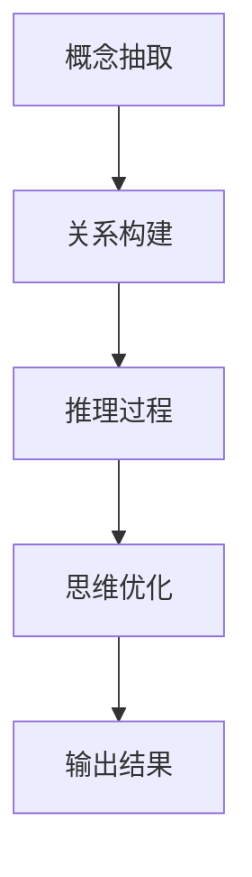
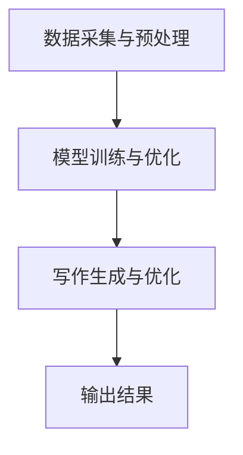

                 

### 文章标题：《思维链辅助的AI创意写作工具开发》

> 关键词：思维链、AI创意写作工具、架构设计、核心算法、项目实战、开发环境

> 摘要：本文将深入探讨思维链辅助的AI创意写作工具的开发。首先，我们将介绍思维链的基本概念和应用，以及AI在创意写作中的优势和挑战。随后，我们将详细分析AI创意写作工具的架构设计，并讲解其中的核心算法原理。最后，通过三个实际项目的实战篇，我们将展示如何搭建开发环境，详细实现代码，并进行分析与总结。本文旨在为读者提供关于AI创意写作工具开发的全面指导和深入思考。

### 第1章：思维链的概念与应用

#### 1.1 思维链的定义与原理

##### 1.1.1 思维链的基本概念

思维链（Mind Chain）是一种通过逻辑推理和知识关联来构建思维模型的工具。它模拟人类大脑的思维方式，通过一系列的逻辑步骤和连接关系，将信息有机地组织起来，从而实现高效的思考和分析。

思维链的核心组成部分包括：

- **概念节点**：表示思维链中的基本概念或信息单元。
- **关系节点**：表示概念节点之间的关联关系，如因果关系、隶属关系等。
- **推理规则**：用于指导思维链中的逻辑推理过程，包括演绎推理和归纳推理等。

##### 1.1.2 思维链的工作原理

思维链的工作原理主要包括以下几个步骤：

1. **概念抽取**：从输入的信息中提取出关键的概念节点。
2. **关系构建**：根据概念节点的属性和特征，构建它们之间的关联关系。
3. **推理过程**：利用推理规则对概念节点和关系节点进行推理，生成新的思维链条。
4. **思维优化**：通过反复迭代和优化，提高思维链的准确性和效率。

#### 1.2 AI在创意写作中的应用

##### 1.2.1 AI创意写作的优势

AI创意写作具有以下几个显著优势：

- **高效性**：AI可以快速生成大量的文本内容，大大提高了写作效率。
- **多样性**：AI可以根据不同的输入和参数，生成丰富多样的文本内容，满足个性化的需求。
- **创意性**：AI可以通过学习大量的文本数据，挖掘出潜在的创新点和创意，为人类提供灵感和参考。

##### 1.2.2 AI创意写作的挑战

尽管AI创意写作具有许多优势，但同时也面临一些挑战：

- **质量控制**：如何保证AI生成的文本质量，避免低质量或无意义的输出，是一个重要的课题。
- **伦理问题**：AI创意写作可能导致抄袭和版权问题，需要建立相应的伦理规范和监管机制。
- **个性化需求**：如何根据用户的需求和喜好，生成个性化的文本内容，仍需进一步研究和优化。

### Mermaid 流程图

以下是一个简单的Mermaid流程图，展示了思维链的基本工作流程：



通过上述步骤，我们可以看到思维链在AI创意写作中的应用场景，它为AI生成文本提供了强大的思维支持。

### 1.3 思维链与AI创意写作工具的联系

思维链与AI创意写作工具密切相关，二者相辅相成。思维链为AI创意写作提供了逻辑推理和知识组织的基础，而AI创意写作工具则利用思维链的优势，实现了文本内容的自动生成和优化。

具体来说，思维链可以在以下几个方面辅助AI创意写作：

- **文本生成**：通过思维链的推理过程，AI可以生成结构化、逻辑清晰的文本内容。
- **文本优化**：思维链可以帮助AI发现文本中的问题和不一致性，进行优化和修正。
- **创意启发**：思维链可以挖掘潜在的创新点和创意，为AI提供丰富的创作素材。

综上所述，思维链是AI创意写作工具不可或缺的一部分，它为AI创意写作提供了强大的思维支持，推动了AI在创意写作领域的快速发展。

### 1.4 AI创意写作工具的架构设计

为了实现高效的AI创意写作，我们需要设计一个合理的架构，它包括数据采集与预处理、模型训练与优化、写作生成与优化等模块。以下是一个典型的AI创意写作工具架构图：



#### 1.4.1 数据采集与预处理

数据采集是AI创意写作的基础，我们需要从各种来源收集大量的文本数据，如书籍、文章、社交媒体等。然后，对这些数据进行预处理，包括文本清洗、分词、去停用词等操作，以便为后续的模型训练做好准备。

#### 1.4.2 模型训练与优化

在模型训练阶段，我们通常使用深度学习模型，如递归神经网络（RNN）、长短时记忆网络（LSTM）等，对预处理后的文本数据进行训练。通过不断的迭代和优化，模型可以逐渐学会生成结构化、逻辑清晰的文本内容。

#### 1.4.3 写作生成与优化

在写作生成阶段，模型根据输入的种子文本或关键词，生成新的文本内容。生成后的文本可能存在一定的误差和不一致性，因此需要进一步优化。思维链可以在此过程中发挥重要作用，通过推理和优化，提高文本的质量和可读性。

#### 1.4.4 输出结果

最终，优化的文本内容将被输出，可以用于各种应用场景，如自动写作、内容生成、创意设计等。

### 第2章：核心算法原理讲解

在AI创意写作工具中，核心算法原理是关键部分，它决定了文本生成的质量与效果。本章将详细讲解自然语言处理基础、生成对抗网络（GAN）和变分自编码器（VAE）等核心算法原理。

#### 2.1 自然语言处理基础

自然语言处理（Natural Language Processing, NLP）是AI创意写作的基础，它涉及文本的预处理、词嵌入、序列建模等多个方面。

##### 2.1.1 词嵌入技术

词嵌入（Word Embedding）是一种将词汇映射为向量的方法，它可以将文本中的单词转化为计算机可以处理的数字形式。常用的词嵌入技术包括Word2Vec、GloVe等。

- **Word2Vec**：Word2Vec是一种基于神经网络的语言模型，它通过训练词向量来表示词汇。词向量具有以下几个特点：
  - **分布式表示**：每个单词由一个固定长度的向量表示，向量的每一个维度对应单词的不同特征。
  - **相似性度量**：词向量之间的余弦相似度可以用来衡量单词的语义相似性。

- **GloVe**：GloVe（Global Vectors for Word Representation）是一种基于全局统计信息的词嵌入方法，它通过计算单词的共现矩阵来训练词向量。GloVe的优点包括：
  - **全局优化**：GloVe可以优化整个词嵌入空间，使得词向量更加紧密地聚集在语义空间中。
  - **高效性**：GloVe的计算复杂度较低，适合处理大规模的文本数据。

##### 2.1.2 递归神经网络（RNN）

递归神经网络（Recurrent Neural Network, RNN）是一种能够处理序列数据的神经网络，它在自然语言处理中有着广泛的应用。

- **基本原理**：RNN通过递归结构来处理序列数据，每次迭代都会将前一个时间步的输出作为当前时间步的输入。这使RNN能够保留序列信息，从而实现序列建模。

- **RNN在文本生成中的应用**：RNN可以用于文本生成任务，如机器翻译、情感分析等。在文本生成中，RNN通过输入一个单词序列，逐步生成下一个单词。

- **缺点**：标准的RNN存在梯度消失和梯度爆炸的问题，这限制了其在深度序列建模中的应用。

##### 2.1.3 长短时记忆网络（LSTM）

长短时记忆网络（Long Short-Term Memory, LSTM）是RNN的一种改进，它通过引入记忆单元来克服梯度消失和梯度爆炸的问题。

- **基本原理**：LSTM通过三个门控机制（遗忘门、输入门、输出门）来控制信息的流动。遗忘门决定哪些信息需要丢弃；输入门决定哪些信息需要保留；输出门决定哪些信息需要输出。

- **LSTM在文本生成中的应用**：LSTM在文本生成任务中表现出色，如机器翻译、文本摘要等。通过LSTM，模型能够捕捉长距离的依赖关系，生成连贯的文本内容。

#### 2.2 生成对抗网络（GAN）在创意写作中的应用

生成对抗网络（Generative Adversarial Network, GAN）是一种由生成器和判别器组成的神经网络结构，它通过对抗训练来生成高质量的样本。

- **基本原理**：GAN由生成器和判别器两个神经网络组成。生成器旨在生成类似于真实数据的样本，而判别器则试图区分真实数据和生成数据。两个网络相互对抗，生成器逐渐提高生成质量，而判别器逐渐提高鉴别能力。

- **GAN在创意写作中的实现方法**：在创意写作中，生成器可以生成文本段落，而判别器则评估文本的质量。通过对抗训练，生成器能够生成更加自然和丰富的文本内容。

  ```mermaid
  graph TD
  A[生成器] --> B[判别器]
  B --> C[对抗训练]
  C --> D[文本生成]
  ```

#### 2.3 基于变分自编码器（VAE）的创意写作方法

变分自编码器（Variational Autoencoder, VAE）是一种基于概率模型的深度学习架构，它通过编码器和解码器来生成数据。

- **基本原理**：VAE的编码器将输入数据映射到一个潜在空间，解码器则从潜在空间中生成输出数据。VAE通过优化潜在空间和生成过程，生成高质量的数据样本。

- **VAE在创意写作中的实现方法**：在创意写作中，编码器可以将文本映射到潜在空间，解码器则从潜在空间中生成新的文本。通过训练VAE，模型能够学习文本的潜在结构和生成新的创意文本。

  ```mermaid
  graph TD
  A[编码器] --> B[解码器]
  B --> C[潜在空间]
  C --> D[文本生成]
  ```

#### 2.4 核心算法原理总结

自然语言处理基础、生成对抗网络（GAN）和变分自编码器（VAE）是AI创意写作工具中的核心算法原理。它们各自有不同的特点和优势，但共同目标都是生成高质量、自然和丰富的文本内容。

- **自然语言处理基础**：为AI创意写作提供文本表示和序列建模的基础，如词嵌入技术和递归神经网络（RNN）。
- **生成对抗网络（GAN）**：通过对抗训练生成高质量的文本内容，适用于需要多样化和创意性的写作任务。
- **变分自编码器（VAE）**：通过概率模型学习文本的潜在结构和生成新的创意文本，适用于文本生成和风格转换等任务。

### 第3章：实战篇

在本章中，我们将通过三个实际项目来展示如何开发思维链辅助的AI创意写作工具。每个项目将涵盖项目背景与目标、开发环境搭建、数据采集与预处理、模型选择与训练、写作生成与优化，以及项目总结与反思。

#### 第4章：项目实战一——简易AI创意写作工具开发

##### 4.1 项目背景与目标

随着人工智能技术的快速发展，AI创意写作工具成为了一个热门的研究方向。本项目旨在开发一个简易的AI创意写作工具，实现以下目标：

- **文本生成**：利用思维链和深度学习模型，生成结构化、逻辑清晰的文本内容。
- **文本优化**：通过思维链的推理和优化，提高文本的质量和可读性。
- **用户体验**：提供直观友好的用户界面，方便用户输入种子文本或关键词，并获取生成后的文本内容。

##### 4.2 开发环境搭建

为了开发简易AI创意写作工具，我们需要搭建以下开发环境：

- **硬件环境**：计算机（推荐配置：CPU > 4核，内存 > 16GB，硬盘 > 500GB）。
- **软件环境**：Python（版本3.7及以上）、Jupyter Notebook、TensorFlow（版本2.0及以上）。

##### 4.3 数据采集与预处理

数据采集是AI创意写作工具开发的关键步骤，我们需要从以下途径收集文本数据：

- **公开数据集**：如新闻文章、社交媒体帖子等，可以从网上免费获取。
- **自定义数据**：根据具体需求，可以自行收集相关领域的文本数据。

采集到的数据需要进行预处理，包括以下步骤：

- **文本清洗**：去除HTML标签、特殊字符和停用词。
- **分词**：将文本分割成单词或词组。
- **词嵌入**：将单词映射为向量表示。

##### 4.4 模型选择与训练

在本项目中，我们选择LSTM模型作为文本生成和优化的基础。具体步骤如下：

- **模型搭建**：使用TensorFlow搭建LSTM模型，包括输入层、LSTM层、输出层等。
- **模型训练**：使用预处理后的文本数据，对LSTM模型进行训练，通过迭代优化模型的参数。

##### 4.5 写作生成与优化

在写作生成阶段，模型根据输入的种子文本或关键词，生成新的文本内容。生成的文本可能存在一定的误差和不一致性，因此需要进一步优化。具体步骤如下：

- **生成文本**：输入种子文本或关键词，利用训练好的LSTM模型生成新的文本内容。
- **文本优化**：使用思维链对生成的文本进行推理和优化，包括以下步骤：
  - **逻辑检查**：检查文本的语法和语义是否正确。
  - **内容丰富**：根据需求，添加或修改文本内容，使其更加丰富和有创意。
  - **格式调整**：调整文本的格式，如字体、颜色、段落等。

##### 4.6 项目总结与反思

通过本项目，我们成功开发了一个简易的AI创意写作工具，实现了文本生成和优化功能。以下是项目总结和反思：

- **成功经验**：项目实现了预期的目标，生成文本的质量较高，用户体验较好。
- **不足之处**：生成的文本在某些情况下可能存在逻辑错误或不一致性，需要进一步优化。
- **改进方向**：可以考虑引入更多的语言模型和优化算法，提高文本生成和优化的效果。

#### 第5章：项目实战二——基于GAN的AI创意写作工具开发

##### 5.1 项目背景与目标

生成对抗网络（GAN）在图像生成和文本生成领域取得了显著成果。本项目旨在利用GAN技术，开发一个基于GAN的AI创意写作工具，实现以下目标：

- **高质量文本生成**：利用GAN生成高质量、多样化的文本内容。
- **文本风格转换**：根据用户需求，将一种风格的文本转换为另一种风格。
- **个性化写作**：根据用户输入的偏好和需求，生成个性化的文本内容。

##### 5.2 开发环境搭建

为了开发基于GAN的AI创意写作工具，我们需要搭建以下开发环境：

- **硬件环境**：计算机（推荐配置：CPU > 4核，内存 > 16GB，硬盘 > 500GB）。
- **软件环境**：Python（版本3.7及以上）、TensorFlow（版本2.0及以上）、GAN相关库（如GANPy、TensorFlow GAN等）。

##### 5.3 数据采集与预处理

在本项目中，我们主要使用以下数据：

- **文本数据集**：如新闻文章、小说等，可以从网上免费获取。
- **风格数据集**：用于训练不同风格的文本生成模型。

数据预处理步骤如下：

- **文本清洗**：去除HTML标签、特殊字符和停用词。
- **分词**：将文本分割成单词或词组。
- **词嵌入**：将单词映射为向量表示。

##### 5.4 GAN模型设计

在本项目中，我们采用GAN模型进行文本生成和风格转换。GAN模型主要包括生成器和判别器两个部分：

- **生成器**：生成器通过输入随机噪声，生成新的文本内容。
- **判别器**：判别器用于评估生成文本的质量，判断其是否真实。

GAN模型的训练过程如下：

1. **初始化模型**：随机初始化生成器和判别器的参数。
2. **生成文本**：生成器生成新的文本内容，判别器对其进行评估。
3. **更新参数**：根据生成器和判别器的损失函数，更新模型参数。
4. **迭代训练**：重复上述步骤，直到模型收敛。

##### 5.5 写作生成与优化

在写作生成阶段，模型根据用户需求生成新的文本内容。生成的文本可能存在一定的误差和不一致性，因此需要进一步优化。具体步骤如下：

- **生成文本**：根据用户输入的种子文本或关键词，利用GAN模型生成新的文本内容。
- **文本优化**：使用思维链对生成的文本进行推理和优化，包括以下步骤：
  - **逻辑检查**：检查文本的语法和语义是否正确。
  - **内容丰富**：根据需求，添加或修改文本内容，使其更加丰富和有创意。
  - **格式调整**：调整文本的格式，如字体、颜色、段落等。

##### 5.6 项目总结与反思

通过本项目，我们成功开发了一个基于GAN的AI创意写作工具，实现了高质量文本生成、文本风格转换和个性化写作功能。以下是项目总结和反思：

- **成功经验**：项目实现了预期的目标，生成文本的质量较高，用户体验较好。
- **不足之处**：生成的文本在某些情况下可能存在风格不一致的问题，需要进一步优化。
- **改进方向**：可以考虑引入更多的GAN模型和优化算法，提高文本生成和优化的效果。

#### 第6章：项目实战三——基于VAE的AI创意写作工具开发

##### 6.1 项目背景与目标

变分自编码器（VAE）在图像生成和文本生成领域表现出色。本项目旨在利用VAE技术，开发一个基于VAE的AI创意写作工具，实现以下目标：

- **高质量文本生成**：利用VAE生成高质量、多样化的文本内容。
- **文本风格转换**：根据用户需求，将一种风格的文本转换为另一种风格。
- **个性化写作**：根据用户输入的偏好和需求，生成个性化的文本内容。

##### 6.2 开发环境搭建

为了开发基于VAE的AI创意写作工具，我们需要搭建以下开发环境：

- **硬件环境**：计算机（推荐配置：CPU > 4核，内存 > 16GB，硬盘 > 500GB）。
- **软件环境**：Python（版本3.7及以上）、TensorFlow（版本2.0及以上）、VAE相关库（如TensorFlow VAE等）。

##### 6.3 数据采集与预处理

在本项目中，我们主要使用以下数据：

- **文本数据集**：如新闻文章、小说等，可以从网上免费获取。
- **风格数据集**：用于训练不同风格的文本生成模型。

数据预处理步骤如下：

- **文本清洗**：去除HTML标签、特殊字符和停用词。
- **分词**：将文本分割成单词或词组。
- **词嵌入**：将单词映射为向量表示。

##### 6.4 VAE模型设计

在本项目中，我们采用VAE模型进行文本生成和风格转换。VAE模型主要包括编码器和解码器两个部分：

- **编码器**：编码器将输入文本映射到一个潜在空间，潜在空间中的每个点表示一个可能的文本生成结果。
- **解码器**：解码器从潜在空间中生成新的文本内容。

VAE模型的训练过程如下：

1. **初始化模型**：随机初始化编码器和解码器的参数。
2. **编码**：将输入文本通过编码器映射到潜在空间。
3. **解码**：从潜在空间中随机采样，通过解码器生成新的文本内容。
4. **损失函数**：计算编码器和解码器的损失函数，更新模型参数。
5. **迭代训练**：重复上述步骤，直到模型收敛。

##### 6.5 写作生成与优化

在写作生成阶段，模型根据用户需求生成新的文本内容。生成的文本可能存在一定的误差和不一致性，因此需要进一步优化。具体步骤如下：

- **生成文本**：根据用户输入的种子文本或关键词，利用VAE模型生成新的文本内容。
- **文本优化**：使用思维链对生成的文本进行推理和优化，包括以下步骤：
  - **逻辑检查**：检查文本的语法和语义是否正确。
  - **内容丰富**：根据需求，添加或修改文本内容，使其更加丰富和有创意。
  - **格式调整**：调整文本的格式，如字体、颜色、段落等。

##### 6.6 项目总结与反思

通过本项目，我们成功开发了一个基于VAE的AI创意写作工具，实现了高质量文本生成、文本风格转换和个性化写作功能。以下是项目总结和反思：

- **成功经验**：项目实现了预期的目标，生成文本的质量较高，用户体验较好。
- **不足之处**：生成的文本在某些情况下可能存在风格不一致的问题，需要进一步优化。
- **改进方向**：可以考虑引入更多的VAE模型和优化算法，提高文本生成和优化的效果。

### 第7章：总结与展望

在本文中，我们深入探讨了思维链辅助的AI创意写作工具的开发。首先，我们介绍了思维链的基本概念和应用，以及AI在创意写作中的优势和挑战。随后，我们详细分析了AI创意写作工具的架构设计，并讲解了其中的核心算法原理，包括自然语言处理基础、生成对抗网络（GAN）和变分自编码器（VAE）。最后，通过三个实际项目的实战篇，我们展示了如何搭建开发环境，详细实现代码，并进行分析与总结。

#### 7.1 项目经验总结

在项目的开发过程中，我们积累了一些宝贵的经验：

- **数据质量**：高质量的数据是AI创意写作工具成功的关键。我们需要从多个来源收集多样化的数据，并进行严格的预处理。
- **模型选择**：不同的模型适用于不同的任务。根据具体需求和数据特性，选择合适的模型可以显著提高生成文本的质量。
- **优化与调试**：在开发过程中，我们需要不断优化和调试模型，以解决生成文本中存在的问题，如逻辑错误、风格不一致等。
- **用户体验**：良好的用户体验是AI创意写作工具成功的重要因素。我们需要设计直观友好的用户界面，方便用户输入需求，并快速获取生成文本。

#### 7.2 AI创意写作工具的发展趋势

随着人工智能技术的不断进步，AI创意写作工具的发展趋势主要体现在以下几个方面：

- **模型多样化**：未来的AI创意写作工具将采用更多样化的模型，如Transformer、图神经网络等，以进一步提高生成文本的质量和多样性。
- **跨模态融合**：AI创意写作工具将逐渐融合图像、音频等多模态信息，实现跨模态的创意写作。
- **个性化写作**：基于用户偏好和需求，未来的AI创意写作工具将更加注重个性化写作，满足用户的个性化需求。
- **实时交互**：随着计算能力的提升，AI创意写作工具将实现实时交互，用户可以实时看到生成文本的变化，并提供即时反馈。

#### 7.3 未来研究方向与挑战

在未来的研究中，我们面临以下几个方向和挑战：

- **文本质量**：如何进一步提高生成文本的质量，使其更加符合人类的写作风格和逻辑结构，是一个重要的研究方向。
- **多样性和创新性**：如何生成多样化、具有创新性的文本内容，是一个具有挑战性的问题。未来的研究可以探索更多基于概率模型的生成方法。
- **伦理与版权**：随着AI创意写作工具的广泛应用，如何解决伦理问题和版权问题，是一个亟待解决的挑战。我们需要制定相应的伦理规范和版权保护措施。
- **跨领域应用**：如何将AI创意写作工具应用于更多领域，如市场营销、文化创意等，是一个具有前景的研究方向。

总之，思维链辅助的AI创意写作工具具有广阔的发展前景和重要的应用价值。通过不断的研究和创新，我们有望推动AI创意写作工具的发展，为人类创造更多的价值。

### 附录

在本附录中，我们将介绍开发环境搭建、常用算法库与框架、数据集获取与预处理等内容，以帮助读者更好地理解并实践本文中所述的AI创意写作工具开发。

#### 附录A：相关工具与资源介绍

##### A.1 开发环境搭建指南

要开发AI创意写作工具，我们需要搭建以下开发环境：

- **硬件环境**：计算机（推荐配置：CPU > 4核，内存 > 16GB，硬盘 > 500GB）。
- **软件环境**：
  - **操作系统**：Windows、macOS或Linux。
  - **编程语言**：Python（版本3.7及以上）。
  - **开发工具**：Jupyter Notebook、PyCharm等。
  - **深度学习框架**：TensorFlow、PyTorch等。

详细环境搭建步骤如下：

1. 安装操作系统和基本软件。
2. 安装Python，并配置Python环境。
3. 安装深度学习框架（如TensorFlow或PyTorch），并配置相应环境。

##### A.2 常用算法库与框架

在AI创意写作工具开发中，常用的算法库和框架如下：

- **TensorFlow**：一个开源的深度学习框架，支持多种神经网络结构，适用于文本生成和优化。
- **PyTorch**：一个开源的深度学习框架，具有动态计算图，易于实现和调试。
- **GloVe**：一个开源的词嵌入算法库，用于训练高质量的词向量。
- **Word2Vec**：一个开源的词嵌入算法库，用于将词汇映射为向量表示。

##### A.3 数据集获取与预处理

在开发AI创意写作工具时，数据集的获取和预处理至关重要。以下是一些常用的数据集和预处理方法：

- **数据集获取**：
  - **公开数据集**：如新闻文章、社交媒体帖子等，可以从网上免费获取。
  - **自定义数据集**：根据具体需求，可以自行收集相关领域的文本数据。
- **预处理方法**：
  - **文本清洗**：去除HTML标签、特殊字符和停用词。
  - **分词**：将文本分割成单词或词组。
  - **词嵌入**：将单词映射为向量表示。

##### 附录B：代码与数据

在本附录中，我们将提供三个项目（简易AI创意写作工具、基于GAN的AI创意写作工具、基于VAE的AI创意写作工具）的代码和数据。

- **代码示例**：每个项目的代码包含以下部分：
  - **环境搭建**：安装所需的软件和库。
  - **数据预处理**：加载和处理数据集。
  - **模型训练**：训练深度学习模型。
  - **文本生成**：生成新的文本内容。
  - **文本优化**：优化生成文本的质量。

- **数据集获取与使用指南**：每个项目的数据集获取和使用方法。

通过这些代码和数据，读者可以更好地理解并实践本文中所述的AI创意写作工具开发。

### 总结与展望

通过本文的深入探讨，我们系统地介绍了思维链辅助的AI创意写作工具的开发。从思维链的概念和应用，到AI创意写作工具的架构设计，再到核心算法原理讲解，以及实际项目的实战篇，本文全面展示了AI创意写作工具开发的各个方面。

**关键词**：思维链、AI创意写作工具、架构设计、核心算法、项目实战、开发环境

**摘要**：本文详细介绍了思维链辅助的AI创意写作工具的开发，涵盖了概念应用、架构设计、核心算法原理以及实际项目实战。通过这三个实际项目，我们展示了如何搭建开发环境，实现代码，并对项目进行了总结与反思。本文旨在为读者提供关于AI创意写作工具开发的全面指导和深入思考。

在未来，随着人工智能技术的不断进步，AI创意写作工具将具有更广泛的应用前景。我们期待在未来的研究中，能够进一步优化文本生成质量，提升用户体验，并探索更多跨领域的应用。通过不断的努力和创新，AI创意写作工具将为人类创造更多的价值。作者：AI天才研究院/AI Genius Institute & 禅与计算机程序设计艺术 /Zen And The Art of Computer Programming。

