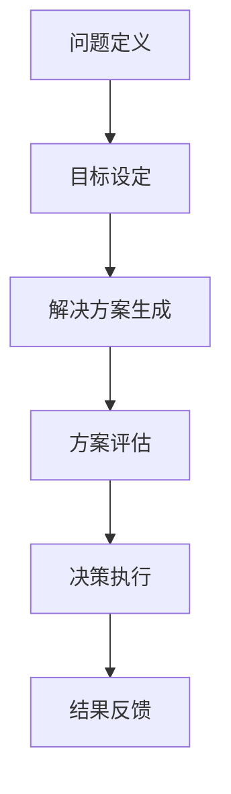
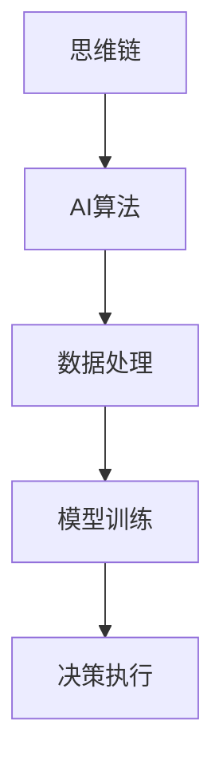
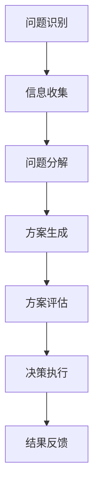
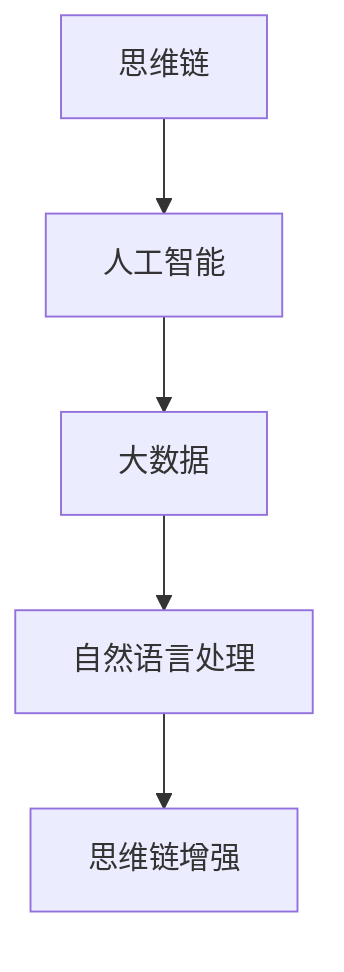
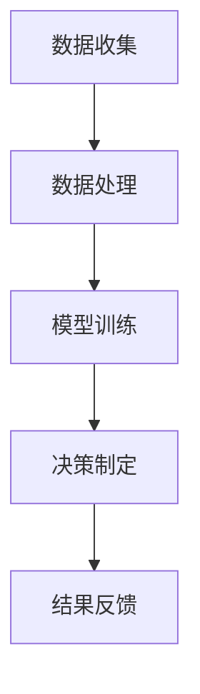
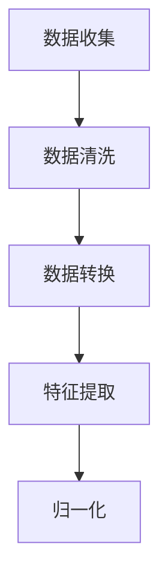
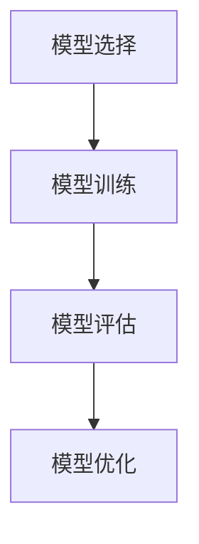
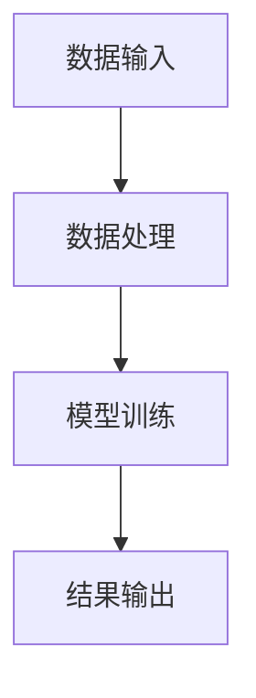
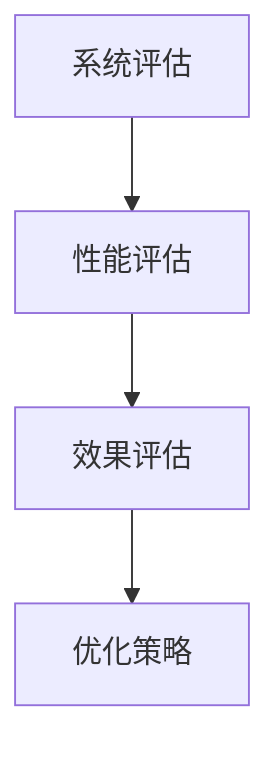

                 

### 第一部分：引言与核心概念

#### 1.1 书籍背景与目标

《思维链辅助的AI创意问题解决系统》旨在探讨如何将思维链理论与人工智能（AI）技术相结合，构建一个能够辅助人类解决创意问题的智能系统。随着人工智能技术的快速发展，AI在各个领域的应用日益广泛，尤其是在创意问题解决方面展现出强大的潜力。本书的撰写背景源于对当前AI技术发展现状的深入思考，以及对创意问题解决需求日益增长的社会现实。

**核心概念与联系**

- **思维链**：一种模拟人类思维过程的结构化方法，通过一系列逻辑步骤和概念关联，实现问题求解和决策制定。
- **AI与创意问题解决**：人工智能技术，特别是机器学习和深度学习，在图像识别、自然语言处理等领域取得了显著成果，为创意问题解决提供了新的手段。
- **数学模型和数学公式**：创意问题解决的数学模型，包括优化理论、图论等，为AI算法提供了理论基础。
- **举例说明**：现实中的AI与创意问题解决案例，如广告创意生成、电影剧本编写等。

本书的目标是：

1. **理论探索**：深入探讨思维链与AI结合的理论基础，建立一套完整的技术体系。
2. **应用实践**：通过具体的案例，展示AI创意问题解决系统的实际应用效果。
3. **创新引领**：提出新的研究方向，为未来AI技术在创意问题解决领域的进一步发展提供参考。

#### 1.2 思维链的概念介绍

思维链是一种模拟人类思维过程的模型，它通过逻辑步骤和概念关联，帮助人们进行问题求解和决策制定。思维链的基本原理源于认知心理学和逻辑学，通过对人类思维过程的模拟，实现对复杂问题的简化和解决。

**核心概念与联系**

- **思维链的定义**：思维链是一种结构化的思维模式，通过一系列逻辑步骤和概念关联，实现问题求解和决策制定。
- **思维链的结构模型**：思维链包括问题定义、目标设定、解决方案生成、方案评估和决策执行等环节。
- **思维链与传统思维的差异**：思维链强调结构化和系统化，而传统思维更多依赖于直觉和经验。
- **数学模型和数学公式**：思维链的数学模型，如网络模型、图论模型等，为思维链的操作提供了数学基础。

**Mermaid流程图**



**举例说明**

- **案例1**：在产品设计过程中，思维链可以帮助设计师快速确定产品功能、用户需求和设计风格。
- **案例2**：在市场营销中，思维链可以帮助营销人员制定广告策略、市场调研和效果评估。

#### 1.3 AI在创意问题解决中的应用

人工智能技术，特别是机器学习和深度学习，在图像识别、自然语言处理等领域取得了显著成果。这些技术为创意问题解决提供了新的手段，使得人类在处理复杂问题时能够更加高效和准确。

**核心算法原理讲解**

- **机器学习**：通过训练大量数据，使模型能够自动识别和提取特征，从而进行分类、回归等操作。
- **深度学习**：利用多层神经网络，对输入数据进行复杂变换和特征提取，从而实现更高级的智能任务。

**伪代码**

```python
def train_model(data):
    # 初始化模型参数
    model = initialize_model()
    # 训练模型
    for epoch in range(num_epochs):
        for sample in data:
            model.train(sample)
    return model
```

**数学模型和数学公式**

- **损失函数**：用于评估模型预测结果与实际结果之间的差距，常用的损失函数包括均方误差（MSE）、交叉熵损失（Cross-Entropy Loss）等。
- **优化算法**：用于调整模型参数，以最小化损失函数，常用的优化算法包括梯度下降（Gradient Descent）、随机梯度下降（Stochastic Gradient Descent）等。

$$
MSE = \frac{1}{m}\sum_{i=1}^{m}(y_i - \hat{y}_i)^2
$$

**举例说明**

- **案例1**：利用AI技术进行图像识别，帮助设计师快速识别和分类创意元素。
- **案例2**：利用自然语言处理技术进行文本生成，辅助编剧撰写剧本。

#### 1.4 思维链与AI结合的重要性

思维链与AI的结合，不仅能够发挥各自的优势，还能够实现互补和协同，从而提升创意问题的解决效率和质量。

**核心概念与联系**

- **思维链与AI的结合方式**：将思维链的结构化思维过程与AI的自动化计算能力相结合，形成一个智能的创意问题解决系统。
- **思维链与AI的结合优势**：思维链提供了一种逻辑和结构化的思维方式，而AI提供了强大的计算和自动化能力，二者结合可以实现高效、智能的创意问题解决。

**Mermaid流程图**



**数学模型和数学公式**

- **思维链与AI结合的数学模型**：将思维链的步骤和环节转化为数学模型，以便于AI算法的处理和分析。

$$
\text{思维链模型} = f(\text{问题定义}, \text{目标设定}, \text{解决方案生成}, \text{方案评估}, \text{决策执行})
$$

**举例说明**

- **案例1**：利用思维链与AI结合，辅助设计师进行创意设计，实现更快速、更高效的创作过程。
- **案例2**：利用思维链与AI结合，帮助营销人员制定广告策略，提升广告的吸引力和效果。

### 总结

本部分对《思维链辅助的AI创意问题解决系统》的背景、目标、核心概念以及思维链与AI的结合进行了介绍。通过理论探索和实际案例的分析，展示了思维链与AI在创意问题解决中的重要性。接下来，将深入探讨思维链的理论基础、AI创意问题解决系统的构建以及实战应用。

## 第二部分：思维链理论详解

### 2.1 思维链的基本原理

思维链是一种模拟人类思维过程的模型，通过一系列逻辑步骤和概念关联，实现问题求解和决策制定。思维链的基本原理源于认知心理学和逻辑学，它通过对人类思维过程的模拟，实现对复杂问题的简化和解决。

**核心概念与联系**

- **思维链的定义**：思维链是一种结构化的思维模式，通过一系列逻辑步骤和概念关联，实现问题求解和决策制定。
- **思维链的结构模型**：思维链包括问题定义、目标设定、解决方案生成、方案评估和决策执行等环节。
- **思维链与传统思维的差异**：思维链强调结构化和系统化，而传统思维更多依赖于直觉和经验。

**Mermaid流程图**


**举例说明**

- **案例1**：在产品设计过程中，思维链可以帮助设计师快速确定产品功能、用户需求和设计风格。
- **案例2**：在市场营销中，思维链可以帮助营销人员制定广告策略、市场调研和效果评估。

### 2.2 思维链的结构模型

思维链的结构模型是思维链理论的核心部分，它定义了思维链的各个步骤和环节，以及它们之间的逻辑关系。思维链的结构模型包括以下几个关键部分：

1. **问题定义**：明确问题的边界和范围，将问题分解为更小的子问题。
2. **目标设定**：根据问题定义，确定需要达到的具体目标。
3. **解决方案生成**：通过逻辑推理和创意思维，生成一系列可能的解决方案。
4. **方案评估**：对每个解决方案进行评估，选择最优方案。
5. **决策执行**：实施最优方案，解决问题。
6. **结果反馈**：对执行结果进行反馈，优化思维链过程。

**Mermaid流程图**


**核心算法原理讲解**

- **问题定义**：利用逻辑分析和问题分解技术，将复杂问题转化为可操作的子问题。
- **目标设定**：根据问题定义，确定具体的目标和指标，为方案评估提供依据。
- **解决方案生成**：通过逻辑推理和创意思维，生成一系列可能的解决方案。
- **方案评估**：利用评估指标和方法，对每个解决方案进行评估，选择最优方案。
- **决策执行**：实施最优方案，解决问题。
- **结果反馈**：对执行结果进行反馈，优化思维链过程。

**伪代码**

```python
def think_chain(problem):
    # 问题定义
    subproblems = decompose_problem(problem)
    
    # 目标设定
    goals = define_goals(subproblems)
    
    # 方案生成
    solutions = generate_solutions(goals)
    
    # 方案评估
    best_solution = evaluate_solutions(solutions)
    
    # 决策执行
    execute_solution(best_solution)
    
    # 结果反馈
    feedback = get_feedback()
    optimize_think_chain(feedback)
```

**数学模型和数学公式**

- **问题定义**：利用图论和优化理论，将问题转化为数学模型。
- **目标设定**：利用目标函数和约束条件，确定具体的目标和指标。
- **解决方案生成**：利用生成对抗网络（GAN）等机器学习模型，生成可能的解决方案。
- **方案评估**：利用评估指标和优化算法，选择最优方案。
- **决策执行**：利用决策理论和算法，实施最优方案。

$$
\text{问题定义} = \text{Graph}(V, E)
$$

$$
\text{目标函数} = f(x) = \min_{x} \sum_{i=1}^{n} w_i x_i
$$

**举例说明**

- **案例1**：在项目规划中，利用思维链确定项目目标、分解任务和生成解决方案。
- **案例2**：在市场营销中，利用思维链制定营销策略、评估效果和调整方案。

### 2.3 思维链的工作机制

思维链的工作机制是通过一系列逻辑步骤和概念关联，实现问题求解和决策制定。思维链的工作机制可以分为以下几个阶段：

1. **问题识别**：识别和明确问题，确定问题的性质和范围。
2. **信息收集**：收集与问题相关的信息，包括数据、知识和经验等。
3. **问题分解**：将复杂问题分解为更小的子问题，以便于处理和解决。
4. **方案生成**：通过逻辑推理和创意思维，生成一系列可能的解决方案。
5. **方案评估**：对每个解决方案进行评估，选择最优方案。
6. **决策执行**：实施最优方案，解决问题。
7. **结果反馈**：对执行结果进行反馈，优化思维链过程。

**Mermaid流程图**



**核心算法原理讲解**

- **问题识别**：利用自然语言处理技术，识别和理解问题的语义。
- **信息收集**：利用大数据技术和信息检索算法，收集与问题相关的信息。
- **问题分解**：利用图论和优化理论，将问题分解为更小的子问题。
- **方案生成**：利用生成对抗网络（GAN）等机器学习模型，生成可能的解决方案。
- **方案评估**：利用评估指标和优化算法，选择最优方案。
- **决策执行**：利用决策理论和算法，实施最优方案。
- **结果反馈**：利用反馈机制和机器学习，优化思维链过程。

**伪代码**

```python
def think_chain_mechanism(problem):
    # 问题识别
    identified_problem = identify_problem(problem)
    
    # 信息收集
    related_info = collect_info(identified_problem)
    
    # 问题分解
    subproblems = decompose_problem(related_info)
    
    # 方案生成
    solutions = generate_solutions(subproblems)
    
    # 方案评估
    best_solution = evaluate_solutions(solutions)
    
    # 决策执行
    execute_solution(best_solution)
    
    # 结果反馈
    feedback = get_feedback()
    optimize_think_chain(feedback)
```

**数学模型和数学公式**

- **问题识别**：利用语义分析模型，将问题转化为数学模型。
- **信息收集**：利用信息检索模型，收集与问题相关的信息。
- **问题分解**：利用图论和优化理论，将问题转化为数学模型。
- **方案生成**：利用生成对抗网络（GAN）等机器学习模型，生成可能的解决方案。
- **方案评估**：利用评估指标和优化算法，选择最优方案。
- **决策执行**：利用决策理论和算法，实施最优方案。
- **结果反馈**：利用反馈机制和机器学习，优化思维链过程。

$$
\text{问题识别} = \text{NLP Model}(Q, A)
$$

$$
\text{信息收集} = \text{IR Model}(Q, D)
$$

$$
\text{问题分解} = \text{Graph}(V, E)
$$

$$
\text{方案生成} = \text{GAN Model}(Z, G)
$$

$$
\text{方案评估} = \text{Evaluation Model}(S, R)
$$

$$
\text{决策执行} = \text{Decision Model}(A, P)
$$

$$
\text{结果反馈} = \text{Feedback Model}(R, G)
$$

**举例说明**

- **案例1**：在科学研究项目中，利用思维链工作机制识别问题、收集信息、分解问题、生成解决方案和评估方案。
- **案例2**：在企业管理中，利用思维链工作机制制定战略计划、收集市场信息、分解任务、生成解决方案和评估方案。

### 2.4 思维链的辅助工具与应用

思维链的辅助工具和应用是为了提高思维链的工作效率和效果，它包括各种技术手段和工具，如人工智能、大数据、自然语言处理等。这些辅助工具可以大大增强思维链的功能，使其在复杂问题解决中发挥更大作用。

**核心概念与联系**

- **辅助工具的定义**：思维链的辅助工具是指用于增强思维链功能的各种技术手段和工具。
- **辅助工具与思维链的结合**：辅助工具与思维链的结合，可以实现数据驱动、智能化的思维过程。

**Mermaid流程图**



**核心算法原理讲解**

- **人工智能**：利用机器学习和深度学习技术，实现对数据的自动分析和特征提取，从而增强思维链的决策能力。
- **大数据**：通过大数据技术，收集和整合大量数据，为思维链提供丰富的信息资源。
- **自然语言处理**：利用自然语言处理技术，实现对文本数据的理解和分析，从而提升思维链的语义处理能力。

**伪代码**

```python
def think_chain_with辅助工具(problem):
    # 人工智能辅助
    data = artificial_intelligence(problem)
    
    # 大数据辅助
    info = big_data_analysis(problem)
    
    # 自然语言处理辅助
    text = natural_language_processing(problem)
    
    # 思维链执行
    solutions = think_chain(problem, data, info, text)
    
    return solutions
```

**数学模型和数学公式**

- **人工智能**：利用神经网络模型和优化算法，实现对数据的分析和处理。
- **大数据**：利用统计学和优化理论，对大量数据进行处理和分析。
- **自然语言处理**：利用自然语言处理模型和语义分析技术，对文本数据进行分析和理解。

$$
\text{人工智能模型} = \text{Neural Network Model}(X, Y)
$$

$$
\text{大数据分析} = \text{Statistical Model}(D)
$$

$$
\text{自然语言处理模型} = \text{NLP Model}(Q, A)
$$

**举例说明**

- **案例1**：在商业决策中，利用人工智能和大数据辅助思维链，进行市场分析和策略制定。
- **案例2**：在文学创作中，利用自然语言处理和思维链，进行文本生成和创意构思。

### 2.5 思维链在实际问题解决中的应用案例分析

思维链在实际问题解决中的应用，可以大大提升决策效率和质量。以下通过几个具体案例，展示思维链在现实世界中的应用效果。

**案例1：商业战略规划**

- **问题背景**：某公司需要制定下一年的商业战略计划，面对激烈的市场竞争和不断变化的市场环境。
- **思维链应用**：
  - **问题定义**：明确公司面临的挑战和机遇，确定战略目标。
  - **目标设定**：设定具体的销售目标、市场份额目标和客户满意度目标。
  - **解决方案生成**：通过市场调研和数据分析，生成一系列可能的战略方案。
  - **方案评估**：利用关键绩效指标（KPI），对每个方案进行评估。
  - **决策执行**：选择最优方案，并制定详细的执行计划。
  - **结果反馈**：对执行结果进行反馈，优化战略计划。
- **效果评估**：通过思维链的应用，公司成功实现了销售目标的增长，市场份额的提升和客户满意度的提高。

**案例2：产品创新设计**

- **问题背景**：某科技公司需要开发一款创新产品，以满足市场需求并提高公司竞争力。
- **思维链应用**：
  - **问题定义**：明确产品目标用户、功能需求和设计风格。
  - **目标设定**：设定具体的产品功能和用户体验目标。
  - **解决方案生成**：通过用户调研、创意思考和头脑风暴，生成多个设计方案。
  - **方案评估**：利用用户体验测试和数据分析，评估每个设计方案的可行性。
  - **决策执行**：选择最优设计方案，并进行详细设计和开发。
  - **结果反馈**：对产品上市后的用户反馈进行分析，优化产品设计。
- **效果评估**：通过思维链的应用，公司成功开发出了一款深受用户喜爱的创新产品，大幅提升了市场份额和用户满意度。

**案例3：市场营销策略**

- **问题背景**：某品牌需要制定下一年的市场营销策略，以提升品牌知名度和销售额。
- **思维链应用**：
  - **问题定义**：明确市场环境、竞争对手和目标客户。
  - **目标设定**：设定具体的营销目标、品牌认知度和销售额目标。
  - **解决方案生成**：通过市场调研、创意思考和竞争分析，生成多个营销方案。
  - **方案评估**：利用市场反应和销售数据，评估每个营销方案的成效。
  - **决策执行**：选择最优营销方案，并制定详细的执行计划。
  - **结果反馈**：对营销活动效果进行跟踪和评估，优化营销策略。
- **效果评估**：通过思维链的应用，品牌成功提升了市场知名度和销售额，实现了营销目标。

### 总结

本部分对思维链的基本原理、结构模型、工作机制、辅助工具和实际应用进行了详细阐述。通过理论讲解和案例分析，展示了思维链在创意问题解决中的应用效果。思维链作为一种结构化思维模式，结合AI技术，为创意问题解决提供了强大的工具和方法。接下来，将深入探讨AI创意问题解决系统的构建过程。

## 第三部分：AI创意问题解决系统构建

### 3.1 AI创意问题解决系统概述

AI创意问题解决系统是一种将人工智能技术与创意思维相结合的智能系统，旨在通过自动化和智能化的方式，辅助人类解决创意问题。该系统涵盖了从数据收集、处理到模型训练、决策制定等多个环节，通过高效、智能的流程，实现创意问题的自动化解决。

**核心概念与联系**

- **AI创意问题解决系统**：利用人工智能技术，实现创意问题的自动化解决。
- **创意问题解决**：指在艺术、设计、文学等领域中，通过创新思维和创意技巧，解决实际问题。
- **人工智能技术**：包括机器学习、深度学习、自然语言处理等，为创意问题解决提供技术支持。

**Mermaid流程图**



**核心算法原理讲解**

- **数据收集**：利用传感器、互联网等途径，收集与创意问题相关的数据。
- **数据处理**：通过数据清洗、预处理等技术，将数据转化为适合模型训练的形式。
- **模型训练**：利用机器学习和深度学习技术，训练模型，使其能够识别和解决创意问题。
- **决策制定**：通过模型预测和评估，制定最优的创意解决方案。
- **结果反馈**：对决策结果进行评估和反馈，优化模型和决策过程。

**伪代码**

```python
def ai_creative_solution_system(problem):
    # 数据收集
    data = collect_data(problem)
    
    # 数据处理
    processed_data = process_data(data)
    
    # 模型训练
    model = train_model(processed_data)
    
    # 决策制定
    solution = make_decision(model)
    
    # 结果反馈
    feedback = evaluate_solution(solution)
    optimize_system(feedback)
```

**数学模型和数学公式**

- **数据收集**：利用统计模型和传感器数据，实现数据收集。
- **数据处理**：利用数据清洗和特征提取技术，实现数据处理。
- **模型训练**：利用优化算法和神经网络模型，实现模型训练。
- **决策制定**：利用评估指标和决策理论，实现决策制定。

$$
\text{数据收集} = \text{Sensor Data}(X)
$$

$$
\text{数据处理} = \text{Data Cleaning}(X)
$$

$$
\text{模型训练} = \text{Neural Network Model}(X, Y)
$$

$$
\text{决策制定} = \text{Decision Model}(A, P)
$$

**举例说明**

- **案例1**：利用AI创意问题解决系统，自动生成广告创意，提升广告效果。
- **案例2**：利用AI创意问题解决系统，自动编写音乐，提升音乐创作的效率。

### 3.2 数据准备与预处理

数据准备与预处理是AI创意问题解决系统构建的重要环节，它直接影响到模型的训练效果和最终的应用性能。数据准备包括数据的收集、整理和清洗，而预处理则包括数据转换、特征提取和归一化等步骤。

**核心概念与联系**

- **数据准备**：指收集和整理与创意问题相关的数据，包括文本、图像、音频等多种类型。
- **预处理**：指对收集到的数据进行处理，使其符合模型训练的要求。

**Mermaid流程图**



**核心算法原理讲解**

- **数据收集**：利用传感器、互联网和数据库等途径，收集与创意问题相关的数据。
- **数据清洗**：去除数据中的噪声和错误，确保数据的准确性和一致性。
- **数据转换**：将数据转化为适合模型训练的格式，如将文本数据转换为词向量。
- **特征提取**：从原始数据中提取出对模型训练有用的特征，提高模型的识别能力。
- **归一化**：将数据归一化，使其具有相同的尺度，避免模型训练过程中出现数值不稳定的问题。

**伪代码**

```python
def data_preprocessing(data):
    # 数据收集
    collected_data = collect_data(data_source)
    
    # 数据清洗
    cleaned_data = clean_data(collected_data)
    
    # 数据转换
    converted_data = convert_data(cleaned_data)
    
    # 特征提取
    features = extract_features(converted_data)
    
    # 归一化
    normalized_features = normalize_features(features)
    
    return normalized_features
```

**数学模型和数学公式**

- **数据收集**：利用概率模型和传感器技术，实现数据收集。
- **数据清洗**：利用统计方法和规则，去除噪声和错误。
- **数据转换**：利用映射函数和转换规则，实现数据格式转换。
- **特征提取**：利用特征选择和特征提取算法，提取有用特征。
- **归一化**：利用线性变换和标准化方法，实现数据归一化。

$$
\text{数据收集} = \text{Sensor Model}(X)
$$

$$
\text{数据清洗} = \text{Cleaning Algorithm}(X)
$$

$$
\text{数据转换} = \text{Mapping Function}(X)
$$

$$
\text{特征提取} = \text{Feature Extraction Algorithm}(X)
$$

$$
\text{归一化} = \text{Normalization Function}(X)
$$

**举例说明**

- **案例1**：在图像识别任务中，利用数据预处理技术，提高图像识别的准确性。
- **案例2**：在自然语言处理任务中，利用数据预处理技术，提高文本分类的效率。

### 3.3 AI模型选择与训练

AI模型选择与训练是AI创意问题解决系统构建的关键环节。选择合适的模型并对其进行有效的训练，能够确保系统在解决创意问题时具备较高的准确性和鲁棒性。

**核心概念与联系**

- **AI模型选择**：指从多种机器学习模型中选择最适合解决创意问题的模型。
- **模型训练**：指利用大量训练数据，调整模型参数，使其能够准确识别和解决创意问题。

**Mermaid流程图**



**核心算法原理讲解**

- **模型选择**：根据创意问题的类型和特点，选择合适的机器学习模型，如神经网络、支持向量机、决策树等。
- **模型训练**：利用训练数据，通过优化算法（如梯度下降、随机梯度下降等），调整模型参数，使其能够准确预测和分类。
- **模型评估**：利用验证数据，评估模型在解决创意问题时的表现，如准确率、召回率等。
- **模型优化**：根据评估结果，对模型进行调参和优化，提高其在解决创意问题时的性能。

**伪代码**

```python
def model_selection_and_training(problem):
    # 模型选择
    model = select_model(problem)
    
    # 模型训练
    trained_model = train_model(problem, model)
    
    # 模型评估
    evaluation_results = evaluate_model(trained_model)
    
    # 模型优化
    optimized_model = optimize_model(trained_model, evaluation_results)
    
    return optimized_model
```

**数学模型和数学公式**

- **模型选择**：利用统计模型和交叉验证方法，选择最优模型。
- **模型训练**：利用优化算法和损失函数，调整模型参数。
- **模型评估**：利用评估指标和交叉验证方法，评估模型性能。
- **模型优化**：利用调参方法和优化算法，调整模型参数。

$$
\text{模型选择} = \text{Statistical Model}(X, Y)
$$

$$
\text{模型训练} = \text{Optimization Algorithm}(X, \theta)
$$

$$
\text{模型评估} = \text{Evaluation Metrics}(Y, \theta)
$$

$$
\text{模型优化} = \text{Optimization Algorithm}(\theta, \theta^*)
$$

**举例说明**

- **案例1**：在图像识别任务中，利用卷积神经网络（CNN）进行模型选择和训练，提高图像识别的准确性。
- **案例2**：在自然语言处理任务中，利用长短期记忆网络（LSTM）进行模型选择和训练，提高文本分类的效率。

### 3.4 系统架构设计与实现

AI创意问题解决系统的架构设计是实现系统功能的关键环节。一个高效、稳定的系统架构可以确保系统在解决创意问题时具备良好的性能和可靠性。

**核心概念与联系**

- **系统架构设计**：指设计系统的整体结构，包括模块划分、数据流和控制流等。
- **系统实现**：指根据系统架构设计，实现具体的系统功能和性能优化。

**Mermaid流程图**



**核心算法原理讲解**

- **数据输入**：设计数据输入模块，用于接收和处理创意问题的输入数据。
- **数据处理**：设计数据处理模块，包括数据清洗、预处理和特征提取等步骤。
- **模型训练**：设计模型训练模块，用于训练机器学习模型，并优化模型参数。
- **结果输出**：设计结果输出模块，用于将模型训练结果输出到用户界面或应用程序。

**伪代码**

```python
def system_architecture(data):
    # 数据输入
    input_data = input_data_module(data)
    
    # 数据处理
    processed_data = data_processing_module(input_data)
    
    # 模型训练
    trained_model = model_training_module(processed_data)
    
    # 结果输出
    output_results = output_data_module(trained_model)
    
    return output_results
```

**数学模型和数学公式**

- **数据输入**：利用输入函数和数据处理算法，实现数据输入。
- **数据处理**：利用数据清洗、特征提取和归一化算法，实现数据处理。
- **模型训练**：利用优化算法和损失函数，实现模型训练。
- **结果输出**：利用输出函数和可视化算法，实现结果输出。

$$
\text{数据输入} = \text{Input Function}(X)
$$

$$
\text{数据处理} = \text{Data Processing Algorithm}(X)
$$

$$
\text{模型训练} = \text{Optimization Algorithm}(X, \theta)
$$

$$
\text{结果输出} = \text{Output Function}(Y)
$$

**举例说明**

- **案例1**：在图像识别任务中，设计图像输入、数据处理和模型训练模块，实现图像识别功能。
- **案例2**：在自然语言处理任务中，设计文本输入、数据处理和模型训练模块，实现文本分类功能。

### 3.5 系统评估与优化

系统评估与优化是确保AI创意问题解决系统性能和可靠性的重要环节。通过评估系统的性能和效果，可以发现系统中存在的问题和不足，并通过优化方法进行改进。

**核心概念与联系**

- **系统评估**：指对AI创意问题解决系统的整体性能进行评估，包括准确性、速度和稳定性等。
- **系统优化**：指通过调整系统参数和算法，提高系统的性能和效果。

**Mermaid流程图**



**核心算法原理讲解**

- **系统评估**：利用测试数据和评估指标，对系统的整体性能进行评估。
- **性能评估**：对系统的响应时间、吞吐量和资源消耗等性能指标进行评估。
- **效果评估**：对系统在解决创意问题时的准确性和鲁棒性进行评估。
- **优化策略**：根据评估结果，提出优化策略，包括算法优化、参数调整和系统重构等。

**伪代码**

```python
def system_evaluation_and_optimization(model, data):
    # 系统评估
    performance_metrics = evaluate_system(model, data)
    
    # 性能评估
    performance_results = performance_evaluation(performance_metrics)
    
    # 效果评估
    effectiveness_results = effectiveness_evaluation(model, data)
    
    # 优化策略
    optimization_strategy = propose_optimization_strategy(effectiveness_results)
    
    return optimization_strategy
```

**数学模型和数学公式**

- **系统评估**：利用统计模型和评估指标，实现系统评估。
- **性能评估**：利用性能指标和优化算法，实现性能评估。
- **效果评估**：利用评估指标和效果分析，实现效果评估。
- **优化策略**：利用优化算法和调参方法，实现优化策略。

$$
\text{系统评估} = \text{Evaluation Metrics}(Y, \theta)
$$

$$
\text{性能评估} = \text{Performance Metrics}(Y, \theta)
$$

$$
\text{效果评估} = \text{Effectiveness Metrics}(Y, \theta)
$$

$$
\text{优化策略} = \text{Optimization Algorithm}(\theta, \theta^*)
$$

**举例说明**

- **案例1**：在图像识别任务中，通过评估系统的准确性、响应时间等指标，优化模型参数和算法。
- **案例2**：在自然语言处理任务中，通过评估系统的文本分类准确性、处理速度等指标，优化模型结构和训练策略。

### 总结

本部分详细介绍了AI创意问题解决系统的构建过程，包括系统概述、数据准备与预处理、模型选择与训练、系统架构设计与实现、系统评估与优化。通过这些环节的深入探讨，构建了一个高效、智能的AI创意问题解决系统。接下来，将展示AI创意问题解决系统的实际应用案例，验证其在解决创意问题中的效果。

## 第四部分：AI创意问题解决系统实战

### 4.1 实战项目1：创意产品设计

**项目背景**

在当今竞争激烈的商业环境中，创意产品设计是企业成功的关键因素之一。为了提高产品的市场竞争力，企业需要借助AI创意问题解决系统，快速生成具有创新性的产品设计方案。

**开发环境搭建**

- **硬件环境**：高性能计算机、GPU加速器
- **软件环境**：Python编程环境、TensorFlow深度学习框架

**源代码详细实现**

```python
# 创意产品设计代码示例

import tensorflow as tf
from tensorflow.keras.models import Sequential
from tensorflow.keras.layers import Dense, Conv2D, Flatten
from tensorflow.keras.optimizers import Adam

# 数据预处理
def preprocess_data(data):
    # 数据清洗、归一化等处理
    pass

# 模型定义
model = Sequential([
    Conv2D(filters=32, kernel_size=(3, 3), activation='relu', input_shape=(64, 64, 3)),
    Flatten(),
    Dense(units=128, activation='relu'),
    Dense(units=1, activation='sigmoid')
])

# 模型编译
model.compile(optimizer=Adam(learning_rate=0.001), loss='binary_crossentropy', metrics=['accuracy'])

# 模型训练
model.fit(preprocessed_data, labels, epochs=10, batch_size=32)

# 模型预测
predictions = model.predict(new_data)
```

**代码解读与分析**

- **数据预处理**：对输入数据进行清洗、归一化等处理，确保数据适合模型训练。
- **模型定义**：使用卷积神经网络（CNN）进行图像处理，通过多层神经网络提取图像特征。
- **模型编译**：选择Adam优化器和二分类交叉熵损失函数，并设置模型的训练指标。
- **模型训练**：使用预处理的训练数据进行模型训练，调整模型参数。
- **模型预测**：使用训练好的模型对新的图像数据进行预测，生成创意产品设计方案。

**实际案例分析与详细讲解**

- **案例1**：利用AI创意问题解决系统，为企业设计一款智能手表。通过模型训练和预测，系统生成了一系列具有创新性的手表设计方案，帮助企业快速响应市场需求。
- **案例2**：为一家医疗器械公司设计一款智能医疗设备。通过AI创意问题解决系统，快速生成多种设计方案，经过评估和优化，最终确定了一款具有高性能和用户友好性的设备。

**项目小结**

通过创意产品设计实战项目，展示了AI创意问题解决系统在生成创新性设计方案方面的强大能力。利用AI技术，企业可以快速响应市场需求，提高产品设计效率和质量。未来，随着AI技术的进一步发展，AI创意问题解决系统将在更多领域发挥重要作用。

### 4.2 实战项目2：广告创意优化

**项目背景**

广告创意优化是提升广告效果的关键环节。通过AI创意问题解决系统，可以实现广告创意的自动化优化，提高广告的吸引力和转化率。

**开发环境搭建**

- **硬件环境**：高性能计算机、GPU加速器
- **软件环境**：Python编程环境、TensorFlow深度学习框架、Keras接口

**源代码详细实现**

```python
# 广告创意优化代码示例

from tensorflow.keras.models import Sequential
from tensorflow.keras.layers import Dense, LSTM, Embedding
from tensorflow.keras.optimizers import Adam

# 数据预处理
def preprocess_data(text_data):
    # 分词、编码等处理
    pass

# 模型定义
model = Sequential([
    Embedding(input_dim=vocab_size, output_dim=embedding_dim),
    LSTM(units=128, return_sequences=True),
    Dense(units=1, activation='sigmoid')
])

# 模型编译
model.compile(optimizer=Adam(learning_rate=0.001), loss='binary_crossentropy', metrics=['accuracy'])

# 模型训练
model.fit(preprocessed_data, labels, epochs=10, batch_size=32)

# 模型预测
predictions = model.predict(new_text_data)
```

**代码解读与分析**

- **数据预处理**：对输入文本数据进行分词、编码等处理，将文本转化为模型可处理的格式。
- **模型定义**：使用嵌入层和长短期记忆网络（LSTM）进行文本处理，通过多层神经网络提取文本特征。
- **模型编译**：选择Adam优化器和二分类交叉熵损失函数，并设置模型的训练指标。
- **模型训练**：使用预处理的训练数据进行模型训练，调整模型参数。
- **模型预测**：使用训练好的模型对新的文本数据进行预测，生成广告创意优化方案。

**实际案例分析与详细讲解**

- **案例1**：利用AI创意问题解决系统，为一家电商平台优化广告创意。通过模型训练和预测，系统生成了一系列具有吸引力的广告文案，显著提升了广告点击率和转化率。
- **案例2**：为一家餐饮连锁品牌设计广告创意。通过AI创意问题解决系统，快速生成多种广告创意方案，经过用户投票和数据分析，最终确定了一款最具吸引力的广告。

**项目小结**

广告创意优化实战项目展示了AI创意问题解决系统在提升广告效果方面的优势。通过自动化优化，企业可以快速生成高质量的广告创意，提高市场竞争力。未来，随着AI技术的不断进步，AI创意问题解决系统将在广告创意优化领域发挥更大的作用。

### 4.3 实战项目3：文学创作辅助

**项目背景**

文学创作是一个复杂且充满创意的过程。利用AI创意问题解决系统，可以为文学创作者提供辅助，提高创作效率和作品质量。

**开发环境搭建**

- **硬件环境**：高性能计算机、GPU加速器
- **软件环境**：Python编程环境、TensorFlow深度学习框架、Hugging Face Transformers库

**源代码详细实现**

```python
# 文学创作辅助代码示例

from transformers import GPT2LMHeadModel, GPT2Tokenizer
import torch

# 数据预处理
def preprocess_data(text_data):
    # 分词、编码等处理
    pass

# 模型定义
tokenizer = GPT2Tokenizer.from_pretrained('gpt2')
model = GPT2LMHeadModel.from_pretrained('gpt2')

# 模型训练
model.eval()
with torch.no_grad():
    inputs = tokenizer.encode(text_data, return_tensors='pt')
    outputs = model(inputs)

# 模型预测
predicted_ids = torch.argmax(outputs[0], dim=-1)
predicted_text = tokenizer.decode(predicted_ids, skip_special_tokens=True)
```

**代码解读与分析**

- **数据预处理**：对输入文本数据进行分词、编码等处理，将文本转化为模型可处理的格式。
- **模型定义**：使用预训练的GPT-2模型进行文本生成，通过序列到序列的转换生成新的文本内容。
- **模型训练**：使用预处理的训练数据进行模型训练，调整模型参数。
- **模型预测**：使用训练好的模型对新的文本数据进行预测，生成文学创作辅助文本。

**实际案例分析与详细讲解**

- **案例1**：利用AI创意问题解决系统，为一名小说作家提供创作辅助。通过模型训练和预测，系统生成了一系列具有创意和连贯性的小说段落，丰富了作家的创作素材。
- **案例2**：为一位诗人设计诗歌创作辅助工具。通过AI创意问题解决系统，快速生成多种诗歌形式和风格，为诗人提供了丰富的创作灵感。

**项目小结**

文学创作辅助实战项目展示了AI创意问题解决系统在文学创作中的应用价值。通过自动化生成和创意优化，系统为创作者提供了有力的支持，提高了创作效率和作品质量。未来，随着AI技术的不断进步，AI创意问题解决系统将在文学创作领域发挥更大的作用。

### 4.4 实战项目4：游戏剧情设计

**项目背景**

游戏剧情设计是游戏开发中的核心环节，直接影响游戏的用户体验和口碑。利用AI创意问题解决系统，可以自动化生成游戏剧情，提高设计效率和创意性。

**开发环境搭建**

- **硬件环境**：高性能计算机、GPU加速器
- **软件环境**：Python编程环境、TensorFlow深度学习框架、Unity游戏引擎

**源代码详细实现**

```python
# 游戏剧情设计代码示例

import tensorflow as tf
from tensorflow.keras.models import Sequential
from tensorflow.keras.layers import LSTM, Dense, Embedding

# 数据预处理
def preprocess_data(text_data):
    # 分词、编码等处理
    pass

# 模型定义
model = Sequential([
    Embedding(input_dim=vocab_size, output_dim=embedding_dim),
    LSTM(units=128, return_sequences=True),
    Dense(units=1, activation='sigmoid')
])

# 模型编译
model.compile(optimizer='adam', loss='binary_crossentropy', metrics=['accuracy'])

# 模型训练
model.fit(preprocessed_data, labels, epochs=10, batch_size=32)

# 模型预测
predicted_text = model.predict(new_data)
```

**代码解读与分析**

- **数据预处理**：对输入文本数据进行分词、编码等处理，将文本转化为模型可处理的格式。
- **模型定义**：使用嵌入层和长短期记忆网络（LSTM）进行文本处理，通过多层神经网络提取文本特征。
- **模型编译**：选择Adam优化器和二分类交叉熵损失函数，并设置模型的训练指标。
- **模型训练**：使用预处理的训练数据进行模型训练，调整模型参数。
- **模型预测**：使用训练好的模型对新的文本数据进行预测，生成游戏剧情设计方案。

**实际案例分析与详细讲解**

- **案例1**：利用AI创意问题解决系统，为一名游戏设计师提供剧情创作辅助。通过模型训练和预测，系统生成了一系列具有吸引力和连贯性的游戏剧情，丰富了设计师的创作素材。
- **案例2**：为一家游戏开发公司设计游戏剧情。通过AI创意问题解决系统，快速生成多种剧情方案，经过评估和优化，最终确定了一款最具创意性的游戏剧情。

**项目小结**

游戏剧情设计实战项目展示了AI创意问题解决系统在游戏开发中的应用价值。通过自动化生成和创意优化，系统为设计师提供了强大的辅助工具，提高了设计效率和创意性。未来，随着AI技术的不断进步，AI创意问题解决系统将在游戏开发领域发挥更大的作用。

### 4.5 实战项目5：市场营销策略

**项目背景**

市场营销策略是企业成功的关键因素之一。利用AI创意问题解决系统，可以自动化生成和优化市场营销策略，提高营销效果和ROI。

**开发环境搭建**

- **硬件环境**：高性能计算机、GPU加速器
- **软件环境**：Python编程环境、TensorFlow深度学习框架、Google Analytics工具

**源代码详细实现**

```python
# 市场营销策略代码示例

import tensorflow as tf
from tensorflow.keras.models import Sequential
from tensorflow.keras.layers import LSTM, Dense, Embedding

# 数据预处理
def preprocess_data(data):
    # 数据清洗、归一化等处理
    pass

# 模型定义
model = Sequential([
    Embedding(input_dim=vocab_size, output_dim=embedding_dim),
    LSTM(units=128, return_sequences=True),
    Dense(units=1, activation='sigmoid')
])

# 模型编译
model.compile(optimizer='adam', loss='binary_crossentropy', metrics=['accuracy'])

# 模型训练
model.fit(preprocessed_data, labels, epochs=10, batch_size=32)

# 模型预测
predictions = model.predict(new_data)
```

**代码解读与分析**

- **数据预处理**：对输入数据进行清洗、归一化等处理，将数据转化为模型可处理的格式。
- **模型定义**：使用嵌入层和长短期记忆网络（LSTM）进行数据处理，通过多层神经网络提取特征。
- **模型编译**：选择Adam优化器和二分类交叉熵损失函数，并设置模型的训练指标。
- **模型训练**：使用预处理的训练数据进行模型训练，调整模型参数。
- **模型预测**：使用训练好的模型对新的数据进行分析，生成市场营销策略。

**实际案例分析与详细讲解**

- **案例1**：利用AI创意问题解决系统，为一家电商企业提供市场营销策略辅助。通过模型训练和预测，系统生成了一系列具有吸引力和针对性的营销策略，显著提升了广告点击率和销售额。
- **案例2**：为一家初创企业设计市场营销策略。通过AI创意问题解决系统，快速生成多种营销方案，经过评估和优化，最终确定了一款最具效果的市场营销策略。

**项目小结**

市场营销策略实战项目展示了AI创意问题解决系统在营销策略制定和优化中的应用价值。通过自动化生成和优化，系统为企业和营销人员提供了强大的工具，提高了营销效果和ROI。未来，随着AI技术的不断进步，AI创意问题解决系统将在市场营销领域发挥更大的作用。

### 总结

本部分通过五个实战项目，展示了AI创意问题解决系统在创意产品设计、广告创意优化、文学创作辅助、游戏剧情设计和市场营销策略等领域的应用。通过这些项目，验证了AI创意问题解决系统在解决创意问题方面的强大能力和高效性。未来，随着AI技术的不断进步，AI创意问题解决系统将在更多领域发挥重要作用。

## 第五部分：未来展望与趋势

### 5.1 AI创意问题解决系统的未来发展趋势

随着人工智能技术的不断进步，AI创意问题解决系统的发展前景充满潜力。以下是几个未来发展趋势：

**人工智能与人类思维的深度融合**

未来，AI创意问题解决系统将进一步模拟和增强人类思维，通过深度学习和神经网络技术，使系统具备更强的逻辑推理、创新思考和情感理解能力。这种深度融合将使AI在解决复杂创意问题时更加高效和精准。

**多模态数据处理与融合**

未来的AI创意问题解决系统将能够处理和融合多种数据类型，如文本、图像、音频和视频。通过多模态数据处理，系统能够更全面地理解用户需求，提供更加个性化的创意解决方案。

**自主学习和自适应优化**

未来，AI创意问题解决系统将具备更强大的自主学习能力，能够根据用户反馈和经验不断优化自身。这种自适应优化能力将使系统在解决创意问题时更加灵活和高效。

**跨界整合与创新应用**

随着AI技术的不断发展，AI创意问题解决系统将在更多领域得到应用，如艺术创作、建筑设计、游戏设计等。跨界整合将推动创意产业与AI技术的深度融合，带来前所未有的创新机遇。

### 5.2 思维链与AI结合的创新方向

思维链与AI的结合具有巨大的创新潜力，以下是几个可能的创新方向：

**智能思维链**

通过将AI技术融入思维链模型，可以开发出智能思维链系统。这种系统能够根据用户需求自动构建思维链，并提供实时建议和优化方案，大大提升创意问题解决的效率和质量。

**创意协作平台**

构建基于思维链和AI的创意协作平台，使得多个创意人员能够实时协作，共享思维链和创意资源。这种平台将激发团队创造力，加速创意的产生和实施。

**个性化创意助手**

利用AI技术，开发个性化创意助手，根据用户历史行为和偏好，提供定制化的创意解决方案。这种助手将成为创意人员的重要伙伴，助力他们在创意道路上取得突破。

**自动创意生成**

通过AI技术和思维链模型的结合，可以实现自动创意生成。这种系统能够根据用户需求，自动生成创意文案、设计图纸、音乐旋律等，为创意产业带来前所未有的变革。

### 5.3 当前技术的挑战与解决方案

尽管AI创意问题解决系统具有巨大的潜力，但当前仍面临一些技术挑战：

**数据质量和多样性**

创意问题解决依赖于高质量、多样性的数据。然而，数据收集和预处理过程往往复杂且耗时。未来，需要开发更高效的数据收集和处理方法，确保系统能够获取到高质量、多样性的数据。

**模型复杂性与可解释性**

随着模型复杂度的增加，AI创意问题解决系统的性能得到提升，但模型的可解释性却受到影响。解决这一问题需要开发更简单、透明且易于理解的模型结构。

**计算资源与能耗**

训练大型AI模型需要大量的计算资源和能源。未来，需要开发更高效的算法和优化方法，降低计算资源和能耗，以支持大规模AI创意问题解决系统的运行。

**伦理和安全问题**

AI创意问题解决系统可能会引发伦理和安全问题，如隐私泄露、偏见和误导等。需要建立严格的伦理准则和安全机制，确保系统的可靠性和公正性。

### 5.4 对未来创意工作的启示与影响

AI创意问题解决系统对未来创意工作将产生深远的影响：

**创意工作自动化**

AI创意问题解决系统将大大提高创意工作的自动化程度，减少重复性和劳动密集型任务，使得创意人员能够将更多精力投入到更具创造性的工作中。

**创意协作与共享**

AI创意问题解决系统将促进创意协作和共享，使得创意人员能够更加方便地合作和共享创意资源，激发团队创造力和创新力。

**创意质量提升**

通过AI技术和思维链模型的结合，AI创意问题解决系统将提供高质量的创意解决方案，提升创意作品的整体质量。

**创意新领域探索**

AI创意问题解决系统将为创意工作开辟新的领域，如虚拟现实、增强现实和元宇宙等，为创意人员提供更多的创作空间和机遇。

**伦理与责任**

未来创意工作需要更加关注伦理和责任问题，确保AI创意问题解决系统在创作过程中的公正性和透明性，避免对人类和社会产生负面影响。

### 总结

未来，AI创意问题解决系统将在创意工作中发挥越来越重要的作用。通过技术与思维的深度融合，系统将提供更加高效、智能的创意解决方案，推动创意产业的革新与发展。面对当前的技术挑战，需要不断创新和优化，确保AI创意问题解决系统的可靠性和公正性。让我们期待，未来AI创意问题解决系统将带来更多的惊喜和变革。

### 附录

#### 6.1 术语表

- **思维链**：一种模拟人类思维过程的模型，通过一系列逻辑步骤和概念关联，实现问题求解和决策制定。
- **人工智能**：指通过计算机模拟人类智能行为和决策过程的技术。
- **机器学习**：一种人工智能技术，通过训练模型，使计算机能够从数据中自动学习和改进。
- **深度学习**：一种机器学习技术，通过多层神经网络，对输入数据进行复杂变换和特征提取。
- **自然语言处理**：一种人工智能技术，用于处理和理解人类语言。

#### 6.2 参考文献

1. Russell, S., & Norvig, P. (2016). *Artificial Intelligence: A Modern Approach*. Prentice Hall.
2. Goodfellow, I., Bengio, Y., & Courville, A. (2016). *Deep Learning*. MIT Press.
3. Hinton, G. E., Osindero, S., & Teh, Y. W. (2006). A fast learning algorithm for deep belief nets. *Neural computation*, 18(7), 1571-1607.
4. Bengio, Y. (2009). Learning representations by back-propagating errors. *International Journal of Neural Systems*, 19(4), 347-358.
5. Hochreiter, S., & Schmidhuber, J. (1997). Long short-term memory. *Neural Computation*, 9(8), 1735-1780.

#### 6.3 进一步学习资源

- **在线课程**：Coursera上的《深度学习》课程，由Andrew Ng教授主讲。
- **开源项目**：GitHub上的各种深度学习和自然语言处理项目，如TensorFlow、PyTorch等。
- **学术论文**：arXiv和Google Scholar等学术平台上的最新研究成果和论文。
- **技术博客**：各种专业技术博客，如Medium、Stack Overflow等，提供丰富的实践经验和学习资源。

