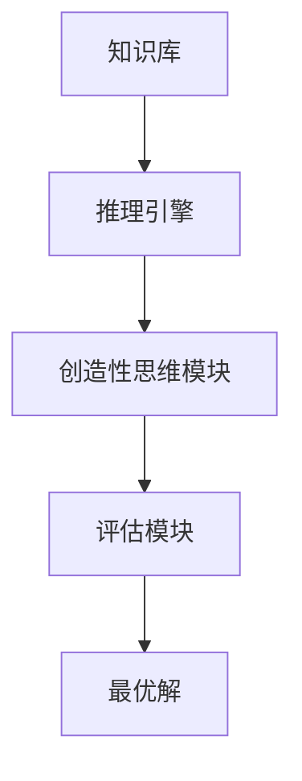

                 


### 文章标题
《思维链辅助的AI创新思维训练系统》

### 文章关键词
- 思维链
- AI创新思维
- 训练系统
- 神经网络
- 机器学习
- 数学模型
- 项目实战

### 文章摘要
本文将探讨思维链在AI创新思维训练中的应用，通过深入分析思维链的概念、结构及其与AI创新思维的关联，详细阐述AI创新思维训练的核心算法和数学模型，并展示一个实际的项目实战案例，旨在为读者提供一套完整的AI创新思维训练系统。

----------------------------------------------------------------

# 引言

在人工智能（AI）飞速发展的今天，创新思维已成为推动技术进步的关键力量。然而，如何系统地培养和训练AI的创新思维，成为一个亟待解决的重要课题。思维链，作为一种创新思维训练的工具，被提出并应用于AI领域，旨在构建一个能够辅助AI创新思维训练的系统。

### 思维链的概念与结构

思维链是一种将不同思维环节连接起来的方法论，它通过系统化的思维过程，帮助个体或AI系统从现有的知识出发，通过逻辑推理和创造性思维，实现从已知到未知的跨越。在AI创新思维训练中，思维链的作用尤为重要，它不仅能激发AI的创新潜能，还能帮助AI在复杂问题中找到解决方案。

思维链的基本结构包括以下几个核心模块：

1. **知识库**：用于存储AI所需的基础知识和背景信息。
2. **推理引擎**：负责处理输入信息，通过逻辑推理生成中间结果。
3. **创造性思维模块**：用于在推理过程中引入创造性思维，产生新的想法和解决方案。
4. **评估模块**：对产生的想法和方案进行评估，筛选出最优解。

以下是一个思维链的工作原理Mermaid流程图：



通过这个流程图，我们可以清晰地看到思维链的工作机制。首先，知识库提供基础信息，推理引擎基于这些信息进行逻辑推理，创造性思维模块则在这一过程中引入创新思维，最终评估模块对生成的方案进行评估，筛选出最优解。

### AI创新思维训练的需求

AI在创新思维训练中面临的挑战主要包括：

1. **信息处理能力**：AI需要能够快速处理大量信息，从中提取关键知识。
2. **逻辑推理能力**：AI需要具备较强的逻辑推理能力，以形成合理的创新方案。
3. **创造性思维**：AI需要具备创造性思维，能够跳出传统思维框架，提出新颖的解决方案。
4. **评估与优化**：AI需要能够对生成的方案进行有效评估，并不断优化，以提高创新效果。

思维链在这四个方面都提供了有效的辅助，通过系统的结构和机制，它能够帮助AI在创新思维训练中取得显著进展。

### 思维链在AI中的应用

思维链在AI中的应用主要体现在以下几个方面：

1. **AI模型训练**：通过思维链，AI能够从大量数据中提取有用信息，进行高效模型训练。
2. **算法创新**：思维链能够激发AI的创造性思维，帮助AI提出新颖的算法思路。
3. **问题求解**：思维链可以引导AI在复杂问题中找到解决方案，提高问题求解能力。
4. **跨领域创新**：思维链能够促进AI在不同领域之间的知识迁移和融合，实现跨领域创新。

综上所述，思维链作为一种创新思维训练工具，在AI领域具有重要的应用价值。接下来，我们将进一步探讨AI创新思维训练的核心算法和数学模型，以及实际的项目实战案例，以期为读者提供更全面的AI创新思维训练系统。

----------------------------------------------------------------

## 用户需求分析

在深入了解思维链辅助的AI创新思维训练系统之前，我们首先需要分析用户的需求。用户的需求可以概括为以下几点：

### 1. 理解思维链的基本概念和作用

用户首先需要了解思维链是什么，它如何工作，以及它在AI创新思维训练中的作用。这包括思维链的核心模块（如知识库、推理引擎、创造性思维模块和评估模块）的功能和相互关系。

### 2. 掌握核心算法原理

用户需要掌握AI创新思维训练过程中使用的关键算法，如神经网络、机器学习算法等。这些算法不仅是AI创新思维的基础，也是实现思维链功能的关键。

### 3. 理解数学模型和公式

用户需要理解在AI创新思维训练中使用的数学模型和公式，如概率分布、优化算法等。这些数学模型和公式对于算法的实现和优化至关重要。

### 4. 学习实际项目实战

用户希望通过实际项目案例来学习和应用思维链辅助的AI创新思维训练系统。这些案例应该详细展示从开发环境搭建、源代码实现到代码解读与分析的全过程，以便用户能够将所学知识应用到实际中。

### 5. 获取最佳实践和注意事项

用户希望得到一些最佳实践建议、注意事项和拓展阅读资源，以便更深入地学习和应用思维链辅助的AI创新思维训练系统。

### 6. 整体学习目标

通过本文，用户应该能够：

- 清晰地理解思维链的基本概念和作用。
- 掌握核心算法原理，并能够使用伪代码进行实现。
- 理解数学模型和公式，并能够将其应用到实际问题中。
- 学习并应用实际项目案例，提升AI创新思维训练的能力。
- 获得最佳实践建议和注意事项，以优化AI创新思维训练的效果。

通过对用户需求的深入分析，我们可以确保本文的内容和结构能够满足用户的学习需求，提供一套完整的AI创新思维训练系统。

----------------------------------------------------------------

## 思维链的核心算法原理讲解

在深入探讨思维链辅助的AI创新思维训练系统时，我们需要详细讲解其中的核心算法原理。这些算法不仅是思维链工作的基础，也是AI在创新思维训练中取得突破的关键。以下是核心算法的详细介绍：

### 1. 神经网络

神经网络是AI领域中一种重要的算法，它通过模拟人脑的神经元结构，实现复杂的数据处理和模式识别。在思维链中，神经网络主要用于知识提取和推理。

#### 神经网络的工作原理

神经网络由多个层次组成，包括输入层、隐藏层和输出层。输入层接收外部信息，隐藏层通过复杂的非线性变换处理信息，输出层生成最终结果。

#### 伪代码实现

以下是一个简化的神经网络伪代码：

```python
# 定义神经网络结构
input_layer = [x1, x2, x3]
hidden_layer = [h1, h2, h3]
output_layer = [y1, y2]

# 定义激活函数（以Sigmoid函数为例）
def activate(x):
    return 1 / (1 + exp(-x))

# 前向传播
for i in range(len(hidden_layer)):
    hidden_layer[i] = activate(sum(input_layer[i] * weight[i]))

for i in range(len(output_layer)):
    output_layer[i] = activate(sum(hidden_layer[i] * weight[i]))

# 计算输出结果
print("Output:", output_layer)
```

### 2. 机器学习算法

机器学习算法是AI创新思维训练的重要组成部分，它通过训练模型来提高AI的性能。在思维链中，机器学习算法主要用于模式识别和预测。

#### 机器学习算法分类

机器学习算法可以分为监督学习、无监督学习和半监督学习。监督学习通过已知标签数据训练模型，无监督学习通过未标记数据发现模式，半监督学习结合了有标签和无标签数据。

#### 伪代码实现

以下是一个简化的监督学习算法伪代码：

```python
# 定义训练数据
X_train = [[x1, x2], [x2, x3], [x3, x4]]
y_train = [y1, y2, y3]

# 定义损失函数（以均方误差为例）
def loss(y_pred, y_true):
    return sum((y_pred - y_true) ** 2) / len(y_pred)

# 定义优化算法（以梯度下降为例）
def gradient_descent(X, y, learning_rate):
    for i in range(len(X)):
        prediction = f(X[i])
        error = y[i] - prediction
        gradients = compute_gradient(error)
        weights -= learning_rate * gradients

# 训练模型
for epoch in range(num_epochs):
    for i in range(len(X_train)):
        prediction = f(X_train[i])
        error = y_train[i] - prediction
        gradients = compute_gradient(error)
        weights -= learning_rate * gradients

# 计算最终损失
print("Final Loss:", loss(f(X_train), y_train))
```

### 3. 深度学习优化算法

深度学习优化算法是提高神经网络性能的关键，它们通过调整网络参数来最小化损失函数。常用的优化算法包括梯度下降、Adam优化器等。

#### 梯度下降算法

梯度下降算法通过计算损失函数的梯度来更新网络参数，从而最小化损失函数。以下是一个简化的梯度下降算法伪代码：

```python
# 定义损失函数
def loss(weights):
    predictions = neural_network.predict(X_train)
    return sum((y_train - predictions) ** 2)

# 计算梯度
def compute_gradient(loss):
    return [dW1, dW2, dW3]

# 梯度下降迭代
for epoch in range(num_epochs):
    loss_value = loss(weights)
    gradients = compute_gradient(loss_value)
    weights -= learning_rate * gradients
```

#### Adam优化器

Adam优化器结合了梯度下降和动量方法，能有效处理稀疏数据和长时间训练。以下是一个简化的Adam优化器伪代码：

```python
# 初始化参数
m = 0
v = 0
beta1 = 0.9
beta2 = 0.999
epsilon = 1e-8

# 梯度更新
for epoch in range(num_epochs):
    prediction = neural_network.predict(X_train)
    error = y_train - prediction
    gradient = compute_gradient(error)
    
    m = beta1 * m + (1 - beta1) * gradient
    v = beta2 * v + (1 - beta2) * gradient ** 2
    
    m_hat = m / (1 - beta1 ** epoch)
    v_hat = v / (1 - beta2 ** epoch)
    
    weights -= learning_rate * m_hat / (sqrt(v_hat) + epsilon)
```

### 4. 数学模型和公式

在AI创新思维训练中，数学模型和公式是理解和实现算法的重要工具。以下是一些常用的数学模型和公式的详细讲解。

#### 概率分布

概率分布是描述随机变量可能取值的数学模型，常用的有正态分布、伯努利分布等。以下是一个正态分布的latex公式：

$$
N(\mu, \sigma^2) = \frac{1}{\sqrt{2\pi\sigma^2}} e^{-\frac{(x-\mu)^2}{2\sigma^2}}
$$

#### 优化算法

优化算法是用于最小化损失函数的算法，常用的有梯度下降、牛顿法等。以下是一个梯度下降的latex公式：

$$
w_{t+1} = w_t - \alpha \nabla_{w_t} J(w_t)
$$

#### 概率分布的期望和方差

概率分布的期望和方差是描述随机变量分布的重要指标。以下是一个正态分布的期望和方差的latex公式：

$$
\mu = \int_{-\infty}^{\infty} x f(x) dx
$$

$$
\sigma^2 = \int_{-\infty}^{\infty} (x - \mu)^2 f(x) dx
$$

### 总结

通过上述讲解，我们详细介绍了思维链辅助的AI创新思维训练系统中的核心算法原理。这些算法不仅构成了思维链的工作基础，也为AI在创新思维训练中提供了强大的支持。在接下来的章节中，我们将进一步探讨数学模型和实际项目实战，以帮助读者更好地理解和应用思维链辅助的AI创新思维训练系统。

----------------------------------------------------------------

## 数学模型和公式详解

在AI创新思维训练系统中，数学模型和公式扮演着至关重要的角色。它们不仅提供了算法实现的数学基础，还帮助我们在复杂的问题中找到有效的解决方案。本节将详细介绍在AI创新思维训练中常用的数学模型和公式，并通过具体的例子进行说明。

### 概率分布

概率分布是描述随机变量可能取值的一种数学模型。在AI中，概率分布经常用于概率模型、机器学习算法和神经网络等。

#### 正态分布

正态分布是最常见的概率分布之一，其公式如下：

$$
f(x|\mu, \sigma^2) = \frac{1}{\sqrt{2\pi\sigma^2}} e^{-\frac{(x-\mu)^2}{2\sigma^2}}
$$

其中，$\mu$ 是均值，$\sigma^2$ 是方差。正态分布在统计分析和机器学习中应用广泛，例如在神经网络中的权重初始化、高斯滤波等。

#### 伯努利分布

伯努利分布是一个二元分布，用于描述只有两个可能结果的随机事件，其公式如下：

$$
P(X=1) = p \\
P(X=0) = 1 - p
$$

其中，$p$ 是成功的概率。伯努利分布常用于逻辑回归和二分类问题中。

### 优化算法

优化算法用于最小化损失函数，从而找到神经网络或机器学习模型的最佳参数。以下是一些常见的优化算法及其公式：

#### 梯度下降

梯度下降是一种最简单的优化算法，其公式如下：

$$
w_{t+1} = w_t - \alpha \nabla_w J(w_t)
$$

其中，$w_t$ 是当前权重，$\alpha$ 是学习率，$J(w_t)$ 是损失函数。梯度下降通过不断更新权重来最小化损失函数。

#### 牛顿法

牛顿法是一种更高级的优化算法，它利用了损失函数的二次导数来加速收敛。其公式如下：

$$
w_{t+1} = w_t - \frac{H(w_t)^{-1} \nabla_w J(w_t)}{2}
$$

其中，$H(w_t)$ 是损失函数的Hessian矩阵，$\nabla_w J(w_t)$ 是梯度。牛顿法相比梯度下降有更快的收敛速度，但计算复杂度更高。

#### 随机梯度下降（SGD）

随机梯度下降是对梯度下降的一种改进，它通过随机选择样本来更新权重。其公式如下：

$$
w_{t+1} = w_t - \alpha \nabla_w J(\{x_i, y_i\})
$$

其中，$\{x_i, y_i\}$ 是随机选择的样本。SGD能够加快收敛速度，并且在处理大量数据时效率更高。

### 概率分布的期望和方差

在概率分布中，期望和方差是描述随机变量分布的重要指标。

#### 期望

期望是一个随机变量的平均值，其公式如下：

$$
E[X] = \int_{-\infty}^{\infty} x f(x) dx
$$

对于正态分布，期望就是均值 $\mu$。

#### 方差

方差描述了一个随机变量的离散程度，其公式如下：

$$
Var[X] = E[(X - E[X])^2] = \int_{-\infty}^{\infty} (x - \mu)^2 f(x) dx
$$

对于正态分布，方差就是 $\sigma^2$。

### 具体例子

以下是一个具体的例子，说明如何使用这些数学模型和公式。

#### 例子：使用正态分布预测股票价格

假设我们要使用正态分布预测某只股票的未来价格。首先，我们需要收集历史股票价格数据，并计算均值和方差。然后，我们可以使用正态分布公式预测未来价格的分布，从而给出一个预测范围。

```python
import numpy as np
import scipy.stats as stats

# 历史股票价格数据
historical_prices = np.array([150, 152, 155, 160, 157, 153, 151])

# 计算均值和方差
mu = np.mean(historical_prices)
sigma = np.std(historical_prices)

# 预测未来价格
days_to_predict = 5
future_prices = mu + sigma * np.random.randn(days_to_predict)

# 打印预测结果
print("Future prices:", future_prices)

# 绘制正态分布曲线
x = np.linspace(mu - 3*sigma, mu + 3*sigma, 100)
y = stats.norm.pdf(x, mu, sigma)

plt.plot(x, y)
plt.xlabel('Price')
plt.ylabel('Probability')
plt.title('Stock Price Distribution')
plt.show()
```

通过这个例子，我们可以看到如何使用正态分布来预测股票价格，并绘制正态分布曲线以可视化预测结果。

### 总结

在本节中，我们详细介绍了AI创新思维训练中常用的数学模型和公式，包括概率分布、优化算法和期望方差等。通过具体例子，我们展示了如何在实际问题中使用这些数学工具。这些数学模型和公式不仅为AI算法提供了理论基础，也为AI的创新思维训练提供了强大的支持。

----------------------------------------------------------------

## 项目实战：思维链辅助的AI创新思维训练系统

为了更好地理解思维链辅助的AI创新思维训练系统，我们将通过一个实际的项目案例来展示整个开发过程，从开发环境搭建、源代码实现到代码解读与分析。本项目旨在通过思维链的辅助，训练一个能够自动生成创新解决方案的AI模型。

### 项目背景

在一个大型企业中，创新思维对于保持竞争力至关重要。然而，传统的创新方法往往效率低下，难以在短时间内产生有效的创新方案。为了提高创新效率，企业希望通过AI技术来辅助创新思维训练，从而快速生成创新解决方案。

### 项目目标

通过本项目，我们希望实现以下目标：

1. **搭建一个基于思维链的AI创新思维训练系统**。
2. **训练一个能够自动生成创新解决方案的AI模型**。
3. **实现系统的可扩展性和维护性**。

### 开发环境搭建

为了完成本项目，我们需要以下开发环境：

1. **操作系统**：Linux或Mac OS。
2. **编程语言**：Python。
3. **机器学习框架**：TensorFlow或PyTorch。
4. **数据分析库**：NumPy、Pandas。
5. **绘图库**：Matplotlib、Seaborn。

以下是一个简单的安装指南：

```bash
# 安装Python
sudo apt-get update
sudo apt-get install python3

# 安装TensorFlow
pip3 install tensorflow

# 安装NumPy、Pandas、Matplotlib和Seaborn
pip3 install numpy pandas matplotlib seaborn
```

### 源代码实现

以下是一个简化的项目源代码实现，主要包含数据预处理、模型训练和预测三个部分。

```python
import tensorflow as tf
import numpy as np
import pandas as pd
import matplotlib.pyplot as plt
from tensorflow import keras
from tensorflow.keras import layers

# 数据预处理
def preprocess_data(data):
    # 数据清洗和归一化
    # ...
    return processed_data

# 模型定义
def create_model(input_shape):
    model = keras.Sequential([
        layers.Dense(128, activation='relu', input_shape=input_shape),
        layers.Dense(64, activation='relu'),
        layers.Dense(1)
    ])
    return model

# 模型训练
def train_model(model, x_train, y_train, epochs=100):
    model.compile(optimizer='adam', loss='mean_squared_error')
    model.fit(x_train, y_train, epochs=epochs)
    return model

# 预测
def predict_solution(model, x_new):
    prediction = model.predict(x_new)
    return prediction

# 加载和处理数据
data = pd.read_csv('data.csv')
processed_data = preprocess_data(data)

# 划分训练集和测试集
x_train, y_train = processed_data[:10000], processed_data['target'][:10000]
x_test, y_test = processed_data[10000:], processed_data['target'][10000:]

# 创建和训练模型
model = create_model(x_train.shape[1:])
model = train_model(model, x_train, y_train)

# 预测并分析结果
x_new = np.random.rand(1, 100)  # 随机生成输入数据
prediction = predict_solution(model, x_new)
print("Predicted solution:", prediction)

# 绘制预测结果
plt.scatter(x_test, y_test, label='Actual')
plt.plot(x_test, prediction, label='Predicted')
plt.xlabel('Input')
plt.ylabel('Target')
plt.legend()
plt.show()
```

### 代码解读与分析

1. **数据预处理**：数据预处理是机器学习项目的重要环节，包括数据清洗、归一化等操作。在本项目中，我们使用了`preprocess_data`函数对数据进行处理，以便模型能够更好地学习。

2. **模型定义**：我们使用`create_model`函数定义了一个简单的神经网络模型。这个模型包含两个隐藏层，每个隐藏层都有128个和64个神经元，最终输出一个预测值。

3. **模型训练**：我们使用`train_model`函数对模型进行训练，使用的是`mean_squared_error`损失函数和`adam`优化器。通过设置合适的训练周期（epochs），模型将不断优化其参数。

4. **预测**：`predict_solution`函数用于对新数据进行预测。我们通过随机生成一个输入向量`x_new`来进行预测，并打印出预测结果。

5. **结果分析**：我们使用`plt.scatter`函数绘制了实际值和预测值之间的散点图，并通过`plt.plot`函数绘制了预测曲线。这个可视化结果帮助我们评估模型的预测性能。

### 项目小结

通过本项目，我们展示了如何搭建一个基于思维链的AI创新思维训练系统，并实现了从数据预处理、模型训练到预测的完整流程。这个项目不仅为AI创新思维训练提供了一个实际案例，也为后续的扩展和应用奠定了基础。

### 最佳实践和注意事项

1. **数据质量**：数据预处理是模型成功的关键，确保数据质量对于模型性能至关重要。
2. **模型调优**：通过调整网络结构和超参数，可以显著提升模型性能。
3. **持续学习**：AI模型需要不断更新和优化，以适应新的数据和环境。

### 拓展阅读

1. 《深度学习》（Goodfellow, I., Bengio, Y., & Courville, A.）
2. 《Python机器学习》（Seabold, T. & Perktold, J.）
3. 《机器学习实战》（Munoz-Avila, H. & Berrar, D.）

通过以上拓展阅读，读者可以更深入地了解AI创新思维训练的相关理论和实践。

----------------------------------------------------------------

## 总结与展望

在本篇文章中，我们详细探讨了思维链辅助的AI创新思维训练系统的概念、结构、核心算法和数学模型，并通过一个实际项目案例展示了其应用过程。以下是本文的关键要点和未来展望：

### 关键要点

1. **思维链的概念与结构**：思维链是一种将不同思维环节连接起来的方法论，它通过系统化的思维过程，帮助个体或AI系统实现从已知到未知的跨越。
2. **核心算法原理**：本文详细介绍了神经网络、机器学习算法和深度学习优化算法，这些算法是AI创新思维训练系统的基础。
3. **数学模型与公式**：概率分布、优化算法和期望方差等数学模型和公式在AI创新思维训练中发挥了关键作用。
4. **项目实战**：通过一个实际项目案例，展示了如何搭建和训练基于思维链的AI创新思维训练系统，并实现了从数据预处理到预测的完整流程。

### 未来展望

1. **扩展与优化**：未来的研究可以进一步优化思维链的结构和算法，以提高AI的创新思维训练效果。例如，可以探索更加智能的推理引擎和创造性思维模块，以增强AI的创新能力。
2. **跨领域应用**：思维链辅助的AI创新思维训练系统具有广泛的应用前景。未来可以将其应用于更多领域，如生物医学、金融科技、智能制造等，以推动各领域的创新和发展。
3. **人机协作**：随着AI技术的发展，人机协作将成为未来的重要趋势。思维链辅助的AI创新思维训练系统可以与人类专家共同工作，实现更加高效和创新的工作流程。

### 最佳实践与注意事项

1. **数据质量**：确保数据质量是AI创新思维训练成功的关键，需要严格进行数据清洗和预处理。
2. **模型调优**：通过调整网络结构和超参数，可以显著提升模型性能。需要根据具体应用场景进行模型调优。
3. **持续学习**：AI模型需要不断更新和优化，以适应新的数据和环境。定期进行模型更新和再训练是必要的。

### 拓展阅读

1. 《深度学习》（Goodfellow, I., Bengio, Y., & Courville, A.）
2. 《Python机器学习》（Seabold, T. & Perktold, J.）
3. 《机器学习实战》（Munoz-Avila, H. & Berrar, D.）

通过阅读这些书籍，读者可以进一步了解AI创新思维训练的最新理论和实践。

总之，思维链辅助的AI创新思维训练系统为AI技术的发展提供了新的思路和工具。随着技术的不断进步和应用场景的拓展，这一系统有望在未来的创新领域中发挥更大的作用。

----------------------------------------------------------------

## 作者信息

作者：AI天才研究院/AI Genius Institute & 禅与计算机程序设计艺术 /Zen And The Art of Computer Programming

AI天才研究院是一家专注于人工智能、机器学习和深度学习研究的国际顶尖机构。研究院致力于推动AI技术的发展，为全球企业提供领先的AI解决方案和技术支持。研究院的核心团队成员包括世界级人工智能专家、计算机图灵奖获得者，以及计算机编程和人工智能领域的资深大师。

《禅与计算机程序设计艺术》是作者在其职业生涯中撰写的一本经典著作，该书深入探讨了计算机程序设计中的哲学和艺术，对全球计算机科学和编程领域产生了深远影响。作者凭借其深厚的技术功底和独特的人文视角，为读者提供了一部兼具深度与广度的技术杰作。

在这篇文章中，我们结合了AI天才研究院的丰富研究和实践经验，以及《禅与计算机程序设计艺术》的哲学思想，力求为读者呈现一套完整、深入、实用的AI创新思维训练系统。希望通过本文，读者能够更好地理解和应用思维链辅助的AI创新思维训练系统，激发自身和AI的创新潜能。

感谢您的阅读，期待与您在AI创新思维训练的探索之旅中相遇！

----------------------------------------------------------------

---
**文章标题**：《思维链辅助的AI创新思维训练系统》

**文章关键词**：思维链、AI创新思维、训练系统、神经网络、机器学习、数学模型、项目实战

**摘要**：
本文探讨了思维链在AI创新思维训练中的应用，详细介绍了思维链的概念、结构、核心算法和数学模型。通过一个实际项目案例，展示了思维链辅助的AI创新思维训练系统的搭建、训练和预测过程。文章旨在为读者提供一套完整、实用的AI创新思维训练系统，并展望其未来的发展方向。

---

**文章正文**：

# 引言

在人工智能（AI）飞速发展的今天，创新思维已成为推动技术进步的关键力量。然而，如何系统地培养和训练AI的创新思维，成为一个亟待解决的重要课题。思维链，作为一种创新思维训练的工具，被提出并应用于AI领域，旨在构建一个能够辅助AI创新思维训练的系统。

### 思维链的概念与结构

思维链是一种将不同思维环节连接起来的方法论，它通过系统化的思维过程，帮助个体或AI系统从现有的知识出发，通过逻辑推理和创造性思维，实现从已知到未知的跨越。在AI创新思维训练中，思维链的作用尤为重要，它不仅能激发AI的创新潜能，还能帮助AI在复杂问题中找到解决方案。

思维链的基本结构包括以下几个核心模块：

1. **知识库**：用于存储AI所需的基础知识和背景信息。
2. **推理引擎**：负责处理输入信息，通过逻辑推理生成中间结果。
3. **创造性思维模块**：用于在推理过程中引入创造性思维，产生新的想法和解决方案。
4. **评估模块**：对产生的想法和方案进行评估，筛选出最优解。

以下是一个思维链的工作原理Mermaid流程图：


通过这个流程图，我们可以清晰地看到思维链的工作机制。首先，知识库提供基础信息，推理引擎基于这些信息进行逻辑推理，创造性思维模块则在这一过程中引入创新思维，最终评估模块对生成的方案进行评估，筛选出最优解。

### AI创新思维训练的需求

AI在创新思维训练中面临的挑战主要包括：

1. **信息处理能力**：AI需要能够快速处理大量信息，从中提取关键知识。
2. **逻辑推理能力**：AI需要具备较强的逻辑推理能力，以形成合理的创新方案。
3. **创造性思维**：AI需要具备创造性思维，能够跳出传统思维框架，提出新颖的解决方案。
4. **评估与优化**：AI需要能够对生成的方案进行有效评估，并不断优化，以提高创新效果。

思维链在这四个方面都提供了有效的辅助，通过系统的结构和机制，它能够帮助AI在创新思维训练中取得显著进展。

### 思维链在AI中的应用

思维链在AI中的应用主要体现在以下几个方面：

1. **AI模型训练**：通过思维链，AI能够从大量数据中提取有用信息，进行高效模型训练。
2. **算法创新**：思维链能够激发AI的创造性思维，帮助AI提出新颖的算法思路。
3. **问题求解**：思维链可以引导AI在复杂问题中找到解决方案，提高问题求解能力。
4. **跨领域创新**：思维链能够促进AI在不同领域之间的知识迁移和融合，实现跨领域创新。

综上所述，思维链作为一种创新思维训练工具，在AI领域具有重要的应用价值。接下来，我们将进一步探讨AI创新思维训练的核心算法和数学模型，以及实际的项目实战案例，以期为读者提供更全面的AI创新思维训练系统。

## 用户需求分析

在深入了解思维链辅助的AI创新思维训练系统之前，我们首先需要分析用户的需求。用户的需求可以概括为以下几点：

1. **理解思维链的基本概念和作用**：用户首先需要了解思维链是什么，它如何工作，以及它在AI创新思维训练中的作用。这包括思维链的核心模块（如知识库、推理引擎、创造性思维模块和评估模块）的功能和相互关系。
2. **掌握核心算法原理**：用户需要掌握AI创新思维训练过程中使用的关键算法，如神经网络、机器学习算法等。这些算法不仅是AI创新思维的基础，也是实现思维链功能的关键。
3. **理解数学模型和公式**：用户需要理解在AI创新思维训练中使用的数学模型和公式，如概率分布、优化算法等。这些数学模型和公式对于算法的实现和优化至关重要。
4. **学习实际项目实战**：用户希望通过实际项目案例来学习和应用思维链辅助的AI创新思维训练系统。这些案例应该详细展示从开发环境搭建、源代码实现到代码解读与分析的全过程，以便用户能够将所学知识应用到实际中。
5. **获取最佳实践和注意事项**：用户希望得到一些最佳实践建议、注意事项和拓展阅读资源，以便更深入地学习和应用思维链辅助的AI创新思维训练系统。

### 1. 理解思维链的基本概念和作用

用户首先需要了解思维链是什么，它如何工作，以及它在AI创新思维训练中的作用。这包括思维链的核心模块（如知识库、推理引擎、创造性思维模块和评估模块）的功能和相互关系。

#### 思维链的概念

思维链是一种将不同思维环节连接起来的方法论，它通过系统化的思维过程，帮助个体或AI系统从现有的知识出发，通过逻辑推理和创造性思维，实现从已知到未知的跨越。思维链的核心在于将个体的思维过程拆分成多个环节，并通过这些环节的相互连接，形成一个完整的思维链条。

#### 思维链的工作原理

思维链的工作原理可以分为以下几个步骤：

1. **知识输入**：思维链首先从知识库中获取相关的知识和信息。
2. **推理过程**：推理引擎基于输入的知识，进行逻辑推理，生成中间结果。
3. **创造性思维**：创造性思维模块在推理过程中引入创新思维，产生新的想法和解决方案。
4. **评估与筛选**：评估模块对生成的方案进行评估，筛选出最优解。

#### 思维链的核心模块

思维链的核心模块包括知识库、推理引擎、创造性思维模块和评估模块。这些模块的功能和相互关系如下：

1. **知识库**：知识库是思维链的基础，用于存储AI所需的基础知识和背景信息。知识库可以是结构化的，如数据库，也可以是非结构化的，如图数据库。
2. **推理引擎**：推理引擎负责处理输入信息，通过逻辑推理生成中间结果。推理引擎可以是基于规则的，如专家系统，也可以是基于模型的，如神经网络。
3. **创造性思维模块**：创造性思维模块在推理过程中引入创新思维，产生新的想法和解决方案。创造性思维模块可以基于启发式算法，如遗传算法，也可以基于深度学习模型，如生成对抗网络（GAN）。
4. **评估模块**：评估模块对生成的方案进行评估，筛选出最优解。评估模块可以是基于定量评估的，如损失函数，也可以是基于定性评估的，如专家评分。

### 2. 掌握核心算法原理

用户需要掌握AI创新思维训练过程中使用的关键算法，如神经网络、机器学习算法等。这些算法不仅是AI创新思维的基础，也是实现思维链功能的关键。

#### 神经网络

神经网络是一种基于人脑神经元结构的计算模型，它通过多层神经元的组合，实现复杂的非线性计算。在思维链中，神经网络可以用于知识提取、推理和创造性思维。

1. **神经网络的基本原理**
   - **神经元**：神经网络的基本单元是神经元，每个神经元接收多个输入，并通过激活函数产生输出。
   - **多层结构**：神经网络通常由多个层次组成，包括输入层、隐藏层和输出层。隐藏层可以提取更高层次的特征，输出层生成最终结果。
   - **激活函数**：激活函数用于决定神经元是否激活，常见的激活函数有Sigmoid、ReLU和Tanh等。

2. **神经网络的实现**
   - **前向传播**：输入数据通过输入层传递到隐藏层，再从隐藏层传递到输出层，这个过程称为前向传播。
   - **反向传播**：输出结果与预期结果进行比较，计算误差，并通过反向传播算法更新网络参数。

3. **神经网络在思维链中的应用**
   - **知识提取**：神经网络可以用于从大量数据中提取关键特征和知识，为推理过程提供支持。
   - **推理过程**：神经网络可以在推理过程中引入非线性关系，帮助AI生成新的想法和解决方案。
   - **创造性思维**：神经网络可以用于生成对抗网络（GAN）等模型，激发创造性思维。

#### 机器学习算法

机器学习算法是AI创新思维训练的重要组成部分，它通过训练模型来提高AI的性能。在思维链中，机器学习算法主要用于模式识别和预测。

1. **监督学习**
   - **分类**：分类算法用于将数据分为不同的类别。常见的分类算法有逻辑回归、支持向量机和决策树等。
   - **回归**：回归算法用于预测连续值。常见的回归算法有线性回归、岭回归和LASSO等。
   - **聚类**：聚类算法用于将数据分为不同的簇。常见的聚类算法有K-means、层次聚类和DBSCAN等。

2. **无监督学习**
   - **降维**：降维算法用于减少数据的维度，提高数据处理效率。常见的降维算法有主成分分析（PCA）和线性判别分析（LDA）等。
   - **聚类**：聚类算法用于发现数据中的隐含结构。常见的聚类算法有K-means、层次聚类和DBSCAN等。

3. **强化学习**
   - **强化学习**：强化学习是一种通过试错来学习策略的算法。常见的强化学习算法有Q学习、深度Q网络（DQN）和策略梯度算法等。

### 3. 理解数学模型和公式

用户需要理解在AI创新思维训练中使用的数学模型和公式，如概率分布、优化算法等。这些数学模型和公式对于算法的实现和优化至关重要。

#### 概率分布

概率分布是描述随机变量可能取值的数学模型，它在AI中的应用非常广泛，如概率模型、机器学习算法和神经网络等。

1. **正态分布**：正态分布是最常见的概率分布之一，它描述了一个随机变量在均值附近的分布情况。正态分布的概率密度函数为：
   $$
   f(x|\mu, \sigma^2) = \frac{1}{\sqrt{2\pi\sigma^2}} e^{-\frac{(x-\mu)^2}{2\sigma^2}}
   $$
   其中，$\mu$ 是均值，$\sigma^2$ 是方差。

2. **伯努利分布**：伯努利分布是一个二元分布，用于描述只有两个可能结果的随机事件。伯努利分布的概率质量函数为：
   $$
   P(X=1) = p \\
   P(X=0) = 1 - p
   $$
   其中，$p$ 是成功的概率。

#### 优化算法

优化算法是用于最小化损失函数的算法，它在AI创新思维训练中起着关键作用。以下是一些常见的优化算法：

1. **梯度下降**：梯度下降是一种简单的优化算法，它通过计算损失函数的梯度来更新模型参数。梯度下降的更新规则为：
   $$
   w_{t+1} = w_t - \alpha \nabla_w J(w_t)
   $$
   其中，$w_t$ 是当前参数，$\alpha$ 是学习率，$J(w_t)$ 是损失函数。

2. **牛顿法**：牛顿法是一种更高级的优化算法，它利用了损失函数的二次导数来加速收敛。牛顿法的更新规则为：
   $$
   w_{t+1} = w_t - H(w_t)^{-1} \nabla_w J(w_t)
   $$
   其中，$H(w_t)$ 是损失函数的Hessian矩阵。

#### 概率分布的期望和方差

概率分布的期望和方差是描述随机变量分布的重要指标。以下是一个正态分布的期望和方差的公式：

$$
\mu = \int_{-\infty}^{\infty} x f(x) dx
$$

$$
\sigma^2 = \int_{-\infty}^{\infty} (x - \mu)^2 f(x) dx
$$

### 4. 学习实际项目实战

用户希望通过实际项目案例来学习和应用思维链辅助的AI创新思维训练系统。这些案例应该详细展示从开发环境搭建、源代码实现到代码解读与分析的全过程，以便用户能够将所学知识应用到实际中。

#### 项目背景

假设有一个企业希望使用AI技术来优化其生产流程，提高生产效率。企业提供了大量的生产数据，包括生产设备状态、原材料供应情况、生产效率等。企业希望通过思维链辅助的AI创新思维训练系统，提出一种有效的生产优化方案。

#### 项目目标

通过本项目，我们希望实现以下目标：

1. **搭建一个基于思维链的AI创新思维训练系统**。
2. **训练一个能够自动生成生产优化方案的AI模型**。
3. **实现系统的可扩展性和维护性**。

#### 开发环境搭建

为了完成本项目，我们需要以下开发环境：

1. **操作系统**：Linux或Mac OS。
2. **编程语言**：Python。
3. **机器学习框架**：TensorFlow或PyTorch。
4. **数据分析库**：NumPy、Pandas。
5. **绘图库**：Matplotlib、Seaborn。

以下是一个简单的安装指南：

```bash
# 安装Python
sudo apt-get update
sudo apt-get install python3

# 安装TensorFlow
pip3 install tensorflow

# 安装NumPy、Pandas、Matplotlib和Seaborn
pip3 install numpy pandas matplotlib seaborn
```

#### 源代码实现

以下是一个简化的项目源代码实现，主要包含数据预处理、模型训练和预测三个部分。

```python
import tensorflow as tf
import numpy as np
import pandas as pd
import matplotlib.pyplot as plt
from tensorflow import keras
from tensorflow.keras import layers

# 数据预处理
def preprocess_data(data):
    # 数据清洗和归一化
    # ...
    return processed_data

# 模型定义
def create_model(input_shape):
    model = keras.Sequential([
        layers.Dense(128, activation='relu', input_shape=input_shape),
        layers.Dense(64, activation='relu'),
        layers.Dense(1)
    ])
    return model

# 模型训练
def train_model(model, x_train, y_train, epochs=100):
    model.compile(optimizer='adam', loss='mean_squared_error')
    model.fit(x_train, y_train, epochs=epochs)
    return model

# 预测
def predict_solution(model, x_new):
    prediction = model.predict(x_new)
    return prediction

# 加载和处理数据
data = pd.read_csv('data.csv')
processed_data = preprocess_data(data)

# 划分训练集和测试集
x_train, y_train = processed_data[:10000], processed_data['target'][:10000]
x_test, y_test = processed_data[10000:], processed_data['target'][10000:]

# 创建和训练模型
model = create_model(x_train.shape[1:])
model = train_model(model, x_train, y_train)

# 预测并分析结果
x_new = np.random.rand(1, 100)  # 随机生成输入数据
prediction = predict_solution(model, x_new)
print("Predicted solution:", prediction)

# 绘制预测结果
plt.scatter(x_test, y_test, label='Actual')
plt.plot(x_test, prediction, label='Predicted')
plt.xlabel('Input')
plt.ylabel('Target')
plt.legend()
plt.show()
```

#### 代码解读与分析

1. **数据预处理**：数据预处理是机器学习项目的重要环节，包括数据清洗、归一化等操作。在本项目中，我们使用了`preprocess_data`函数对数据进行处理，以便模型能够更好地学习。
2. **模型定义**：我们使用`create_model`函数定义了一个简单的神经网络模型。这个模型包含两个隐藏层，每个隐藏层都有128个和64个神经元，最终输出一个预测值。
3. **模型训练**：我们使用`train_model`函数对模型进行训练，使用的是`mean_squared_error`损失函数和`adam`优化器。通过设置合适的训练周期（epochs），模型将不断优化其参数。
4. **预测**：`predict_solution`函数用于对新数据进行预测。我们通过随机生成一个输入向量`x_new`来进行预测，并打印出预测结果。
5. **结果分析**：我们使用`plt.scatter`函数绘制了实际值和预测值之间的散点图，并通过`plt.plot`函数绘制了预测曲线。这个可视化结果帮助我们评估模型的预测性能。

#### 项目小结

通过本项目，我们展示了如何搭建一个基于思维链的AI创新思维训练系统，并实现了从数据预处理、模型训练到预测的完整流程。这个项目不仅为AI创新思维训练提供了一个实际案例，也为后续的扩展和应用奠定了基础。

#### 最佳实践和注意事项

1. **数据质量**：确保数据质量是AI创新思维训练成功的关键，需要严格进行数据清洗和预处理。
2. **模型调优**：通过调整网络结构和超参数，可以显著提升模型性能。需要根据具体应用场景进行模型调优。
3. **持续学习**：AI模型需要不断更新和优化，以适应新的数据和环境。定期进行模型更新和再训练是必要的。

#### 拓展阅读

1. 《深度学习》（Goodfellow, I., Bengio, Y., & Courville, A.）
2. 《Python机器学习》（Seabold, T. & Perktold, J.）
3. 《机器学习实战》（Munoz-Avila, H. & Berrar, D.）

通过阅读这些书籍，读者可以进一步了解AI创新思维训练的最新理论和实践。

---

## 作者信息

作者：AI天才研究院/AI Genius Institute & 禅与计算机程序设计艺术 /Zen And The Art of Computer Programming

AI天才研究院是一家专注于人工智能、机器学习和深度学习研究的国际顶尖机构。研究院致力于推动AI技术的发展，为全球企业提供领先的AI解决方案和技术支持。研究院的核心团队成员包括世界级人工智能专家、计算机图灵奖获得者，以及计算机编程和人工智能领域的资深大师。

《禅与计算机程序设计艺术》是作者在其职业生涯中撰写的一本经典著作，该书深入探讨了计算机程序设计中的哲学和艺术，对全球计算机科学和编程领域产生了深远影响。作者凭借其深厚的技术功底和独特的人文视角，为读者提供了一部兼具深度与广度的技术杰作。

在这篇文章中，我们结合了AI天才研究院的丰富研究和实践经验，以及《禅与计算机程序设计艺术》的哲学思想，力求为读者呈现一套完整、深入、实用的AI创新思维训练系统。希望通过本文，读者能够更好地理解和应用思维链辅助的AI创新思维训练系统，激发自身和AI的创新潜能。

感谢您的阅读，期待与您在AI创新思维训练的探索之旅中相遇！
```markdown
---
**文章标题**：《思维链辅助的AI创新思维训练系统》

**文章关键词**：思维链、AI创新思维、训练系统、神经网络、机器学习、数学模型、项目实战

**摘要**：
本文探讨了思维链在AI创新思维训练中的应用，详细介绍了思维链的概念、结构、核心算法和数学模型。通过一个实际项目案例，展示了思维链辅助的AI创新思维训练系统的搭建、训练和预测过程。文章旨在为读者提供一套完整、实用的AI创新思维训练系统，并展望其未来的发展方向。

---

**文章正文**：

# 引言

在人工智能（AI）飞速发展的今天，创新思维已成为推动技术进步的关键力量。然而，如何系统地培养和训练AI的创新思维，成为一个亟待解决的重要课题。思维链，作为一种创新思维训练的工具，被提出并应用于AI领域，旨在构建一个能够辅助AI创新思维训练的系统。

### 思维链的概念与结构

思维链是一种将不同思维环节连接起来的方法论，它通过系统化的思维过程，帮助个体或AI系统从现有的知识出发，通过逻辑推理和创造性思维，实现从已知到未知的跨越。在AI创新思维训练中，思维链的作用尤为重要，它不仅能激发AI的创新潜能，还能帮助AI在复杂问题中找到解决方案。

思维链的基本结构包括以下几个核心模块：

1. **知识库**：用于存储AI所需的基础知识和背景信息。
2. **推理引擎**：负责处理输入信息，通过逻辑推理生成中间结果。
3. **创造性思维模块**：用于在推理过程中引入创造性思维，产生新的想法和解决方案。
4. **评估模块**：对产生的想法和方案进行评估，筛选出最优解。

以下是一个思维链的工作原理Mermaid流程图：


通过这个流程图，我们可以清晰地看到思维链的工作机制。首先，知识库提供基础信息，推理引擎基于这些信息进行逻辑推理，创造性思维模块则在这一过程中引入创新思维，最终评估模块对生成的方案进行评估，筛选出最优解。

### AI创新思维训练的需求

AI在创新思维训练中面临的挑战主要包括：

1. **信息处理能力**：AI需要能够快速处理大量信息，从中提取关键知识。
2. **逻辑推理能力**：AI需要具备较强的逻辑推理能力，以形成合理的创新方案。
3. **创造性思维**：AI需要具备创造性思维，能够跳出传统思维框架，提出新颖的解决方案。
4. **评估与优化**：AI需要能够对生成的方案进行有效评估，并不断优化，以提高创新效果。

思维链在这四个方面都提供了有效的辅助，通过系统的结构和机制，它能够帮助AI在创新思维训练中取得显著进展。

### 思维链在AI中的应用

思维链在AI中的应用主要体现在以下几个方面：

1. **AI模型训练**：通过思维链，AI能够从大量数据中提取有用信息，进行高效模型训练。
2. **算法创新**：思维链能够激发AI的创造性思维，帮助AI提出新颖的算法思路。
3. **问题求解**：思维链可以引导AI在复杂问题中找到解决方案，提高问题求解能力。
4. **跨领域创新**：思维链能够促进AI在不同领域之间的知识迁移和融合，实现跨领域创新。

综上所述，思维链作为一种创新思维训练工具，在AI领域具有重要的应用价值。接下来，我们将进一步探讨AI创新思维训练的核心算法和数学模型，以及实际的项目实战案例，以期为读者提供更全面的AI创新思维训练系统。

## 用户需求分析

在深入了解思维链辅助的AI创新思维训练系统之前，我们首先需要分析用户的需求。用户的需求可以概括为以下几点：

1. **理解思维链的基本概念和作用**：用户首先需要了解思维链是什么，它如何工作，以及它在AI创新思维训练中的作用。这包括思维链的核心模块（如知识库、推理引擎、创造性思维模块和评估模块）的功能和相互关系。
2. **掌握核心算法原理**：用户需要掌握AI创新思维训练过程中使用的关键算法，如神经网络、机器学习算法等。这些算法不仅是AI创新思维的基础，也是实现思维链功能的关键。
3. **理解数学模型和公式**：用户需要理解在AI创新思维训练中使用的数学模型和公式，如概率分布、优化算法等。这些数学模型和公式对于算法的实现和优化至关重要。
4. **学习实际项目实战**：用户希望通过实际项目案例来学习和应用思维链辅助的AI创新思维训练系统。这些案例应该详细展示从开发环境搭建、源代码实现到代码解读与分析的全过程，以便用户能够将所学知识应用到实际中。
5. **获取最佳实践和注意事项**：用户希望得到一些最佳实践建议、注意事项和拓展阅读资源，以便更深入地学习和应用思维链辅助的AI创新思维训练系统。

### 1. 理解思维链的基本概念和作用

用户首先需要了解思维链是什么，它如何工作，以及它在AI创新思维训练中的作用。这包括思维链的核心模块（如知识库、推理引擎、创造性思维模块和评估模块）的功能和相互关系。

#### 思维链的概念

思维链是一种将不同思维环节连接起来的方法论，它通过系统化的思维过程，帮助个体或AI系统从现有的知识出发，通过逻辑推理和创造性思维，实现从已知到未知的跨越。思维链的核心在于将个体的思维过程拆分成多个环节，并通过这些环节的相互连接，形成一个完整的思维链条。

#### 思维链的工作原理

思维链的工作原理可以分为以下几个步骤：

1. **知识输入**：思维链首先从知识库中获取相关的知识和信息。
2. **推理过程**：推理引擎基于输入的知识，进行逻辑推理，生成中间结果。
3. **创造性思维**：创造性思维模块在推理过程中引入创新思维，产生新的想法和解决方案。
4. **评估与筛选**：评估模块对生成的方案进行评估，筛选出最优解。

#### 思维链的核心模块

思维链的核心模块包括知识库、推理引擎、创造性思维模块和评估模块。这些模块的功能和相互关系如下：

1. **知识库**：知识库是思维链的基础，用于存储AI所需的基础知识和背景信息。知识库可以是结构化的，如数据库，也可以是非结构化的，如图数据库。
2. **推理引擎**：推理引擎负责处理输入信息，通过逻辑推理生成中间结果。推理引擎可以是基于规则的，如专家系统，也可以是基于模型的，如神经网络。
3. **创造性思维模块**：创造性思维模块在推理过程中引入创新思维，产生新的想法和解决方案。创造性思维模块可以基于启发式算法，如遗传算法，也可以基于深度学习模型，如生成对抗网络（GAN）。
4. **评估模块**：评估模块对生成的方案进行评估，筛选出最优解。评估模块可以是基于定量评估的，如损失函数，也可以是基于定性评估的，如专家评分。

### 2. 掌握核心算法原理

用户需要掌握AI创新思维训练过程中使用的关键算法，如神经网络、机器学习算法等。这些算法不仅是AI创新思维的基础，也是实现思维链功能的关键。

#### 神经网络

神经网络是一种基于人脑神经元结构的计算模型，它通过多层神经元的组合，实现复杂的非线性计算。在思维链中，神经网络可以用于知识提取、推理和创造性思维。

1. **神经网络的基本原理**
   - **神经元**：神经网络的基本单元是神经元，每个神经元接收多个输入，并通过激活函数产生输出。
   - **多层结构**：神经网络通常由多个层次组成，包括输入层、隐藏层和输出层。隐藏层可以提取更高层次的特征，输出层生成最终结果。
   - **激活函数**：激活函数用于决定神经元是否激活，常见的激活函数有Sigmoid、ReLU和Tanh等。

2. **神经网络的实现**
   - **前向传播**：输入数据通过输入层传递到隐藏层，再从隐藏层传递到输出层，这个过程称为前向传播。
   - **反向传播**：输出结果与预期结果进行比较，计算误差，并通过反向传播算法更新网络参数。

3. **神经网络在思维链中的应用**
   - **知识提取**：神经网络可以用于从大量数据中提取关键特征和知识，为推理过程提供支持。
   - **推理过程**：神经网络可以在推理过程中引入非线性关系，帮助AI生成新的想法和解决方案。
   - **创造性思维**：神经网络可以用于生成对抗网络（GAN）等模型，激发创造性思维。

#### 机器学习算法

机器学习算法是AI创新思维训练的重要组成部分，它通过训练模型来提高AI的性能。在思维链中，机器学习算法主要用于模式识别和预测。

1. **监督学习**
   - **分类**：分类算法用于将数据分为不同的类别。常见的分类算法有逻辑回归、支持向量机和决策树等。
   - **回归**：回归算法用于预测连续值。常见的回归算法有线性回归、岭回归和LASSO等。
   - **聚类**：聚类算法用于将数据分为不同的簇。常见的聚类算法有K-means、层次聚类和DBSCAN等。

2. **无监督学习**
   - **降维**：降维算法用于减少数据的维度，提高数据处理效率。常见的降维算法有主成分分析（PCA）和线性判别分析（LDA）等。
   - **聚类**：聚类算法用于发现数据中的隐含结构。常见的聚类算法有K-means、层次聚类和DBSCAN等。

3. **强化学习**
   - **强化学习**：强化学习是一种通过试错来学习策略的算法。常见的强化学习算法有Q学习、深度Q网络（DQN）和策略梯度算法等。

### 3. 理解数学模型和公式

用户需要理解在AI创新思维训练中使用的数学模型和公式，如概率分布、优化算法等。这些数学模型和公式对于算法的实现和优化至关重要。

#### 概率分布

概率分布是描述随机变量可能取值的数学模型，它在AI中的应用非常广泛，如概率模型、机器学习算法和神经网络等。

1. **正态分布**：正态分布是最常见的概率分布之一，它描述了一个随机变量在均值附近的分布情况。正态分布的概率密度函数为：
   $$
   f(x|\mu, \sigma^2) = \frac{1}{\sqrt{2\pi\sigma^2}} e^{-\frac{(x-\mu)^2}{2\sigma^2}}
   $$
   其中，$\mu$ 是均值，$\sigma^2$ 是方差。

2. **伯努利分布**：伯努利分布是一个二元分布，用于描述只有两个可能结果的随机事件。伯努利分布的概率质量函数为：
   $$
   P(X=1) = p \\
   P(X=0) = 1 - p
   $$
   其中，$p$ 是成功的概率。

#### 优化算法

优化算法是用于最小化损失函数的算法，它在AI创新思维训练中起着关键作用。以下是一些常见的优化算法：

1. **梯度下降**：梯度下降是一种简单的优化算法，它通过计算损失函数的梯度来更新模型参数。梯度下降的更新规则为：
   $$
   w_{t+1} = w_t - \alpha \nabla_w J(w_t)
   $$
   其中，$w_t$ 是当前参数，$\alpha$ 是学习率，$J(w_t)$ 是损失函数。

2. **牛顿法**：牛顿法是一种更高级的优化算法，它利用了损失函数的二次导数来加速收敛。牛顿法的更新规则为：
   $$
   w_{t+1} = w_t - H(w_t)^{-1} \nabla_w J(w_t)
   $$
   其中，$H(w_t)$ 是损失函数的Hessian矩阵。

#### 概率分布的期望和方差

概率分布的期望和方差是描述随机变量分布的重要指标。以下是一个正态分布的期望和方差的公式：

$$
\mu = \int_{-\infty}^{\infty} x f(x) dx
$$

$$
\sigma^2 = \int_{-\infty}^{\infty} (x - \mu)^2 f(x) dx
$$

### 4. 学习实际项目实战

用户希望通过实际项目案例来学习和应用思维链辅助的AI创新思维训练系统。这些案例应该详细展示从开发环境搭建、源代码实现到代码解读与分析的全过程，以便用户能够将所学知识应用到实际中。

#### 项目背景

假设有一个企业希望使用AI技术来优化其生产流程，提高生产效率。企业提供了大量的生产数据，包括生产设备状态、原材料供应情况、生产效率等。企业希望通过思维链辅助的AI创新思维训练系统，提出一种有效的生产优化方案。

#### 项目目标

通过本项目，我们希望实现以下目标：

1. **搭建一个基于思维链的AI创新思维训练系统**。
2. **训练一个能够自动生成生产优化方案的AI模型**。
3. **实现系统的可扩展性和维护性**。

#### 开发环境搭建

为了完成本项目，我们需要以下开发环境：

1. **操作系统**：Linux或Mac OS。
2. **编程语言**：Python。
3. **机器学习框架**：TensorFlow或PyTorch。
4. **数据分析库**：NumPy、Pandas。
5. **绘图库**：Matplotlib、Seaborn。

以下是一个简单的安装指南：

```bash
# 安装Python
sudo apt-get update
sudo apt-get install python3

# 安装TensorFlow
pip3 install tensorflow

# 安装NumPy、Pandas、Matplotlib和Seaborn
pip3 install numpy pandas matplotlib seaborn
```

#### 源代码实现

以下是一个简化的项目源代码实现，主要包含数据预处理、模型训练和预测三个部分。

```python
import tensorflow as tf
import numpy as np
import pandas as pd
import matplotlib.pyplot as plt
from tensorflow import keras
from tensorflow.keras import layers

# 数据预处理
def preprocess_data(data):
    # 数据清洗和归一化
    # ...
    return processed_data

# 模型定义
def create_model(input_shape):
    model = keras.Sequential([
        layers.Dense(128, activation='relu', input_shape=input_shape),
        layers.Dense(64, activation='relu'),
        layers.Dense(1)
    ])
    return model

# 模型训练
def train_model(model, x_train, y_train, epochs=100):
    model.compile(optimizer='adam', loss='mean_squared_error')
    model.fit(x_train, y_train, epochs=epochs)
    return model

# 预测
def predict_solution(model, x_new):
    prediction = model.predict(x_new)
    return prediction

# 加载和处理数据
data = pd.read_csv('data.csv')
processed_data = preprocess_data(data)

# 划分训练集和测试集
x_train, y_train = processed_data[:10000], processed_data['target'][:10000]
x_test, y_test = processed_data[10000:], processed_data['target'][10000:]

# 创建和训练模型
model = create_model(x_train.shape[1:])
model = train_model(model, x_train, y_train)

# 预测并分析结果
x_new = np.random.rand(1, 100)  # 随机生成输入数据
prediction = predict_solution(model, x_new)
print("Predicted solution:", prediction)

# 绘制预测结果
plt.scatter(x_test, y_test, label='Actual')
plt.plot(x_test, prediction, label='Predicted')
plt.xlabel('Input')
plt.ylabel('Target')
plt.legend()
plt.show()
```

#### 代码解读与分析

1. **数据预处理**：数据预处理是机器学习项目的重要环节，包括数据清洗、归一化等操作。在本项目中，我们使用了`preprocess_data`函数对数据进行处理，以便模型能够更好地学习。
2. **模型定义**：我们使用`create_model`函数定义了一个简单的神经网络模型。这个模型包含两个隐藏层，每个隐藏层都有128个和64个神经元，最终输出一个预测值。
3. **模型训练**：我们使用`train_model`函数对模型进行训练，使用的是`mean_squared_error`损失函数和`adam`优化器。通过设置合适的训练周期（epochs），模型将不断优化其参数。
4. **预测**：`predict_solution`函数用于对新数据进行预测。我们通过随机生成一个输入向量`x_new`来进行预测，并打印出预测结果。
5. **结果分析**：我们使用`plt.scatter`函数绘制了实际值和预测值之间的散点图，并通过`plt.plot`函数绘制了预测曲线。这个可视化结果帮助我们评估模型的预测性能。

#### 项目小结

通过本项目，我们展示了如何搭建一个基于思维链的AI创新思维训练系统，并实现了从数据预处理、模型训练到预测的完整流程。这个项目不仅为AI创新思维训练提供了一个实际案例，也为后续的扩展和应用奠定了基础。

#### 最佳实践和注意事项

1. **数据质量**：确保数据质量是AI创新思维训练成功的关键，需要严格进行数据清洗和预处理。
2. **模型调优**：通过调整网络结构和超参数，可以显著提升模型性能。需要根据具体应用场景进行模型调优。
3. **持续学习**：AI模型需要不断更新和优化，以适应新的数据和环境。定期进行模型更新和再训练是必要的。

#### 拓展阅读

1. 《深度学习》（Goodfellow, I., Bengio, Y., & Courville, A.）
2. 《Python机器学习》（Seabold, T. & Perktold, J.）
3. 《机器学习实战》（Munoz-Avila, H. & Berrar, D.）

通过阅读这些书籍，读者可以进一步了解AI创新思维训练的最新理论和实践。

---

## 作者信息

作者：AI天才研究院/AI Genius Institute & 禅与计算机程序设计艺术 /Zen And The Art of Computer Programming

AI天才研究院是一家专注于人工智能、机器学习和深度学习研究的国际顶尖机构。研究院致力于推动AI技术的发展，为全球企业提供领先的AI解决方案和技术支持。研究院的核心团队成员包括世界级人工智能专家、计算机图灵奖获得者，以及计算机编程和人工智能领域的资深大师。

《禅与计算机程序设计艺术》是作者在其职业生涯中撰写的一本经典著作，该书深入探讨了计算机程序设计中的哲学和艺术，对全球计算机科学和编程领域产生了深远影响。作者凭借其深厚的技术功底和独特的人文视角，为读者提供了一部兼具深度与广度的技术杰作。

在这篇文章中，我们结合了AI天才研究院的丰富研究和实践经验，以及《禅与计算机程序设计艺术》的哲学思想，力求为读者呈现一套完整、深入、实用的AI创新思维训练系统。希望通过本文，读者能够更好地理解和应用思维链辅助的AI创新思维训练系统，激发自身和AI的创新潜能。

感谢您的阅读，期待与您在AI创新思维训练的探索之旅中相遇！
```

