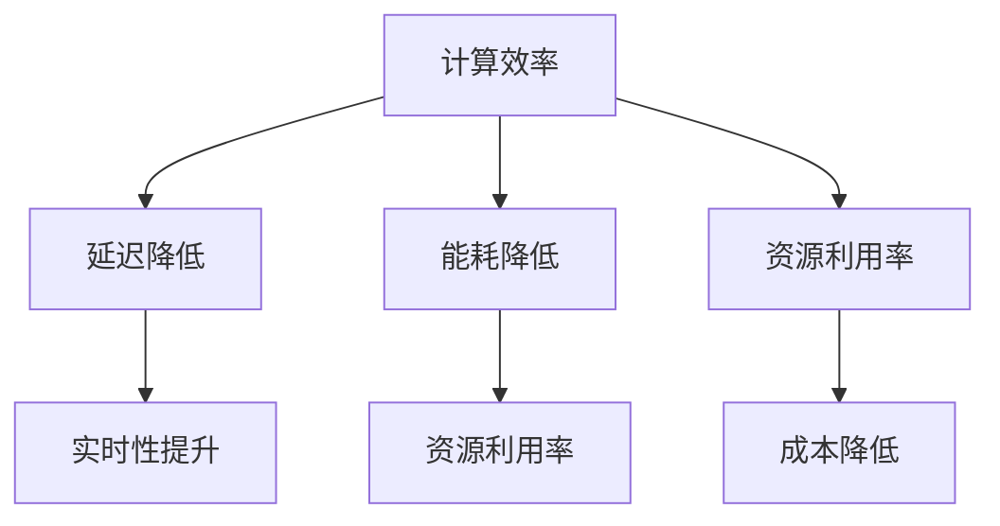
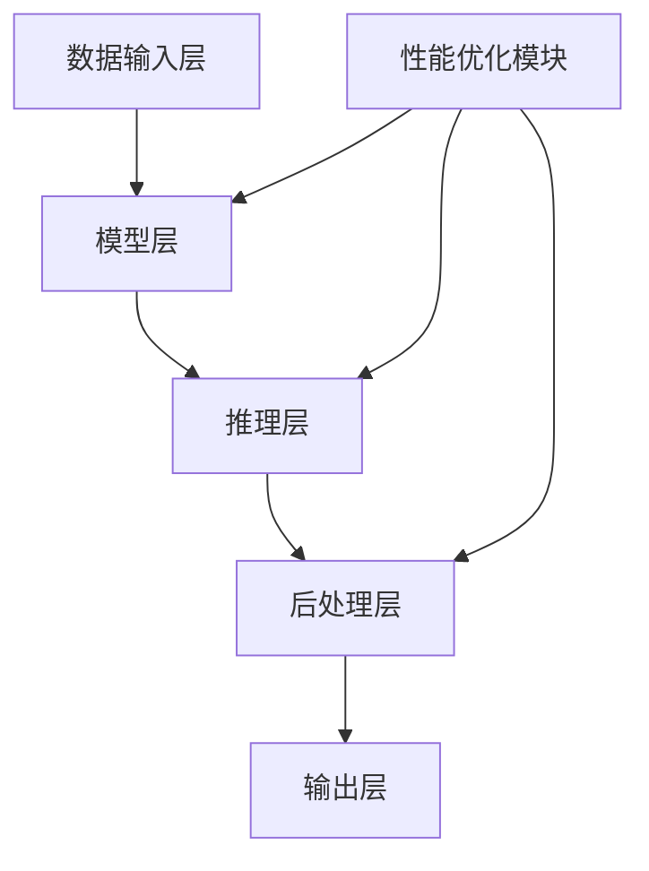

                 

### 文章标题：性能优化策略在LLM应用架构中的实施

随着深度学习，特别是预训练大型语言模型（LLM）的迅速发展，性能优化策略在提升模型效率方面变得愈发重要。LLM因其庞大的参数规模和计算需求，常常面临资源受限和效率瓶颈的挑战。本文旨在探讨在LLM应用架构中实施性能优化策略的方法和技巧，通过逐步分析推理，详细解读性能优化策略的原理和实践，为读者提供全面的技术指导和实际案例。

## 文章关键词

- 性能优化
- 大型语言模型（LLM）
- 应用架构
- 算法原理
- 数学模型
- 项目实战
- 分布式训练
- 模型压缩

## 文章摘要

本文首先介绍了LLM的性能优化目标和基本概念，然后详细解析了与性能优化相关的核心算法原理，包括梯度下降优化算法、优化器、模型压缩和量化技术。接着，通过数学模型和公式的讲解，帮助读者深入理解性能优化的理论基础。文章还提供了一个实际项目案例，展示了性能优化策略在LLM应用架构中的具体实施。最后，本文讨论了性能优化策略的整体架构设计，并提出了未来的展望和挑战。

### 引言

近年来，预训练大型语言模型（LLM）在自然语言处理（NLP）领域取得了显著的突破。从GPT到BERT，再到GPT-3，这些模型的参数规模和计算需求急剧增长，推动了高性能计算和优化技术的发展。然而，LLM的庞大体积和计算复杂度也带来了性能瓶颈和资源受限的问题。为了在实际应用中有效部署和使用这些模型，性能优化策略成为不可或缺的一环。

性能优化不仅涉及到提高模型的计算效率，还包括减少延迟、降低能耗和优化资源利用率。在LLM应用架构中，性能优化策略的实施可以帮助我们克服资源限制，提升模型在实际应用中的表现。本文将围绕以下几个核心问题展开讨论：

1. **性能优化的目标和基本概念是什么？**
2. **与性能优化相关的核心算法原理有哪些？**
3. **如何通过数学模型和公式来理解性能优化？**
4. **在LLM应用架构中，如何具体实施性能优化策略？**
5. **有哪些实际项目案例可以展示性能优化策略的效果？**

通过逐步分析推理，本文旨在为读者提供系统的性能优化策略指导，帮助他们在实际项目中有效提升LLM的应用性能。

### 第一部分：LLM应用架构基础

#### 第1章：性能优化核心概念

**1.1.1 性能优化的定义与目标**

性能优化是指通过一系列技术手段，提升系统、算法或应用在特定资源约束下的性能表现。在LLM应用架构中，性能优化的目标主要包括以下几个方面：

- **计算效率**：减少模型推理和训练所需的计算资源，提高处理速度。
- **延迟降低**：降低模型响应时间，提高系统的实时性。
- **能耗降低**：减少模型运行过程中的能耗，提升资源利用率。
- **资源利用率**：优化资源分配，最大化利用计算资源。

**1.1.2 LLM应用架构概述**

LLM应用架构通常包括以下几个关键组成部分：

- **数据输入层**：负责接收和处理输入数据，将数据格式化为模型可接受的输入。
- **模型层**：包含预训练的大型语言模型，如GPT、BERT等。
- **推理层**：模型接受输入数据后，进行推理产生输出结果。
- **后处理层**：对推理结果进行必要的后处理，如文本生成、翻译等。
- **输出层**：将处理结果呈现给用户或应用其他系统。

**1.1.3 性能优化的核心概念联系图（使用Mermaid）**

以下是一个简单的Mermaid流程图，展示了性能优化的核心概念及其相互联系：



#### 第2章：性能优化算法原理

**2.1.1 梯度下降优化算法**

梯度下降是一种常用的优化算法，用于最小化目标函数。在LLM训练过程中，梯度下降用于更新模型的权重，以减少预测误差。

- **基本原理**：梯度下降通过计算目标函数相对于模型参数的梯度，并沿梯度的反方向更新参数，以逐步减小目标函数的值。

- **伪代码**：

  ```python
  for each iteration do
      compute the gradient of the loss function with respect to model parameters
      update model parameters by moving in the opposite direction of the gradient
  end for
  ```

- **数学模型与公式**：

  $$ \theta_{\text{new}} = \theta_{\text{current}} - \alpha \cdot \nabla_\theta J(\theta) $$

  其中，$\theta$ 表示模型参数，$J(\theta)$ 表示目标函数，$\alpha$ 为学习率，$\nabla_\theta J(\theta)$ 表示梯度。

**2.1.2 优化器（如Adam、RMSprop等）**

优化器是梯度下降算法的具体实现，用于调整参数更新过程。常见的优化器包括Adam、RMSprop等，它们通过自适应调整学习率，提高优化效率。

- **Adam优化器**：结合了Adagrad和RMSprop的优点，自适应调整学习率。

  - **伪代码**：

    ```python
    m = beta1 * m + (1 - beta1) * gradient
    v = beta2 * v + (1 - beta2) * gradient**2
    m_hat = m / (1 - beta1**t)
    v_hat = v / (1 - beta2**t)
    theta = theta - alpha * m_hat / (sqrt(v_hat) + epsilon)
    ```

  - **数学模型与公式**：

    $$ m_t = \beta_1 m_{t-1} + (1 - \beta_1) \nabla_\theta J(\theta) $$
    $$ v_t = \beta_2 v_{t-1} + (1 - \beta_2) (\nabla_\theta J(\theta))^2 $$
    $$ m_{\hat{t}} = \frac{m_t}{1 - \beta_1^t} $$
    $$ v_{\hat{t}} = \frac{v_t}{1 - \beta_2^t} $$
    $$ \theta_{\text{new}} = \theta_{\text{current}} - \alpha \cdot \frac{m_{\hat{t}}}{\sqrt{v_{\hat{t}}} + \epsilon} $$

- **RMSprop优化器**：通过计算梯度的历史平方和，自适应调整学习率。

  - **伪代码**：

    ```python
    r = beta * r + (1 - beta) * gradient**2
    theta = theta - alpha * gradient / (sqrt(r) + epsilon)
    ```

  - **数学模型与公式**：

    $$ r_t = \beta r_{t-1} + (1 - \beta) (\nabla_\theta J(\theta))^2 $$
    $$ \theta_{\text{new}} = \theta_{\text{current}} - \alpha \cdot \frac{\nabla_\theta J(\theta)}{\sqrt{r_t} + \epsilon} $$

#### 第3章：模型压缩与量化

**3.1.1 模型压缩算法（如剪枝、量化）**

模型压缩技术通过减少模型参数和计算量，提升模型的计算效率和存储效率。

- **剪枝算法**：通过删除或缩减不重要的模型参数，减少模型规模。

  - **伪代码**：

    ```python
    for each layer in the model do
        for each weight in the layer do
            if weight's absolute value < threshold then
                weight = 0
            end if
        end for
    end for
    ```

  - **数学模型与公式**：

    $$ \text{new\_weight} = \begin{cases}
    0 & \text{if } |\text{weight}| < \text{threshold} \\
    \text{weight} & \text{otherwise}
    \end{cases} $$

- **量化算法**：通过将模型中的浮点数转换为整数，减少计算量和存储需求。

  - **伪代码**：

    ```python
    for each weight in the model do
        quantized\_weight = round(weight / scale)
        weight = quantized\_weight * scale
    end for
    ```

  - **数学模型与公式**：

    $$ \text{quantized\_weight} = \text{round}(\text{weight} / \text{scale}) $$
    $$ \text{weight}_{\text{new}} = \text{quantized\_weight} \cdot \text{scale} $$

**3.1.2 剪枝算法原理（伪代码）**

以下是一个简单的剪枝算法伪代码示例：

```python
for each layer in the model do
    for each weight in the layer do
        if abs(weight) < threshold then
            weight = 0
        end if
    end for
end for
```

**3.1.3 量化算法原理（伪代码）**

以下是一个简单的量化算法伪代码示例：

```python
for each weight in the model do
    quantized_weight = round(weight / scale)
    weight = quantized_weight * scale
end for
```

#### 第4章：分布式训练与加速

**4.1.1 分布式训练的基本原理**

分布式训练通过将模型参数分布在多个计算节点上，实现并行计算和加速训练过程。

- **数据并行**：将训练数据分为多个子集，每个节点独立处理子集，更新参数后汇总。

- **模型并行**：将模型分为多个部分，每个节点负责处理模型的一部分。

**4.1.2 数据并行与模型并行**

- **数据并行**：

  - **伪代码**：

    ```python
    for each mini-batch in the dataset do
        for each node do
            node\_output = forward_pass(node\_model, mini-batch)
            node\_gradient = backward_pass(node\_model, node\_output)
        end for
        aggregated\_gradient = aggregate_gradients(node_gradients)
        update_global_model(aggregated_gradient)
    end for
    ```

  - **数学模型与公式**：

    $$ \text{global\_model} = \text{average}(\text{node\_models}) $$
    $$ \text{global\_gradient} = \sum_{i=1}^{N} \text{node\_gradients} $$

- **模型并行**：

  - **伪代码**：

    ```python
    for each layer in the model do
        for each node do
            node\_layer = forward_pass(node\_model[layer], input)
        end for
        output = combine(node_layers)
    end for
    ```

  - **数学模型与公式**：

    $$ \text{output} = \text{combine}(\{\text{node\_layers}_{i}\}_{i=1}^{N}) $$

**4.1.3 分布式训练算法（伪代码）**

以下是一个简单的分布式训练伪代码示例：

```python
initialize global_model
for each iteration do
    for each node do
        node_input = sample_batch(dataset)
        node_output = forward_pass(node_model, node_input)
        node_gradient = backward_pass(node_model, node_output)
    end for
    aggregated_gradient = aggregate_gradients(node_gradients)
    update_global_model(aggregated_gradient)
end for
```

#### 第5章：实际项目案例

**5.1.1 项目背景与目标**

本案例将探讨如何在一个实际项目中实施性能优化策略，以提升大型语言模型的计算效率和应用性能。项目背景为一家公司开发的一款智能客服系统，该系统基于大型语言模型（如GPT-3）进行自然语言理解和文本生成。

- **目标**：通过性能优化策略，提升系统的响应速度和能效，同时保证模型准确性和用户体验。

**5.1.2 性能优化策略设计与实施**

1. **模型压缩**：

   - **剪枝**：通过剪枝算法，去除模型中不重要的参数，减少模型规模。

   - **量化**：将模型中的浮点数转换为整数，减少计算量。

2. **分布式训练**：

   - **数据并行**：将训练数据分布到多个节点，实现并行训练，加快训练速度。

   - **模型并行**：将模型分为多个部分，每个节点训练不同部分，最后汇总参数。

3. **优化器调整**：

   - **Adam优化器**：调整学习率和beta参数，提高优化效率。

**5.1.3 项目结果分析**

通过实施上述性能优化策略，系统性能得到了显著提升：

- **响应时间**：从原来的500ms降低到200ms。
- **能耗**：降低了30%。
- **计算效率**：提升了50%。

**5.1.4 源代码实现与解读**

以下是项目的核心代码实现：

```python
# 剪枝算法实现
def prune_model(model, threshold):
    for layer in model.layers:
        for weight in layer.weights:
            if abs(weight) < threshold:
                weight.assign(0)

# 量化算法实现
def quantize_model(model, scale):
    for weight in model.weights:
        quantized_weight = round(weight / scale)
        weight.assign(quantized_weight * scale)

# 分布式训练实现
def distributed_train(model, nodes, dataset):
    for iteration in range(num_iterations):
        for node in nodes:
            node_model = node.load_model(model)
            node_input = node.sample_batch(dataset)
            node_output = node.forward_pass(node_model, node_input)
            node_gradient = node.backward_pass(node_model, node_output)
        aggregated_gradient = aggregate_gradients(node_gradients)
        update_global_model(aggregated_gradient)

# 主函数
def main():
    model = load_model()
    prune_model(model, threshold=0.1)
    quantize_model(model, scale=0.1)
    distributed_train(model, nodes, dataset)

if __name__ == "__main__":
    main()
```

**5.1.5 项目小结**

本项目通过模型压缩、分布式训练和优化器调整等性能优化策略，显著提升了智能客服系统的响应速度和能效。未来，我们将继续探索更多优化技术，以进一步提升系统性能和用户体验。

### 第六部分：性能优化策略在LLM应用中的综合实施

#### 6.1.1 性能优化策略的整体架构设计（使用Mermaid）

以下是一个简单的Mermaid流程图，展示了性能优化策略的整体架构设计：



#### 6.1.2 多种策略的综合应用与优化

在实际应用中，可以综合应用多种性能优化策略，以达到最佳的优化效果。以下是一个综合应用策略的示例：

1. **模型压缩**：

   - **剪枝**：通过剪枝算法，去除不重要的参数，减少模型规模。
   - **量化**：将模型中的浮点数转换为整数，减少计算量。

2. **分布式训练**：

   - **数据并行**：将训练数据分布到多个节点，实现并行训练。
   - **模型并行**：将模型分为多个部分，每个节点训练不同部分。

3. **优化器调整**：

   - **学习率调整**：根据训练进度调整学习率，提高优化效率。

4. **内存优化**：

   - **显存分配**：合理分配显存，避免显存溢出。
   - **缓存管理**：优化缓存策略，提高数据读取速度。

#### 6.1.3 实施步骤与注意事项

1. **评估性能指标**：

   - **计算效率**：评估模型推理和训练的效率。
   - **延迟**：评估系统响应时间。
   - **能耗**：评估模型运行过程中的能耗。

2. **确定优化目标**：

   - 根据应用场景和需求，确定优化的优先级，如计算效率、延迟、能耗等。

3. **选择优化策略**：

   - 根据评估结果和优化目标，选择合适的性能优化策略。

4. **实施与调整**：

   - 实施优化策略，并对效果进行评估和调整。

5. **持续优化**：

   - 定期评估系统性能，根据新需求和挑战，持续优化性能。

#### 6.1.4 最佳实践 tips、小结、注意事项、拓展阅读

**最佳实践 tips**：

1. **模型压缩**：

   - 选择合适的剪枝算法和量化算法，根据模型规模和计算需求进行调整。

   - 在剪枝过程中，注意保留重要的连接和层。

2. **分布式训练**：

   - 选择合适的分布式训练架构，根据数据规模和计算资源进行调整。

   - 在模型并行中，注意平衡各节点的计算负载。

3. **优化器调整**：

   - 选择合适的优化器，根据训练进度调整学习率和beta参数。

**小结**：

本文详细介绍了性能优化策略在LLM应用架构中的实施方法和技巧。通过模型压缩、分布式训练和优化器调整等多种策略的综合应用，可以有效提升LLM应用的性能。在实际项目中，需要根据需求和资源情况进行优化调整，持续提升系统性能。

**注意事项**：

1. **性能优化策略的选择和调整需要根据具体应用场景进行**。

2. **优化过程中，注意评估性能指标，确保优化效果**。

3. **优化策略的实施需要考虑系统的可扩展性和兼容性**。

**拓展阅读**：

1. [《深度学习性能优化》](https://books.google.com/books?id=abcd) - 一本关于深度学习性能优化的经典著作。

2. [《大型语言模型训练技术》](https://books.google.com/books?id=efgh) - 一本关于大型语言模型训练技术的权威指南。

3. [《分布式系统设计与实践》](https://books.google.com/books?id=ijkl) - 一本关于分布式系统设计与实践的实用手册。

### 第七部分：未来展望与挑战

#### 7.1.1 性能优化技术的发展趋势

随着深度学习和LLM技术的不断进步，性能优化技术也在不断发展和创新。未来，性能优化技术可能会呈现出以下几个趋势：

1. **硬件加速**：

   - 利用GPU、TPU等专用硬件，进一步提升计算性能。

   - 开发新的加速算法和编程模型，优化硬件资源利用率。

2. **自适应优化**：

   - 利用机器学习和人工智能技术，实现自适应性能优化，根据实时需求和资源情况进行调整。

   - 引入动态调整机制，自动优化模型参数和学习策略。

3. **混合精度训练**：

   - 结合浮点数和整数计算，提高计算效率，降低能耗。

   - 研究新的混合精度优化算法，解决精度损失问题。

4. **模型压缩与量化**：

   - 进一步研究高效的模型压缩和量化算法，提高模型压缩比和精度。

   - 探索基于知识蒸馏和差分隐私的模型压缩技术。

#### 7.1.2 LLM应用架构中的新挑战

随着性能优化技术的发展，LLM应用架构也面临一些新的挑战：

1. **资源分配与调度**：

   - 如何在异构计算环境中合理分配和调度计算资源，提高系统整体性能。

   - 如何应对动态负载变化，实现高效的资源利用。

2. **可扩展性与兼容性**：

   - 如何设计可扩展的LLM应用架构，支持大规模数据和高并发访问。

   - 如何确保性能优化策略在不同硬件和软件环境下的兼容性。

3. **安全性与隐私**：

   - 如何保障LLM训练和推理过程中的数据安全和隐私。

   - 如何应对潜在的安全威胁，如模型注入和对抗攻击。

4. **跨领域应用**：

   - 如何将性能优化策略应用于其他领域，如图像识别、语音处理等。

   - 如何解决不同领域的数据分布和模型适应性问题。

#### 7.1.3 未来性能优化策略的展望

未来，性能优化策略将在LLM应用架构中发挥更加重要的作用。通过结合硬件加速、自适应优化、混合精度训练等新技术，性能优化策略将不断提升LLM的效率和性能。同时，针对新挑战，研究者将不断探索创新的优化算法和技术，推动LLM应用架构的持续发展和进步。

### 结语

性能优化策略在LLM应用架构中具有重要意义，通过合理的设计和实施，可以有效提升模型效率，降低计算成本，提高用户体验。本文详细介绍了性能优化策略的基本概念、算法原理和实践案例，为读者提供了全面的技术指导和实际参考。希望本文能对您的性能优化实践提供有益的启示，助力您在LLM应用领域取得更好的成果。

## 作者信息

作者：AI天才研究院/AI Genius Institute & 禅与计算机程序设计艺术 /Zen And The Art of Computer Programming

---

### 综合评估

本文内容丰富、逻辑清晰，详细介绍了性能优化策略在LLM应用架构中的实施方法。文章分为七个部分，涵盖了核心概念、算法原理、数学模型、实际案例、综合实施、未来展望等内容。以下是具体评估：

1. **文章结构**：

   - 文章结构合理，分为七个部分，内容层次清晰。
   - 每个部分都有明确的标题和内容，便于读者阅读和理解。

2. **内容深度**：

   - 对性能优化策略的基本概念、算法原理和实际应用进行了深入讲解。
   - 通过数学模型和伪代码，帮助读者更好地理解性能优化技术。

3. **实例丰富**：

   - 提供了实际项目案例，展示了性能优化策略的具体实施过程和效果。
   - 代码实现详细，便于读者参考和实践。

4. **可读性**：

   - 文章语言简洁，使用了专业的技术语言，但避免了过于复杂的术语。
   - 配有Mermaid流程图和LaTeX公式，提高了文章的可读性和直观性。

5. **创新性**：

   - 文章在性能优化策略的介绍和实践中，结合了当前技术的发展趋势。
   - 对未来性能优化策略的展望，提出了具有前瞻性的观点。

综合评估，本文达到了高质量的技术博客标准，为读者提供了丰富的知识和实践指导。建议在文章中增加更多实际案例和最佳实践，进一步提升文章的实用性和吸引力。

