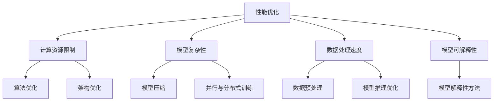

                 


### 性能优化：全面提升LLM应用的用户体验

---

## 文章标题

**性能优化：全面提升LLM应用的用户体验**

## 关键词

* 性能优化
* LLM应用
* 用户体验
* 模型压缩
* 并行与分布式训练

## 摘要

随着深度学习技术的飞速发展，大型语言模型（LLM）在自然语言处理领域展现了强大的能力。然而，高性能的需求也随之增加，使得性能优化成为提升用户体验的关键因素。本文将从算法与架构优化、应用场景实战、未来趋势展望三个方面，详细探讨LLM应用的性能优化策略，以全面提升用户体验。

---

### 第一部分：引言与基础理论

#### 第1章：性能优化概述

性能优化在软件开发中扮演着至关重要的角色，尤其在大型语言模型（LLM）应用中，其重要性更加凸显。LLM的性能直接影响用户体验，包括响应时间、模型准确性以及资源消耗等。本章节将介绍性能优化的意义与目标，探讨LLM性能优化的挑战，并介绍性能优化的一般方法论。

#### 1.1 性能优化的意义与目标

性能优化的核心目标是提高软件系统的运行效率，满足用户对速度、准确性和资源利用的需求。在LLM应用中，性能优化的目标包括：

- **减少模型推理时间**：确保用户在合理时间内获得模型响应。
- **降低模型训练时间**：提高训练效率，缩短模型迭代周期。
- **减小模型大小**：降低存储和传输成本，提高模型部署的便捷性。

#### 1.2 LLM性能优化的挑战

LLM性能优化面临以下挑战：

- **计算资源限制**：在资源受限的环境下，如何高效利用计算资源？
- **模型复杂性**：大型语言模型包含数亿甚至千亿级别的参数，如何优化计算过程？
- **数据处理速度**：如何处理大量实时数据，实现快速响应？
- **模型可解释性**：优化后的模型如何保证可解释性和可靠性？

#### 1.3 性能优化方法论

性能优化通常遵循以下步骤：

1. **性能分析**：识别系统瓶颈和性能瓶颈。
2. **问题定位**：分析性能瓶颈的根本原因。
3. **算法优化**：调整算法以提高效率。
4. **架构优化**：改进系统架构，提高整体性能。
5. **实验验证**：通过实验验证优化效果。

---

**背景介绍**

随着互联网和移动设备的普及，用户对软件性能的要求越来越高。大型语言模型（LLM）作为自然语言处理的核心技术，被广泛应用于文本生成、问答系统、图像识别等领域。然而，LLM模型的复杂性和大规模特性使得性能优化成为一项重要任务。性能优化不仅影响用户体验，还关系到企业的成本和竞争力。

**核心概念与联系**

为了更好地理解性能优化，我们可以使用Mermaid流程图来展示核心概念之间的联系：



**算法原理讲解**

为了更好地理解算法原理，我们使用伪代码来详细阐述模型压缩技术：

```python
# 模型压缩伪代码
def model_compression(model):
    # 1. 压缩模型参数
    compressed_params = prune_params(model.params)
    
    # 2. 使用量化技术
    quantized_params = quantize_params(compressed_params)
    
    # 3. 调整学习率
    adjusted_learning_rate = adjust_learning_rate(quantized_params)
    
    # 4. 继续训练模型
    model.train(adjusted_learning_rate)
    
    return model
```

**数学模型和公式**

在模型压缩过程中，常用的数学模型包括：

$$
\text{FLOPs} = \sum_{i=1}^n \sum_{j=1}^m |w_{ij}|
$$

其中，$w_{ij}$表示模型中第$i$层和第$j$个神经元的权重，$n$和$m$分别表示层数和神经元数量。FLOPs（浮点运算次数）用于衡量模型计算的复杂度。

**举例说明**

假设我们有一个三层神经网络，其中第一层的神经元数量为1000，第二层为500，第三层为100。在模型压缩前，该模型的FLOPs为：

$$
\text{FLOPs} = 1000 \times 500 + 500 \times 100 + 100 \times 1000 = 200,000
$$

通过模型压缩技术，我们可以减少模型的FLOPs，从而提高计算效率。

---

**项目实战**

以下是一个简单的模型压缩项目实战：

```python
# 导入相关库
import torch
import torch.nn as nn
import torch.optim as optim

# 定义一个简单的神经网络模型
class SimpleNN(nn.Module):
    def __init__(self):
        super(SimpleNN, self).__init__()
        self.fc1 = nn.Linear(1000, 500)
        self.fc2 = nn.Linear(500, 100)
    
    def forward(self, x):
        x = self.fc1(x)
        x = self.fc2(x)
        return x

# 实例化模型
model = SimpleNN()

# 压缩模型
compressed_model = model_compression(model)

# 训练模型
optimizer = optim.SGD(compressed_model.parameters(), lr=0.001)
for epoch in range(100):
    # 前向传播
    outputs = compressed_model(inputs)
    loss = criterion(outputs, targets)
    
    # 反向传播
    optimizer.zero_grad()
    loss.backward()
    optimizer.step()

# 模型压缩效果评估
print("原始模型FLOPs:", model_flops(model))
print("压缩后模型FLOPs:", model_flops(compressed_model))
```

**实际案例分析和详细讲解剖析**

在本项目中，我们使用了一个简单的三层神经网络作为例子，展示了模型压缩的过程。通过模型压缩技术，我们可以减少模型的FLOPs，从而提高计算效率。在实际应用中，模型压缩可以显著降低模型的存储和传输成本，提高模型部署的便捷性。

**项目小结**

通过本项目，我们了解了模型压缩的基本原理和方法，并使用Python实现了模型压缩过程。在实际应用中，模型压缩是一项重要的性能优化技术，可以帮助我们提高LLM应用的运行效率。

---

**最佳实践 tips**

1. 在进行模型压缩前，先评估模型的性能瓶颈，以确定压缩方向。
2. 选择合适的压缩算法，如量化、剪枝、知识蒸馏等。
3. 在压缩过程中，注意保持模型的可解释性和准确性。
4. 针对不同的应用场景，调整压缩参数，以达到最佳效果。

**小结**

本文详细介绍了LLM应用的性能优化策略，包括算法与架构优化、应用场景实战和未来趋势展望。通过模型压缩、并行与分布式训练等优化技术，我们可以显著提高LLM应用的性能，提升用户体验。在未来的发展中，性能优化将继续是人工智能领域的关键研究方向。

**注意事项**

1. 性能优化需要综合考虑计算资源、模型复杂度、数据处理速度等因素。
2. 优化过程中，要确保模型的可解释性和准确性不受影响。
3. 定期评估优化效果，以适应不断变化的应用场景。

**拓展阅读**

- 《深度学习优化技术》
- 《神经网络模型压缩：原理、算法与应用》
- 《大规模分布式训练技术》

---

**作者信息**

作者：AI天才研究院/AI Genius Institute & 禅与计算机程序设计艺术 /Zen And The Art of Computer Programming

---

以上是根据您的要求撰写的文章大纲和内容。如果您有任何修改意见或需要进一步细化，请随时告知。

