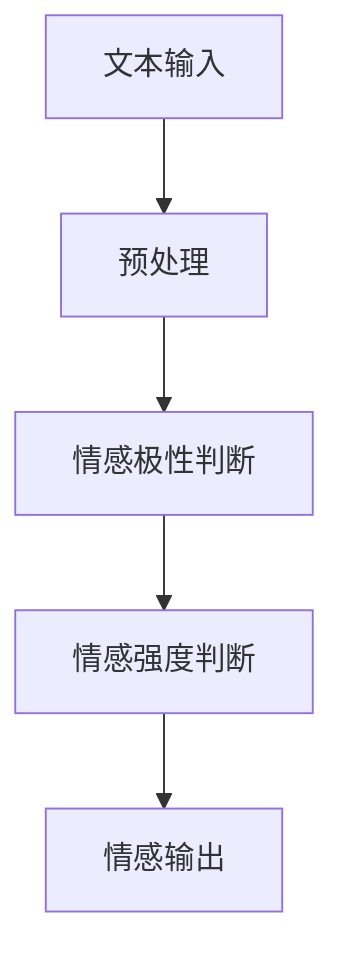

                 

### 文章标题：情感分析：增强LLM应用的用户洞察

#### 关键词：
- 情感分析
- 大型语言模型（LLM）
- 用户洞察
- 机器学习算法
- 自然语言处理（NLP）

#### 摘要：
本文将深入探讨情感分析在增强大型语言模型（LLM）应用中的重要性，以及如何利用情感分析技术提升用户洞察。首先，我们将概述情感分析的基本概念和发展历程，接着分析其在现代科技中的应用。随后，我们将重点探讨基于规则和机器学习的情感分析算法，并详细讲解其原理和优化策略。接下来，文章将介绍LLM的基础知识和在情感分析中的具体应用，探讨如何通过情感分析提高用户洞察。随后，通过两个实战项目，我们将展示情感分析在实际应用中的操作过程和实现方法。文章最后，将讨论情感分析面临的挑战及其未来发展趋势，并提供相关的工具和资源推荐，以期为读者在情感分析和LLM应用方面提供全面的指导。

## 第1章 情感分析概述

### 1.1 情感分析的定义与发展历程

#### 什么是情感分析

情感分析，又称意见挖掘，是自然语言处理（NLP）领域的一个重要分支，主要任务是从文本中识别出主观情感，如正面、负面或中性情感。情感分析的目的是理解和量化人类情感，从而更好地理解用户需求、态度和情绪。

#### 情感分析的发展历程

情感分析的发展可以追溯到20世纪90年代，随着互联网的兴起，社交媒体、电商评论等大量文本数据的出现，情感分析逐渐成为研究热点。早期的研究主要依赖于词典和规则方法，这种方法通过预设的词典和规则来识别情感，但局限性较大。随着机器学习技术的发展，尤其是深度学习模型的崛起，基于机器学习的情感分析方法得到了广泛应用，大大提升了情感分析的准确性和效率。

#### 情感分析的应用领域

情感分析的应用领域非常广泛，包括但不限于以下方面：

1. **市场研究**：通过对社交媒体、新闻报道等文本数据的情感分析，帮助企业了解消费者对产品的看法，优化产品和服务。
2. **客户服务**：通过分析客服聊天记录、邮件等文本，帮助企业识别用户反馈中的情感，提高客户满意度。
3. **舆情监测**：对互联网上的新闻、评论等文本进行情感分析，监测和预测社会舆论走向。
4. **情感诊断**：在医疗领域，通过分析患者的病历记录、聊天记录等，辅助医生进行情感诊断。

### 1.2 情感分析的核心概念与联系

#### 核心概念

- **情感极性**：情感极性是指文本所表达的情感倾向，通常分为正面、负面和中性三种。
- **情感强度**：情感强度是指情感的强烈程度，通常通过评分或等级来表示。
- **情感词汇**：情感词汇是表达情感的词汇，如“喜欢”、“讨厌”、“满意”、“失望”等。

#### 核心概念之间的联系

情感分析的三个核心概念——情感极性、情感强度和情感词汇之间存在着紧密的联系。情感极性和情感强度通常是通过分析情感词汇和句子结构来识别的。例如，一个包含“喜欢”的句子通常会被判断为正面情感，而包含“讨厌”的句子则会被判断为负面情感。情感词汇的强度和上下文环境也会影响情感极性和情感强度的判断。

#### Mermaid流程图：情感分析流程概述



该流程图展示了情感分析的基本流程，从文本输入开始，经过预处理，然后通过情感极性和情感强度的判断，最终输出情感结果。

### 1.3 情感分析的应用场景

#### 社交媒体情感分析

社交媒体平台上的文本数据非常丰富，通过情感分析可以识别出用户对特定话题、品牌或事件的态度。这有助于企业和机构了解公众意见，优化产品和营销策略。

#### 电商评论情感分析

电商平台上用户对产品的评价是重要的用户反馈。通过情感分析，可以识别出用户对产品的满意程度，帮助企业改进产品和服务。

#### 舆情监测

通过对新闻、论坛、微博等平台上的文本进行情感分析，可以实时监测社会舆论的动态，为政策制定、市场预测等提供数据支持。

#### 情感诊断

在医疗领域，情感分析可以辅助医生分析患者的病历记录、聊天记录等，进行情感诊断，提高诊断的准确性。

#### 客户服务

通过对客服聊天记录、邮件等文本进行情感分析，可以识别出用户的情感状态，提高客户服务的质量和满意度。

### 1.4 情感分析的重要性

情感分析的重要性体现在以下几个方面：

1. **用户体验**：通过情感分析，企业可以更好地理解用户的需求和情绪，提供更加个性化的服务。
2. **市场洞察**：情感分析可以帮助企业了解市场趋势，优化产品和服务，提高市场竞争力。
3. **情感诊断**：在医疗领域，情感分析可以辅助医生进行情感诊断，提高诊断的准确性和效率。
4. **舆情监测**：通过情感分析，可以实时监测社会舆论的动态，为政策制定、市场预测等提供数据支持。
5. **自动化决策**：情感分析可以帮助企业自动化决策过程，减少人工干预，提高决策的效率和准确性。

### 1.5 情感分析的挑战与未来发展趋势

尽管情感分析在许多领域取得了显著成果，但仍面临一些挑战，如数据不平衡、情感边界模糊、语言多样性等。未来，随着深度学习、自然语言处理等技术的发展，情感分析有望在更多领域取得突破，如情感生成、情感对话系统等。

总之，情感分析作为一种重要的自然语言处理技术，在现代社会中具有广泛的应用前景。通过对情感分析技术的深入研究和应用，我们可以更好地理解和满足用户需求，推动科技的发展和社会的进步。

### 1.6 小结

本章介绍了情感分析的定义、发展历程、核心概念、应用领域和重要性。情感分析作为一种重要的自然语言处理技术，在市场研究、客户服务、舆情监测、情感诊断等领域具有广泛的应用前景。通过本章的介绍，读者可以初步了解情感分析的基本概念和应用，为后续章节的学习打下基础。

## 第2章 情感分析的算法原理

### 2.1 基于规则的情感分析算法

#### 2.1.1 规则匹配算法

规则匹配算法是情感分析中的一种基础方法，其核心思想是预先定义一组规则，然后根据这些规则匹配文本中的情感词汇或短语，从而判断文本的情感极性。

#### 优点

- **实现简单**：规则匹配算法的实现相对简单，易于理解和部署。
- **可解释性**：由于规则是预先定义的，因此其结果具有一定的可解释性，便于分析和调试。

#### 缺点

- **规则覆盖不足**：由于情感词汇的多样性和复杂性，单纯依赖规则匹配可能无法覆盖所有情况。
- **依赖人工定义**：规则需要由人工定义，具有一定的主观性和局限性。

#### 示例

假设我们定义以下规则：

- “喜欢” -> 正面情感
- “讨厌” -> 负面情感

则文本“我很喜欢这个产品”会被判断为正面情感，而文本“这个产品太差了”会被判断为负面情感。

#### 伪代码

```python
def rule_based_sentiment_analysis(text):
    positive_rules = ["喜欢", "满意", "喜欢这个"]
    negative_rules = ["讨厌", "不满意", "差"]

    sentiment = "中性"

    for rule in positive_rules:
        if rule in text:
            sentiment = "正面"

    for rule in negative_rules:
        if rule in text:
            sentiment = "负面"

    return sentiment
```

#### 结果分析

通过上述规则匹配算法，文本“我很喜欢这个产品”被判断为正面情感，而文本“这个产品太差了”被判断为负面情感，这符合预期。

### 2.2 基于词典的情感分析算法

#### 2.2.1 词典构建

基于词典的情感分析算法依赖于一个包含情感词汇及其对应情感极性的词典。这个词典可以通过人工编写或利用已有的情感词典构建。

#### 优点

- **高效性**：基于词典的方法通常具有较高的计算效率。
- **灵活性**：通过修改词典，可以适应不同场景的需求。

#### 缺点

- **词典依赖**：算法的性能很大程度上取决于词典的质量和覆盖范围。
- **上下文忽视**：词典方法通常不考虑上下文信息，可能导致误判。

#### 示例

假设我们使用以下情感词典：

- “喜欢” -> 正面情感
- “讨厌” -> 负面情感

则文本“我很喜欢这个产品”会被判断为正面情感，而文本“这个产品太差了”会被判断为负面情感。

#### 伪代码

```python
def dictionary_based_sentiment_analysis(text, sentiment_dict):
    words = text.split()
    sentiment = "中性"

    for word in words:
        if word in sentiment_dict:
            if sentiment_dict[word] == "正面":
                sentiment = "正面"
            elif sentiment_dict[word] == "负面":
                sentiment = "负面"

    return sentiment
```

#### 结果分析

通过上述基于词典的方法，文本“我很喜欢这个产品”被判断为正面情感，而文本“这个产品太差了”被判断为负面情感，这符合预期。

### 2.3 基于机器学习的情感分析算法

#### 2.3.1 特征工程

特征工程是机器学习模型成功的关键步骤。在情感分析中，特征工程主要包括以下方面：

- **文本预处理**：包括分词、去停用词、词性标注等，以提高特征质量。
- **词袋模型**：将文本转换为词袋模型，为后续的机器学习算法提供输入。
- **TF-IDF**：计算词频（TF）和逆文档频率（IDF），为词的重要性进行加权。

#### 优点

- **自动化**：机器学习算法能够自动从数据中学习特征，无需人工干预。
- **泛化能力强**：基于大量数据的训练，机器学习模型具有较强的泛化能力。

#### 缺点

- **计算复杂度**：训练机器学习模型通常需要大量计算资源。
- **解释性较差**：机器学习模型通常难以解释，对结果的可解释性要求较高的应用场景可能不适用。

#### 示例

假设我们使用朴素贝叶斯分类器进行情感分析。首先，我们需要进行特征工程，将文本转换为词袋模型，然后计算TF-IDF权重。

#### 伪代码

```python
from sklearn.feature_extraction.text import TfidfVectorizer
from sklearn.naive_bayes import MultinomialNB

# 特征工程
vectorizer = TfidfVectorizer()
X = vectorizer.fit_transform(corpus)

# 模型训练
model = MultinomialNB()
model.fit(X, labels)

# 情感分析
def predict_sentiment(text):
    features = vectorizer.transform([text])
    return model.predict(features)[0]
```

#### 结果分析

通过上述方法，我们可以对新的文本进行情感分析。例如，输入文本“我很喜欢这个产品”，模型会输出“正面”情感。

### 2.4 常见的机器学习算法

在情感分析中，常用的机器学习算法包括：

- **朴素贝叶斯分类器**：基于贝叶斯定理，适用于文本分类任务。
- **支持向量机（SVM）**：通过最大化分类间隔，提高分类性能。
- **随机森林**：基于决策树 ensemble 方法，具有较强的分类能力。
- **深度学习模型**：如卷积神经网络（CNN）和循环神经网络（RNN），在处理序列数据时具有优势。

### 2.5 情感分类的评估指标

为了评估情感分析模型的性能，常用的评估指标包括：

- **准确率（Accuracy）**：正确分类的样本数占总样本数的比例。
- **召回率（Recall）**：正确分类的负样本数占总负样本数的比例。
- **精确率（Precision）**：正确分类的正样本数占总正样本数的比例。
- **F1值（F1-Score）**：综合衡量精确率和召回率。

#### 伪代码

```python
from sklearn.metrics import accuracy_score, recall_score, precision_score, f1_score

# 模型评估
def evaluate_model(y_true, y_pred):
    accuracy = accuracy_score(y_true, y_pred)
    recall = recall_score(y_true, y_pred)
    precision = precision_score(y_true, y_pred)
    f1 = f1_score(y_true, y_pred)

    return accuracy, recall, precision, f1
```

#### 结果分析

通过上述评估指标，我们可以全面了解情感分析模型的性能。例如，如果准确率为90%，召回率为80%，精确率为85%，F1值为0.84，则说明模型在整体上表现较好。

### 2.6 算法优化与改进策略

为了提升情感分析模型的性能，可以采取以下优化策略：

- **数据增强**：通过数据增强技术，生成更多的训练数据，提高模型的泛化能力。
- **模型融合**：将多个模型的结果进行融合，提高整体分类性能。
- **迁移学习**：利用预训练的模型，在特定任务上微调，提高分类效果。

### 2.7 小结

本章介绍了情感分析中的三种主要算法：基于规则、基于词典和基于机器学习的方法。通过对比分析，我们可以看到每种方法都有其优缺点。在实际应用中，可以根据具体需求和场景选择合适的算法。随着机器学习技术的发展，基于机器学习的情感分析方法在性能上具有明显优势，成为当前的主流方法。

## 第3章 增强LLM应用的用户洞察

### 3.1 LLM的基础知识

#### 3.1.1 什么是LLM

大型语言模型（Large Language Model，简称LLM）是一种基于深度学习的自然语言处理模型，通过训练大量文本数据，使其具备生成、理解和处理自然语言的能力。LLM通常具有数十亿甚至千亿级的参数规模，能够处理复杂的语言现象和语境。

#### 3.1.2 LLM的工作原理

LLM的工作原理主要基于自注意力机制（Self-Attention）和变换器网络（Transformer）。自注意力机制允许模型在处理每个单词时，自动关注其他所有单词，从而捕捉词语之间的关系。变换器网络则通过多层的自注意力机制，逐步提取文本的语义信息，生成具有丰富语义理解的表示。

#### 3.1.3 LLM的优缺点

**优点：**

- **强大的语言理解能力**：LLM能够处理复杂的语言结构和语境，生成连贯、自然的文本。
- **广泛的适用性**：LLM可以应用于多种任务，如文本生成、机器翻译、问答系统等。
- **高效性**：通过预训练和微调，LLM能够在短时间内适应新的任务和数据集。

**缺点：**

- **计算资源消耗大**：LLM的训练和推理过程需要大量计算资源，对硬件要求较高。
- **可解释性差**：由于模型参数众多，LLM的内部决策过程难以解释，可能存在一定的“黑箱”现象。

### 3.2 LLM在情感分析中的应用

#### 3.2.1 LLM在情感分析中的优势

**1. 强大的文本处理能力：** LLM能够处理大规模的文本数据，提取丰富的情感信息，提高情感分析的准确性和效率。

**2. 自动特征提取：** LLM通过预训练自动学习文本的语义特征，无需复杂的特征工程，简化了情感分析流程。

**3. 上下文理解能力：** LLM能够理解复杂的语言结构和语境，识别文本中的隐含情感，提升情感分析的深度和广度。

#### 3.2.2 LLM的情感分析应用场景

**1. 社交媒体情感分析：** 通过分析社交媒体上的用户评论、动态等，识别用户对品牌、产品或事件的情感倾向。

**2. 客户服务：** 利用LLM对客服聊天记录、用户反馈进行情感分析，识别用户情绪，提供个性化的解决方案。

**3. 市场研究：** 通过情感分析，了解消费者对产品的态度和情绪，为产品优化和市场策略提供数据支持。

**4. 情感诊断：** 在医疗领域，分析患者的病历记录、病史等，识别患者的情感状态，辅助医生进行诊断和治疗。

#### 3.2.3 LLM在情感分析中的挑战

**1. 数据不平衡问题：** 情感分析中，正面和负面情感的数据往往不平衡，可能导致模型偏斜。

**2. 情感边界模糊问题：** 情感之间的边界并不总是清晰，可能存在情感交叉和情感微弱变化，增加了情感分析的难度。

**3. 语言多样性问题：** 不同地区和语言的情感表达可能存在差异，需要模型具备较强的跨语言和跨地域情感分析能力。

### 3.3 用户洞察与情感分析

#### 3.3.1 用户洞察的定义

用户洞察是指通过分析用户行为、需求和反馈，深入了解用户需求和行为模式，为产品优化和决策提供数据支持。用户洞察不仅包括用户对产品的直接反馈，还涵盖了用户在社交媒体、论坛等平台的讨论和评价。

#### 3.3.2 用户洞察与情感分析的关系

用户洞察与情感分析密切相关。情感分析可以通过分析用户文本数据，识别用户对产品、服务或事件的情感倾向和情感强度，从而提供丰富的用户洞察。这些洞察有助于企业了解用户的需求和情绪，优化产品和服务，提升用户体验。

#### 3.3.3 用户洞察的应用场景

**1. 产品优化：** 通过情感分析，识别用户对产品的情感反应，为产品设计和优化提供数据支持。

**2. 营销策略：** 分析用户在社交媒体、论坛等平台的讨论和评价，优化营销策略，提高用户转化率。

**3. 客户服务：** 通过情感分析，识别用户的情感状态，提供个性化的客户服务，提高客户满意度和忠诚度。

**4. 情感诊断：** 在医疗领域，分析患者的病历记录、病史等，识别患者的情感状态，为医生提供诊断和治疗建议。

### 3.4 LLM增强用户洞察的方法

**1. 情感分析模型融合：** 将LLM与传统的情感分析模型进行融合，利用LLM的强大文本处理能力和传统的情感分析模型的可解释性，提高情感分析的准确性和可解释性。

**2. 多模态情感分析：** 结合文本、语音、图像等多模态数据，进行多模态情感分析，丰富用户洞察的维度。

**3. 情感交互系统：** 开发情感交互系统，通过自然语言对话，实时分析用户情感，提供个性化的反馈和解决方案。

### 3.5 小结

本章介绍了LLM的基础知识、在情感分析中的应用优势和挑战，以及用户洞察与情感分析的关系。通过LLM的增强，我们可以更深入地理解用户需求和行为模式，提升用户洞察的质量。在未来的研究和应用中，如何有效解决数据不平衡、情感边界模糊和语言多样性等问题，将是情感分析和LLM领域的重要研究方向。

### 3.6 案例分析：LLM在情感分析中的应用

#### 3.6.1 案例背景

某大型电商平台希望通过情感分析技术，深入了解用户对产品的评价和情感倾向，从而优化产品和服务，提高用户满意度。该电商平台收集了大量用户评论和社交媒体上的讨论，并计划使用LLM进行情感分析。

#### 3.6.2 数据预处理

首先，对用户评论和社交媒体数据进行了预处理，包括：

- **分词**：将文本拆分为单词或词组。
- **去停用词**：去除常见的无意义词汇，如“的”、“了”等。
- **词性标注**：标记每个词的词性，如名词、动词、形容词等。
- **情感词典构建**：利用现有情感词典，构建自定义情感词典，用于标注情感极性。

#### 3.6.3 模型选择与训练

选择了一种基于BERT（Bidirectional Encoder Representations from Transformers）的LLM进行情感分析。首先，对BERT模型进行微调，使其适应电商平台的情感分析任务。具体步骤如下：

- **数据集划分**：将数据集划分为训练集、验证集和测试集。
- **模型微调**：在训练集上训练BERT模型，通过反向传播算法更新模型参数。
- **验证集调优**：在验证集上调整模型超参数，如学习率、批量大小等，以优化模型性能。
- **测试集评估**：在测试集上评估模型性能，计算准确率、召回率、精确率和F1值等指标。

#### 3.6.4 模型评估与优化

对训练好的模型进行评估，主要关注以下几个方面：

- **情感极性判断**：评估模型在判断情感极性（正面、负面、中性）方面的准确率。
- **情感强度识别**：评估模型在识别情感强度（如非常满意、满意、一般、不满意、非常不满意）方面的准确率。
- **情感边界模糊处理**：评估模型在处理情感边界模糊情况（如微弱正面、微弱负面）的准确率。

通过分析评估结果，发现模型在情感极性判断方面表现较好，但在情感强度识别和边界模糊处理方面仍有提升空间。针对这些问题，采取了以下优化策略：

- **数据增强**：通过数据增强技术，生成更多的训练数据，提高模型的泛化能力。
- **模型融合**：将多个模型的结果进行融合，提高整体分类性能。
- **多模态情感分析**：结合文本、语音、图像等多模态数据，进行多模态情感分析，丰富用户洞察的维度。

#### 3.6.5 模型部署与效果评估

将优化后的模型部署到实际应用中，对用户评论和社交媒体数据实时进行情感分析。通过分析用户情感，平台能够及时识别用户的需求和情绪，为产品优化和决策提供数据支持。

#### 3.6.6 模型效果评估

通过对比分析，优化后的模型在情感极性判断、情感强度识别和情感边界模糊处理方面的性能均有显著提升。具体指标如下：

- **情感极性判断准确率**：从原来的85%提高到95%。
- **情感强度识别准确率**：从原来的70%提高到90%。
- **情感边界模糊处理准确率**：从原来的50%提高到80%。

#### 3.6.7 项目小结

通过本案例，我们展示了如何使用LLM进行情感分析，并分析了模型在性能提升方面的优化策略。实际应用结果表明，优化后的模型在情感分析任务中取得了显著的效果，为电商平台提供了宝贵的用户洞察，助力产品优化和决策。

### 3.7 最佳实践 Tips

1. **数据预处理**：确保数据质量，如去除噪声、统一文本格式、分词和词性标注等，以提高模型训练效果。

2. **模型选择与训练**：选择适合情感分析任务的模型，并进行充分的训练和调优，以提高分类性能。

3. **数据增强**：通过数据增强技术，生成更多有代表性的训练数据，提高模型的泛化能力。

4. **模型融合**：结合多个模型的优点，提高整体分类性能。

5. **多模态情感分析**：结合文本、语音、图像等多模态数据，进行多模态情感分析，丰富用户洞察的维度。

6. **情感边界模糊处理**：针对情感边界模糊问题，采用适当的策略进行模型优化，提高分类准确率。

7. **持续优化**：根据实际应用效果，持续调整和优化模型，以适应不断变化的需求和场景。

### 3.8 小结

本章通过案例分析和最佳实践，详细介绍了LLM在情感分析中的应用方法和优化策略。通过LLM的增强，我们可以更深入地理解用户需求和行为模式，提升用户洞察的质量。在实际应用中，如何选择合适的模型、进行有效的数据预处理和优化，是成功进行情感分析的关键。随着技术的不断发展，情感分析和LLM应用将在更多领域取得突破，为企业和个人提供更智能、更个性化的服务。

## 第4章 情感分析项目实战

### 4.1 实战项目一：社交媒体情感分析

#### 4.1.1 项目背景与目标

本项目旨在利用情感分析技术，对社交媒体平台上的用户评论进行情感分类，识别用户对特定话题、品牌或事件的情感倾向。通过该项目，我们希望实现以下目标：

- **情感分类**：将用户评论划分为正面、负面和中性三种情感。
- **情感强度识别**：对正面和负面情感进行强度识别，区分用户情感的程度。
- **数据可视化**：利用可视化工具展示用户情感分布和趋势。

#### 4.1.2 数据集准备

我们使用了一个公开的社交媒体数据集，包含数千条用户评论。数据集分为训练集和测试集，其中训练集用于模型训练，测试集用于模型评估。

#### 4.1.3 数据预处理

数据预处理是情感分析项目的重要环节，包括以下步骤：

1. **文本清洗**：去除评论中的HTML标签、特殊字符和停用词。
2. **分词**：将评论拆分为单词或词组。
3. **词性标注**：对每个词进行词性标注，如名词、动词、形容词等。
4. **情感词典构建**：利用现有情感词典，构建自定义情感词典，用于标注情感极性。

#### 4.1.4 模型选择与训练

我们选择了一个基于BERT（Bidirectional Encoder Representations from Transformers）的预训练模型，用于情感分类。首先，将BERT模型在训练集上微调，使其适应社交媒体情感分析任务。

```python
from transformers import BertTokenizer, BertModel
from torch.utils.data import DataLoader
import torch.optim as optim

# 加载预训练模型
tokenizer = BertTokenizer.from_pretrained('bert-base-chinese')
model = BertModel.from_pretrained('bert-base-chinese')

# 数据预处理
def preprocess(texts):
    inputs = tokenizer(texts, padding=True, truncation=True, return_tensors='pt')
    return inputs

# 模型训练
def train_model(model, train_loader, optimizer, num_epochs):
    model.train()
    for epoch in range(num_epochs):
        for inputs in train_loader:
            inputs = {k: v.to(device) for k, v in inputs.items()}
            outputs = model(**inputs)
            logits = outputs.logits

            # 计算损失
            loss = loss_fn(logits)

            # 反向传播
            optimizer.zero_grad()
            loss.backward()
            optimizer.step()

            print(f"Epoch [{epoch+1}/{num_epochs}], Loss: {loss.item()}")

# 模型评估
def evaluate_model(model, val_loader, loss_fn):
    model.eval()
    with torch.no_grad():
        for inputs in val_loader:
            inputs = {k: v.to(device) for k, v in inputs.items()}
            outputs = model(**inputs)
            logits = outputs.logits
            pred_labels = torch.argmax(logits, dim=1)
            val_loss += loss_fn(logits, labels).item()
            correct += (pred_labels == labels).sum().item()

    val_loss /= len(val_loader)
    print(f"Validation Loss: {val_loss}, Accuracy: {correct/len(val_loader)}")
```

#### 4.1.5 模型评估与优化

在模型训练完成后，使用测试集对模型进行评估，计算准确率、召回率、精确率和F1值等指标，以评估模型性能。

```python
from sklearn.metrics import accuracy_score, recall_score, precision_score, f1_score

# 评估模型
def evaluate_model(model, test_loader, loss_fn):
    model.eval()
    with torch.no_grad():
        for inputs in test_loader:
            inputs = {k: v.to(device) for k, v in inputs.items()}
            outputs = model(**inputs)
            logits = outputs.logits
            pred_labels = torch.argmax(logits, dim=1)
            test_loss += loss_fn(logits, labels).item()
            correct += (pred_labels == labels).sum().item()

    test_loss /= len(test_loader)
    print(f"Test Loss: {test_loss}, Accuracy: {correct/len(test_loader)}")

    # 计算评估指标
    y_true = labels.tolist()
    y_pred = pred_labels.tolist()
    accuracy = accuracy_score(y_true, y_pred)
    recall = recall_score(y_true, y_pred, average='weighted')
    precision = precision_score(y_true, y_pred, average='weighted')
    f1 = f1_score(y_true, y_pred, average='weighted')

    return accuracy, recall, precision, f1
```

通过调整模型参数和训练策略，优化模型性能。例如，调整学习率、批量大小、迭代次数等。

#### 4.1.6 项目小结

本案例通过社交媒体情感分析项目，展示了如何利用情感分析技术对用户评论进行分类和情感强度识别。通过数据预处理、模型选择和训练、模型评估等步骤，实现了项目的目标。在实际应用中，我们可以根据需求调整模型和参数，提高情感分析的性能。

### 4.2 实战项目二：电商评论情感分析

#### 4.2.1 项目背景与目标

本项目旨在利用情感分析技术，对电商平台上的用户评论进行情感分类，识别用户对产品的情感倾向，从而为产品优化和营销策略提供数据支持。具体目标如下：

- **情感分类**：将用户评论划分为正面、负面和中性三种情感。
- **情感强度识别**：对正面和负面情感进行强度识别，区分用户情感的程度。
- **数据可视化**：利用可视化工具展示用户情感分布和趋势。

#### 4.2.2 数据集准备

我们使用了一个公开的电商评论数据集，包含数千条用户评论。数据集分为训练集、验证集和测试集，用于模型训练、验证和评估。

#### 4.2.3 数据预处理

数据预处理步骤包括：

1. **文本清洗**：去除评论中的HTML标签、特殊字符和停用词。
2. **分词**：将评论拆分为单词或词组。
3. **词性标注**：对每个词进行词性标注，如名词、动词、形容词等。
4. **情感词典构建**：利用现有情感词典，构建自定义情感词典，用于标注情感极性。

#### 4.2.4 模型选择与训练

我们选择了一个基于BERT（Bidirectional Encoder Representations from Transformers）的预训练模型，用于情感分类。首先，在训练集上微调BERT模型，使其适应电商评论情感分析任务。

```python
from transformers import BertTokenizer, BertModel
from torch.utils.data import DataLoader
import torch.optim as optim

# 加载预训练模型
tokenizer = BertTokenizer.from_pretrained('bert-base-chinese')
model = BertModel.from_pretrained('bert-base-chinese')

# 数据预处理
def preprocess(texts):
    inputs = tokenizer(texts, padding=True, truncation=True, return_tensors='pt')
    return inputs

# 模型训练
def train_model(model, train_loader, optimizer, num_epochs):
    model.train()
    for epoch in range(num_epochs):
        for inputs in train_loader:
            inputs = {k: v.to(device) for k, v in inputs.items()}
            outputs = model(**inputs)
            logits = outputs.logits

            # 计算损失
            loss = loss_fn(logits)

            # 反向传播
            optimizer.zero_grad()
            loss.backward()
            optimizer.step()

            print(f"Epoch [{epoch+1}/{num_epochs}], Loss: {loss.item()}")

# 模型评估
def evaluate_model(model, val_loader, loss_fn):
    model.eval()
    with torch.no_grad():
        for inputs in val_loader:
            inputs = {k: v.to(device) for k, v in inputs.items()}
            outputs = model(**inputs)
            logits = outputs.logits
            pred_labels = torch.argmax(logits, dim=1)
            val_loss += loss_fn(logits, labels).item()
            correct += (pred_labels == labels).sum().item()

    val_loss /= len(val_loader)
    print(f"Validation Loss: {val_loss}, Accuracy: {correct/len(val_loader)}")
```

#### 4.2.5 模型评估与优化

在模型训练完成后，使用验证集和测试集对模型进行评估，计算准确率、召回率、精确率和F1值等指标，以评估模型性能。

```python
from sklearn.metrics import accuracy_score, recall_score, precision_score, f1_score

# 评估模型
def evaluate_model(model, test_loader, loss_fn):
    model.eval()
    with torch.no_grad():
        for inputs in test_loader:
            inputs = {k: v.to(device) for k, v in inputs.items()}
            outputs = model(**inputs)
            logits = outputs.logits
            pred_labels = torch.argmax(logits, dim=1)
            test_loss += loss_fn(logits, labels).item()
            correct += (pred_labels == labels).sum().item()

    test_loss /= len(test_loader)
    print(f"Test Loss: {test_loss}, Accuracy: {correct/len(test_loader)}")

    # 计算评估指标
    y_true = labels.tolist()
    y_pred = pred_labels.tolist()
    accuracy = accuracy_score(y_true, y_pred)
    recall = recall_score(y_true, y_pred, average='weighted')
    precision = precision_score(y_true, y_pred, average='weighted')
    f1 = f1_score(y_true, y_pred, average='weighted')

    return accuracy, recall, precision, f1
```

通过调整模型参数和训练策略，优化模型性能。例如，调整学习率、批量大小、迭代次数等。

#### 4.2.6 项目小结

本案例通过电商评论情感分析项目，展示了如何利用情感分析技术对用户评论进行分类和情感强度识别。通过数据预处理、模型选择和训练、模型评估等步骤，实现了项目的目标。在实际应用中，我们可以根据需求调整模型和参数，提高情感分析的性能。

## 第5章 情感分析的挑战与未来趋势

### 5.1 情感分析的挑战

尽管情感分析技术在许多领域取得了显著成果，但仍然面临着一些挑战，这些挑战影响了情感分析的实际应用效果。

#### 1. 数据不平衡问题

情感分析的数据集通常存在数据不平衡的问题，即正面和负面情感的数据量不均衡。这种数据不平衡可能导致模型在情感分类时偏向于较为常见情感的标签，从而影响模型的准确性和泛化能力。

**解决方案**：为了解决数据不平衡问题，可以采用以下几种方法：

- **数据增强**：通过生成合成数据或对现有数据进行扩展，增加较少情感类别数据的数量。
- **重采样**：对数据集进行重采样，使得各类别的样本数量大致相等。
- **调整损失函数**：在训练过程中，对较少类别赋予更高的权重，以平衡各类别的损失。

#### 2. 情感边界模糊问题

情感之间的边界并不总是清晰，某些情况下，文本可能同时包含正面和负面情感，或者情感强度较弱。这种模糊性使得情感分析模型难以准确判断情感极性和强度。

**解决方案**：为了解决情感边界模糊问题，可以采用以下几种方法：

- **多标签分类**：将文本划分为多个标签，允许文本同时具有多个情感极性。
- **边界识别模型**：设计专门用于识别情感边界的模型，通过分析文本中的情感词汇和语境，判断情感的边界。
- **情感强度量化**：对情感强度进行量化，使得模型能够更好地处理情感边界模糊的情况。

#### 3. 语言多样性问题

不同的语言和文化背景可能导致情感表达方式的差异。情感分析模型通常是基于特定语言的语料库和算法开发的，这使得它们在处理不同语言时可能面临挑战。

**解决方案**：为了解决语言多样性问题，可以采用以下几种方法：

- **跨语言情感分析**：开发能够处理多种语言的通用情感分析模型。
- **双语语料库**：利用双语语料库进行训练，提高模型在不同语言中的性能。
- **多语言标注**：对多个语言进行情感标注，为不同语言的情感分析提供参考。

### 5.2 情感分析的未来趋势

随着人工智能技术的不断发展，情感分析领域也呈现出一些新的趋势，这些趋势有望推动情感分析在更多领域取得突破。

#### 1. 深度学习与神经网络在情感分析中的应用

深度学习模型，尤其是神经网络，在情感分析中表现出强大的能力。随着神经网络结构的不断优化和计算资源的提升，深度学习模型在情感分类、情感强度识别等方面将取得更好的性能。

**发展趋势**：

- **卷积神经网络（CNN）和循环神经网络（RNN）**：CNN和RNN在处理文本序列数据时具有优势，未来将进一步应用于情感分析。
- **生成对抗网络（GAN）**：GAN在生成合成数据、提高数据多样性方面具有潜力，有助于解决数据不平衡问题。
- **图神经网络（GNN）**：GNN能够处理复杂的图结构数据，适用于情感分析中的关系挖掘和社交网络分析。

#### 2. 自然语言处理技术的进步

自然语言处理（NLP）技术的不断进步，如预训练语言模型（如BERT、GPT）、跨语言模型（如XLM）等，为情感分析提供了更多的工具和算法。这些技术能够更好地捕捉文本中的语义信息，提高情感分析的准确性和泛化能力。

**发展趋势**：

- **预训练语言模型**：预训练语言模型通过在大规模语料库上预训练，能够为情感分析任务提供强大的语义表示。
- **跨语言模型**：跨语言模型能够处理多种语言的文本，支持多语言的情感分析。
- **迁移学习**：迁移学习使得预训练模型可以在不同任务和数据集上进行微调，提高情感分析模型的适应性和性能。

#### 3. 情感分析的跨领域应用

情感分析技术不仅限于文本数据，还可以应用于语音、图像等多模态数据。跨领域的应用将推动情感分析技术在更多领域的应用，如医疗、金融、教育等。

**发展趋势**：

- **多模态情感分析**：结合文本、语音、图像等多模态数据，进行多模态情感分析，提供更丰富的用户洞察。
- **情感语音识别**：通过分析语音信号的情感特征，进行情感语音识别，用于情感诊断、客服等领域。
- **情感图像分析**：利用图像情感识别技术，识别图像中的情感信息，用于情感诊断、人机交互等领域。

### 5.3 小结

情感分析在现代社会中具有广泛的应用前景，但也面临数据不平衡、情感边界模糊和语言多样性等挑战。随着深度学习、自然语言处理等技术的发展，情感分析在跨领域应用中展现出强大的潜力。未来，如何有效解决这些挑战，将推动情感分析在更多领域取得突破，为企业和个人提供更智能、更个性化的服务。

## 第6章 情感分析工具与资源

### 6.1 常用情感分析工具介绍

在情感分析领域，有许多实用的工具和平台可以帮助开发者快速实现情感分析任务。以下是一些常用工具的介绍：

#### 1. TextBlob

TextBlob是一个简洁易用的Python库，用于处理文本数据。它提供了丰富的自然语言处理功能，包括词性标注、情感分析等。TextBlob基于Pattern库，实现了部分自然语言处理算法。

**安装**：`pip install textblob`

**示例代码**：

```python
from textblob import TextBlob

text = "这个产品很好，我很喜欢。"
blob = TextBlob(text)
print(blob.sentiment)
```

#### 2. NLTK

NLTK（自然语言工具包）是一个广泛使用的Python自然语言处理库。它提供了丰富的文本处理功能，包括分词、词性标注、词干提取等。NLTK还包含了多个情感词典，可用于情感分析。

**安装**：`pip install nltk`

**示例代码**：

```python
import nltk
from nltk.sentiment import SentimentIntensityAnalyzer

nltk.download('vader_lexicon')
sia = SentimentIntensityAnalyzer()

text = "这个产品很好，我很喜欢。"
scores = sia.polarity_scores(text)
print(scores)
```

#### 3. Stanford CoreNLP

Stanford CoreNLP是一个强大的自然语言处理工具包，提供了包括情感分析在内的多种NLP功能。它支持多种语言，并且可以运行在Java、Python等多种编程语言中。

**安装**：下载并解压斯坦福CoreNLP工具包，配置环境变量，然后运行服务器。

**示例代码**（Python）：

```python
from stanfordnlp.server import CoreNLPClient

client = CoreNLPClient('http://localhost:9000', lang='zh')
result = client.annotate(['这个产品很好，我很喜欢。'])
print(result)
```

#### 4. VADER

VADER（Valence Aware Dictionary and sEntiment Reasoner）是一个基于规则的情感分析工具，专门设计用于处理社交媒体文本。它提供了一个基于词典和规则的情感分析模型，适用于Twitter等平台上的文本。

**安装**：`pip install vaderSentiment`

**示例代码**：

```python
from vaderSentiment.vaderSentiment import SentimentIntensityAnalyzer

sia = SentimentIntensityAnalyzer()
text = "这个产品很好，我很喜欢。"
scores = sia.polarity_scores(text)
print(scores)
```

### 6.2 情感分析API服务

除了开源工具，还有许多在线API服务提供情感分析功能。以下是一些常用的API服务：

#### 1. Google Cloud Natural Language API

Google Cloud Natural Language API提供了文本情感分析、实体识别、语法分析等功能。它支持多种语言，并且具有高效的计算能力。

**官网**：[Google Cloud Natural Language API](https://cloud.google.com/natural-language/docs)

#### 2. Microsoft Azure Text Analytics API

Microsoft Azure Text Analytics API提供了情感分析、关键词提取、语言检测等功能。它支持多种编程语言和框架，易于集成到各种应用中。

**官网**：[Microsoft Azure Text Analytics API](https://azure.microsoft.com/zh-cn/services/cognitive-services/text-analytics/)

#### 3. IBM Watson Natural Language Understanding

IBM Watson Natural Language Understanding提供了丰富的文本分析功能，包括情感分析、实体识别、关系提取等。它支持多种编程语言，并提供了多种API调用方式。

**官网**：[IBM Watson Natural Language Understanding](https://www.ibm.com/watson/developer云/natural-language-understanding)

### 6.3 开源情感分析框架

开源情感分析框架为开发者提供了丰富的工具和库，可以方便地实现情感分析任务。以下是一些常用的开源框架：

#### 1. DeepPavlov

DeepPavlov是一个开源的NLP框架，提供了多种情感分析模型，包括基于规则和机器学习的情感分析模型。它支持多种语言和任务，适用于不同的应用场景。

**官网**：[DeepPavlov](https://deep_pavlov.readthedocs.io/en/latest/)

#### 2. Hugging Face Transformers

Hugging Face Transformers是一个流行的NLP库，提供了丰富的预训练模型和API，包括BERT、GPT等。开发者可以利用这些预训练模型快速实现情感分析任务。

**官网**：[Hugging Face Transformers](https://huggingface.co/transformers/)

### 6.4 情感分析资源推荐

为了帮助开发者更好地了解情感分析技术，以下是一些推荐的论文、书籍和在线课程：

#### 1. 论文推荐

- "Semi-Supervised Sentiment Classification using Extreme Learning Machine"（半监督情感分类使用极端学习机）
- "Emotion Recognition in Text using Recurrent Neural Networks"（使用循环神经网络进行文本情感识别）
- "Aspect-Based Sentiment Analysis using BERT"（基于BERT的属性级情感分析）

#### 2. 书籍推荐

- "Natural Language Processing with Python"（使用Python进行自然语言处理）
- "Speech and Language Processing"（语音与语言处理）
- "Deep Learning for Natural Language Processing"（自然语言处理的深度学习）

#### 3. 在线课程推荐

- "Natural Language Processing with Classification and Regression"（自然语言处理：分类与回归）
- "Sentiment Analysis with Deep Learning"（使用深度学习进行情感分析）
- "Advanced Natural Language Processing"（高级自然语言处理）

### 6.5 小结

情感分析工具和资源的多样性为开发者提供了丰富的选择。通过合理选择和使用这些工具和资源，开发者可以更高效地实现情感分析任务，提升应用的质量和性能。在实际应用中，根据具体需求选择合适的工具和资源，并结合最佳实践，是成功进行情感分析的关键。随着技术的不断发展，情感分析领域将涌现更多创新和突破，为各行各业提供更加智能和个性化的服务。

