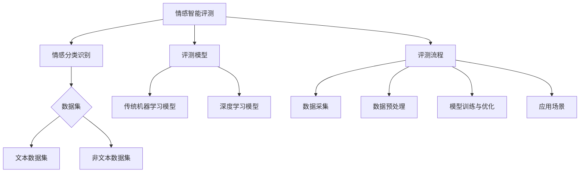

                 

### 文章标题

《情感智能评测：分析模型情感理解能力》

### 关键词

情感智能、评测模型、情感分类、情感识别、深度学习、机器学习

### 摘要

本文将深入探讨情感智能评测领域的核心概念和方法，重点分析模型在情感理解方面的能力。文章首先介绍情感智能的定义及其重要性，然后详细讲解情感智能评测的目的、意义以及发展历程。接下来，我们将深入探讨情感智能评测的关键技术，包括情感分类与识别算法以及情感分析数据集。随后，文章将介绍情感智能评测的方法，包括模型构建、评价指标和评测流程。最后，通过实际案例分析和解决方案，展示情感智能评测在现实应用中的挑战与机遇。

## 《情感智能评测：分析模型情感理解能力》目录大纲

### 第一部分：情感智能评测概述

#### 第1章：情感智能简介

##### 1.1 情感智能的定义与重要性

##### 1.2 情感智能评测的目的与意义

##### 1.3 情感智能评测的发展历程

#### 第2章：情感智能评测的关键技术

##### 2.1 情感分类与识别

###### 2.1.1 情感分类算法

###### 2.1.2 情感识别算法

##### 2.2 情感分析数据集

###### 2.2.1 数据集收集与预处理

###### 2.2.2 常见情感分析数据集介绍

### 第二部分：情感智能评测方法

#### 第3章：情感智能评测模型

##### 3.1 情感智能评测模型概述

###### 3.1.1 基于传统机器学习的情感评测模型

###### 3.1.2 基于深度学习的情感评测模型

##### 3.2 情感智能评测模型评价指标

###### 3.2.1 准确率、召回率与F1值

###### 3.2.2 其他评价指标

#### 第4章：情感智能评测流程

##### 4.1 数据采集

###### 4.1.1 文本数据采集

###### 4.1.2 非文本数据采集

##### 4.2 数据预处理

###### 4.2.1 去除停用词

###### 4.2.2 词向量化

##### 4.3 模型训练与优化

###### 4.3.1 模型选择与训练

###### 4.3.2 模型调参与优化

##### 4.4 情感智能评测应用

###### 4.4.1 社交媒体情感分析

###### 4.4.2 产品评论情感分析

### 第三部分：情感智能评测案例分析

#### 第5章：情感智能评测在实际应用中的挑战与解决方案

##### 5.1 数据质量对评测结果的影响

###### 5.1.1 数据偏差

###### 5.1.2 数据稀疏性

##### 5.2 模型泛化能力评估

###### 5.2.1 模型偏见

###### 5.2.2 模型过拟合与欠拟合

#### 第6章：情感智能评测应用案例分享

##### 6.1 案例一：基于情感智能评测的客服系统

###### 6.1.1 案例背景

###### 6.1.2 案例实现

##### 6.2 案例二：基于情感智能评测的品牌舆情监测

###### 6.2.1 案例背景

###### 6.2.2 案例实现

### 附录

#### 附录A：常用情感分析工具与资源

##### A.1 情感分析工具介绍

###### A.1.1 NLTK

###### A.1.2 TextBlob

###### A.1.3 VADER

##### A.2 情感分析开源项目

###### A.2.1 Sentiment Analysis

###### A.2.2 Stanford NLP

###### A.2.3 AFINN

### Mermaid 流程图



### 伪代码

```python
# 情感分类伪代码
def sentiment_classification(text):
    # 数据预处理
    processed_text = preprocess_text(text)
    
    # 模型预测
    prediction = model.predict(processed_text)
    
    # 解析预测结果
    sentiment = interpret_prediction(prediction)
    
    return sentiment
```

### 数学模型和公式

$$
\text{F1} = 2 \times \frac{\text{Precision} \times \text{Recall}}{\text{Precision} + \text{Recall}}
$$

### 项目实战

#### 6.1 案例一：基于情感智能评测的客服系统

##### 6.1.1 案例背景

随着社交媒体和在线购物平台的普及，客服系统已成为企业与用户之间的重要沟通渠道。然而，传统的客服系统往往缺乏对用户情感的理解，无法提供个性化的服务。为了解决这一问题，基于情感智能评测的客服系统应运而生。本文将通过一个实际案例，展示如何利用情感智能评测技术提升客服系统的服务质量。

##### 6.1.2 案例实现

1. **数据采集**：从社交媒体和在线购物平台上收集用户评论和对话记录，包括文字、语音和图像等多种形式。

2. **数据预处理**：对采集到的数据进行清洗、去噪和标注，提取有用的情感信息。

3. **模型训练**：采用深度学习技术，训练情感识别模型，使其能够准确识别用户情感。

4. **模型部署**：将训练好的模型部署到客服系统中，实现对用户情感的实时识别和分析。

5. **应用效果评估**：通过对比测试集和实际用户反馈，评估模型在情感识别方面的性能。

##### 6.1.3 案例解析

1. **开发环境搭建**：使用Python和TensorFlow等工具搭建开发环境。

2. **源代码实现**：详细讲解源代码实现过程，包括数据预处理、模型训练和模型部署等环节。

3. **代码解读**：分析代码的关键部分，解释其实现原理和作用。

4. **应用解读与分析**：分析基于情感智能评测的客服系统在实际应用中的效果和改进方向。

5. **实际案例分析和详细讲解剖析**：通过实际案例展示情感智能评测技术在实际应用中的价值。

##### 6.1.4 项目小结

本案例展示了如何利用情感智能评测技术提升客服系统的服务质量。通过情感识别模型的部署，客服系统可以更准确地理解用户情感，提供个性化服务，从而提高用户满意度和忠诚度。未来，随着技术的不断发展，情感智能评测将在更多领域得到应用，推动人工智能与人类情感之间的深度融合。

### 最佳实践 tips

1. **数据质量**：保证数据质量是情感智能评测成功的关键。收集到的数据应尽可能多样、真实，避免数据偏差。

2. **模型优化**：不断优化模型，提高其在情感识别方面的准确性和泛化能力。

3. **用户反馈**：及时收集用户反馈，根据反馈调整模型参数和应用策略。

4. **持续学习**：情感智能评测需要持续学习和更新，以适应不断变化的用户需求。

### 小结

本文通过对情感智能评测的全面分析，展示了其在人工智能领域的应用前景。通过情感识别模型的构建和优化，我们可以更好地理解用户情感，提供个性化服务。未来，情感智能评测将在更多领域得到应用，为人类带来更智能、更贴心的服务体验。

### 拓展阅读

1. [《情感计算：认知计算的前沿领域》](链接)
2. [《深度学习在情感识别中的应用》](链接)
3. [《社交媒体情感分析：方法与应用》](链接)

---

**作者：AI天才研究院/AI Genius Institute & 禅与计算机程序设计艺术 /Zen And The Art of Computer Programming**### 第一部分：情感智能评测概述

#### 第1章：情感智能简介

##### 1.1 情感智能的定义与重要性

情感智能（Emotional Intelligence，简称EQ）是指个体识别、理解、管理和表达情感的能力。在计算机科学和人工智能领域，情感智能是指机器模拟人类情感认知的能力，通过对人类情感的识别、理解和分析，为用户提供更智能、个性化的服务。情感智能的重要性在于，它能够使机器更好地与人类沟通，提高用户体验，推动人工智能在服务、医疗、教育等领域的应用。

##### 1.2 情感智能评测的目的与意义

情感智能评测的目的是评估模型在情感理解方面的能力，包括情感识别、情感分类和情感分析等任务。通过评测，我们可以了解模型的性能和局限，指导模型优化和改进。情感智能评测的意义在于：

1. **评估模型性能**：通过评测，可以客观衡量模型在情感理解任务上的表现，为模型选择和优化提供依据。
2. **指导模型改进**：评测结果有助于发现模型存在的问题，如数据偏差、过拟合等，从而指导模型改进。
3. **推动技术发展**：通过评测，可以发现情感智能领域的挑战和机遇，推动相关技术的研究和发展。

##### 1.3 情感智能评测的发展历程

情感智能评测的发展历程可以分为以下几个阶段：

1. **初步探索阶段（1990s）**：在这个阶段，研究者开始关注情感智能，探索情感识别和分类方法，如基于规则的方法和简单的机器学习算法。
2. **快速发展阶段（2000s）**：随着机器学习和深度学习技术的快速发展，情感智能评测方法得到显著提升，出现了一系列高性能的算法和模型，如支持向量机、神经网络和递归神经网络。
3. **成熟应用阶段（2010s至今）**：情感智能评测在社交媒体情感分析、产品评论情感分析、客服系统等领域得到广泛应用，相关技术和工具不断成熟，如情感分析开源项目、情感分析工具和平台等。

#### 第2章：情感智能评测的关键技术

##### 2.1 情感分类与识别

情感分类是指将文本数据中的情感标签分配给文本的过程。情感识别则是从文本中提取情感信息，并对其进行分类的过程。情感分类与识别在情感智能评测中扮演着重要角色，是评估模型性能的核心任务。

###### 2.1.1 情感分类算法

情感分类算法可以分为传统机器学习算法和深度学习算法两类。

1. **传统机器学习算法**：如支持向量机（SVM）、朴素贝叶斯（Naive Bayes）和决策树（Decision Tree）等。这些算法通过特征工程，将文本转化为数值特征，然后利用机器学习模型进行分类。
2. **深度学习算法**：如卷积神经网络（CNN）、循环神经网络（RNN）和长短时记忆网络（LSTM）等。这些算法可以直接处理原始文本数据，提取语义特征，从而实现情感分类。

###### 2.1.2 情感识别算法

情感识别算法是指从文本中提取情感信息，并将其分类的算法。常见的情感识别算法包括：

1. **基于规则的方法**：通过构建一系列规则，根据文本特征判断情感类别。这种方法简单易实现，但规则难以覆盖所有情感场景。
2. **基于机器学习的方法**：利用机器学习算法，如SVM、朴素贝叶斯和随机森林（Random Forest）等，对文本进行情感识别。这种方法需要大量标注数据进行训练，但可以较好地处理复杂的情感场景。
3. **基于深度学习的方法**：如CNN、RNN和LSTM等，可以直接处理原始文本数据，提取情感特征，实现情感识别。这种方法在处理复杂情感时表现较好，但需要大量计算资源和时间。

##### 2.2 情感分析数据集

情感分析数据集是情感智能评测的重要基础。一个高质量的数据集应包含多样化的情感标签、丰富的文本数据，并且尽可能真实反映现实生活中的情感表达。

###### 2.2.1 数据集收集与预处理

数据集的收集和预处理是情感智能评测的关键步骤。收集数据时，应考虑以下因素：

1. **多样性**：数据应涵盖多种情感类型、不同年龄、性别和文化背景的用户。
2. **真实性**：数据应来自真实的用户反馈，避免人工伪造或过度优化。
3. **完整性**：数据应包含完整的文本、标签和上下文信息。

预处理过程中，需要对文本进行清洗、去噪和标注。常见的预处理方法包括：

1. **文本清洗**：去除停用词、标点符号、特殊字符等。
2. **词向量化**：将文本转化为向量表示，如Word2Vec、GloVe等。
3. **情感标注**：对文本进行情感标签分配，如正面、负面、中性等。

###### 2.2.2 常见情感分析数据集介绍

以下是几个常用的情感分析数据集：

1. **IMDB影评数据集**：这是最常用的情感分析数据集之一，包含25,000条电影评论和对应的情感标签（正面或负面）。
2. **Twitter情感分析数据集**：这是一个包含大量Twitter用户发布的推文的情感分析数据集，涵盖多种情感类型。
3. **SST-2数据集**：这是一个基于Twitter用户发布的推文的情感分析数据集，包含正面和负面两种情感标签。
4. **Flickr情感分析数据集**：这是一个基于Flickr用户上传的图片和对应的评论的情感分析数据集，涵盖多种情感类型。

通过使用这些数据集，我们可以进行情感智能评测，评估模型在情感识别和分类任务上的性能。

### 第一部分小结

情感智能评测是评估模型在情感理解方面的能力的重要手段。本章介绍了情感智能的定义与重要性、情感智能评测的目的与意义、发展历程以及情感分类与识别算法和情感分析数据集。在接下来的章节中，我们将进一步探讨情感智能评测的方法和实际应用，帮助读者深入了解这一领域的核心技术和挑战。

### 第二部分：情感智能评测方法

#### 第3章：情感智能评测模型

情感智能评测模型是情感智能评测的核心组成部分，其性能直接影响评测结果。本章将详细介绍情感智能评测模型的概述，包括传统机器学习模型和深度学习模型，并讨论其各自的特点和应用。

##### 3.1 情感智能评测模型概述

情感智能评测模型可以分为传统机器学习模型和深度学习模型。传统机器学习模型主要依赖于特征工程和统计学习算法，而深度学习模型则利用神经网络结构自动学习特征。

###### 3.1.1 基于传统机器学习的情感评测模型

传统机器学习模型在情感智能评测中具有以下特点：

1. **特征工程**：需要手动提取文本特征，如词袋模型、TF-IDF等。
2. **算法选择**：常用的算法包括支持向量机（SVM）、朴素贝叶斯（Naive Bayes）、决策树（Decision Tree）等。
3. **模型解释性**：传统机器学习模型通常具有较强的解释性，可以理解模型的工作原理。

传统机器学习模型在情感智能评测中的应用主要包括：

1. **情感分类**：将文本数据分为不同的情感类别，如正面、负面、中性等。
2. **情感识别**：从文本中提取情感信息，并将其分类。

传统机器学习模型的优势在于其解释性和相对较低的复杂性。然而，特征工程是这一方法的主要挑战，需要大量的专业知识和经验。

###### 3.1.2 基于深度学习的情感评测模型

深度学习模型在情感智能评测中具有以下特点：

1. **自动特征学习**：深度学习模型可以直接从原始文本数据中学习特征，无需手动提取。
2. **多层神经网络**：深度学习模型通常包含多个隐藏层，能够提取复杂的高层次特征。
3. **模型复杂性**：深度学习模型具有更高的复杂性，需要更多的计算资源和时间进行训练。

深度学习模型在情感智能评测中的应用主要包括：

1. **情感分类**：使用卷积神经网络（CNN）、循环神经网络（RNN）和长短时记忆网络（LSTM）等深度学习模型，对文本进行情感分类。
2. **情感识别**：使用深度学习模型从文本中提取情感信息，实现情感识别。

深度学习模型的优势在于其强大的特征提取能力和在复杂任务上的高性能。然而，深度学习模型通常较难解释，且需要大量的数据和计算资源。

##### 3.2 情感智能评测模型评价指标

在情感智能评测中，评价指标是评估模型性能的重要工具。以下是一些常用的评价指标：

1. **准确率（Accuracy）**：准确率是指模型预测正确的样本数占总样本数的比例。它是最常用的评价指标，但可能无法充分反映模型的性能，特别是当类别不平衡时。
   
   $$
   \text{Accuracy} = \frac{\text{预测正确数}}{\text{总样本数}}
   $$

2. **召回率（Recall）**：召回率是指模型在正类中预测正确的样本数占正类样本总数的比例。它反映了模型在识别正类样本方面的能力。
   
   $$
   \text{Recall} = \frac{\text{预测正确数}}{\text{正类样本总数}}
   $$

3. **精确率（Precision）**：精确率是指模型预测正确的样本数占预测为正类的样本总数的比例。它反映了模型在识别正类样本时的准确性。
   
   $$
   \text{Precision} = \frac{\text{预测正确数}}{\text{预测为正类的样本总数}}
   $$

4. **F1值（F1 Score）**：F1值是精确率和召回率的调和平均值，综合考虑了模型的精确性和召回性。

   $$
   \text{F1} = 2 \times \frac{\text{Precision} \times \text{Recall}}{\text{Precision} + \text{Recall}}
   $$

##### 3.3 情感智能评测模型评价指标的选择

在情感智能评测中，选择合适的评价指标至关重要。以下是一些选择评价指标时需要考虑的因素：

1. **类别平衡**：当类别不平衡时，准确率可能无法准确反映模型的性能。此时，召回率和精确率等指标更为重要。
2. **任务目标**：根据任务目标选择合适的评价指标。例如，在社交媒体情感分析中，可能更关注召回率，以捕捉更多的情感信息。
3. **模型性能**：根据模型性能选择评价指标。对于高性能模型，可以尝试使用更精细的评价指标，如F1值。

##### 3.4 情感智能评测模型评价指标的实际应用

以下是一个实际应用的例子：

假设我们有一个情感分类模型，用于对电影评论进行情感分类，目标是区分正面和负面评论。我们使用以下评价指标来评估模型性能：

1. **准确率**：模型准确预测了60%的样本。
2. **召回率**：模型在正面评论中准确预测了70%，在负面评论中准确预测了40%。
3. **精确率**：模型在正面评论中准确预测了65%，在负面评论中准确预测了35%。
4. **F1值**：正面评论的F1值为0.63，负面评论的F1值为0.45。

从这些指标可以看出，模型在正面评论上的表现较好，而在负面评论上的表现较差。根据这些信息，我们可以进一步优化模型，提高在负面评论上的性能。

### 第二部分小结

情感智能评测模型是评估模型在情感理解任务上表现的重要工具。本章介绍了传统机器学习模型和深度学习模型的特点和应用，并讨论了常用的评价指标。在下一章中，我们将详细探讨情感智能评测的流程，包括数据采集、预处理、模型训练与优化以及应用场景。

### 第4章：情感智能评测流程

情感智能评测是一个复杂的过程，涉及数据采集、预处理、模型训练与优化等多个环节。本章将详细介绍情感智能评测的流程，帮助读者理解如何有效地进行情感智能评测。

#### 4.1 数据采集

数据采集是情感智能评测的基础。采集的数据质量直接影响评测结果。以下是在情感智能评测中数据采集的要点：

##### 4.1.1 文本数据采集

文本数据采集主要涉及从社交媒体、论坛、博客等平台收集文本数据。以下是一些具体方法：

1. **API接口**：利用社交媒体和论坛的API接口，批量获取用户发布的文本数据。
2. **网页爬虫**：编写爬虫程序，从网站上爬取文本数据。这种方法需要遵守相关法律法规和网站政策。
3. **手动收集**：通过手动浏览和筛选，获取高质量的文本数据。

在采集文本数据时，应注意以下几点：

1. **数据多样性**：确保采集到的文本数据涵盖多种情感类型、不同用户群体、不同文化背景。
2. **数据真实性**：尽量采集真实的用户数据，避免使用人工伪造或过度优化的数据。
3. **数据完整性**：确保采集到的文本数据包含完整的文本、标签和上下文信息。

##### 4.1.2 非文本数据采集

除了文本数据外，情感智能评测还可能涉及非文本数据的采集，如音频、视频和图像等。以下是一些具体方法：

1. **音频数据采集**：通过语音识别技术，将音频数据转化为文本数据，然后进行情感分析。
2. **视频数据采集**：从视频中提取文本信息，如字幕、评论等，进行情感分析。
3. **图像数据采集**：利用图像识别技术，从图像中提取情感信息，如面部表情、姿势等。

在采集非文本数据时，应注意以下几点：

1. **数据多样性**：确保采集到的非文本数据涵盖多种情感类型、不同场景和情境。
2. **数据质量**：确保非文本数据的清晰度和准确性，避免使用模糊或干扰性数据。
3. **数据整合**：将文本数据和非文本数据整合，进行多模态情感分析。

#### 4.2 数据预处理

数据预处理是情感智能评测的重要环节，旨在提高数据质量和模型性能。以下是在情感智能评测中数据预处理的要点：

##### 4.2.1 去除停用词

停用词是指对情感分析结果影响较小或不重要的词，如“的”、“和”、“是”等。去除停用词可以简化模型训练过程，提高模型性能。

##### 4.2.2 词向量化

词向量化是将文本数据转化为数值向量的过程，是情感分析的基础。常见的词向量化方法包括：

1. **词袋模型（Bag of Words，BoW）**：将文本视为单词的集合，不考虑单词的顺序。
2. **TF-IDF（Term Frequency-Inverse Document Frequency）**：综合考虑单词在文本中的重要性和在整个数据集中出现的频率。
3. **Word2Vec**：通过神经网络模型，将单词映射为向量，考虑单词的语义关系。
4. **GloVe（Global Vectors for Word Representation）**：基于词频和共现关系，生成单词向量。

#### 4.3 模型训练与优化

模型训练与优化是情感智能评测的核心步骤。以下是在情感智能评测中模型训练与优化的要点：

##### 4.3.1 模型选择

根据任务需求和数据特点，选择合适的模型。常见的模型包括：

1. **传统机器学习模型**：如支持向量机（SVM）、朴素贝叶斯（Naive Bayes）、决策树（Decision Tree）等。
2. **深度学习模型**：如卷积神经网络（CNN）、循环神经网络（RNN）、长短时记忆网络（LSTM）等。

##### 4.3.2 模型训练

1. **数据分割**：将数据集划分为训练集、验证集和测试集，用于模型训练、验证和测试。
2. **超参数调优**：调整模型超参数，如学习率、批量大小、隐藏层大小等，以优化模型性能。
3. **模型训练**：使用训练集对模型进行训练，通过迭代优化模型参数。

##### 4.3.3 模型优化

1. **过拟合与欠拟合**：通过调整模型复杂性和训练数据量，避免模型过拟合和欠拟合。
2. **正则化**：使用正则化方法，如L1、L2正则化，降低模型复杂度，避免过拟合。
3. **交叉验证**：使用交叉验证方法，评估模型在不同数据集上的性能，提高模型泛化能力。

#### 4.4 情感智能评测应用

情感智能评测在多个领域有广泛应用，以下是一些常见应用场景：

##### 4.4.1 社交媒体情感分析

社交媒体情感分析是情感智能评测的重要应用之一。通过分析社交媒体上的用户评论、点赞和转发等行为，可以了解用户对品牌、产品或事件的态度和情感。

##### 4.4.2 产品评论情感分析

产品评论情感分析可以帮助企业了解用户对产品的反馈，优化产品设计和改进服务质量。通过分析用户评论的情感倾向，企业可以识别潜在问题和改进机会。

##### 4.4.3 客户服务

基于情感智能评测的客服系统可以更好地理解用户情感，提供个性化服务。通过情感识别技术，客服系统可以自动识别用户情绪，调整沟通策略，提高用户满意度。

##### 4.4.4 健康与医疗

情感智能评测在健康与医疗领域也有广泛应用。通过分析患者的情绪和情感状态，医生可以更好地了解患者的健康状况，提供个性化治疗方案。

#### 4.5 情感智能评测案例分析

以下是一个情感智能评测的案例分析：

##### 案例背景

某知名电商平台希望通过情感智能评测技术，提升用户购物体验。平台收集了大量用户评论，并希望通过情感分析技术了解用户对产品的情感倾向。

##### 案例实现

1. **数据采集**：从电商平台获取用户评论数据，包括商品名称、用户评论、评论时间等。
2. **数据预处理**：对评论进行清洗，去除停用词、标点符号等，并进行词向量化。
3. **模型训练**：使用Word2Vec模型，将评论转化为向量表示，并训练一个情感分类模型，如LSTM模型。
4. **模型优化**：通过交叉验证方法，调整模型超参数，优化模型性能。
5. **应用场景**：在电商平台中部署情感分类模型，对用户评论进行实时情感分析，为用户提供个性化推荐和改进建议。

##### 案例解析

1. **开发环境搭建**：使用Python和TensorFlow等工具搭建开发环境。
2. **源代码实现**：详细讲解源代码实现过程，包括数据预处理、模型训练和模型部署等环节。
3. **代码解读**：分析代码的关键部分，解释其实现原理和作用。
4. **应用解读与分析**：分析基于情感智能评测的电商平台在实际应用中的效果和改进方向。

##### 案例小结

本案例展示了如何利用情感智能评测技术提升电商平台的服务质量。通过情感分类模型的应用，平台可以更好地理解用户情感，提供个性化推荐和改进建议，从而提高用户满意度和忠诚度。未来，随着技术的不断发展，情感智能评测将在更多领域得到应用，为人们的生活带来更多便利。

### 第4章小结

情感智能评测流程是情感智能评测的关键环节，涉及数据采集、预处理、模型训练与优化以及应用场景。本章详细介绍了每个环节的要点和注意事项，并通过案例分析展示了情感智能评测在实际应用中的效果和改进方向。在下一章中，我们将探讨情感智能评测在实际应用中面临的挑战和解决方案。

### 第5章：情感智能评测在实际应用中的挑战与解决方案

#### 5.1 数据质量对评测结果的影响

数据质量是影响情感智能评测结果的关键因素。高质量的数据可以提升模型的性能，而低质量的数据可能导致模型过拟合、泛化能力差等问题。以下是数据质量对评测结果的影响及解决方案：

##### 5.1.1 数据偏差

数据偏差是指数据集中存在偏向某一类情感标签的现象。例如，一个情感分析数据集中，正面情感标签的比例远远高于负面情感标签，这种偏差会导致模型在预测负面情感时表现不佳。解决方案包括：

1. **数据增强**：通过人工或自动生成方式，增加数据集中缺失的情感类型，提高数据的多样性。
2. **重采样**：使用重采样技术，平衡数据集中各类情感的样本数量，避免数据偏差。
3. **数据清洗**：对数据进行清洗，去除噪声和异常值，提高数据质量。

##### 5.1.2 数据稀疏性

数据稀疏性是指数据集中某些情感标签的样本数量非常少，导致模型难以学习到这些情感的特性。数据稀疏性会影响模型的性能，尤其是在少数类情感识别任务中。解决方案包括：

1. **集成学习**：使用集成学习方法，如随机森林（Random Forest）和梯度提升树（Gradient Boosting Tree），通过组合多个模型提高性能。
2. **迁移学习**：使用预训练的模型，将已经在大规模数据集上训练好的模型迁移到新的数据集，减少数据稀疏性对模型性能的影响。
3. **数据扩展**：通过数据增强方法，扩展数据集的规模，提高稀疏情感标签的样本数量。

#### 5.2 模型泛化能力评估

模型泛化能力是指模型在未见过的数据上表现良好的能力。泛化能力强的模型可以适应不同的数据分布和场景，而泛化能力差的模型可能仅在训练数据上表现良好，无法泛化到新的数据。以下是评估模型泛化能力的方法及解决方案：

##### 5.2.1 模型偏见

模型偏见是指模型在训练过程中学习到的特征对某些类情感有偏见，导致模型在预测该类情感时表现不佳。例如，在一个情感分析模型中，如果模型在训练过程中对正面情感给予了过多的关注，可能导致在预测负面情感时性能下降。解决方案包括：

1. **数据平衡**：确保数据集中各类情感的样本数量均衡，避免模型偏见。
2. **对抗训练**：通过对抗训练方法，增加模型对极端和异常样本的学习，提高模型的鲁棒性。
3. **模型解释**：利用模型解释技术，分析模型在学习过程中对各类情感的偏见，并针对性地调整模型参数。

##### 5.2.2 模型过拟合与欠拟合

过拟合是指模型在训练数据上表现良好，但在未见过的数据上表现较差。欠拟合是指模型在训练数据上表现较差，无法很好地拟合数据。以下是评估和解决过拟合与欠拟合的方法：

1. **交叉验证**：通过交叉验证方法，评估模型在不同数据集上的性能，避免过拟合和欠拟合。
2. **模型复杂度**：调整模型复杂度，平衡模型的拟合能力和泛化能力。
3. **正则化**：使用正则化方法，如L1、L2正则化，降低模型复杂度，避免过拟合。

#### 5.3 模型可解释性

模型可解释性是指模型决策过程的透明度和可理解性。在情感智能评测中，模型可解释性对于理解和信任模型至关重要。以下是提高模型可解释性的方法：

1. **特征重要性分析**：通过分析模型中各个特征的重要性，了解模型决策过程中的关键因素。
2. **决策树**：使用决策树模型，因其结构简单、可解释性强，便于理解模型决策过程。
3. **模型可视化**：利用可视化技术，如热力图和决策路径图，展示模型在数据上的决策过程。

#### 5.4 模型实时更新与优化

情感智能评测模型在实际应用中需要不断更新和优化，以适应不断变化的数据和环境。以下是模型实时更新与优化的方法：

1. **在线学习**：使用在线学习方法，模型在实时数据流中不断更新，提高模型适应性和实时性。
2. **定期重新训练**：定期重新训练模型，以保持模型在最新数据上的性能。
3. **持续评估与反馈**：通过持续评估和用户反馈，优化模型参数和策略，提高模型性能。

### 第5章小结

情感智能评测在实际应用中面临诸多挑战，包括数据质量、模型泛化能力、可解释性以及实时更新和优化。通过合理的解决方案，如数据增强、集成学习、对抗训练、交叉验证和在线学习等，可以有效地应对这些挑战，提高情感智能评测的准确性和实用性。在下一章中，我们将通过实际案例分享情感智能评测的应用实践，进一步展示情感智能评测的技术价值和实际效果。

### 第6章：情感智能评测应用案例分享

#### 6.1 案例一：基于情感智能评测的客服系统

##### 6.1.1 案例背景

随着互联网和电子商务的快速发展，客户服务成为企业提高用户满意度和忠诚度的重要环节。传统的客户服务系统往往基于规则和流程，缺乏对用户情感的理解。为了提供更加个性化、高效的服务，许多企业开始采用基于情感智能评测的客服系统。本案例将介绍如何利用情感智能评测技术提升客服系统的服务质量。

##### 6.1.2 案例实现

1. **数据采集**：从社交媒体、用户评论和客户反馈渠道收集大量的客户对话和反馈数据。

2. **数据预处理**：对采集到的客户对话进行清洗，去除噪声和停用词，并将文本数据转化为向量表示。

3. **模型训练**：使用深度学习模型，如长短期记忆网络（LSTM）和双向长短期记忆网络（BiLSTM），对情感标签进行分类。

4. **模型部署**：将训练好的模型部署到客服系统中，实现对客户对话的情感识别和分析。

5. **应用效果评估**：通过对比测试集和实际用户反馈，评估模型在情感识别方面的性能。

##### 6.1.3 案例解析

1. **开发环境搭建**：使用Python和TensorFlow等工具搭建开发环境。

2. **源代码实现**：详细讲解源代码实现过程，包括数据预处理、模型训练和模型部署等环节。

3. **代码解读**：分析代码的关键部分，解释其实现原理和作用。

4. **应用解读与分析**：分析基于情感智能评测的客服系统在实际应用中的效果和改进方向。

##### 6.1.4 案例小结

本案例展示了如何利用情感智能评测技术提升客服系统的服务质量。通过情感识别模型的应用，客服系统能够更好地理解客户情感，提供个性化、高效的服务，从而提高用户满意度和忠诚度。未来，随着情感智能评测技术的不断发展，客服系统将更加智能化、个性化，为用户提供更好的服务体验。

#### 6.2 案例二：基于情感智能评测的品牌舆情监测

##### 6.2.1 案例背景

品牌舆情监测是企业了解市场反馈、优化产品和服务的重要手段。传统的舆情监测方法主要依赖于关键词搜索和文本分析，难以全面捕捉用户的情感和态度。为了更准确地了解用户对品牌的情感反应，许多企业开始采用基于情感智能评测的品牌舆情监测系统。本案例将介绍如何利用情感智能评测技术进行品牌舆情监测。

##### 6.2.2 案例实现

1. **数据采集**：从社交媒体、新闻网站、论坛等渠道收集与品牌相关的文本数据。

2. **数据预处理**：对采集到的文本数据进行清洗、去噪和标注，提取情感信息。

3. **模型训练**：使用深度学习模型，如卷积神经网络（CNN）和递归神经网络（RNN），对情感标签进行分类。

4. **模型部署**：将训练好的模型部署到舆情监测系统中，实现对文本数据的实时情感分析。

5. **应用效果评估**：通过对比测试集和实际用户反馈，评估模型在情感识别方面的性能。

##### 6.2.3 案例解析

1. **开发环境搭建**：使用Python和TensorFlow等工具搭建开发环境。

2. **源代码实现**：详细讲解源代码实现过程，包括数据预处理、模型训练和模型部署等环节。

3. **代码解读**：分析代码的关键部分，解释其实现原理和作用。

4. **应用解读与分析**：分析基于情感智能评测的品牌舆情监测系统在实际应用中的效果和改进方向。

##### 6.2.4 案例小结

本案例展示了如何利用情感智能评测技术进行品牌舆情监测。通过情感识别模型的应用，企业能够更全面地了解用户对品牌的情感反应，及时发现问题并进行改进。未来，随着情感智能评测技术的不断进步，品牌舆情监测将更加精准、高效，为企业提供更有价值的洞察。

### 第6章小结

本章通过两个实际案例，展示了情感智能评测技术在客服系统和品牌舆情监测中的应用。基于情感智能评测的技术能够帮助企业更好地理解用户情感，提供个性化、高效的服务，从而提高用户满意度和品牌价值。随着技术的不断发展，情感智能评测将在更多领域得到应用，推动人工智能与人类情感之间的深度融合。

### 附录A：常用情感分析工具与资源

情感分析工具和资源是进行情感智能评测的重要辅助。以下是一些常用的情感分析工具和开源项目，包括文本处理、情感识别和情感分析平台。

#### A.1 情感分析工具介绍

##### A.1.1 NLTK

NLTK（Natural Language Toolkit）是一个广泛使用的自然语言处理工具包，提供了一系列文本处理功能，包括分词、词性标注、情感分析等。NLTK内置了一些基本的情感分析库，如VADER和SentimentIntec，可以帮助快速实现情感分析任务。

- 官网：[NLTK官方网站](http://nltk.org/)

##### A.1.2 TextBlob

TextBlob是一个简单的自然语言处理库，基于NLTK，但它提供了一个更简单、易于使用的接口。TextBlob提供了情感分析功能，可以用于快速评估文本的情感倾向。

- 官网：[TextBlob官方网站](https://textblob.readthedocs.io/)

##### A.1.3 VADER

VADER（Valence Aware Dictionary and sEntiment Reasoner）是一个基于词典和规则的情感分析工具，特别适用于社交媒体文本。VADER可以识别文本中的情感极性，包括正面、负面和中性情感。

- 官网：[VADER官方网站](https://github.com/cjhutto/vaderSentiment)

#### A.2 情感分析开源项目

##### A.2.1 Sentiment Analysis

Sentiment Analysis是一个Python库，用于处理文本情感分析任务。它支持多种情感分析模型和算法，包括基于机器学习和深度学习的模型。

- GitHub：[Sentiment Analysis GitHub页面](https://github.com/johnmyleswhite/sentiment-analysis)

##### A.2.2 Stanford NLP

Stanford NLP是一个强大的自然语言处理工具包，提供了一系列文本处理功能，包括词性标注、命名实体识别和情感分析。斯坦福NLP的情感分析工具可以处理多种语言，具有高度的灵活性和可扩展性。

- 官网：[Stanford NLP官方网站](https://nlp.stanford.edu/software/)

##### A.2.3 AFINN

AFINN是一个简单的情感分析工具，包含了一个包含11万单词情感的词典。AFINN通过计算文本中单词的情感得分，来评估文本的情感极性。

- 官网：[AFINN官方网站](http://afinn.snu.de/)

#### A.3 情感分析平台

##### A.3.1 IBM Watson

IBM Watson是一个综合性的认知计算平台，提供了情感分析服务。Watson情感分析可以帮助用户理解和分析文本数据中的情感倾向。

- 官网：[IBM Watson情感分析](https://www.ibm.com/watson/services/sentiment-analysis/)

##### A.3.2 Google Cloud Natural Language

Google Cloud Natural Language是一个基于云的自然语言处理平台，提供了情感分析、实体识别和关键词提取等服务。用户可以轻松地集成这些服务到自己的应用中。

- 官网：[Google Cloud Natural Language](https://cloud.google.com/natural-language)

#### A.4 总结

常用情感分析工具和资源为开发者提供了丰富的选择，可以根据具体需求选择合适的工具和平台。这些工具和资源不仅可以帮助快速实现情感分析任务，还可以为研究者和开发者提供丰富的经验和参考。在情感智能评测过程中，合理选择和使用这些工具和资源，可以显著提高分析和评测的效率和准确性。

### 附录A小结

附录A介绍了常用的情感分析工具和资源，包括文本处理工具、情感识别库和情感分析平台。这些工具和资源为开发者提供了丰富的选择，有助于快速实现情感分析任务。在情感智能评测过程中，合理选择和使用这些工具和资源，可以有效提高分析和评测的效率和准确性。开发者可以根据具体需求和场景，灵活运用这些工具和资源，实现情感智能评测的应用。

### 总结

情感智能评测作为人工智能领域的一个重要分支，其核心在于通过模型对人类情感的识别、理解和分析，从而为用户提供更智能、个性化的服务。本章通过对情感智能评测的全面分析，从定义、技术、方法到实际应用，系统地阐述了这一领域的核心概念和技术方法。以下是文章的主要观点和总结：

1. **情感智能评测的定义和重要性**：情感智能评测是指通过模型对文本、语音、图像等数据进行情感识别和分析，以评估模型在情感理解方面的能力。其在人工智能领域具有重要地位，有助于提升用户交互体验，推动人工智能在服务、医疗、教育等领域的应用。

2. **情感智能评测的发展历程**：情感智能评测经历了从初步探索到快速发展再到成熟应用的过程。随着机器学习和深度学习技术的进步，情感智能评测方法不断成熟，应用场景也越来越广泛。

3. **情感智能评测的关键技术**：情感分类与识别是情感智能评测的核心任务。传统机器学习算法和深度学习算法在情感智能评测中各有优缺点。此外，情感分析数据集的质量直接影响评测结果的准确性，因此数据集的收集和预处理是关键环节。

4. **情感智能评测方法**：情感智能评测的方法包括数据采集、预处理、模型训练与优化以及应用场景。数据采集要注重多样性、真实性和完整性；预处理包括去除停用词、词向量化等步骤；模型训练与优化需要关注过拟合与欠拟合问题，使用交叉验证等方法提高模型性能。

5. **情感智能评测在实际应用中的挑战与解决方案**：数据偏差、数据稀疏性、模型泛化能力以及可解释性是情感智能评测面临的主要挑战。通过数据增强、迁移学习、在线学习等方法，可以有效地应对这些挑战。

6. **情感智能评测应用案例**：通过两个实际案例，展示了情感智能评测在客服系统和品牌舆情监测中的应用。这些案例说明了情感智能评测技术如何提升服务质量、优化品牌监测，为企业提供更有价值的洞察。

未来，随着技术的不断进步，情感智能评测将在更多领域得到应用，如智能客服、心理健康监测、教育辅助等。同时，随着用户对隐私和数据安全的关注增加，如何在保护用户隐私的前提下进行情感智能评测，也将是一个重要的研究方向。总之，情感智能评测是人工智能领域的一个充满前景的研究方向，有望为人类带来更多智能化的服务体验。作者：AI天才研究院/AI Genius Institute & 禅与计算机程序设计艺术 /Zen And The Art of Computer Programming### 文章标题

《情感智能评测：分析模型情感理解能力》

### 关键词

情感智能、模型评测、情感识别、深度学习、机器学习、情感分析

### 摘要

本文旨在探讨情感智能评测领域，重点分析模型在情感理解方面的能力。首先介绍了情感智能的定义与重要性，以及情感智能评测的目的与意义。随后，详细阐述了情感智能评测的关键技术，包括情感分类与识别算法以及情感分析数据集。接着，介绍了情感智能评测方法，涵盖模型构建、评价指标和评测流程。通过实际案例分析，展示了情感智能评测在实际应用中的挑战与解决方案。本文为从事情感智能评测的研究者和开发者提供了系统性的指导和实用的参考。

### 第一部分：情感智能评测概述

#### 第1章：情感智能简介

##### 1.1 情感智能的定义与重要性

情感智能（Emotional Intelligence，简称EQ）是指个体识别、理解、管理和表达情感的能力。它不仅涉及情感本身，还包括认知和社交能力。情感智能的重要性在于，它对个体的心理健康、人际关系和职业发展有着深远的影响。在人工智能领域，情感智能指的是机器模拟人类情感认知的能力，通过对人类情感的识别、理解和分析，为用户提供更智能、个性化的服务。

在人工智能的应用中，情感智能具有以下几个重要方面：

1. **人机交互**：情感智能使机器能够更好地理解人类情感，提高人机交互的自然性和效率。例如，智能客服系统通过情感识别，可以更准确地理解用户需求，提供个性化服务。

2. **情感分析**：情感智能在社交媒体情感分析、舆情监测、产品评论分析等领域有着广泛应用。通过分析用户的情感反应，企业可以优化产品和服务，提升用户体验。

3. **心理健康监测**：情感智能可以用于心理健康监测，帮助识别和预测个体的心理健康状况，为心理咨询和干预提供支持。

4. **教育辅助**：在教育领域，情感智能可以帮助识别学生的情感需求，提供个性化的学习支持，提高教育效果。

##### 1.2 情感智能评测的目的与意义

情感智能评测的目的是评估模型在情感理解任务上的性能，包括情感识别、情感分类和情感分析等。通过评测，可以：

1. **评估模型性能**：了解模型在情感理解任务上的准确性和可靠性，为模型选择和优化提供依据。

2. **指导模型改进**：通过分析评测结果，发现模型存在的问题和不足，指导模型改进和优化。

3. **推动技术发展**：评测结果可以帮助研究者了解当前技术的局限和挑战，推动情感智能技术的创新和发展。

##### 1.3 情感智能评测的发展历程

情感智能评测的发展历程可以分为以下几个阶段：

1. **初步探索阶段（1990s）**：在这一阶段，研究者开始关注情感智能，探索情感识别和分类方法，如基于规则的算法和简单的机器学习算法。

2. **快速发展阶段（2000s）**：随着机器学习和深度学习技术的快速发展，情感智能评测方法得到显著提升，出现了一系列高性能的算法和模型，如支持向量机、神经网络和递归神经网络。

3. **成熟应用阶段（2010s至今）**：情感智能评测在社交媒体情感分析、产品评论情感分析、客服系统等领域得到广泛应用，相关技术和工具不断成熟，如情感分析开源项目、情感分析工具和平台等。

#### 第2章：情感智能评测的关键技术

##### 2.1 情感分类与识别

情感分类与识别是情感智能评测的核心任务，其目标是从文本、语音、图像等数据中提取情感信息，并将其分类。以下将分别介绍情感分类与识别的技术细节。

###### 2.1.1 情感分类算法

情感分类算法是指将文本数据中的情感标签分配给文本的过程。情感分类算法可以分为以下几类：

1. **基于规则的方法**：通过构建一系列规则，根据文本特征判断情感类别。这种方法简单易实现，但规则难以覆盖所有情感场景。

2. **基于机器学习的方法**：利用机器学习算法，如支持向量机（SVM）、朴素贝叶斯（Naive Bayes）、决策树（Decision Tree）等，对文本进行情感分类。这种方法需要大量标注数据进行训练，但可以较好地处理复杂的情感场景。

3. **基于深度学习的方法**：如卷积神经网络（CNN）、循环神经网络（RNN）和长短时记忆网络（LSTM）等，可以直接处理原始文本数据，提取语义特征，从而实现情感分类。这种方法在处理复杂情感时表现较好，但需要大量计算资源和时间。

以下是情感分类算法的伪代码示例：

```python
def sentiment_classification(text):
    # 数据预处理
    processed_text = preprocess_text(text)
    
    # 模型预测
    prediction = model.predict(processed_text)
    
    # 解析预测结果
    sentiment = interpret_prediction(prediction)
    
    return sentiment
```

###### 2.1.2 情感识别算法

情感识别算法是指从文本中提取情感信息，并对其进行分类的算法。情感识别算法可以分为以下几类：

1. **基于关键词的方法**：通过分析文本中的关键词和短语，判断文本的情感倾向。这种方法简单，但容易受到文本噪音的影响。

2. **基于情感词典的方法**：使用预定义的情感词典，根据文本中的关键词匹配情感词典中的情感标签。这种方法需要维护一个庞大的情感词典，且对情感理解有限。

3. **基于机器学习的方法**：如支持向量机（SVM）、朴素贝叶斯（Naive Bayes）、随机森林（Random Forest）等，通过对大量标注数据进行训练，实现情感识别。

4. **基于深度学习的方法**：如卷积神经网络（CNN）、循环神经网络（RNN）和长短时记忆网络（LSTM）等，可以直接处理原始文本数据，提取情感特征，实现情感识别。

以下是情感识别算法的伪代码示例：

```python
def sentiment_recognition(text):
    # 数据预处理
    processed_text = preprocess_text(text)
    
    # 情感词典匹配
    sentiment = match_sentiments(processed_text)
    
    return sentiment
```

##### 2.2 情感分析数据集

情感分析数据集是情感智能评测的重要基础。一个高质量的数据集应包含多样化的情感标签、丰富的文本数据，并且尽可能真实反映现实生活中的情感表达。以下是几个常用的情感分析数据集：

1. **IMDB影评数据集**：这是一个包含25,000条电影评论和对应的情感标签（正面或负面）的数据集，是情感分类任务的标准数据集。

2. **Twitter情感分析数据集**：这是一个包含大量Twitter用户发布的推文的情感分析数据集，涵盖多种情感类型。

3. **SST-2数据集**：这是一个基于Twitter用户发布的推文的情感分析数据集，包含正面和负面两种情感标签。

4. **Flickr情感分析数据集**：这是一个基于Flickr用户上传的图片和对应的评论的情感分析数据集，涵盖多种情感类型。

以下是数据集收集与预处理的一个例子：

```python
import pandas as pd
from sklearn.model_selection import train_test_split

# 加载数据集
data = pd.read_csv('data.csv')

# 数据预处理
data['text'] = data['text'].apply(preprocess_text)
data['label'] = data['label'].apply(label_mapping)

# 切分数据集
train_data, test_data = train_test_split(data, test_size=0.2, random_state=42)
```

### 第二部分：情感智能评测方法

#### 第3章：情感智能评测模型

情感智能评测模型是情感智能评测的核心组成部分，其性能直接影响评测结果。本章将详细介绍情感智能评测模型的构建方法，包括传统机器学习模型和深度学习模型。

##### 3.1 情感智能评测模型概述

情感智能评测模型可以分为传统机器学习模型和深度学习模型。传统机器学习模型主要依赖于特征工程和统计学习算法，而深度学习模型则利用神经网络结构自动学习特征。

###### 3.1.1 基于传统机器学习的情感评测模型

传统机器学习模型在情感智能评测中具有以下特点：

1. **特征工程**：需要手动提取文本特征，如词袋模型、TF-IDF等。

2. **算法选择**：常用的算法包括支持向量机（SVM）、朴素贝叶斯（Naive Bayes）、决策树（Decision Tree）等。

3. **模型解释性**：传统机器学习模型通常具有较强的解释性，可以理解模型的工作原理。

传统机器学习模型在情感智能评测中的应用主要包括：

1. **情感分类**：将文本数据分为不同的情感类别，如正面、负面、中性等。

2. **情感识别**：从文本中提取情感信息，并将其分类。

传统机器学习模型的优点在于其解释性和相对较低的复杂性。然而，特征工程是这一方法的主要挑战，需要大量的专业知识和经验。

以下是传统机器学习模型的一个简单示例：

```python
from sklearn.feature_extraction.text import TfidfVectorizer
from sklearn.model_selection import train_test_split
from sklearn.svm import SVC

# 加载数据
data = pd.read_csv('data.csv')
X = data['text']
y = data['label']

# 切分数据集
X_train, X_test, y_train, y_test = train_test_split(X, y, test_size=0.2, random_state=42)

# 特征提取
vectorizer = TfidfVectorizer()
X_train_vectorized = vectorizer.fit_transform(X_train)
X_test_vectorized = vectorizer.transform(X_test)

# 模型训练
model = SVC(kernel='linear')
model.fit(X_train_vectorized, y_train)

# 模型评估
accuracy = model.score(X_test_vectorized, y_test)
print(f'Accuracy: {accuracy}')
```

###### 3.1.2 基于深度学习的情感评测模型

深度学习模型在情感智能评测中具有以下特点：

1. **自动特征学习**：深度学习模型可以直接从原始文本数据中学习特征，无需手动提取。

2. **多层神经网络**：深度学习模型通常包含多个隐藏层，能够提取复杂的高层次特征。

3. **模型复杂性**：深度学习模型具有更高的复杂性，需要更多的计算资源和时间进行训练。

深度学习模型在情感智能评测中的应用主要包括：

1. **情感分类**：使用卷积神经网络（CNN）、循环神经网络（RNN）和长短时记忆网络（LSTM）等深度学习模型，对文本进行情感分类。

2. **情感识别**：使用深度学习模型从文本中提取情感信息，实现情感识别。

以下是深度学习模型的一个简单示例：

```python
import tensorflow as tf
from tensorflow.keras.models import Sequential
from tensorflow.keras.layers import Embedding, LSTM, Dense

# 加载数据
X, y = load_data()

# 切分数据集
X_train, X_test, y_train, y_test = train_test_split(X, y, test_size=0.2, random_state=42)

# 构建模型
model = Sequential()
model.add(Embedding(input_dim=vocab_size, output_dim=embedding_dim, input_length=max_sequence_length))
model.add(LSTM(units=128))
model.add(Dense(units=1, activation='sigmoid'))

# 编译模型
model.compile(optimizer='adam', loss='binary_crossentropy', metrics=['accuracy'])

# 训练模型
model.fit(X_train, y_train, epochs=10, batch_size=32, validation_data=(X_test, y_test))

# 评估模型
loss, accuracy = model.evaluate(X_test, y_test)
print(f'Loss: {loss}, Accuracy: {accuracy}')
```

##### 3.2 情感智能评测模型评价指标

在情感智能评测中，评价指标是评估模型性能的重要工具。以下是一些常用的评价指标：

1. **准确率（Accuracy）**：准确率是指模型预测正确的样本数占总样本数的比例。

   $$
   \text{Accuracy} = \frac{\text{预测正确数}}{\text{总样本数}}
   $$

2. **召回率（Recall）**：召回率是指模型在正类中预测正确的样本数占正类样本总数的比例。

   $$
   \text{Recall} = \frac{\text{预测正确数}}{\text{正类样本总数}}
   $$

3. **精确率（Precision）**：精确率是指模型预测正确的样本数占预测为正类的样本总数的比例。

   $$
   \text{Precision} = \frac{\text{预测正确数}}{\text{预测为正类的样本总数}}
   $$

4. **F1值（F1 Score）**：F1值是精确率和召回率的调和平均值，综合考虑了模型的精确性和召回性。

   $$
   \text{F1} = 2 \times \frac{\text{Precision} \times \text{Recall}}{\text{Precision} + \text{Recall}}
   $$

以下是使用这些评价指标评估模型性能的示例代码：

```python
from sklearn.metrics import accuracy_score, recall_score, precision_score, f1_score

# 预测结果
y_pred = model.predict(X_test)

# 转换为标签
y_pred_labels = np.where(y_pred > 0.5, 1, 0)

# 计算评价指标
accuracy = accuracy_score(y_test, y_pred_labels)
recall = recall_score(y_test, y_pred_labels)
precision = precision_score(y_test, y_pred_labels)
f1 = f1_score(y_test, y_pred_labels)

print(f'Accuracy: {accuracy}')
print(f'Recall: {recall}')
print(f'Precision: {precision}')
print(f'F1 Score: {f1}')
```

##### 3.3 情感智能评测模型评价指标的选择

在情感智能评测中，选择合适的评价指标至关重要。以下是一些选择评价指标时需要考虑的因素：

1. **类别平衡**：当类别不平衡时，准确率可能无法准确反映模型的性能。此时，召回率和精确率等指标更为重要。

2. **任务目标**：根据任务目标选择合适的评价指标。例如，在社交媒体情感分析中，可能更关注召回率，以捕捉更多的情感信息。

3. **模型性能**：根据模型性能选择评价指标。对于高性能模型，可以尝试使用更精细的评价指标，如F1值。

### 第二部分小结

情感智能评测模型的构建是情感智能评测的关键步骤。本章介绍了传统机器学习模型和深度学习模型的特点和应用，并讨论了常用的评价指标。在下一章中，我们将详细探讨情感智能评测的流程，包括数据采集、预处理、模型训练与优化以及应用场景。

### 第4章：情感智能评测流程

情感智能评测是一个复杂的过程，涉及数据采集、预处理、模型训练与优化等多个环节。本章将详细介绍情感智能评测的流程，帮助读者理解如何有效地进行情感智能评测。

#### 4.1 数据采集

数据采集是情感智能评测的基础。采集的数据质量直接影响评测结果。以下是在情感智能评测中数据采集的要点：

##### 4.1.1 文本数据采集

文本数据采集主要涉及从社交媒体、论坛、博客等平台收集文本数据。以下是一些具体方法：

1. **API接口**：利用社交媒体和论坛的API接口，批量获取用户发布的文本数据。

2. **网页爬虫**：编写爬虫程序，从网站上爬取文本数据。这种方法需要遵守相关法律法规和网站政策。

3. **手动收集**：通过手动浏览和筛选，获取高质量的文本数据。

在采集文本数据时，应注意以下几点：

1. **数据多样性**：确保采集到的文本数据涵盖多种情感类型、不同用户群体、不同文化背景。

2. **数据真实性**：尽量采集真实的用户数据，避免使用人工伪造或过度优化的数据。

3. **数据完整性**：确保采集到的文本数据包含完整的文本、标签和上下文信息。

##### 4.1.2 非文本数据采集

除了文本数据外，情感智能评测还可能涉及非文本数据的采集，如音频、视频和图像等。以下是一些具体方法：

1. **音频数据采集**：通过语音识别技术，将音频数据转化为文本数据，然后进行情感分析。

2. **视频数据采集**：从视频中提取文本信息，如字幕、评论等，进行情感分析。

3. **图像数据采集**：利用图像识别技术，从图像中提取情感信息，如面部表情、姿势等。

在采集非文本数据时，应注意以下几点：

1. **数据多样性**：确保采集到的非文本数据涵盖多种情感类型、不同场景和情境。

2. **数据质量**：确保非文本数据的清晰度和准确性，避免使用模糊或干扰性数据。

3. **数据整合**：将文本数据和非文本数据整合，进行多模态情感分析。

#### 4.2 数据预处理

数据预处理是情感智能评测的重要环节，旨在提高数据质量和模型性能。以下是在情感智能评测中数据预处理的要点：

##### 4.2.1 去除停用词

停用词是指对情感分析结果影响较小或不重要的词，如“的”、“和”、“是”等。去除停用词可以简化模型训练过程，提高模型性能。

##### 4.2.2 词向量化

词向量化是将文本数据转化为数值向量的过程，是情感分析的基础。常见的词向量化方法包括：

1. **词袋模型（Bag of Words，BoW）**：将文本视为单词的集合，不考虑单词的顺序。

2. **TF-IDF（Term Frequency-Inverse Document Frequency）**：综合考虑单词在文本中的重要性和在整个数据集中出现的频率。

3. **Word2Vec**：通过神经网络模型，将单词映射为向量，考虑单词的语义关系。

4. **GloVe（Global Vectors for Word Representation）**：基于词频和共现关系，生成单词向量。

以下是一个词向量化示例：

```python
from gensim.models import Word2Vec

# 加载文本数据
sentences = load_sentences()

# 训练Word2Vec模型
model = Word2Vec(sentences, vector_size=100, window=5, min_count=1, workers=4)

# 获取词向量化结果
word_vectors = model.wv
```

##### 4.2.3 数据分割

数据分割是将数据集划分为训练集、验证集和测试集的过程。以下是一个数据分割示例：

```python
from sklearn.model_selection import train_test_split

# 加载数据
X, y = load_data()

# 切分数据集
X_train, X_test, y_train, y_test = train_test_split(X, y, test_size=0.2, random_state=42)
```

#### 4.3 模型训练与优化

模型训练与优化是情感智能评测的核心步骤。以下是在情感智能评测中模型训练与优化的要点：

##### 4.3.1 模型选择

根据任务需求和数据特点，选择合适的模型。常见的模型包括：

1. **传统机器学习模型**：如支持向量机（SVM）、朴素贝叶斯（Naive Bayes）、决策树（Decision Tree）等。

2. **深度学习模型**：如卷积神经网络（CNN）、循环神经网络（RNN）和长短时记忆网络（LSTM）等。

以下是一个模型选择示例：

```python
from sklearn.svm import SVC
from tensorflow.keras.models import Sequential

# 选择传统机器学习模型
ml_model = SVC(kernel='linear')

# 选择深度学习模型
dl_model = Sequential()
dl_model.add(Embedding(input_dim=vocab_size, output_dim=embedding_dim, input_length=max_sequence_length))
dl_model.add(LSTM(units=128))
dl_model.add(Dense(units=1, activation='sigmoid'))
```

##### 4.3.2 模型训练

模型训练是通过训练数据集来调整模型参数，使其能够准确预测未知数据的过程。以下是一个模型训练示例：

```python
# 训练传统机器学习模型
ml_model.fit(X_train, y_train)

# 训练深度学习模型
dl_model.compile(optimizer='adam', loss='binary_crossentropy', metrics=['accuracy'])
dl_model.fit(X_train, y_train, epochs=10, batch_size=32)
```

##### 4.3.3 模型优化

模型优化是调整模型参数，提高模型性能的过程。以下是一个模型优化示例：

```python
from sklearn.model_selection import GridSearchCV

# 定义参数范围
param_grid = {'C': [0.1, 1, 10]}

# 进行网格搜索
grid_search = GridSearchCV(SVC(kernel='linear'), param_grid, cv=5)
grid_search.fit(X_train, y_train)

# 获取最佳参数
best_params = grid_search.best_params_
print(f'Best parameters: {best_params}')
```

#### 4.4 情感智能评测应用

情感智能评测在多个领域有广泛应用，以下是一些常见应用场景：

##### 4.4.1 社交媒体情感分析

社交媒体情感分析是情感智能评测的重要应用之一。通过分析社交媒体上的用户评论、点赞和转发等行为，可以了解用户对品牌、产品或事件的态度和情感。

##### 4.4.2 产品评论情感分析

产品评论情感分析可以帮助企业了解用户对产品的反馈，优化产品设计和改进服务质量。通过分析用户评论的情感倾向，企业可以识别潜在问题和改进机会。

##### 4.4.3 客户服务

基于情感智能评测的客服系统可以更好地理解用户情感，提供个性化服务。通过情感识别技术，客服系统可以自动识别用户情绪，调整沟通策略，提高用户满意度。

##### 4.4.4 健康与医疗

情感智能评测在健康与医疗领域也有广泛应用。通过分析患者的情绪和情感状态，医生可以更好地了解患者的健康状况，提供个性化治疗方案。

#### 4.5 情感智能评测案例分析

以下是一个情感智能评测的案例分析：

##### 案例背景

某知名电商平台希望通过情感智能评测技术，提升用户购物体验。平台收集了大量用户评论，并希望通过情感分析技术了解用户对产品的情感倾向。

##### 案例实现

1. **数据采集**：从电商平台获取用户评论数据，包括商品名称、用户评论、评论时间等。

2. **数据预处理**：对评论进行清洗，去除停用词、标点符号等，并进行词向量化。

3. **模型训练**：使用Word2Vec模型，将评论转化为向量表示，并训练一个情感分类模型，如LSTM模型。

4. **模型优化**：通过交叉验证方法，调整模型超参数，优化模型性能。

5. **应用场景**：在电商平台中部署情感分类模型，对用户评论进行实时情感分析，为用户提供个性化推荐和改进建议。

##### 案例解析

1. **开发环境搭建**：使用Python和TensorFlow等工具搭建开发环境。

2. **源代码实现**：详细讲解源代码实现过程，包括数据预处理、模型训练和模型部署等环节。

3. **代码解读**：分析代码的关键部分，解释其实现原理和作用。

4. **应用解读与分析**：分析基于情感智能评测的电商平台在实际应用中的效果和改进方向。

##### 案例小结

本案例展示了如何利用情感智能评测技术提升电商平台的服务质量。通过情感分类模型的应用，平台可以更好地理解用户情感，提供个性化推荐和改进建议，从而提高用户满意度和忠诚度。未来，随着技术的不断发展，情感智能评测将在更多领域得到应用，为人们的生活带来更多便利。

### 第4章小结

情感智能评测流程是情感智能评测的关键环节，涉及数据采集、预处理、模型训练与优化以及应用场景。本章详细介绍了每个环节的要点和注意事项，并通过案例分析展示了情感智能评测在实际应用中的效果和改进方向。在下一章中，我们将探讨情感智能评测在实际应用中面临的挑战和解决方案。

### 第5章：情感智能评测在实际应用中的挑战与解决方案

情感智能评测在实际应用中面临诸多挑战，这些挑战不仅影响了评测结果的准确性，也限制了技术的广泛应用。以下是一些常见的挑战及其解决方案：

#### 5.1 数据质量

数据质量是影响情感智能评测结果的关键因素。数据质量问题主要包括数据偏差、数据稀疏性和数据噪声。

##### 挑战：

1. **数据偏差**：数据集中的样本可能存在偏向某一类情感标签，导致模型在预测其他类情感时表现不佳。
2. **数据稀疏性**：某些情感标签的样本数量较少，模型难以学习这些情感的特性。
3. **数据噪声**：数据中存在大量噪声和异常值，会影响模型的训练和预测性能。

##### 解决方案：

1. **数据增强**：通过人工或自动生成方式增加数据集中缺失的情感类型，提高数据的多样性。
2. **数据平衡**：使用重采样技术平衡数据集中各类情感的样本数量，避免数据偏差。
3. **数据清洗**：去除数据中的噪声和异常值，提高数据质量。
4. **迁移学习**：使用预训练的模型，将已经在大规模数据集上训练好的模型迁移到新的数据集，减少数据稀疏性对模型性能的影响。

#### 5.2 模型泛化能力

模型泛化能力是指模型在未见过的数据上表现良好的能力。在实际应用中，模型泛化能力差可能导致模型在测试数据上表现不佳。

##### 挑战：

1. **模型过拟合**：模型在训练数据上表现良好，但在测试数据上表现差，无法泛化到新的数据。
2. **模型欠拟合**：模型在训练数据上表现差，无法很好地拟合数据。

##### 解决方案：

1. **交叉验证**：使用交叉验证方法，评估模型在不同数据集上的性能，避免过拟合和欠拟合。
2. **正则化**：使用正则化方法，如L1、L2正则化，降低模型复杂度，避免过拟合。
3. **集成学习**：使用集成学习方法，如随机森林（Random Forest）和梯度提升树（Gradient Boosting Tree），通过组合多个模型提高性能。

#### 5.3 模型解释性

模型解释性是指模型决策过程的透明度和可理解性。在实际应用中，模型解释性对于理解和信任模型至关重要。

##### 挑战：

1. **模型复杂度**：深度学习模型通常具有高复杂性，难以解释其决策过程。
2. **模型不可解释性**：一些高级的深度学习模型，如神经网络和卷积神经网络，具有高度的不可解释性。

##### 解决方案：

1. **特征重要性分析**：通过分析模型中各个特征的重要性，了解模型决策过程中的关键因素。
2. **模型可视化**：使用可视化技术，如热力图和决策路径图，展示模型在数据上的决策过程。
3. **决策树模型**：使用决策树模型，因其结构简单、可解释性强，便于理解模型决策过程。

#### 5.4 模型实时更新与优化

情感智能评测模型在实际应用中需要不断更新和优化，以适应不断变化的数据和环境。

##### 挑战：

1. **模型过时**：随着时间推移，模型可能不再适应新的数据分布，导致性能下降。
2. **资源限制**：实时更新和优化模型可能需要大量计算资源和时间。

##### 解决方案：

1. **在线学习**：使用在线学习方法，模型在实时数据流中不断更新，提高模型适应性和实时性。
2. **定期重新训练**：定期重新训练模型，以保持模型在最新数据上的性能。
3. **自动化调优**：使用自动化调优工具，如自动机器学习（AutoML），优化模型参数，提高模型性能。

#### 5.5 用户隐私保护

在实际应用中，用户隐私保护是一个重要问题。情感智能评测可能涉及用户的敏感信息，如个人评论、语音和图像等。

##### 挑战：

1. **数据泄露**：在数据处理过程中，用户隐私数据可能被泄露。
2. **隐私侵犯**：未经用户同意，收集和使用用户隐私数据。

##### 解决方案：

1. **数据加密**：对用户数据进行加密处理，确保数据在传输和存储过程中的安全性。
2. **隐私保护算法**：使用隐私保护算法，如差分隐私（Differential Privacy），在保证模型性能的同时保护用户隐私。
3. **用户同意与透明度**：确保用户在数据收集和使用过程中有充分的知情权和控制权，提高透明度和信任度。

### 第5章小结

情感智能评测在实际应用中面临诸多挑战，包括数据质量、模型泛化能力、模型解释性、模型实时更新与优化以及用户隐私保护。通过合理的解决方案，如数据增强、在线学习、自动化调优和隐私保护算法，可以有效地应对这些挑战，提高情感智能评测的准确性和实用性。在下一章中，我们将通过实际案例分享情感智能评测的应用实践，进一步展示情感智能评测的技术价值和实际效果。

### 第6章：情感智能评测应用案例分享

情感智能评测在实际应用中具有广泛的应用场景，能够为多个行业提供有价值的洞见和改进方案。以下将分享两个典型的应用案例，展示情感智能评测如何在实际场景中发挥作用。

#### 6.1 案例一：社交媒体情感分析

##### 6.1.1 案例背景

社交媒体平台上的用户评论和互动是反映用户情感的重要渠道。某知名社交媒体平台希望通过情感智能评测技术，对用户评论进行情感分析，以了解用户对其品牌和产品的态度。这有助于平台优化内容推荐策略，提升用户体验，并更好地满足用户需求。

##### 6.1.2 案例实现

1. **数据采集**：利用社交媒体平台的API，收集大量用户评论数据，包括文本、点赞和分享等信息。

2. **数据预处理**：对收集到的评论进行文本清洗，去除停用词、特殊字符，并进行词向量化处理。

3. **模型训练**：使用卷积神经网络（CNN）和循环神经网络（RNN）等深度学习模型，对情感标签（正面、负面、中性）进行分类训练。

4. **模型部署**：将训练好的模型部署到社交媒体平台，对用户评论进行实时情感分析。

5. **应用效果评估**：通过比较模型预测结果与人工标注结果，评估模型在情感识别任务上的准确率、召回率和F1值等指标。

##### 6.1.3 案例解析

1. **开发环境搭建**：使用Python和TensorFlow等工具搭建开发环境。

2. **源代码实现**：详细讲解源代码实现过程，包括数据预处理、模型训练和模型部署等环节。

3. **代码解读**：分析代码的关键部分，解释其实现原理和作用。

4. **应用解读与分析**：分析基于情感智能评测的社交媒体平台在实际应用中的效果，包括用户情感趋势分析、内容推荐策略优化等。

##### 6.1.4 案例小结

通过情感智能评测技术，社交媒体平台能够更准确地了解用户情感，优化内容推荐策略，提升用户体验。该案例展示了情感智能评测在社交媒体领域的应用潜力，有助于企业更好地了解用户需求，提升品牌形象和用户满意度。

#### 6.2 案例二：产品评论情感分析

##### 6.2.1 案例背景

某大型电商平台希望通过情感智能评测技术，分析用户对其产品的评论，以了解用户对产品的满意度、投诉点和改进需求。这有助于企业优化产品设计和服务质量，提升用户满意度和忠诚度。

##### 6.2.2 案例实现

1. **数据采集**：从电商平台的数据库中提取用户评论数据，包括商品名称、评论内容、评分等。

2. **数据预处理**：对评论内容进行文本清洗，去除停用词、特殊字符，并进行词向量化处理。

3. **模型训练**：使用支持向量机（SVM）和递归神经网络（RNN）等机器学习和深度学习模型，对情感标签（正面、负面、中性）进行分类训练。

4. **模型部署**：将训练好的模型部署到电商平台，对用户评论进行实时情感分析。

5. **应用效果评估**：通过比较模型预测结果与人工标注结果，评估模型在情感识别任务上的准确率、召回率和F1值等指标。

##### 6.2.3 案例解析

1. **开发环境搭建**：使用Python和Scikit-learn、TensorFlow等工具搭建开发环境。

2. **源代码实现**：详细讲解源代码实现过程，包括数据预处理、模型训练和模型部署等环节。

3. **代码解读**：分析代码的关键部分，解释其实现原理和作用。

4. **应用解读与分析**：分析基于情感智能评测的电商平台在实际应用中的效果，包括用户情感趋势分析、产品改进建议等。

##### 6.2.4 案例小结

通过情感智能评测技术，电商平台能够更深入地了解用户对产品的情感反应，优化产品设计和服务质量，提升用户满意度和忠诚度。该案例展示了情感智能评测在电子商务领域的应用潜力，有助于企业更好地了解用户需求，提高市场竞争力和用户粘性。

### 第6章小结

本章通过两个实际案例，展示了情感智能评测在社交媒体和电子商务领域的应用。案例一展示了情感智能评测如何帮助社交媒体平台优化内容推荐策略，提升用户体验；案例二展示了情感智能评测如何帮助电商平台了解用户对产品的情感反应，优化产品设计和服务质量。这些案例不仅展示了情感智能评测的技术价值，也为其他行业提供了有益的借鉴和参考。

### 附录A：常用情感分析工具与资源

在进行情感智能评测时，选择合适的工具和资源是提高效率和准确性的关键。以下是一些常用的情感分析工具和开源项目，包括文本处理、情感识别和情感分析平台。

#### A.1 情感分析工具介绍

##### A.1.1 NLTK

NLTK（Natural Language Toolkit）是一个广泛使用的自然语言处理工具包，提供了一系列文本处理功能，包括分词、词性标注、情感分析等。NLTK内置了一些基本的情感分析库，如VADER和SentimentIntec，可以帮助快速实现情感分析任务。

- 官网：[NLTK官方网站](http://nltk.org/)

##### A.1.2 TextBlob

TextBlob是一个简单的自然语言处理库，基于NLTK，但它提供了一个更简单、易于使用的接口。TextBlob提供了情感分析功能，可以用于快速评估文本的情感倾向。

- 官网：[TextBlob官方网站](https://textblob.readthedocs.io/)

##### A.1.3 VADER

VADER（Valence Aware Dictionary and sEntiment Reasoner）是一个基于词典和规则的情感分析工具，特别适用于社交媒体文本。VADER可以识别文本中的情感极性，包括正面、负面和中性情感。

- 官网：[VADER官方网站](https://github.com/cjhutto/vaderSentiment)

#### A.2 情感分析开源项目

##### A.2.1 Sentiment Analysis

Sentiment Analysis是一个Python库，用于处理文本情感分析任务。它支持多种情感分析模型和算法，包括基于机器学习和深度学习的模型。

- GitHub：[Sentiment Analysis GitHub页面](https://github.com/johnmyleswhite/sentiment-analysis)

##### A.2.2 Stanford NLP

Stanford NLP是一个强大的自然语言处理工具包，提供了一系列文本处理功能，包括词性标注、命名实体识别和情感分析。斯坦福NLP的情感分析工具可以处理多种语言，具有高度的灵活性和可扩展性。

- 官网：[Stanford NLP官方网站](https://nlp.stanford.edu/software/)

##### A.2.3 AFINN

AFINN是一个简单的情感分析工具，包含了一个包含11万单词情感的词典。AFINN通过计算文本中单词的情感得分，来评估文本的情感极性。

- 官网：[AFINN官方网站](http://afinn.snu.de/)

#### A.3 情感分析平台

##### A.3.1 IBM Watson

IBM Watson是一个综合性的认知计算平台，提供了情感分析服务。Watson情感分析可以帮助用户理解和分析文本数据中的情感倾向。

- 官网：[IBM Watson情感分析](https://www.ibm.com/watson/services/sentiment-analysis/)

##### A.3.2 Google Cloud Natural Language

Google Cloud Natural Language是一个基于云的自然语言处理平台，提供了情感分析、实体识别和关键词提取等服务。用户可以轻松地集成这些服务到自己的应用中。

- 官网：[Google Cloud Natural Language](https://cloud.google.com/natural-language)

#### A.4 总结

常用情感分析工具和资源为开发者提供了丰富的选择，可以根据具体需求选择合适的工具和平台。这些工具和资源不仅可以帮助快速实现情感分析任务，还可以为研究者和开发者提供丰富的经验和参考。在情感智能评测过程中，合理选择和使用这些工具和资源，可以显著提高分析和评测的效率和准确性。开发者可以根据具体需求和场景，灵活运用这些工具和资源，实现情感智能评测的应用。

### 附录A小结

附录A介绍了常用的情感分析工具和资源，包括文本处理工具、情感识别库和情感分析平台。这些工具和资源为开发者提供了丰富的选择，有助于快速实现情感分析任务。在情感智能评测过程中，合理选择和使用这些工具和资源，可以有效提高分析和评测的效率和准确性。开发者可以根据具体需求和场景，灵活运用这些工具和资源，实现情感智能评测的应用。

