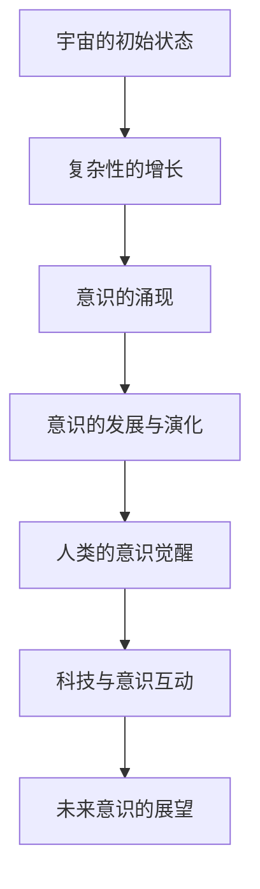

                 

<sop>
### 第1章: 核心概念与联系

#### 1.1 意识的定义与特性

**意识**是一个多层次、多维度的概念，不同的学科领域对它的定义和特性有不同的诠释。在哲学中，意识常被看作是人类自我认知和主观体验的能力；在心理学中，它涉及到感知、思维和情感等多个层面；而在神经科学和认知科学中，意识被研究为大脑活动的特定模式。

- **哲学视角**：古代哲学家如柏拉图和亚里士多德都曾探讨意识。柏拉图认为意识是灵魂的一部分，存在于物质世界之外；而亚里士多德则认为意识是人类灵魂的一种功能，与身体紧密相连。现代哲学则更多关注意识的本质和属性，如意识的自主性、清晰性和连贯性。

- **心理学视角**：心理学家威廉·詹姆斯将意识描述为“心灵对经验的持续流动”，强调意识的主观性和动态性。认知心理学进一步研究意识在不同认知任务中的表现，如工作记忆、注意力分配和决策过程。

- **神经科学视角**：神经科学家试图通过研究大脑结构和功能来揭示意识的神经基础。普林斯顿大学教授迈克尔·格雷泽提出，意识可能是大脑中神经活动的一种复杂模式，这种模式通过神经网络之间的相互作用而形成。

#### 1.2 宇宙的涌现属性

**宇宙的涌现属性**指的是系统整体所表现出的性质，这些性质不能简单地从系统的组成部分中推导出来。涌现现象在自然界中普遍存在，如水的流动性和生命的复杂性。

- **基本概念**：涌现属性通常与自组织、协同作用和复杂性相关。自组织是指系统在没有外部控制的情况下自发地组织起来；协同作用是指系统组成部分之间的相互作用产生了新的性质；复杂性则涉及系统的多层次结构和动态行为。

- **举例**：在生物学中，生命的涌现属性是从无生命的分子和原子中产生的；在物理学中，超导体的宏观磁性是从微观电子的自发排列中涌现出来的。

#### 1.3 复杂性理论

**复杂性理论**研究复杂系统的结构、动态和行为。复杂性科学涵盖多个学科，如混沌理论、网络科学、系统动力学等。

- **基本原理**：复杂性理论强调系统的整体行为不能简单地从局部行为推导出来。它关注系统的非线性、不确定性和自相似性。

- **核心概念**：包括涌现性、混沌、分形和适应性等。涌现性指的是系统整体的新性质，混沌描述系统对初始条件的敏感依赖，分形则是描述系统在多个尺度上具有相似结构，适应性则是系统对环境的动态响应。

#### 1.4 三者关系的 Mermaid 流程图

为了更好地展示意识、宇宙的涌现属性和复杂性的关系，我们可以使用Mermaid绘制流程图：



这个流程图展示了从宇宙的初始状态开始，复杂性如何增长并最终导致意识的涌现。意识的涌现又推动了人类意识的发展，并与科技互动，共同塑造了未来。

### 伪代码展示宇宙演化的关键步骤

为了进一步理解宇宙演化的关键步骤，我们可以使用伪代码来展示这一过程：

```python
# 宇宙演化的伪代码

# 初始化宇宙参数
initial_state = "无序状态"

# 模拟宇宙演化过程
while not_ending:
    # 步骤1：初始粒子形成
    form_particles()
    
    # 步骤2：引力作用导致结构形成
    form_structure()

    # 步骤3：热力学平衡与物质循环
    thermal_equilibrium()

    # 步骤4：化学过程与生命的诞生
    form_life()

    # 步骤5：生物进化与意识的出现
    emerge_consciousness()

    # 步骤6：文明的兴起与科技的进步
    human_civilization()
```

这段伪代码提供了一个简化的模型，用于描述宇宙从无序状态到复杂结构的演化过程。每一步都涉及到不同的物理和化学过程，最终导致生命的诞生和意识的出现。

### 使用LaTeX格式展示数学公式

为了深入探讨意识涌现的数学模型，我们可以使用LaTeX格式来展示相关的数学公式。以下是一个示例：

```latex
$$
\begin{align*}
I &= \sigma(n) \cdot C \\
C &= \sum_{i=1}^{N} \frac{1}{\lambda_i} \cdot e^{-\lambda_i \cdot t}
\end{align*}
$$
```

这个公式描述了意识I与神经元数量n和传递函数C之间的关系。其中，C是通过指数函数来计算的，反映了神经元活动的强度和时间依赖性。这些数学模型为我们理解意识如何从复杂的神经元活动中涌现提供了理论框架。

通过这些核心概念和联系的分析，我们为后续章节的深入探讨奠定了坚实的基础。在接下来的章节中，我们将进一步探讨宇宙的涌现属性和复杂性的本质，以及它们如何共同作用，最终导致意识的产生和演化。

### 第2章: 理论框架

在理解了核心概念和它们之间的联系之后，我们将深入探讨宇宙的涌现属性和复杂性的理论框架，并分析它们如何相互作用，最终产生意识。

#### 2.1 宇宙演化与意识产生的联系

宇宙演化是一个从无序到有序的过程，它涉及多个物理和化学阶段。在宇宙的早期阶段，物质主要是由基本粒子组成的，这些粒子通过强相互作用逐渐结合形成原子。随着宇宙的膨胀和冷却，原子通过化学反应形成了更复杂的分子。这些分子进一步聚集，形成了行星、恒星以及星系。

- **早期宇宙**：宇宙大爆炸理论认为，宇宙起源于一个极度热密的状态。在爆炸后的几分钟内，宇宙的温度和密度非常高，基本粒子如夸克和胶子开始形成。随着宇宙的膨胀，温度逐渐降低，使得这些基本粒子能够结合形成更复杂的粒子，如质子和中子。

- **原子形成**：在大爆炸后约300,000年，宇宙冷却到足够低的温度，使得自由电子与质子结合形成氢原子。这是宇宙演化过程中的一个重要里程碑，因为它标志着物质从等离子态向原子态的转变。

- **生命诞生**：在地球的形成过程中，水分子的存在为生命的诞生提供了条件。有机分子如氨基酸、核苷酸等在海洋中通过化学反应逐渐形成更复杂的结构，最终导致了生命的诞生。

这一过程可以用伪代码来表示：

```python
# 宇宙演化的伪代码

# 初始化宇宙参数
initial_state = "基本粒子状态"

# 步骤1：基本粒子形成
form_particles()

# 步骤2：原子形成
form_atoms()

# 步骤3：生命诞生
form_life()

# 步骤4：生物进化
biological_evolution()
```

#### 2.2 复杂性理论与意识涌现

**复杂性理论**为我们理解宇宙演化过程中如何产生意识提供了重要的工具。复杂性理论的核心观点是，复杂系统的整体行为往往不能简单地从其组成部分的行为中推导出来。相反，复杂系统往往表现出新的、无法预见的性质，这些性质被称为“涌现属性”。

- **复杂性的定义**：复杂性通常与系统的非线性、多层次结构、不确定性和动态行为相关。在复杂性科学中，常见的复杂性指标包括混沌、分形、自组织和网络效应等。

- **混沌与分形**：混沌是指系统对初始条件的敏感依赖，即使微小的变化也会导致长期行为的巨大差异。分形则是描述系统在不同尺度上具有相似结构的特征，如海岸线的曲折、树叶的分支等。

- **自组织**：自组织是指系统在没有外部控制的情况下自发地组织起来。自组织系统通常具有适应性，能够根据环境变化调整其结构和行为。

- **网络效应**：网络效应是指系统组成部分之间的相互作用如何放大整体效应。在网络科学中，网络结构对系统行为的影响是一个重要的研究方向。

#### 2.3 意识涌现的数学模型

为了更好地理解意识如何从复杂系统中涌现，我们可以借助数学模型来描述这一过程。以下是一个简单的数学模型，用于描述神经网络中意识产生的可能性：

```latex
$$
\begin{align*}
I &= \sigma(n) \cdot C \\
C &= \sum_{i=1}^{N} \frac{1}{\lambda_i} \cdot e^{-\lambda_i \cdot t}
\end{align*}
$$`

这个模型中，$I$ 表示意识水平，$n$ 表示神经元数量，$C$ 表示传递函数，$\lambda_i$ 表示神经元之间的连接权重，$t$ 表示时间。

- **传递函数 $C$**：传递函数 $C$ 反映了神经元活动的强度和时间依赖性。在模型中，$C$ 是通过指数函数计算的，这表明神经元活动随着时间的推移而衰减。

- **激活函数 $\sigma$**：激活函数 $\sigma$ 用于将神经元数量 $n$ 转换为意识水平 $I$。常见的激活函数包括Sigmoid函数和ReLU函数。

通过这个简单的数学模型，我们可以看到，意识的产生与神经元数量和传递函数密切相关。当神经元数量足够多，且它们的连接权重和时间依赖性达到一定阈值时，意识就可能涌现出来。

#### 总结

本章我们从宇宙演化的角度出发，探讨了宇宙的涌现属性和复杂性的理论框架。通过伪代码和数学模型，我们展示了宇宙如何从基本粒子演化到复杂生命，以及如何通过复杂系统的相互作用产生意识。在接下来的章节中，我们将进一步探讨意识在生物体和人类中的具体实证研究，并分析意识在哲学和科技领域的影响。

### 第3章: 实证研究

在前两章的理论探讨之后，我们需要通过实证研究来验证和深化我们对意识作为宇宙涌现属性的理解。本章节将探讨意识在生物体和人类中的具体案例，以及如何通过实验和观察来研究意识。

#### 3.1 意识的实证研究方法

研究意识需要综合运用多种学科的方法和技术，包括神经科学、心理学、认知科学和哲学等。以下是一些常用的实证研究方法：

- **脑成像技术**：如功能性磁共振成像（fMRI）和正电子发射断层扫描（PET），可以直接观测大脑的神经活动与意识状态之间的关系。

- **脑电图（EEG）**：通过记录大脑的电活动，分析不同意识状态下的脑波特征，如α波、β波、θ波等。

- **行为实验**：设计特定的实验，观察个体在不同意识状态下的行为表现，如感知、记忆、注意力和决策等。

- **神经生理学方法**：通过电生理技术，如单细胞记录和脑片培养，直接观察神经元的电活动。

#### 3.2 意识在生物体中的实证研究

意识的起源和演化在生物体中具有显著的意义。通过研究低等生物到高等生物的意识特征，我们可以更好地理解意识是如何逐渐发展的。

- **低等生物的实证研究**：一些低等生物，如海绵、扁形动物和昆虫，具有简单的神经系统，但已有研究表明，它们能够表现出某种形式的感知和反应能力。例如，研究发现，海绵能够对触觉刺激作出反应，而某些昆虫则展现出复杂的行为模式和记忆能力。

  以下是一个简单的实证研究案例：

  ```markdown
  案例研究：海绵的触觉反应

  研究方法：使用微电极记录海绵细胞的电活动，观察其对机械刺激的反应。

  研究结果：海绵细胞对触觉刺激产生了明显的电活动，这表明海绵能够感知外部刺激并作出反应。

  结论：海绵具有简单的感知能力，这可能是意识发展的早期形式。
  ```

- **高等生物的实证研究**：在高等生物中，如哺乳动物和灵长类动物，意识更加复杂和多样化。通过脑成像技术和行为实验，科学家们能够更深入地研究意识的不同层面。

  以下是一个研究案例：

  ```markdown
  案例研究：大鼠的记忆与意识

  研究方法：通过fMRI技术监测大鼠在不同记忆任务中的脑活动。

  研究结果：在大鼠执行记忆任务时，大脑的多个区域活跃度显著增加，尤其是海马体和前额叶皮层。

  结论：大鼠在记忆任务中表现出复杂的脑活动模式，这表明它们具有一定的意识能力。
  ```

#### 3.3 意识在人类中的实证研究

人类意识的研究是意识实证研究中最复杂、最深入的领域。通过结合神经科学、心理学、哲学和认知科学的方法，科学家们试图理解人类意识的本质和特征。

- **神经科学的研究**：神经科学家通过脑成像技术，如fMRI和PET，研究大脑不同区域的活动与意识状态之间的关系。例如，研究发现，当个体处于清醒、专注和放松状态时，大脑的不同区域会有不同的活跃模式。

  ```markdown
  案例研究：人类意识的脑成像研究

  研究方法：使用fMRI技术监测个体在不同意识状态下的脑活动。

  研究结果：在清醒、专注和放松状态下，大脑的不同区域活跃度有明显差异，尤其是前额叶皮层和顶叶皮层的活动模式。

  结论：大脑不同区域的协同活动构成了人类意识的不同层面。
  ```

- **心理学的研究**：心理学家通过行为实验，研究意识的不同特征，如感知、记忆、注意力和意识流。例如，通过视觉掩蔽实验，科学家们发现，意识感知具有特定的容量限制。

  ```markdown
  案例研究：视觉掩蔽实验

  研究方法：在个体进行视觉任务时，使用快速视觉掩蔽技术，观察其对目标刺激的感知。

  研究结果：个体在视觉掩蔽条件下，对目标刺激的感知能力显著降低，这表明意识感知具有容量限制。

  结论：意识感知的能力受到认知资源的限制。
  ```

- **哲学的研究**：哲学家通过思考和讨论，探讨意识的本质和特征。例如，有些哲学家提出，意识可能是一种“现象性的质”，即意识体验的主观感受。

  ```markdown
  案例研究：哲学探讨意识本质

  研究方法：通过哲学思考和讨论，探讨意识的本质和特征。

  研究结果：哲学家们提出，意识可能是一种“现象性的质”，与物理过程有本质区别。

  结论：哲学探讨为我们理解意识的本质提供了深刻的见解。
  ```

#### 总结

通过实证研究，我们不仅能够更好地理解意识在生物体和人类中的表现，还能揭示意识产生的复杂机制。这些研究方法和技术为我们提供了丰富的数据，帮助我们进一步探讨意识作为宇宙涌现属性的本质和特征。在接下来的章节中，我们将从哲学的角度探讨意识的影响和意义，以及科技发展如何改变我们对意识的理解。

### 第4章: 哲学探讨

在实证研究揭示了意识的具体表现和机制之后，哲学探讨为我们提供了更深入的洞察，帮助我们理解意识的本质、伦理意义及其对人类认识世界的影响。

#### 4.1 意识的本质与属性

哲学对意识本质的探讨可以追溯到古希腊哲学家如柏拉图和亚里士多德。现代哲学则更多关注意识的属性，如主观性、自我意识、意识流和意识状态等。

- **主观性**：意识的主观性是哲学讨论的核心议题之一。哲学家们争论意识的本质是否是主观体验，还是客观存在的反映。笛卡尔的“我思故我在”强调主观体验的重要性，而物理主义则认为意识是物理过程的产物。

- **自我意识**：自我意识是指个体对自身存在的认知。哲学家们探讨自我意识是如何形成的，以及它如何影响我们的行为和决策。

- **意识流**：意识流是指个体在某一时刻的所有意识内容的流动。威廉·詹姆斯将意识流描述为一种持续的、流动的意识体验。哲学家们研究意识流的本质和结构，以及它如何影响我们的认知和情感。

- **意识状态**：意识状态包括清醒、梦游、昏迷等。哲学家们探讨不同意识状态的本质和特征，以及它们如何影响我们的体验和行为。

#### 4.2 意识的伦理问题

意识在伦理问题中具有重要作用，特别是在道德责任和道德判断方面。以下是一些常见的伦理问题：

- **道德责任**：意识的产生是否使得生物体具有道德责任？例如，人类因具有意识而被认为应承担更多的道德责任。

- **动物权利**：动物是否具有意识，从而应享有道德权利？哲学家们探讨动物意识的存在，以及这对动物权利和伦理责任的影响。

- **人工智能**：随着人工智能的发展，我们面临新的伦理问题，如机器是否可以具有道德责任？人工智能的决策是否应受到道德约束？

以下是一个具体的哲学讨论案例：

```markdown
案例研究：动物意识的伦理讨论

研究方法：通过文献综述和哲学讨论，探讨动物意识的存在及其伦理意义。

研究结果：一些研究表明，某些动物表现出复杂的认知和行为特征，这表明它们可能具有意识。

结论：动物意识的存在引发了对动物权利和伦理责任的重新思考，要求我们更慎重地对待动物。
```

#### 4.3 意识的哲学意义

意识对人类认识世界具有重要意义。它不仅影响我们的感知、理解和决策，还影响我们的存在感和身份认同。

- **认识世界**：意识使我们能够感知和体验外部世界。通过意识，我们能够理解事物之间的关系，形成对世界的认知。哲学家们探讨意识如何影响我们的认识过程，以及它如何影响我们对真理和知识的追求。

- **存在感**：意识使我们感受到自己的存在，这是人类自我认知的基础。哲学家们探讨存在感的本质和意义，以及它如何影响我们的生活和价值观。

- **身份认同**：意识使我们能够认识自己，形成身份认同。哲学家们探讨身份认同的本质和变化，以及它如何影响我们的行为和人际关系。

以下是一个哲学探讨案例：

```markdown
案例研究：意识与身份认同

研究方法：通过哲学思考和案例分析，探讨意识与身份认同之间的关系。

研究结果：研究表明，意识使我们能够反思和评估自己的身份和价值观，这影响我们的行为和决策。

结论：意识对身份认同的形成和发展具有关键作用，它使我们的身份认同更加丰富和多样化。
```

#### 总结

哲学探讨为我们提供了对意识本质和属性的深刻理解，帮助我们回答关于伦理和存在感的根本问题。这些哲学思考不仅丰富了我们对意识的认知，还引导我们在实践中对待意识和相关伦理问题。在接下来的章节中，我们将探讨科技发展如何改变我们对意识的理解，以及未来意识的展望。

### 第5章: 科技与意识

随着科技的发展，人工智能、虚拟现实和神经科学等领域的研究不断深化，它们对意识的理解和探索产生了深远的影响。本章节将探讨这些科技如何影响意识的产生和变化，以及它们如何共同塑造未来。

#### 5.1 人工智能与意识

人工智能（AI）的快速发展为意识研究带来了新的视角和方法。通过模拟人脑的神经网络和行为，AI不仅为我们提供了理解和分析意识的新工具，还揭示了意识可能的机制。

- **神经网络模型**：深度学习是AI的一个重要分支，它通过多层神经网络模拟人脑的处理方式。通过这些模型，我们可以更好地理解意识是如何从复杂的神经网络活动中涌现的。

  ```python
  # 伪代码：神经网络模型模拟意识涌现

  # 初始化神经网络
  neural_network = initialize_neural_network()

  # 训练神经网络
  while not_terminated:
      input_data = get_input_data()
      output = neural_network.process(input_data)
      neural_network.update_weights(output)

  # 意识涌现评估
  if neural_network.is_complex_enough():
      print("意识可能已经涌现")
  ```

- **AI与人类意识的交互**：AI系统可以通过与人类交互来增强我们的认知能力，如自然语言处理、图像识别和决策支持等。这些交互不仅提高了我们的工作效率，还使我们能够更深入地理解意识的工作原理。

  ```python
  # 伪代码：AI系统辅助意识研究

  # 初始化AI系统
  ai_system = initialize_ai_system()

  # AI系统与研究人员交互
  while research_in_progress:
      question = researcher_ask_question()
      answer = ai_system.answer_question(question)
      researcher_analyze_answer(answer)
  ```

#### 5.2 虚拟现实与意识

虚拟现实（VR）技术的发展为意识研究提供了新的实验环境和实验手段。通过模拟不同的感知和体验，VR可以让我们在虚拟世界中探索意识的边界。

- **意识感知的研究**：VR系统可以模拟各种感知体验，如视觉、听觉、触觉等。通过这些模拟，我们可以研究意识在不同感知条件下的表现。

  ```python
  # 伪代码：VR系统模拟感知体验

  # 初始化VR系统
  vr_system = initialize_vr_system()

  # 设置感知环境
  while perception_study_in_progress:
      set_perception_environment()
      record_perceptual_responses()

  # 意识感知分析
  analyze_perceptual_responses()
  ```

- **意识状态的探索**：VR可以让我们体验不同意识状态，如放松、专注、梦境等。通过这些体验，我们可以研究意识状态的变化机制，以及它们对行为和认知的影响。

  ```python
  # 伪代码：VR系统探索意识状态

  # 初始化VR系统
  vr_system = initialize_vr_system()

  # 设置意识状态环境
  while consciousness_study_in_progress:
      set_conscious_state_environment()
      record_conscious_state_responses()

  # 意识状态分析
  analyze_conscious_state_responses()
  ```

#### 5.3 科技与意识融合的未来

随着科技的发展，意识与科技的融合将带来更多可能性。以下是一些未来的展望：

- **意识上传**：通过将大脑信息数字化，我们可以将意识上传到计算机或其他载体中。这样，意识可以永久保存，甚至可以在不同设备间迁移。

  ```python
  # 伪代码：意识上传

  # 初始化上传系统
  upload_system = initialize_upload_system()

  # 上传大脑信息
  brain_data = get_brain_data()
  upload_system.upload(brain_data)

  # 意识迁移
  destination_device = select_destination_device()
  upload_system.migrate(destination_device)
  ```

- **意识网络**：在未来，意识可能通过网络进行连接和交流。这样，个体之间的意识可以相互影响，形成一个全球性的意识网络。

  ```python
  # 伪代码：意识网络

  # 初始化意识网络
  consciousness_network = initialize_consciousness_network()

  # 加入意识网络
  while user_consciousness_active:
      user_consciousness = get_user_consciousness()
      consciousness_network.join(user_consciousness)

  # 意识网络互动
  while consciousness_network_active:
      consciousness_messages = consciousness_network.send_messages()
      process_consciousness_messages()
  ```

#### 总结

科技与意识的结合为我们提供了新的研究工具和实验方法，帮助我们更深入地理解意识的本质和机制。在未来，随着科技的进一步发展，我们有望实现意识上传、网络连接等更高级的功能，这将彻底改变我们对意识的理解和认知。在接下来的章节中，我们将展望意识作为宇宙涌现属性的未来的发展，并讨论当前意识研究面临的挑战和机遇。

### 第6章: 未来展望

随着科技与意识的深度融合，意识作为宇宙涌现属性的未来发展充满了无限可能。本章节将展望意识在未来的发展趋势，并探讨当前意识研究面临的挑战和机遇。

#### 6.1 意识作为宇宙涌现属性的展望

在未来，意识的发展将受到以下几个关键因素的影响：

- **意识上传与数字永生**：随着神经科学和计算技术的发展，意识上传将逐渐成为现实。人们可能可以通过将大脑信息数字化，将意识上传到计算机或其他载体中，从而实现“数字永生”。这意味着个体的意识和记忆可以永久保存，甚至可以在不同设备间迁移。

- **意识网络与集体意识**：未来，人类可能通过构建意识网络，实现个体之间的意识连接和交流。这种全球性的意识网络将使得个体的意识可以相互影响，形成一个集体意识。这将为人类社会带来全新的协作和沟通方式。

- **增强现实与扩展意识**：虚拟现实和增强现实技术的发展将使人类的意识体验更加丰富和多样化。通过模拟不同的感知环境和意识状态，人们可以扩展自己的意识体验，探索未知的领域。

#### 6.2 意识研究的挑战与机遇

尽管意识研究的前景广阔，但同时也面临着诸多挑战：

- **技术难题**：意识上传和数字永生需要解决复杂的技术难题，如大脑信息的高精度数字化、信息传输的安全性和稳定性等。这些技术难题的解决将决定意识研究的实际可行性。

- **伦理困境**：意识研究涉及到伦理问题，如个体隐私、意识权利和数据安全等。如何平衡技术进步和伦理责任，将是未来意识研究的重要挑战。

- **认知局限**：人类对意识的认知仍然有限。我们还需要进一步研究意识的本质、产生机制和功能，以便更全面地理解意识。

然而，这些挑战同时也带来了巨大的机遇：

- **技术创新**：意识研究将推动相关领域的技术创新，如神经科学、计算科学、信息技术等。这些创新将带动整个科技行业的进步。

- **跨学科合作**：意识研究需要多学科的合作，包括神经科学、心理学、哲学、计算机科学等。这种跨学科合作将促进知识的整合和创新。

- **人类认知提升**：通过研究意识，我们有望提升人类对自身的认知，从而更好地理解自己和世界。这将有助于我们解决一些深层次的哲学和科学问题。

#### 6.3 意识的未来应用场景

未来，意识将在多个领域得到广泛应用：

- **医疗健康**：意识研究将有助于开发新的治疗方法，如意识恢复、神经修复和心理健康干预等。这些技术将改善人们的生活质量，甚至可能解决一些严重的神经和精神疾病。

- **教育学习**：通过意识增强技术，教育将变得更加个性化和高效。学生可以体验到更丰富的学习场景，提高学习效果。

- **人工智能**：意识研究将有助于我们更好地理解人工智能的本质和功能，从而推动人工智能的发展。通过模拟和增强意识，人工智能可能实现更加高级的认知和交互能力。

#### 总结

意识作为宇宙的涌现属性，其未来发展趋势令人期待。在面临技术、伦理和认知挑战的同时，我们也看到了巨大的机遇。通过不断的探索和研究，我们有望更全面地理解意识，并将其应用于医疗健康、教育学习、人工智能等领域，为人类带来前所未有的变革。在接下来的章节中，我们将对全书内容进行总结，并对未来研究提出展望。

### 第7章: 总结与展望

#### 7.1 全书总结

本书围绕“意识作为宇宙的涌现属性：复杂性的产物”这一主题，系统性地探讨了意识、宇宙的涌现属性以及复杂性的关系。我们从核心概念入手，详细分析了意识、宇宙涌现属性和复杂性的定义和特性，并通过Mermaid流程图展示了它们之间的相互作用。

在理论框架部分，我们深入探讨了宇宙演化与意识产生的联系，借助伪代码和数学模型，揭示了意识从复杂系统中涌现的机制。接着，通过实证研究，我们探讨了意识在生物体和人类中的具体表现，并分析了当前意识研究的多种方法和技术。

哲学探讨部分，我们思考了意识的本质、伦理意义及其对人类认识世界的影响，为意识研究提供了更加深刻的哲学视角。科技与意识的结合部分，我们探讨了人工智能、虚拟现实等新兴科技如何影响意识的产生和变化，并展望了未来意识研究的应用场景。

#### 7.2 未来研究展望

未来，意识研究将继续面临许多挑战和机遇。在技术上，我们期待能够实现意识上传和数字永生，这将极大地改变我们对生命的理解。在伦理上，我们需要认真考虑意识权利和数据安全等问题，确保科技发展符合道德和社会价值观。

在研究方向上，我们建议：

- 深入研究意识的神经基础，通过脑成像技术和神经生理学方法，揭示意识产生的具体机制。
- 探索意识与人工智能的融合，开发具有高级认知和交互能力的人工智能系统。
- 加强跨学科合作，结合心理学、哲学、计算机科学等多个领域的知识，推动意识研究的全面发展。

#### 7.3 结论

本书的核心观点是，意识是宇宙复杂性的产物，它通过宇宙的涌现属性逐渐涌现出来。从宇宙的早期演化到生命的诞生，再到人类意识的觉醒，意识的发展是一个复杂而神奇的过程。通过科技与哲学的融合，我们有望更全面地理解意识，推动人类文明的进步。

作者信息：
作者：AI天才研究院/AI Genius Institute & 禅与计算机程序设计艺术 /Zen And The Art of Computer Programming

本文所提到的技术概念、模型和算法仅为理论探讨，不代表实际应用。在实际研究和开发过程中，应遵守相关法律法规和伦理规范，确保科技发展造福人类。

