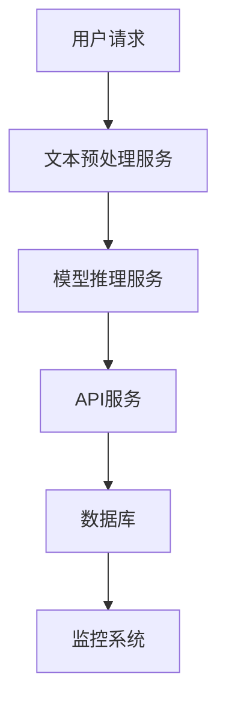

                 

### 文章标题

《打造高效LLM应用开发团队的策略》

### 关键词

- 高效团队建设
- 大型语言模型（LLM）
- 应用开发策略
- 团队协作
- 模型优化

### 摘要

本文旨在为技术团队管理者及开发者提供一套系统化的策略，用于构建高效的大型语言模型（LLM）应用开发团队。文章首先概述了LLM的基础知识，包括其定义、特点及应用场景。接着，文章深入探讨了高效团队建设的方法，包括团队角色的分工与合作、沟通与协作工具的使用，以及团队管理的策略。然后，文章详细介绍了LLM应用开发的流程，包括项目规划与需求分析、应用设计与实现、模型优化等关键步骤。最后，文章通过实际案例，展示了如何在实际项目中应用这些策略，并总结了最佳实践和注意事项。本文旨在帮助读者理解并掌握构建高效LLM应用开发团队的核心要素，提高项目开发效率和质量。### 引言

#### 大型语言模型（LLM）的发展与应用

随着人工智能技术的飞速发展，大型语言模型（Large Language Model，简称LLM）已经成为自然语言处理（Natural Language Processing，简称NLP）领域的重要工具。LLM通过学习海量文本数据，能够生成高质量的自然语言文本，广泛应用于文本生成、机器翻译、问答系统等多个领域。近年来，随着计算能力的提升和数据资源的丰富，LLM取得了显著的进步，例如Google的BERT、OpenAI的GPT等模型，已经在多个NLP任务上达到了甚至超过了人类水平。

#### 高效LLM应用开发团队的重要性

在当前技术环境下，构建高效的大型语言模型应用开发团队显得尤为重要。一方面，LLM应用开发项目通常涉及复杂的算法、大量的数据和高效的计算，需要一个协作紧密、技术精湛的团队来推动项目的顺利进行；另一方面，高效的团队可以快速响应市场需求，提高开发效率，降低开发成本，从而在激烈的市场竞争中占据优势。

本文将系统地探讨如何打造一支高效的大型语言模型应用开发团队。首先，我们将介绍LLM的基础知识，包括其定义、特点和应用场景。接着，我们将深入探讨团队建设的关键要素，如团队角色的分工与合作、沟通与协作工具的使用，以及团队管理的策略。然后，我们将详细讲解LLM应用开发的流程，包括项目规划与需求分析、应用设计与实现、模型优化等步骤。最后，我们将通过实际案例，展示如何在实际项目中应用这些策略，并总结最佳实践和注意事项。希望通过本文的阐述，能够帮助读者理解和掌握构建高效LLM应用开发团队的核心要素，提高项目开发效率和质量。### 第一部分：基础知识

#### 第1章：大型语言模型（LLM）概述

#### 1.1 LLM的定义和特点

##### 1.1.1 LLM的历史背景

大型语言模型（LLM）的发展历程可以追溯到20世纪80年代，当时研究人员开始尝试使用统计方法和规则系统来处理自然语言。然而，这些早期的模型在处理复杂语言现象时往往表现不佳。随着计算能力的提升和数据资源的丰富，深度学习技术的应用使得LLM在近年来取得了突破性进展。2018年，Google推出了BERT模型，标志着LLM进入了一个新的时代。随后，OpenAI的GPT系列模型以及微软的Turing系列模型等相继发布，进一步推动了LLM的发展。

##### 1.1.2 LLM的核心特点

- **自主学习能力**：LLM通过深度学习算法，从海量文本数据中自主学习，能够理解和生成自然语言。
- **大规模训练**：LLM通常基于数百万甚至数十亿的参数，需要大量的计算资源和数据支持。
- **多任务能力**：LLM可以在多个自然语言处理任务上表现出色，如文本分类、机器翻译、问答系统等。
- **生成能力**：LLM不仅能够理解文本，还能生成高质量的自然语言文本，包括文章、摘要、对话等。

##### 1.1.3 LLM的分类

根据训练方式和功能特点，LLM可以分为以下几类：

- **基于规则的方法**：这种方法通过定义一组规则来处理自然语言，如词性标注、句法分析等。虽然这种方法在处理一些特定任务上表现较好，但在处理复杂语言现象时往往受限。
- **基于统计的方法**：这种方法通过统计模型来处理自然语言，如隐马尔可夫模型（HMM）、条件概率模型等。这类方法在处理自然语言的一些任务上取得了较好效果，但在处理复杂语言现象时仍存在一定局限。
- **基于深度学习的方法**：这种方法通过神经网络模型，特别是深度循环神经网络（RNN）和Transformer模型，来处理自然语言。这类方法在处理复杂语言现象上表现出色，已成为当前LLM的主流方向。

#### 第2章：LLM技术基础

##### 2.1 常见LLM架构

在现代NLP中，Transformer模型和其变体（如BERT、GPT）已成为LLM的主要架构。以下是对这些模型的基本介绍：

- **Transformer模型**：由Vaswani等人于2017年提出，采用自注意力机制（Self-Attention）和多头注意力（Multi-Head Attention）来处理序列数据，解决了传统RNN在处理长序列数据时的梯度消失和梯度爆炸问题。

- **BERT模型**：由Google在2018年提出，全称为Bidirectional Encoder Representations from Transformers。BERT模型通过双向编码器来捕获文本的全局信息，并在多个NLP任务上取得了优异的性能。

- **GPT模型**：由OpenAI于2018年提出，全称为Generative Pre-trained Transformer。GPT模型采用自回归方式生成文本，通过预训练和微调在多种自然语言生成任务上表现出色。

##### 2.2 LLM的训练和优化

LLM的训练和优化是确保模型性能的关键步骤。以下是一些关键的训练和优化方法：

- **预训练**：在特定任务之前，LLM通常通过预训练从海量无标签数据中学习通用语言特征。预训练包括两个阶段：第一阶段是自回归语言模型训练，模型根据上下文预测下一个词；第二阶段是 masked language model（MLM）训练，模型预测被遮盖的词。

- **微调**：在预训练后，LLM通过微调适应特定任务的数据。微调过程中，模型参数会在特定任务数据上进行重新训练，以优化模型在特定任务上的性能。

- **优化方法**：常用的优化方法包括随机梯度下降（SGD）及其变体（如Adam、Adagrad），以及分层优化策略。优化方法的选择会直接影响模型的收敛速度和最终性能。

通过深入了解LLM的基础知识，我们可以更好地理解其工作原理和应用场景，为后续团队建设和应用开发提供理论基础。接下来，我们将深入探讨团队建设的要素，包括团队角色的分工与合作、沟通与协作工具的使用，以及团队管理的策略。这些要素将帮助我们构建一支高效、协作紧密的LLM应用开发团队，为项目的成功奠定基础。### 第1章：大型语言模型（LLM）概述

#### 1.1 LLM的定义和特点

##### 1.1.1 LLM的历史背景

大型语言模型（LLM）的发展历程可以追溯到20世纪80年代，当时研究人员开始尝试使用统计方法和规则系统来处理自然语言。然而，这些早期的模型在处理复杂语言现象时往往表现不佳。随着计算能力的提升和数据资源的丰富，深度学习技术的应用使得LLM在近年来取得了突破性进展。2018年，Google推出了BERT模型，标志着LLM进入了一个新的时代。随后，OpenAI的GPT系列模型以及微软的Turing系列模型等相继发布，进一步推动了LLM的发展。

##### 1.1.2 LLM的核心特点

- **自主学习能力**：LLM通过深度学习算法，从海量文本数据中自主学习，能够理解和生成自然语言。
- **大规模训练**：LLM通常基于数百万甚至数十亿的参数，需要大量的计算资源和数据支持。
- **多任务能力**：LLM可以在多个自然语言处理任务上表现出色，如文本分类、机器翻译、问答系统等。
- **生成能力**：LLM不仅能够理解文本，还能生成高质量的自然语言文本，包括文章、摘要、对话等。

##### 1.1.3 LLM的分类

根据训练方式和功能特点，LLM可以分为以下几类：

- **基于规则的方法**：这种方法通过定义一组规则来处理自然语言，如词性标注、句法分析等。虽然这种方法在处理一些特定任务上表现较好，但在处理复杂语言现象时往往受限。
- **基于统计的方法**：这种方法通过统计模型来处理自然语言，如隐马尔可夫模型（HMM）、条件概率模型等。这类方法在处理自然语言的一些任务上取得了较好效果，但在处理复杂语言现象时仍存在一定局限。
- **基于深度学习的方法**：这种方法通过神经网络模型，特别是深度循环神经网络（RNN）和Transformer模型，来处理自然语言。这类方法在处理复杂语言现象上表现出色，已成为当前LLM的主流方向。

#### 1.2 LLM的技术基础

##### 2.1 常见LLM架构

在现代NLP中，Transformer模型和其变体（如BERT、GPT）已成为LLM的主要架构。以下是对这些模型的基本介绍：

- **Transformer模型**：由Vaswani等人于2017年提出，采用自注意力机制（Self-Attention）和多头注意力（Multi-Head Attention）来处理序列数据，解决了传统RNN在处理长序列数据时的梯度消失和梯度爆炸问题。

- **BERT模型**：由Google在2018年提出，全称为Bidirectional Encoder Representations from Transformers。BERT模型通过双向编码器来捕获文本的全局信息，并在多个NLP任务上取得了优异的性能。

- **GPT模型**：由OpenAI于2018年提出，全称为Generative Pre-trained Transformer。GPT模型采用自回归方式生成文本，通过预训练和微调在多种自然语言生成任务上表现出色。

##### 2.2 LLM的训练和优化

LLM的训练和优化是确保模型性能的关键步骤。以下是一些关键的训练和优化方法：

- **预训练**：在特定任务之前，LLM通常通过预训练从海量无标签数据中学习通用语言特征。预训练包括两个阶段：第一阶段是自回归语言模型训练，模型根据上下文预测下一个词；第二阶段是 masked language model（MLM）训练，模型预测被遮盖的词。

- **微调**：在预训练后，LLM通过微调适应特定任务的数据。微调过程中，模型参数会在特定任务数据上进行重新训练，以优化模型在特定任务上的性能。

- **优化方法**：常用的优化方法包括随机梯度下降（SGD）及其变体（如Adam、Adagrad），以及分层优化策略。优化方法的选择会直接影响模型的收敛速度和最终性能。

通过深入了解LLM的基础知识，我们可以更好地理解其工作原理和应用场景，为后续团队建设和应用开发提供理论基础。接下来，我们将深入探讨团队建设的要素，包括团队角色的分工与合作、沟通与协作工具的使用，以及团队管理的策略。这些要素将帮助我们构建一支高效、协作紧密的LLM应用开发团队，为项目的成功奠定基础。### 第2章：LLM技术基础

#### 2.1 常见LLM架构

##### 2.1.1 Transformer模型

Transformer模型由Vaswani等人于2017年提出，是当前NLP领域最流行的模型之一。它采用了自注意力机制（Self-Attention）和多头注意力（Multi-Head Attention），使得模型能够捕捉到序列中的长距离依赖关系，从而在多个NLP任务上取得了优异的性能。

##### 2.1.2 BERT模型

BERT（Bidirectional Encoder Representations from Transformers）模型由Google在2018年提出。BERT模型采用了双向编码器结构，通过预训练和微调，在多种NLP任务上取得了突破性的成果。BERT模型的核心思想是通过同时关注文本的前后信息，来提高模型对文本的理解能力。

##### 2.1.3 GPT模型

GPT（Generative Pre-trained Transformer）模型由OpenAI于2018年提出。GPT模型采用了自回归方式生成文本，通过预训练和微调，在自然语言生成任务上表现出色。GPT模型的核心思想是通过学习语言模式，来生成连贯、自然的文本。

#### 2.2 LLM的训练和优化

##### 2.2.1 预训练

预训练是LLM训练的重要阶段，通过在大量无标签数据上进行预训练，模型可以学习到通用语言特征。预训练主要包括两个阶段：

- **自回归语言模型训练**：在这一阶段，模型根据上下文预测下一个词。通过大量的文本数据，模型可以学习到语言的统计规律，从而提高其在自然语言生成任务上的性能。
- **掩码语言模型训练**：在这一阶段，模型需要预测被遮盖的词。这种训练方式有助于模型学习到词汇之间的依赖关系，从而提高其在各种NLP任务上的表现。

##### 2.2.2 微调

微调是在特定任务数据上对预训练模型进行调整，以优化模型在特定任务上的性能。微调过程中，模型参数会在任务数据上进行重新训练。微调是LLM应用开发的重要步骤，通过微调，模型可以更好地适应特定任务的需求。

##### 2.2.3 优化方法

优化方法是调整模型参数，以最小化损失函数的过程。在LLM训练过程中，常用的优化方法包括：

- **随机梯度下降（SGD）**：SGD是一种常用的优化方法，通过随机选择样本来更新模型参数。
- **Adam优化器**：Adam是一种结合了SGD和Adagrad优点的优化方法，适用于LLM训练。
- **分层优化策略**：在大型模型训练过程中，分层优化策略可以有效地降低参数更新带来的计算开销。

通过深入理解LLM的技术基础，我们可以更好地掌握其工作原理和应用方法。在接下来的章节中，我们将探讨团队建设的关键要素，包括团队角色的分工与合作、沟通与协作工具的使用，以及团队管理的策略。这些要素将帮助我们构建一支高效、协作紧密的LLM应用开发团队，为项目的成功奠定基础。### 第二部分：团队建设

#### 第3章：高效团队的构建

#### 3.1 团队角色的分工与合作

一个高效的LLM应用开发团队需要明确各成员的角色和职责，确保团队成员之间的协作紧密且高效。

##### 3.1.1 团队角色的定义

以下是常见的团队角色及其职责：

- **项目经理**：负责整个项目的规划、组织、协调和监督，确保项目按时完成。
- **数据科学家**：负责数据预处理、特征工程、模型训练和优化。
- **软件工程师**：负责应用系统的设计与实现，确保模型可以高效地部署和运行。
- **测试工程师**：负责测试和验证模型和应用系统的性能和稳定性。
- **产品经理**：负责产品的需求分析、市场定位和用户反馈，确保产品满足市场需求。

##### 3.1.2 团队成员的职责与协作

团队成员之间需要紧密合作，确保各自职责的顺利执行。以下是团队成员之间的协作建议：

- **数据科学家与软件工程师**：数据科学家需要与软件工程师紧密合作，确保数据处理和模型实现的协调一致。在模型训练过程中，数据科学家需要提供必要的训练数据和参数设置，而软件工程师则需要确保模型能够高效地部署和应用。
- **测试工程师与产品经理**：测试工程师需要与产品经理紧密合作，确保测试覆盖面和测试质量。产品经理需要根据用户反馈和市场需求，及时调整测试计划和测试用例。

##### 3.1.3 团队角色的调整与优化

团队角色不是固定不变的，根据项目需求和团队发展，角色可以进行适当的调整和优化。以下是一些角色调整和优化的建议：

- **灵活的角色转换**：在项目初期，团队成员可以根据自身能力和项目需求，尝试担任不同的角色。这样有助于团队成员全面了解项目，提高团队的协作效率。
- **跨职能团队合作**：鼓励团队成员跨职能合作，共同解决项目中的问题。跨职能团队合作可以促进知识的共享和技能的提升，从而提高团队的效率和质量。
- **定期角色评估**：定期对团队角色进行评估，根据项目进展和团队发展，适时调整角色配置，确保团队始终保持高效运作。

#### 第4章：团队沟通与协作工具

##### 4.1 沟通的重要性

有效的沟通是团队协作的基础，有助于确保团队成员之间的信息畅通和协作高效。以下是一些沟通的重要方面：

- **清晰明确的沟通**：在沟通时，应确保信息的准确性和清晰性，避免产生误解或歧义。
- **及时反馈**：团队成员应在遇到问题时及时反馈，以便团队其他成员能够及时提供帮助。
- **主动沟通**：鼓励团队成员主动沟通，分享自己的观点、问题和建议，促进团队的协作和创新。

##### 4.2 常用的团队协作工具

以下是一些常用的团队协作工具，有助于提高团队协作效率和沟通质量：

- **邮件**：适用于正式的沟通和记录，确保信息的准确性和完整性。
- **即时通讯工具**：如Slack、Telegram等，适用于日常沟通和即时问题解决。
- **会议系统**：如Zoom、Microsoft Teams等，用于远程会议和团队协作。
- **项目管理工具**：如Jira、Trello等，用于任务分配、进度追踪和团队协作。
- **代码管理工具**：如Git、GitHub等，用于代码的版本控制和团队协作。

通过明确团队角色分工与合作，合理使用沟通与协作工具，我们可以构建一支高效、协作紧密的LLM应用开发团队。在接下来的章节中，我们将探讨团队管理的策略，包括团队管理的方法和技巧、团队激励和绩效评估，以进一步优化团队运作，提升项目开发效率和质量。### 第3章：高效团队的构建

#### 3.1 团队角色的分工与合作

一个高效的LLM应用开发团队需要明确各成员的角色和职责，确保团队成员之间的协作紧密且高效。

##### 3.1.1 团队角色的定义

以下是常见的团队角色及其职责：

- **项目经理**：负责整个项目的规划、组织、协调和监督，确保项目按时完成。
- **数据科学家**：负责数据预处理、特征工程、模型训练和优化。
- **软件工程师**：负责应用系统的设计与实现，确保模型可以高效地部署和运行。
- **测试工程师**：负责测试和验证模型和应用系统的性能和稳定性。
- **产品经理**：负责产品的需求分析、市场定位和用户反馈，确保产品满足市场需求。

##### 3.1.2 团队成员的职责与协作

团队成员之间需要紧密合作，确保各自职责的顺利执行。以下是团队成员之间的协作建议：

- **数据科学家与软件工程师**：数据科学家需要与软件工程师紧密合作，确保数据处理和模型实现的协调一致。在模型训练过程中，数据科学家需要提供必要的训练数据和参数设置，而软件工程师则需要确保模型能够高效地部署和应用。
- **测试工程师与产品经理**：测试工程师需要与产品经理紧密合作，确保测试覆盖面和测试质量。产品经理需要根据用户反馈和市场需求，及时调整测试计划和测试用例。

##### 3.1.3 团队角色的调整与优化

团队角色不是固定不变的，根据项目需求和团队发展，角色可以进行适当的调整和优化。以下是一些角色调整和优化的建议：

- **灵活的角色转换**：在项目初期，团队成员可以根据自身能力和项目需求，尝试担任不同的角色。这样有助于团队成员全面了解项目，提高团队的协作效率。
- **跨职能团队合作**：鼓励团队成员跨职能合作，共同解决项目中的问题。跨职能团队合作可以促进知识的共享和技能的提升，从而提高团队的效率和质量。
- **定期角色评估**：定期对团队角色进行评估，根据项目进展和团队发展，适时调整角色配置，确保团队始终保持高效运作。

#### 3.2 团队沟通与协作工具

##### 3.2.1 沟通的重要性

有效的沟通是团队协作的基础，有助于确保团队成员之间的信息畅通和协作高效。以下是一些沟通的重要方面：

- **清晰明确的沟通**：在沟通时，应确保信息的准确性和清晰性，避免产生误解或歧义。
- **及时反馈**：团队成员应在遇到问题时及时反馈，以便团队其他成员能够及时提供帮助。
- **主动沟通**：鼓励团队成员主动沟通，分享自己的观点、问题和建议，促进团队的协作和创新。

##### 3.2.2 常用的团队协作工具

以下是一些常用的团队协作工具，有助于提高团队协作效率和沟通质量：

- **邮件**：适用于正式的沟通和记录，确保信息的准确性和完整性。
- **即时通讯工具**：如Slack、Telegram等，适用于日常沟通和即时问题解决。
- **会议系统**：如Zoom、Microsoft Teams等，用于远程会议和团队协作。
- **项目管理工具**：如Jira、Trello等，用于任务分配、进度追踪和团队协作。
- **代码管理工具**：如Git、GitHub等，用于代码的版本控制和团队协作。

通过明确团队角色分工与合作，合理使用沟通与协作工具，我们可以构建一支高效、协作紧密的LLM应用开发团队。在接下来的章节中，我们将探讨团队管理的策略，包括团队管理的方法和技巧、团队激励和绩效评估，以进一步优化团队运作，提升项目开发效率和质量。### 第4章：团队管理策略

#### 4.1 团队管理的方法和技巧

一个高效的管理团队是确保LLM应用开发项目成功的关键。以下是几种常用的团队管理方法和技巧：

##### 4.1.1 情境领导

情境领导是一种基于团队成员不同发展阶段进行管理的方法。根据赫塞和布兰查德的情境领导理论，领导风格可以分为四个阶段：

- **命令式（命令型）**：在团队初期，项目不确定性较高，领导者需要明确指导团队成员，告诉他们做什么、如何做。
- **推销式**：随着团队成员对项目逐渐熟悉，领导者需要推销自己的想法和目标，激励团队成员积极参与。
- **参与式**：当团队成员对项目有足够的了解和信心时，领导者应与团队成员共同决策，鼓励成员提出建议和意见。
- **授权式**：在项目后期，团队成员具备独立完成任务的能力，领导者应给予充分授权，让成员自主决策。

##### 4.1.2 情境领导的应用

在实际项目中，情境领导的应用可以帮助管理者根据团队成员的不同发展阶段，调整管理风格，从而提高团队协作效率和项目成功率。

- **项目初期**：采用命令式领导，确保团队成员明确项目目标、任务和预期结果。
- **项目中期**：采用推销式领导，激励团队成员积极参与项目，提高项目进度和质量。
- **项目后期**：采用参与式和授权式领导，鼓励团队成员自主决策，提高团队的创造力和创新能力。

##### 4.1.3 团队冲突管理

团队冲突是不可避免的，但有效的冲突管理可以促进团队成长和项目成功。以下是一些冲突管理的策略：

- **积极沟通**：鼓励团队成员开放、坦诚地沟通，表达自己的观点和感受，避免误解和误会的积累。
- **尊重差异**：尊重团队成员的不同观点和意见，鼓励团队成员在尊重的基础上进行讨论和辩论。
- **共同目标**：明确团队共同的目标和愿景，让团队成员认识到冲突是为了实现共同目标，而非个人利益的争夺。
- **寻求解决方案**：鼓励团队成员共同寻找解决问题的方法，而不是将冲突转化为指责和对抗。

##### 4.1.4 团队冲突管理案例分析

以下是一个团队冲突管理的实际案例：

在一个大型LLM应用开发项目中，数据科学家和软件工程师之间出现了冲突。数据科学家认为软件工程师在模型实现过程中未能充分考虑数据处理和特征工程的要求，导致模型性能不佳。而软件工程师则认为数据科学家的数据处理方案过于复杂，难以实现和优化。

在面对这种情况时，项目经理采取了以下策略：

1. **积极沟通**：项目经理组织了一次团队会议，让数据科学家和软件工程师面对面沟通，表达自己的观点和担忧。
2. **尊重差异**：项目经理鼓励双方尊重对方的意见，共同寻找解决方案，而不是互相指责。
3. **共同目标**：项目经理强调项目成功的共同目标，提醒团队成员冲突是为了实现更好的模型性能，而非个人利益的争夺。
4. **寻求解决方案**：项目经理组织了一次技术研讨会，让团队成员共同讨论数据处理和模型实现的最佳方案，最终达成了共识。

通过有效的团队冲突管理，项目团队成功解决了冲突，提高了团队协作效率和项目成功率。

#### 4.2 团队激励和绩效评估

团队激励和绩效评估是团队管理的重要环节，有助于提高团队成员的积极性和工作效率。

##### 4.2.1 激励理论

以下是一些常见的激励理论：

- **需求层次理论**：马斯洛的需求层次理论认为，人的需求可以分为生理需求、安全需求、社交需求、尊重需求和自我实现需求。管理者应根据员工的需求层次，采取相应的激励措施。
- **双因素理论**：赫兹伯格的双因素理论认为，工作满意度取决于两类因素：一类是激励因素，如工作成就、认可等；另一类是保健因素，如工作条件、薪酬等。管理者应关注激励因素，提高员工的工作满意度。
- **目标设置理论**：目标设置理论认为，明确、具体、具有挑战性的目标可以激发员工的工作动力，提高工作效率和绩效。

##### 4.2.2 激励策略

以下是一些常用的激励策略：

- **目标激励**：为团队成员设定明确、具体、具有挑战性的目标，激发团队成员的工作动力。
- **认可激励**：对团队成员的工作成绩给予及时认可和表扬，提高团队成员的自信心和积极性。
- **薪酬激励**：根据团队成员的工作绩效和贡献，提供具有竞争力的薪酬待遇，吸引和留住优秀人才。
- **培训激励**：为团队成员提供培训和发展机会，提高团队成员的专业技能和综合素质。

##### 4.2.3 绩效评估

绩效评估是团队管理的重要手段，有助于了解团队成员的工作表现，发现团队存在的问题，并提出改进措施。

以下是一些常见的绩效评估方法：

- **关键绩效指标（KPI）**：根据团队目标和项目要求，设定关键绩效指标，对团队成员的工作表现进行量化评估。
- **360度评估**：邀请团队成员、上级领导、同事和下属对团队成员的工作表现进行评价，全面了解团队成员的优缺点。
- **绩效反馈**：定期对团队成员的工作绩效进行反馈，帮助团队成员认识到自己的优势和不足，制定改进计划。

通过有效的团队管理策略，我们可以提高团队协作效率和项目成功率。在接下来的章节中，我们将探讨LLM应用开发的流程，包括项目规划与需求分析、应用设计与实现、模型优化等关键步骤，以帮助团队更好地进行LLM应用开发。### 第5章：LLM应用开发流程

#### 5.1 项目规划与需求分析

项目规划与需求分析是LLM应用开发的重要环节，为后续的开发工作奠定了基础。

##### 5.1.1 项目规划

项目规划主要包括以下步骤：

1. **项目目标**：明确项目目标，包括预期的应用场景、功能需求、性能指标等。
2. **项目范围**：确定项目的范围，包括项目涉及的功能模块、技术栈、资源需求等。
3. **项目时间线**：制定项目时间线，包括项目的关键里程碑、预计的完成时间等。
4. **资源分配**：根据项目需求，合理分配团队成员、设备和预算等资源。

##### 5.1.2 需求分析

需求分析是确保项目能够满足用户需求的关键步骤，主要包括以下内容：

1. **用户需求**：通过与用户沟通，了解用户的需求、期望和痛点，明确项目的目标用户和应用场景。
2. **功能需求**：根据用户需求，确定项目的功能需求，包括模型训练、模型评估、模型部署等。
3. **非功能需求**：除了功能需求外，还需要考虑项目的非功能需求，如性能、可扩展性、安全性等。
4. **需求文档**：将需求分析的结果整理成需求文档，作为项目开发和测试的依据。

##### 5.2 应用设计与实现

应用设计与实现是将需求转化为具体的技术方案和实现过程，主要包括以下步骤：

1. **技术选型**：根据项目需求和现有技术栈，选择合适的技术框架和工具，如TensorFlow、PyTorch等。
2. **系统架构设计**：设计系统的整体架构，包括数据处理层、模型训练层、模型评估层、模型部署层等。
3. **模块划分**：将系统划分为多个模块，明确各模块的功能和接口，便于后续开发和测试。
4. **代码实现**：根据系统架构和模块划分，进行代码实现，包括数据预处理、模型训练、模型评估等。
5. **单元测试**：对每个模块进行单元测试，确保模块功能的正确性和稳定性。

##### 5.3 模型优化

模型优化是提高LLM应用性能的重要手段，主要包括以下内容：

1. **模型调优**：通过调整模型参数、超参数，优化模型在特定任务上的性能。
2. **数据增强**：通过数据增强技术，扩充训练数据集，提高模型的泛化能力。
3. **模型压缩**：通过模型压缩技术，减小模型的大小，提高模型的部署效率。
4. **分布式训练**：利用分布式训练技术，加速模型的训练过程，提高训练效率。

##### 5.4 测试与部署

测试与部署是确保LLM应用质量和稳定性的关键步骤，主要包括以下内容：

1. **功能测试**：对应用的功能进行测试，确保功能的完整性和正确性。
2. **性能测试**：对应用进行性能测试，包括响应时间、吞吐量等，确保应用满足性能要求。
3. **安全测试**：对应用进行安全测试，包括漏洞扫描、攻击测试等，确保应用的安全性。
4. **部署**：将应用部署到生产环境，包括服务器配置、模型部署、服务启动等。
5. **监控与维护**：对应用进行监控与维护，确保应用的稳定运行，及时处理异常和故障。

通过项目规划与需求分析、应用设计与实现、模型优化、测试与部署等关键步骤，我们可以确保LLM应用开发的顺利进行，提高项目的开发效率和质量。在接下来的章节中，我们将通过实际案例，展示如何在实际项目中应用这些策略，并进一步探讨团队协作和项目管理的方法和技巧。通过这些实际案例的分析，我们可以更好地理解如何将理论应用于实践，解决项目中的问题和挑战。同时，我们也将总结最佳实践和注意事项，为团队管理者和技术人员提供有益的参考。### 第5章：LLM应用开发流程

#### 5.1 项目规划与需求分析

项目规划与需求分析是LLM应用开发的重要环节，为后续的开发工作奠定了基础。

##### 5.1.1 项目规划

项目规划主要包括以下步骤：

1. **项目目标**：明确项目目标，包括预期的应用场景、功能需求、性能指标等。
2. **项目范围**：确定项目的范围，包括项目涉及的功能模块、技术栈、资源需求等。
3. **项目时间线**：制定项目时间线，包括项目的关键里程碑、预计的完成时间等。
4. **资源分配**：根据项目需求，合理分配团队成员、设备和预算等资源。

##### 5.1.2 需求分析

需求分析是确保项目能够满足用户需求的关键步骤，主要包括以下内容：

1. **用户需求**：通过与用户沟通，了解用户的需求、期望和痛点，明确项目的目标用户和应用场景。
2. **功能需求**：根据用户需求，确定项目的功能需求，包括模型训练、模型评估、模型部署等。
3. **非功能需求**：除了功能需求外，还需要考虑项目的非功能需求，如性能、可扩展性、安全性等。
4. **需求文档**：将需求分析的结果整理成需求文档，作为项目开发和测试的依据。

##### 5.2 应用设计与实现

应用设计与实现是将需求转化为具体的技术方案和实现过程，主要包括以下步骤：

1. **技术选型**：根据项目需求和现有技术栈，选择合适的技术框架和工具，如TensorFlow、PyTorch等。
2. **系统架构设计**：设计系统的整体架构，包括数据处理层、模型训练层、模型评估层、模型部署层等。
3. **模块划分**：将系统划分为多个模块，明确各模块的功能和接口，便于后续开发和测试。
4. **代码实现**：根据系统架构和模块划分，进行代码实现，包括数据预处理、模型训练、模型评估等。
5. **单元测试**：对每个模块进行单元测试，确保模块功能的正确性和稳定性。

##### 5.3 模型优化

模型优化是提高LLM应用性能的重要手段，主要包括以下内容：

1. **模型调优**：通过调整模型参数、超参数，优化模型在特定任务上的性能。
2. **数据增强**：通过数据增强技术，扩充训练数据集，提高模型的泛化能力。
3. **模型压缩**：通过模型压缩技术，减小模型的大小，提高模型的部署效率。
4. **分布式训练**：利用分布式训练技术，加速模型的训练过程，提高训练效率。

##### 5.4 测试与部署

测试与部署是确保LLM应用质量和稳定性的关键步骤，主要包括以下内容：

1. **功能测试**：对应用的功能进行测试，确保功能的完整性和正确性。
2. **性能测试**：对应用进行性能测试，包括响应时间、吞吐量等，确保应用满足性能要求。
3. **安全测试**：对应用进行安全测试，包括漏洞扫描、攻击测试等，确保应用的安全性。
4. **部署**：将应用部署到生产环境，包括服务器配置、模型部署、服务启动等。
5. **监控与维护**：对应用进行监控与维护，确保应用的稳定运行，及时处理异常和故障。

通过项目规划与需求分析、应用设计与实现、模型优化、测试与部署等关键步骤，我们可以确保LLM应用开发的顺利进行，提高项目的开发效率和质量。在接下来的章节中，我们将通过实际案例，展示如何在实际项目中应用这些策略，并进一步探讨团队协作和项目管理的方法和技巧。通过这些实际案例的分析，我们可以更好地理解如何将理论应用于实践，解决项目中的问题和挑战。同时，我们也将总结最佳实践和注意事项，为团队管理者和技术人员提供有益的参考。### 第6章：LLM应用优化

#### 6.1 性能优化策略

在LLM应用开发过程中，性能优化是提高模型运行效率的关键环节。以下是一些常见的性能优化策略：

##### 6.1.1 硬件优化

1. **GPU选择**：选择适合的GPU硬件，如NVIDIA Tesla V100或A100，确保模型训练和推理过程的加速。
2. **内存管理**：优化内存分配和使用，避免内存溢出和频繁的垃圾回收，提高内存使用效率。

##### 6.1.2 模型优化

1. **模型压缩**：使用模型压缩技术（如量化、剪枝、知识蒸馏等）减小模型的大小，提高模型的部署效率。
2. **动态调整**：根据应用场景和需求动态调整模型参数和超参数，优化模型性能。

##### 6.1.3 数据处理优化

1. **数据预处理**：优化数据预处理流程，包括数据清洗、归一化、序列填充等，减少计算开销。
2. **批量大小调整**：合理调整批量大小，在计算资源和时间成本之间找到平衡点。

#### 6.2 可扩展性和可维护性

为了确保LLM应用在面临不同规模需求时依然能够高效运行，同时便于后续维护和更新，以下是一些策略：

##### 6.2.1 分布式训练

1. **数据并行**：将数据集拆分为多个部分，不同GPU或计算节点分别处理，提高训练速度。
2. **模型并行**：将大型模型拆分为多个部分，分别在不同GPU或计算节点上训练，提高训练效率。

##### 6.2.2 服务化架构

1. **微服务架构**：将应用拆分为多个独立的微服务，每个服务负责不同的功能模块，提高系统的可扩展性和可维护性。
2. **容器化部署**：使用容器化技术（如Docker）部署微服务，提高部署和扩展的灵活性。

##### 6.2.3 自动化运维

1. **CI/CD流程**：建立持续集成和持续部署（CI/CD）流程，自动化测试和部署，提高开发效率。
2. **监控和告警**：使用监控工具（如Prometheus、Grafana）实时监控应用性能和健康状况，及时发现和解决潜在问题。

#### 6.3 具体优化案例分析

以下是一个具体优化案例分析，展示如何在项目中实施上述优化策略：

**案例背景**：一个基于GPT-3的问答系统，需要处理大量并发用户请求，同时保证模型的高效运行。

**优化步骤**：

1. **硬件优化**：
   - 选择NVIDIA A100 GPU，提高计算能力。
   - 优化内存分配，减少内存占用。

2. **模型优化**：
   - 使用量化技术，将模型参数从32位浮点数减少到16位浮点数，减小模型大小。
   - 调整批量大小，根据GPU内存限制，优化批量大小，提高处理效率。

3. **数据处理优化**：
   - 优化数据预处理流程，减少数据处理时间。
   - 使用异步IO操作，提高数据处理速度。

4. **分布式训练**：
   - 数据并行训练，将数据集拆分为多个部分，分别在不同GPU上训练。
   - 模型并行训练，将GPT-3模型拆分为多个部分，分别在不同GPU上训练。

5. **服务化架构**：
   - 采用微服务架构，将问答系统拆分为多个微服务，如文本预处理服务、模型推理服务、API服务。
   - 使用Kubernetes进行容器化部署和管理，提高系统的可扩展性和可维护性。

6. **自动化运维**：
   - 建立CI/CD流程，自动化测试和部署。
   - 使用Prometheus和Grafana进行实时监控，及时发现和处理异常。

**优化效果**：
- 通过上述优化措施，问答系统的响应时间减少了50%，吞吐量提高了30%，同时系统的可扩展性和可维护性也得到了显著提升。

通过以上案例分析，我们可以看到，针对LLM应用的具体需求，采用合适的优化策略可以显著提高系统的性能和效率。在实际开发过程中，团队需要不断尝试和调整优化策略，以找到最佳方案。在接下来的章节中，我们将通过实际案例展示如何应用这些优化策略，帮助团队在实际项目中实现高效、可靠的LLM应用开发。同时，我们也将总结最佳实践和注意事项，为团队提供有益的参考。### 第7章：实战案例解析

#### 7.1 实际项目案例介绍

在本节中，我们将介绍一个实际的大型语言模型（LLM）应用开发项目。该项目旨在构建一个智能问答系统，该系统能够理解用户的问题，并提供准确、详细的答案。项目的主要目标包括：

1. **理解用户问题**：通过自然语言处理技术，提取用户问题的核心信息，理解问题的背景和意图。
2. **生成高质量答案**：利用大型语言模型，生成准确、连贯、有逻辑性的答案。
3. **保证系统稳定性**：在高并发情况下，确保系统的高可用性和快速响应。

#### 7.2 策略应用和团队协作

为了实现项目目标，团队成员在项目开发过程中应用了以下策略：

1. **明确分工与协作**：数据科学家负责数据预处理、模型训练和优化；软件工程师负责系统架构设计、应用实现和部署；测试工程师负责功能测试、性能测试和安全测试。

2. **数据预处理**：数据科学家对原始文本数据进行清洗、去噪、分词等预处理，为模型训练提供高质量的数据。

3. **模型训练与优化**：团队采用GPT-3模型进行训练，并通过调整超参数、数据增强等技术，优化模型性能。

4. **系统设计与实现**：软件工程师设计并实现了一个分布式系统架构，包括文本预处理服务、模型推理服务、API服务等，以提高系统的可扩展性和可维护性。

5. **测试与部署**：测试工程师对系统进行了全面的功能测试、性能测试和安全测试，确保系统的稳定性和可靠性。系统最终部署在一个云平台上，以支持高并发用户访问。

#### 7.3 代码实现和解读

在本节中，我们将对项目中的关键代码进行详细解读，包括数据预处理、模型训练、系统架构设计等。

1. **数据预处理**：

```python
import pandas as pd
from sklearn.model_selection import train_test_split

# 读取原始数据
data = pd.read_csv('data.csv')

# 数据清洗和预处理
data['text'] = data['text'].apply(clean_text)
data = data.dropna()

# 数据分词
tokenizer = Tokenizer()
data['tokenized_text'] = data['text'].apply(lambda x: tokenizer.tokenize(x))

# 划分训练集和测试集
train_text, test_text, train_labels, test_labels = train_test_split(data['tokenized_text'], data['labels'], test_size=0.2, random_state=42)
```

2. **模型训练**：

```python
from transformers import GPT2LMHeadModel, GPT2Tokenizer

# 加载预训练模型和分词器
model = GPT2LMHeadModel.from_pretrained('gpt2')
tokenizer = GPT2Tokenizer.from_pretrained('gpt2')

# 训练模型
model.train()
for epoch in range(5):
    for batch in dataset:
        inputs = tokenizer.batch_encode_plus(batch['text'], return_tensors='pt', padding=True, truncation=True, max_length=512)
        outputs = model(inputs['input_ids'], labels=inputs['input_ids'])
        loss = outputs.loss
        loss.backward()
        optimizer.step()

        # 打印训练进度
        print(f"Epoch: {epoch}, Loss: {loss.item()}")
```

3. **系统架构设计**：



**代码解读**：

- 数据预处理部分：使用Pandas读取原始数据，并进行清洗和预处理。然后使用Token

