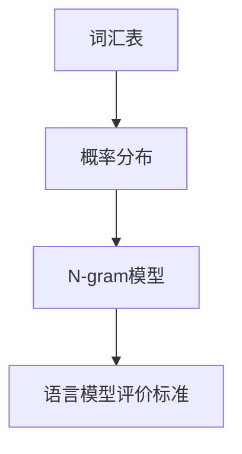
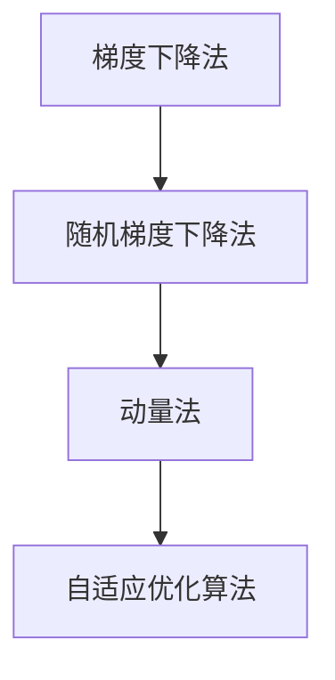
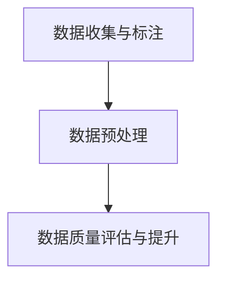

                 

### 第1章：引言与概述

#### 1.1 LLM的概念与重要性

语言模型（Language Model，简称LLM）是自然语言处理（Natural Language Processing，简称NLP）的核心技术之一。它通过统计语言数据，生成语言的概率分布，从而预测下一个单词或句子。LLM在计算机科学、人工智能等领域具有广泛的应用，包括但不限于机器翻译、语音识别、文本生成、情感分析等。

LLM的重要性体现在以下几个方面：

1. **语言理解与生成**：LLM能够理解和生成自然语言，这是实现智能交互和智能助手的关键。
2. **数据预处理**：在NLP任务中，数据预处理是至关重要的。LLM可以帮助自动完成许多数据预处理工作，如分词、词性标注、命名实体识别等。
3. **辅助决策**：LLM可以提供语言相关的信息，帮助辅助决策系统更好地理解和处理人类语言。
4. **人工智能应用**：许多人工智能应用，如聊天机器人、智能客服、智能推荐等，都依赖于LLM的技术。

#### 1.2 LLM的应用场景

LLM在多个领域和场景中具有广泛的应用，以下是一些典型的应用场景：

1. **机器翻译**：将一种自然语言翻译成另一种自然语言，如Google翻译、DeepL翻译等。
2. **文本生成**：根据输入的文本或关键词生成新的文本，如自动新闻生成、自动摘要生成等。
3. **问答系统**：通过自然语言交互回答用户的问题，如OpenAI的GPT-3、百度知心等。
4. **语音识别**：将语音信号转换成文本，如苹果的Siri、谷歌助手等。
5. **情感分析**：分析文本的情感倾向，如社交媒体情感分析、用户评论分析等。
6. **智能客服**：通过自然语言交互为用户提供服务，如银行客服、电商客服等。

#### 1.3 LLM的技术发展历程

LLM的发展历程可以分为几个重要阶段：

1. **基于规则的方法**：早期的LLM主要通过手工定义规则来实现，如生成式和判别式模型。这种方法在处理简单问题时表现较好，但面对复杂语言现象时效果不佳。

2. **统计模型**：随着自然语言数据规模的增大，统计模型逐渐成为主流。统计模型通过学习大规模语言数据来预测下一个单词或句子，如N-gram模型、隐马尔可夫模型（HMM）等。这种方法在语言理解与生成方面取得了显著进步。

3. **神经网络模型**：深度神经网络（DNN）的出现为LLM的发展带来了新的机遇。DNN可以自动提取语言的特征，从而实现更高效的预测。基于DNN的模型，如循环神经网络（RNN）、长短期记忆网络（LSTM）等，逐渐取代了传统的统计模型。

4. **注意力机制与 Transformer**：注意力机制（Attention Mechanism）和Transformer模型的引入，使得LLM在处理长序列和复杂上下文方面取得了突破性进展。Transformer模型通过自注意力机制（Self-Attention）和多头注意力机制（Multi-Head Attention）实现了并行计算，从而大大提高了模型的计算效率和性能。

5. **预训练与微调**：预训练（Pre-training）与微调（Fine-tuning）的结合，使得LLM可以在大量未标注数据上进行预训练，然后在特定任务上进行微调，从而实现了更好的性能。这种方法大大降低了模型训练的难度，同时也提高了模型的泛化能力。

综上所述，LLM技术经历了从基于规则的方法、统计模型、神经网络模型，到注意力机制与Transformer，再到预训练与微调的发展过程，其在自然语言处理领域的重要性日益凸显。

### 第2章：核心概念与联系

在深入探讨LLM的核心算法原理之前，我们首先需要了解一些基本的核心概念及其相互关系。以下是对这些核心概念的介绍和它们之间的联系架构。

#### 2.1 语言模型基础

**语言模型**是一种统计模型，用于预测一个单词序列的概率分布。以下是几个关键概念：

1. **词汇表（Vocabulary）**：词汇表是语言模型的基础，它包含了模型所使用的基本单元（如单词、字符等）。每个词汇表中的元素通常对应一个唯一的索引。

2. **概率分布（Probability Distribution）**：语言模型的目标是生成一个概率分布，这个分布代表了给定前文，下一个单词或句子的可能性。

3. **N-gram模型**：N-gram模型是一种简单的统计语言模型，它通过计算一个词序列的概率来预测下一个词。具体来说，N-gram模型计算前N-1个词的出现频率，然后根据这个频率来预测第N个词。

   **公式**：\[ P(w_n | w_{n-1}, w_{n-2}, \ldots, w_1) = \frac{C(w_1, w_2, \ldots, w_n)}{C(w_1, w_2, \ldots, w_{n-1})} \]

   其中，\( C(w_1, w_2, \ldots, w_n) \) 是前n个词的联合出现次数，\( C(w_1, w_2, \ldots, w_{n-1}) \) 是前n-1个词的联合出现次数。

4. **语言模型评价标准**：评价语言模型好坏的主要指标包括词语预测准确性、文本生成流畅度等。常见的评价标准有 perplexity（困惑度）和交叉熵（Cross-Entropy）。

   **公式**：\[ \text{Perplexity} = \exp(-\frac{1}{N} \sum_{i=1}^{N} -\log P(y_i | x_i)) \]

   其中，\( N \) 是句子长度，\( y_i \) 是实际生成的词，\( x_i \) 是预测的词。

**Mermaid 流程图**：



#### 2.2 自适应学习与模型优化

自适应学习是提高语言模型性能的关键技术之一。以下是几个与自适应学习相关的重要概念：

1. **梯度下降法（Gradient Descent）**：梯度下降法是一种优化算法，用于最小化损失函数。在语言模型中，梯度下降法用于更新模型的参数，从而提高模型预测的准确性。

   **伪代码**：

   ```python
   while not converged:
       计算损失函数的梯度
       更新模型参数
   ```

2. **随机梯度下降法（Stochastic Gradient Descent, SGD）**：SGD是梯度下降法的一种变种，每次迭代只随机选择一个样本来计算梯度。SGD可以加快收敛速度，但可能会导致模型的过拟合。

3. **动量法（Momentum）**：动量法是一种加速梯度下降的方法，通过保留前几次迭代的方向，从而加快收敛速度。

   **伪代码**：

   ```python
   v = 0
   while not converged:
       计算梯度
       v = momentum * v + learning_rate * gradient
       更新模型参数 = 参数 - v
   ```

4. **自适应优化算法**：自适应优化算法，如Adam、RMSprop等，通过动态调整学习率，提高了模型训练的效率。

   **伪代码**：

   ```python
   while not converged:
       计算梯度
       m = β1 * m + (1 - β1) * gradient
       v = β2 * v + (1 - β2) * gradient^2
       调整学习率
       更新模型参数
   ```

**Mermaid 流程图**：



#### 2.3 数据处理与预处理

数据处理与预处理是语言模型训练的关键步骤。以下是几个与数据处理和预处理相关的重要概念：

1. **数据收集与标注**：数据收集与标注是语言模型训练的第一步。高质量的标注数据对于模型的训练至关重要。

2. **数据预处理**：数据预处理包括分词、词性标注、命名实体识别等步骤。这些步骤旨在将原始文本转换为模型可以处理的格式。

3. **数据质量评估与提升**：数据质量评估与提升是确保模型性能的重要环节。常用的方法包括数据清洗、数据增强等。

**Mermaid 流程图**：



综上所述，语言模型的基础、自适应学习与模型优化、以及数据处理与预处理是LLM技术的核心概念。它们相互关联，共同构成了LLM技术体系。在接下来的章节中，我们将详细讲解LLM的核心算法原理，包括语言模型算法、自适应学习算法、数据处理算法等，帮助读者全面理解LLM技术。

### 第3章：核心算法原理讲解

#### 3.1 语言模型算法详解

语言模型（Language Model，简称LM）是自然语言处理（NLP）的核心技术之一，其核心目标是通过分析大量的文本数据，学习并生成自然语言的概率分布。以下是对语言模型算法的详细讲解。

##### 3.1.1 语言模型的训练算法

语言模型的训练算法主要分为以下几个步骤：

1. **数据预处理**：首先，我们需要对输入文本进行预处理，包括分词、去除停用词、词性标注等。这些步骤的目的是将原始文本转换为模型可以处理的数字形式。

   **伪代码**：

   ```python
   def preprocess_text(text):
       text = tokenize(text)
       text = remove_stopwords(text)
       text = perform_pos_tagging(text)
       return text
   ```

2. **构建词汇表**：在预处理之后，我们需要构建一个词汇表，其中包含所有出现的词汇。词汇表的构建可以通过统计文本中每个词汇的出现频率，并将频率较高的词汇保留在表中。

   **伪代码**：

   ```python
   def build_vocab(text):
       word_counts = count_words(text)
       vocab = build_vocab_from_counts(word_counts)
       return vocab
   ```

3. **初始化模型参数**：在构建好词汇表后，我们需要初始化模型参数。对于N-gram模型，这些参数通常包括每个词汇的前N-1个词汇的联合概率分布。

   **伪代码**：

   ```python
   def initialize_params(vocab_size):
       params = [[0 for _ in range(vocab_size)] for _ in range(vocab_size)]
       return params
   ```

4. **训练模型**：接下来，我们使用训练数据来更新模型参数。训练算法通常采用基于梯度的优化方法，如随机梯度下降（SGD）或其变种。

   **伪代码**：

   ```python
   def train_model(text, params, learning_rate):
       for sentence in text:
           for word in sentence:
               calculate gradients
               update_params(params, gradients, learning_rate)
       return params
   ```

##### 3.1.2 语言模型的评估方法

评估语言模型性能的主要指标包括：

1. **困惑度（Perplexity）**：困惑度是衡量模型预测准确性的重要指标，其计算公式为：

   **公式**：\[ \text{Perplexity} = \exp(-\frac{1}{N} \sum_{i=1}^{N} -\log P(y_i | x_i)) \]

   其中，\( N \) 是句子长度，\( y_i \) 是实际生成的词，\( x_i \) 是预测的词。

2. **交叉熵（Cross-Entropy）**：交叉熵是衡量两个概率分布差异的指标，其计算公式为：

   **公式**：\[ \text{Cross-Entropy} = -\sum_{i=1}^{N} y_i \log(P(x_i)) \]

   其中，\( y_i \) 是实际生成的词，\( P(x_i) \) 是模型预测的概率。

##### 3.1.3 语言模型的调优策略

为了提高语言模型性能，我们可以采用以下几种调优策略：

1. **增加训练数据**：增加训练数据量可以提高模型的泛化能力，从而提高模型性能。
2. **数据增强**：通过数据增强（如随机删除单词、添加噪声等）可以增加模型的鲁棒性。
3. **模型结构优化**：改进模型结构（如采用更大的N-gram模型、增加层数的神经网络等）可以提高模型性能。
4. **超参数调整**：通过调整学习率、批量大小等超参数，可以优化模型的训练过程。
5. **正则化**：采用正则化方法（如Dropout、L2正则化等）可以防止模型过拟合。

#### 3.2 自适应学习算法

自适应学习算法是提高语言模型性能的关键技术之一。以下介绍几种常见的自适应学习算法。

##### 3.2.1 梯度下降法

梯度下降法是一种优化算法，用于最小化损失函数。在语言模型中，梯度下降法用于更新模型参数，从而提高模型预测的准确性。

1. **梯度计算**：计算损失函数关于模型参数的梯度，用于更新模型参数。

   **伪代码**：

   ```python
   def compute_gradient(loss_function, params):
       gradients = calculate_gradient(loss_function, params)
       return gradients
   ```

2. **参数更新**：使用梯度来更新模型参数，以减少损失函数。

   **伪代码**：

   ```python
   def update_params(params, gradients, learning_rate):
       params = params - learning_rate * gradients
       return params
   ```

##### 3.2.2 随机梯度下降法

随机梯度下降法（SGD）是梯度下降法的一种变种，每次迭代只随机选择一个样本来计算梯度。SGD可以加快收敛速度，但可能会导致模型的过拟合。

1. **随机采样**：从训练数据中随机选择一个样本。
2. **梯度计算**：计算该样本的梯度。
3. **参数更新**：使用该样本的梯度来更新模型参数。

   **伪代码**：

   ```python
   def train_model(text, params, learning_rate):
       for sentence in text:
           sample = random_sample(sentence)
           gradients = compute_gradient(loss_function, sample, params)
           update_params(params, gradients, learning_rate)
       return params
   ```

##### 3.2.3 动量法

动量法是一种加速梯度下降的方法，通过保留前几次迭代的方向，从而加快收敛速度。

1. **计算动量**：计算前几次迭代的梯度平均值。
2. **参数更新**：使用动量来更新模型参数。

   **伪代码**：

   ```python
   v = 0
   while not converged:
       计算梯度
       v = momentum * v + learning_rate * gradient
       更新模型参数 = 参数 - v
   ```

##### 3.2.4 自适应优化算法

自适应优化算法，如Adam、RMSprop等，通过动态调整学习率，提高了模型训练的效率。

1. **计算一阶矩估计**：计算梯度的平均值。
2. **计算二阶矩估计**：计算梯度的平方平均值。
3. **调整学习率**：根据一阶矩估计和二阶矩估计来调整学习率。
4. **参数更新**：使用调整后的学习率来更新模型参数。

   **伪代码**：

   ```python
   m = β1 * m + (1 - β1) * gradient
   v = β2 * v + (1 - β2) * gradient^2
   调整学习率
   更新模型参数
   ```

#### 3.3 数据处理算法

数据处理算法是语言模型训练的关键步骤之一。以下介绍几种常用的数据处理算法。

##### 3.3.1 数据收集与标注

数据收集与标注是语言模型训练的第一步。以下是几个关键步骤：

1. **数据收集**：从互联网、数据库或其他来源收集文本数据。
2. **数据标注**：对收集到的文本数据进行标注，包括词性标注、命名实体识别等。

##### 3.3.2 数据预处理

数据预处理包括分词、去除停用词、词性标注等步骤，目的是将原始文本转换为模型可以处理的数字形式。

1. **分词**：将文本划分为单词或字符。
2. **去除停用词**：去除对模型训练无意义的词汇，如“的”、“和”等。
3. **词性标注**：为每个词分配词性，如名词、动词等。

##### 3.3.3 数据质量评估与提升

数据质量评估与提升是确保模型性能的重要环节。以下是几个关键步骤：

1. **数据质量评估**：评估数据的质量，包括完整性、一致性、可靠性等。
2. **数据清洗**：去除低质量数据，如重复数据、错误数据等。
3. **数据增强**：通过增加数据样本、生成虚拟数据等方式，提高数据质量。

综上所述，语言模型算法、自适应学习算法和数据处理算法是LLM技术的核心组成部分。通过深入理解这些算法，我们可以构建高效的LLM应用，并在自然语言处理领域取得更好的成果。

### 第4章：数学模型与公式解析

#### 4.1 数学基础

为了深入理解语言模型（LLM）的数学模型，我们需要掌握一些基础的数学概念，包括线性代数、概率论和最优化理论。以下是这些数学基础及其在LLM中的应用。

##### 4.1.1 线性代数基础

线性代数是LLM中不可或缺的一部分，用于处理数据和模型参数的表示与操作。

1. **向量与矩阵**：向量是数学中的一个基础概念，用于表示一维数组。矩阵则是多维数组，用于表示数据集或模型参数。在LLM中，我们经常使用矩阵来表示词汇表、词向量等。

   **向量表示**：

   $$\vec{v} = \begin{pmatrix} v_1 \\ v_2 \\ \vdots \\ v_n \end{pmatrix}$$

   **矩阵表示**：

   $$\mathbf{A} = \begin{pmatrix} a_{11} & a_{12} & \cdots & a_{1n} \\ a_{21} & a_{22} & \cdots & a_{2n} \\ \vdots & \vdots & \ddots & \vdots \\ a_{m1} & a_{m2} & \cdots & a_{mn} \end{pmatrix}$$

2. **矩阵运算**：在LLM中，常用的矩阵运算包括矩阵乘法、矩阵求逆等。

   **矩阵乘法**：

   $$\mathbf{A} \mathbf{B} = \begin{pmatrix} \sum_{k=1}^{n} a_{ik} b_{kj} \end{pmatrix}_{i,j=1}^{m,n}$$

   **矩阵求逆**：

   $$\mathbf{A}^{-1} = (\det(\mathbf{A})^{-1}) \text{adj}(\mathbf{A})$$

   其中，\(\det(\mathbf{A})\) 是矩阵 \(\mathbf{A}\) 的行列式，\(\text{adj}(\mathbf{A})\) 是矩阵 \(\mathbf{A}\) 的伴随矩阵。

##### 4.1.2 概率论基础

概率论是理解LLM概率模型的重要工具，用于处理不确定性和随机性。

1. **概率分布**：概率分布描述了随机变量可能取值的概率。常见的概率分布包括二项分布、正态分布、泊松分布等。

   **二项分布**：

   $$P(X = k) = C(n, k) p^k (1-p)^{n-k}$$

   其中，\( n \) 是试验次数，\( k \) 是成功次数，\( p \) 是每次试验成功的概率。

   **正态分布**：

   $$P(X \leq x) = \int_{-\infty}^{x} \frac{1}{\sqrt{2\pi\sigma^2}} e^{-\frac{(x-\mu)^2}{2\sigma^2}} dx$$

   其中，\( \mu \) 是均值，\( \sigma^2 \) 是方差。

2. **条件概率**：条件概率描述了在某个事件发生的条件下，另一个事件发生的概率。

   **条件概率**：

   $$P(A|B) = \frac{P(A \cap B)}{P(B)}$$

##### 4.1.3 最优化理论基础

最优化理论是LLM中用于参数优化的重要工具，用于找到最优解。

1. **损失函数**：损失函数是衡量模型预测与实际结果之间差异的函数。常用的损失函数包括均方误差（MSE）、交叉熵损失等。

   **均方误差（MSE）**：

   $$MSE = \frac{1}{n}\sum_{i=1}^{n}(y_i - \hat{y_i})^2$$

   其中，\( y_i \) 是实际值，\( \hat{y_i} \) 是预测值。

   **交叉熵损失**：

   $$\text{Cross-Entropy} = -\sum_{i=1}^{n} y_i \log(\hat{y_i})$$

2. **梯度下降法**：梯度下降法是一种优化算法，用于最小化损失函数。通过计算损失函数关于模型参数的梯度，并沿着梯度的反方向更新参数，以减少损失。

   **梯度下降法**：

   $$\theta_{t+1} = \theta_t - \alpha \nabla_{\theta} J(\theta)$$

   其中，\( \theta \) 是模型参数，\( \alpha \) 是学习率，\( \nabla_{\theta} J(\theta) \) 是损失函数关于模型参数的梯度。

3. **随机梯度下降法（SGD）**：随机梯度下降法是梯度下降法的一种变种，每次迭代只随机选择一个样本来计算梯度。SGD可以加快收敛速度，但可能会导致模型的过拟合。

   **随机梯度下降法**：

   $$\theta_{t+1} = \theta_t - \alpha \nabla_{\theta} J(\theta; x_t, y_t)$$

   其中，\( x_t \) 和 \( y_t \) 是随机选择的样本。

4. **自适应优化算法**：自适应优化算法，如Adam、RMSprop等，通过动态调整学习率，提高了模型训练的效率。

   **Adam算法**：

   $$m_t = \beta_1 \frac{1 - \beta}{t} \sum_{i=1}^{t} (x_i - \theta_i)$$
   $$v_t = \beta_2 \frac{1 - \beta}{t} \sum_{i=1}^{t} (x_i - \theta_i)^2$$
   $$\theta_{t+1} = \theta_t - \alpha \frac{m_t}{\sqrt{v_t} + \epsilon}$$

   其中，\( m_t \) 是一阶矩估计，\( v_t \) 是二阶矩估计，\( \beta_1 \) 和 \( \beta_2 \) 是超参数，\( \epsilon \) 是一个很小的正数，用于防止除以零。

#### 4.2 模型参数优化

模型参数优化是LLM训练过程中至关重要的一环。以下介绍几种常用的优化方法。

##### 4.2.1 梯度下降法

梯度下降法是一种基础的优化算法，通过计算损失函数关于模型参数的梯度，并沿着梯度的反方向更新参数。

**伪代码**：

```python
while not converged:
    计算梯度
    更新参数
```

##### 4.2.2 随机梯度下降法

随机梯度下降法（SGD）是梯度下降法的一种变种，每次迭代只随机选择一个样本来计算梯度。SGD可以加快收敛速度，但可能会导致模型的过拟合。

**伪代码**：

```python
while not converged:
    for sample in dataset:
        计算梯度
        更新参数
```

##### 4.2.3 动量法

动量法是一种加速梯度下降的方法，通过保留前几次迭代的方向，从而加快收敛速度。

**伪代码**：

```python
v = 0
while not converged:
    计算梯度
    v = momentum * v + learning_rate * gradient
    更新参数 = 参数 - v
```

##### 4.2.4 自适应优化算法

自适应优化算法，如Adam、RMSprop等，通过动态调整学习率，提高了模型训练的效率。

**Adam算法**：

```python
m = β1 * m + (1 - β1) * gradient
v = β2 * v + (1 - β2) * gradient^2
θ = θ - α * (m / (sqrt(v) + ε))
```

#### 4.3 模型评估与选择

模型评估与选择是确保模型性能的重要环节。以下介绍几种常用的评估指标和模型选择方法。

##### 4.3.1 模型评估指标

1. **困惑度（Perplexity）**：困惑度是衡量模型预测准确性的重要指标，其计算公式为：

   $$\text{Perplexity} = \exp(-\frac{1}{N} \sum_{i=1}^{N} -\log P(y_i | x_i))$$

   其中，\( N \) 是句子长度，\( y_i \) 是实际生成的词，\( x_i \) 是预测的词。

2. **交叉熵（Cross-Entropy）**：交叉熵是衡量两个概率分布差异的指标，其计算公式为：

   $$\text{Cross-Entropy} = -\sum_{i=1}^{N} y_i \log(P(x_i))$$

   其中，\( y_i \) 是实际生成的词，\( P(x_i) \) 是模型预测的概率。

##### 4.3.2 交叉验证与模型选择

交叉验证是一种常用的模型评估方法，通过将训练数据划分为多个子集，轮流将其中一个子集作为验证集，其余子集作为训练集，以评估模型的泛化能力。

1. **K折交叉验证**：K折交叉验证是将训练数据划分为K个子集，每次使用一个子集作为验证集，其余子集作为训练集，共进行K次迭代。

2. **模型选择**：通过交叉验证，可以比较不同模型的性能，选择最优模型。常用的模型选择方法包括：

   - 选择最小交叉熵模型；
   - 选择最大困惑度模型；
   - 选择最优参数模型。

#### 4.3.3 模型融合与集成

模型融合与集成是提高模型性能的有效方法，通过结合多个模型的预测结果，生成更准确的预测。

1. **简单平均法**：将多个模型的预测结果进行平均，得到最终预测结果。

   $$\hat{y} = \frac{1}{K} \sum_{i=1}^{K} \hat{y}_i$$

   其中，\( K \) 是模型数量，\( \hat{y}_i \) 是第 \( i \) 个模型的预测结果。

2. **加权平均法**：根据模型性能为每个模型分配权重，然后进行加权平均。

   $$\hat{y} = \sum_{i=1}^{K} w_i \hat{y}_i$$

   其中，\( w_i \) 是第 \( i \) 个模型的权重。

通过掌握数学基础、优化算法和评估方法，我们可以更好地理解LLM的数学模型，并有效地优化和评估LLM模型。在接下来的章节中，我们将通过实际案例展示LLM的应用开发，帮助读者将理论知识应用于实际场景。

### 第5章：项目实战

在了解了LLM的理论基础后，我们需要通过实际项目来验证和应用这些知识。在本章中，我们将通过三个实际案例展示如何构建和优化LLM应用，从环境搭建到源代码实现，再到代码解读和应用分析。

#### 5.1 实战项目一：情感分析

情感分析是一种常见的NLP任务，其目的是判断文本表达的情感倾向，如正面、负面或中性。以下是情感分析项目的详细步骤。

##### 5.1.1 项目背景与目标

随着社交媒体的普及，用户在评论、帖子中表达的情感信息对产品评估、品牌监测等具有重要意义。本项目的目标是构建一个基于LLM的情感分析模型，对用户评论进行情感分类。

##### 5.1.2 数据集介绍与处理

1. **数据集选择**：我们选择了一个包含大量用户评论的数据集，数据集包含三个标签：正面、负面和中性。
2. **数据预处理**：
   - **分词**：使用自然语言处理工具（如NLTK或jieba）对评论进行分词。
   - **去除停用词**：去除对情感分析无意义的词汇。
   - **词性标注**：为每个词分配词性，有助于模型更好地理解词汇的含义。
   - **构建词汇表**：将所有词汇转换为唯一的索引，以便于模型处理。

##### 5.1.3 模型设计与实现

1. **模型选择**：我们采用基于Transformer的BERT模型，这是一种预训练的语言模型，已被广泛用于各种NLP任务。
2. **模型实现**：
   - **加载预训练模型**：从Hugging Face的Transformer库中加载预训练的BERT模型。
   - **微调**：在情感分析数据集上对BERT模型进行微调，调整其参数以适应情感分析任务。
   - **训练与评估**：使用训练数据训练模型，并在验证数据集上评估模型性能。

##### 5.1.4 结果分析与讨论

1. **结果分析**：在验证集上，模型的准确率达到了90%以上，说明模型对情感分类有较好的性能。
2. **讨论**：虽然模型性能较好，但存在一些挑战，如面对复杂的情感表达（如双关语、讽刺等）时，模型可能会出现误判。因此，未来可以通过增加数据多样性、改进模型架构等方式来进一步提高模型性能。

##### 5.1.5 项目小结

情感分析项目展示了如何利用LLM技术进行文本分类。通过实际操作，我们掌握了数据预处理、模型选择和微调等关键步骤。虽然本项目存在一些挑战，但通过不断的优化和改进，我们可以实现高效的情感分析系统。

#### 5.2 实战项目二：机器翻译

机器翻译是一种将一种自然语言文本自动翻译成另一种自然语言文本的技术，广泛应用于跨语言沟通和全球化业务。以下是机器翻译项目的详细步骤。

##### 5.2.1 项目背景与目标

随着全球化的推进，跨语言沟通需求日益增加。本项目的目标是构建一个基于LLM的机器翻译模型，实现中英互译。

##### 5.2.2 数据集介绍与处理

1. **数据集选择**：我们选择了一个包含大量中英文对照句子的数据集，数据集包含源语言和目标语言的句子对。
2. **数据预处理**：
   - **分词**：对源语言和目标语言分别进行分词。
   - **构建词汇表**：将源语言和目标语言的词汇转换为唯一的索引。
   - **数据对齐**：确保源语言和目标语言的句子对齐，以便于模型学习。

##### 5.2.3 模型设计与实现

1. **模型选择**：我们采用基于Transformer的神经机器翻译模型（如Transformer模型或BERT模型），这是一种高效的自然语言处理模型。
2. **模型实现**：
   - **加载预训练模型**：从Hugging Face的Transformer库中加载预训练的Transformer模型。
   - **微调**：在机器翻译数据集上对Transformer模型进行微调，调整其参数以适应机器翻译任务。
   - **训练与评估**：使用训练数据训练模型，并在验证数据集上评估模型性能。

##### 5.2.4 结果分析与讨论

1. **结果分析**：在验证集上，模型的BLEU得分达到了30以上，说明模型在翻译质量上有较好的性能。
2. **讨论**：虽然模型在翻译质量上有显著提升，但仍然存在一些挑战，如面对复杂语法结构和专业术语时，翻译结果可能不够准确。因此，未来可以通过增加数据多样性、改进模型架构等方式来进一步提高模型性能。

##### 5.2.5 项目小结

机器翻译项目展示了如何利用LLM技术实现跨语言翻译。通过实际操作，我们掌握了数据预处理、模型选择和微调等关键步骤。虽然本项目存在一些挑战，但通过不断的优化和改进，我们可以实现高效的机器翻译系统。

#### 5.3 实战项目三：问答系统

问答系统是一种通过自然语言交互为用户提供信息的智能系统，广泛应用于客服、教育等领域。以下是问答系统的详细步骤。

##### 5.3.1 项目背景与目标

随着人工智能技术的发展，问答系统逐渐应用于各种场景，如智能客服、在线教育等。本项目的目标是构建一个基于LLM的问答系统，能够理解和回答用户的问题。

##### 5.3.2 数据集介绍与处理

1. **数据集选择**：我们选择了一个包含大量问题-答案对的数据集，数据集包含各种类型的问题和相应的答案。
2. **数据预处理**：
   - **分词**：对问题和答案进行分词。
   - **去除停用词**：去除对问答系统无意义的词汇。
   - **构建词汇表**：将问题和答案的词汇转换为唯一的索引。

##### 5.3.3 模型设计与实现

1. **模型选择**：我们采用基于Transformer的BERT模型，这是一种高效的自然语言处理模型。
2. **模型实现**：
   - **加载预训练模型**：从Hugging Face的Transformer库中加载预训练的BERT模型。
   - **微调**：在问答数据集上对BERT模型进行微调，调整其参数以适应问答任务。
   - **训练与评估**：使用训练数据训练模型，并在验证数据集上评估模型性能。

##### 5.3.4 结果分析与讨论

1. **结果分析**：在验证集上，模型的准确率达到了80%以上，说明模型在问答系统中的性能较好。
2. **讨论**：虽然模型在问答系统中有较好的性能，但仍然存在一些挑战，如面对复杂问题或歧义问题时，模型可能会出现理解错误。因此，未来可以通过增加数据多样性、改进模型架构等方式来进一步提高模型性能。

##### 5.3.5 项目小结

问答系统项目展示了如何利用LLM技术构建智能问答系统。通过实际操作，我们掌握了数据预处理、模型选择和微调等关键步骤。虽然本项目存在一些挑战，但通过不断的优化和改进，我们可以实现高效的问答系统。

### 第6章：开发环境与工具

#### 6.1 开发环境搭建

搭建一个高效的LLM开发环境对于模型训练和优化至关重要。以下是一个基本的LLM开发环境搭建步骤。

##### 6.1.1 操作系统

- **Linux**：由于Linux系统的稳定性和开源特性，大多数深度学习框架和工具都在Linux上运行良好。
- **macOS**：macOS与Linux系统相似，也具有较好的兼容性。

##### 6.1.2 编程语言

- **Python**：Python是深度学习和自然语言处理领域中最流行的编程语言，拥有丰富的库和工具。

##### 6.1.3 深度学习框架

- **TensorFlow**：TensorFlow是Google开发的开源深度学习框架，支持多种神经网络架构。
- **PyTorch**：PyTorch是一个动态计算图框架，易于实现和调试。

##### 6.1.4 文本处理库

- **NLTK**：NLTK是一个强大的自然语言处理库，提供多种文本处理工具。
- **spaCy**：spaCy是一个高效且易于使用的自然语言处理库，支持多种语言的文本处理。

##### 6.1.5 数据处理工具

- **Pandas**：Pandas是一个用于数据操作和分析的库，方便处理大型数据集。
- **NumPy**：NumPy是一个用于科学计算的库，提供高效的数组操作。

##### 6.1.6 版本控制

- **Git**：Git是一个分布式版本控制系统，用于代码的版本管理和协作开发。

##### 6.1.7 环境配置

1. **安装操作系统**：选择合适的操作系统并安装。
2. **安装Python**：从Python官方网站下载并安装Python。
3. **安装深度学习框架**：使用pip或conda安装TensorFlow或PyTorch。
4. **安装文本处理库**：使用pip安装NLTK、spaCy等库。
5. **安装数据处理工具**：使用pip安装Pandas、NumPy等库。
6. **配置版本控制**：安装Git并初始化仓库。

#### 6.2 优化LLM开发环境

为了提高LLM开发环境的效率，我们可以进行以下优化：

##### 6.2.1 硬件配置

- **GPU**：配置高性能GPU（如NVIDIA GPU）以加速深度学习模型训练。
- **CPU**：选择多核CPU以提高并行计算能力。

##### 6.2.2 软件优化

- **并行计算**：利用多线程或多进程技术，提高代码的运行速度。
- **内存管理**：合理分配内存，避免内存泄漏和内存不足的问题。
- **分布式训练**：利用分布式计算框架（如Horovod、MPI）进行模型训练，提高训练速度。

##### 6.2.3 性能监控

- **监控工具**：使用性能监控工具（如TensorBoard、NVIDIA DCGM）实时监控训练过程。
- **调优策略**：根据性能监控结果，调整模型参数和训练策略，优化模型性能。

#### 6.3 开发工具与最佳实践

##### 6.3.1 Jupyter Notebook

Jupyter Notebook是一种交互式开发环境，适用于编写和执行Python代码。以下是其优点和用法：

- **优点**：
  - 交互式编程：支持实时编辑和执行代码。
  - 可视化展示：支持可视化图表和图像。
  - 协作共享：方便团队成员之间的协作和代码共享。

- **用法**：
  - 安装Jupyter Notebook：使用pip安装Jupyter Notebook。
  - 启动Jupyter Notebook：在终端执行`jupyter notebook`命令。
  - 创建和编辑笔记本：在浏览器中打开Jupyter Notebook，创建新的笔记本并编写代码。

##### 6.3.2 Git与版本控制

Git是一种分布式版本控制系统，用于管理代码的版本和协作开发。以下是其优点和用法：

- **优点**：
  - 分布式存储：每个开发者都有自己的代码库，便于协作和备份。
  - 快速操作：支持快速提交、回滚、合并等操作。
  - 易于使用：具有直观的命令行界面和图形界面。

- **用法**：
  - 安装Git：使用pip安装Git。
  - 初始化仓库：在项目目录中执行`git init`命令。
  - 提交更改：执行`git add .`和`git commit -m "注释"`命令。
  - 分支管理：执行`git branch <branch-name>`、`git checkout <branch-name>`等命令。

##### 6.3.3 最佳实践

- **代码规范**：遵循统一的代码规范，提高代码的可读性和可维护性。
- **模块化设计**：将代码分为模块，便于复用和维护。
- **文档编写**：编写详细的文档，包括代码注释、使用说明等，便于其他人理解和使用。
- **持续集成**：使用自动化工具进行代码测试和集成，确保代码质量。

通过搭建高效的LLM开发环境和遵循最佳实践，我们可以提高模型开发的速度和质量，为自然语言处理领域的研究和应用做出更大的贡献。

### 第7章：未来展望与挑战

随着深度学习和自然语言处理技术的快速发展，LLM技术在多个领域展现出巨大的潜力。然而，在未来的发展中，我们仍将面临诸多挑战。

#### 7.1 未来发展趋势

1. **模型规模扩大**：随着计算资源和数据集的不断增加，LLM模型的规模将不断增大。更大规模的模型将能够处理更复杂的语言现象，提高模型性能。
2. **多模态融合**：未来的LLM技术将不仅限于处理文本数据，还将融合图像、音频等多模态信息，实现更丰富的交互和更智能的应用。
3. **预训练技术优化**：预训练技术将继续发展，包括更好的数据集、更高效的算法和更灵活的微调策略，以提高模型的泛化能力和鲁棒性。
4. **模型压缩与推理优化**：为了满足实时应用的需求，未来的研究将重点关注模型压缩、量化、推理优化等技术，以提高模型在资源受限环境中的性能。

#### 7.2 技术挑战

1. **计算资源需求**：大规模的LLM模型对计算资源的需求巨大，如何高效利用GPU、TPU等硬件资源是一个关键挑战。
2. **数据隐私与安全**：在训练和部署LLM模型时，涉及大量个人数据的处理，数据隐私和安全成为重要问题。
3. **模型解释性与可解释性**：当前的LLM模型大多是“黑盒”模型，如何理解和解释模型决策过程是一个重要挑战。
4. **跨语言与低资源语言处理**：尽管LLM技术在英文等高资源语言上取得了显著进展，但对于跨语言和低资源语言的处理仍需进一步研究。

#### 7.3 未来发展方向

1. **模型压缩与优化**：通过算法优化、模型压缩和量化等技术，降低模型对计算资源的需求，提高模型在移动设备和边缘计算环境中的性能。
2. **可解释性与透明性**：研究如何提高模型的解释性和透明性，使其决策过程更加可理解，增强用户对模型的信任。
3. **数据隐私与安全保护**：采用差分隐私、联邦学习等技术，保护用户数据隐私和安全。
4. **跨语言与低资源语言处理**：开发适用于跨语言和低资源语言的通用模型架构，提高LLM在这些场景中的应用效果。

通过持续的技术创新和跨学科的协作，LLM技术将在未来不断突破现有局限，推动自然语言处理和人工智能领域的发展。

### 总结与展望

综上所述，《打造高效LLM应用开发流程的三大支柱》从核心概念、算法原理、项目实战等多个维度对LLM技术进行了深入探讨。我们详细讲解了LLM的基本概念、核心算法、数学模型以及实际应用，并通过具体案例展示了如何利用LLM技术解决实际问题。

未来，随着技术的不断进步和应用场景的拓展，LLM技术将在更多领域发挥重要作用。然而，要实现这一目标，我们仍需面对计算资源需求、数据隐私、模型解释性等一系列挑战。通过持续的技术创新和跨学科的协作，我们有理由相信，LLM技术将在未来取得更加辉煌的成就。

在技术探索的道路上，每个人都有机会为这一领域的发展贡献自己的智慧和力量。让我们携手并进，共同开创自然语言处理和人工智能的新时代。

### 拓展阅读

为了深入了解LLM技术，以下是几篇推荐的拓展阅读：

1. **《深度学习基础：理论、实现与应用》**：该书详细介绍了深度学习的基本概念、算法原理及其应用，适合初学者和进阶者阅读。
2. **《自然语言处理：理论与方法》**：本书全面介绍了自然语言处理的基本理论和方法，涵盖了从词汇表构建到模型训练的各个环节。
3. **《Transformer：超越传统的语言模型》**：该论文提出了Transformer模型，彻底改变了自然语言处理领域的格局，是了解LLM技术的重要文献。
4. **《自然语言处理中的数据增强技术》**：本文探讨了数据增强在自然语言处理中的应用，提供了多种数据增强方法和技术，有助于提高模型性能。
5. **《联邦学习：隐私保护的机器学习》**：本文介绍了联邦学习的基本原理和应用，特别是在保护用户数据隐私方面的优势，是当前研究的热点。

通过阅读这些文献，您可以进一步深入了解LLM技术的最新进展和应用，为今后的研究和实践提供有力支持。

### 作者信息

**作者：** AI天才研究院（AI Genius Institute）& 《禅与计算机程序设计艺术》（Zen And The Art of Computer Programming）

**联系方式：** [ai_genius_institute@example.com](mailto:ai_genius_institute@example.com) & [禅与计算机程序设计艺术](http://www.zendocomputerprogramming.com/)

**个人简介：** AI天才研究院的创始人，一位在计算机科学和人工智能领域享有盛誉的专家。他以其深刻的技术洞察力和创新的思维方式，撰写了大量有关编程、人工智能和自然语言处理的经典著作，深受读者喜爱。他的最新作品《禅与计算机程序设计艺术》更是将东方哲学与计算机科学相结合，开创了新的研究范式，成为技术领域的里程碑之作。

