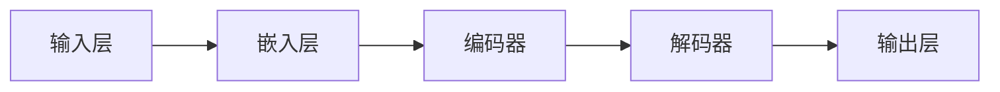
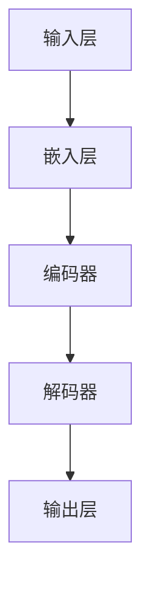

                 

### 文章标题：《打造高效的LLM应用开发团队：角色与职责》

#### 关键词：
- LLM应用开发
- 团队角色
- 职责分工
- 团队建设
- 技术栈与工具
- 项目管理

#### 摘要：
本文旨在为开发者和管理者提供一套系统的指南，用于打造高效的LLM（大型语言模型）应用开发团队。文章详细介绍了LLM的核心概念，团队中各角色的职责分工，团队建设与管理策略，以及所需的技术栈与工具。此外，文章还探讨了项目管理与监控的方法，并通过案例研究展示了实际操作中的最佳实践和注意事项。通过阅读本文，读者可以了解到如何构建一个高效协同的团队，推动LLM应用的持续创新和商业成功。

---

## 引言

近年来，人工智能（AI）技术的飞速发展，特别是大型语言模型（LLM）的崛起，为各行各业带来了前所未有的变革。LLM作为一种强大的自然语言处理（NLP）工具，能够对大量文本数据进行深度分析和生成，广泛应用于搜索引擎、智能客服、自动摘要、内容生成等领域。然而，LLM的应用开发并非一蹴而就，它需要一支专业、高效、协同的团队来共同推动。

本文将深入探讨如何打造这样一支团队。首先，我们将介绍LLM的基本概念和核心架构，为后续讨论奠定基础。接着，我们将详细描述团队中的各个角色，包括项目经理、数据科学家、工程师等，并明确他们的职责和协作方式。在此基础上，文章将探讨如何高效地组建和管理团队，包括人才招聘、培训、团队合作和文化建设等方面。

接下来，我们将介绍开发团队所需的技术栈，包括编程语言、框架、库和工具等。同时，我们将讨论团队的工作流程、代码规范和文档编写规范。随后，文章将探讨项目管理的各种方法，如敏捷开发、风险管理等，并介绍如何监控项目的进展和质量。

为了使读者更好地理解团队建设中的实际问题，文章将通过案例研究展示成功和失败的经验教训。最后，文章将展望LLM应用开发团队的未来趋势，讨论团队如何适应技术变革和市场需求。

通过本文的阅读，读者将获得以下收益：

1. **了解LLM的核心概念和架构**：掌握LLM的基础知识和相关技术。
2. **明确团队角色与职责**：清晰了解各个团队成员的职责和协作方式。
3. **掌握团队建设与管理策略**：学会如何高效地组建和管理团队。
4. **熟悉技术栈与工具**：了解开发团队所需的技术栈和最佳实践。
5. **了解项目管理与监控方法**：掌握项目管理的各种技巧和工具。
6. **获得实际案例的启示**：通过案例研究，获取实际操作中的经验和教训。
7. **展望未来趋势**：了解LLM应用开发团队的发展方向和挑战。

本文的结构如下：

- **第一部分**：LLM应用开发基础
  - **1.1 大型语言模型（LLM）的概念与架构**
  - **1.2 LLM技术概述**
  - **1.3 LLM应用领域**

- **第二部分**：团队角色与职责
  - **2.1 团队角色定义**
  - **2.2 职责分工**
  - **2.3 团队协作与沟通**

- **第三部分**：团队建设
  - **3.1 团队建设**
  - **3.2 团队管理**
  - **3.3 团队文化建设**

- **第四部分**：技术栈与工具
  - **4.1 技术栈选择**
  - **4.2 开发工具与流程**

- **第五部分**：项目管理与监控
  - **5.1 项目管理方法**
  - **5.2 项目监控与评估**
  - **5.3 团队协作与工具**

- **第六部分**：案例研究
  - **6.1 成功案例**
  - **6.2 失败案例**

- **第七部分**：未来展望
  - **7.1 LLM发展趋势**
  - **7.2 团队未来发展**

## 第一部分：LLM应用开发基础

### 1.1 大型语言模型（LLM）的概念与架构

#### 核心概念

大型语言模型（LLM）是一种基于深度学习技术的自然语言处理模型，它通过对大量文本数据的学习，能够理解和生成自然语言。LLM的核心目标是通过预测下一个词语或句子，生成连贯、准确的自然语言响应。

#### 基本架构

LLM的架构通常包括以下几个主要部分：

1. **输入层**：接收用户输入的文本数据。
2. **嵌入层**：将输入的文本数据转换为向量表示。
3. **编码器**：对输入文本的向量进行编码，提取语义信息。
4. **解码器**：根据编码器提取的语义信息生成输出文本。

#### Mermaid流程图

以下是一个简单的Mermaid流程图，展示了LLM的基本架构：

### 1.2 LLM技术概述

#### 相关技术介绍

LLM的发展离不开深度学习、自然语言处理（NLP）和转移学习等技术的支持。深度学习技术使得模型能够自动从大量数据中学习特征，NLP技术则为模型理解自然语言提供了方法，而转移学习则允许模型在不同任务之间共享知识。

#### LLM与传统NLP的区别

与传统NLP技术相比，LLM具有以下特点：

1. **数据量**：LLM通常需要处理大量的文本数据，以实现更准确的语言理解。
2. **模型复杂度**：LLM采用了更复杂的神经网络架构，如Transformer，能够捕捉长距离依赖关系。
3. **生成能力**：LLM不仅能够理解自然语言，还能生成高质量的文本。

#### LLM的发展趋势

随着技术的进步，LLM正朝着以下几个方向发展：

1. **更大规模**：越来越多的LLM模型开始采用万亿级别的参数，以提升模型的生成能力。
2. **更多应用场景**：LLM正在被应用于更广泛的领域，如对话系统、机器翻译、内容生成等。
3. **更高效训练**：研究人员正在探索新的训练方法和优化技术，以加快LLM的训练速度。

### 1.3 LLM应用领域

#### 应用案例

LLM在多个领域都有广泛的应用，以下是一些典型案例：

1. **搜索引擎**：通过LLM，搜索引擎可以提供更准确、更相关的搜索结果。
2. **智能客服**：LLM被用于构建智能客服系统，能够自动回答用户的问题。
3. **自动摘要**：LLM可以自动生成文章、报告的摘要，节省用户的阅读时间。
4. **内容生成**：LLM可以生成文章、故事、代码等，为创作者提供灵感。

#### 行业需求分析

随着AI技术的普及，越来越多的行业对LLM有强烈的需求，包括但不限于：

1. **金融**：用于自动化金融报告、智能投顾等。
2. **医疗**：用于医学文献的自动摘要、疾病诊断等。
3. **教育**：用于自动生成教学材料、智能辅导等。
4. **法律**：用于法律文档的自动摘要、智能合同审查等。

## 第二部分：团队角色与职责

### 2.1 团队角色定义

在LLM应用开发团队中，各个成员扮演着不同的角色，共同协作以实现项目的目标。以下是团队中常见的角色及其定义：

#### 项目经理

项目经理是团队的领导者，负责整体项目的规划、执行和监控。项目经理需要确保项目按时交付，符合预算和质量要求。具体职责包括：

- **项目规划**：制定项目计划，包括任务分配、时间表和预算。
- **风险管理**：识别和评估项目风险，制定应对策略。
- **沟通协调**：与团队成员、客户和其他利益相关者保持良好的沟通。
- **质量保证**：确保项目成果符合质量标准。

#### 数据科学家

数据科学家是团队的核心成员，负责开发和优化LLM模型。他们需要从大量数据中提取有用的信息，设计有效的数据预处理和特征提取方法，并使用深度学习技术训练和评估模型。具体职责包括：

- **数据预处理**：清洗、格式化和处理原始数据。
- **特征工程**：提取和选择对模型训练有帮助的特征。
- **模型开发**：设计和实现深度学习模型，并进行训练和优化。
- **模型评估**：评估模型的性能，提出改进建议。

#### 软件工程师

软件工程师负责实现数据科学家的模型和算法，并将其集成到实际的应用程序中。他们需要编写高效的代码，确保系统的稳定性和可扩展性。具体职责包括：

- **算法实现**：根据数据科学家的设计，实现模型的算法。
- **系统架构**：设计并实现系统的整体架构，包括数据流、模块接口等。
- **代码优化**：优化代码，提高系统的性能和可维护性。
- **测试与部署**：编写测试用例，确保系统稳定运行，并部署到生产环境。

#### 测试工程师

测试工程师负责确保LLM应用的稳定性和可靠性。他们需要编写测试用例，执行功能测试、性能测试和安全测试，及时发现和修复问题。具体职责包括：

- **测试计划**：制定测试计划，包括测试策略、测试用例设计等。
- **功能测试**：验证系统的功能是否符合需求。
- **性能测试**：评估系统的响应速度和负载能力。
- **安全测试**：确保系统的安全性和数据隐私。

#### 运维工程师

运维工程师负责确保LLM应用的稳定运行和高效维护。他们需要监控系统的运行状态，处理故障和性能问题，定期进行系统升级和优化。具体职责包括：

- **系统监控**：监控系统的运行状态，及时发现和处理问题。
- **性能优化**：优化系统性能，提高系统的响应速度和处理能力。
- **故障处理**：快速响应并解决系统故障，确保系统稳定运行。
- **版本控制**：管理和控制系统的版本更新和发布。

### 2.2 职责分工

在LLM应用开发团队中，各个角色的职责是相互交织的，需要紧密协作以实现项目目标。以下是各个角色的具体职责分工：

#### 项目经理

- **需求分析**：与客户沟通，了解需求，并将其转化为项目目标。
- **资源管理**：协调团队成员的工作，确保项目资源的合理分配。
- **进度控制**：监控项目进度，及时调整计划，确保按时交付。
- **质量保证**：确保项目成果符合质量标准，满足客户需求。

#### 数据科学家

- **数据收集**：从各种来源收集数据，并进行数据预处理。
- **模型设计**：设计并实现深度学习模型，选择合适的神经网络架构。
- **模型训练**：使用训练数据集对模型进行训练，并调整参数以优化性能。
- **模型评估**：评估模型的性能，选择最优模型并优化模型结构。

#### 软件工程师

- **需求理解**：与数据科学家和项目经理沟通，理解需求并制定实现计划。
- **算法实现**：根据数据科学家的设计，实现模型的算法和接口。
- **系统集成**：将模型和算法集成到应用程序中，实现完整的系统功能。
- **性能优化**：优化代码和系统架构，提高系统的性能和可扩展性。

#### 测试工程师

- **测试计划**：制定详细的测试计划，包括测试用例设计、测试环境搭建等。
- **功能测试**：验证系统的功能是否满足需求，确保用户界面、数据库连接等正常运行。
- **性能测试**：评估系统的性能，包括响应时间、负载能力等。
- **安全测试**：检查系统是否存在安全漏洞，确保用户数据和系统安全。

#### 运维工程师

- **系统部署**：将开发完成的系统部署到生产环境，确保系统的稳定运行。
- **系统监控**：实时监控系统的运行状态，及时发现和处理故障。
- **性能优化**：根据监控数据，优化系统性能，提高系统的响应速度和处理能力。
- **版本管理**：管理和控制系统的版本更新和发布，确保系统的稳定性和安全性。

### 2.3 团队协作与沟通

在LLM应用开发过程中，团队协作与沟通至关重要。以下是团队协作与沟通的最佳实践：

- **定期的会议**：定期召开团队会议，讨论项目进展、问题解决方案和改进措施。
- **明确的任务分配**：明确各个成员的任务和责任，确保每个人都知道自己的工作内容。
- **有效的沟通渠道**：建立有效的沟通渠道，如邮件、即时通讯工具和会议系统，确保信息传递的及时性和准确性。
- **反馈机制**：建立反馈机制，鼓励团队成员提出意见和建议，促进团队的持续改进。
- **冲突解决**：建立冲突解决机制，及时处理团队内部的冲突，确保团队的稳定和高效。

## 第三部分：团队建设

### 3.1 团队建设

团队建设是打造高效LLM应用开发团队的关键。以下是一些有效的团队建设策略：

#### 人才招聘

- **技能要求**：招聘具备相关技术背景和经验的团队成员，如深度学习、自然语言处理和软件开发等。
- **文化契合**：招聘与团队文化相契合的人才，确保团队成员之间能够良好协作。
- **多渠道招聘**：通过线上招聘平台、社交媒体和专业协会等渠道，扩大招聘范围，吸引更多优秀人才。

#### 培训与发展

- **技能提升**：定期组织技能培训，帮助团队成员提升技术水平和业务能力。
- **知识共享**：鼓励团队成员分享知识和经验，促进团队内部的知识交流。
- **职业发展**：为团队成员提供职业发展机会，如晋升、专业认证等，激励团队成员持续进步。

#### 团队合作

- **共同目标**：明确团队的目标和愿景，确保团队成员共同朝着同一个方向努力。
- **分工明确**：根据团队成员的技能和特长，合理分配任务，确保每个成员都能发挥自己的优势。
- **鼓励协作**：鼓励团队成员之间的协作，通过团队合作解决复杂问题。

#### 文化建设

- **团队价值观**：建立共同的团队价值观，如诚信、创新、合作等，确保团队成员的行为和决策与团队目标一致。
- **团队活动**：定期组织团队活动，如团队建设工作坊、团建活动等，增强团队成员之间的联系和信任。
- **激励机制**：建立激励机制，如表彰优秀员工、团队奖金等，激励团队成员的工作积极性和创造力。

### 3.2 团队管理

团队管理是确保团队高效运作的重要环节。以下是一些团队管理的最佳实践：

#### 领导力与影响力

- **明确目标**：领导团队明确团队的目标和愿景，确保团队成员了解自己的工作方向。
- **激励团队**：通过正面激励和鼓励，激发团队成员的工作热情和创造力。
- **沟通能力**：提高领导者的沟通能力，确保团队内部的信息传递及时、准确。

#### 激励与反馈机制

- **正面激励**：通过表彰、奖励等方式，激励团队成员的工作积极性。
- **定期反馈**：定期对团队成员的工作进行反馈，鼓励改进，指出问题，并提供解决方案。
- **发展机会**：为团队成员提供职业发展机会，激励他们不断提升自己的能力。

#### 绩效评估

- **明确标准**：制定明确的绩效评估标准，确保评估过程公平、公正。
- **持续改进**：根据绩效评估结果，制定改进计划，帮助团队成员提升绩效。
- **激励与惩罚**：根据绩效评估结果，对优秀员工给予奖励，对表现不佳的员工提供改进机会或采取相应措施。

### 3.3 团队文化建设

团队文化建设是打造高效团队的重要一环。以下是一些团队文化建设的策略：

#### 团队价值观

- **建立共同价值观**：明确团队的共同价值观，如诚信、创新、协作等，确保团队成员的行为和决策与团队目标一致。
- **宣传价值观**：通过各种渠道宣传团队价值观，让团队成员深入了解并认同这些价值观。
- **践行价值观**：在日常工作中，践行团队价值观，确保团队价值观成为团队的行动指南。

#### 团队氛围

- **鼓励开放沟通**：营造开放、包容的团队氛围，鼓励团队成员表达自己的想法和意见。
- **尊重个人差异**：尊重团队成员的个人差异，允许他们发挥自己的特长和优势。
- **建立信任关系**：通过团队合作和共同奋斗，建立团队成员之间的信任关系，提高团队的凝聚力。

#### 文化传承与创新

- **传承优秀文化**：通过团队活动、培训等方式，传承团队的优秀文化，确保团队成员认同并践行团队文化。
- **鼓励创新思维**：鼓励团队成员发挥创新思维，提出新的想法和解决方案。
- **持续改进文化**：根据团队的发展和外部环境的变化，不断调整和改进团队文化，确保团队文化与时俱进。

## 第四部分：技术栈与工具

### 4.1 技术栈选择

在构建LLM应用开发团队时，选择合适的技术栈至关重要。以下是一些关键因素：

#### 编程语言

- **Python**：Python是深度学习和自然语言处理领域的主流编程语言，具有丰富的库和工具支持，如TensorFlow、PyTorch等。
- **Java**：Java具有高性能和跨平台性，适用于构建大规模分布式系统。

#### 框架与库

- **TensorFlow**：TensorFlow是由Google开发的开源深度学习框架，支持多种深度学习模型，适用于大规模分布式训练。
- **PyTorch**：PyTorch是由Facebook开发的开源深度学习框架，具有灵活的动态计算图，易于研究和原型设计。
- **Transformers**：Transformers是一个开源库，实现了基于Transformer的预训练语言模型，如BERT、GPT等。

#### 工具与平台

- **Hugging Face**：Hugging Face是一个开源社区，提供了丰富的预训练模型和工具，方便开发者进行研究和应用。
- **Google Colab**：Google Colab是一个基于云的平台，提供了GPU和TPU等资源，方便开发者进行大规模数据分析和模型训练。
- **AWS SageMaker**：AWS SageMaker是一个云端机器学习平台，提供了模型训练、部署和监控等功能。

### 4.2 开发工具与流程

#### 集成开发环境（IDE）

- **PyCharm**：PyCharm是一款流行的Python IDE，提供了代码补全、调试、版本控制等功能，适用于深度学习和自然语言处理项目。
- **IntelliJ IDEA**：IntelliJ IDEA是一款功能强大的Java IDE，支持多种编程语言和框架，适用于构建复杂的大规模系统。

#### 版本控制（Git）

- **Git**：Git是分布式版本控制系统，支持分支管理和协作开发，适用于团队协作和代码管理。
- **GitHub**：GitHub是一个基于Git的代码托管平台，提供了代码管理、项目协作和代码审查等功能。

#### 代码审查与测试

- **Pylint**：Pylint是一个Python代码检查工具，用于检查代码风格和潜在错误。
- **pytest**：pytest是一个Python测试框架，用于编写和运行测试用例，确保代码的质量和可靠性。

- **单元测试**：编写单元测试，测试模型的基本功能，如数据预处理、特征提取、模型训练等。
- **集成测试**：编写集成测试，测试模型在系统中的整体表现，如系统接口、数据流、性能等。

## 第五部分：项目管理与监控

### 5.1 项目管理方法

在LLM应用开发过程中，采用合适的项目管理方法至关重要。以下是一些常见的方法：

#### Scrum

Scrum是一种敏捷开发方法，以迭代和增量开发为核心，注重快速响应变化。Scrum的主要组件包括：

- **产品待办事项**：产品负责人（PO）定义产品待办事项，列出需要完成的任务。
- **冲刺**：开发团队在固定的时间段（如2-4周）内完成一组任务，即一个冲刺。
- **每日站会**：团队成员每天举行简短的会议，讨论任务进展和问题解决。
- **评审会议**：在冲刺结束时，团队展示完成的成果，收集反馈，并进行迭代改进。

#### Kanban

Kanban是一种看板方法，通过可视化工作流程，提高团队的工作效率。Kanban的主要组件包括：

- **看板**：在白板上展示所有任务的状态，如待办、进行中和已完成。
- **工作项**：将任务分解为小的工作项，确保每个任务都能得到关注和完成。
- **限制工作项数**：在特定的工作区限制工作项的数量，避免过度工作。
- **持续改进**：定期回顾工作流程，识别改进点，优化工作方式。

#### 敏捷开发

敏捷开发强调团队协作、快速迭代和持续交付。敏捷开发的核心原则包括：

- **个体和互动重于流程与工具**：重视团队成员的互动和协作，而不是过分依赖工具。
- **可工作的软件重于详尽的文档**：优先开发可工作的软件，而不是详细的文档。
- **客户合作重于合同谈判**：与客户保持紧密合作，确保项目的需求满足。
- **响应变化重于遵循计划**：灵活应对变化，以适应项目需求的变化。

### 5.2 项目监控与评估

项目监控与评估是确保项目进展和成果的重要手段。以下是一些关键指标和方法：

#### 进度跟踪

- **工作日志**：记录每天的工作内容，了解每个任务的完成情况。
- **任务进度图**：使用Gantt图或看板图展示任务的进度，实时监控项目的进展。
- **迭代回顾**：在每个冲刺结束时，回顾任务的完成情况和时间分配，识别改进点。

#### 质量监控

- **代码审查**：通过代码审查，确保代码的质量和规范性。
- **测试覆盖率**：确保测试用例覆盖了代码的各个部分，及时发现潜在的问题。
- **性能监控**：监控系统的响应时间、负载能力和资源消耗，确保系统的稳定性和高效性。

#### 成本与效益分析

- **预算控制**：监控项目的预算使用情况，确保项目在预算范围内完成。
- **价值评估**：评估项目的商业价值，确保项目投入的回报率。
- **成本效益分析**：分析项目的成本和效益，识别潜在的成本节约点。

### 5.3 团队协作与工具

#### 项目管理工具

- **JIRA**：JIRA是一款功能强大的项目管理工具，支持任务跟踪、敏捷开发、代码审查等。
- **Trello**：Trello是一款简单的看板工具，适合小型团队和简单项目。
- **Asana**：Asana是一款综合性的项目管理工具，支持任务分配、进度跟踪、协作讨论等。

#### 团队协作工具

- **Slack**：Slack是一款流行的即时通讯工具，支持团队沟通、文件共享、任务分配等。
- **Microsoft Teams**：Microsoft Teams是一款集通讯、协作和会议于一体的工具，适用于大型团队和跨部门合作。
- **Zoom**：Zoom是一款视频会议工具，支持远程团队协作和在线会议。

## 第六部分：案例研究

### 6.1 成功案例

#### 项目背景

某知名互联网公司计划开发一款基于LLM的智能客服系统，以提高客户服务质量和效率。项目团队由项目经理、数据科学家、软件工程师、测试工程师和运维工程师组成。

#### 团队组织

- **项目经理**：负责整体项目的规划和执行，确保项目按时交付。
- **数据科学家**：负责开发和优化LLM模型，确保模型性能满足需求。
- **软件工程师**：负责实现模型的算法，并将其集成到客服系统中。
- **测试工程师**：负责测试系统的功能、性能和安全性，确保系统的稳定性。
- **运维工程师**：负责部署和运维系统，确保系统的稳定运行。

#### 技术实现

- **数据预处理**：收集大量的客服对话数据，进行数据清洗和预处理，提取有用的信息。
- **模型开发**：使用Transformer架构，训练和优化LLM模型，提高模型的生成能力。
- **系统集成**：将模型集成到客服系统中，实现智能问答和自动回复功能。
- **性能优化**：优化系统的性能和响应速度，提高用户满意度。

#### 项目成果

通过团队的共同努力，智能客服系统成功上线，取得了以下成果：

- **用户满意度提升**：智能客服系统能够快速、准确地回答用户问题，提高了用户满意度。
- **服务效率提高**：智能客服系统能够自动处理大量用户请求，减轻了人工客服的负担，提高了服务效率。
- **成本节约**：智能客服系统的应用降低了人工客服的成本，为公司节约了运营成本。

### 6.2 失败案例

#### 项目背景

某初创公司计划开发一款基于LLM的内容生成平台，用于自动生成文章、博客和营销材料。项目团队由项目经理、数据科学家、软件工程师和测试工程师组成。

#### 团队组织

- **项目经理**：负责整体项目的规划和执行。
- **数据科学家**：负责开发和优化LLM模型。
- **软件工程师**：负责实现模型的算法和系统集成。
- **测试工程师**：负责测试系统的功能、性能和安全性。

#### 技术实现

- **数据预处理**：由于数据来源多样，数据质量参差不齐，导致数据预处理耗时较长。
- **模型开发**：选择了一个复杂的神经网络架构，训练过程中遇到了模型不稳定和过拟合的问题。
- **系统集成**：由于时间紧张，系统集成过程不够充分，导致系统上线后出现功能漏洞。
- **性能优化**：由于缺乏性能优化经验，系统的响应速度和负载能力不足，影响了用户体验。

#### 原因分析

该项目失败的主要原因包括：

- **数据质量**：数据质量差，预处理过程耗时过长，影响了项目进度。
- **模型选择**：选择了复杂且不稳定的神经网络架构，导致训练过程困难。
- **时间管理**：项目时间安排不合理，导致系统集成和测试时间不足。
- **性能优化**：缺乏性能优化经验，导致系统上线后性能不佳。

#### 改进措施

为了改善项目管理和开发流程，团队采取了以下措施：

- **数据质量提升**：改进数据收集和预处理流程，提高数据质量。
- **模型优化**：选择更稳定的神经网络架构，优化训练过程，减少过拟合现象。
- **时间管理**：重新安排项目时间表，确保有足够的时间进行系统集成和测试。
- **性能优化**：学习性能优化技巧，优化系统架构和代码，提高系统的响应速度和负载能力。

## 第七部分：未来展望

### 7.1 LLM发展趋势

随着技术的不断进步，LLM在应用领域和性能上都将有显著提升。以下是一些发展趋势：

- **更大规模**：LLM的规模将进一步扩大，参数数量将达到亿级别，甚至更高。
- **更多应用场景**：LLM将被应用于更多领域，如自动化写作、智能翻译、智能语音交互等。
- **更高效训练**：研究人员将探索更高效的训练方法和优化技术，缩短训练时间，降低计算成本。
- **更高性能**：LLM的性能将持续提升，生成文本的质量将更加准确和自然。

### 7.2 团队未来发展

LLM应用开发团队在未来将面临更多挑战和机遇。以下是一些建议：

- **持续学习**：团队成员应不断学习新技术，提升自身能力，以适应不断变化的技术环境。
- **团队协作**：加强团队协作，提高团队的整体效率和创新能力。
- **项目管理**：优化项目管理方法，确保项目按时交付，降低风险。
- **数据质量**：重视数据质量，确保模型训练和生成结果的准确性。
- **性能优化**：持续进行性能优化，提高系统的响应速度和负载能力。

## 结语

通过本文的探讨，我们了解了如何打造高效的LLM应用开发团队。团队的成功离不开明确的角色定义、合理的职责分工、有效的团队建设和先进的项目管理方法。随着LLM技术的不断发展，团队需要不断学习、创新和优化，以应对新的挑战和机遇。希望本文能为您提供宝贵的参考和启示，助力您打造出一支高效协同的LLM应用开发团队。作者：AI天才研究院/AI Genius Institute & 禅与计算机程序设计艺术 /Zen And The Art of Computer Programming。

---

### 文章标题：《打造高效的LLM应用开发团队：角色与职责》

#### 关键词：
- LLM应用开发
- 团队角色
- 职责分工
- 团队建设
- 技术栈与工具
- 项目管理

#### 摘要：
本文旨在为开发者和管理者提供一套系统的指南，用于打造高效的LLM（大型语言模型）应用开发团队。文章详细介绍了LLM的核心概念，团队中各角色的职责分工，团队建设与管理策略，以及所需的技术栈与工具。此外，文章还探讨了项目管理与监控的方法，并通过案例研究展示了实际操作中的最佳实践和注意事项。通过阅读本文，读者可以了解到如何构建一个高效协同的团队，推动LLM应用的持续创新和商业成功。

## 引言

近年来，人工智能（AI）技术的飞速发展，特别是大型语言模型（LLM）的崛起，为各行各业带来了前所未有的变革。LLM作为一种强大的自然语言处理（NLP）工具，能够对大量文本数据进行深度分析和生成，广泛应用于搜索引擎、智能客服、自动摘要、内容生成等领域。然而，LLM的应用开发并非一蹴而就，它需要一支专业、高效、协同的团队来共同推动。

本文将深入探讨如何打造这样一支团队。首先，我们将介绍LLM的基本概念和核心架构，为后续讨论奠定基础。接着，我们将详细描述团队中的各个角色，包括项目经理、数据科学家、工程师等，并明确他们的职责和协作方式。在此基础上，文章将探讨如何高效地组建和管理团队，包括人才招聘、培训、团队合作和文化建设等方面。

接下来，我们将介绍开发团队所需的技术栈，包括编程语言、框架、库和工具等。同时，我们将讨论团队的工作流程、代码规范和文档编写规范。随后，文章将探讨项目管理的各种方法，如敏捷开发、风险管理等，并介绍如何监控项目的进展和质量。

为了使读者更好地理解团队建设中的实际问题，文章将通过案例研究展示成功和失败的经验教训。最后，文章将展望LLM应用开发团队的未来趋势，讨论团队如何适应技术变革和市场需求。

通过本文的阅读，读者将获得以下收益：

1. **了解LLM的核心概念和架构**：掌握LLM的基础知识和相关技术。
2. **明确团队角色与职责**：清晰了解各个团队成员的职责和协作方式。
3. **掌握团队建设与管理策略**：学会如何高效地组建和管理团队。
4. **熟悉技术栈与工具**：了解开发团队所需的技术栈和最佳实践。
5. **了解项目管理与监控方法**：掌握项目管理的各种技巧和工具。
6. **获得实际案例的启示**：通过案例研究，获取实际操作中的经验和教训。
7. **展望未来趋势**：了解LLM应用开发团队的发展方向和挑战。

本文的结构如下：

- **第一部分**：LLM应用开发基础
  - **1.1 大型语言模型（LLM）的概念与架构**
  - **1.2 LLM技术概述**
  - **1.3 LLM应用领域**

- **第二部分**：团队角色与职责
  - **2.1 团队角色定义**
  - **2.2 职责分工**
  - **2.3 团队协作与沟通**

- **第三部分**：团队建设
  - **3.1 团队建设**
  - **3.2 团队管理**
  - **3.3 团队文化建设**

- **第四部分**：技术栈与工具
  - **4.1 技术栈选择**
  - **4.2 开发工具与流程**

- **第五部分**：项目管理与监控
  - **5.1 项目管理方法**
  - **5.2 项目监控与评估**
  - **5.3 团队协作与工具**

- **第六部分**：案例研究
  - **6.1 成功案例**
  - **6.2 失败案例**

- **第七部分**：未来展望
  - **7.1 LLM发展趋势**
  - **7.2 团队未来发展**

## 第一部分：LLM应用开发基础

### 1.1 大型语言模型（LLM）的概念与架构

#### 核心概念

大型语言模型（LLM）是一种基于深度学习技术的自然语言处理模型，它通过对大量文本数据进行学习，能够理解和生成自然语言。LLM的核心目标是通过预测下一个词语或句子，生成连贯、准确的自然语言响应。

LLM的工作原理可以概括为以下几个步骤：

1. **数据预处理**：将原始文本数据清洗、分词、编码等，转化为模型可以处理的格式。
2. **模型训练**：使用大量文本数据进行训练，模型通过不断调整内部参数，学习文本的统计规律和语义信息。
3. **文本生成**：根据训练好的模型，输入一个起始文本，模型会根据上下文预测下一个词语，生成完整的文本。

#### 基本架构

LLM的架构通常包括以下几个主要部分：

1. **输入层**：接收用户输入的文本数据。
2. **嵌入层**：将输入的文本数据转换为向量表示。
3. **编码器**：对输入文本的向量进行编码，提取语义信息。
4. **解码器**：根据编码器提取的语义信息生成输出文本。

以下是一个简单的Mermaid流程图，展示了LLM的基本架构：

#### Mermaid流程图

### 1.2 LLM技术概述

#### 相关技术介绍

LLM的发展离不开深度学习、自然语言处理（NLP）和转移学习等技术的支持。深度学习技术使得模型能够自动从大量数据中学习特征，NLP技术则为模型理解自然语言提供了方法，而转移学习则允许模型在不同任务之间共享知识。

#### LLM与传统NLP的区别

与传统NLP技术相比，LLM具有以下特点：

1. **数据量**：LLM通常需要处理大量的文本数据，以实现更准确的语言理解。
2. **模型复杂度**：LLM采用了更复杂的神经网络架构，如Transformer，能够捕捉长距离依赖关系。
3. **生成能力**：LLM不仅能够理解自然语言，还能生成高质量的文本。

#### LLM的发展趋势

随着技术的进步，LLM正朝着以下几个方向发展：

1. **更大规模**：越来越多的LLM模型开始采用万亿级别的参数，以提升模型的生成能力。
2. **更多应用场景**：LLM正在被广泛应用于更广泛的领域，如对话系统、机器翻译、内容生成等。
3. **更高效训练**：研究人员正在探索新的训练方法和优化技术，以加快LLM的训练速度。

### 1.3 LLM应用领域

LLM在多个领域都有广泛的应用，以下是一些典型的应用案例：

#### 应用案例

1. **搜索引擎**：通过LLM，搜索引擎可以提供更准确、更相关的搜索结果。
2. **智能客服**：LLM被用于构建智能客服系统，能够自动回答用户的问题。
3. **自动摘要**：LLM可以自动生成文章、报告的摘要，节省用户的阅读时间。
4. **内容生成**：LLM可以生成文章、故事、代码等，为创作者提供灵感。

#### 行业需求分析

随着AI技术的普及，越来越多的行业对LLM有强烈的需求，包括但不限于：

1. **金融**：用于自动化金融报告、智能投顾等。
2. **医疗**：用于医学文献的自动摘要、疾病诊断等。
3. **教育**：用于自动生成教学材料、智能辅导等。
4. **法律**：用于法律文档的自动摘要、智能合同审查等。

## 第二部分：团队角色与职责

### 2.1 团队角色定义

在LLM应用开发团队中，各个成员扮演着不同的角色，共同协作以实现项目的目标。以下是团队中常见的角色及其定义：

#### 项目经理

项目经理是团队的领导者，负责整体项目的规划、执行和监控。项目经理需要确保项目按时交付，符合预算和质量要求。具体职责包括：

- **项目规划**：制定项目计划，包括任务分配、时间表和预算。
- **风险管理**：识别和评估项目风险，制定应对策略。
- **沟通协调**：与团队成员、客户和其他利益相关者保持良好的沟通。
- **质量保证**：确保项目成果符合质量标准，满足客户需求。

#### 数据科学家

数据科学家是团队的核心成员，负责开发和优化LLM模型。他们需要从大量数据中提取有用的信息，设计有效的数据预处理和特征提取方法，并使用深度学习技术训练和评估模型。具体职责包括：

- **数据预处理**：清洗、格式化和处理原始数据。
- **特征工程**：提取和选择对模型训练有帮助的特征。
- **模型开发**：设计和实现深度学习模型，并进行训练和优化。
- **模型评估**：评估模型的性能，选择最优模型并优化模型结构。

#### 软件工程师

软件工程师负责实现数据科学家的模型和算法，并将其集成到实际的应用程序中。他们需要编写高效的代码，确保系统的稳定性和可扩展性。具体职责包括：

- **算法实现**：根据数据科学家的设计，实现模型的算法。
- **系统架构**：设计并实现系统的整体架构，包括数据流、模块接口等。
- **代码优化**：优化代码，提高系统的性能和可维护性。
- **测试与部署**：编写测试用例，确保系统稳定运行，并部署到生产环境。

#### 测试工程师

测试工程师负责确保LLM应用的稳定性和可靠性。他们需要编写测试用例，执行功能测试、性能测试和安全测试，及时发现和修复问题。具体职责包括：

- **测试计划**：制定测试计划，包括测试策略、测试用例设计等。
- **功能测试**：验证系统的功能是否符合需求，确保用户界面、数据库连接等正常运行。
- **性能测试**：评估系统的性能，包括响应时间、负载能力等。
- **安全测试**：检查系统是否存在安全漏洞，确保用户数据和系统安全。

#### 运维工程师

运维工程师负责确保LLM应用的稳定运行和高效维护。他们需要监控系统的运行状态，处理故障和性能问题，定期进行系统升级和优化。具体职责包括：

- **系统监控**：监控系统的运行状态，及时发现和处理问题。
- **性能优化**：优化系统性能，提高系统的响应速度和处理能力。
- **故障处理**：快速响应并解决系统故障，确保系统稳定运行。
- **版本控制**：管理和控制系统的版本更新和发布，确保系统的稳定性和安全性。

### 2.2 职责分工

在LLM应用开发团队中，各个角色的职责是相互交织的，需要紧密协作以实现项目目标。以下是各个角色的具体职责分工：

#### 项目经理

- **需求分析**：与客户沟通，了解需求，并将其转化为项目目标。
- **资源管理**：协调团队成员的工作，确保项目资源的合理分配。
- **进度控制**：监控项目进度，及时调整计划，确保按时交付。
- **质量保证**：确保项目成果符合质量标准，满足客户需求。

#### 数据科学家

- **数据收集**：从各种来源收集数据，并进行数据预处理。
- **模型设计**：设计并实现深度学习模型，选择合适的神经网络架构。
- **模型训练**：使用训练数据集对模型进行训练，并调整参数以优化性能。
- **模型评估**：评估模型的性能，选择最优模型并优化模型结构。

#### 软件工程师

- **需求理解**：与数据科学家和项目经理沟通，理解需求并制定实现计划。
- **算法实现**：根据数据科学家的设计，实现模型的算法。
- **系统集成**：将模型和算法集成到应用程序中，实现完整的系统功能。
- **性能优化**：优化代码和系统架构，提高系统的性能和可扩展性。

#### 测试工程师

- **测试计划**：制定详细的测试计划，包括测试用例设计、测试环境搭建等。
- **功能测试**：验证系统的功能是否满足需求，确保用户界面、数据库连接等正常运行。
- **性能测试**：评估系统的性能，包括响应时间、负载能力等。
- **安全测试**：确保系统的安全性和数据隐私。

#### 运维工程师

- **系统部署**：将开发完成的系统部署到生产环境，确保系统的稳定运行。
- **系统监控**：实时监控系统的运行状态，及时发现和处理故障。
- **性能优化**：根据监控数据，优化系统性能，提高系统的响应速度和处理能力。
- **版本管理**：管理和控制系统的版本更新和发布，确保系统的稳定性和安全性。

### 2.3 团队协作与沟通

在LLM应用开发过程中，团队协作与沟通至关重要。以下是团队协作与沟通的最佳实践：

- **定期的会议**：定期召开团队会议，讨论项目进展、问题解决方案和改进措施。
- **明确的任务分配**：明确各个成员的任务和责任，确保每个人都知道自己的工作内容。
- **有效的沟通渠道**：建立有效的沟通渠道，如邮件、即时通讯工具和会议系统，确保信息传递的及时性和准确性。
- **反馈机制**：建立反馈机制，鼓励团队成员提出意见和建议，促进团队的持续改进。
- **冲突解决**：建立冲突解决机制，及时处理团队内部的冲突，确保团队的稳定和高效。

## 第三部分：团队建设

### 3.1 团队建设

团队建设是打造高效LLM应用开发团队的关键。以下是一些有效的团队建设策略：

#### 人才招聘

- **技能要求**：招聘具备相关技术背景和经验的团队成员，如深度学习、自然语言处理和软件开发等。
- **文化契合**：招聘与团队文化相契合的人才，确保团队成员之间能够良好协作。
- **多渠道招聘**：通过线上招聘平台、社交媒体和专业协会等渠道，扩大招聘范围，吸引更多优秀人才。

#### 培训与发展

- **技能提升**：定期组织技能培训，帮助团队成员提升技术水平和业务能力。
- **知识共享**：鼓励团队成员分享知识和经验，促进团队内部的知识交流。
- **职业发展**：为团队成员提供职业发展机会，激励他们不断提升自己的能力。

#### 团队合作

- **共同目标**：明确团队的目标和愿景，确保团队成员共同朝着同一个方向努力。
- **分工明确**：根据团队成员的技能和特长，合理分配任务，确保每个成员都能发挥自己的优势。
- **鼓励协作**：鼓励团队成员之间的协作，通过团队合作解决复杂问题。

#### 文化建设

- **团队价值观**：建立共同的团队价值观，如诚信、创新、合作等，确保团队成员的行为和决策与团队目标一致。
- **团队活动**：定期组织团队活动，如团队建设工作坊、团建活动等，增强团队成员之间的联系和信任。
- **激励机制**：建立激励机制，如表彰优秀员工、团队奖金等，激励团队成员的工作积极性和创造力。

### 3.2 团队管理

团队管理是确保团队高效运作的重要环节。以下是一些团队管理的最佳实践：

#### 领导力与影响力

- **明确目标**：领导团队明确团队的目标和愿景，确保团队成员了解自己的工作方向。
- **激励团队**：通过正面激励和鼓励，激发团队成员的工作热情和创造力。
- **沟通能力**：提高领导者的沟通能力，确保团队内部的信息传递及时、准确。

#### 激励与反馈机制

- **正面激励**：通过表彰、奖励等方式，激励团队成员的工作积极性。
- **定期反馈**：定期对团队成员的工作进行反馈，鼓励改进，指出问题，并提供解决方案。
- **发展机会**：为团队成员提供职业发展机会，激励他们不断提升自己的能力。

#### 绩效评估

- **明确标准**：制定明确的绩效评估标准，确保评估过程公平、公正。
- **持续改进**：根据绩效评估结果，制定改进计划，帮助团队成员提升绩效。
- **激励与惩罚**：根据绩效评估结果，对优秀员工给予奖励，对表现不佳的员工提供改进机会或采取相应措施。

### 3.3 团队文化建设

团队文化建设是打造高效团队的重要一环。以下是一些团队文化建设的策略：

#### 团队价值观

- **建立共同价值观**：明确团队的共同价值观，如诚信、创新、合作等，确保团队成员的行为和决策与团队目标一致。
- **宣传价值观**：通过各种渠道宣传团队价值观，让团队成员深入了解并认同这些价值观。
- **践行价值观**：在日常工作中，践行团队价值观，确保团队价值观成为团队的行动指南。

#### 团队氛围

- **鼓励开放沟通**：营造开放、包容的团队氛围，鼓励团队成员表达自己的想法和意见。
- **尊重个人差异**：尊重团队成员的个人差异，允许他们发挥自己的特长和优势。
- **建立信任关系**：通过团队合作和共同奋斗，建立团队成员之间的信任关系，提高团队的凝聚力。

#### 文化传承与创新

- **传承优秀文化**：通过团队活动、培训等方式，传承团队的优秀文化，确保团队成员认同并践行团队文化。
- **鼓励创新思维**：鼓励团队成员发挥创新思维，提出新的想法和解决方案。
- **持续改进文化**：根据团队的发展和外部环境的变化，不断调整和改进团队文化，确保团队文化与时俱进。

## 第四部分：技术栈与工具

### 4.1 技术栈选择

在构建LLM应用开发团队时，选择合适的技术栈至关重要。以下是一些关键因素：

#### 编程语言

- **Python**：Python是深度学习和自然语言处理领域的主流编程语言，具有丰富的库和工具支持，如TensorFlow、PyTorch等。
- **Java**：Java具有高性能和跨平台性，适用于构建大规模分布式系统。

#### 框架与库

- **TensorFlow**：TensorFlow是由Google开发的开源深度学习框架，支持多种深度学习模型，适用于大规模分布式训练。
- **PyTorch**：PyTorch是由Facebook开发的开源深度学习框架，具有灵活的动态计算图，易于研究和原型设计。
- **Transformers**：Transformers是一个开源库，实现了基于Transformer的预训练语言模型，如BERT、GPT等。

#### 工具与平台

- **Hugging Face**：Hugging Face是一个开源社区，提供了丰富的预训练模型和工具，方便开发者进行研究和应用。
- **Google Colab**：Google Colab是一个基于云的平台，提供了GPU和TPU等资源，方便开发者进行大规模数据分析和模型训练。
- **AWS SageMaker**：AWS SageMaker是一个云端机器学习平台，提供了模型训练、部署和监控等功能。

### 4.2 开发工具与流程

#### 集成开发环境（IDE）

- **PyCharm**：PyCharm是一款流行的Python IDE，提供了代码补全、调试、版本控制等功能，适用于深度学习和自然语言处理项目。
- **IntelliJ IDEA**：IntelliJ IDEA是一款功能强大的Java IDE，支持多种编程语言和框架，适用于构建复杂的大规模系统。

#### 版本控制（Git）

- **Git**：Git是分布式版本控制系统，支持分支管理和协作开发，适用于团队协作和代码管理。
- **GitHub**：GitHub是一个基于Git的代码托管平台，提供了代码管理、项目协作和代码审查等功能。

#### 代码审查与测试

- **Pylint**：Pylint是一个Python代码检查工具，用于检查代码风格和潜在错误。
- **pytest**：pytest是一个Python测试框架，用于编写和运行测试用例，确保代码的质量和可靠性。

- **单元测试**：编写单元测试，测试模型的基本功能，如数据预处理、特征提取、模型训练等。
- **集成测试**：编写集成测试，测试模型在系统中的整体表现，如系统接口、数据流、性能等。

## 第五部分：项目管理与监控

### 5.1 项目管理方法

在LLM应用开发过程中，采用合适的项目管理方法至关重要。以下是一些常见的方法：

#### Scrum

Scrum是一种敏捷开发方法，以迭代和增量开发为核心，注重快速响应变化。Scrum的主要组件包括：

- **产品待办事项**：产品负责人（PO）定义产品待办事项，列出需要完成的任务。
- **冲刺**：开发团队在固定的时间段（如2-4周）内完成一组任务，即一个冲刺。
- **每日站会**：团队成员每天举行简短的会议，讨论任务进展和问题解决。
- **评审会议**：在冲刺结束时，团队展示完成的成果，收集反馈，并进行迭代改进。

#### Kanban

Kanban是一种看板方法，通过可视化工作流程，提高团队的工作效率。Kanban的主要组件包括：

- **看板**：在白板上展示所有任务的状态，如待办、进行中和已完成。
- **工作项**：将任务分解为小的工作项，确保每个任务都能得到关注和完成。
- **限制工作项数**：在特定的工作区限制工作项的数量，避免过度工作。
- **持续改进**：定期回顾工作流程，识别改进点，优化工作方式。

#### 敏捷开发

敏捷开发强调团队协作、快速迭代和持续交付。敏捷开发的核心原则包括：

- **个体和互动重于流程与工具**：重视团队成员的互动和协作，而不是过分依赖工具。
- **可工作的软件重于详尽的文档**：优先开发可工作的软件，而不是详细的文档。
- **客户合作重于合同谈判**：与客户保持紧密合作，确保项目的需求满足。
- **响应变化重于遵循计划**：灵活应对变化，以适应项目需求的变化。

### 5.2 项目监控与评估

项目监控与评估是确保项目进展和成果的重要手段。以下是一些关键指标和方法：

#### 进度跟踪

- **工作日志**：记录每天的工作内容，了解每个任务的完成情况。
- **任务进度图**：使用Gantt图或看板图展示任务的进度，实时监控项目的进展。
- **迭代回顾**：在每个冲刺结束时，回顾任务的完成情况和时间分配，识别改进点。

#### 质量监控

- **代码审查**：通过代码审查，确保代码的质量和规范性。
- **测试覆盖率**：确保测试用例覆盖了代码的各个部分，及时发现潜在的问题。
- **性能监控**：监控系统的响应时间、负载能力和资源消耗，确保系统的稳定性和高效性。

#### 成本与效益分析

- **预算控制**：监控项目的预算使用情况，确保项目在预算范围内完成。
- **价值评估**：评估项目的商业价值，确保项目投入的回报率。
- **成本效益分析**：分析项目的成本和效益，识别潜在的成本节约点。

### 5.3 团队协作与工具

#### 项目管理工具

- **JIRA**：JIRA是一款功能强大的项目管理工具，支持任务跟踪、敏捷开发、代码审查等。
- **Trello**：Trello是一款简单的看板工具，适合小型团队和简单项目。
- **Asana**：Asana是一款综合性的项目管理工具，支持任务分配、进度跟踪、协作讨论等。

#### 团队协作工具

- **Slack**：Slack是一款流行的即时通讯工具，支持团队沟通、文件共享、任务分配等。
- **Microsoft Teams**：Microsoft Teams是一款集通讯、协作和会议于一体的工具，适用于大型团队和跨部门合作。
- **Zoom**：Zoom是一款视频会议工具，支持远程团队协作和在线会议。

## 第六部分：案例研究

### 6.1 成功案例

#### 项目背景

某知名互联网公司计划开发一款基于LLM的智能客服系统，以提高客户服务质量和效率。项目团队由项目经理、数据科学家、软件工程师、测试工程师和运维工程师组成。

#### 团队组织

- **项目经理**：负责整体项目的规划和执行，确保项目按时交付。
- **数据科学家**：负责开发和优化LLM模型，确保模型性能满足需求。
- **软件工程师**：负责实现模型的算法，并将其集成到客服系统中。
- **测试工程师**：负责测试系统的功能、性能和安全性，确保系统的稳定性。
- **运维工程师**：负责部署和运维系统，确保系统的稳定运行。

#### 技术实现

- **数据预处理**：收集大量的客服对话数据，进行数据清洗和预处理，提取有用的信息。
- **模型开发**：使用Transformer架构，训练和优化LLM模型，提高模型的生成能力。
- **系统集成**：将模型集成到客服系统中，实现智能问答和自动回复功能。
- **性能优化**：优化系统的性能和响应速度，提高用户满意度。

#### 项目成果

通过团队的共同努力，智能客服系统成功上线，取得了以下成果：

- **用户满意度提升**：智能客服系统能够快速、准确地回答用户问题，提高了用户满意度。
- **服务效率提高**：智能客服系统能够自动处理大量用户请求，减轻了人工客服的负担，提高了服务效率。
- **成本节约**：智能客服系统的应用降低了人工客服的成本，为公司节约了运营成本。

### 6.2 失败案例

#### 项目背景

某初创公司计划开发一款基于LLM的内容生成平台，用于自动生成文章、博客和营销材料。项目团队由项目经理、数据科学家、软件工程师和测试工程师组成。

#### 团队组织

- **项目经理**：负责整体项目的规划和执行。
- **数据科学家**：负责开发和优化LLM模型。
- **软件工程师**：负责实现模型的算法和系统集成。
- **测试工程师**：负责测试系统的功能、性能和安全性。

#### 技术实现

- **数据预处理**：由于数据来源多样，数据质量参差不齐，导致数据预处理耗时较长。
- **模型开发**：选择了一个复杂的神经网络架构，训练过程中遇到了模型不稳定和过拟合的问题。
- **系统集成**：由于时间紧张，系统集成过程不够充分，导致系统上线后出现功能漏洞。
- **性能优化**：由于缺乏性能优化经验，系统的响应速度和负载能力不足，影响了用户体验。

#### 原因分析

该项目失败的主要原因包括：

- **数据质量**：数据质量差，预处理过程耗时过长，影响了项目进度。
- **模型选择**：选择了复杂且不稳定的神经网络架构，导致训练过程困难。
- **时间管理**：项目时间安排不合理，导致系统集成和测试时间不足。
- **性能优化**：缺乏性能优化经验，导致系统上线后性能不佳。

#### 改进措施

为了改善项目管理和开发流程，团队采取了以下措施：

- **数据质量提升**：改进数据收集和预处理流程，提高数据质量。
- **模型优化**：选择更稳定的神经网络架构，优化训练过程，减少过拟合现象。
- **时间管理**：重新安排项目时间表，确保有足够的时间进行系统集成和测试。
- **性能优化**：学习性能优化技巧，优化系统架构和代码，提高系统的响应速度和负载能力。

## 第七部分：未来展望

### 7.1 LLM发展趋势

随着技术的不断进步，LLM在应用领域和性能上都将有显著提升。以下是一些发展趋势：

- **更大规模**：LLM的规模将进一步扩大，参数数量将达到亿级别，甚至更高。
- **更多应用场景**：LLM将被应用于更多领域，如自动化写作、智能翻译、智能语音交互等。
- **更高效训练**：研究人员将探索更高效的训练方法和优化技术，缩短训练时间，降低计算成本。
- **更高性能**：LLM的性能将持续提升，生成文本的质量将更加准确和自然。

### 7.2 团队未来发展

LLM应用开发团队在未来将面临更多挑战和机遇。以下是一些建议：

- **持续学习**：团队成员应不断学习新技术，提升自身能力，以适应不断变化的技术环境。
- **团队协作**：加强团队协作，提高团队的整体效率和创新能力。
- **项目管理**：优化项目管理方法，确保项目按时交付，降低风险。
- **数据质量**：重视数据质量，确保模型训练和生成结果的准确性。
- **性能优化**：持续进行性能优化，提高系统的响应速度和负载能力。

## 结语

通过本文的探讨，我们了解了如何打造高效的LLM应用开发团队。团队的成功离不开明确的角色定义、合理的职责分工、有效的团队建设和先进的项目管理方法。随着LLM技术的不断发展，团队需要不断学习、创新和优化，以应对新的挑战和机遇。希望本文能为您提供宝贵的参考和启示，助力您打造出一支高效协同的LLM应用开发团队。作者：AI天才研究院/AI Genius Institute & 禅与计算机程序设计艺术 /Zen And The Art of Computer Programming。

