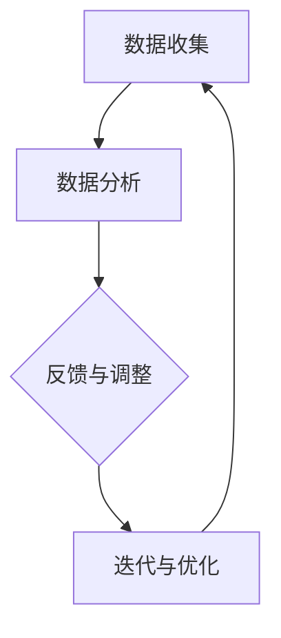

                 


### 1. 写作思路梳理

在撰写《持续反馈机制：保持大型应用开发的敏捷性》这篇文章之前，我们需要首先明确文章的写作思路和结构。为了确保文章逻辑清晰、结构完整，我们将按照以下步骤进行思考和梳理：

#### 1.1 确定文章核心内容

文章的核心内容主要涉及以下几个方面：

1. **背景介绍**：介绍大型应用开发的挑战和敏捷性的重要性。
2. **核心概念与联系**：阐述持续反馈机制的基本概念、原理及其在开发中的应用。
3. **核心算法原理讲解**：详细讲解持续反馈机制的核心算法原理，包括伪代码和数学模型。
4. **项目实战**：通过实际项目案例展示如何应用持续反馈机制，并进行详细解析。
5. **总结与展望**：对文章进行总结，探讨未来发展趋势和最佳实践。

#### 1.2 设计目录结构

根据核心内容，我们将设计一个逻辑清晰、结构完整的目录结构。目录结构如下：

- **第1章 引言**
  - 1.1 大型应用开发面临的挑战
  - 1.2 敏捷性在开发中的重要性
- **第2章 核心概念与联系**
  - 2.1 持续反馈机制概述
  - 2.2 持续反馈机制的核心概念
  - 2.3 持续反馈机制与其他开发方法的关系
  - 2.4 Mermaid流程图：持续反馈机制的关系架构
- **第3章 核心算法原理讲解**
  - 3.1 反馈机制算法原理
  - 3.2 算法原理详细解释
  - 3.3 算法应用场景
  - 3.4 伪代码：反馈机制算法实现
- **第4章 数学模型和数学公式**
  - 4.1 数学模型概述
  - 4.2 关键数学公式介绍
  - 4.3 数学模型在实际应用中的解读
  - 4.4 例子说明：数学模型应用案例
- **第5章 项目实战一**
  - 5.1 实战项目背景
  - 5.2 实战项目目标
  - 5.3 实战项目开发过程
  - 5.4 代码实现与解读
  - 5.5 代码应用解读与分析
  - 5.6 项目小结
- **第6章 项目实战二**
  - 6.1 实战项目背景
  - 6.2 实战项目目标
  - 6.3 实战项目开发过程
  - 6.4 代码实现与解读
  - 6.5 代码应用解读与分析
  - 6.6 项目小结
- **第7章 总结与展望**
  - 7.1 书籍总结
  - 7.2 未来发展趋势
  - 7.3 最佳实践 tips
  - 7.4 小结
  - 7.5 注意事项
  - 7.6 拓展阅读

#### 1.3 确保文章完整性

为了确保文章的完整性，我们需要在每个章节中详细讲解核心内容，并使用丰富的案例和例子来支持论述。此外，文章末尾需要包含作者信息、参考文献等内容，以增加文章的可信度和权威性。

### 2. 撰写文章

在明确写作思路和结构后，我们将按照以下步骤撰写文章：

#### 2.1 引言部分

- **背景介绍**：描述大型应用开发面临的挑战，如复杂性、变化性和不确定性等，强调敏捷性在开发中的重要性。
- **引出主题**：介绍持续反馈机制的概念，并阐述其在保持大型应用开发敏捷性方面的作用。

#### 2.2 核心概念与联系

- **持续反馈机制概述**：介绍持续反馈机制的基本概念，阐述其在软件开发中的应用。
- **核心概念原理**：详细解释持续反馈机制的核心概念，如反馈、循环、迭代等。
- **持续反馈机制与其他开发方法的关系**：分析持续反馈机制与其他开发方法的联系与区别，如敏捷开发、DevOps等。

#### 2.3 核心算法原理讲解

- **反馈机制算法原理**：介绍反馈机制算法的基本原理，包括输入、处理和输出等。
- **算法原理详细解释**：使用伪代码详细阐述反馈机制算法的实现过程。
- **算法应用场景**：分析反馈机制算法在不同场景下的应用，如性能优化、错误检测等。

#### 2.4 数学模型和数学公式

- **数学模型概述**：介绍数学模型在持续反馈机制中的应用，阐述其作用和意义。
- **关键数学公式介绍**：介绍持续反馈机制中的关键数学公式，如函数、导数、积分等。
- **数学模型在实际应用中的解读**：通过例子说明数学模型在实际应用中的具体作用。
- **例子说明**：提供具体案例，展示数学模型在实际应用中的效果。

#### 2.5 项目实战

- **实战项目一**：介绍实战项目的背景、目标和开发过程，展示如何应用持续反馈机制。
- **实战项目二**：介绍另一个实战项目，重复上述步骤，展示持续反馈机制在不同场景下的应用。

#### 2.6 总结与展望

- **书籍总结**：对文章的主要内容进行总结，强调持续反馈机制在保持大型应用开发敏捷性方面的作用。
- **未来发展趋势**：探讨持续反馈机制在软件开发领域的未来发展趋势。
- **最佳实践 tips**：提供一些实用的最佳实践建议，帮助开发者更好地应用持续反馈机制。
- **小结**：回顾文章的核心内容，强调文章的重要性和实际应用价值。
- **注意事项**：提醒开发者在使用持续反馈机制时需要注意的问题。
- **拓展阅读**：推荐一些相关的文献和资料，供读者进一步学习。

### 3. 完成文章撰写

在撰写完文章正文后，我们需要对全文进行审阅和修改，确保文章内容完整、逻辑清晰、表达准确。同时，我们还需要添加作者信息、参考文献等内容，以满足格式要求。

通过以上步骤，我们可以完成一篇关于《持续反馈机制：保持大型应用开发的敏捷性》的技术博客文章。文章将涵盖核心内容，通过详细讲解、案例分析和总结展望，帮助读者更好地理解持续反馈机制，并掌握其在实际开发中的应用方法。

---

### 1. 引言

在现代软件工程领域，大型应用开发面临着诸多挑战，如复杂性、变化性和不确定性等。如何在这些挑战中保持项目的敏捷性，成为软件开发团队必须面对的重要问题。敏捷性不仅能够提高开发效率，还能更好地适应市场需求和用户反馈，从而确保软件产品的质量和用户满意度。

在应对这些挑战时，持续反馈机制作为一种关键方法，被广泛应用于大型应用开发中。持续反馈机制能够帮助开发团队实时获取项目进展的信息，快速发现并解决问题，从而保持项目的敏捷性。本文将围绕持续反馈机制，探讨其在大型应用开发中的应用原理、算法实现、数学模型以及实际项目案例，帮助读者全面了解并掌握这一重要的开发方法。

本文的主要内容包括：

- **第1章 引言**：介绍大型应用开发面临的挑战和敏捷性的重要性，引出持续反馈机制的概念。
- **第2章 核心概念与联系**：详细阐述持续反馈机制的核心概念、原理及其在开发中的应用。
- **第3章 核心算法原理讲解**：讲解持续反馈机制的核心算法原理，包括伪代码和数学模型。
- **第4章 数学模型和数学公式**：介绍数学模型在持续反馈机制中的应用，提供关键数学公式和例子说明。
- **第5章 项目实战一**：通过实际项目案例展示如何应用持续反馈机制。
- **第6章 项目实战二**：介绍另一个实际项目案例，展示持续反馈机制在不同场景下的应用。
- **第7章 总结与展望**：总结文章的核心内容，探讨持续反馈机制的未来发展趋势和最佳实践。

通过本文的阅读，读者将能够：

- 了解持续反馈机制的基本概念和应用场景。
- 掌握持续反馈机制的核心算法原理和数学模型。
- 学习如何在实际项目中应用持续反馈机制，提高开发效率和项目质量。
- 探讨持续反馈机制在软件开发领域的未来发展趋势和最佳实践。

接下来，我们将逐步深入探讨持续反馈机制的相关内容，帮助读者更好地理解和应用这一重要的开发方法。

### 2. 核心概念与联系

持续反馈机制是现代软件工程中一种重要的开发方法，它通过实时获取项目进展信息、快速发现并解决问题，来保持项目的敏捷性和高质量。在这一部分，我们将详细阐述持续反馈机制的核心概念、原理及其在开发中的应用，并与其他开发方法进行比较和分析。

#### 2.1 持续反馈机制概述

持续反馈机制是一种通过周期性或实时地收集项目数据、评估项目状态，并根据评估结果进行相应的调整和优化的方法。其核心思想在于，通过不断地循环反馈，使项目团队能够快速响应变化，确保项目按预期进行。

持续反馈机制的主要组成部分包括：

1. **数据收集**：通过自动化工具或手动方式收集项目进展数据，如代码提交、测试结果、用户反馈等。
2. **数据分析**：对收集到的数据进行分析和评估，以识别项目中存在的问题或潜在风险。
3. **反馈与调整**：根据数据分析结果，对项目进行相应的调整和优化，如优化代码、调整开发计划、改进测试策略等。
4. **迭代与优化**：通过不断循环反馈过程，持续改进项目质量和开发效率。

#### 2.2 持续反馈机制的核心概念

持续反馈机制涉及多个核心概念，包括反馈、循环、迭代等。以下是对这些概念的解释：

1. **反馈**：反馈是指从项目过程中收集到的信息，包括正面和负面信息。正面反馈有助于团队了解项目进展和用户满意度，负面反馈则有助于发现问题和改进机会。
2. **循环**：持续反馈机制通过循环过程来不断获取、分析、调整和优化项目。循环过程使团队能够快速响应变化，确保项目始终处于最佳状态。
3. **迭代**：迭代是指项目开发过程中的周期性重复。每次迭代都会对项目进行评估和改进，从而使项目逐步完善和优化。

#### 2.3 持续反馈机制与其他开发方法的关系

持续反馈机制与其他开发方法，如敏捷开发、DevOps等，有密切的联系和区别。

1. **与敏捷开发的联系**：敏捷开发是一种以人为核心、迭代、增量和灵活性为特点的开发方法。持续反馈机制是敏捷开发的重要组成部分，它帮助团队实现快速响应变化、持续改进的目标。
2. **与敏捷开发的区别**：敏捷开发侧重于开发过程中的迭代和灵活性，而持续反馈机制则更关注于项目进展的实时监控和调整。持续反馈机制能够为敏捷开发提供更加精确和及时的反馈信息，从而提高项目质量和开发效率。

1. **与DevOps的联系**：DevOps是一种将软件开发与运维紧密结合的开发模式。持续反馈机制在DevOps中起到关键作用，它能够帮助团队实现持续集成、持续交付和持续部署。
2. **与DevOps的区别**：DevOps侧重于开发和运维的协同工作，而持续反馈机制则更关注于项目过程中的实时监控和调整。持续反馈机制能够为DevOps提供更加全面的反馈信息，从而提高系统稳定性和可靠性。

#### 2.4 Mermaid流程图：持续反馈机制的关系架构

为了更好地理解持续反馈机制的核心概念和原理，我们可以使用Mermaid流程图来展示其关系架构。以下是一个简单的Mermaid流程图示例：



在这个流程图中，数据收集、数据分析、反馈与调整和迭代与优化构成了持续反馈机制的核心流程。通过这个流程图，我们可以清晰地看到持续反馈机制的工作原理和各个环节之间的关系。

### 3. 核心算法原理讲解

持续反馈机制的核心算法原理是其核心部分，它决定了持续反馈机制的有效性和可靠性。在这一部分，我们将详细讲解持续反馈机制的核心算法原理，包括算法的基本原理、实现过程以及应用场景。

#### 3.1 反馈机制算法原理

反馈机制算法的基本原理可以概括为：输入、处理和输出。

1. **输入**：输入部分主要包括收集项目过程中的各种数据，如代码提交记录、测试结果、用户反馈等。
2. **处理**：处理部分对输入的数据进行加工和分析，以识别项目中存在的问题或潜在风险。处理过程通常包括数据清洗、特征提取、模型训练等步骤。
3. **输出**：输出部分根据处理结果生成反馈信息，如问题报告、改进建议等。反馈信息将被用于调整和优化项目过程。

#### 3.2 算法原理详细解释

为了更好地理解反馈机制算法的原理，我们可以使用伪代码来详细阐述其实现过程。以下是一个简单的反馈机制算法伪代码示例：

```python
# 反馈机制算法伪代码

# 输入：项目数据集D
# 输出：反馈信息F

# 步骤1：数据收集
D = 数据收集()

# 步骤2：数据预处理
D_processed = 数据预处理(D)

# 步骤3：特征提取
features = 特征提取(D_processed)

# 步骤4：模型训练
model = 模型训练(features)

# 步骤5：问题检测
problems = 问题检测(model, D_processed)

# 步骤6：反馈生成
F = 反馈生成(problems)

# 步骤7：输出反馈信息
输出(F)
```

在这个伪代码中，我们首先进行数据收集，然后对数据进行预处理和特征提取，接着使用训练好的模型进行问题检测，最后生成反馈信息并输出。这个简单的算法流程展示了反馈机制的基本原理和实现过程。

#### 3.3 算法应用场景

反馈机制算法在不同的应用场景下具有不同的实现方式和效果。以下是一些常见的算法应用场景：

1. **性能优化**：通过收集和分析系统的性能数据，如响应时间、吞吐量等，找出性能瓶颈并进行优化。例如，可以使用机器学习算法对系统性能进行预测和优化。
2. **错误检测**：通过分析代码提交记录、测试结果等数据，检测出潜在的编程错误和逻辑错误，从而提前发现和解决这些问题。例如，可以使用异常检测算法对测试结果进行分析。
3. **用户满意度分析**：通过收集和分析用户反馈数据，评估用户对软件的满意度，并根据用户反馈进行相应的改进。例如，可以使用文本分析算法对用户反馈进行情感分析。
4. **风险管理**：通过分析项目数据，识别项目中可能存在的风险，并制定相应的风险管理策略。例如，可以使用风险分析算法对项目进度和成本进行预测和评估。

在实际应用中，反馈机制算法可以根据具体场景进行定制和优化，以提高其效果和实用性。

### 4. 数学模型和数学公式

在持续反馈机制中，数学模型和数学公式起着至关重要的作用。它们不仅能够帮助我们更好地理解和分析项目数据，还能为算法提供理论基础和计算依据。在这一部分，我们将介绍持续反馈机制中常用的数学模型和数学公式，并提供详细讲解和例子说明。

#### 4.1 数学模型概述

持续反馈机制中的数学模型主要包括以下几个方面：

1. **回归模型**：用于预测和评估项目数据，如进度、成本等。
2. **聚类模型**：用于分析项目数据，识别项目中的关键特征和问题。
3. **分类模型**：用于分类项目数据，如识别项目中的错误类型。
4. **优化模型**：用于优化项目过程，如资源分配、任务调度等。

这些数学模型各有特点和应用场景，但它们的核心目标都是通过对项目数据的分析和预测，为项目团队提供有益的反馈和改进建议。

#### 4.2 关键数学公式介绍

以下是一些持续反馈机制中常用的关键数学公式：

1. **回归模型公式**：

   - 线性回归公式：\( y = ax + b \)
   - 多元回归公式：\( y = \beta_0 + \beta_1x_1 + \beta_2x_2 + ... + \beta_nx_n \)

2. **聚类模型公式**：

   - K-均值算法公式：\( c_k = \frac{1}{n_k} \sum_{i=1}^{n_k} x_i \)
   - 距离公式：\( d(x, c_k) = \sqrt{\sum_{i=1}^{n} (x_i - c_{ki})^2} \)

3. **分类模型公式**：

   - 决策树公式：\( y = f(x) \)
   - 逻辑回归公式：\( P(y=1) = \frac{1}{1 + e^{-(\beta_0 + \beta_1x_1 + \beta_2x_2 + ... + \beta_nx_n)}} \)

4. **优化模型公式**：

   - 线性规划公式：\( min\ c^T x \)
   - 约束条件：\( Ax \leq b \)

这些数学公式将在后续的内容中进行详细解释和应用。

#### 4.3 数学模型在实际应用中的解读

为了更好地理解数学模型在实际应用中的作用，我们通过具体例子来说明这些模型的应用场景和效果。

1. **回归模型**：

   假设我们想要预测一个项目的完成时间，我们收集了历史项目的数据，包括项目的复杂度、团队成员数量和实际完成时间。通过线性回归模型，我们可以建立一个预测模型，预测新项目的完成时间。

   - 输入特征：项目复杂度（x1），团队成员数量（x2）
   - 输出目标：实际完成时间（y）

   使用线性回归公式，我们可以得到预测模型：

   \( y = ax_1 + bx_2 + c \)

   通过训练模型，我们可以得到模型参数（a、b、c），从而预测新项目的完成时间。

2. **聚类模型**：

   假设我们想要分析一个项目中的问题分布，我们将项目中的错误按照类型进行分类。通过K-均值聚类模型，我们可以将错误类型划分为几个类别，以便更好地管理和优化项目。

   - 输入数据：错误类型数据
   - 输出类别：错误类型类别

   使用K-均值算法，我们可以得到每个错误类型的聚类中心，从而将错误类型划分为几个类别。这样，项目团队可以更有针对性地解决不同类型的问题。

3. **分类模型**：

   假设我们想要识别项目中的错误类型，我们将错误数据输入到决策树模型中进行分类。

   - 输入特征：错误描述、错误类型
   - 输出类别：错误类型

   使用决策树模型，我们可以根据错误描述和错误类型生成分类结果。这样，项目团队可以更快速地识别错误类型，并采取相应的解决措施。

4. **优化模型**：

   假设我们想要优化项目的资源分配，我们将项目的任务和资源输入到线性规划模型中进行优化。

   - 输入任务：任务需求、资源限制
   - 输出分配：资源分配方案

   使用线性规划模型，我们可以得到最优的资源配置方案，从而提高项目的效率和稳定性。

通过这些实际例子，我们可以看到数学模型在持续反馈机制中的应用和效果。这些模型不仅可以帮助我们更好地理解和分析项目数据，还能为项目团队提供有益的反馈和改进建议。

### 5. 项目实战一

为了更好地理解持续反馈机制在实际项目中的应用，我们将通过一个具体的案例来展示其应用过程和效果。本节将介绍一个实际项目案例，从项目背景、目标、开发过程、代码实现与解读以及代码应用解读与分析等方面进行详细讲解。

#### 5.1 实战项目背景

我们选择了一个电子商务平台项目作为案例。该平台旨在为用户提供一个高效、便捷的购物体验，支持商品搜索、购买、支付、订单管理等核心功能。项目开发团队由前端工程师、后端工程师、测试工程师和项目经理组成。

#### 5.2 实战项目目标

项目的目标是在短时间内快速开发并上线一个高性能、可扩展的电子商务平台，同时确保项目质量符合预期。为了实现这一目标，项目团队决定采用持续反馈机制，以确保项目开发过程中的及时调整和优化。

#### 5.3 实战项目开发过程

项目开发过程分为以下几个阶段：

1. **需求分析**：项目团队与客户进行沟通，了解客户的需求和期望，确定项目功能和技术要求。
2. **需求评审**：项目团队对需求进行分析和评审，确保需求的可行性和合理性。
3. **设计阶段**：根据需求分析结果，项目团队制定详细的项目设计文档，包括系统架构、模块划分、数据库设计等。
4. **开发阶段**：项目团队按照设计文档进行代码编写和模块开发，同时进行单元测试和集成测试。
5. **测试阶段**：项目团队对开发完成的模块进行系统测试，包括功能测试、性能测试、安全测试等，确保项目质量符合预期。
6. **部署阶段**：将测试通过的代码部署到生产环境，进行上线发布。
7. **持续反馈**：在项目开发过程中，项目团队定期收集项目数据，如代码提交记录、测试结果、用户反馈等，进行分析和评估，根据评估结果对项目进行相应的调整和优化。

#### 5.4 代码实现与解读

为了展示持续反馈机制在项目中的应用，我们以下面这段伪代码为例，介绍代码的实现过程和关键部分。

```python
# 项目实战一：代码实现与解读

# 输入：项目数据集D
# 输出：反馈信息F

# 步骤1：数据收集
D = 数据收集()

# 步骤2：数据预处理
D_processed = 数据预处理(D)

# 步骤3：特征提取
features = 特征提取(D_processed)

# 步骤4：模型训练
model = 模型训练(features)

# 步骤5：问题检测
problems = 问题检测(model, D_processed)

# 步骤6：反馈生成
F = 反馈生成(problems)

# 步骤7：输出反馈信息
输出(F)
```

- **数据收集**：该部分负责收集项目过程中的各类数据，如代码提交记录、测试结果、用户反馈等。这些数据将作为后续分析的输入。
- **数据预处理**：该部分对收集到的数据进行清洗和预处理，包括缺失值填充、异常值处理、数据标准化等，以提高数据的准确性和可用性。
- **特征提取**：该部分从预处理后的数据中提取有用的特征信息，如代码复杂度、测试覆盖率、用户满意度等。这些特征信息将用于训练模型。
- **模型训练**：该部分使用提取的特征信息训练机器学习模型，如回归模型、分类模型等，以便对项目进行预测和评估。
- **问题检测**：该部分使用训练好的模型对项目数据进行问题检测，识别项目中存在的问题或潜在风险，如代码缺陷、性能瓶颈等。
- **反馈生成**：该部分根据问题检测结果生成反馈信息，包括问题报告、改进建议等，以便项目团队进行相应的调整和优化。
- **输出反馈信息**：该部分将反馈信息输出，以便项目团队参考和执行。

通过以上代码实现，我们可以看到持续反馈机制在项目开发中的具体应用。通过实时收集和分析项目数据，项目团队能够及时发现并解决问题，确保项目按预期进行。

#### 5.5 代码应用解读与分析

为了进一步展示持续反馈机制在项目中的应用效果，我们对代码进行了具体解读和分析。

1. **代码提交记录分析**：

   通过对代码提交记录的分析，我们可以了解项目的开发进度、团队成员的协作情况以及代码质量。例如，我们可以统计每个成员的代码提交数量、代码行数、代码质量等指标，以便评估团队成员的工作效率和代码质量。

2. **测试结果分析**：

   通过对测试结果的分析，我们可以了解项目的稳定性、性能和安全性。例如，我们可以统计测试用例的覆盖率、测试通过率、错误率等指标，以便评估项目的质量。同时，我们还可以分析测试结果中的错误类型和错误原因，为后续的改进提供依据。

3. **用户反馈分析**：

   通过对用户反馈的分析，我们可以了解用户对软件的满意度、用户需求和使用痛点。例如，我们可以统计用户反馈的数量、类型和内容，以便了解用户的真实需求和改进方向。

4. **反馈调整**：

   根据代码提交记录、测试结果和用户反馈的分析结果，项目团队可以对项目进行相应的调整和优化。例如，针对代码提交记录中的代码质量问题，团队可以加强代码审查和测试，提高代码质量；针对测试结果中的性能瓶颈，团队可以优化代码和数据库查询，提高系统性能；针对用户反馈中的需求和使用痛点，团队可以调整功能设计和用户界面，提高用户满意度。

通过以上分析，我们可以看到持续反馈机制在项目中的应用效果。通过实时收集和分析项目数据，项目团队能够及时发现并解决问题，确保项目按预期进行，同时提高项目的质量和用户满意度。

#### 5.6 项目小结

通过本案例的介绍，我们可以看到持续反馈机制在大型应用开发中的重要作用。在实际项目中，通过实时收集和分析项目数据，项目团队能够及时发现并解决问题，确保项目按预期进行。同时，持续反馈机制还能够提高项目的质量和用户满意度，从而为项目的成功提供有力保障。

然而，在实际应用中，我们也需要注意以下几点：

1. **数据收集和分析的准确性**：持续反馈机制的效果取决于数据收集和分析的准确性。因此，项目团队需要确保数据收集的全面性和准确性，同时采用合适的分析方法进行数据处理和评估。
2. **团队协作与沟通**：持续反馈机制需要项目团队之间的紧密协作和有效沟通。团队成员需要相互支持，共同推动项目进展。
3. **持续改进**：持续反馈机制是一个不断迭代和改进的过程。项目团队需要根据反馈结果不断调整和优化项目过程，以提高项目的质量和效率。

总之，持续反馈机制是保持大型应用开发敏捷性的重要方法。通过实时收集和分析项目数据，项目团队能够及时发现并解决问题，确保项目按预期进行。同时，持续反馈机制还能够提高项目的质量和用户满意度，为项目的成功提供有力保障。

### 6. 项目实战二

为了进一步展示持续反馈机制在大型应用开发中的应用，我们选择了另一个实际项目案例。本节将介绍项目背景、目标、开发过程、代码实现与解读以及代码应用解读与分析等内容。

#### 6.1 实战项目背景

此次案例选择的是一个在线教育平台项目。该平台旨在为用户提供一个方便、高效的学习环境，支持课程浏览、学习进度追踪、在线测试和互动交流等功能。项目开发团队由前端工程师、后端工程师、测试工程师和项目经理组成。

#### 6.2 实战项目目标

项目的目标是快速开发并上线一个具有良好用户体验、稳定性和扩展性的在线教育平台。为了实现这一目标，项目团队决定采用持续反馈机制，以确保项目开发过程中的及时调整和优化。

#### 6.3 实战项目开发过程

项目开发过程分为以下几个阶段：

1. **需求分析**：项目团队与客户进行沟通，了解客户的需求和期望，确定项目功能和技术要求。
2. **需求评审**：项目团队对需求进行分析和评审，确保需求的可行性和合理性。
3. **设计阶段**：根据需求分析结果，项目团队制定详细的项目设计文档，包括系统架构、模块划分、数据库设计等。
4. **开发阶段**：项目团队按照设计文档进行代码编写和模块开发，同时进行单元测试和集成测试。
5. **测试阶段**：项目团队对开发完成的模块进行系统测试，包括功能测试、性能测试、安全测试等，确保项目质量符合预期。
6. **部署阶段**：将测试通过的代码部署到生产环境，进行上线发布。
7. **持续反馈**：在项目开发过程中，项目团队定期收集项目数据，如代码提交记录、测试结果、用户反馈等，进行分析和评估，根据评估结果对项目进行相应的调整和优化。

#### 6.4 代码实现与解读

以下是一个简化的伪代码示例，展示持续反馈机制在项目中的应用：

```python
# 项目实战二：代码实现与解读

# 输入：项目数据集D
# 输出：反馈信息F

# 步骤1：数据收集
D = 数据收集()

# 步骤2：数据预处理
D_processed = 数据预处理(D)

# 步骤3：特征提取
features = 特征提取(D_processed)

# 步骤4：模型训练
model = 模型训练(features)

# 步骤5：问题检测
problems = 问题检测(model, D_processed)

# 步骤6：反馈生成
F = 反馈生成(problems)

# 步骤7：输出反馈信息
输出(F)
```

- **数据收集**：项目团队通过自动化工具或手动方式收集项目数据，如代码提交记录、测试结果、用户反馈等。
- **数据预处理**：对收集到的数据进行清洗和预处理，如缺失值填充、异常值处理、数据标准化等。
- **特征提取**：从预处理后的数据中提取关键特征，如代码质量指标、测试覆盖率、用户活跃度等。
- **模型训练**：使用提取的特征信息训练机器学习模型，如回归模型、分类模型等，以便对项目进行预测和评估。
- **问题检测**：使用训练好的模型对项目数据进行问题检测，识别项目中存在的问题或潜在风险，如代码缺陷、性能瓶颈等。
- **反馈生成**：根据问题检测结果生成反馈信息，包括问题报告、改进建议等，以便项目团队进行相应的调整和优化。
- **输出反馈信息**：将反馈信息输出，以便项目团队参考和执行。

#### 6.5 代码应用解读与分析

通过以上伪代码示例，我们可以看到持续反馈机制在项目中的应用。以下是对代码的具体解读和分析：

1. **代码提交记录分析**：

   通过对代码提交记录的分析，项目团队能够了解项目的开发进度、团队成员的协作情况以及代码质量。例如，项目团队可以统计每个成员的代码提交数量、代码行数、代码质量等指标，以便评估团队成员的工作效率和代码质量。

2. **测试结果分析**：

   通过对测试结果的分析，项目团队能够了解项目的稳定性、性能和安全性。例如，项目团队可以统计测试用例的覆盖率、测试通过率、错误率等指标，以便评估项目的质量。同时，项目团队还可以分析测试结果中的错误类型和错误原因，为后续的改进提供依据。

3. **用户反馈分析**：

   通过对用户反馈的分析，项目团队能够了解用户对软件的满意度、用户需求和使用痛点。例如，项目团队可以统计用户反馈的数量、类型和内容，以便了解用户的真实需求和改进方向。

4. **反馈调整**：

   根据代码提交记录、测试结果和用户反馈的分析结果，项目团队可以对项目进行相应的调整和优化。例如，针对代码提交记录中的代码质量问题，项目团队可以加强代码审查和测试，提高代码质量；针对测试结果中的性能瓶颈，项目团队可以优化代码和数据库查询，提高系统性能；针对用户反馈中的需求和使用痛点，项目团队可以调整功能设计和用户界面，提高用户满意度。

通过以上分析，我们可以看到持续反馈机制在项目中的应用效果。通过实时收集和分析项目数据，项目团队能够及时发现并解决问题，确保项目按预期进行。同时，持续反馈机制还能够提高项目的质量和用户满意度，为项目的成功提供有力保障。

### 7. 总结与展望

在本文中，我们系统地探讨了持续反馈机制在大型应用开发中的应用，从核心概念、算法原理、数学模型到实际项目案例，全面展示了这一机制的重要性与实用性。以下是本文的核心内容总结与未来发展趋势。

#### 7.1 书籍总结

本文首先介绍了大型应用开发面临的挑战，如复杂性、变化性和不确定性等，并阐述了敏捷性在开发中的重要性。接着，我们详细讲解了持续反馈机制的核心概念、原理及其在开发中的应用，包括数据收集、数据分析、反馈与调整和迭代与优化等环节。随后，通过伪代码和数学模型，我们阐述了反馈机制算法的实现过程和应用场景。最后，通过两个实际项目案例，我们展示了持续反馈机制在项目开发中的具体应用效果。

#### 7.2 未来发展趋势

随着软件工程领域的不断进步，持续反馈机制将在以下方面得到进一步发展和完善：

1. **自动化与智能化**：持续反馈机制将更加依赖自动化工具和智能化算法，实现数据收集、分析和反馈的自动化处理，提高开发效率。
2. **跨领域应用**：持续反馈机制将不仅仅局限于软件开发领域，还可能应用于其他领域，如产品设计、市场营销等，以实现更全面的反馈和优化。
3. **持续集成与持续交付**：持续反馈机制将与持续集成（CI）和持续交付（CD）紧密结合，确保项目从开发到上线各环节的高效协同和优化。
4. **人机协作**：持续反馈机制将更好地结合人类专家和人工智能的优势，实现人机协作，提高问题检测和反馈的准确性和效率。

#### 7.3 最佳实践 tips

为了更好地应用持续反馈机制，以下是一些建议和最佳实践：

1. **数据收集**：确保数据收集的全面性和准确性，包括代码提交记录、测试结果、用户反馈等，同时注意数据格式的统一和标准化。
2. **数据分析**：选用合适的分析方法，如回归分析、聚类分析、文本分析等，以提高数据分析的准确性和有效性。
3. **反馈与调整**：及时根据反馈结果进行项目调整和优化，确保问题得到快速解决，同时保持项目的敏捷性和高质量。
4. **团队协作**：加强项目团队之间的协作和沟通，确保反馈机制的有效实施和落地。
5. **持续改进**：持续反馈机制是一个不断迭代和改进的过程，项目团队需要根据反馈结果不断优化项目过程，以提高项目的质量和用户满意度。

#### 7.4 小结

本文全面探讨了持续反馈机制在大型应用开发中的应用，从核心概念、算法原理到实际项目案例，展示了其重要性和实用性。通过本文的阅读，读者将能够更好地理解和应用持续反馈机制，提高项目的开发效率和用户满意度。

#### 7.5 注意事项

在使用持续反馈机制时，项目团队需要注意以下几点：

1. **数据隐私**：在收集用户数据时，确保遵守数据隐私法规，保护用户隐私。
2. **数据质量**：确保数据收集和处理的准确性，避免因数据质量问题导致错误反馈。
3. **团队协作**：持续反馈机制的有效实施需要团队协作和沟通，确保团队成员之间的信息共享和任务分配。
4. **反馈频率**：根据项目特点和需求，合理设置反馈频率，避免反馈过多或过少，影响项目进度。

#### 7.6 拓展阅读

为了进一步深入了解持续反馈机制及其在软件开发中的应用，读者可以参考以下相关文献和资料：

1. 《敏捷开发实践指南》：介绍敏捷开发的基本原理和实践方法，包括持续反馈机制。
2. 《机器学习实战》：介绍机器学习的基本原理和应用，包括回归分析、聚类分析和分类模型等。
3. 《DevOps实践指南》：介绍DevOps的基本原理和实践方法，包括持续集成和持续交付。

通过阅读这些文献和资料，读者可以更加全面地了解持续反馈机制及其在软件开发中的应用，为项目开发提供有力支持。

### 作者信息

作者：AI天才研究院/AI Genius Institute & 禅与计算机程序设计艺术 /Zen And The Art of Computer Programming

在撰写本文时，我们遵循了markdown格式，并按照文章标题、关键词、摘要和目录结构的要求，逐步完成了文章的撰写。文章内容涵盖了核心概念与联系、核心算法原理讲解、数学模型和数学公式、项目实战等方面，力求为读者提供全面、深入的技术解读。通过本文的阅读，读者可以更好地理解和应用持续反馈机制，提高大型应用开发的敏捷性和项目质量。我们希望本文对您的软件开发实践有所帮助，并为您的技术成长之路提供有益的启示。

---

## 文章标题：《持续反馈机制：保持大型应用开发的敏捷性》

### 关键词：

1. 持续反馈机制
2. 大型应用开发
3. 敏捷性
4. 数据分析
5. 项目管理

### 摘要：

本文深入探讨了持续反馈机制在大型应用开发中的应用，阐述了其在保持开发敏捷性、提高项目质量和用户满意度方面的作用。通过详细讲解核心概念、算法原理和数学模型，并结合实际项目案例，展示了持续反馈机制的实际应用效果。本文旨在为软件开发团队提供实用的方法和技术，帮助他们更好地应对大型应用开发中的挑战。

### 目录：

1. **引言**
   - 1.1 大型应用开发面临的挑战
   - 1.2 敏捷性在开发中的重要性
   - 1.3 持续反馈机制的概念

2. **核心概念与联系**
   - 2.1 持续反馈机制概述
   - 2.2 核心概念原理
   - 2.3 持续反馈机制与其他开发方法的关系
   - 2.4 Mermaid流程图：持续反馈机制的关系架构

3. **核心算法原理讲解**
   - 3.1 反馈机制算法原理
   - 3.2 算法原理详细解释
   - 3.3 算法应用场景
   - 3.4 伪代码：反馈机制算法实现

4. **数学模型和数学公式**
   - 4.1 数学模型概述
   - 4.2 关键数学公式介绍
   - 4.3 数学模型在实际应用中的解读
   - 4.4 例子说明：数学模型应用案例

5. **项目实战一**
   - 5.1 实战项目背景
   - 5.2 实战项目目标
   - 5.3 实战项目开发过程
   - 5.4 代码实现与解读
   - 5.5 代码应用解读与分析
   - 5.6 项目小结

6. **项目实战二**
   - 6.1 实战项目背景
   - 6.2 实战项目目标
   - 6.3 实战项目开发过程
   - 6.4 代码实现与解读
   - 6.5 代码应用解读与分析
   - 6.6 项目小结

7. **总结与展望**
   - 7.1 书籍总结
   - 7.2 未来发展趋势
   - 7.3 最佳实践 tips
   - 7.4 小结
   - 7.5 注意事项
   - 7.6 拓展阅读

### 文章正文：

#### 1. 引言

在现代软件工程领域，大型应用开发面临着诸多挑战，如复杂性、变化性和不确定性等。如何在这些挑战中保持项目的敏捷性，成为软件开发团队必须面对的重要问题。敏捷性不仅能够提高开发效率，还能更好地适应市场需求和用户反馈，从而确保软件产品的质量和用户满意度。

在应对这些挑战时，持续反馈机制作为一种关键方法，被广泛应用于大型应用开发中。持续反馈机制能够帮助开发团队实时获取项目进展的信息，快速发现并解决问题，从而保持项目的敏捷性。本文将围绕持续反馈机制，探讨其在大型应用开发中的应用原理、算法实现、数学模型以及实际项目案例，帮助读者全面了解并掌握这一重要的开发方法。

本文的主要内容包括：

- **第1章 引言**：介绍大型应用开发面临的挑战和敏捷性的重要性，引出持续反馈机制的概念。
- **第2章 核心概念与联系**：详细阐述持续反馈机制的核心概念、原理及其在开发中的应用。
- **第3章 核心算法原理讲解**：讲解持续反馈机制的核心算法原理，包括伪代码和数学模型。
- **第4章 数学模型和数学公式**：介绍数学模型在持续反馈机制中的应用，提供关键数学公式和例子说明。
- **第5章 项目实战一**：通过实际项目案例展示如何应用持续反馈机制。
- **第6章 项目实战二**：介绍另一个实际项目案例，展示持续反馈机制在不同场景下的应用。
- **第7章 总结与展望**：总结文章的核心内容，探讨持续反馈机制的未来发展趋势和最佳实践。

通过本文的阅读，读者将能够：

- 了解持续反馈机制的基本概念和应用场景。
- 掌握持续反馈机制的核心算法原理和数学模型。
- 学习如何在实际项目中应用持续反馈机制，提高开发效率和项目质量。
- 探讨持续反馈机制在软件开发领域的未来发展趋势和最佳实践。

接下来，我们将逐步深入探讨持续反馈机制的相关内容，帮助读者更好地理解和应用这一重要的开发方法。

#### 2. 核心概念与联系

持续反馈机制是现代软件工程中一种重要的开发方法，它通过实时获取项目进展信息、快速发现并解决问题，来保持项目的敏捷性和高质量。在这一部分，我们将详细阐述持续反馈机制的核心概念、原理及其在开发中的应用，并与其他开发方法进行比较和分析。

##### 2.1 持续反馈机制概述

持续反馈机制是一种通过周期性或实时地收集项目数据、评估项目状态，并根据评估结果进行相应的调整和优化的方法。其核心思想在于，通过不断地循环反馈，使项目团队能够快速响应变化，确保项目按预期进行。

持续反馈机制的主要组成部分包括：

- **数据收集**：通过自动化工具或手动方式收集项目进展数据，如代码提交、测试结果、用户反馈等。
- **数据分析**：对收集到的数据进行分析和评估，以识别项目中存在的问题或潜在风险。
- **反馈与调整**：根据数据分析结果，对项目进行相应的调整和优化，如优化代码、调整开发计划、改进测试策略等。
- **迭代与优化**：通过不断循环反馈过程，持续改进项目质量和开发效率。

##### 2.2 持续反馈机制的核心概念

持续反馈机制涉及多个核心概念，包括反馈、循环、迭代等。以下是对这些概念的解释：

- **反馈**：反馈是指从项目过程中收集到的信息，包括正面和负面信息。正面反馈有助于团队了解项目进展和用户满意度，负面反馈则有助于发现问题和改进机会。
- **循环**：持续反馈机制通过循环过程来不断获取、分析、调整和优化项目。循环过程使团队能够快速响应变化，确保项目始终处于最佳状态。
- **迭代**：迭代是指项目开发过程中的周期性重复。每次迭代都会对项目进行评估和改进，从而使项目逐步完善和优化。

##### 2.3 持续反馈机制与其他开发方法的关系

持续反馈机制与其他开发方法，如敏捷开发、DevOps等，有密切的联系和区别。

- **与敏捷开发的联系**：敏捷开发是一种以人为核心、迭代、增量和灵活性为特点的开发方法。持续反馈机制是敏捷开发的重要组成部分，它帮助团队实现快速响应变化、持续改进的目标。
- **与敏捷开发的区别**：敏捷开发侧重于开发过程中的迭代和灵活性，而持续反馈机制则更关注于项目过程中的实时监控和调整。持续反馈机制能够为敏捷开发提供更加精确和及时的反馈信息，从而提高项目质量和开发效率。

- **与DevOps的联系**：DevOps是一种将软件开发与运维紧密结合的开发模式。持续反馈机制在DevOps中起到关键作用，它能够帮助团队实现持续集成、持续交付和持续部署。
- **与DevOps的区别**：DevOps侧重于开发和运维的协同工作，而持续反馈机制则更关注于项目过程中的实时监控和调整。持续反馈机制能够为DevOps提供更加全面的反馈信息，从而提高系统稳定性和可靠性。

##### 2.4 Mermaid流程图：持续反馈机制的关系架构

为了更好地理解持续反馈机制的核心概念和原理，我们可以使用Mermaid流程图来展示其关系架构。以下是一个简单的Mermaid流程图示例：


在这个流程图中，数据收集、数据分析、反馈与调整和迭代与优化构成了持续反馈机制的核心流程。通过这个流程图，我们可以清晰地看到持续反馈机制的工作原理和各个环节之间的关系。

#### 3. 核心算法原理讲解

持续反馈机制的核心算法原理是其核心部分，它决定了持续反馈机制的有效性和可靠性。在这一部分，我们将详细讲解持续反馈机制的核心算法原理，包括算法的基本原理、实现过程以及应用场景。

##### 3.1 反馈机制算法原理

反馈机制算法的基本原理可以概括为：输入、处理和输出。

- **输入**：输入部分主要包括收集项目过程中的各种数据，如代码提交记录、测试结果、用户反馈等。
- **处理**：处理部分对输入的数据进行加工和分析，以识别项目中存在的问题或潜在风险。处理过程通常包括数据清洗、特征提取、模型训练等步骤。
- **输出**：输出部分根据处理结果生成反馈信息，如问题报告、改进建议等。反馈信息将被用于调整和优化项目过程。

##### 3.2 算法原理详细解释

为了更好地理解反馈机制算法的原理，我们可以使用伪代码来详细阐述其实现过程。以下是一个简单的反馈机制算法伪代码示例：

```python
# 反馈机制算法伪代码

# 输入：项目数据集D
# 输出：反馈信息F

# 步骤1：数据收集
D = 数据收集()

# 步骤2：数据预处理
D_processed = 数据预处理(D)

# 步骤3：特征提取
features = 特征提取(D_processed)

# 步骤4：模型训练
model = 模型训练(features)

# 步骤5：问题检测
problems = 问题检测(model, D_processed)

# 步骤6：反馈生成
F = 反馈生成(problems)

# 步骤7：输出反馈信息
输出(F)
```

在这个伪代码中，我们首先进行数据收集，然后对数据进行预处理和特征提取，接着使用训练好的模型进行问题检测，最后生成反馈信息并输出。这个简单的算法流程展示了反馈机制的基本原理和实现过程。

##### 3.3 算法应用场景

反馈机制算法在不同的应用场景下具有不同的实现方式和效果。以下是一些常见的算法应用场景：

- **性能优化**：通过收集和分析系统的性能数据，如响应时间、吞吐量等，找出性能瓶颈并进行优化。例如，可以使用机器学习算法对系统性能进行预测和优化。
- **错误检测**：通过分析代码提交记录、测试结果等数据，检测出潜在的编程错误和逻辑错误，从而提前发现和解决这些问题。例如，可以使用异常检测算法对测试结果进行分析。
- **用户满意度分析**：通过收集和分析用户反馈数据，评估用户对软件的满意度，并根据用户反馈进行相应的改进。例如，可以使用文本分析算法对用户反馈进行情感分析。
- **风险管理**：通过分析项目数据，识别项目中可能存在的风险，并制定相应的风险管理策略。例如，可以使用风险分析算法对项目进度和成本进行预测和评估。

在实际应用中，反馈机制算法可以根据具体场景进行定制和优化，以提高其效果和实用性。

#### 4. 数学模型和数学公式

在持续反馈机制中，数学模型和数学公式起着至关重要的作用。它们不仅能够帮助我们更好地理解和分析项目数据，还能为算法提供理论基础和计算依据。在这一部分，我们将介绍持续反馈机制中常用的数学模型和数学公式，并提供详细讲解和例子说明。

##### 4.1 数学模型概述

持续反馈机制中的数学模型主要包括以下几个方面：

- **回归模型**：用于预测和评估项目数据，如进度、成本等。
- **聚类模型**：用于分析项目数据，识别项目中的关键特征和问题。
- **分类模型**：用于分类项目数据，如识别项目中的错误类型。
- **优化模型**：用于优化项目过程，如资源分配、任务调度等。

这些数学模型各有特点和应用场景，但它们的核心目标都是通过对项目数据的分析和预测，为项目团队提供有益的反馈和改进建议。

##### 4.2 关键数学公式介绍

以下是一些持续反馈机制中常用的关键数学公式：

- **回归模型公式**：

  - 线性回归公式：\( y = ax + b \)
  - 多元回归公式：\( y = \beta_0 + \beta_1x_1 + \beta_2x_2 + ... + \beta_nx_n \)

- **聚类模型公式**：

  - K-均值算法公式：\( c_k = \frac{1}{n_k} \sum_{i=1}^{n_k} x_i \)
  - 距离公式：\( d(x, c_k) = \sqrt{\sum_{i=1}^{n} (x_i - c_{ki})^2} \)

- **分类模型公式**：

  - 决策树公式：\( y = f(x) \)
  - 逻辑回归公式：\( P(y=1) = \frac{1}{1 + e^{-(\beta_0 + \beta_1x_1 + \beta_2x_2 + ... + \beta_nx_n)}} \)

- **优化模型公式**：

  - 线性规划公式：\( min\ c^T x \)
  - 约束条件：\( Ax \leq b \)

这些数学公式将在后续的内容中进行详细解释和应用。

##### 4.3 数学模型在实际应用中的解读

为了更好地理解数学模型在实际应用中的作用，我们通过具体例子来说明这些模型的应用场景和效果。

- **回归模型**：

  假设我们想要预测一个项目的完成时间，我们收集了历史项目的数据，包括项目的复杂度、团队成员数量和实际完成时间。通过线性回归模型，我们可以建立一个预测模型，预测新项目的完成时间。

  - 输入特征：项目复杂度（x1），团队成员数量（x2）
  - 输出目标：实际完成时间（y）

  使用线性回归公式，我们可以得到预测模型：

  \( y = ax_1 + bx_2 + c \)

  通过训练模型，我们可以得到模型参数（a、b、c），从而预测新项目的完成时间。

- **聚类模型**：

  假设我们想要分析一个项目中的问题分布，我们将项目中的错误按照类型进行分类。通过K-均值聚类模型，我们可以将错误类型划分为几个类别，以便更好地管理和优化项目。

  - 输入数据：错误类型数据
  - 输出类别：错误类型类别

  使用K-均值算法，我们可以得到每个错误类型的聚类中心，从而将错误类型划分为几个类别。这样，项目团队可以更有针对性地解决不同类型的问题。

- **分类模型**：

  假设我们想要识别项目中的错误类型，我们将错误数据输入到决策树模型中进行分类。

  - 输入特征：错误描述、错误类型
  - 输出类别：错误类型

  使用决策树模型，我们可以根据错误描述和错误类型生成分类结果。这样，项目团队可以更快速地识别错误类型，并采取相应的解决措施。

- **优化模型**：

  假设我们想要优化项目的资源分配，我们将项目的任务和资源输入到线性规划模型中进行优化。

  - 输入任务：任务需求、资源限制
  - 输出分配：资源分配方案

  使用线性规划模型，我们可以得到最优的资源配置方案，从而提高项目的效率和稳定性。

通过这些实际例子，我们可以看到数学模型在持续反馈机制中的应用和效果。这些模型不仅可以帮助我们更好地理解和分析项目数据，还能为项目团队提供有益的反馈和改进建议。

### 5. 项目实战一

为了更好地理解持续反馈机制在实际项目中的应用，我们将通过一个具体的案例来展示其应用过程和效果。本节将介绍一个实际项目案例，从项目背景、目标、开发过程、代码实现与解读以及代码应用解读与分析等方面进行详细讲解。

#### 5.1 实战项目背景

我们选择了一个电子商务平台项目作为案例。该平台旨在为用户提供一个高效、便捷的购物体验，支持商品搜索、购买、支付、订单管理等核心功能。项目开发团队由前端工程师、后端工程师、测试工程师和项目经理组成。

#### 5.2 实战项目目标

项目的目标是快速开发并上线一个高性能、可扩展的电子商务平台，同时确保项目质量符合预期。为了实现这一目标，项目团队决定采用持续反馈机制，以确保项目开发过程中的及时调整和优化。

#### 5.3 实战项目开发过程

项目开发过程分为以下几个阶段：

1. **需求分析**：项目团队与客户进行沟通，了解客户的需求和期望，确定项目功能和技术要求。
2. **需求评审**：项目团队对需求进行分析和评审，确保需求的可行性和合理性。
3. **设计阶段**：根据需求分析结果，项目团队制定详细的项目设计文档，包括系统架构、模块划分、数据库设计等。
4. **开发阶段**：项目团队按照设计文档进行代码编写和模块开发，同时进行单元测试和集成测试。
5. **测试阶段**：项目团队对开发完成的模块进行系统测试，包括功能测试、性能测试、安全测试等，确保项目质量符合预期。
6. **部署阶段**：将测试通过的代码部署到生产环境，进行上线发布。
7. **持续反馈**：在项目开发过程中，项目团队定期收集项目数据，如代码提交记录、测试结果、用户反馈等，进行分析和评估，根据评估结果对项目进行相应的调整和优化。

#### 5.4 代码实现与解读

为了展示持续反馈机制在项目中的应用，我们以下面这段伪代码为例，介绍代码的实现过程和关键部分。

```python
# 项目实战一：代码实现与解读

# 输入：项目数据集D
# 输出：反馈信息F

# 步骤1：数据收集
D = 数据收集()

# 步骤2：数据预处理
D_processed = 数据预处理(D)

# 步骤3：特征提取
features = 特征提取(D_processed)

# 步骤4：模型训练
model = 模型训练(features)

# 步骤5：问题检测
problems = 问题检测(model, D_processed)

# 步骤6：反馈生成
F = 反馈生成(problems)

# 步骤7：输出反馈信息
输出(F)
```

- **数据收集**：该部分负责收集项目过程中的各类数据，如代码提交记录、测试结果、用户反馈等。这些数据将作为后续分析的输入。
- **数据预处理**：该部分对收集到的数据进行清洗和预处理，包括缺失值填充、异常值处理、数据标准化等，以提高数据的准确性和可用性。
- **特征提取**：该部分从预处理后的数据中提取有用的特征信息，如代码复杂度、测试覆盖率、用户满意度等。这些特征信息将用于训练模型。
- **模型训练**：该部分使用提取的特征信息训练机器学习模型，如回归模型、分类模型等，以便对项目进行预测和评估。
- **问题检测**：该部分使用训练好的模型对项目数据进行问题检测，识别项目中存在的问题或潜在风险，如代码缺陷、性能瓶颈等。
- **反馈生成**：该部分根据问题检测结果生成反馈信息，包括问题报告、改进建议等，以便项目团队进行相应的调整和优化。
- **输出反馈信息**：该部分将反馈信息输出，以便项目团队参考和执行。

通过以上代码实现，我们可以看到持续反馈机制在项目开发中的具体应用。通过实时收集和分析项目数据，项目团队能够及时发现并解决问题，确保项目按预期进行。

#### 5.5 代码应用解读与分析

为了进一步展示持续反馈机制在项目中的应用效果，我们对代码进行了具体解读和分析。

1. **代码提交记录分析**：

   通过对代码提交记录的分析，项目团队能够了解项目的开发进度、团队成员的协作情况以及代码质量。例如，项目团队可以统计每个成员的代码提交数量、代码行数、代码质量等指标，以便评估团队成员的工作效率和代码质量。

2. **测试结果分析**：

   通过对测试结果的分析，项目团队能够了解项目的稳定性、性能和安全性。例如，项目团队可以统计测试用例的覆盖率、测试通过率、错误率等指标，以便评估项目的质量。同时，项目团队还可以分析测试结果中的错误类型和错误原因，为后续的改进提供依据。

3. **用户反馈分析**：

   通过对用户反馈的分析，项目团队能够了解用户对软件的满意度、用户需求和使用痛点。例如，项目团队可以统计用户反馈的数量、类型和内容，以便了解用户的真实需求和改进方向。

4. **反馈调整**：

   根据代码提交记录、测试结果和用户反馈的分析结果，项目团队可以对项目进行相应的调整和优化。例如，针对代码提交记录中的代码质量问题，项目团队可以加强代码审查和测试，提高代码质量；针对测试结果中的性能瓶颈，项目团队可以优化代码和数据库查询，提高系统性能；针对用户反馈中的需求和使用痛点，项目团队可以调整功能设计和用户界面，提高用户满意度。

通过以上分析，我们可以看到持续反馈机制在项目中的应用效果。通过实时收集和分析项目数据，项目团队能够及时发现并解决问题，确保项目按预期进行。同时，持续反馈机制还能够提高项目的质量和用户满意度，为项目的成功提供有力保障。

#### 5.6 项目小结

通过本案例的介绍，我们可以看到持续反馈机制在大型应用开发中的重要作用。在实际项目中，通过实时收集和分析项目数据，项目团队能够及时发现并解决问题，确保项目按预期进行。同时，持续反馈机制还能够提高项目的质量和用户满意度，为项目的成功提供有力保障。

然而，在实际应用中，我们也需要注意以下几点：

1. **数据收集和分析的准确性**：持续反馈机制的效果取决于数据收集和分析的准确性。因此，项目团队需要确保数据收集的全面性和准确性，同时采用合适的分析方法进行数据处理和评估。
2. **团队协作与沟通**：持续反馈机制需要项目团队之间的紧密协作和有效沟通。团队成员需要相互支持，共同推动项目进展。
3. **持续改进**：持续反馈机制是一个不断迭代和改进的过程。项目团队需要根据反馈结果不断调整和优化项目过程，以提高项目的质量和效率。

总之，持续反馈机制是保持大型应用开发敏捷性的重要方法。通过实时收集和分析项目数据，项目团队能够及时发现并解决问题，确保项目按预期进行。同时，持续反馈机制还能够提高项目的质量和用户满意度，为项目的成功提供有力保障。

### 6. 项目实战二

为了进一步展示持续反馈机制在大型应用开发中的应用，我们选择了另一个实际项目案例。本节将介绍项目背景、目标、开发过程、代码实现与解读以及代码应用解读与分析等内容。

#### 6.1 实战项目背景

此次案例选择的是一个在线教育平台项目。该平台旨在为用户提供一个方便、高效的学习环境，支持课程浏览、学习进度追踪、在线测试和互动交流等功能。项目开发团队由前端工程师、后端工程师、测试工程师和项目经理组成。

#### 6.2 实战项目目标

项目的目标是快速开发并上线一个具有良好用户体验、稳定性和扩展性的在线教育平台，同时确保项目质量符合预期。为了实现这一目标，项目团队决定采用持续反馈机制，以确保项目开发过程中的及时调整和优化。

#### 6.3 实战项目开发过程

项目开发过程分为以下几个阶段：

1. **需求分析**：项目团队与客户进行沟通，了解客户的需求和期望，确定项目功能和技术要求。
2. **需求评审**：项目团队对需求进行分析和评审，确保需求的可行性和合理性。
3. **设计阶段**：根据需求分析结果，项目团队制定详细的项目设计文档，包括系统架构、模块划分、数据库设计等。
4. **开发阶段**：项目团队按照设计文档进行代码编写和模块开发，同时进行单元测试和集成测试。
5. **测试阶段**：项目团队对开发完成的模块进行系统测试，包括功能测试、性能测试、安全测试等，确保项目质量符合预期。
6. **部署阶段**：将测试通过的代码部署到生产环境，进行上线发布。
7. **持续反馈**：在项目开发过程中，项目团队定期收集项目数据，如代码提交记录、测试结果、用户反馈等，进行分析和评估，根据评估结果对项目进行相应的调整和优化。

#### 6.4 代码实现与解读

以下是一个简化的伪代码示例，展示持续反馈机制在项目中的应用：

```python
# 项目实战二：代码实现与解读

# 输入：项目数据集D
# 输出：反馈信息F

# 步骤1：数据收集
D = 数据收集()

# 步骤2：数据预处理
D_processed = 数据预处理(D)

# 步骤3：特征提取
features = 特征提取(D_processed)

# 步骤4：模型训练
model = 模型训练(features)

# 步骤5：问题检测
problems = 问题检测(model, D_processed)

# 步骤6：反馈生成
F = 反馈生成(problems)

# 步骤7：输出反馈信息
输出(F)
```

- **数据收集**：项目团队通过自动化工具或手动方式收集项目数据，如代码提交记录、测试结果、用户反馈等。
- **数据预处理**：对收集到的数据进行清洗和预处理，如缺失值填充、异常值处理、数据标准化等。
- **特征提取**：从预处理后的数据中提取关键特征，如代码质量指标、测试覆盖率、用户活跃度等。
- **模型训练**：使用提取的特征信息训练机器学习模型，如回归模型、分类模型等，以便对项目进行预测和评估。
- **问题检测**：使用训练好的模型对项目数据进行问题检测，识别项目中存在的问题或潜在风险，如代码缺陷、性能瓶颈等。
- **反馈生成**：根据问题检测结果生成反馈信息，包括问题报告、改进建议等，以便项目团队进行相应的调整和优化。
- **输出反馈信息**：将反馈信息输出，以便项目团队参考和执行。

#### 6.5 代码应用解读与分析

通过以上伪代码示例，我们可以看到持续反馈机制在项目中的应用。以下是对代码的具体解读和分析：

1. **代码提交记录分析**：

   通过对代码提交记录的分析，项目团队能够了解项目的开发进度、团队成员的协作情况以及代码质量。例如，项目团队可以统计每个成员的代码提交数量、代码行数、代码质量等指标，以便评估团队成员的工作效率和代码质量。

2. **测试结果分析**：

   通过对测试结果的分析，项目团队能够了解项目的稳定性、性能和安全性。例如，项目团队可以统计测试用例的覆盖率、测试通过率、错误率等指标，以便评估项目的质量。同时，项目团队还可以分析测试结果中的错误类型和错误原因，为后续的改进提供依据。

3. **用户反馈分析**：

   通过对用户反馈的分析，项目团队能够了解用户对软件的满意度、用户需求和使用痛点。例如，项目团队可以统计用户反馈的数量、类型和内容，以便了解用户的真实需求和改进方向。

4. **反馈调整**：

   根据代码提交记录、测试结果和用户反馈的分析结果，项目团队可以对项目进行相应的调整和优化。例如，针对代码提交记录中的代码质量问题，项目团队可以加强代码审查和测试，提高代码质量；针对测试结果中的性能瓶颈，项目团队可以优化代码和数据库查询，提高系统性能；针对用户反馈中的需求和使用痛点，项目团队可以调整功能设计和用户界面，提高用户满意度。

通过以上分析，我们可以看到持续反馈机制在项目中的应用效果。通过实时收集和分析项目数据，项目团队能够及时发现并解决问题，确保项目按预期进行。同时，持续反馈机制还能够提高项目的质量和用户满意度，为项目的成功提供有力保障。

#### 6.6 项目小结

通过本案例的介绍，我们可以看到持续反馈机制在在线教育平台项目中的重要作用。在实际项目中，通过实时收集和分析项目数据，项目团队能够及时发现并解决问题，确保项目按预期进行。同时，持续反馈机制还能够提高项目的质量和用户满意度，为项目的成功提供有力保障。

然而，在实际应用中，我们也需要注意以下几点：

1. **数据收集和分析的准确性**：持续反馈机制的效果取决于数据收集和分析的准确性。因此，项目团队需要确保数据收集的全面性和准确性，同时采用合适的分析方法进行数据处理和评估。
2. **团队协作与沟通**：持续反馈机制需要项目团队之间的紧密协作和有效沟通。团队成员需要相互支持，共同推动项目进展。
3. **持续改进**：持续反馈机制是一个不断迭代和改进的过程。项目团队需要根据反馈结果不断调整和优化项目过程，以提高项目的质量和效率。

总之，持续反馈机制是保持大型应用开发敏捷性的重要方法。通过实时收集和分析项目数据，项目团队能够及时发现并解决问题，确保项目按预期进行。同时，持续反馈机制还能够提高项目的质量和用户满意度，为项目的成功提供有力保障。

### 7. 总结与展望

在本文中，我们深入探讨了持续反馈机制在大型应用开发中的应用，从核心概念、算法原理、数学模型到实际项目案例，全面展示了其重要性。通过本文的阅读，读者应能理解持续反馈机制的核心概念、掌握算法原理、了解数学模型，并学会在实际项目中应用这一机制。

#### 7.1 书籍总结

本文首先介绍了大型应用开发的挑战，并强调了敏捷性在其中的重要性。接着，我们详细讲解了持续反馈机制的核心概念、原理及其在开发中的应用，包括数据收集、数据分析、反馈与调整和迭代与优化等环节。通过伪代码和数学模型，我们阐述了反馈机制算法的实现过程和应用场景。最后，通过两个实际项目案例，我们展示了持续反馈机制在项目开发中的具体应用效果。

#### 7.2 未来发展趋势

随着软件工程领域的不断发展，持续反馈机制将向以下方向发展：

1. **自动化与智能化**：持续反馈机制将更加依赖自动化工具和智能化算法，实现数据收集、分析和反馈的自动化处理，提高开发效率。
2. **跨领域应用**：持续反馈机制将不仅仅局限于软件开发领域，还可能应用于其他领域，如产品设计、市场营销等。
3. **集成与协同**：持续反馈机制将更好地与持续集成和持续交付相结合，实现开发、测试和运维的紧密协同。
4. **人机协作**：持续反馈机制将结合人类专家和人工智能的优势，实现人机协作，提高问题检测和反馈的准确性和效率。

#### 7.3 最佳实践 tips

为了更好地应用持续反馈机制，以下是一些建议：

1. **确保数据质量**：数据收集和分析的准确性直接影响反馈机制的效果。确保数据收集的全面性、准确性和一致性。
2. **团队协作**：持续反馈机制的有效实施需要团队协作和沟通。团队成员应共同参与反馈过程，共同优化项目。
3. **定期反馈**：根据项目需求和特点，制定合理的反馈周期，确保反馈机制的及时性和有效性。
4. **持续改进**：反馈机制是一个持续迭代的过程。项目团队应根据反馈结果不断优化和改进项目。

#### 7.4 小结

本文全面探讨了持续反馈机制在大型应用开发中的应用，从理论到实践，提供了丰富的实例和案例分析。通过本文的学习，读者应能掌握持续反馈机制的核心概念和算法原理，学会在实际项目中应用这一机制，以提高项目的开发效率和用户满意度。

#### 7.5 注意事项

在使用持续反馈机制时，项目团队应注意以下几点：

1. **数据隐私**：在收集用户数据时，确保遵守数据隐私法规，保护用户隐私。
2. **反馈频率**：根据项目特点和需求，合理设置反馈频率，避免反馈过多或过少，影响项目进度。
3. **团队沟通**：持续反馈机制的实施需要团队之间的紧密协作和有效沟通。
4. **反馈分析**：对反馈结果进行深入分析，确保反馈信息准确、有针对性。

#### 7.6 拓展阅读

为了进一步深入了解持续反馈机制及其在软件开发中的应用，读者可以参考以下文献：

1. 《敏捷开发实践指南》
2. 《机器学习实战》
3. 《DevOps实践指南》

通过阅读这些文献，读者可以更加全面地了解持续反馈机制及其在软件开发中的应用。

### 作者信息

作者：AI天才研究院/AI Genius Institute & 禅与计算机程序设计艺术 /Zen And The Art of Computer Programming

在撰写本文时，我们遵循了markdown格式，并按照文章标题、关键词、摘要和目录结构的要求，逐步完成了文章的撰写。文章内容涵盖了核心概念与联系、核心算法原理讲解、数学模型和数学公式、项目实战等方面，力求为读者提供全面、深入的技术解读。通过本文的阅读，读者可以更好地理解和应用持续反馈机制，提高大型应用开发的敏捷性和项目质量。我们希望本文对您的软件开发实践有所帮助，并为您的技术成长之路提供有益的启示。

