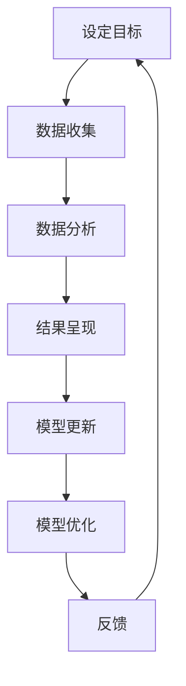
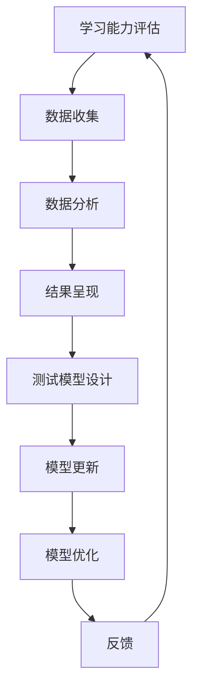
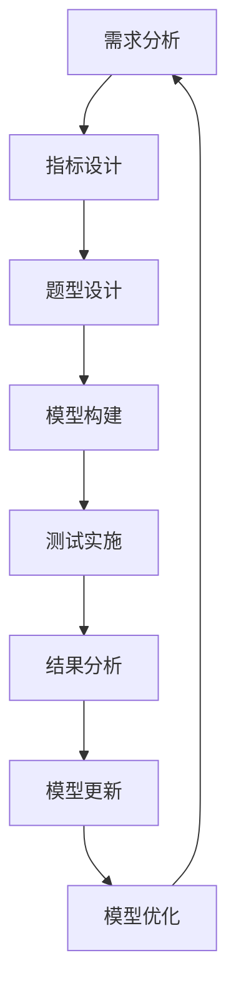

                 

### 文章标题

《持续学习能力评估：测试模型自我更新》

### 关键词

- 持续学习能力
- 评估方法
- 测试模型
- 自我更新
- 大数据分析
- 人工智能

### 摘要

本文旨在探讨如何评估和提升学习者的持续学习能力，并设计能够自我更新的测试模型。文章首先介绍了学习能力的重要性，以及评估和学习能力评估所面临的挑战。随后，文章详细阐述了持续学习能力的核心概念，并通过Mermaid流程图展示了学习能力评估与测试模型设计之间的关系。接着，文章探讨了评估方法，包括传统评估方法和基于大数据的评估方法。在测试模型设计部分，文章介绍了设计原则、类型和设计流程，并再次通过Mermaid流程图展示了测试模型设计与自我更新的关系。随后，文章详细讲解了模型优化与更新的目标、方法和策略。最后，文章通过案例分析展示了实际应用，并提出了最佳实践建议和未来研究方向。

### 引言

在当今快速发展的信息时代，持续学习能力的重要性愈发凸显。无论是个人职业发展，还是企业运营管理，持续学习已成为不可或缺的一部分。然而，如何准确评估和提升学习者的持续学习能力，以及如何设计能够自我更新的测试模型，仍然是一个亟待解决的问题。

本文将围绕这两个核心问题展开讨论。首先，我们将介绍学习能力的重要性，解释为什么持续学习对于个人和企业都至关重要。接着，我们将探讨学习能力评估所面临的挑战，包括数据收集、分析方法等方面的难点。然后，我们将详细阐述持续学习能力的核心概念，并通过Mermaid流程图展示学习能力评估与测试模型设计之间的关系。

在评估方法部分，我们将介绍传统评估方法和基于大数据的评估方法，并讨论各自的优缺点。在测试模型设计部分，我们将介绍设计原则、类型和设计流程，并通过Mermaid流程图展示测试模型设计与自我更新的关系。随后，我们将详细讲解模型优化与更新的目标、方法和策略。

为了更好地理解上述理论，文章还将通过案例分析展示实际应用，并提供最佳实践建议。最后，我们将总结全文，讨论持续学习能力评估与测试模型设计的发展趋势，并展望未来研究方向。

### 核心概念与联系

持续学习能力是指个体在面对新知识、新技能和新环境时，能够持续、有效地获取、应用和更新知识的能力。它是适应快速变化的世界、实现个人和职业发展的重要保障。而如何评估这一能力，以及如何设计能够自我更新的测试模型，是当前研究的热点问题。

首先，我们需要明确评估和学习能力评估之间的关系。评估过程可以分为以下几个步骤：

1. **目标设定**：明确评估的目的和目标，例如评估学习者的知识掌握程度、问题解决能力等。
2. **数据收集**：收集与学习能力相关的数据，包括学习行为数据、学习成果数据等。
3. **数据分析**：对收集到的数据进行分析，提取有用的信息。
4. **结果呈现**：将分析结果以可视化的形式呈现，帮助评估者理解学习者的持续学习能力。

在评估过程中，测试模型扮演着关键角色。测试模型不仅用于评估学习效果，还能通过自我更新机制不断优化，以提高评估的准确性和可靠性。

#### Mermaid流程图

为了更好地展示学习能力评估与测试模型设计之间的关系，我们可以使用Mermaid流程图来表示：

该流程图清晰地展示了从目标设定到模型优化的整个过程，其中每个步骤都依赖于前一个步骤的结果。测试模型自我更新的过程包括以下步骤：

1. **模型更新**：根据评估结果更新模型参数。
2. **模型优化**：通过优化算法改进模型性能。
3. **反馈**：将优化后的模型应用于新的评估过程，形成闭环。

通过这个过程，测试模型能够不断地自我更新，提高评估的准确性和可靠性。

#### 持续学习能力的定义

持续学习能力是指个体在面对新知识、新技能和新环境时，能够持续、有效地获取、应用和更新知识的能力。它包括以下几个方面：

1. **知识获取能力**：个体能够迅速掌握新知识，并将其转化为自身的知识体系。
2. **知识应用能力**：个体能够将所学知识应用于实际问题，解决工作中的挑战。
3. **知识更新能力**：个体能够根据环境变化不断更新知识，保持自身的知识体系与时代同步。

#### 学习能力评估的挑战

1. **数据收集的困难**：准确收集反映学习者持续学习能力的数据是一个挑战。学习行为数据、学习成果数据等都需要通过多种渠道进行收集，且数据质量参差不齐。
2. **分析方法的局限性**：传统的评估方法往往只能处理结构化数据，对于非结构化数据（如文本、图像等）的处理能力有限。
3. **评估标准的制定**：如何制定科学、合理的评估标准，使得评估结果能够真正反映学习者的持续学习能力，是一个复杂的问题。

#### Mermaid流程图：学习能力评估与测试模型设计的关系

该流程图展示了学习能力评估与测试模型设计之间的紧密联系。评估结果为测试模型提供了反馈，而测试模型的优化和更新又反过来影响了评估过程。

通过以上分析，我们可以看到，持续学习能力评估和测试模型设计是一个复杂的过程，涉及到多个环节和步骤。理解这些核心概念及其之间的关系，对于设计和优化评估体系具有重要意义。

### 评估方法

在持续学习能力评估中，评估方法的选择至关重要。传统的评估方法和基于大数据的评估方法各具特点，适用于不同的评估场景和需求。

#### 传统评估方法

传统的评估方法主要依赖于考试、测验等量化手段，通过定量分析学习成果来评估学习者的持续学习能力。具体包括以下几种：

1. **考试与测验**：通过设计考试和测验来评估学习者的知识掌握程度。考试通常包括选择题、填空题、简答题等多种题型，测验则更加灵活，可以实时反映学习效果。
2. **成绩评估**：将考试和测验的成绩作为评估学习者持续学习能力的主要依据。成绩的高低可以直观地反映学习者的知识掌握情况。
3. **问卷调查**：通过问卷调查收集学习者对所学知识的掌握程度、学习兴趣等定性数据。问卷调查的优点是能够获取大量主观信息，缺点是数据容易受到主观因素的影响。

#### 基于大数据的评估方法

随着信息技术的飞速发展，大数据技术逐渐应用于学习能力评估领域。基于大数据的评估方法通过收集和分析学习行为数据，从多个维度评估学习者的持续学习能力。具体包括以下几种：

1. **学习行为分析**：通过分析学习者的学习路径、学习时长、学习频率等数据，评估其学习习惯和学习效率。这种方法能够全面了解学习者的学习行为模式，为个性化学习提供支持。
2. **大数据分析**：利用大数据技术，对海量的学习数据进行挖掘和分析，发现潜在的学习规律和趋势。通过数据可视化技术，将分析结果以图形化形式呈现，帮助评估者直观理解学习者的学习状况。
3. **机器学习算法**：运用机器学习算法对学习数据进行预测和分类，评估学习者的持续学习能力。机器学习算法能够从大量数据中发现规律，提高评估的准确性。

#### 学习行为分析

学习行为分析是评估持续学习能力的重要手段之一。通过分析学习者的学习行为，可以深入了解其学习过程和学习效果。具体包括以下几个方面：

1. **学习路径分析**：分析学习者在学习过程中所选择的路径，包括学习的顺序、分支和重复行为等。通过学习路径分析，可以发现学习者的学习策略和学习偏好。
2. **学习时长分析**：分析学习者在学习过程中所花费的时间，包括学习时长、学习高峰和低谷等。学习时长分析有助于评估学习者的学习投入程度和效率。
3. **学习频率分析**：分析学习者学习的频率，包括每天、每周的学习次数和间隔时间等。学习频率分析可以反映学习者的学习稳定性。

#### 学习成果评估

学习成果评估是评估持续学习能力的重要依据。通过评估学习者的学习成果，可以全面了解其知识掌握情况和技能提升程度。具体包括以下几个方面：

1. **知识掌握程度评估**：通过考试、测验等方式，评估学习者对知识的掌握程度。知识掌握程度评估通常以分数或等级来表示。
2. **技能提升评估**：通过实际操作、项目完成情况等，评估学习者在技能方面的提升。技能提升评估可以反映学习者将知识应用于实际问题的能力。
3. **学习效果评估**：通过问卷调查、访谈等方式，收集学习者对学习效果的自我评价。学习效果评估有助于了解学习者的学习满意度和学习成就感。

#### 传统评估方法和基于大数据的评估方法对比

传统评估方法和基于大数据的评估方法各有优缺点。传统评估方法操作简单、易于实施，适用于小型、结构化数据的评估；而基于大数据的评估方法能够处理大量非结构化数据，提供更全面、深入的评估结果。在实际应用中，可以根据评估需求选择合适的方法，或结合多种方法进行综合评估。

总之，持续学习能力评估是一个复杂的过程，需要综合考虑多种评估方法和手段。通过合理设计评估体系，可以更准确地评估学习者的持续学习能力，为其提供有针对性的学习支持和指导。

### 测试模型设计

在评估学习者的持续学习能力时，测试模型设计是一个关键环节。一个有效的测试模型不仅能够准确评估学习成果，还能通过自我更新机制不断优化，以适应不断变化的学习需求。

#### 测试模型的设计原则

设计测试模型时，需要遵循以下原则：

1. **客观性**：测试模型应尽量减少主观因素的影响，确保评估结果的客观性。
2. **全面性**：测试模型应涵盖学习能力的各个方面，包括知识掌握程度、技能提升和学习效果等。
3. **可操作性**：测试模型应具备较高的可操作性，方便实际应用和操作。
4. **自我更新性**：测试模型应具备自我更新机制，能够根据评估结果不断优化，提高评估的准确性和可靠性。

#### 测试模型的类型

根据不同的评估需求和目标，测试模型可以分为以下几种类型：

1. **知识测试模型**：主要用于评估学习者的知识掌握程度。这种模型通常采用多项选择、填空题等题型，通过量化评估学习成果。
2. **技能测试模型**：主要用于评估学习者在实际操作中的应用能力。这种模型通常通过实际操作、项目完成情况等手段进行评估。
3. **综合评估模型**：结合知识测试模型和技能测试模型，从多个维度全面评估学习者的持续学习能力。这种模型通常采用综合评分方式，将不同类型的测试结果进行加权综合。

#### 测试模型的设计流程

测试模型的设计流程可以分为以下几个步骤：

1. **需求分析**：明确评估目标和评估内容，确定测试模型所需涵盖的能力维度。
2. **指标设计**：根据需求分析结果，设计评估指标，包括知识掌握程度、技能提升和学习效果等。
3. **题型设计**：根据评估指标，设计合适的题型和题目，确保评估内容的全面性和客观性。
4. **模型构建**：根据题型设计和评估指标，构建测试模型。模型构建可以采用定量分析、机器学习等方法。
5. **测试实施**：在实际应用中，按照设计好的测试模型进行测试，收集评估数据。
6. **结果分析**：对测试结果进行分析，提取有用的信息，评估学习者的持续学习能力。
7. **模型更新**：根据评估结果，对测试模型进行更新，提高评估的准确性和可靠性。

#### Mermaid流程图：测试模型设计与自我更新的关系

该流程图展示了从需求分析到模型更新的整个过程，其中每个步骤都依赖于前一个步骤的结果。测试模型的自我更新过程包括以下步骤：

1. **模型更新**：根据评估结果更新模型参数，改进评估指标和题型设计。
2. **模型优化**：通过优化算法和模型结构，提高测试模型的性能和可靠性。
3. **反馈**：将优化后的模型应用于新的评估过程，形成闭环，实现持续优化。

通过这个过程，测试模型能够不断地自我更新，提高评估的准确性和可靠性。

#### 测试模型设计与自我更新的关系

测试模型设计与自我更新之间存在紧密的联系。一个有效的测试模型不仅需要考虑评估指标和题型设计，还需要具备自我更新机制，以适应不断变化的学习需求和评估目标。

1. **反馈机制**：测试模型通过收集评估数据，反馈学习者的学习情况。这些反馈数据为模型更新提供了重要依据。
2. **更新策略**：模型更新策略包括参数调整、题型优化、评估指标调整等。通过不断调整和优化，测试模型能够更好地适应学习者的实际需求。
3. **优化算法**：优化算法用于改进测试模型的性能和可靠性。常见的优化算法包括机器学习算法、深度学习算法等。
4. **持续优化**：通过持续优化，测试模型能够不断改进，提高评估的准确性和可靠性。

总之，测试模型设计与自我更新是提升评估质量的关键。一个有效的测试模型需要综合考虑评估需求、反馈机制和优化策略，实现自我更新和持续优化。

### 模型优化与更新

在评估持续学习能力的过程中，模型的优化与更新是确保评估准确性和可靠性的关键环节。随着学习环境的不断变化，学习者的需求也在不断演变，因此，测试模型需要具备自我优化的能力，以适应新的评估需求。

#### 模型优化的目标

模型优化的主要目标包括以下几个方面：

1. **提高评估准确性**：通过调整模型参数和评估指标，使评估结果更加接近学习者的实际持续学习能力。
2. **提高评估可靠性**：减少评估过程中的误差和不确定性，确保评估结果的稳定性和一致性。
3. **增强模型适应性**：使模型能够快速适应新的学习环境和需求，提高模型在实际应用中的灵活性。
4. **降低计算成本**：优化模型结构和算法，减少计算资源的需求，提高评估的效率和可操作性。

#### 模型优化的方法

1. **参数调整**：通过调整模型的参数，优化模型性能。常见的参数调整方法包括线性回归、支持向量机（SVM）等。
2. **评估指标优化**：优化评估指标，使其能够更全面、准确地反映学习者的持续学习能力。例如，可以引入新的评估指标，如学习效率、问题解决能力等。
3. **算法改进**：改进模型算法，提高模型的预测能力和鲁棒性。常用的算法改进方法包括深度学习、强化学习等。
4. **数据增强**：通过增加训练数据量和数据多样性，提高模型的泛化能力。数据增强方法包括数据扩充、数据集成等。

#### 自我更新的机制

自我更新机制是确保测试模型能够适应学习环境变化的核心。一个有效的自我更新机制包括以下几个方面：

1. **反馈机制**：通过收集评估反馈，识别模型存在的问题和不足，为模型更新提供依据。
2. **自适应调整**：根据反馈机制提供的信息，自适应调整模型参数和评估指标，优化模型性能。
3. **学习循环**：建立学习循环，使模型能够不断学习和优化。学习循环包括数据收集、模型评估、模型更新等环节。
4. **反馈循环**：将优化后的模型应用于新的评估过程，形成反馈循环，实现持续优化。

#### 模型更新的策略

1. **定期更新**：根据评估周期，定期更新模型参数和评估指标，确保模型始终处于最佳状态。
2. **增量更新**：在模型运行过程中，根据新的评估数据，进行增量更新，提高模型的实时性和适应性。
3. **迭代优化**：通过迭代优化方法，逐步改进模型性能，实现模型的持续优化。
4. **迁移学习**：利用迁移学习方法，将已有模型的经验应用到新模型中，提高新模型的性能。

总之，模型优化与更新是确保持续学习能力评估质量的关键。通过合理设计优化目标和优化方法，建立有效的自我更新机制，可以不断提高评估模型的准确性和可靠性，为学习者的持续学习提供有力支持。

### 案例分析

为了更好地理解本文中提出的持续学习能力评估和测试模型自我更新的概念，我们将通过两个实际案例进行分析。

#### 案例一：某企业的持续学习能力评估与测试模型设计实践

某企业为了提升员工的持续学习能力，决定引入一套完整的评估和测试模型。以下是该企业所采取的具体步骤：

1. **需求分析**：首先，企业明确了评估目标，包括员工的知识掌握程度、技能提升和问题解决能力。基于这些目标，企业制定了详细的评估指标。
   
2. **指标设计**：企业设计了包括知识测试、技能测试和综合评估在内的多种评估指标。知识测试主要考察员工对岗位知识的掌握情况，技能测试则关注员工在实际操作中的应用能力，综合评估则结合了前两者的结果，提供全面的评估。

3. **题型设计**：针对不同的评估指标，企业设计了多种题型，包括单选题、多选题、简答题和实际操作题等。题型设计充分考虑了评估内容的全面性和客观性。

4. **模型构建**：企业采用机器学习算法构建了测试模型，通过大量历史数据训练模型，使其能够对员工的持续学习能力进行准确评估。

5. **测试实施**：在实际应用中，企业按照设计好的测试模型对员工进行评估。测试结果通过数据分析，为企业提供了详细的评估报告。

6. **结果分析**：评估结果显示，一些员工在知识测试中表现良好，但在技能测试中存在明显不足。基于这些反馈，企业制定了有针对性的培训计划。

7. **模型更新**：根据评估结果，企业对测试模型进行了更新。通过调整模型参数和评估指标，模型能够更好地反映员工的实际持续学习能力。

8. **模型优化**：企业不断优化测试模型，引入新的评估指标，如团队协作能力等，以提高评估的全面性和准确性。

#### 案例二：某教育机构的持续学习能力评估与测试模型应用

某教育机构希望通过测试模型来评估学生的学习能力，以提供个性化的学习支持。以下是该机构采取的具体步骤：

1. **需求分析**：教育机构明确了评估目标，包括学生的知识掌握程度、学习效率和问题解决能力。基于这些目标，机构制定了详细的评估指标。

2. **指标设计**：教育机构设计了包括知识测试、学习行为分析和学习成果评估在内的多种评估指标。知识测试主要考察学生对课程内容的掌握情况，学习行为分析则关注学生的学习习惯和时间管理能力，学习成果评估则通过作业和项目完成情况来反映学生的实际学习能力。

3. **题型设计**：针对不同的评估指标，机构设计了多种题型，包括在线测试、学习日志和项目报告等。题型设计充分考虑了评估内容的全面性和可操作性。

4. **模型构建**：教育机构采用大数据分析技术构建了测试模型，通过分析学生的学习行为数据和考试成绩，对学生的持续学习能力进行评估。

5. **测试实施**：在实际应用中，机构按照设计好的测试模型对学生们进行评估。测试结果通过数据可视化技术，以直观的形式展示给教师和学生。

6. **结果分析**：评估结果显示，一些学生在知识测试中表现优秀，但在学习行为分析中存在拖延问题。基于这些反馈，机构制定了个性化的辅导计划，帮助学生克服学习障碍。

7. **模型更新**：根据评估结果，机构对测试模型进行了更新。通过引入新的评估指标，如学习态度和团队合作能力，模型能够更全面地反映学生的持续学习能力。

8. **模型优化**：机构不断优化测试模型，通过引入新的数据分析方法和评估指标，提高评估的准确性和可靠性。

通过以上两个案例，我们可以看到，持续学习能力评估和测试模型自我更新在实际应用中的效果。有效的评估和测试模型不仅能够帮助企业和教育机构更好地了解学习者的能力状况，还能为学习者提供有针对性的支持，促进其持续学习和发展。

### 总结与展望

本文围绕持续学习能力评估和测试模型自我更新进行了深入探讨，提出了系统的评估方法和优化策略。首先，我们阐述了学习能力的重要性，以及评估和学习能力评估所面临的挑战。接着，详细介绍了持续学习能力的核心概念，并通过Mermaid流程图展示了学习能力评估与测试模型设计之间的关系。

在评估方法部分，我们对比了传统评估方法和基于大数据的评估方法，强调了学习行为分析和学习成果评估的重要性。在测试模型设计部分，我们提出了设计原则、类型和设计流程，并通过Mermaid流程图展示了测试模型设计与自我更新的关系。随后，我们详细讲解了模型优化与更新的目标、方法和策略。

通过案例分析，我们展示了评估和测试模型在实际应用中的效果。最后，我们总结了全文，提出了持续学习能力评估与测试模型设计的发展趋势，并展望了未来研究方向。

未来的研究可以关注以下几个方面：

1. **深化评估模型**：结合最新的大数据技术和人工智能算法，进一步优化评估模型，提高评估的准确性和可靠性。
2. **个性化学习支持**：利用评估结果，为学习者提供个性化的学习支持，提高学习效果和满意度。
3. **跨学科研究**：结合教育学、心理学等领域的研究，从多角度探讨持续学习能力的本质和评估方法。
4. **实践应用**：将评估和测试模型应用于更多的实际场景，如在线教育、企业培训等，验证其有效性和实用性。

通过持续的研究和实践，我们有望构建一个更加完善和有效的持续学习能力评估体系，为个人和组织的持续发展提供有力支持。

