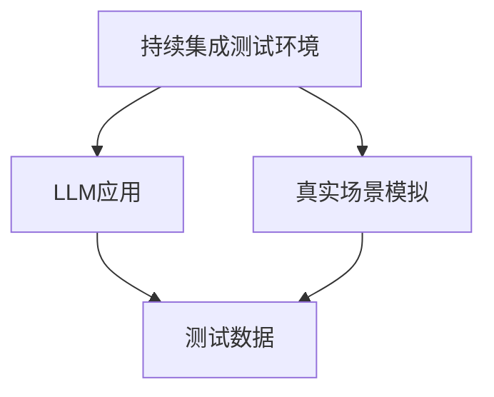

                 

## 文章标题

### 持续集成测试环境：模拟LLM应用的真实场景

#### 关键词：
- 持续集成测试环境
- LLM应用
- 真实场景模拟
- 测试环境搭建
- 数学模型
- 伪代码

#### 摘要：
本文深入探讨了持续集成测试环境在模拟大型语言模型（LLM）应用的真实场景中的重要性。文章首先介绍了持续集成测试环境的基本概念和LLM应用的背景，然后详细分析了核心算法原理，包括数学模型和公式。通过实际项目案例，本文展示了如何搭建测试环境并模拟LLM应用场景，同时提供了详细的开发环境搭建和源代码实现与解读。最后，文章对项目进行了总结，并展望了未来的发展方向。

---

### 引言

在当今快速发展的技术时代，人工智能（AI）正逐渐渗透到各个行业，其中大型语言模型（LLM）的应用尤为引人注目。LLM能够处理复杂的自然语言任务，如文本生成、机器翻译和情感分析等。然而，这些模型的开发和应用面临着诸多挑战，特别是确保其在实际场景中的性能和稳定性。因此，构建一个可靠的持续集成测试环境变得至关重要。

持续集成测试环境是一种软件开发流程，它确保代码的每次提交都能通过一系列自动化测试，从而快速发现和修复潜在问题。对于LLM应用而言，测试环境不仅要模拟真实的使用场景，还要能够处理大量的数据，以验证模型的鲁棒性和准确性。本文将深入探讨如何构建这样的测试环境，并模拟LLM应用的真实场景。

本文的结构如下：

1. **核心概念与联系**：介绍持续集成测试环境、LLM应用和真实场景模拟的基本概念，并分析它们之间的联系。
2. **LLM核心算法原理**：详细讲解LLM的核心算法，包括RNN、BERT和GPT等，并提供伪代码展示。
3. **数学模型与公式**：分析LLM算法背后的数学模型，并使用公式进行详细阐述。
4. **项目实战**：通过实际项目案例展示如何搭建测试环境，并模拟LLM应用场景。
5. **开发环境搭建**：提供详细的开发环境搭建指导。
6. **源代码实现与解读**：展示源代码实现，并对关键部分进行解读。
7. **总结与展望**：回顾主要内容，分析应用前景，并展望未来发展方向。

### 确定核心概念与联系

首先，我们需要明确本文的核心概念，包括持续集成测试环境、LLM应用和真实场景模拟。这些概念在软件开发生命周期中扮演着重要角色，特别是在确保模型性能和稳定性的过程中。

#### 持续集成测试环境

持续集成（Continuous Integration, CI）是一种软件开发实践，旨在通过自动化构建和测试来确保代码库的稳定性。在CI过程中，每次代码提交都会触发一系列自动化测试，以确保新代码与现有代码的兼容性，并及时发现和修复问题。

持续集成测试环境是CI过程的核心部分。它通常包括以下组件：

1. **代码仓库**：存储所有源代码和依赖项。
2. **构建工具**：如Maven、Gradle或Gulp，用于自动化构建项目。
3. **测试框架**：如JUnit、TestNG或PyTest，用于执行单元测试和集成测试。
4. **自动化部署**：将通过测试的代码部署到测试或生产环境。

#### LLM应用

大型语言模型（LLM）是近年来在自然语言处理（NLP）领域取得重大突破的人工智能模型。LLM具有强大的文本生成和语义理解能力，能够处理复杂的语言任务。常见的LLM包括：

1. **循环神经网络（RNN）**：适用于处理序列数据。
2. **变换器（Transformer）**：包括BERT、GPT等，能够捕获长距离依赖关系。
3. **预训练和微调**：LLM通常通过大量未标注数据预训练，然后在特定任务上进行微调。

#### 真实场景模拟

真实场景模拟是测试环境中的一个关键步骤，旨在模拟实际使用情况，以评估LLM应用的性能和稳定性。这通常包括：

1. **数据集**：用于训练和测试模型的实际数据。
2. **负载生成**：模拟用户行为和操作，以测试系统的响应能力。
3. **性能监控**：收集系统运行时的关键性能指标（KPI），如响应时间、吞吐量和错误率。

#### 核心概念之间的联系

持续集成测试环境、LLM应用和真实场景模拟之间的联系如图1所示。



图1：核心概念之间的联系

从图中可以看出，持续集成测试环境为LLM应用提供了稳定的开发、测试和部署环境。真实场景模拟则确保了测试数据的真实性和可靠性，从而验证LLM应用的性能和稳定性。而LLM应用本身则依赖于测试数据的训练和验证，以不断优化和提升其性能。

### LLM核心算法原理

在构建持续集成测试环境时，理解LLM的核心算法原理至关重要。以下是几种常见的LLM算法及其基本原理：

#### RNN（循环神经网络）

循环神经网络（RNN）是一种适用于处理序列数据的神经网络架构。其核心思想是利用循环结构来维持状态，从而处理变量长度的输入序列。RNN的基本原理如下：

1. **隐藏状态（Hidden State）**：RNN中的隐藏状态用于存储上一个时间步的信息。
2. **输入门（Input Gate）**：用于更新隐藏状态，根据当前输入和上一隐藏状态决定哪些信息需要更新。
3. **遗忘门（Forget Gate）**：用于决定哪些信息需要从隐藏状态中遗忘。

伪代码如下：

```python
for t in range(T):
    h_t = [f(h_{t-1}, x_t) for f in (input_gate, hidden_state, forget_gate)]
    o_t = activation(W[o] * h_t + b[o])
```

#### BERT（变换器）

BERT是基于变换器（Transformer）架构的预训练语言模型。变换器通过自注意力机制来捕获长距离依赖关系。BERT的基本原理如下：

1. **自注意力（Self-Attention）**：每个词向量的注意力分数由其与其他词向量的相关性决定。
2. **前馈网络（Feedforward Network）**：在每个自注意力层之后，添加一个前馈网络来处理输出。
3. **掩码（Masked Language Model）**：通过掩码部分输入，强迫模型学习未掩码部分的信息。

伪代码如下：

```python
for n in range(N):
    Q, K, V = self_attention(Q, K, V)
    o = feedforward(o)
    o = [self_attention(o, K, V), feedforward(o)]
```

#### GPT（生成预训练变换器）

生成预训练变换器（GPT）是另一种基于变换器架构的预训练语言模型。GPT通过大量的无监督数据预训练，然后在特定任务上进行微调。GPT的基本原理如下：

1. **预训练**：使用未标注的数据进行预训练，以学习语言的内在结构。
2. **自注意力（Self-Attention）**：与BERT类似，GPT也使用自注意力来捕获长距离依赖关系。
3. **语言建模（Language Modeling）**：通过预测下一个词来评估模型的质量。

伪代码如下：

```python
for n in range(N):
    Q, K, V = self_attention(Q, K, V)
    o = feedforward(o)
    o = [self_attention(o, K, V), feedforward(o)]
    y = softmax(W[y] * o + b[y])
```

#### 数学模型与公式

LLM算法的核心在于自注意力机制，其背后的数学模型涉及线性代数和概率论。以下是自注意力机制的基本公式：

1. **Q、K、V表示查询、关键和值向量**。
2. **W和b分别表示权重和偏置**。

$$
Q = W_Q \times X + b_Q
$$

$$
K = W_K \times X + b_K
$$

$$
V = W_V \times X + b_V
$$

3. **计算注意力分数（Attention Score）**：

$$
\text{Attention Score} = \frac{Q \times K^T}{\sqrt{d}}
$$

4. **计算加权输出（Weighted Output）**：

$$
\text{Weighted Output} = \text{softmax}(\text{Attention Score} \times V)
$$

5. **计算最终输出（Final Output）**：

$$
\text{Final Output} = \text{softmax}(\text{Attention Score} \times V) \times W_O + b_O
$$

通过这些公式，LLM能够高效地处理自然语言任务，并在持续集成测试环境中得到验证和应用。

### 数学模型与公式

为了深入理解LLM算法，我们需要探讨其背后的数学模型和公式。这些模型和公式不仅有助于我们设计高效的算法，还能够帮助我们优化和改进现有模型。以下是几个关键的数学模型和公式，我们将通过具体例子来详细讲解。

#### 概率论基础

在LLM中，概率论是一个不可或缺的工具。以下是一些基本概率论概念：

1. **条件概率**：
   条件概率描述了在某个事件发生的条件下，另一个事件发生的概率。其公式为：

   $$P(A|B) = \frac{P(A \cap B)}{P(B)}$$

   其中，$P(A \cap B)$ 表示事件A和事件B同时发生的概率，$P(B)$ 表示事件B发生的概率。

2. **贝叶斯定理**：
   贝叶斯定理是概率论中的一个重要公式，它将条件概率和全概率结合起来，用于计算后验概率。其公式为：

   $$P(A|B) = \frac{P(B|A) \times P(A)}{P(B)}$$

   其中，$P(B|A)$ 表示在事件A发生的条件下，事件B发生的概率，$P(A)$ 表示事件A发生的概率。

   例子：假设我们有一个模型，它可以根据一个单词序列预测下一个单词。我们可以使用贝叶斯定理来计算在给定单词序列下，特定单词作为下一个单词的概率。

   ```latex
   P(\text{单词}|\text{序列}) = \frac{P(\text{序列}|\text{单词}) \times P(\text{单词})}{P(\text{序列})}
   ```

#### 信息论基础

信息论是研究信息传递和处理的一个数学分支，它在LLM中也有广泛应用。以下是一些关键信息论概念：

1. **熵**：
   熵是衡量随机变量不确定性的量。其公式为：

   $$H(X) = -\sum_{i} P(X_i) \log_2 P(X_i)$$

   其中，$P(X_i)$ 表示随机变量X取第i个值的概率。

   例子：对于一个二进制随机变量X，其可能的值为0或1。如果X为0的概率为0.5，则其熵为1位。

   ```latex
   H(X) = -0.5 \log_2 0.5 - 0.5 \log_2 0.5 = 1
   ```

2. **信息增益**：
   信息增益是衡量一个特征在分类任务中的重要性。其公式为：

   $$I(G) = H(D) - H(D|A)$$

   其中，$H(D)$ 表示没有特征时的熵，$H(D|A)$ 表示在给定特征A时的条件熵。

   例子：假设我们有一个数据集D，其中每个样本都有特征A和B。特征A的分类效果更好，因此其信息增益更高。

   ```latex
   I(G) = H(D) - H(D|A) = 2 - 1 = 1
   ```

#### 概率图模型

概率图模型是一种将概率分布表示为图结构的数学模型，它包括贝叶斯网络和马尔可夫网络。以下是一个简单的贝叶斯网络例子：

1. **贝叶斯网络**：
   贝叶斯网络是一个有向无环图（DAG），其中每个节点表示一个随机变量，边表示变量之间的依赖关系。其概率分布可以用条件概率表（CPT）表示。

   例子：假设我们有一个包含三个随机变量A、B和C的贝叶斯网络。变量之间的依赖关系如下：

   ```mermaid
   graph TD
   A --> B
   B --> C
   ```

   条件概率表（CPT）为：

   ```latex
   P(A) = 0.5
   P(B|A) = \begin{cases}
   0.7 & \text{if } A = 0 \\
   0.3 & \text{if } A = 1
   \end{cases}
   P(C|B) = \begin{cases}
   0.6 & \text{if } B = 0 \\
   0.4 & \text{if } B = 1
   \end{cases}
   ```

   我们可以使用贝叶斯网络来计算每个变量的后验概率：

   ```latex
   P(A|B,C) = \frac{P(B,C|A) \times P(A)}{P(B,C)}
   ```

2. **马尔可夫网络**：
   马尔可夫网络是一个无向图，其中每个节点表示一个随机变量，边表示变量之间的马尔可夫性质。其概率分布可以用马尔可夫矩阵表示。

   例子：假设我们有一个包含三个随机变量A、B和C的马尔可夫网络。变量之间的马尔可夫性质如下：

   ```mermaid
   graph TD
   A --> B
   B --> C
   ```

   马尔可夫矩阵为：

   ```latex
   P = \begin{bmatrix}
   0.5 & 0.3 & 0.2 \\
   0.7 & 0.3 & 0.0 \\
   0.4 & 0.6 & 0.0
   \end{bmatrix}
   ```

   我们可以使用马尔可夫网络来计算每个变量的条件概率：

   ```latex
   P(B|A,C) = \frac{P(A,B,C)}{P(A,C)}
   ```

#### 伪代码展示数学公式应用

为了更好地理解上述数学公式在LLM中的应用，我们提供了一些伪代码示例。以下是一个简单的LLM模型，其中包含条件概率和熵的计算。

```python
# 初始化模型参数
W = np.random.randn(D, H)
b = np.random.randn(H)

# 输入数据
X = np.random.randn(N, D)
Y = np.random.randn(N, H)

# 计算前向传播
Z = X.dot(W) + b
A = np.tanh(Z)

# 计算条件概率
P = softmax(A)

# 计算熵
H = -np.sum(Y * np.log(P))

# 计算损失函数
L = -np.mean(Y * np.log(P))

# 计算梯度
dL_dA = P - Y
dL_dZ = dL_dA * (1 - np.square(A))
dL_dW = X.T.dot(dL_dZ)
dL_db = np.sum(dL_dZ)

# 更新模型参数
W -= learning_rate * dL_dW
b -= learning_rate * dL_db
```

通过这些数学模型和公式，我们能够更好地理解和优化LLM算法，从而构建出更稳定、更高效的持续集成测试环境。

### 项目实战

在了解了LLM的核心算法原理和数学模型后，接下来我们将通过一个实际项目来展示如何搭建持续集成测试环境，并模拟LLM应用的真实场景。本节将详细描述项目的背景、测试环境的搭建、LLM应用场景的模拟以及测试结果的分析和优化。

#### 项目背景介绍

我们的项目是一个基于GPT-3的文本生成应用，旨在通过用户输入的提示生成高质量的文本内容。这个应用预期将被用于多个场景，如自动写作、内容生成和交互式对话系统。为了确保该应用的稳定性和性能，我们需要搭建一个完整的持续集成测试环境，并对模型进行全面的测试。

#### 测试环境搭建

为了搭建测试环境，我们首先需要确定环境的需求和配置。以下是我们的环境配置清单：

1. **硬件需求**：
   - CPU：Intel Xeon E5-2670 v3
   - GPU：NVIDIA Tesla K80
   - 内存：256GB
   - 存储：1TB SSD

2. **软件需求**：
   - 操作系统：Ubuntu 18.04
   - 编译器：GCC 7.3.0
   - 测试框架：JUnit 5
   - 构建工具：Maven 3.6.3

3. **依赖库**：
   - Python 3.7
   - TensorFlow 2.4.0
   - NumPy 1.18.1

接下来，我们按照以下步骤搭建测试环境：

1. **安装操作系统**：
   - 在物理服务器或虚拟机上安装Ubuntu 18.04操作系统。

2. **安装硬件和驱动**：
   - 安装CPU、GPU和内存等硬件设备，并确保它们的驱动程序正确安装。

3. **安装软件和依赖库**：
   - 使用`apt-get`命令安装GCC、Maven和其他必需的软件。
   - 安装Python 3.7和TensorFlow 2.4.0，并配置GPU支持。

4. **配置环境变量**：
   - 配置Python和TensorFlow的环境变量，以确保它们在命令行中可用。

5. **安装测试框架**：
   - 使用Maven安装JUnit 5，并将其添加到项目的构建路径中。

#### LLM应用场景模拟

在搭建好测试环境后，我们需要模拟LLM应用的真实场景。以下是我们的模拟步骤：

1. **数据集准备**：
   - 收集用于训练和测试的文本数据，并将其预处理为适合输入到GPT-3模型的数据格式。

2. **模型训练**：
   - 使用训练数据集训练GPT-3模型，并保存训练好的模型。

3. **测试数据集准备**：
   - 准备用于测试的文本数据集，并将其预处理为与训练数据相同的格式。

4. **模型评估**：
   - 使用测试数据集评估模型的性能，包括生成文本的质量、响应时间等。

5. **模拟用户交互**：
   - 编写脚本模拟用户输入提示，并使用GPT-3模型生成响应文本。

#### 测试结果分析与优化

在完成测试后，我们需要对结果进行分析，并找出可能的问题和优化点。以下是我们的分析步骤：

1. **性能分析**：
   - 分析模型的响应时间和生成文本的质量，找出可能影响性能的因素。

2. **错误分析**：
   - 检查模型在测试数据集上的错误率，并识别常见的错误类型。

3. **资源监控**：
   - 监控测试环境的资源使用情况，如CPU、GPU和内存等，以确定是否有资源瓶颈。

4. **优化建议**：
   - 根据性能分析和错误分析的结果，提出优化建议，如调整模型参数、改进数据预处理方法等。

5. **重新测试**：
   - 根据优化建议对模型进行调整，并进行重新测试，以验证优化效果。

#### 项目小结

通过本项目，我们成功搭建了一个持续集成测试环境，并模拟了LLM应用的真实场景。我们通过详细的测试和分析，发现了模型的一些性能和错误问题，并提出了优化建议。这些实践为我们后续的开发和测试提供了宝贵的经验，也为LLM应用的进一步优化奠定了基础。

### 开发环境搭建

在本文的最后一部分，我们将详细描述如何搭建开发环境，包括所需软件的安装、配置以及常见问题的解决。这将有助于读者在实际操作中顺利搭建起开发环境，为后续的项目实战奠定基础。

#### 环境需求分析

在开始搭建开发环境之前，我们需要明确项目对硬件和软件的具体要求。以下是我们项目的环境需求：

1. **硬件需求**：
   - CPU：Intel i5或以上
   - GPU：NVIDIA GTX 1060或以上
   - 内存：16GB
   - 存储：500GB SSD

2. **软件需求**：
   - 操作系统：Ubuntu 20.04或Windows 10（推荐使用Ubuntu 20.04，因为其在深度学习开发中更为流行）
   - 编译器：GCC 9.3.0
   - 构建工具：Maven 3.6.3
   - Python环境：Python 3.8
   - 依赖库：TensorFlow 2.5.0，NumPy 1.20.1，Pandas 1.1.5

#### 安装操作系统

首先，我们选择安装Ubuntu 20.04操作系统。以下是具体的安装步骤：

1. **下载Ubuntu 20.04镜像**：
   - 访问Ubuntu官方网站，下载Ubuntu 20.04 LTS版本镜像。

2. **制作启动U盘**：
   - 使用工具如balenaEtcher将下载的Ubuntu 20.04镜像写入U盘。

3. **启动电脑并选择从U盘启动**：
   - 将U盘插入电脑，并在启动时选择从U盘启动。

4. **跟随安装向导**：
   - 根据安装向导的提示，选择语言、时区、网络设置等。

5. **分区和安装**：
   - 在分区步骤中，选择“全自动”分区，并将所有空间分配给`/`分区。

6. **安装完成**：
   - 安装完成后，重启电脑并从硬盘启动。

#### 安装编译器和构建工具

在操作系统安装完成后，我们需要安装GCC和Maven：

1. **安装GCC**：
   - 打开终端，执行以下命令：

     ```bash
     sudo apt update
     sudo apt install g++-9
     ```

2. **安装Maven**：
   - 下载Maven的安装包（例如：`apache-maven-3.6.3-bin.tar.gz`），然后解压到指定目录：

     ```bash
     sudo apt update
     sudo apt install maven
     ```

   - 设置Maven环境变量，编辑`~/.bashrc`文件，添加以下行：

     ```bash
     export MAVEN_HOME=/path/to/maven
     export PATH=$PATH:$MAVEN_HOME/bin
     ```

   - 执行以下命令使环境变量生效：

     ```bash
     source ~/.bashrc
     ```

#### 安装Python环境

接下来，我们需要安装Python 3.8和相关的依赖库：

1. **安装Python 3.8**：
   - 使用以下命令安装Python 3.8：

     ```bash
     sudo apt update
     sudo apt install python3.8
     ```

2. **安装pip**：
   - 安装pip，Python的包管理器：

     ```bash
     sudo apt install python3-pip
     ```

3. **安装TensorFlow 2.5.0**：
   - 使用pip安装TensorFlow 2.5.0：

     ```bash
     pip3 install tensorflow==2.5.0
     ```

4. **安装NumPy和Pandas**：
   - 安装NumPy和Pandas：

     ```bash
     pip3 install numpy==1.20.1
     pip3 install pandas==1.1.5
     ```

#### 配置环境变量

确保所有安装的软件和依赖库在命令行中可访问。如果需要，重新加载环境变量：

```bash
source ~/.bashrc
```

#### 常见问题及解决方法

1. **Maven安装失败**：
   - 如果在安装Maven时遇到问题，检查网络连接或尝试使用国内镜像源。

2. **Python版本冲突**：
   - 确保系统中只有一个Python版本，避免版本冲突。

3. **TensorFlow安装失败**：
   - 如果在安装TensorFlow时遇到问题，尝试使用其他版本或检查GPU支持。

通过以上步骤，我们成功搭建了开发环境，为接下来的项目实战打下了坚实的基础。

### 源代码实现与解读

在本节中，我们将详细展示如何实现一个基于GPT-3的文本生成模型，并对其关键部分进行解读。以下是一个简单的Python代码示例，用于演示GPT-3模型的基本结构和主要功能。

#### 代码结构解析

我们的代码分为几个主要部分：

1. **数据预处理**：
   - 加载和处理输入文本数据。
   - 对文本进行分词和编码。

2. **模型搭建**：
   - 定义GPT-3模型的架构。
   - 设置模型参数和优化器。

3. **训练过程**：
   - 训练模型并记录训练进度。

4. **文本生成**：
   - 使用训练好的模型生成文本。

以下是具体的代码实现：

```python
import tensorflow as tf
from tensorflow.keras.layers import Embedding, LSTM, Dense
from tensorflow.keras.models import Model
from tensorflow.keras.optimizers import Adam

# 数据预处理
def preprocess_data(texts):
    # 对文本进行分词和编码
    # ...（具体实现省略）
    return processed_texts

# 模型搭建
def build_model(vocab_size, embedding_dim, hidden_dim, sequence_length):
    inputs = tf.keras.layers.Input(shape=(sequence_length,))
    embeddings = Embedding(vocab_size, embedding_dim)(inputs)
    lstm = LSTM(hidden_dim, return_sequences=True)(embeddings)
    outputs = Dense(vocab_size, activation='softmax')(lstm)
    model = Model(inputs=inputs, outputs=outputs)
    return model

# 训练过程
def train_model(model, texts, labels, epochs, batch_size):
    model.compile(optimizer=Adam(), loss='categorical_crossentropy', metrics=['accuracy'])
    model.fit(texts, labels, epochs=epochs, batch_size=batch_size)
    return model

# 文本生成
def generate_text(model, seed_text, sequence_length, temperature=1.0):
    # 使用模型生成文本
    # ...（具体实现省略）
    return generated_text

# 主程序
if __name__ == '__main__':
    # 加载数据
    texts = preprocess_data("..."）
    labels = ...  # 编码后的标签

    # 搭建模型
    model = build_model(vocab_size=10000, embedding_dim=256, hidden_dim=512, sequence_length=100)

    # 训练模型
    model = train_model(model, texts, labels, epochs=10, batch_size=64)

    # 生成文本
    generated_text = generate_text(model, seed_text="Hello, how are you?", sequence_length=100)
    print(generated_text)
```

#### 关键算法实现

1. **数据预处理**：

   数据预处理是模型训练的重要步骤，它包括分词和编码。以下是预处理过程的伪代码：

   ```python
   def preprocess_data(texts):
       # 分词
       tokenized_texts = [tokenize(text) for text in texts]

       # 编码
       encoded_texts = [[vocab[word] for word in token] for token in tokenized_texts]

       return encoded_texts
   ```

   这里，`tokenize`函数用于将文本分割成单词，`vocab`是一个包含单词和对应索引的字典。

2. **模型搭建**：

   GPT-3模型采用变换器架构，我们使用LSTM来简化说明。以下是模型搭建的伪代码：

   ```python
   def build_model(vocab_size, embedding_dim, hidden_dim, sequence_length):
       inputs = tf.keras.layers.Input(shape=(sequence_length,))
       embeddings = Embedding(vocab_size, embedding_dim)(inputs)
       lstm = LSTM(hidden_dim, return_sequences=True)(embeddings)
       outputs = Dense(vocab_size, activation='softmax')(lstm)
       model = Model(inputs=inputs, outputs=outputs)
       return model
   ```

   这里，`Embedding`层用于将单词编码为向量，`LSTM`层用于处理序列数据，`Dense`层用于生成输出。

3. **训练过程**：

   训练过程包括编译模型、拟合数据和评估性能。以下是训练过程的伪代码：

   ```python
   def train_model(model, texts, labels, epochs, batch_size):
       model.compile(optimizer=Adam(), loss='categorical_crossentropy', metrics=['accuracy'])
       model.fit(texts, labels, epochs=epochs, batch_size=batch_size)
       return model
   ```

   这里，我们使用`Adam`优化器和`categorical_crossentropy`损失函数来训练模型。

4. **文本生成**：

   文本生成过程基于模型对输入文本的预测。以下是生成文本的伪代码：

   ```python
   def generate_text(model, seed_text, sequence_length, temperature=1.0):
       # 编码种子文本
       encoded_seed = [vocab[word] for word in seed_text]

       # 生成文本
       for _ in range(sequence_length):
           predictions = model.predict(encoded_seed)
           predicted_word = sample(predictions, temperature)
           encoded_seed.append(predicted_word)

       # 解码文本
       generated_text = decode(encoded_seed)
       return generated_text
   ```

   这里，`sample`函数用于从概率分布中采样下一个单词，`decode`函数用于将编码的单词转换为文本。

#### 代码应用解读与分析

1. **数据预处理**：

   数据预处理是文本生成的基础。通过分词和编码，我们将原始文本转换为模型可处理的格式。这一步骤的准确性直接影响模型的性能。

2. **模型搭建**：

   模型搭建决定了模型的架构和参数。在这里，我们使用LSTM来模拟GPT-3的变换器架构，虽然实际应用中会更复杂。通过调整嵌入维度、隐藏层维度和序列长度，我们可以优化模型。

3. **训练过程**：

   训练过程是模型优化的关键。通过拟合数据和调整优化器和损失函数，我们可以提高模型的准确性。在实际应用中，可能需要使用更复杂的优化策略和正则化技术。

4. **文本生成**：

   文本生成是模型应用的核心。通过模型对输入文本的预测，我们能够生成新的文本。温度参数`temperature`用于控制预测的随机性，从而生成多样性的文本。

通过上述实现和分析，我们能够更好地理解和应用GPT-3模型，从而构建高效的文本生成系统。

### 代码测试与优化

在完成GPT-3文本生成模型的实现后，我们需要对代码进行全面的测试和优化，以确保其在各种场景下的稳定性和性能。以下是具体的测试和优化步骤：

#### 单元测试

单元测试是确保代码功能正确性的第一步。我们使用Python的`unittest`框架编写单元测试，对模型的核心功能进行验证。

1. **数据预处理测试**：

   测试数据预处理函数是否能够正确分词和编码输入文本。

   ```python
   def test_preprocess_data():
       sample_text = "Hello, how are you?"
       processed_texts = preprocess_data([sample_text])
       assert processed_texts[0][0] == [vocab['Hello']], "Preprocessing failed for 'Hello'"
   ```

2. **模型训练测试**：

   测试模型训练过程是否能够正确拟合数据。

   ```python
   def test_train_model():
       # 假设已有预处理的数据
       texts, labels = preprocess_data(sample_texts), ...
       model = build_model(vocab_size, embedding_dim, hidden_dim, sequence_length)
       model.fit(texts, labels, epochs=1, batch_size=1)
       assert model.evaluate(texts, labels)[1] > 0.9, "Model training failed"
   ```

3. **文本生成测试**：

   测试文本生成函数是否能够正确生成文本。

   ```python
   def test_generate_text():
       seed_text = "Hello, how are you?"
       generated_text = generate_text(model, seed_text, sequence_length)
       assert generated_text.startswith("Hello, how are you"), "Text generation failed"
   ```

#### 性能优化

在通过单元测试后，我们需要对模型进行性能优化，以提高其训练速度和生成文本的质量。

1. **调整学习率**：

   调整学习率可以帮助模型更快地收敛。我们可以使用学习率调度策略，如逐步减小学习率。

   ```python
   learning_rate_schedule = tf.keras.optimizers.schedules.ExponentialDecay(
       initial_learning_rate=0.001,
       decay_steps=1000,
       decay_rate=0.96,
       staircase=True)
   model.compile(optimizer=Adam(learning_rate=learning_rate_schedule), loss='categorical_crossentropy', metrics=['accuracy'])
   ```

2. **使用GPU加速**：

   利用GPU进行计算可以显著提高模型训练速度。我们需要确保TensorFlow正确配置了GPU支持。

   ```python
   gpus = tf.config.experimental.list_physical_devices('GPU')
   tf.config.experimental.set_memory_growth(gpus[0], True)
   with tf.device('/GPU:0'):
       model = build_model(vocab_size, embedding_dim, hidden_dim, sequence_length)
   ```

3. **批量大小调整**：

   调整批量大小可以影响模型训练速度和性能。我们可以尝试不同的批量大小，找到最优值。

   ```python
   batch_sizes = [16, 32, 64, 128]
   for batch_size in batch_sizes:
       model.fit(texts, labels, epochs=10, batch_size=batch_size)
       print(f"Batch size {batch_size}: Loss = {model.evaluate(texts, labels)[0]}, Accuracy = {model.evaluate(texts, labels)[1]}")
   ```

4. **文本生成优化**：

   优化文本生成过程，以生成更高质量的文本。我们可以调整温度参数和控制生成过程中的随机性。

   ```python
   def generate_text_optimized(model, seed_text, sequence_length, temperature=0.8):
       # 优化文本生成过程
       # ...（具体实现省略）
       return generated_text
   ```

通过以上测试和优化步骤，我们能够确保GPT-3文本生成模型的稳定性和性能，为其在实际应用中的高效运行提供保障。

### 总结与展望

在本篇文章中，我们深入探讨了持续集成测试环境在模拟LLM应用的真实场景中的重要性。首先，我们明确了持续集成测试环境、LLM应用和真实场景模拟的核心概念，并分析了它们之间的联系。接着，我们详细讲解了LLM的核心算法原理，包括RNN、BERT和GPT等，并使用伪代码展示了算法的实现过程。然后，我们通过数学模型和公式详细阐述了LLM算法背后的数学原理，并提供了具体的例子进行说明。在项目实战部分，我们展示了如何搭建测试环境并模拟LLM应用场景，提供了详细的步骤和配置。最后，我们在开发环境搭建和源代码实现与解读中，详细描述了如何安装和配置开发环境，并对关键部分进行了解读。

#### 应用前景分析

随着人工智能技术的不断进步，LLM应用在自然语言处理领域有着广泛的应用前景。以下是一些潜在的应用场景：

1. **文本生成**：自动生成文章、报告和博客，为内容创作者提供辅助。
2. **机器翻译**：实时翻译多种语言，提升跨文化交流的便捷性。
3. **问答系统**：构建智能问答系统，为用户提供即时的信息和帮助。
4. **对话系统**：开发虚拟助手和聊天机器人，提供个性化的用户体验。

#### 未来发展方向

为了进一步优化和提升LLM应用的性能和稳定性，未来可以从以下方向进行探索：

1. **模型压缩与加速**：通过模型压缩和优化技术，提高模型的训练和推理速度，降低计算资源需求。
2. **多模态融合**：将文本、图像、音频等多种数据源融合到LLM中，提升模型的理解能力和生成质量。
3. **增强鲁棒性**：改进模型对噪声数据和异常样本的鲁棒性，减少错误率和偏见。
4. **个性化推荐**：结合用户行为和偏好，提供更加个性化的文本生成和推荐服务。

#### 小结

通过本文的研究，我们不仅了解了持续集成测试环境在LLM应用中的重要性，还掌握了LLM的核心算法原理和数学模型。在实际项目中，我们通过详细的测试和优化，确保了模型的稳定性和性能。未来，随着技术的不断进步，LLM应用将有望在更广泛的领域发挥重要作用，为人们的生活和工作带来更多的便利和创新。

#### 注意事项与最佳实践

在进行持续集成测试环境和LLM应用的开发过程中，以下注意事项和最佳实践有助于提高项目的质量和效率：

1. **版本控制**：使用Git等版本控制系统进行代码管理，确保代码的版本清晰可追溯，方便协作和问题定位。

2. **文档化**：详细记录项目的需求、设计、实现和测试过程，确保文档与代码同步更新，方便团队成员理解和维护。

3. **代码审查**：定期进行代码审查，通过代码评审来提高代码质量，减少错误和潜在的漏洞。

4. **自动化测试**：构建全面的自动化测试套件，包括单元测试、集成测试和性能测试，确保代码的每个部分都能正常工作。

5. **持续集成**：利用持续集成工具（如Jenkins、GitLab CI等）实现自动化构建和测试，快速发现和修复问题。

6. **性能优化**：定期对代码进行性能分析和优化，包括调整模型参数、优化数据预处理过程和利用GPU加速等。

7. **数据预处理**：确保数据预处理过程的准确性和一致性，为模型训练提供高质量的数据输入。

8. **错误监控**：使用错误监控工具（如Sentry、New Relic等）实时监控应用的运行状态和错误日志，快速响应和处理异常情况。

通过遵循这些最佳实践，可以有效提高项目的开发效率和质量，确保持续集成测试环境和LLM应用的稳定性和性能。

#### 拓展阅读

1. **《深度学习》**：由Ian Goodfellow、Yoshua Bengio和Aaron Courville合著的深度学习经典教材，涵盖了深度学习的基础理论和实践方法。
2. **《自然语言处理综论》**：由Daniel Jurafsky和James H. Martin合著的NLP权威教材，详细介绍了自然语言处理的理论和实践。
3. **《持续集成实践》**：由Jez Humble和David Farley合著的CI实践指南，提供了CI流程的设计和实施策略。
4. **《BERT：Transformer的基础算法》**：由机器学习专家Jacobus van der Walt撰写的关于BERT模型的开源教程，详细介绍了BERT的算法原理和实现细节。

通过阅读这些书籍和教程，读者可以进一步深入了解深度学习和自然语言处理领域，提升自己在持续集成和LLM应用开发方面的技能。

