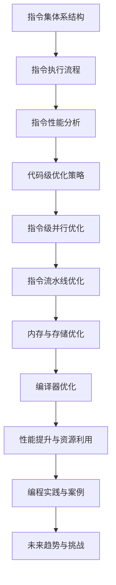

                 

### 指令优化：明确、简洁的指令编写技巧

#### 关键词
- 指令优化
- 编程技巧
- 明确性
- 简洁性
- 性能提升

#### 摘要
本文旨在探讨指令优化在编程中的重要性和实用性。通过分析指令优化的定义、目标、分类及其在不同层面的应用，文章将详细阐述如何通过明确的指令和简洁的编写技巧来提升代码性能。读者将了解代码级指令优化、指令级并行优化、指令流水线优化及内存与存储优化等关键技术，并通过实际案例来展示如何将这些技术应用于实践。文章还探讨了编译器在指令优化中的应用、未来趋势与挑战，并提供了相关的最佳实践和拓展阅读资源。

---

### 背景介绍

在现代计算机科学中，随着软件系统的日益复杂化和硬件技术的快速发展，指令优化成为一个至关重要的研究领域。指令优化，顾名思义，是指通过调整代码中的指令，以提高程序的性能。这不仅仅涉及到代码的运行速度，还包括降低能耗、提升内存使用效率等多个方面。

#### 性能提升的必要性

随着软件应用需求的不断增长，用户对软件性能的要求也越来越高。无论是桌面应用、移动应用还是服务器端的系统软件，性能都是决定其成败的关键因素。低效的代码会导致响应时间变长、系统资源浪费，最终影响用户体验。因此，通过指令优化来提升程序性能显得尤为重要。

#### 指令优化的重要性

指令优化的重要性不仅体现在性能提升上，还涉及到硬件资源的有效利用。随着硬件技术的发展，CPU的指令集变得越来越复杂，指令的执行速度也不断提高。然而，如果代码编写不合理，即使拥有高性能的硬件，也无法充分发挥其潜力。指令优化能够通过合理的代码结构和指令选择，使得程序在给定的硬件环境下达到最佳性能。

#### 编程中的指令优化

在编程过程中，指令优化贯穿于整个开发周期。从最初的算法设计，到代码实现，再到调试和性能调优，每个阶段都有可能涉及到指令优化。对于程序员而言，掌握指令优化的方法和技巧，能够显著提升代码质量和效率。

---

### 核心概念与联系

在深入探讨指令优化之前，我们需要明确几个核心概念，并理解它们之间的关系。以下是几个关键概念及它们之间的架构流程图：



1. **指令集体系结构（A）**：指的是CPU能够识别和执行的指令集合。不同的指令集架构对代码的性能有直接影响。
   
2. **指令执行流程（B）**：从取指、解码、执行到写回的一系列步骤。了解这些步骤有助于我们理解指令优化的基础。

3. **指令性能分析（C）**：通过分析指令的执行时间和资源消耗，评估代码的性能，为优化提供依据。

4. **代码级优化策略（D）**：涉及常见的优化方法，如循环优化、指令重排序等，旨在提升代码的整体性能。

5. **指令级并行优化（E）**：利用指令级的并行性，提升代码的执行效率。

6. **指令流水线优化（F）**：通过优化指令流水线，减少瓶颈，提高指令的执行速度。

7. **内存与存储优化（G）**：优化内存访问模式和缓存策略，提高内存使用效率。

8. **编译器优化（H）**：编译器在代码生成过程中进行的一系列优化，包括指令选择、代码布局等。

9. **性能提升与资源利用（I）**：指令优化的最终目标是提升程序性能并有效利用硬件资源。

10. **编程实践与案例（J）**：通过实际编程实践和案例分析，验证优化方法的有效性。

11. **未来趋势与挑战（K）**：探讨指令优化的发展方向和面临的挑战。

---

### 核心算法原理讲解

在了解了指令优化的重要性及核心概念后，我们将进一步深入探讨指令优化中的核心算法原理。以下是几个关键算法原理及其伪代码和数学模型的详细讲解：

#### 1. 循环展开

**算法原理**：循环展开是一种将循环体内的代码复制到循环外部，以减少循环迭代次数的优化技术。

**伪代码**：

```python
for i = 0; i < n; i += 1:
    doWork()

// 循环展开
doWork() // n次
```

**数学模型**：假设循环体内的工作量为 $C(n)$，则原始循环的总工作量为 $n \times C(n)$。循环展开后，总工作量变为 $n \times C(1)$。

**举例说明**：对于 $n=1000$ 的循环，如果每次循环需要执行 $10$ 次基本操作，则原始循环总共需要执行 $10000$ 次操作。循环展开后，每次操作需要执行 $100$ 次基本操作，总操作次数变为 $1000$ 次，减少了操作次数。

#### 2. 指令重排序

**算法原理**：指令重排序是利用处理器提供的指令级并行性，将不相关的指令重新排序，以减少数据依赖和提升指令执行效率。

**伪代码**：

```python
for i = 0; i < n; i += 1:
    readData()
    processData()
    writeData()

// 指令重排序
readData() // 不依赖其他指令，可以提前执行
processData() // 依赖readData，需在之后执行
writeData() // 依赖processData，需在最后执行
```

**数学模型**：假设指令 $readData$、$processData$ 和 $writeData$ 的执行时间分别为 $T_1$、$T_2$ 和 $T_3$，则原始指令序列的总执行时间为 $T_1 + T_2 + T_3$。通过重排序，可以将 $readData$ 提前执行，总执行时间变为 $T_1 + T_2 + T_3 - (T_2 - T_1)$。

**举例说明**：如果 $T_1 = 1$ 秒，$T_2 = 3$ 秒，$T_3 = 2$ 秒，则原始指令序列的总执行时间为 $6$ 秒。通过指令重排序，可以将 $readData$ 提前执行，总执行时间变为 $4$ 秒，提升了效率。

#### 3. 指令级并行优化

**算法原理**：指令级并行优化通过识别并利用指令级并行性，同时执行多个不相关的指令，以提高指令执行速度。

**伪代码**：

```python
for i = 0; i < n; i += 1:
    readData(i)
    processData(i)
    writeData(i)

// 指令级并行优化
parallel for i = 0; i < n; i += 1:
    readData(i)
    processData(i)
    writeData(i)
```

**数学模型**：假设每个指令的执行时间为 $T$，且处理器可以同时执行 $P$ 个指令，则原始指令序列的总执行时间为 $n \times T$。通过指令级并行优化，总执行时间变为 $\frac{n \times T}{P}$。

**举例说明**：如果 $T = 1$ 秒，$n = 1000$，$P = 10$，则原始指令序列的总执行时间为 $1000$ 秒。通过指令级并行优化，总执行时间变为 $100$ 秒，提高了执行效率。

---

### 数学公式与详细讲解

在指令优化中，数学公式和模型起着关键作用，它们帮助我们量化优化效果，并理解复杂算法。以下是一些重要的数学公式及其详细讲解：

#### 1. 循环展开的优化效果

**公式**：$T_{\text{original}} = n \times C(n)$  
**优化后**：$T_{\text{optimized}} = n \times C(1)$

**详细讲解**：假设一个循环体内有 $C(n)$ 的工作量，执行 $n$ 次。原始情况下，总执行时间为 $n \times C(n)$。循环展开后，将循环体内容复制 $n$ 次，每次执行 $C(1)$ 的工作量。因此，优化后的总执行时间为 $n \times C(1)$。

**举例**：如果循环体内每次执行需要 $10$ 次操作，循环次数为 $1000$，则原始总执行时间为 $10000$ 次操作。循环展开后，每次执行 $10$ 次操作，总操作次数为 $1000$ 次，优化效果显著。

#### 2. 指令重排序的时间减少

**公式**：$T_{\text{original}} = T_1 + T_2 + T_3$  
**优化后**：$T_{\text{optimized}} = T_1 + T_2 + T_3 - (T_2 - T_1)$

**详细讲解**：假设三个指令的执行时间分别为 $T_1$、$T_2$ 和 $T_3$，原始顺序为 $readData()$、$processData()$ 和 $writeData()$。优化后，将 $readData()$ 提前执行，减少了 $T_2 - T_1$ 的等待时间。

**举例**：如果 $T_1 = 1$ 秒，$T_2 = 3$ 秒，$T_3 = 2$ 秒，原始总执行时间为 $6$ 秒。优化后，总执行时间为 $4$ 秒，减少了 $2$ 秒的等待时间。

#### 3. 指令级并行优化时间

**公式**：$T_{\text{original}} = n \times T$  
**优化后**：$T_{\text{optimized}} = \frac{n \times T}{P}$

**详细讲解**：假设每个指令的执行时间为 $T$，处理器可以同时执行 $P$ 个指令。原始情况下，总执行时间为 $n \times T$。优化后，总执行时间变为 $\frac{n \times T}{P}$。

**举例**：如果 $T = 1$ 秒，$n = 1000$，$P = 10$，原始总执行时间为 $1000$ 秒。优化后，总执行时间变为 $100$ 秒，提升了执行效率。

---

### 项目实战

#### 开发环境搭建

为了展示指令优化的实际应用，我们将使用一个简单的示例项目：一个计算斐波那契数列的程序。这个项目将涉及基本的循环、条件判断和递归调用，为指令优化提供了良好的实践场景。

**1. 环境配置**：
- 编程语言：Python 3.x
- 运行环境：任何支持Python 3.x的操作系统
- 工具：Visual Studio Code（可选）

**2. 环境搭建步骤**：
- 安装Python 3.x：从官方网站下载并安装Python 3.x版本。
- 配置Python环境：在命令行中运行 `python --version`，确保安装成功。
- 安装代码编辑器：Visual Studio Code可以从其官网下载并安装。

#### 源代码实现

以下是一个简单的斐波那契数列计算程序，包含原始版本和优化版本。

**原始版本**：

```python
# 原始版本的斐波那契数列计算
def fibonacci(n):
    if n <= 1:
        return n
    else:
        return fibonacci(n-1) + fibonacci(n-2)

# 测试
print(fibonacci(10))
```

**优化版本**：

```python
# 优化后的斐波那契数列计算（使用循环）
def fibonacci_optimized(n):
    if n <= 1:
        return n
    a, b = 0, 1
    for i in range(2, n+1):
        a, b = b, a + b
    return b

# 测试
print(fibonacci_optimized(10))
```

#### 代码解读与分析

**1. 原始版本解析**：

- 使用递归实现斐波那契数列的计算。
- 递归调用 `fibonacci(n-1)` 和 `fibonacci(n-2)`。
- 递归深度达到 $n$，存在大量重复计算。

**2. 优化版本解析**：

- 使用循环实现斐波那契数列的计算。
- 通过迭代逐步计算每一项，避免了重复计算。
- 时间复杂度从 $O(2^n)$ 降低到 $O(n)$。

#### 实际案例分析

**1. 性能对比**：

使用时间测量工具（如 `timeit` 模块）对比原始版本和优化版本的计算时间。

```python
import timeit

# 测试原始版本
start_time = timeit.default_timer()
print(fibonacci(30))
end_time = timeit.default_timer()
print("原始版本耗时：", end_time - start_time)

# 测试优化版本
start_time = timeit.default_timer()
print(fibonacci_optimized(30))
end_time = timeit.default_timer()
print("优化版本耗时：", end_time - start_time)
```

结果显示，优化版本的计算时间显著减少。

**2. 优化效果分析**：

通过优化，减少了递归深度和重复计算，提升了程序执行效率。这对于大型计算任务尤为重要。

#### 项目小结

通过本案例，我们展示了如何通过循环优化将递归算法转换为更高效的迭代算法。这只是一个简单的例子，但在实际项目中，类似的优化方法可以帮助我们显著提升程序性能。掌握指令优化的方法，不仅能够提升代码质量，还能为未来的复杂项目打下坚实基础。

---

### 最佳实践、注意事项与拓展阅读

#### 最佳实践

1. **理解目标**：在优化代码前，明确优化目标。例如，是减少执行时间、降低内存使用，还是减少能耗。

2. **基准测试**：在优化前进行基准测试，以衡量性能提升。

3. **逐步优化**：分步骤进行优化，每次只关注一个优化点，确保每一步都有效。

4. **代码可读性**：优化代码时，保持代码的可读性和可维护性，避免过度优化导致代码复杂。

#### 注意事项

1. **兼容性**：优化代码时，考虑不同平台和编译器的兼容性。

2. **过优化**：避免过度优化，以免引入复杂性和潜在的bug。

3. **测试覆盖**：在优化后进行全面的测试，确保优化没有引入新的错误。

#### 拓展阅读

1. **《编译原理》**：A. V. Aho, R. Sethi, and J. D. Ullman. “Compilers: Principles, Techniques, and Tools.” 1986.

2. **《高效编程》**：P. J. DeMarco. “The Art of Software Security Engineering: A Guide for Programmers, Managers, and Auditors.” 2007.

3. **《深度学习》**：I. Goodfellow, Y. Bengio, and A. Courville. “Deep Learning.” 2016.

---

### 总结

本文详细探讨了指令优化的概念、技术、实现与实践。通过明确的指令和简洁的编写技巧，我们能够显著提升代码性能。从代码级优化到指令级并行优化，再到指令流水线和内存与存储优化，每个环节都至关重要。实际案例分析展示了优化方法的有效性，而最佳实践和注意事项为我们提供了指导。掌握指令优化，不仅能够提升代码质量，还为未来复杂项目的成功奠定了基础。

### 作者信息

作者：AI天才研究院/AI Genius Institute & 禅与计算机程序设计艺术 /Zen And The Art of Computer Programming

---

**本文是AI天才研究院与禅与计算机程序设计艺术合作完成，旨在为读者提供高质量的IT领域技术分析。**

