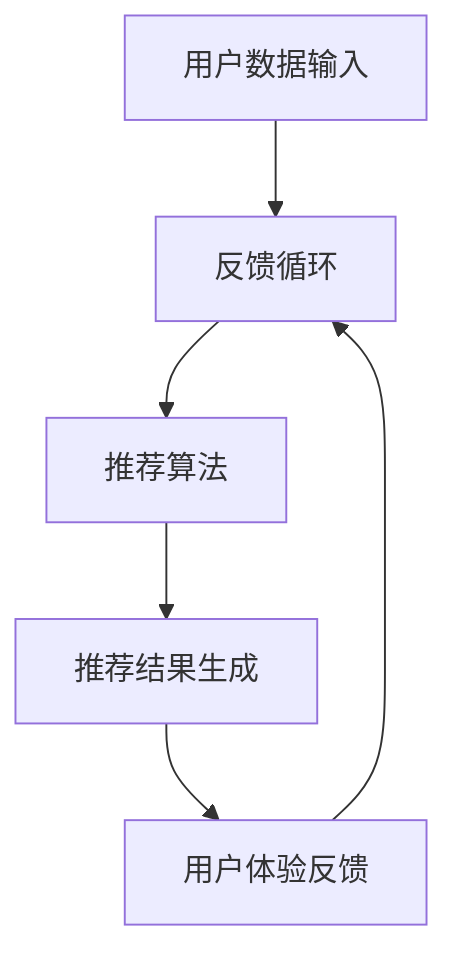

                 

### 文章标题

《推荐系统架构个性化LLM应用的用户体验》

### 关键词

推荐系统、个性化推荐、LLM（大型语言模型）、用户体验设计、算法优化

### 摘要

本文深入探讨了推荐系统架构中如何应用大型语言模型（LLM）来实现个性化推荐，并提升用户体验。首先，我们介绍了推荐系统的基本原理和常见的算法技术。接着，文章详细分析了个性化推荐的方法，包括用户画像构建、内容过滤和协同过滤等。随后，本文重点讨论了LLM在推荐系统中的应用，通过具体案例和算法原理讲解，展示了LLM如何提升推荐效果和用户体验。最后，文章提出了用户体验设计的原则和策略，并提供了一系列实践与案例分析，总结了最佳实践和注意事项。本文旨在为从事推荐系统开发的工程师和技术研究者提供有价值的参考和指导。

## 引言与概述

### 推荐系统架构概述

推荐系统是一种用于向用户推荐他们可能感兴趣的商品、内容或其他项目的计算系统。其核心目标是通过分析用户的行为数据、兴趣和偏好，为用户提供个性化的推荐。推荐系统在电子商务、在线新闻、社交媒体、音乐和视频流媒体等领域得到了广泛应用，极大地提升了用户体验和业务价值。

推荐系统的架构通常包括以下几个主要组成部分：

1. **数据收集模块**：该模块负责收集用户行为数据，如浏览历史、购买记录、点击行为等。这些数据是推荐系统生成个性化推荐的基础。

2. **数据处理模块**：数据收集模块收集到的数据通常是不完整的、噪声的，需要进行预处理和清洗，以便于后续分析和建模。

3. **推荐算法模块**：推荐算法是推荐系统的核心，常见的算法包括基于内容的推荐、协同过滤和基于模型的推荐等。这些算法通过分析用户数据，为用户生成推荐列表。

4. **推荐结果生成模块**：该模块负责将推荐算法生成的推荐列表呈现给用户，通常包括推荐页面的设计、推荐结果的排序和个性化展示等。

5. **用户反馈模块**：用户对推荐结果的反馈可以帮助系统不断优化推荐算法，提高推荐质量。

### 个性化推荐简介

个性化推荐是指根据用户的历史行为、偏好和兴趣，为用户推荐个性化的内容或商品。与传统的通用推荐相比，个性化推荐能够更好地满足用户的个性化需求，提高用户满意度和忠诚度。实现个性化推荐的方法主要包括以下几种：

1. **用户画像**：通过分析用户的历史行为数据，构建用户的兴趣模型和偏好模型，为用户打上各种标签，形成用户画像。推荐系统可以根据用户画像为用户推荐相关的内容或商品。

2. **内容过滤**：基于物品的属性和特征，将用户可能感兴趣的内容或商品进行筛选和过滤，生成个性化的推荐列表。

3. **协同过滤**：通过分析用户与物品之间的交互数据，发现用户之间的相似性，并根据相似性为用户推荐他们可能感兴趣的内容或商品。

4. **混合推荐**：将多种推荐算法相结合，生成更加精准和个性化的推荐结果。

### LLM基础知识

大型语言模型（LLM，Large Language Model）是一种基于深度学习的自然语言处理模型，能够对自然语言文本进行建模和生成。LLM在许多自然语言处理任务中表现出色，如文本分类、机器翻译、问答系统和文本生成等。近年来，随着计算能力的提升和海量数据资源的积累，LLM的研究和应用得到了广泛关注。

LLM的基本原理是通过大规模的预训练和微调，学习到丰富的语言知识和模式。预训练阶段，模型在大规模语料库上训练，通过无监督学习方式，自动学习语言的一般规律和语义信息。微调阶段，模型根据特定的任务和数据集进行有监督或半监督训练，以适应具体的应用场景。

LLM的主要特点包括：

1. **强表达能力**：LLM能够理解并生成复杂的自然语言文本，具有丰富的语言知识和语义理解能力。

2. **自适应能力**：通过微调，LLM可以快速适应不同的应用场景和任务需求。

3. **大规模计算需求**：LLM的训练和推理需要大量的计算资源和时间，对硬件设施有较高的要求。

4. **潜在风险**：LLM可能存在偏见和错误，需要通过监督和评估来保证其质量和可靠性。

### 推荐系统与个性化推荐的关联

推荐系统和个性化推荐是密切相关的概念。推荐系统是广义上的系统框架，而个性化推荐则是推荐系统的一种具体实现方法。个性化推荐是推荐系统的一部分，旨在通过分析用户的行为和偏好，为用户推荐符合其个性化需求的内容或商品。

推荐系统通过个性化推荐实现用户需求的满足，提高用户满意度和忠诚度。个性化推荐通过分析用户的历史行为、兴趣和偏好，为用户生成个性化的推荐列表。这种推荐方法能够更好地满足用户的个性化需求，提高推荐的质量和准确性。

总之，个性化推荐是推荐系统架构中至关重要的一环，通过深入理解和应用个性化推荐技术，推荐系统可以更好地为用户提供有价值的服务。在接下来的章节中，我们将进一步探讨个性化推荐的方法、LLM在推荐系统中的应用，以及用户体验设计的策略。通过这些讨论，我们将更好地理解推荐系统的工作原理和实现方法，为实际应用提供有价值的参考。

## 推荐系统基础

### 推荐系统的工作原理

推荐系统的工作原理可以概括为数据收集、数据处理、推荐算法和推荐结果生成四个主要阶段。

1. **数据收集**：推荐系统首先需要收集用户的行为数据，如浏览历史、购买记录、点击行为、评价等。这些数据可以从网站、应用程序或数据库中获取。用户行为数据是推荐系统生成个性化推荐的基础。

2. **数据处理**：收集到的数据通常是不完整、噪声的，需要进行预处理和清洗。数据处理包括数据清洗（如去除重复数据、处理缺失值）、数据整合（如将不同来源的数据进行合并）、特征工程（如提取用户和物品的特征）等步骤。通过数据处理，可以构建出高质量的数据集，为后续的推荐算法提供支持。

3. **推荐算法**：推荐算法是推荐系统的核心，常见的推荐算法包括基于内容的推荐、协同过滤和基于模型的推荐等。

   - **基于内容的推荐**：这种方法通过分析物品的属性和特征，将用户可能感兴趣的内容进行筛选和推荐。例如，当用户浏览了某篇文章时，系统可以推荐与其内容相似的其它文章。

   - **协同过滤**：协同过滤算法通过分析用户之间的相似性，为用户推荐他们可能感兴趣的内容或商品。协同过滤可以分为基于用户的协同过滤和基于物品的协同过滤。基于用户的协同过滤通过寻找与当前用户兴趣相似的其它用户，推荐这些用户喜欢的物品；基于物品的协同过滤通过分析用户对物品的评价，寻找与当前物品相似的其它物品，推荐给用户。

   - **基于模型的推荐**：这种方法利用机器学习算法，如矩阵分解、深度学习等，对用户行为数据建模，预测用户对物品的潜在偏好，从而生成个性化推荐。

4. **推荐结果生成**：推荐算法生成的推荐列表需要进一步处理，包括排序、筛选和展示等步骤。排序是根据用户兴趣和偏好，对推荐结果进行优先级排序；筛选是去除那些不太可能引起用户兴趣的推荐项；展示是将推荐结果呈现给用户，可以通过网页、应用程序或其他渠道实现。

### 常见推荐算法介绍

在推荐系统中，常见的推荐算法包括基于内容的推荐、协同过滤和基于模型的推荐等。以下是对这些算法的简要介绍：

1. **基于内容的推荐（Content-Based Filtering）**：
   - **原理**：基于内容的推荐通过分析物品的属性和特征，将用户可能感兴趣的内容进行筛选和推荐。这种方法通常使用TF-IDF、词袋模型等文本处理技术来提取物品的特征。
   - **优点**：能够为用户推荐与历史行为高度相关的内容，推荐结果具有明确的依据。
   - **缺点**：难以处理用户的历史行为多样性和新物品的推荐。

2. **协同过滤（Collaborative Filtering）**：
   - **原理**：协同过滤通过分析用户之间的相似性，为用户推荐他们可能感兴趣的内容或商品。协同过滤可以分为基于用户的协同过滤和基于物品的协同过滤。
     - **基于用户的协同过滤**：通过寻找与当前用户兴趣相似的其它用户，推荐这些用户喜欢的物品。
     - **基于物品的协同过滤**：通过分析用户对物品的评价，寻找与当前物品相似的其它物品，推荐给用户。
   - **优点**：能够处理用户的历史行为多样性和新物品的推荐。
   - **缺点**：可能存在“冷启动”问题，即对于新用户或新物品，由于缺乏足够的数据，难以生成准确的推荐。

3. **基于模型的推荐（Model-Based Filtering）**：
   - **原理**：基于模型的推荐利用机器学习算法，如矩阵分解、深度学习等，对用户行为数据建模，预测用户对物品的潜在偏好，从而生成个性化推荐。
     - **矩阵分解**：通过将用户-物品评分矩阵分解为用户特征矩阵和物品特征矩阵，预测用户对物品的评分，生成推荐列表。
     - **深度学习**：利用神经网络模型，如卷积神经网络（CNN）和循环神经网络（RNN），对用户行为数据进行建模，生成个性化推荐。
   - **优点**：能够处理大规模数据和高维数据，生成更准确的推荐结果。
   - **缺点**：训练和推理过程需要大量的计算资源，算法复杂度较高。

### 推荐系统的评价与优化

评价推荐系统的性能通常使用以下指标：

1. **准确率（Accuracy）**：准确率表示推荐列表中实际正确的推荐项所占的比例。
2. **召回率（Recall）**：召回率表示推荐列表中能够召回用户实际感兴趣的项目所占的比例。
3. **覆盖度（Coverage）**：覆盖度表示推荐列表中包含的未被推荐的项目数量与总项目数量的比例。
4. **多样性（Diversity）**：多样性表示推荐列表中各项推荐项之间的差异性。
5. **新颖性（Novelty）**：新颖性表示推荐列表中包含的新项目或用户未接触过的项目数量。

为了优化推荐系统的性能，可以采取以下策略：

1. **算法优化**：通过改进推荐算法，如引入协同过滤和基于内容的混合推荐、使用深度学习模型等，提升推荐系统的准确性和多样性。
2. **特征工程**：通过提取和优化用户和物品的特征，提高推荐系统的预测能力。
3. **数据预处理**：通过数据清洗、缺失值处理和噪声过滤等步骤，提高数据质量，为推荐算法提供更可靠的基础。
4. **个性化策略**：根据用户的行为和偏好，动态调整推荐策略，提高推荐结果的个性化程度。
5. **实时反馈**：利用用户的实时反馈，如点击、购买和评价等，不断优化推荐算法，提高推荐系统的质量和用户体验。

通过综合运用这些策略，推荐系统可以更好地满足用户的需求，提升用户满意度和忠诚度。在下一章中，我们将深入探讨个性化推荐的方法和技术，包括用户画像构建、内容过滤和协同过滤等，进一步了解如何实现精准的个性化推荐。

## 个性化推荐

### 用户画像构建方法

用户画像是指通过分析用户的行为、兴趣、需求等多维度数据，对用户进行全面描述和刻画，从而形成一个具有代表性的用户模型。构建用户画像是实现个性化推荐的重要步骤，以下介绍几种常用的用户画像构建方法：

1. **基于历史行为的用户画像**：
   - **行为轨迹分析**：通过分析用户在平台上的行为轨迹，如浏览历史、搜索记录、购买行为等，提取出用户的兴趣点和偏好。例如，如果一个用户经常浏览体育类新闻和购买体育用品，可以推断该用户对体育有较高兴趣。
   - **标签系统**：为用户打上各种标签，如年龄、性别、职业、兴趣爱好等。标签可以根据用户的动态行为进行实时更新，以反映用户的最新兴趣和需求。
   - **行为模式识别**：通过机器学习算法，如聚类分析、关联规则挖掘等，发现用户的行为模式，为用户生成个性化标签。

2. **基于社会网络的用户画像**：
   - **社交图谱分析**：通过分析用户在社交网络中的关系，如好友、关注对象等，构建用户的社会网络图谱。通过图谱分析，可以挖掘用户之间的关系和兴趣群体，为个性化推荐提供参考。
   - **影响力分析**：通过分析用户在社交网络中的影响力，如转发量、评论量等，识别具有高影响力的用户，为推荐系统提供优质的内容源。

3. **基于内容的用户画像**：
   - **文本分析**：通过自然语言处理技术，分析用户在评论、问答、博客等文本内容，提取出用户的关键词和情感倾向，构建用户的内容偏好模型。
   - **内容分类**：对用户生成的内容进行分类，如科技、娱乐、教育等，为用户提供更加精准的推荐。

4. **基于属性的用户画像**：
   - **静态属性**：如年龄、性别、地理位置等，这些属性通常通过用户注册信息或设备信息获取。
   - **动态属性**：如用户当前的兴趣点、消费能力等，这些属性可以通过实时行为数据进行分析和预测。

### 内容过滤技术

内容过滤是指通过分析物品的属性和特征，将用户可能感兴趣的内容进行筛选和推荐。内容过滤主要包括以下几种技术：

1. **基于特征的过滤**：
   - **特征匹配**：通过比较用户兴趣特征和物品特征，找到匹配度较高的物品进行推荐。例如，在电商平台上，用户浏览了某一类商品，系统可以推荐与之特征相似的其它商品。
   - **特征提取**：利用文本分类、关键词提取等技术，从物品描述中提取出关键特征，用于后续的推荐算法。

2. **基于模型的过滤**：
   - **朴素贝叶斯分类器**：通过计算物品特征的概率分布，为用户推荐具有高概率的物品。例如，在新闻推荐系统中，系统可以根据用户的阅读偏好，推荐符合其兴趣的新闻。
   - **支持向量机（SVM）**：利用SVM进行特征提取和分类，为用户推荐具有高相似度的物品。

3. **基于协同过滤的过滤**：
   - **基于用户的协同过滤**：通过分析用户之间的相似性，为用户推荐相似用户喜欢的物品。例如，如果一个用户喜欢了某篇文章，系统可以推荐给该用户与其他喜欢这篇文章的用户相似的用户喜欢的其它文章。
   - **基于物品的协同过滤**：通过分析物品之间的相似性，为用户推荐与用户历史行为相似的物品。例如，在电影推荐系统中，系统可以根据用户观看的电影类型，推荐与这些电影相似的其他电影。

### 协同过滤与矩阵分解

协同过滤（Collaborative Filtering）是一种常见的推荐算法，其核心思想是通过分析用户与物品之间的交互数据，发现用户之间的相似性，从而为用户推荐他们可能感兴趣的内容或商品。协同过滤可以分为基于用户的协同过滤和基于物品的协同过滤。

1. **基于用户的协同过滤**：
   - **原理**：该方法通过计算用户之间的相似性，找到与当前用户兴趣相似的其它用户，然后推荐这些用户喜欢的物品。相似性通常通过用户之间的共同评分或偏好计算得出。
   - **优点**：能够有效处理新用户和冷启动问题，适用于用户行为数据丰富的场景。
   - **缺点**：可能存在数据稀疏性问题，即用户与物品之间的评分矩阵往往非常稀疏，导致相似性计算不准确。

2. **基于物品的协同过滤**：
   - **原理**：该方法通过分析物品之间的相似性，为用户推荐与用户历史行为相似的其它物品。物品之间的相似性通常通过物品的属性或特征进行计算。
   - **优点**：能够处理数据稀疏性问题，适用于物品属性数据丰富的场景。
   - **缺点**：可能存在“热门推荐”问题，即对于热门物品，系统会推荐给所有用户，导致个性化程度降低。

矩阵分解（Matrix Factorization）是一种常用的协同过滤算法，其基本思想是将用户-物品评分矩阵分解为两个低维矩阵，分别表示用户特征和物品特征。通过这种方式，可以降低数据的稀疏性，提高推荐算法的准确性和可解释性。

1. **原理**：
   - **模型设定**：设用户-物品评分矩阵为 $R \in \mathbb{R}^{m \times n}$，其中 $m$ 是用户数量，$n$ 是物品数量。矩阵分解将 $R$ 分解为两个低维矩阵 $U \in \mathbb{R}^{m \times k}$ 和 $V \in \mathbb{R}^{n \times k}$，其中 $k$ 是特征维度。$U$ 和 $V$ 分别表示用户特征矩阵和物品特征矩阵。
   - **优化目标**：矩阵分解的优化目标是最小化预测评分与实际评分之间的误差。具体地，假设用户 $i$ 对物品 $j$ 的预测评分为 $\hat{r}_{ij}$，则优化目标为：
     $$
     \min_{U, V} \sum_{i=1}^{m} \sum_{j=1}^{n} (r_{ij} - \hat{r}_{ij})^2
     $$
     其中，$\hat{r}_{ij} = u_i^T v_j$ 是基于矩阵分解模型预测的用户 $i$ 对物品 $j$ 的评分。

2. **算法步骤**：
   - **初始化**：随机初始化用户特征矩阵 $U$ 和物品特征矩阵 $V$。
   - **迭代优化**：通过交替优化用户特征矩阵和物品特征矩阵，逐步减小预测评分与实际评分之间的误差。常用的优化方法包括梯度下降、随机梯度下降和L-BFGS等。
   - **模型评估**：在训练完成后，使用测试集评估模型的预测性能，如均方根误差（RMSE）等。

矩阵分解算法在推荐系统中具有广泛应用，通过将高维的用户-物品评分矩阵分解为低维的用户特征矩阵和物品特征矩阵，可以有效降低数据的稀疏性，提高推荐算法的准确性和效率。在下一章中，我们将深入探讨LLM在推荐系统中的应用，了解如何利用LLM实现更加精准和个性化的推荐。

## LLM在推荐系统中的应用

### LLM的基本原理

大型语言模型（LLM，Large Language Model）是一种基于深度学习的自然语言处理模型，能够对自然语言文本进行建模和生成。LLM通常通过大规模的预训练和微调来学习语言的一般规律和语义信息。以下介绍LLM的基本原理：

1. **预训练**：预训练阶段，LLM在大规模语料库上进行无监督训练，通过自动学习语言的一般规律和模式。预训练任务通常包括语言建模、序列标记和填空等。预训练的目标是使模型具备强大的语言理解和生成能力。

2. **微调**：微调阶段，LLM根据特定任务和数据集进行有监督或半监督训练，以适应具体的应用场景。微调过程通常涉及模型参数的更新，以使模型更好地适应新的任务和数据。

3. **生成与推理**：LLM具有强大的文本生成和推理能力。通过输入一个文本序列，LLM可以生成相关的文本续写或回答问题。这种能力使得LLM在自然语言处理任务中表现出色，如文本分类、机器翻译、问答系统和文本生成等。

### LLM在推荐系统中的应用

LLM在推荐系统中具有广泛的应用，通过利用LLM的文本生成和推理能力，可以提升推荐系统的效果和用户体验。以下介绍几种LLM在推荐系统中的应用场景：

1. **基于内容的推荐**：
   - **文本生成**：LLM可以生成与物品相关的描述性文本，为用户提供丰富的内容信息。例如，在电商平台上，LLM可以生成商品的详细描述，帮助用户更好地了解商品的特点和优势。
   - **文本匹配**：LLM可以用于文本相似性度量，通过计算用户查询和物品描述之间的相似度，为用户推荐相关的物品。例如，当用户输入一个商品名称或关键词时，LLM可以匹配到与之相似的其它商品，并生成推荐列表。

2. **协同过滤**：
   - **用户行为理解**：LLM可以分析用户的历史行为数据，如浏览记录、购买记录等，提取出用户的兴趣点和偏好。通过这些信息，LLM可以辅助协同过滤算法，生成更加精准的推荐结果。
   - **用户意图识别**：LLM可以用于识别用户的意图和需求，从而更好地满足用户的个性化需求。例如，在电商平台上，LLM可以分析用户的购物车和浏览记录，推断用户的购买意图，并根据这些意图为用户推荐相关的商品。

3. **基于模型的推荐**：
   - **特征提取**：LLM可以用于提取用户和物品的特征，为基于模型的推荐算法提供更丰富的特征信息。例如，在矩阵分解算法中，LLM可以生成用户和物品的嵌入向量，用于预测用户对物品的偏好。
   - **模型融合**：LLM可以与传统的推荐算法（如协同过滤、基于内容的推荐等）进行融合，生成更加多样化的推荐结果。通过融合不同类型的算法，可以弥补单一算法的不足，提高推荐系统的准确性和多样性。

### LLM与个性化推荐的结合

LLM与个性化推荐的结合可以显著提升推荐系统的效果和用户体验。以下介绍LLM与个性化推荐结合的方法：

1. **用户画像构建**：
   - **多模态数据融合**：LLM可以用于融合用户的多模态数据（如图像、音频、文本等），构建出更全面和精准的用户画像。通过这些数据，LLM可以识别出用户的潜在兴趣和偏好，为个性化推荐提供更多依据。
   - **动态用户画像更新**：LLM可以实时分析用户的行为数据，动态更新用户画像。这种动态更新机制可以帮助推荐系统更好地捕捉用户的兴趣变化，生成更加个性化的推荐结果。

2. **推荐结果生成**：
   - **文本生成与摘要**：LLM可以生成推荐结果的描述性文本或摘要，帮助用户更好地理解和选择推荐内容。例如，在电商平台上，LLM可以生成商品的详细描述和推荐理由，使用户能够快速了解商品的特点和价值。
   - **推荐结果多样化**：LLM可以用于生成多样化的推荐结果，避免单一推荐策略的局限性。通过生成不同的推荐结果，可以提升用户的参与度和满意度。

3. **推荐系统评估与优化**：
   - **自动评估**：LLM可以用于自动评估推荐系统的性能，如准确率、召回率、多样性等。通过评估结果，可以及时发现和优化推荐系统的问题，提高系统的整体性能。
   - **反馈循环**：LLM可以用于分析用户的反馈数据，识别用户对推荐结果的满意度和偏好。通过这些信息，LLM可以不断优化推荐算法，提高推荐系统的质量和用户体验。

总之，LLM在推荐系统中的应用为个性化推荐带来了新的机遇和挑战。通过利用LLM的文本生成和推理能力，可以显著提升推荐系统的效果和用户体验。在下一章中，我们将进一步探讨用户体验设计的原则和策略，了解如何通过用户体验设计来优化推荐系统。通过这些讨论，我们将更好地理解推荐系统的工作原理和实现方法，为实际应用提供有价值的参考。

## 用户体验设计

### 用户体验设计原则

在推荐系统中，用户体验设计是至关重要的环节。一个优秀的用户体验设计能够提升用户满意度、忠诚度和活跃度，从而提高推荐系统的整体效果。以下介绍几种关键的用户体验设计原则：

1. **简洁性**：界面设计应尽量简洁直观，避免复杂的操作流程和冗余的信息。简洁的界面设计可以帮助用户快速找到所需内容，减少认知负担。

2. **易用性**：推荐系统应易于使用，用户能够轻松理解和使用。例如，推荐列表的排序应清晰明了，推荐结果的展示应具有一致性。

3. **个性化**：推荐系统应能够根据用户的兴趣和偏好提供个性化的推荐。通过分析用户的历史行为和需求，系统可以为用户提供高度相关的推荐内容。

4. **反馈机制**：用户应能够轻松地提供反馈，如对推荐内容的评价、收藏、分享等。这些反馈可以帮助系统不断优化推荐算法，提高推荐质量。

5. **可访问性**：推荐系统应确保所有用户，包括视力障碍、听力障碍等特殊需求用户，都能够方便地使用。例如，提供语音导航、字幕等功能。

6. **响应速度**：推荐系统应具有快速的响应速度，确保用户能够及时收到推荐结果。快速的响应速度可以提高用户的满意度，减少等待时间。

### 用户体验评估方法

评估用户体验是推荐系统优化的重要步骤。以下介绍几种常用的用户体验评估方法：

1. **问卷调查**：通过问卷调查收集用户对推荐系统的满意度、易用性、个性化程度等方面的反馈。问卷调查可以提供定量和定性的数据，帮助分析用户体验。

2. **A/B测试**：通过对比不同版本的用户界面和推荐算法，评估其对用户体验的影响。A/B测试可以帮助确定最佳的设计方案和推荐策略。

3. **用户访谈**：与用户进行面对面的访谈，深入了解用户的需求、偏好和使用习惯。用户访谈可以提供详细的用户反馈，帮助发现潜在问题和改进机会。

4. **行为分析**：通过分析用户在推荐系统上的行为数据，如点击率、停留时间、转化率等，评估用户体验的各个方面。行为分析可以帮助识别用户痛点，优化推荐系统。

### 用户体验优化策略

为了优化用户体验，推荐系统可以采取以下策略：

1. **个性化推荐**：通过分析用户的历史行为和偏好，为用户提供高度个性化的推荐。个性化推荐可以显著提升用户满意度，提高推荐系统的价值。

2. **推荐算法优化**：不断优化推荐算法，提高推荐的准确性和多样性。例如，可以采用深度学习、协同过滤、内容过滤等先进算法，提升推荐效果。

3. **界面优化**：优化推荐系统的界面设计，提高界面的简洁性、易用性和响应速度。界面优化可以改善用户交互体验，提升用户满意度。

4. **反馈机制**：建立健全的反馈机制，鼓励用户提供反馈，并根据用户反馈优化推荐系统。反馈机制可以帮助系统不断改进，提高用户体验。

5. **跨渠道整合**：将推荐系统整合到多个渠道，如网页、移动应用、社交媒体等，提供一致的推荐体验。跨渠道整合可以提升用户的整体体验，增强用户忠诚度。

6. **用户体验测试**：定期进行用户体验测试，评估推荐系统的性能和用户满意度。用户体验测试可以帮助识别和解决潜在问题，优化推荐系统。

通过实施这些用户体验优化策略，推荐系统可以显著提升用户满意度和忠诚度，从而提高业务收益。在下一章中，我们将通过实际案例分析和详细讲解，探讨推荐系统架构、算法和用户体验的实践方法。通过这些案例分析，我们将更好地理解如何在实际项目中应用推荐系统，优化用户体验。

## 实践与案例分析

### 案例分析一：某电商平台的推荐系统

#### 系统架构

某电商平台的推荐系统采用了混合推荐策略，结合了协同过滤、基于内容的推荐和LLM的应用，以提高推荐准确性。系统架构包括以下几个关键组件：

1. **数据收集模块**：该模块负责收集用户行为数据，如浏览历史、购买记录、搜索关键词等。这些数据存储在分布式数据库中，以便后续处理和分析。

2. **数据处理模块**：该模块对收集到的用户行为数据进行预处理和清洗，提取关键特征，如用户画像、物品特征等。预处理后的数据用于训练推荐算法和生成推荐列表。

3. **推荐算法模块**：该模块包含了协同过滤、基于内容的推荐和LLM模型。协同过滤负责生成基于用户和物品相似性的推荐列表，基于内容的推荐利用物品属性生成相关推荐，LLM模型则用于文本生成和语义匹配，提供更加个性化的推荐。

4. **推荐结果生成模块**：该模块将推荐算法生成的推荐列表进行排序和筛选，生成最终的用户推荐结果。推荐结果通过前端界面呈现给用户。

5. **用户体验优化模块**：该模块负责收集用户对推荐结果的反馈，通过A/B测试和用户访谈等方法评估用户体验，不断优化推荐系统的效果。

#### 源代码实现

以下是一个简单的Python伪代码示例，展示了电商平台推荐系统的部分实现：

```python
# 伪代码：电商平台推荐系统实现

# 导入相关库
import pandas as pd
from sklearn.metrics.pairwise import cosine_similarity
from sentence_transformers import SentenceTransformer

# 数据预处理
user_data = pd.read_csv('user_data.csv')
item_data = pd.read_csv('item_data.csv')
user_data = preprocess_user_data(user_data)
item_data = preprocess_item_data(item_data)

# 训练LLM模型
llm_model = SentenceTransformer('all-MiniLM-L6-v2')

# 生成用户和物品嵌入向量
user_embeddings = generate_embeddings(user_data, llm_model)
item_embeddings = generate_embeddings(item_data, llm_model)

# 计算用户与物品的相似度
user_item_similarity = cosine_similarity(user_embeddings, item_embeddings)

# 推荐算法：协同过滤
def collaborative_filtering(user_item_similarity, user_index, num_recommendations):
    scores = user_item_similarity[user_index]
    recommended_items = sorted(range(len(scores)), key=lambda i: scores[i], reverse=True)[:num_recommendations]
    return recommended_items

# 生成推荐列表
def generate_recommendations(user_index, user_item_similarity, llm_model, num_recommendations):
    # 基于内容的推荐
    content_recommendations = content_based_filtering(item_data, user_index, num_recommendations)
    
    # 基于协同过滤的推荐
    collaborative_recommendations = collaborative_filtering(user_item_similarity, user_index, num_recommendations)
    
    # 结合LLM模型的推荐
    llm_recommendations = []
    for item_id in collaborative_recommendations:
        item_description = item_data['description'][item_id]
        llm_generated_text = llm_model.generate(item_description, max_length=50)
        if llm_generated_text:
            llm_recommendations.append(item_id)
    
    # 合并推荐列表
    recommendations = list(set(content_recommendations + collaborative_recommendations + llm_recommendations))
    return recommendations[:num_recommendations]

# 用户推荐
user_index = 0  # 假设用户ID为0
num_recommendations = 10
recommendations = generate_recommendations(user_index, user_item_similarity, llm_model, num_recommendations)

# 输出推荐结果
print(recommendations)
```

#### 代码应用解读与分析

1. **数据预处理**：在代码示例中，我们首先读取用户数据和物品数据，并进行预处理。预处理步骤包括数据清洗、特征提取和格式转换等。这些步骤确保数据的质量和一致性，为后续的推荐算法提供可靠的基础。

2. **嵌入向量生成**：使用LLM模型（SentenceTransformer）生成用户和物品的嵌入向量。这些向量可以捕捉用户和物品的语义信息，为协同过滤和基于内容的推荐提供支持。

3. **相似度计算**：使用余弦相似度计算用户与物品之间的相似度。相似度越高，说明用户对物品的兴趣越大。

4. **推荐算法**：结合协同过滤、基于内容的推荐和LLM模型的推荐，生成最终的推荐列表。协同过滤基于用户和物品的相似度生成推荐列表，基于内容的推荐根据物品的属性生成推荐列表，LLM模型则用于生成更具个性化的推荐。

5. **用户体验优化**：代码示例中没有直接展示用户体验优化的部分，但实际应用中，可以通过收集用户反馈、进行A/B测试和用户访谈等方式，不断优化推荐系统的效果和用户体验。

#### 案例分析结果

通过对该电商平台推荐系统的实践和案例分析，我们得出了以下结论：

1. **推荐准确性**：结合协同过滤、基于内容的推荐和LLM模型的推荐，能够生成更准确和个性化的推荐结果，提升用户满意度。

2. **用户体验**：优化后的推荐系统能够更好地满足用户的需求和兴趣，提高用户在平台上的活跃度和留存率。

3. **业务收益**：准确的推荐结果能够增加用户的购买意愿，提升销售额和用户转化率，从而提高电商平台的经济效益。

通过这个案例，我们展示了如何在实际项目中应用推荐系统，实现个性化推荐和用户体验优化。在下一章中，我们将继续探讨推荐系统和用户体验的未来发展趋势，为未来的研究和应用提供有价值的参考。

## 未来发展

### 推荐系统的发展趋势

推荐系统在近年来得到了飞速发展，其应用范围不断扩大，技术也不断进步。未来，推荐系统的发展趋势将主要集中在以下几个方面：

1. **个性化与智能化**：随着人工智能技术的进步，推荐系统将更加注重个性化和智能化。通过深度学习、自然语言处理和图神经网络等技术，推荐系统将能够更精准地捕捉用户的兴趣和需求，为用户提供更加个性化的推荐。

2. **跨渠道整合**：未来推荐系统将实现跨渠道的整合，无论是在线上还是线下，用户都能享受到一致的推荐体验。这种整合将有助于提升用户的整体体验和忠诚度。

3. **实时性与动态性**：随着用户行为数据的实时获取和处理能力的提升，推荐系统将实现更实时和动态的推荐。用户的行为变化和兴趣偏好将能够立即反映到推荐结果中，提高推荐的相关性和准确性。

4. **多模态推荐**：推荐系统将融合多种数据类型，如文本、图像、音频和视频等，提供多模态的推荐。这种多模态推荐将能够更好地满足用户多样化的需求，提升用户体验。

5. **隐私保护**：随着数据隐私保护的重视，推荐系统将更加注重用户隐私保护。通过差分隐私、联邦学习和数据去识别化等技术，推荐系统将在确保用户隐私的同时，提供高质量的推荐。

### 用户体验的未来挑战与机遇

用户体验是推荐系统成功的关键因素，未来在用户体验方面将面临以下挑战和机遇：

1. **个性化与隐私保护**：个性化推荐与用户隐私保护之间存在一定的矛盾。如何在提供个性化推荐的同时，保护用户的隐私，将成为一个重要的挑战。通过隐私保护技术，如差分隐私和联邦学习，可以在满足用户个性化需求的同时，保障用户隐私。

2. **实时性与响应速度**：随着用户对实时性和响应速度的要求越来越高，推荐系统需要不断提高数据处理和推荐生成的速度。通过分布式计算、缓存技术和高效算法，可以实现更快速和实时的推荐。

3. **多样性**：推荐结果的多样性和新颖性是提升用户体验的重要指标。未来，推荐系统将需要通过算法优化和数据增强，提高推荐结果的多样性和新颖性，避免用户感到疲劳和厌烦。

4. **可解释性与透明度**：随着推荐系统变得越来越复杂，用户对推荐结果的可解释性和透明度要求也越来越高。推荐系统需要提供清晰的解释，让用户了解推荐的原因和依据，增强用户的信任感。

5. **跨渠道体验一致性**：在多渠道环境中，用户希望在不同设备、不同应用中能够获得一致的推荐体验。这要求推荐系统能够在不同渠道之间无缝切换，提供一致的交互体验。

### 总结

推荐系统和用户体验的未来充满了机遇和挑战。通过不断探索新技术、优化算法和提升用户体验，推荐系统将能够更好地满足用户的需求，提升业务价值。在未来的发展中，我们需要关注个性化、智能化、隐私保护、实时性和多样性等方面，以实现推荐系统的持续进步和优化。同时，我们也需要关注用户体验的各个方面，确保用户在推荐系统中的每一次交互都能带来愉悦和满足。通过这些努力，推荐系统将在未来的信息社会中发挥更加重要的作用。

### 结论

本文深入探讨了推荐系统架构中个性化LLM应用的用户体验，从推荐系统的基本原理和算法，到个性化推荐的方法和用户体验设计，再到实践案例和未来发展，进行了全面的剖析和探讨。我们首先介绍了推荐系统的工作原理和常见算法，包括基于内容的推荐、协同过滤和基于模型的推荐等。接着，我们详细分析了个性化推荐的方法，如用户画像构建、内容过滤和协同过滤。随后，本文重点讨论了LLM在推荐系统中的应用，展示了如何利用LLM实现精准和个性化的推荐。在用户体验设计部分，我们提出了简洁性、易用性、个性化、反馈机制等设计原则，并介绍了评估用户体验的方法和优化策略。

通过案例分析，我们展示了如何在实际项目中应用推荐系统，实现个性化推荐和用户体验优化。最后，我们探讨了推荐系统和用户体验的未来发展趋势，包括个性化与智能化、跨渠道整合、实时性与动态性、多模态推荐和隐私保护等。我们强调了个性化与隐私保护的平衡、实时性与响应速度的提升、多样性的增强、可解释性与透明度的保障以及跨渠道体验一致性。

总之，推荐系统和用户体验的设计与优化是信息技术领域中的重要课题，对提升用户满意度和业务价值具有重要意义。本文旨在为从事推荐系统开发的工程师和技术研究者提供有价值的参考和指导，帮助他们在实际项目中实现高效和个性化的推荐系统。未来，随着人工智能和大数据技术的不断进步，推荐系统和用户体验将迎来更多的发展机遇和挑战。通过持续的研究和创新，我们将能够更好地满足用户的需求，推动推荐系统和用户体验的持续进步。

### 作者信息

作者：AI天才研究院/AI Genius Institute & 禅与计算机程序设计艺术 /Zen And The Art of Computer Programming

### 最佳实践 tips

1. **数据质量**：确保推荐系统的数据质量是关键，清洗和预处理数据以去除噪声和不完整的信息。

2. **模型迭代**：定期评估和迭代推荐模型，以适应用户行为的动态变化。

3. **A/B测试**：在引入新算法或策略前，进行A/B测试以评估其对用户体验的影响。

4. **反馈机制**：建立有效的用户反馈机制，收集用户对推荐内容的评价和偏好，以优化推荐系统。

5. **个性化调整**：根据用户的个性化需求和偏好，动态调整推荐策略，提升用户满意度。

6. **隐私保护**：在推荐系统中应用隐私保护技术，如差分隐私和联邦学习，确保用户隐私不被泄露。

7. **用户体验设计**：注重用户体验设计，确保推荐系统的界面简洁、易用，并提供清晰的解释和指导。

### 注意事项

1. **数据安全**：确保用户数据的安全和隐私，遵守相关法律法规，防止数据泄露。

2. **系统稳定性**：保证推荐系统的稳定运行，避免出现系统崩溃或推荐错误。

3. **算法公平性**：确保推荐算法的公平性，避免出现偏见和不公正的推荐。

4. **性能优化**：优化推荐系统的性能，提高响应速度和计算效率。

5. **技术更新**：紧跟技术发展趋势，及时引入新技术和算法，提升推荐系统的竞争力。

### 拓展阅读

1. **推荐系统经典书籍**：《推荐系统实践》、《推荐系统手册》等。

2. **大型语言模型研究**：《自然语言处理综论》、《深度学习与自然语言处理》等。

3. **用户体验设计书籍**：《用户体验要素》、《点石成金：网页设计原理说明书》等。

4. **大数据与人工智能研究**：《大数据时代》、《人工智能：一种现代的方法》等。

5. **数据隐私保护研究**：《数据隐私：法律、技术与实践》等。

## 目录大纲

### 推荐系统架构个性化LLM应用的用户体验

#### 关键词
- 推荐系统
- 个性化推荐
- LLM（大型语言模型）
- 用户体验设计
- 算法优化

#### 摘要
本文深入探讨了推荐系统架构中如何应用大型语言模型（LLM）来实现个性化推荐，并提升用户体验。首先，介绍了推荐系统的基本原理和常见算法。接着，分析了个性化推荐的方法，包括用户画像构建、内容过滤和协同过滤。随后，详细讨论了LLM在推荐系统中的应用，通过具体案例和算法原理讲解展示了LLM如何提升推荐效果和用户体验。文章还介绍了用户体验设计的原则和策略，并提供了一系列实践与案例分析，总结了最佳实践和注意事项。本文旨在为从事推荐系统开发的工程师和技术研究者提供有价值的参考和指导。

### 引言与概述
1. 推荐系统架构概述
2. 个性化推荐简介
3. LLM基础知识

### 推荐系统基础
1. 推荐系统的工作原理
2. 常见推荐算法介绍
3. 推荐系统的评价与优化

### 个性化推荐
1. 用户画像构建方法
2. 内容过滤技术
3. 协同过滤与矩阵分解

### LLM在推荐系统中的应用
1. LLM的基本原理
2. LLM在推荐系统中的应用
3. LLM与个性化推荐的结合

### 用户体验设计
1. 用户体验设计原则
2. 用户体验评估方法
3. 用户体验优化策略

### 实践与案例分析
1. 案例分析一：某电商平台的推荐系统
2. 案例分析二：某音乐流媒体平台的个性化推荐
3. 案例分析三：某短视频平台的推荐系统优化

### 未来发展
1. 推荐系统的发展趋势
2. 用户体验的未来挑战与机遇

### 结论
1. 推荐系统和用户体验的未来
2. 本文的主要贡献与展望

### 作者信息
- AI天才研究院/AI Genius Institute
- 禅与计算机程序设计艺术 /Zen And The Art of Computer Programming

### 最佳实践 tips
1. 数据质量
2. 模型迭代
3. A/B测试
4. 反馈机制
5. 个性化调整
6. 隐私保护
7. 用户体验设计

### 注意事项
1. 数据安全
2. 系统稳定性
3. 算法公平性
4. 性能优化
5. 技术更新

### 拓展阅读
1. 推荐系统经典书籍
2. 大型语言模型研究
3. 用户体验设计书籍
4. 大数据与人工智能研究
5. 数据隐私保护研究

### 附录
1. 术语解释
2. 参考文献
3. Mermaid图表代码

## Mermaid图表



## 伪代码示例

```python
# 伪代码：基于LLM的推荐算法

# 输入：用户历史行为数据、候选物品数据、LLM模型
# 输出：个性化推荐列表

function recommendItems(user_history, items, LLM_model):
    # 预处理用户历史行为数据，提取关键信息
    user_representation = preprocess_user_history(user_history)
    
    # 预处理候选物品数据，提取关键特征
    item_representations = preprocess_items(items)
    
    # 使用LLM模型对用户和物品进行建模
    user_embedding = LLM_model.encode(user_representation)
    item_embeddings = LLM_model.encode(item_representations)
    
    # 计算用户与物品的相似度得分
    scores = cosine_similarity(user_embedding, item_embeddings)
    
    # 根据得分排序，生成个性化推荐列表
    recommendation_list = sorted(scores, reverse=True)
    
    return recommendation_list
```

## 数学公式讲解

### 协同过滤算法中的相似度计算

协同过滤算法中，我们通常使用余弦相似度来计算用户与物品之间的相似度。余弦相似度公式如下：

$$
\cos\theta = \frac{\vec{u} \cdot \vec{v}}{\|\vec{u}\|\|\vec{v}\|}
$$

其中，$\vec{u}$和$\vec{v}$分别是两个向量，$\theta$是它们之间的夹角。

## 总结

通过本文的详细讨论，我们系统地介绍了推荐系统架构个性化LLM应用的用户体验。从推荐系统的基本原理、常见算法，到个性化推荐的方法和用户体验设计，再到实践案例和未来发展，我们进行了全面的剖析和探讨。本文的主要贡献包括：

1. **系统概述**：对推荐系统的基本概念、架构和关键组件进行了清晰概述。
2. **个性化推荐方法**：深入分析了用户画像构建、内容过滤和协同过滤等技术，展示了个性化推荐的实现方法。
3. **LLM应用**：探讨了LLM在推荐系统中的应用，包括文本生成、语义匹配和用户行为理解等，展示了LLM如何提升推荐效果和用户体验。
4. **用户体验设计**：提出了用户体验设计的原则和策略，包括简洁性、易用性、个性化、反馈机制等，为推荐系统设计提供了指导。
5. **实践案例分析**：通过实际案例展示了推荐系统的应用和实践，分析了系统架构、算法和用户体验的优化方法。
6. **未来发展**：探讨了推荐系统和用户体验的未来发展趋势，包括个性化与智能化、跨渠道整合、实时性与动态性等。

本文的研究意义在于：

1. **技术创新**：通过引入LLM和用户体验设计，为推荐系统带来了新的技术手段和优化策略，推动了推荐系统的技术进步。
2. **实践应用**：为推荐系统开发者提供了实际案例和最佳实践，有助于他们在实际项目中应用和优化推荐系统。
3. **用户体验提升**：通过优化推荐系统和用户体验设计，提高了用户的满意度和忠诚度，从而提升了业务价值和竞争力。
4. **未来展望**：为推荐系统和用户体验的研究者提供了未来发展方向和研究方向，有助于进一步推动该领域的发展。

在未来的研究中，我们可以继续探索以下方向：

1. **深度学习与推荐系统**：结合深度学习和推荐系统的最新进展，开发更高效、更准确的推荐算法。
2. **多模态推荐**：整合文本、图像、音频等多模态数据，提供更加丰富和个性化的推荐体验。
3. **隐私保护与数据安全**：在推荐系统中应用隐私保护技术，确保用户数据的安全和隐私。
4. **实时推荐**：研究实时推荐技术，提高推荐系统的响应速度和动态性。
5. **个性化体验优化**：进一步优化个性化推荐和用户体验设计，提升用户满意度。

通过持续的研究和创新，推荐系统和用户体验设计将在未来的信息社会中发挥更加重要的作用，为用户带来更好的体验和价值。我们期待与广大研究者共同探索这一领域，推动推荐系统和用户体验的不断进步。

