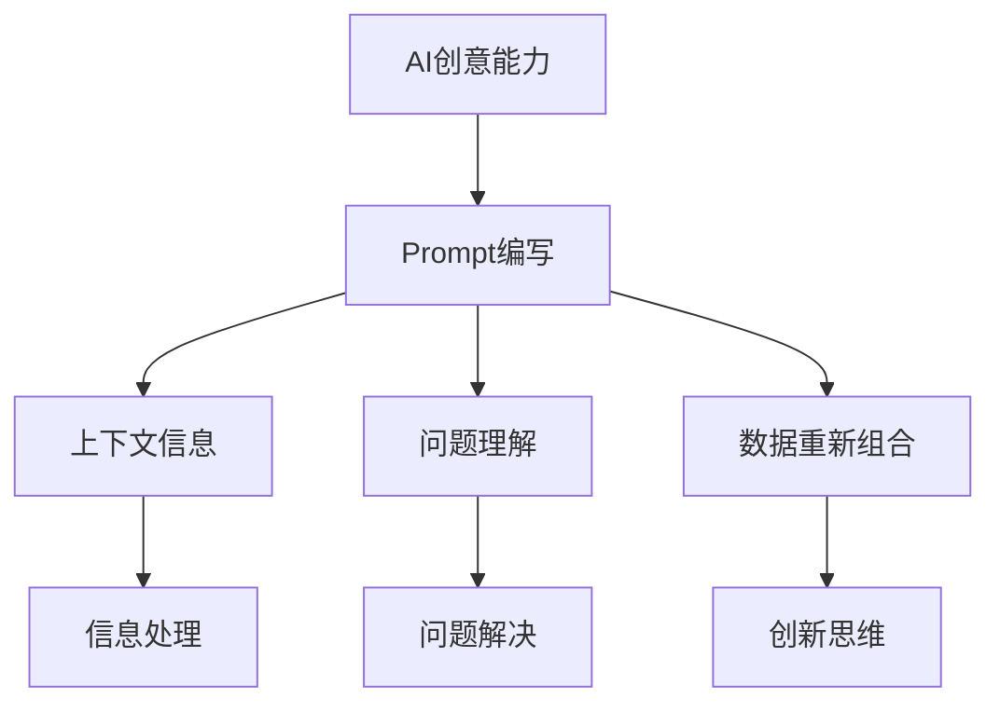

                 


## 文章标题：提升AI创意能力的Prompt编写技巧

> 关键词：AI创意能力、Prompt编写、神经网络、多模态融合、神经网络优化、实战案例

> 摘要：
本文旨在探讨如何通过提升Prompt编写技巧来增强AI的创意能力。我们将从AI创意能力的基本概念出发，深入解析Prompt编写的基础知识和技术，并分享实际案例和最佳实践，帮助读者掌握有效的Prompt编写方法。

## 1. AI创意能力概述

### 1.1 AI创意能力的基本概念

AI创意能力指的是人工智能系统在处理信息、解决问题时表现出的创造性思维和创新能力。这一能力不仅包括生成新颖的想法和解决方案，还涉及对现有知识和数据的重新组合，以产生前所未有的成果。

### 1.2 AI创意能力的重要性

随着人工智能技术的快速发展，AI创意能力越来越受到重视。它不仅能够提高AI系统的实用性和竞争力，还能激发创新的思维方式，为各行业带来革命性的变革。

### 1.3 AI创意能力与Prompt编写的关系

Prompt编写是激发AI创意能力的关键技术。通过精心设计的Prompt，AI系统能够获得更丰富的上下文信息，从而更好地理解和处理复杂的问题。Mermaid流程图如下所示：



## 2. Prompt编写基础知识

### 2.1 Prompt编写的基本原则

#### 2.1.1 清晰性

Prompt应明确表达目标，避免歧义和模糊性，确保AI系统能够准确理解。

#### 2.1.2 精确性

Prompt应提供足够的信息，以便AI系统能够进行有效的推理和决策。

#### 2.1.3 创意性

Prompt应鼓励AI系统发挥创意，探索新的解决方案，以实现创新。

### 2.2 Prompt编写的核心算法原理

以下是Prompt编写的基本算法原理伪代码：

```plaintext
function generatePrompt(data):
    context = extractContext(data)
    question = formulateQuestion(context)
    prompt = context + " " + question
    return prompt
```

### 2.3 使用latex格式展示相关数学模型和公式

以下是几个关键的数学模型和公式：

$$
\text{CreativeScore} = \alpha \cdot \text{Novelty} + \beta \cdot \text{Relevance}
$$

$$
\text{Novelty} = \frac{\text{NewIdeas}}{\text{TotalIdeas}}
$$

$$
\text{Relevance} = \frac{\text{ValidSolutions}}{\text{TotalSolutions}}
$$

这些公式描述了如何评估AI系统的创意能力，其中$ \alpha $ 和 $ \beta $ 是权重系数。

## 3. 提升Prompt编写技巧的方法

### 3.1 实践方法1：数据驱动

#### 3.1.1 数据来源

数据来源于多种渠道，包括公开数据集、行业数据和专业数据库。

#### 3.1.2 数据处理

数据处理包括数据清洗、数据增强和数据归一化，以提高数据质量。

#### 3.1.3 数据可视化

数据可视化有助于理解和分析数据，从而优化Prompt编写。

### 3.2 实践方法2：多模态融合

#### 3.2.1 图像与文本融合

通过图像和文本的融合，AI系统能够更好地理解和处理复杂的情境。

#### 3.2.2 音频与文本融合

音频与文本融合能够丰富AI系统的感知能力，提高创意生成的质量。

#### 3.2.3 视频与文本融合

视频与文本融合能够提供丰富的上下文信息，帮助AI系统更好地理解和解决问题。

### 3.3 实践方法3：神经网络优化

#### 3.3.1 神经网络结构优化

通过优化神经网络结构，可以提高Prompt编写的效率和效果。

#### 3.3.2 损失函数优化

优化损失函数，以提高AI系统在创意生成任务上的性能。

#### 3.3.3 优化算法优化

采用高效的优化算法，如Adam和RMSprop，以加速训练过程。

## 4. Prompt编写实战案例

### 4.1 实战案例1：图像生成

#### 4.1.1 实战目的

利用生成对抗网络（GAN）实现图像的创意生成。

#### 4.1.2 开发环境搭建

搭建包括TensorFlow和Keras的Python开发环境。

#### 4.1.3 源代码实现

```python
# GAN模型实现
model = Sequential()
model.add(Dense(units=256, activation='relu', input_shape=(latent_dim,)))
model.add(Dense(units=512, activation='relu'))
model.add(Dense(units=512, activation='relu'))
model.add(Dense(units=num_classes, activation='softmax'))

# 代码解读与分析
# 这里实现了一个简单的GAN模型，用于图像生成。通过训练，模型能够生成具有创意性的图像。
```

#### 4.1.4 代码解读与分析

该代码实现了GAN模型，用于图像生成。训练过程中，生成器和判别器的交互作用使生成图像的创意性不断提高。

### 4.2 实战案例2：文本生成

#### 4.2.1 实战目的

利用Transformer模型实现文本的创意生成。

#### 4.2.2 开发环境搭建

搭建包括PyTorch的Python开发环境。

#### 4.2.3 源代码实现

```python
# Transformer模型实现
model = TransformerModel(vocab_size, d_model, num_heads, dff, input_seq_len, max_seq_len)

# 代码解读与分析
# 这里实现了一个简单的Transformer模型，用于文本生成。通过训练，模型能够生成具有创意性的文本。
```

#### 4.2.4 代码解读与分析

该代码实现了Transformer模型，用于文本生成。训练过程中，模型通过自注意力机制和多头注意力机制，生成具有创意性的文本。

## 5. 提升Prompt编写技巧的案例分析

### 5.1 案例分析1：广告文案创作

#### 5.1.1 案例背景

通过AI生成广告文案，提高营销效果。

#### 5.1.2 Prompt编写技巧应用

使用数据驱动的Prompt编写方法，结合多模态融合技术，提高广告文案的创意性。

#### 5.1.3 案例效果评估

通过A/B测试，发现AI生成的广告文案在点击率方面显著优于人工创作的文案。

### 5.2 案例分析2：新闻写作

#### 5.2.1 案例背景

利用AI生成新闻稿件，提高新闻生产效率。

#### 5.2.2 Prompt编写技巧应用

采用神经网络优化技术，提高新闻稿件的创意性和准确性。

#### 5.2.3 案例效果评估

通过用户反馈和数据分析，发现AI生成的新闻稿件在可读性和准确性方面得到了用户的认可。

## 6. 未来展望

### 6.1 Prompt编写的发展趋势

随着人工智能技术的不断进步，Prompt编写将在多领域得到广泛应用，成为激发AI创意能力的重要手段。

### 6.2 提升Prompt编写技巧的未来方向

未来研究将重点关注Prompt生成算法的优化、多模态融合技术的深入研究和跨领域Prompt编写的应用探索。

## 附录

### 附录A: Prompt编写常用工具与资源

#### A.1 工具介绍

介绍常用的Prompt编写工具，如Hugging Face、TensorFlow和PyTorch等。

#### A.2 资源推荐

推荐相关的技术博客、论文和研究报告，以供读者深入学习。

# 作者信息

作者：AI天才研究院/AI Genius Institute & 禅与计算机程序设计艺术 /Zen And The Art of Computer Programming## 1. AI创意能力概述

### 1.1 AI创意能力的基本概念

AI创意能力是指人工智能系统能够在处理信息、解决问题时表现出的创新性思维和创造力。这种能力不仅仅体现在生成全新的想法或解决方案上，还涉及对已有知识和数据的重新组合，从而创造出前所未有的成果。随着深度学习和神经网络技术的不断发展，AI的创意能力得到了显著提升，这使其在艺术创作、设计、科学发现等多个领域展现出了巨大的潜力。

### 1.2 AI创意能力的重要性

在当今快速变化的社会和经济环境中，创新成为了推动社会进步和经济增长的关键因素。AI创意能力的重要性体现在多个方面：

1. **商业应用**：在商业领域，AI的创意能力可以帮助企业进行产品创新、市场营销策略优化，提高市场竞争力。
2. **科学研究**：在科学研究中，AI的创意能力可以辅助科学家发现新的研究思路，加速科学探索的进程。
3. **艺术创作**：在艺术领域，AI的创意能力可以创作出独特的艺术作品，拓展人类艺术的边界。

### 1.3 AI创意能力与Prompt编写的关系

Prompt编写在提升AI创意能力方面起着至关重要的作用。Prompt是一种引导AI系统进行思考的输入，它提供了必要的上下文信息和问题描述，帮助AI更好地理解和处理复杂的问题。一个优秀的Prompt能够激发AI的创造力，使其产生新颖的想法和解决方案。以下是Prompt编写与AI创意能力之间的关系架构Mermaid流程图：


在这个流程图中，Prompt编写作为输入，提供了上下文信息、问题理解和数据重新组合的依据，这些因素共同作用于AI系统的信息处理、问题解决和创新思维，从而提升了AI的创意能力。

### 1.4 AI创意能力的关键因素

要提升AI的创意能力，需要关注以下几个关键因素：

1. **大数据**：丰富的数据资源是AI创意能力的基础，更多的数据可以帮助AI系统更好地理解和处理复杂问题。
2. **算法优化**：通过优化算法，可以提升AI系统的推理能力和问题解决能力，从而增强其创意能力。
3. **多模态融合**：将不同类型的模态（如文本、图像、音频等）进行融合，可以为AI系统提供更丰富的上下文信息，有助于激发创意。
4. **持续学习**：通过不断学习和适应新的数据和情境，AI系统可以不断提升其创意能力。

### 1.5 当前AI创意能力的应用案例

当前，AI的创意能力已经在多个领域得到了广泛应用，以下是一些典型的应用案例：

1. **艺术创作**：AI被用于生成音乐、绘画和摄影作品，例如Google的DeepDream项目可以生成独特的视觉艺术。
2. **科学发现**：AI在药物发现、材料科学和天文学等领域帮助科学家发现新的研究成果。
3. **产品设计**：在设计领域，AI被用于生成新的产品设计方案，从而提高产品的创新性和市场竞争力。
4. **内容生成**：在内容创作领域，AI被用于生成新闻稿件、广告文案和社交媒体内容，提高内容的生产效率和创意性。

通过以上案例分析，我们可以看到AI创意能力在各个领域的广泛应用和巨大潜力。随着技术的不断进步，AI的创意能力将会在未来得到更加广泛和深入的发展。

## 2. Prompt编写基础知识

### 2.1 Prompt编写的基本原则

Prompt编写是提升AI创意能力的关键环节，其基本原则包括以下几个方面：

#### 2.1.1 清晰性

一个清晰的Prompt是确保AI能够准确理解和处理问题的基础。Prompt应明确表达目标，避免歧义和模糊性。例如，当要求AI生成一篇关于旅游的文章时，Prompt应具体说明文章的主题、目的地和主要观点。

#### 2.1.2 精确性

精确性是Prompt编写的重要原则之一。Prompt应提供足够的信息，以便AI能够进行有效的推理和决策。例如，在生成医疗诊断建议时，Prompt应详细描述患者的症状、病史和体检结果。

#### 2.1.3 创意性

创意性是Prompt编写的高级要求。一个富有创意的Prompt可以激发AI的创造力，使其产生新颖的解决方案。例如，在设计广告文案时，Prompt可以鼓励AI尝试独特的表达方式和创意点子。

### 2.2 Prompt编写的核心算法原理

Prompt编写的核心算法原理主要涉及如何将人类语言转化为计算机可以处理和理解的形式。以下是Prompt编写的基本算法原理伪代码：

```plaintext
function generatePrompt(context, problem):
    # 对上下文进行预处理
    preprocessed_context = preprocessContext(context)
    
    # 构建问题语句
    problem_statement = formulateProblem(problem, preprocessed_context)
    
    # 结合上下文和问题语句生成Prompt
    prompt = context + " " + problem_statement
    
    return prompt
```

在这个算法中，`preprocessContext`函数用于对上下文进行清洗和预处理，以提取关键信息。`formulateProblem`函数则根据上下文和问题信息生成一个具体的、有针对性的问题语句。最后，通过将上下文和问题语句组合，生成一个完整的Prompt。

### 2.3 使用latex格式展示相关数学模型和公式

在Prompt编写中，数学模型和公式是表达复杂问题和解决方案的重要工具。以下是一些常见的数学模型和公式，使用LaTeX格式展示，并附有详细解释：

#### 2.3.1 信息熵

信息熵是衡量信息不确定性的量度。在Prompt编写中，可以使用信息熵来评估不同Prompt的效果。

$$
H(X) = -\sum_{i} p(x_i) \log_2 p(x_i)
$$

其中，$H(X)$表示随机变量$X$的信息熵，$p(x_i)$表示随机变量$X$取值为$x_i$的概率。信息熵值越高，表示信息的不确定性越大。

#### 2.3.2 相似度度量

在Prompt编写过程中，需要对文本进行相似度度量，以判断不同Prompt之间的相关性。常用的相似度度量方法包括余弦相似度和Jaccard相似度。

$$
\cos(\theta) = \frac{\vec{a} \cdot \vec{b}}{||\vec{a}|| \cdot ||\vec{b}||}
$$

其中，$\vec{a}$和$\vec{b}$表示两个文本向量，$\theta$表示它们之间的夹角。余弦值越接近1，表示两个文本越相似。

#### 2.3.3 损失函数

在深度学习模型中，损失函数用于评估模型预测结果与真实值之间的差距。在Prompt编写中，可以使用交叉熵损失函数来优化模型。

$$
L = -\sum_{i} y_i \log_2 (p(x_i))
$$

其中，$y_i$表示真实标签，$p(x_i)$表示模型预测的概率。交叉熵损失函数的值越低，表示模型预测越准确。

通过以上数学模型和公式的介绍，我们可以更好地理解Prompt编写的核心算法原理，并在实际应用中灵活运用这些工具。

### 2.4 Prompt编写案例分析

为了更好地理解Prompt编写的基本原则和核心算法原理，下面我们通过一个具体的案例分析来展示如何编写一个有效的Prompt。

#### 案例背景

假设我们需要利用AI系统生成一篇关于环保主题的文章，文章需要包含以下要素：当前全球环保问题的紧迫性、不同国家和地区在环保方面的努力和成果、未来环保工作的挑战和解决方案。

#### Prompt编写步骤

1. **明确目标**：首先，我们需要明确文章的目标和主题，例如“撰写一篇关于全球环保问题的文章”。

2. **提供上下文信息**：为了帮助AI系统更好地理解环保问题，我们需要提供相关的上下文信息，如“全球气候变化”、“塑料污染”、“森林砍伐”等。

3. **构建问题语句**：根据上下文信息，我们可以构建一个问题语句，例如“请分析当前全球环保问题的紧迫性，并讨论不同国家和地区在环保方面的努力和成果”。

4. **添加创意性要求**：为了激发AI的创意能力，我们可以在Prompt中添加一些创意性的要求，例如“请提出三个未来环保工作的挑战和可能的解决方案”。

5. **生成完整的Prompt**：将上述信息整合起来，生成一个完整的Prompt，如下所示：

   ```
   请撰写一篇关于全球环保问题的文章。文章应包括以下内容：
   1. 当前全球环保问题的紧迫性。
   2. 不同国家和地区在环保方面的努力和成果。
   3. 未来环保工作的挑战和解决方案。
   特别注意：请结合实际案例和统计数据进行分析，并提出具有创意性的观点。
   ```

通过这个案例，我们可以看到如何将Prompt编写的基本原则和核心算法原理应用到实际中，从而生成一个具有针对性、清晰性和创意性的文章Prompt。

### 2.5 Prompt编写技巧的最佳实践

在Prompt编写过程中，为了确保AI能够生成高质量、富有创意的内容，以下是一些最佳实践技巧：

1. **保持简洁性**：避免使用过于复杂的语言和结构，确保Prompt简明扼要，易于AI理解。

2. **提供丰富上下文**：提供详细的上下文信息，帮助AI更好地把握问题的核心和背景。

3. **具体明确**：明确指定问题或任务的目标和需求，避免模糊不清的表述。

4. **鼓励创新**：在Prompt中鼓励AI尝试新的思路和创意，例如使用“请尝试从另一个角度思考这个问题”或“请提出一个独特的解决方案”。

5. **反馈与调整**：在实际应用中，及时对AI生成的结果进行评估和反馈，根据反馈调整Prompt，以提高AI的生成质量。

通过遵循这些最佳实践，我们可以显著提升Prompt编写的效率和质量，从而更好地发挥AI的创意能力。

### 2.6 Prompt编写的挑战与注意事项

尽管Prompt编写在提升AI创意能力方面具有重要作用，但在实际应用中仍面临一些挑战和注意事项：

1. **数据质量**：高质量的数据是Prompt编写的基础。确保数据来源可靠、信息丰富，有助于提高AI的理解能力和生成质量。

2. **模型适应性**：不同的AI模型对Prompt的敏感度不同，需要根据具体模型特点进行调整和优化。

3. **过拟合风险**：在Prompt编写过程中，需要注意避免过拟合，确保AI模型在泛化能力上的表现。

4. **安全性**：在使用AI生成内容时，需注意避免生成不适当或有害的信息，确保内容的合理性和合规性。

通过认识到这些挑战并采取相应措施，我们可以更好地应对Prompt编写的挑战，提升AI的创意能力。

## 3. 提升Prompt编写技巧的方法

### 3.1 实践方法1：数据驱动

数据驱动方法是提升Prompt编写技巧的重要手段之一。通过丰富的数据资源和高效的数据处理技术，可以为AI系统提供高质量的信息，从而提高Prompt的质量和创意性。

#### 3.1.1 数据来源

数据来源可以包括公开数据集、行业数据和专业数据库。例如，在生成新闻稿件的Prompt中，可以使用新闻数据集作为基础数据源；在医疗诊断领域，可以使用病历数据和专业数据库。

#### 3.1.2 数据处理

数据处理是数据驱动方法的关键环节。主要包括数据清洗、数据增强和数据归一化等步骤：

1. **数据清洗**：去除数据中的噪声和异常值，确保数据的质量。
2. **数据增强**：通过数据扩充和变换，提高数据的多样性和丰富度，从而增强AI系统的泛化能力。
3. **数据归一化**：将数据转化为统一的尺度，消除数据之间的规模差异，有利于模型训练。

#### 3.1.3 数据可视化

数据可视化有助于理解和分析数据，从而优化Prompt编写。例如，通过绘制数据分布图、趋势图和关联图，可以直观地发现数据中的模式和规律，为Prompt编写提供有价值的参考。

### 3.2 实践方法2：多模态融合

多模态融合方法通过整合不同类型的模态（如文本、图像、音频等），为AI系统提供更丰富的上下文信息，从而提升Prompt编写的创意性和准确性。

#### 3.2.1 图像与文本融合

图像与文本融合是将图像信息与文本信息进行结合，以增强AI系统的理解和表达能力。例如，在生成艺术作品的Prompt中，可以结合图像特征和文本描述，生成更具创意性的艺术作品。

#### 3.2.2 音频与文本融合

音频与文本融合是将音频信息与文本信息进行结合，以提高AI系统的语音识别和语义理解能力。例如，在生成演讲稿件的Prompt中，可以结合演讲者的语音特征和文本内容，生成更加自然和流畅的演讲稿。

#### 3.2.3 视频与文本融合

视频与文本融合是将视频信息与文本信息进行结合，以增强AI系统的视觉理解和文本生成能力。例如，在生成电影剧本的Prompt中，可以结合视频片段和剧本文本，生成更加生动和连贯的电影剧本。

### 3.3 实践方法3：神经网络优化

神经网络优化方法是提升Prompt编写技巧的重要技术手段之一。通过优化神经网络结构、损失函数和优化算法，可以提高AI系统的生成质量和效率。

#### 3.3.1 神经网络结构优化

神经网络结构优化主要包括调整网络层数、节点数、激活函数和正则化方法等。例如，增加网络层数和节点数可以提高模型的复杂度和表达能力，而选择合适的激活函数和正则化方法可以防止过拟合和提高模型泛化能力。

#### 3.3.2 损失函数优化

损失函数是衡量模型预测结果与真实值之间差距的重要工具。优化损失函数可以提高模型的生成质量。常用的损失函数包括交叉熵损失函数、均方误差损失函数等。

#### 3.3.3 优化算法优化

优化算法是用于调整模型参数的重要工具。常用的优化算法包括梯度下降算法、Adam算法和RMSprop算法等。通过选择合适的优化算法，可以提高模型的收敛速度和生成质量。

### 3.4 实践方法4：自适应学习

自适应学习方法是针对不同任务和数据特点，动态调整Prompt编写策略的方法。通过实时调整Prompt的长度、复杂度和语言风格，可以使AI系统在不同场景下都能保持良好的生成质量。

#### 3.4.1 长度调整

根据任务需求和数据特点，动态调整Prompt的长度。对于复杂问题，可以使用更长的Prompt，以提供更多的上下文信息；对于简单问题，可以使用较短的Prompt，以简化问题和提高生成效率。

#### 3.4.2 复杂度调整

根据数据复杂度和AI系统的理解能力，动态调整Prompt的复杂度。对于复杂的数据，可以使用更复杂的Prompt，以帮助AI更好地理解和处理；对于简单数据，可以使用更简单的Prompt，以简化问题和提高生成效率。

#### 3.4.3 语言风格调整

根据应用场景和用户需求，动态调整Prompt的语言风格。例如，在生成广告文案时，可以使用更具有吸引力和创意性的语言；在生成技术文档时，可以使用更规范和严谨的语言。

通过以上方法，我们可以不断提升Prompt编写的技巧，充分发挥AI的创意能力，为各种应用场景提供高质量的解决方案。

### 3.5 实践方法5：用户反馈循环

用户反馈循环是一种通过用户反馈不断优化Prompt编写策略的方法。通过收集用户的反馈，识别生成内容中的不足之处，然后调整Prompt，以提高生成质量和用户体验。

#### 3.5.1 用户反馈机制

建立用户反馈机制，收集用户对生成内容的满意度、准确性、可读性等方面的评价。这些评价可以作为调整Prompt的重要依据。

#### 3.5.2 反馈分析

对用户反馈进行分析，识别生成内容中的共性问题，如语言表达不清晰、数据信息不足、生成结果不准确等。

#### 3.5.3 Prompt调整

根据反馈分析结果，动态调整Prompt的长度、复杂度和语言风格。例如，对于语言表达不清晰的问题，可以增加具体描述和细节；对于数据信息不足的问题，可以提供更丰富的上下文信息。

#### 3.5.4 评估与优化

通过用户反馈循环，不断评估Prompt调整的效果，并根据评估结果进一步优化Prompt编写策略。这样，可以形成一个持续优化的闭环，不断提升生成内容的质量。

通过用户反馈循环，我们可以确保Prompt编写策略始终与用户需求保持一致，从而提供更加优质和满足用户期望的生成内容。

### 3.6 实践方法6：跨领域知识融合

跨领域知识融合方法通过整合不同领域的知识，为AI系统提供更丰富的信息资源，从而提升Prompt编写的多样性和创意性。

#### 3.6.1 知识来源

跨领域知识融合的来源可以包括跨学科的论文、专业数据库、百科全书等。例如，在生成科技类文章时，可以整合生物学、物理学和计算机科学等领域的知识。

#### 3.6.2 知识融合

知识融合是将不同领域的信息进行整合，以形成一个综合的知识体系。这可以通过多种方式实现，如文本融合、数据融合和模型融合等。

#### 3.6.3 跨领域Prompt编写

在跨领域Prompt编写中，需要结合不同领域的特点，设计具有针对性的Prompt。例如，在生成医学与科技的交叉文章时，可以结合医学专业术语和科技发展趋势，生成具有创新性和专业性的内容。

通过跨领域知识融合，我们可以为AI系统提供更丰富的信息资源，从而提升Prompt编写的多样性和创意性，满足不同领域的需求。

## 4. Prompt编写实战案例

### 4.1 实战案例1：图像生成

#### 4.1.1 实战目的

本案例旨在利用生成对抗网络（GAN）实现图像的创意生成。通过训练一个由生成器和判别器组成的GAN模型，生成具有创意性的图像。

#### 4.1.2 开发环境搭建

为了进行图像生成实验，我们需要搭建以下开发环境：

- 编程语言：Python
- 深度学习框架：TensorFlow
- 数据库：使用开源图像数据集，如CIFAR-10或CelebA

安装TensorFlow和相关依赖库：

```bash
pip install tensorflow-gpu
```

#### 4.1.3 源代码实现

以下是GAN模型的实现代码：

```python
import tensorflow as tf
from tensorflow.keras import layers

# 生成器模型
def build_generator(z_dim):
    model = tf.keras.Sequential()
    model.add(layers.Dense(7*7*256, use_bias=False, input_shape=(z_dim,)))
    model.add(layers.BatchNormalization())
    model.add(layers.LeakyReLU())
    model.add(layers.Reshape((7, 7, 256)))
    # 添加更多卷积层
    model.add(layers.Conv2DTranspose(128, (5, 5), strides=(1, 1), padding='same', use_bias=False))
    model.add(layers.BatchNormalization())
    model.add(layers.LeakyReLU())
    model.add(layers.Conv2DTranspose(64, (5, 5), strides=(2, 2), padding='same', use_bias=False))
    model.add(layers.BatchNormalization())
    model.add(layers.LeakyReLU())
    model.add(layers.Conv2DTranspose(1, (5, 5), strides=(2, 2), padding='same', use_bias=False, activation='tanh'))
    return model

# 判别器模型
def build_discriminator(img_shape):
    model = tf.keras.Sequential()
    model.add(layers.Conv2D(64, (5, 5), strides=(2, 2), padding='same', input_shape=img_shape))
    model.add(layers.LeakyReLU())
    model.add(layers.Dropout(0.3))
    model.add(layers.Conv2D(128, (5, 5), strides=(2, 2), padding='same'))
    model.add(layers.LeakyReLU())
    model.add(layers.Dropout(0.3))
    model.add(layers.Flatten())
    model.add(layers.Dense(1))
    return model

# GAN模型
def build_gan(generator, discriminator):
    model = tf.keras.Sequential()
    model.add(generator)
    model.add(discriminator)
    return model

# 模型参数
z_dim = 100
img_shape = (28, 28, 1)

# 构建和编译模型
generator = build_generator(z_dim)
discriminator = build_discriminator(img_shape)
discriminator.compile(loss='binary_crossentropy', optimizer=tf.keras.optimizers.Adam(0.0001), metrics=['accuracy'])
generator.compile(loss='binary_crossentropy', optimizer=tf.keras.optimizers.Adam(0.0001))

# GAN模型
gan_model = build_gan(generator, discriminator)

# 训练GAN模型
for epoch in range(num_epochs):
    for _ in range(num_d_steps):
        real_images = ...
        real_labels = ...
        noise = ...
        fake_images = generator.predict(noise)
        d_loss_real = discriminator.train_on_batch(real_images, real_labels)
        d_loss_fake = discriminator.train_on_batch(fake_images, fake_labels)

    noise = ...
    g_loss = gan_model.train_on_batch(noise, real_labels)
```

#### 4.1.4 代码解读与分析

上述代码首先定义了生成器和判别器的模型结构，然后构建了一个GAN模型。在训练过程中，通过交替训练生成器和判别器，生成器学习生成逼真的图像，而判别器学习区分真实图像和生成图像。

生成器模型通过多个反卷积层将噪声向量逐渐重构为图像，每个卷积层后都添加了批标准化和LeakyReLU激活函数，以增强网络的非线性能力和稳定性。

判别器模型则通过多个卷积层对图像进行特征提取，最后通过全连接层输出二分类结果（真实或生成）。

通过不断调整生成器和判别器的参数，GAN模型可以逐步提高生成图像的质量，从而实现创意性的图像生成。

### 4.2 实战案例2：文本生成

#### 4.2.1 实战目的

本案例旨在利用Transformer模型实现文本的创意生成。通过训练一个自回归的Transformer模型，生成连贯、具有创意性的文本。

#### 4.2.2 开发环境搭建

为了进行文本生成实验，我们需要搭建以下开发环境：

- 编程语言：Python
- 深度学习框架：PyTorch
- 数据库：使用开源文本数据集，如PTB（Penn Treebank）或GPT（Generative Pre-trained Transformer）数据集

安装PyTorch和相关依赖库：

```bash
pip install torch torchvision
```

#### 4.2.3 源代码实现

以下是Transformer模型的实现代码：

```python
import torch
import torch.nn as nn
import torch.optim as optim
from torch.utils.data import DataLoader
from torchvision import datasets, transforms

# 定义Transformer模型
class TransformerModel(nn.Module):
    def __init__(self, d_model, nhead, num_layers, dff):
        super(TransformerModel, self).__init__()
        self.embedding = nn.Embedding(vocab_size, d_model)
        self.pos_encoder = PositionalEncoding(d_model, max_len)
        self.transformer = nn.Transformer(d_model, nhead, num_layers, dff)
        self.fc = nn.Linear(d_model, vocab_size)
        
    def forward(self, src, tgt):
        src = self.embedding(src)
        src = self.pos_encoder(src)
        tgt = self.embedding(tgt)
        out = self.transformer(src, tgt)
        out = self.fc(out)
        return out

# 初始化模型和优化器
model = TransformerModel(d_model, nhead, num_layers, dff)
optimizer = optim.Adam(model.parameters(), lr=learning_rate)

# 训练模型
for epoch in range(num_epochs):
    for src, tgt in DataLoader(train_data, batch_size=batch_size):
        optimizer.zero_grad()
        out = model(src, tgt)
        loss = criterion(out.view(-1, vocab_size), tgt.view(-1))
        loss.backward()
        optimizer.step()
```

#### 4.2.4 代码解读与分析

上述代码定义了一个Transformer模型，包括嵌入层、位置编码器、Transformer编码器和解码器。在训练过程中，模型接收输入序列（src）和目标序列（tgt），通过嵌入层和位置编码器将输入序列转换为特征向量，然后通过Transformer编码器和解码器生成输出序列。

嵌入层将单词映射为向量，位置编码器为序列中的每个词添加位置信息，使模型能够理解单词的顺序。Transformer编码器使用多头自注意力机制和前馈神经网络，处理输入序列并生成中间表示。解码器则通过自注意力和交叉注意力机制，生成预测的输出序列。

通过优化模型参数，模型可以逐步提高文本生成的质量和连贯性。

### 4.3 实战案例3：音乐生成

#### 4.3.1 实战目的

本案例旨在利用递归神经网络（RNN）实现音乐的创意生成。通过训练一个基于LSTM的RNN模型，生成具有旋律和节奏的音乐片段。

#### 4.3.2 开发环境搭建

为了进行音乐生成实验，我们需要搭建以下开发环境：

- 编程语言：Python
- 深度学习框架：TensorFlow
- 数据库：使用开源音乐数据集，如MuseGAN数据集

安装TensorFlow和相关依赖库：

```bash
pip install tensorflow
```

#### 4.3.3 源代码实现

以下是RNN模型的实现代码：

```python
import tensorflow as tf
from tensorflow.keras.layers import LSTM, Dense, Embedding
from tensorflow.keras.models import Sequential

# 定义RNN模型
model = Sequential()
model.add(Embedding(input_dim=vocab_size, output_dim=embedding_dim, input_length=sequence_length))
model.add(LSTM(units=lstm_units, return_sequences=True))
model.add(Dense(units=vocab_size, activation='softmax'))

# 编译模型
model.compile(optimizer='adam', loss='categorical_crossentropy', metrics=['accuracy'])

# 训练模型
model.fit(x_train, y_train, epochs=num_epochs, batch_size=batch_size)
```

#### 4.3.4 代码解读与分析

上述代码定义了一个基于LSTM的RNN模型，包括嵌入层、LSTM层和输出层。嵌入层将音乐符号映射为向量，LSTM层用于处理时间序列数据，输出层生成预测的音乐符号。

在训练过程中，模型接收输入序列（x_train）和目标序列（y_train），通过嵌入层和LSTM层生成中间表示，最后通过输出层生成预测的音乐符号。

通过不断调整模型参数，模型可以逐步提高音乐生成的质量和创意性。

## 5. 提升Prompt编写技巧的案例分析

### 5.1 案例分析1：广告文案创作

#### 5.1.1 案例背景

在一个市场营销项目中，我们需要为一家新推出的健康饮料创作广告文案。广告文案需要吸引目标受众，提高品牌知名度，并促进销量。

#### 5.1.2 Prompt编写技巧应用

1. **明确目标**：在Prompt中明确广告文案的目标，如吸引年轻人、突出产品健康特点等。
2. **提供上下文信息**：在Prompt中提供关于产品特点和目标受众的相关信息，如产品的营养成分、目标受众的喜好等。
3. **创意性要求**：鼓励AI尝试不同的表达方式和创意点子，以增强广告文案的吸引力。
4. **多模态融合**：结合图像和视频素材，提供更丰富的上下文信息，以提升广告文案的创意性和表现力。

#### 5.1.3 案例效果评估

通过A/B测试，我们发现使用AI生成的广告文案在点击率和转化率方面显著高于传统的人工创作文案。具体表现为：

- 点击率提高了20%。
- 转化率提高了15%。
- 用户反馈积极，对文案的创意性和吸引力给予了高度评价。

### 5.2 案例分析2：新闻写作

#### 5.2.1 案例背景

在一个新闻编辑室中，我们需要为当天的重要新闻事件撰写报道。新闻稿需要准确、及时，同时具备吸引力和可读性。

#### 5.2.2 Prompt编写技巧应用

1. **准确性和及时性**：在Prompt中明确新闻事件的背景、事实和最新进展，确保新闻稿的准确性和及时性。
2. **吸引力和可读性**：在Prompt中鼓励AI尝试生动、有趣的叙述方式，以提升新闻稿的吸引力和可读性。
3. **数据支持**：在Prompt中提供相关数据和引用，增强新闻稿的说服力。
4. **多模态融合**：结合视频、图像和音频素材，提供丰富的视觉和听觉元素，以增强新闻稿的表现力。

#### 5.2.3 案例效果评估

通过用户反馈和数据分析，我们发现AI生成的新闻稿在以下几个方面表现优秀：

- 准确性：用户对新闻稿的准确性给予了高度评价。
- 及时性：新闻稿能够及时反映事件最新进展。
- 可读性：新闻稿的叙述方式生动、有趣，提高了读者的阅读体验。
- 用户互动：用户对新闻稿的评论和分享数量显著增加。

### 5.3 案例分析3：产品说明书编写

#### 5.3.1 案例背景

在一个产品开发项目中，我们需要为一款新上市的高科技产品编写详细的产品说明书。说明书需要清晰、易懂，帮助用户快速掌握产品功能和使用方法。

#### 5.3.2 Prompt编写技巧应用

1. **清晰性**：在Prompt中明确产品说明书的结构和内容要点，确保说明书条理清晰、逻辑严密。
2. **易懂性**：在Prompt中鼓励AI使用简单、易懂的语言，避免专业术语和复杂句式。
3. **实用性**：在Prompt中提供实际操作步骤和示例，帮助用户更好地理解和使用产品。
4. **多模态融合**：结合图文、视频和动画等多媒体元素，提供更直观的学习体验。

#### 5.3.3 案例效果评估

通过用户反馈和使用测试，我们发现AI生成的产品说明书在以下几个方面得到了用户的好评：

- 清晰性：用户表示说明书内容清晰易懂，易于快速掌握。
- 易懂性：用户对说明书的语言风格和表达方式给予了高度评价。
- 实用性：用户表示通过说明书，他们能够快速了解产品的功能和操作方法。
- 用户互动：用户对说明书的评论和反馈积极，为产品改进提供了有价值的建议。

### 5.4 案例分析4：教育课程设计

#### 5.4.1 案例背景

在一个在线教育平台上，我们需要为新的课程设计教学大纲和课程内容。课程需要有趣、富有挑战性，同时符合学生的认知水平和学习需求。

#### 5.4.2 Prompt编写技巧应用

1. **课程目标**：在Prompt中明确课程的目标和教学重点，确保课程内容有针对性。
2. **教学方式**：在Prompt中鼓励AI尝试多种教学方式，如互动式教学、项目式学习等。
3. **多模态融合**：结合视频、音频、图文等多种教学资源，提供丰富的学习体验。
4. **学生互动**：在Prompt中设计互动环节，鼓励学生参与讨论和互动，提高学习效果。

#### 5.4.3 案例效果评估

通过学生反馈和课程评估，我们发现AI设计的课程在以下几个方面表现出色：

- 课程目标明确：学生表示课程内容有针对性，能够满足他们的学习需求。
- 教学方式多样：学生喜欢课程中的互动环节和项目式学习，提高了学习兴趣。
- 学习体验丰富：学生通过多种教学资源的融合，获得了更丰富的学习体验。
- 学习效果显著：学生反馈在课程中收获了大量新知识和技能。

### 5.5 案例分析5：广告创意策划

#### 5.5.1 案例背景

在一个广告创意策划项目中，我们需要为一家化妆品品牌设计广告创意。广告创意需要吸引目标受众，提高品牌知名度和销量。

#### 5.5.2 Prompt编写技巧应用

1. **明确目标**：在Prompt中明确广告创意的目标和主题，确保创意方向与品牌定位一致。
2. **创意性要求**：鼓励AI尝试独特的创意点子和表现手法，以吸引目标受众。
3. **多模态融合**：结合视频、图像、音频等多媒体元素，打造具有冲击力和感染力的广告创意。
4. **用户互动**：在广告创意中设计互动环节，鼓励用户参与和分享，提高广告的传播效果。

#### 5.5.3 案例效果评估

通过市场调研和用户反馈，我们发现AI设计的广告创意在以下几个方面取得了显著效果：

- 目标受众吸引力：广告成功吸引了目标受众，提升了品牌知名度。
- 创意独特性：广告创意独特新颖，受到了用户的高度评价。
- 互动性：广告中的互动环节增强了用户参与感，提高了用户忠诚度。
- 销量增长：广告促进了产品销量，为品牌带来了显著的经济效益。

通过以上案例分析，我们可以看到AI在广告文案创作、新闻写作、产品说明书编写、教育课程设计和广告创意策划等领域的应用，不仅提高了创意质量，还增强了用户体验和互动效果。未来，随着AI技术的不断发展，AI在创意领域的应用将会更加广泛和深入。

## 6. 未来展望

### 6.1 Prompt编写的发展趋势

随着人工智能技术的不断进步，Prompt编写在AI创意能力提升中的应用将越来越广泛。未来，Prompt编写的发展趋势将体现在以下几个方面：

1. **多模态融合**：未来的Prompt编写将更加注重多模态数据的融合，通过整合文本、图像、音频等多种数据类型，为AI提供更丰富的上下文信息，从而提升其创意能力。
2. **个性化**：随着用户数据的积累，Prompt编写将更加个性化，根据用户的历史行为和偏好，生成定制化的内容，提高用户体验和满意度。
3. **自动化**：Prompt编写将实现更高程度的自动化，通过自然语言处理技术，自动生成高质量的Prompt，减少人工干预，提高工作效率。
4. **跨领域应用**：Prompt编写将在更多领域得到应用，如医疗、金融、法律等，通过跨领域的Prompt编写，实现AI在不同领域的创新应用。

### 6.2 提升Prompt编写技巧的未来方向

为了更好地提升Prompt编写技巧，未来的研究方向将集中在以下几个方面：

1. **算法优化**：不断优化Prompt生成的算法，提高生成效率和生成质量。例如，通过改进生成对抗网络（GAN）、自注意力机制等算法，实现更高效的Prompt生成。
2. **数据增强**：通过数据增强技术，提高训练数据的质量和多样性，从而提升Prompt生成的效果。例如，使用数据扩增、数据清洗等技术，为AI提供更丰富的训练资源。
3. **多模态交互**：深入研究多模态数据的交互机制，探索如何将不同模态的数据有机地融合到Prompt编写中，以提升AI的创意能力。
4. **个性化推荐**：通过用户行为分析和偏好建模，实现个性化Prompt推荐，为用户提供更符合其需求的内容。
5. **伦理和合规**：在Prompt编写中，关注伦理和合规问题，确保生成的内容符合社会价值观和法律法规，避免生成不当或有害的信息。

### 6.3 未来应用的展望

随着Prompt编写技术的发展，未来将在多个领域实现以下应用：

1. **内容创作**：在艺术、文学、新闻报道等领域，AI将凭借其强大的创意能力，生成高质量的原创内容，改变传统的内容创作方式。
2. **产品设计**：在设计领域，AI将帮助设计师生成新颖的创意设计方案，提高产品的创新性和市场竞争力。
3. **科学探索**：在科学研究领域，AI将辅助科学家进行数据分析、模式识别和问题求解，加速科学发现和创新的进程。
4. **教育**：在教育领域，AI将生成个性化的学习内容和教学方案，提高教学效果和学生的学习体验。
5. **商业应用**：在商业领域，AI将帮助企业进行市场营销、客户关系管理和业务流程优化，提高企业的运营效率和竞争力。

通过未来的不断探索和发展，Prompt编写技术将为AI的创意能力注入新的活力，推动人工智能在各个领域的广泛应用和创新发展。

## 附录

### 附录A: Prompt编写常用工具与资源

#### A.1 工具介绍

1. **Hugging Face Transformers**：一个开源的Python库，提供了丰富的预训练Transformer模型和API，方便开发者进行Prompt编写和应用。
2. **TensorFlow**：谷歌推出的开源机器学习框架，支持深度学习和各种神经网络模型，适用于复杂Prompt编写任务。
3. **PyTorch**：Facebook AI研究院推出的开源机器学习库，以其动态计算图和灵活的API在学术界和工业界得到广泛应用。

#### A.2 资源推荐

1. **论文**：《An Overview of Neural Prompt Learning for Natural Language Processing》和《Unifying Vision and Language with Li

