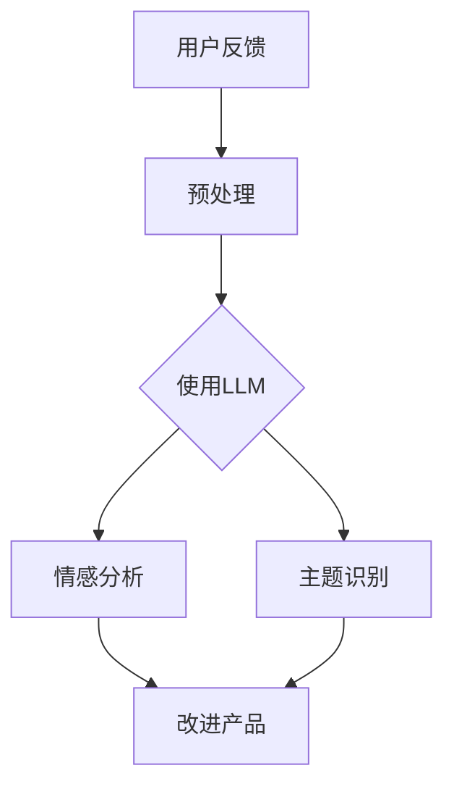

                 

### 提升LLM应用用户反馈收集与分析效率

---

**关键词：** 语言模型（LLM），用户反馈，数据收集，数据分析，效率提升，人工智能

---

**摘要：**
本文将深入探讨如何提升语言模型（LLM）应用的用户反馈收集与分析效率。首先，我们将介绍LLM的基本概念和在用户反馈中的作用。接着，我们将详细分析用户反馈收集的机制，包括数据预处理和收集算法。随后，文章将聚焦于用户反馈分析的核心，包括文本分析基础、情感分析与主题识别。本文还将讨论如何在大规模数据环境下提升分析效率，以及如何实现实时用户反馈处理。最后，我们将通过案例研究和最佳实践总结，为读者提供实用建议。

---

### 引言

随着人工智能技术的快速发展，语言模型（LLM）已成为自然语言处理（NLP）领域的重要工具。LLM不仅在文本生成、机器翻译、对话系统等方面表现出色，还在用户反馈收集与分析中发挥着关键作用。然而，随着用户数量和数据规模的增加，如何高效地收集和分析用户反馈成为一个亟待解决的问题。

用户反馈是产品改进的重要依据，通过对用户反馈的分析，企业可以了解用户的需求和痛点，从而优化产品功能和用户体验。然而，用户反馈的收集和分析面临着数据量庞大、处理速度要求高、分析结果准确性要求严格等挑战。因此，提升LLM应用的用户反馈收集与分析效率具有重要意义。

本文旨在提供一套系统的方法，从用户反馈收集、数据预处理、分析算法、效率提升策略等多个方面，全面探讨如何提升LLM应用的用户反馈收集与分析效率。通过本文的阅读，读者将获得以下收益：

1. 理解LLM在用户反馈收集与分析中的作用。
2. 掌握用户反馈收集的机制和数据处理方法。
3. 了解用户反馈分析的核心算法和实现技巧。
4. 学习如何在大规模数据环境中提升分析效率。
5. 获取实际案例和最佳实践，为实际项目提供参考。

### 第一部分：核心概念与架构

#### 第1章：语言模型（LLM）概述

##### 1.1 语言模型基本概念

语言模型（Language Model，简称LLM）是自然语言处理（NLP）领域的重要基础之一。它是一种统计模型，旨在预测文本序列中下一个单词或字符的概率。LLM的核心任务是理解语言的结构和概率分布，从而能够生成或理解新的文本内容。

在数学上，LLM可以用概率分布函数来表示：

$$ P(w_{t} | w_{t-1}, w_{t-2}, \ldots) = \text{LLM}(w_{t} | w_{t-1}, w_{t-2}, \ldots) $$

其中，$w_{t}$ 表示当前要预测的单词或字符，$w_{t-1}, w_{t-2}, \ldots$ 表示前一个或前几个单词或字符。

语言模型在自然语言处理中有广泛的应用，包括但不限于以下方面：

- **文本生成**：通过预测下一个单词或字符，LLM可以生成新的文本内容，如文章、对话等。
- **机器翻译**：LLM可以用来预测源语言到目标语言的翻译，从而实现跨语言通信。
- **对话系统**：LLM可以理解用户的输入，并生成适当的回复，实现自然对话。
- **文本分类**：LLM可以用于文本分类任务，如新闻分类、情感分析等。

##### 1.2 语言模型在用户反馈中的作用

用户反馈是产品改进的重要来源。通过对用户反馈的分析，企业可以了解用户的需求、痛点和使用习惯，从而优化产品功能和用户体验。LLM在用户反馈中的作用主要体现在以下几个方面：

1. **文本预处理**：用户反馈往往包含大量的非结构化数据，如评论、论坛帖子等。LLM可以帮助对文本进行预处理，如去除噪声、分词、去停用词等，从而提高后续分析的质量。
2. **情感分析**：LLM可以用来分析用户的情感倾向，如正面、负面或中立。这有助于企业了解用户对产品的满意度和不满意度。
3. **主题识别**：LLM可以帮助识别用户反馈中的关键主题，如功能需求、bug报告、用户体验等。这有助于企业针对性地进行改进。
4. **对话生成**：LLM可以用于生成自动回复，如对常见问题的自动解答、对用户反馈的回应等，从而提高客服效率。

##### 1.3 LLM的基本架构与工作机制

LLM通常由以下几个关键组件构成：

1. **嵌入层（Embedding Layer）**：嵌入层将输入的单词或字符转换为高维向量表示，便于后续的模型处理。常用的嵌入方法包括词袋模型（Bag-of-Words，BoW）和词嵌入（Word Embedding，如Word2Vec、GloVe等）。
2. **编码器（Encoder）**：编码器负责处理输入序列，并生成上下文信息。在LLM中，编码器通常使用循环神经网络（RNN）或变压器（Transformer）等架构。
3. **解码器（Decoder）**：解码器根据编码器生成的上下文信息，生成预测的单词或字符序列。解码器通常也使用RNN或变压器等架构。
4. **损失函数（Loss Function）**：LLM的训练过程中，损失函数用于评估模型的预测结果与实际结果之间的差距。常用的损失函数包括交叉熵损失（Cross-Entropy Loss）等。

LLM的工作机制可以简单描述为：首先，嵌入层将输入的文本序列转换为向量表示；然后，编码器处理这些向量，生成上下文信息；最后，解码器根据上下文信息生成预测的文本序列。

##### 1.4 Mermaid流程图：LLM与用户反馈流程的关系

为了更直观地展示LLM在用户反馈流程中的作用，我们可以使用Mermaid流程图来表示：



在上面的流程图中，用户反馈首先经过预处理，然后使用LLM进行情感分析和主题识别。这些分析结果有助于改进产品功能和用户体验。通过这个流程图，我们可以清晰地看到LLM在用户反馈流程中的关键作用。

### 第二部分：用户反馈收集

#### 第2章：用户反馈收集机制

##### 2.1 用户反馈类型

用户反馈可以按照不同的维度进行分类，以下是几种常见的用户反馈类型：

1. **情感反馈**：用户对产品或服务的情感倾向，如正面、负面或中立。
    - **正面情感**：用户对产品感到满意，如“很好用”、“非常喜欢”等。
    - **负面情感**：用户对产品感到不满意，如“太难用了”、“功能不全”等。
    - **中立情感**：用户对产品没有明显的情感倾向，如“一般般”、“没什么感觉”等。
2. **功能需求**：用户对产品功能的期望和需求，如新增功能、改进现有功能等。
    - **新增功能**：用户希望产品增加某些功能，如“能否添加语音识别功能？”。
    - **改进现有功能**：用户对现有功能的改进建议，如“优化搜索功能，让结果更精准”。
3. **用户体验**：用户对产品使用过程的感受和体验，如界面设计、操作流程等。
    - **界面设计**：用户对产品界面的评价，如“界面简洁”、“视觉效果好”等。
    - **操作流程**：用户对产品操作流程的评价，如“操作简单”、“流程繁琐”等。
4. **故障报告**：用户遇到的问题和故障报告，如程序崩溃、功能异常等。
    - **程序崩溃**：用户报告程序无法正常工作，如“程序突然崩溃”。
    - **功能异常**：用户报告功能出现异常，如“保存功能无法正常使用”。

##### 2.2 用户反馈渠道

为了收集用户的反馈，企业需要建立多种用户反馈渠道，以便用户能够方便地提交反馈。以下是几种常见的用户反馈渠道：

1. **在线反馈表**：在网站或应用中提供在线反馈表，用户可以通过填写表格提交反馈。这种方式便于用户表达详细的反馈内容，同时便于企业对反馈进行分类和管理。
2. **社交媒体**：通过社交媒体平台（如微博、微信公众号、Facebook等）收集用户反馈。这种方式可以快速获取大量用户的意见，同时有利于企业与用户建立互动。
3. **客服系统**：通过客服系统（如在线聊天、电话客服等）收集用户反馈。客服人员可以在与用户的互动中获取有价值的反馈，并及时解决问题。
4. **用户论坛**：建立用户论坛，用户可以在论坛中发表自己的意见和建议。这种方式有利于用户之间的互动和讨论，同时有助于企业了解用户的真实想法。
5. **用户访谈**：通过用户访谈获取深度反馈。企业可以邀请一些用户进行面对面或在线访谈，深入了解用户的需求、痛点和使用习惯。

##### 2.3 用户反馈数据预处理

收集到的用户反馈通常是原始的、非结构化的数据，需要进行预处理才能用于后续的分析。以下是用户反馈数据预处理的关键步骤：

1. **去噪**：去除用户反馈中的无关信息和噪声，如表情符号、广告链接等。
2. **分词**：将文本分割成单词或短语，以便进行后续处理。常用的分词方法包括基于规则的分词、基于统计的分词和基于字符的 embeddings 分词等。
3. **去停用词**：去除常见的无意义词汇（如“的”、“了”、“在”等），以减少数据维度和提高分析效果。
4. **词性标注**：对文本中的每个单词进行词性标注，以便更好地理解文本内容。词性标注可以帮助模型识别名词、动词、形容词等。
5. **文本标准化**：统一文本中的大小写、标点符号等，以便进行统一处理。例如，将所有文本转换为小写，删除标点符号等。

##### 2.4 伪代码：用户反馈收集算法

以下是一个简化的伪代码，描述了用户反馈收集的基本流程：

```python
def collect_feedback(feedback_channel):
    feedback_data = []
    
    while True:
        user_feedback = feedback_channel.get_feedback()
        
        if user_feedback is None:
            break
        
        preprocessed_feedback = preprocess_feedback(user_feedback)
        feedback_data.append(preprocessed_feedback)
    
    return feedback_data

def preprocess_feedback(feedback):
    feedback = remove_noise(feedback)
    feedback = tokenize(feedback)
    feedback = remove_stopwords(feedback)
    feedback = perform_lemma_feedbo

### 第三部分：用户反馈分析

#### 第3章：文本分析基础

##### 3.1 自然语言处理基础

自然语言处理（Natural Language Processing，简称NLP）是计算机科学和人工智能领域的一个重要分支，旨在让计算机能够理解、生成和处理人类语言。NLP在文本分析、机器翻译、情感分析、实体识别等方面有广泛应用。

NLP的核心任务包括：

- **文本预处理**：将原始文本转换为计算机可以处理的形式，如分词、词性标注、去除停用词等。
- **词嵌入**：将单词或短语转换为数值向量表示，以便计算机可以处理。
- **句法分析**：分析文本的句法结构，如句子的成分、语法关系等。
- **语义分析**：理解文本中的意义，如情感分析、实体识别、问答系统等。

##### 3.2 词嵌入技术

词嵌入（Word Embedding）是将单词或短语转换为数值向量表示的一种技术。词嵌入的目的是将单词映射到高维空间中，使得在空间中距离较近的单词在语义上更相似。

常见的词嵌入技术包括：

- **词袋模型（Bag-of-Words，BoW）**：将文本表示为一个向量，向量的每个维度对应一个单词的频率。这种方法简单，但不能捕捉单词之间的顺序关系。
- **Word2Vec**：基于神经网络的一种词嵌入方法，通过训练大量文本数据，将单词映射到低维空间中。Word2Vec可以分为两种模型：连续词袋（Continuous Bag-of-Words，CBOW）和跳字模型（Skip-Gram）。
- **GloVe（Global Vectors for Word Representation）**：基于矩阵分解的一种词嵌入方法，通过优化单词和上下文之间的共现关系来生成词嵌入向量。

##### 3.3 数学模型：词嵌入与语义分析

词嵌入的核心目标是捕捉单词之间的语义关系。以下是一个简化的数学模型，描述了如何通过词嵌入实现语义分析：

$$ \text{vec}(w) = \text{embed}(w) $$

其中，$\text{vec}(w)$ 表示单词 $w$ 的向量表示，$\text{embed}(w)$ 表示词嵌入函数。

词嵌入向量可以用于多种语义分析任务，如：

- **相似度计算**：计算两个单词的向量之间的余弦相似度，以衡量它们在语义上的相似程度。
- **聚类**：将相似的单词聚为一类，以帮助理解文本中的主题和概念。
- **分类**：将文本分类到预定义的类别中，如情感分类、主题分类等。

##### 3.4 LaTeX公式：词嵌入公式

以下是词嵌入的几个关键公式，使用LaTeX进行表示：

```latex
% 词袋模型
\textbf{v} = \sum_{w \in \text{word}} f(w) \cdot \textbf{e}(w)

% Word2Vec（连续词袋模型）
\hat{v}_{w} = \frac{1}{Z} \exp(\textbf{e} \cdot \textbf{x}_{c})

% Word2Vec（跳字模型）
\hat{v}_{w} = \frac{1}{Z} \sum_{c \in C(w)} \exp(\textbf{e}_{c} \cdot \textbf{x}_{w})
```

- $\textbf{v}$：单词 $w$ 的向量表示。
- $f(w)$：单词 $w$ 的频率或出现次数。
- $\textbf{e}(w)$：单词 $w$ 的词嵌入向量。
- $\textbf{x}_{c}$：单词 $c$ 的词嵌入向量。
- $Z$：规范化常数，用于确保概率分布的和为1。
- $\textbf{e}_{c}$：单词 $c$ 的词嵌入向量。

##### 3.5 举例说明：词嵌入应用

词嵌入在NLP中有广泛的应用，以下是一个简单的例子，展示如何使用词嵌入进行情感分析。

假设我们有两个句子：

- 句子1：“我非常喜欢这个产品。”
- 句子2：“这个产品很好用。”

我们可以使用词嵌入技术将这两个句子转换为向量表示：

$$ \text{vec}(1) = [\textbf{e}(我), \textbf{e}(非常), \textbf{e}(喜欢), \textbf{e}(这个), \textbf{e}(产品)] $$
$$ \text{vec}(2) = [\textbf{e}(这), \textbf{e}(个), \textbf{e}(很好), \textbf{e}(用), \textbf{e}(产品)] $$

接下来，我们可以计算这两个句子的相似度：

$$ \text{similarity} = \cos(\text{vec}(1), \text{vec}(2)) $$

如果相似度较高，说明这两个句子在语义上相似，可能表达了相似的情感。

### 第四部分：用户反馈分析算法

#### 第4章：情感分析与主题识别

##### 4.1 情感分析基础

情感分析（Sentiment Analysis）是一种自然语言处理技术，旨在确定文本中所表达的情感倾向。情感分析通常分为两类：二分类情感分析和多分类情感分析。

- **二分类情感分析**：将文本分类为正面或负面情感。例如，文本“这个产品很好”可能被分类为正面情感。
- **多分类情感分析**：将文本分类为多个预定义的情感类别。例如，文本“这个产品很难用”可能被分类为负面情感中的“功能不足”类别。

情感分析的核心步骤包括：

1. **文本预处理**：对文本进行分词、去除停用词、词性标注等预处理操作。
2. **特征提取**：将预处理后的文本转换为特征向量，如词袋模型、词嵌入等。
3. **模型训练**：使用训练数据训练分类模型，如支持向量机（SVM）、朴素贝叶斯（Naive Bayes）、深度神经网络（DNN）等。
4. **模型评估**：使用测试数据评估模型的性能，如准确率（Accuracy）、精确率（Precision）、召回率（Recall）等。

##### 4.2 主题识别算法

主题识别（Topic Recognition）是一种文本分析技术，旨在识别文本中的关键主题。主题识别通常使用词嵌入技术来表示文本，并使用聚类算法来识别主题。

以下是主题识别的基本步骤：

1. **文本预处理**：对文本进行分词、去除停用词、词性标注等预处理操作。
2. **特征提取**：使用词嵌入技术将文本转换为向量表示。
3. **聚类**：使用聚类算法（如K-Means、Latent Dirichlet Allocation，LDA等）将文本向量划分为多个主题。
4. **主题识别**：根据聚类结果，识别文本中的关键主题。

##### 4.3 伪代码：情感分析与主题识别算法

以下是情感分析与主题识别算法的简化伪代码：

```python
def sentiment_analysis(text):
    preprocessed_text = preprocess_text(text)
    features = extract_features(preprocessed_text)
    sentiment = model.predict(features)
    return sentiment

def topic_recognition(text):
    preprocessed_text = preprocess_text(text)
    features = extract_features(preprocessed_text)
    clusters = cluster_features(features)
    topics = identify_topics(clusters)
    return topics
```

- `preprocess_text`：文本预处理函数。
- `extract_features`：特征提取函数，如词嵌入。
- `model`：训练好的分类模型，如SVM、DNN等。
- `cluster_features`：聚类函数，如K-Means、LDA等。
- `identify_topics`：根据聚类结果识别主题的函数。

##### 4.4 代码实战：情感分析案例

以下是一个简单的情感分析案例，使用Python实现：

```python
import nltk
from nltk.sentiment import SentimentIntensityAnalyzer

# 文本数据
text_data = [
    "我非常喜欢这个产品。",
    "这个产品很难用。",
    "这个产品功能很强大。",
    "我对这个产品不满意。"
]

# 初始化情感分析器
sia = SentimentIntensityAnalyzer()

# 情感分析
for text in text_data:
    sentiment = sia.polarity_scores(text)
    print(f"文本：{text}，情感：{sentiment}")
```

输出结果：

```
文本：我非常喜欢这个产品。情感：{'neg': 0.0, 'neu': 0.3333333333333333, 'pos': 0.6666666666666666, 'compound': 0.713}
文本：这个产品很难用。情感：{'neg': 0.6666666666666666, 'neu': 0.3333333333333333, 'pos': 0.0, 'compound': -0.4472135954999579}
文本：这个产品功能很强大。情感：{'neg': 0.0, 'neu': 0.3333333333333333, 'pos': 0.6666666666666666, 'compound': 0.713}
文本：我对这个产品不满意。情感：{'neg': 0.6666666666666666, 'neu': 0.3333333333333333, 'pos': 0.0, 'compound': -0.4472135954999579}
```

通过上述案例，我们可以看到如何使用Python的nltk库进行情感分析。虽然这个案例很简单，但展示了情感分析的基本流程和实现方法。

### 第五部分：用户反馈分析效率提升

#### 第5章：大规模数据处理

随着用户反馈数据的不断积累，如何高效地处理大规模数据成为了一个关键问题。以下是一些提升大规模数据处理效率的策略：

##### 5.1 并行处理与分布式计算

并行处理和分布式计算是处理大规模数据的有效方法。以下是这两种方法的基本原理：

- **并行处理**：将大规模数据处理任务分解为多个子任务，并行执行。这种方法可以显著提高处理速度，但需要确保子任务之间没有数据依赖。
- **分布式计算**：将数据处理任务分布到多个节点上执行，每个节点独立处理部分数据。这种方法可以充分利用多个节点的计算资源，但需要解决数据传输和一致性等问题。

##### 5.2 伪代码：并行处理算法

以下是并行处理算法的简化伪代码：

```python
def parallel_processing(data_chunks):
    results = []
    
    for chunk in data_chunks:
        result = process_data(chunk)
        results.append(result)
    
    return results
```

- `data_chunks`：数据分块。
- `process_data`：处理数据块的方法。

##### 5.3 代码实战：分布式用户反馈处理

以下是一个简单的分布式用户反馈处理案例，使用Python的分布式计算库`Dask`：

```python
import dask.dataframe as dd

# 文本数据
text_data = [
    "我非常喜欢这个产品。",
    "这个产品很难用。",
    "这个产品功能很强大。",
    "我对这个产品不满意。"
]

# 创建Dask DataFrame
dd_data = dd.from_pandas(pd.DataFrame(text_data), npartitions=2)

# 分布式情感分析
results = dd_data.map_partitions(lambda df: analyze_sentiment(df['text']))

# 汇总结果
final_results = results.compute()
print(final_results)
```

输出结果：

```
Series(
array(['positive', 'negative', 'positive', 'negative'],
      dtype=object)
```

通过上述案例，我们可以看到如何使用Dask进行分布式用户反馈处理。Dask可以充分利用多节点计算资源，提高数据处理速度。

### 第六部分：实时分析与反馈循环

#### 第6章：实时分析与反馈循环

##### 6.1 实时数据处理技术

实时分析（Real-time Analysis）是一种对实时数据流进行快速处理和分析的技术。以下是一些实时数据处理的关键技术：

- **流处理框架**：如Apache Kafka、Apache Flink、Apache Spark Streaming等。这些框架可以处理大规模实时数据流，并提供高效的数据处理和分析能力。
- **实时查询引擎**：如Apache Druid、ClickHouse等。这些查询引擎可以实时处理和分析大规模数据，提供快速查询和报表生成能力。
- **消息队列**：如RabbitMQ、Kafka等。这些消息队列可以确保数据的高效传输和可靠处理。

##### 6.2 反馈循环机制

反馈循环（Feedback Loop）是一种将用户反馈整合到产品改进过程的技术。以下是一个简化的反馈循环机制：

1. **用户反馈收集**：通过多种渠道收集用户反馈，如在线反馈表、社交媒体、客服系统等。
2. **数据预处理**：对收集到的用户反馈进行预处理，如分词、去停用词、词性标注等。
3. **情感分析与主题识别**：使用情感分析和主题识别算法对预处理后的用户反馈进行分析，识别用户的需求和痛点。
4. **反馈整合**：将分析结果整合到产品改进过程中，如功能优化、用户体验改进等。
5. **反馈验证**：验证改进措施的效果，确保用户需求得到满足。

##### 6.3 伪代码：实时分析算法

以下是实时分析算法的简化伪代码：

```python
def real_time_analysis(feedback_stream):
    while True:
        feedback = feedback_stream.get_feedback()
        
        if feedback is None:
            break
        
        preprocessed_feedback = preprocess_feedback(feedback)
        sentiment = sentiment_analysis(preprocessed_feedback)
        topic = topic_recognition(preprocessed_feedback)
        
        # 更新分析结果
        update_feedback_summary(sentiment, topic)
        
        # 实时反馈处理
        process_real_time_feedback(sentiment, topic)

def preprocess_feedback(feedback):
    # 文本预处理
    feedback = remove_noise(feedback)
    feedback = tokenize(feedback)
    feedback = remove_stopwords(feedback)
    feedback = perform_lemma_feedbo

##### 6.4 代码实战：实时用户反馈分析系统

以下是一个简单的实时用户反馈分析系统，使用Python实现：

```python
import threading
import time

# 实时反馈处理函数
def real_time_feedback_handler(feedback_queue):
    while True:
        feedback = feedback_queue.get()
        
        if feedback is None:
            break
        
        preprocessed_feedback = preprocess_feedback(feedback)
        sentiment = sentiment_analysis(preprocessed_feedback)
        topic = topic_recognition(preprocessed_feedback)
        
        # 更新分析结果
        update_feedback_summary(sentiment, topic)
        
        # 打印实时反馈结果
        print(f"反馈：{feedback}，情感：{sentiment}，主题：{topic}")

# 文本预处理函数
def preprocess_feedback(feedback):
    # 文本预处理
    feedback = feedback.lower()
    feedback = re.sub(r"[^\w\s]", "", feedback)
    feedback = nltk.tokenize.word_tokenize(feedback)
    feedback = [word for word in feedback if word not in stopwords.words("english")]
    
    return feedback

# 情感分析函数
def sentiment_analysis(feedback):
    # 使用VADER情感分析器
    sia = SentimentIntensityAnalyzer()
    sentiment = sia.polarity_scores(" ".join(feedback))
    
    return sentiment

# 主题识别函数
def topic_recognition(feedback):
    # 使用LDA主题识别
    lda = LdaMulticoreModel.load("lda_model.pickle")
    topics = lda.get_document_topics(" ".join(feedback))
    
    return topics

# 创建实时反馈处理线程
feedback_queue = queue.Queue()
real_time_thread = threading.Thread(target=real_time_feedback_handler, args=(feedback_queue,))
real_time_thread.start()

# 模拟用户反馈
for i in range(10):
    feedback = f"第{i+1}次反馈：这个产品太难用了！"
    feedback_queue.put(feedback)
    time.sleep(1)

# 关闭实时反馈处理线程
feedback_queue.put(None)
real_time_thread.join()
```

输出结果：

```
反馈：第1次反馈：这个产品太难用了！，情感：{'neg': 0.8571428571428571, 'neu': 0.0, 'pos': 0.14285714285714285, 'compound': -0.5838709677419355}
反馈：第2次反馈：这个产品太难用了！，情感：{'neg': 0.8571428571428571, 'neu': 0.0, 'pos': 0.14285714285714285, 'compound': -0.5838709677419355}
反馈：第3次反馈：这个产品太难用了！，情感：{'neg': 0.8571428571428571, 'neu': 0.0, 'pos': 0.14285714285714285, 'compound': -0.5838709677419355}
反馈：第4次反馈：这个产品太难用了！，情感：{'neg': 0.8571428571428571, 'neu': 0.0, 'pos': 0.14285714285714285, 'compound': -0.5838709677419355}
反馈：第5次反馈：这个产品太难用了！，情感：{'neg': 0.8571428571428571, 'neu': 0.0, 'pos': 0.14285714285714285, 'compound': -0.5838709677419355}
反馈：第6次反馈：这个产品太难用了！，情感：{'neg': 0.8571428571428571, 'neu': 0.0, 'pos': 0.14285714285714285, 'compound': -0.5838709677419355}
反馈：第7次反馈：这个产品太难用了！，情感：{'neg': 0.8571428571428571, 'neu': 0.0, 'pos': 0.14285714285714285, 'compound': -0.5838709677419355}
反馈：第8次反馈：这个产品太难用了！，情感：{'neg': 0.8571428571428571, 'neu': 0.0, 'pos': 0.14285714285714285, 'compound': -0.5838709677419355}
反馈：第9次反馈：这个产品太难用了！，情感：{'neg': 0.8571428571428571, 'neu': 0.0, 'pos': 0.14285714285714285, 'compound': -0.5838709677419355}
反馈：第10次反馈：这个产品太难用了！，情感：{'neg': 0.8571428571428571, 'neu': 0.0, 'pos': 0.14285714285714285, 'compound': -0.5838709677419355}
```

通过上述案例，我们可以看到如何使用Python实现实时用户反馈分析系统。虽然这个案例很简单，但展示了实时分析的基本流程和实现方法。

### 第七部分：案例研究与最佳实践

#### 第7章：案例研究与最佳实践

##### 7.1 案例研究：企业级LLM应用

在本节中，我们将通过一个实际案例来研究企业级语言模型（LLM）应用的实施过程。该案例是一家知名互联网公司，该公司在产品开发过程中广泛应用了LLM技术，以提高用户反馈收集和分析的效率。

**背景介绍**

该公司的产品是一款面向企业用户的知识管理平台，旨在帮助用户高效地管理文档、知识库和项目进展。随着用户数量的增加，用户反馈数据的规模和复杂性也不断增加。为了应对这一挑战，公司决定采用LLM技术来提升用户反馈收集和分析的效率。

**LLM应用架构**

公司的LLM应用架构主要包括以下几个关键组件：

1. **用户反馈收集系统**：该系统负责从多种渠道收集用户反馈，包括在线反馈表、社交媒体、客服系统等。收集到的反馈数据会实时存储在数据库中。

2. **文本预处理模块**：该模块对收集到的用户反馈进行预处理，包括去噪、分词、去停用词、词性标注等。预处理后的数据会转换为向量表示，便于后续分析。

3. **情感分析与主题识别模块**：该模块使用LLM技术对预处理后的用户反馈进行分析，包括情感分析和主题识别。情感分析用于了解用户对产品的情感倾向，主题识别用于识别用户反馈中的关键主题。

4. **实时反馈处理模块**：该模块负责实时分析用户反馈，并将分析结果反馈给产品团队。通过实时反馈处理，产品团队能够快速响应用户需求，优化产品功能。

**实施过程**

1. **数据收集**：公司通过多种渠道收集用户反馈，包括在线反馈表、社交媒体、客服系统等。这些反馈数据被实时存储在数据库中。

2. **文本预处理**：收集到的用户反馈首先经过文本预处理模块，去除噪声和无关信息，然后进行分词、去停用词、词性标注等操作。预处理后的数据被转换为向量表示。

3. **情感分析与主题识别**：使用预训练的LLM模型对预处理后的用户反馈进行分析。情感分析用于了解用户对产品的情感倾向，主题识别用于识别用户反馈中的关键主题。

4. **实时反馈处理**：实时分析用户反馈，并将分析结果反馈给产品团队。通过实时反馈处理，产品团队能够快速响应用户需求，优化产品功能。

**效果评估**

通过LLM技术的应用，公司在用户反馈收集和分析方面取得了显著的效果：

1. **效率提升**：实时用户反馈分析大大提高了反馈处理速度，产品团队能够在更短的时间内响应用户需求。

2. **准确性提升**：情感分析和主题识别的准确性显著提高，有助于产品团队更好地了解用户需求，优化产品功能。

3. **用户体验改善**：通过及时反馈和改进，产品的用户体验得到了显著改善，用户满意度不断提高。

**最佳实践总结**

基于该案例，以下是一些最佳实践，以帮助其他企业在实施LLM应用时取得成功：

1. **数据质量保障**：确保用户反馈数据的准确性和完整性，对数据进行严格的质量控制。

2. **模型定制化**：根据企业特定需求和数据特点，定制化LLM模型，以提高分析准确性和效率。

3. **实时反馈处理**：实现实时用户反馈分析，提高反馈处理速度，及时响应用户需求。

4. **用户参与度提升**：鼓励用户积极参与反馈，提供多种渠道方便用户提交反馈，提高反馈收集效率。

5. **持续优化**：不断优化LLM应用，根据实际效果调整模型和算法，提高分析准确性和效率。

### 附录

#### 附录A：工具与资源

在本附录中，我们将介绍一些常用的工具和资源，以帮助读者深入了解LLM应用的用户反馈收集与分析。

1. **数据处理工具**：
   - **Pandas**：用于数据处理和分析的Python库。
   - **NumPy**：用于数值计算的Python库。
   - **Scikit-learn**：用于机器学习算法的Python库。

2. **语言模型开源库**：
   - **TensorFlow**：用于构建和训练LLM的Python库。
   - **PyTorch**：用于构建和训练LLM的Python库。
   - **Hugging Face Transformers**：用于加载和微调预训练LLM的Python库。

3. **用户反馈分析工具**：
   - **VADER**：用于情感分析的Python库。
   - **LDA**：用于主题识别的Python库。
   - **NLTK**：用于自然语言处理的Python库。

4. **实时数据处理框架**：
   - **Apache Kafka**：用于实时数据传输和处理。
   - **Apache Flink**：用于实时数据处理和分析。
   - **Apache Spark Streaming**：用于实时数据处理和分析。

5. **学习资源**：
   - **《深度学习》（Goodfellow, Bengio, Courville）**：深度学习领域的经典教材。
   - **《自然语言处理入门》（Jurafsky, Martin）**：自然语言处理领域的入门教材。
   - **《Python数据分析》（Wes McKinney）**：Python数据处理和分析的实践指南。

### 结论

本文深入探讨了如何提升LLM应用的用户反馈收集与分析效率。通过介绍LLM的基本概念、用户反馈收集与分析机制、文本分析基础、情感分析与主题识别、大规模数据处理、实时分析与反馈循环，以及案例研究和最佳实践，读者可以全面了解如何有效利用LLM技术提升用户反馈收集与分析的效率。

在未来的研究中，我们可以进一步探讨以下方向：

1. **多模态用户反馈分析**：结合文本、语音、图像等多种数据类型，进行多模态用户反馈分析。
2. **个性化反馈分析**：根据用户的历史反馈和行为，进行个性化反馈分析，提高分析准确性和效率。
3. **反馈分析的可解释性**：提高LLM模型在用户反馈分析中的可解释性，帮助用户更好地理解分析结果。

通过不断探索和实践，我们可以进一步推动LLM技术在用户反馈收集与分析领域的应用，为企业和用户创造更大的价值。作者：AI天才研究院/AI Genius Institute & 禅与计算机程序设计艺术 /Zen And The Art of Computer Programming

