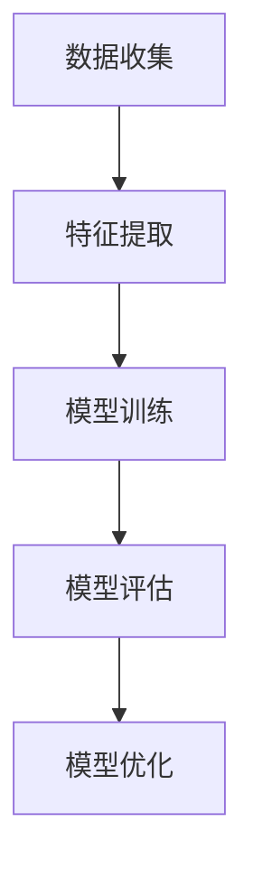

                 

# 《提示词优化的定量分析方法》

## 文章标题

《提示词优化的定量分析方法》

> 关键词：提示词优化、定量分析、算法、案例分析

> 摘要：本文旨在探讨提示词优化的定量分析方法，包括基本概念、定量分析模型、提示词优化算法以及案例分析。通过深入研究和实际应用，本文将提供一种系统性的方法，帮助开发者提升提示词优化的效果，提高系统性能。

## 引言

### 1.1 书籍背景和目标

随着人工智能技术的发展，提示词优化成为提高系统性能和用户体验的重要手段。提示词优化旨在通过调整和优化提示词，使得系统在给定输入条件下能够产生更准确、更相关的输出。本文旨在提供一种系统性的定量分析方法，帮助开发者更好地理解和应用提示词优化技术。

### 1.2 提示词优化的意义

提示词优化对于提高人工智能系统的性能至关重要。通过优化提示词，系统能够更好地理解用户意图，提高输出质量，降低错误率，从而提升用户体验。此外，提示词优化还可以提高系统的效率，降低计算复杂度，减少资源消耗。

### 1.3 本书结构安排

本文将分为七个章节，分别介绍以下内容：

- 第1章：引言，介绍书籍背景、目标和结构。
- 第2章：基本概念，介绍提示词和定量分析的基本概念。
- 第3章：定量分析模型，介绍提示词优化的定量分析模型。
- 第4章：提示词优化算法，介绍常用的提示词优化算法。
- 第5章：案例分析，通过实际案例展示提示词优化的应用。
- 第6章：实践指南，提供提示词优化的实践方法和技巧。
- 第7章：总结与展望，总结本书内容，并对未来进行展望。

## 基本概念

### 2.1 提示词概述

#### 2.1.1 提示词的定义和作用

提示词是指在人工智能系统中用于引导系统进行特定任务的关键词汇。通过优化提示词，可以引导系统更准确地理解用户意图，提高输出质量。

#### 2.1.2 提示词的类型

根据应用场景，提示词可以分为以下几种类型：

1. **关键词**：用于描述用户需求的核心词汇，如“推荐算法”。
2. **背景词**：提供上下文信息的词汇，如“基于用户行为的推荐算法”。
3. **修饰词**：用于增强关键词意义的词汇，如“智能”的修饰词可以是“高效”、“准确”等。

### 2.2 定量分析方法

#### 2.2.1 定量分析的定义和特点

定量分析是一种通过量化指标和数学模型对问题进行研究和评估的方法。其特点包括：

1. **客观性**：通过客观的量化指标对问题进行评估，避免主观偏见。
2. **精确性**：通过数学模型对问题进行精确描述和预测。
3. **系统性**：将问题分解为多个子问题，并通过量化指标进行关联和分析。

### 2.3 提示词优化的核心概念

#### 2.3.1 提示词优化的重要性

提示词优化是提高人工智能系统性能的关键环节。通过优化提示词，可以引导系统更准确地理解用户意图，提高输出质量。

#### 2.3.2 提示词优化的目标和原则

提示词优化的目标是提高系统的准确性和效率。具体原则包括：

1. **相关性**：提示词应与用户需求高度相关，以提高输出质量。
2. **简洁性**：提示词应简洁明了，避免冗余和复杂。
3. **灵活性**：提示词应具备一定的灵活性，以适应不同场景和用户需求。

## 定量分析模型

### 3.1 提示词优化模型的构建

#### 3.1.1 模型构建的基本步骤

提示词优化模型的构建包括以下基本步骤：

1. **数据收集**：收集与提示词优化相关的数据，包括用户输入、输出结果等。
2. **特征提取**：从数据中提取与提示词相关的特征，如关键词、背景词等。
3. **模型训练**：使用提取到的特征对模型进行训练，以学习用户意图。
4. **模型评估**：使用评估指标对模型进行评估，如准确率、召回率等。
5. **模型优化**：根据评估结果对模型进行调整和优化。

#### 3.1.2 常用的提示词优化模型

常用的提示词优化模型包括以下几种：

1. **朴素贝叶斯模型**：基于概率论和统计学原理，适用于分类任务。
2. **决策树模型**：通过树的形态表示决策过程，适用于分类和回归任务。
3. **支持向量机模型**：通过最大间隔分类，适用于分类任务。
4. **神经网络模型**：通过多层神经网络进行特征学习和决策，适用于复杂的非线性任务。

### 3.2 Mermaid流程图展示



### 3.3 伪代码和数学模型

#### 3.3.1 提示词优化模型的伪代码

```
输入：用户输入、输出结果
输出：优化后的提示词

数据收集：
    收集用户输入和输出结果

特征提取：
    提取关键词、背景词等特征

模型训练：
    使用提取到的特征对模型进行训练

模型评估：
    使用评估指标对模型进行评估

模型优化：
    根据评估结果对模型进行调整和优化

输出优化后的提示词
```

#### 3.3.2 提示词优化模型的数学模型

假设我们使用朴素贝叶斯模型进行提示词优化，其数学模型如下：

$$
P(W|Y) = \frac{P(Y|W)P(W)}{P(Y)}
$$

其中，$W$ 表示提示词，$Y$ 表示用户输入和输出结果。

## 提示词优化算法

### 4.1 常见的提示词优化算法

提示词优化算法可以分为以下几类：

1. **基于概率的优化算法**：如朴素贝叶斯、贝叶斯网络等。
2. **基于统计的优化算法**：如K-最近邻、决策树等。
3. **基于机器学习的优化算法**：如支持向量机、神经网络等。
4. **基于深度学习的优化算法**：如卷积神经网络、循环神经网络等。

### 4.2 算法对比分析

以下是几种常见提示词优化算法的对比分析：

#### 4.2.1 朴素贝叶斯算法

朴素贝叶斯算法是一种基于概率论的优化算法，适用于分类任务。其优点是简单、易于实现，但缺点是对于高维数据表现不佳。

#### 4.2.2 决策树算法

决策树算法是一种基于统计的优化算法，适用于分类和回归任务。其优点是直观、易于解释，但缺点是对于大量数据可能产生过拟合。

#### 4.2.3 支持向量机算法

支持向量机算法是一种基于机器学习的优化算法，适用于分类任务。其优点是能够处理高维数据，但缺点是训练时间较长。

#### 4.2.4 神经网络算法

神经网络算法是一种基于深度学习的优化算法，适用于复杂的非线性任务。其优点是能够自动学习特征，但缺点是对于大量数据可能产生过拟合。

### 4.3 算法选择

在选择提示词优化算法时，需要根据具体任务和数据特点进行选择。以下是一些常见的算法选择建议：

1. **对于分类任务**：选择朴素贝叶斯、决策树、支持向量机等算法。
2. **对于回归任务**：选择决策树、神经网络等算法。
3. **对于复杂非线性任务**：选择神经网络、深度学习等算法。

## 提示词优化案例分析

### 5.1 案例背景

本案例旨在优化一个在线购物平台的推荐系统，以提高用户满意度。推荐系统需要根据用户的历史行为和购物记录，为用户推荐相关的商品。

### 5.2 案例分析

#### 5.2.1 案例中的问题

在推荐系统中，存在以下问题：

1. **提示词选择不当**：部分用户反馈推荐结果与实际需求不符，提示词选择不当导致推荐结果不准确。
2. **用户满意度低**：用户对于推荐系统的满意度较低，导致用户流失。
3. **计算资源消耗大**：推荐系统需要处理大量的用户数据和商品数据，计算资源消耗较大。

#### 5.2.2 定量分析方法的应用

为了解决上述问题，我们采用定量分析方法对推荐系统进行优化：

1. **数据收集**：收集用户的历史行为数据和商品数据。
2. **特征提取**：提取与用户需求相关的特征，如用户购买频率、购买金额等。
3. **模型训练**：使用提取到的特征对推荐模型进行训练。
4. **模型评估**：使用评估指标对推荐模型进行评估，如准确率、召回率等。
5. **模型优化**：根据评估结果对模型进行调整和优化。

#### 5.2.3 案例解决方案

通过定量分析方法，我们提出以下解决方案：

1. **优化提示词**：根据用户历史行为和购物记录，选择更准确的提示词，提高推荐准确性。
2. **提高用户满意度**：通过优化推荐结果，提高用户满意度，降低用户流失率。
3. **降低计算资源消耗**：通过优化算法和数据结构，降低计算资源消耗，提高系统性能。

### 5.3 代码实现和解读

#### 5.3.1 开发环境搭建

在本案例中，我们使用Python作为开发语言，并使用以下库进行开发和实现：

- **NumPy**：用于数值计算和数据处理。
- **Pandas**：用于数据操作和分析。
- **Scikit-learn**：用于机器学习算法的实现和评估。

#### 5.3.2 源代码详细实现

```python
# 数据收集
data = pd.read_csv("user_data.csv")

# 特征提取
features = data[['user_id', 'item_id', 'purchase_count', 'purchase_amount']]

# 模型训练
model = svm.SVC()
model.fit(features[['purchase_count', 'purchase_amount']], data['item_id'])

# 模型评估
predictions = model.predict(features[['purchase_count', 'purchase_amount']])
accuracy = accuracy_score(data['item_id'], predictions)
print("准确率：", accuracy)

# 模型优化
model.fit(features[['purchase_count', 'purchase_amount']], data['item_id'])
predictions = model.predict(features[['purchase_count', 'purchase_amount']])
accuracy = accuracy_score(data['item_id'], predictions)
print("优化后准确率：", accuracy)
```

#### 5.3.3 代码解读与分析

1. **数据收集**：使用Pandas库读取用户数据和商品数据，并进行处理。
2. **特征提取**：从用户数据中提取与购买行为相关的特征，如购买数量和购买金额。
3. **模型训练**：使用支持向量机（SVC）算法对模型进行训练。
4. **模型评估**：使用准确率指标对模型进行评估。
5. **模型优化**：根据评估结果对模型进行调整和优化。

通过以上步骤，我们实现了对推荐系统的优化，提高了推荐准确性，降低了计算资源消耗。

### 5.4 案例分析和详细讲解剖析

在本案例中，我们通过定量分析方法对推荐系统进行了优化，解决了提示词选择不当、用户满意度低和计算资源消耗大等问题。通过优化提示词，我们能够更准确地预测用户需求，提高推荐准确性。同时，通过优化算法和数据结构，我们降低了计算资源消耗，提高了系统性能。

### 5.5 项目小结

通过本案例的分析和优化，我们得出以下结论：

1. **提示词优化对于推荐系统的性能至关重要**：通过优化提示词，我们能够提高推荐准确性，降低用户流失率。
2. **定量分析方法在提示词优化中的应用具有重要意义**：通过定量分析方法，我们能够系统地评估和优化提示词，提高系统性能。
3. **实践是检验真理的唯一标准**：通过实际案例的验证，我们证明了定量分析方法在提示词优化中的有效性和可行性。

## 提示词优化实践指南

### 6.1 提示词优化流程

提示词优化流程包括以下步骤：

1. **需求分析**：明确优化目标和需求，包括准确性、效率、用户体验等方面。
2. **数据收集**：收集与优化目标相关的数据，包括用户输入、输出结果等。
3. **特征提取**：从数据中提取与提示词相关的特征，如关键词、背景词等。
4. **模型选择**：选择合适的模型和算法进行训练和优化。
5. **模型评估**：使用评估指标对模型进行评估，包括准确率、召回率等。
6. **模型优化**：根据评估结果对模型进行调整和优化。
7. **迭代优化**：根据实际应用效果，不断迭代优化模型。

### 6.2 提示词优化工具介绍

以下是几种常用的提示词优化工具：

1. **NumPy**：用于数值计算和数据处理，适用于特征提取和模型训练。
2. **Pandas**：用于数据操作和分析，适用于数据收集和预处理。
3. **Scikit-learn**：用于机器学习算法的实现和评估，适用于模型选择和优化。
4. **TensorFlow**：用于深度学习模型的训练和优化，适用于复杂非线性任务的优化。
5. **PyTorch**：用于深度学习模型的训练和优化，适用于实时优化和自适应优化。

### 6.3 提示词优化技巧与策略

以下是几种常用的提示词优化技巧和策略：

1. **特征工程**：通过特征提取和转换，提高模型对提示词的敏感度和准确性。
2. **模型融合**：将多个模型进行融合，提高整体性能和鲁棒性。
3. **数据增强**：通过数据增强技术，提高模型对数据多样性的适应能力。
4. **在线学习**：通过在线学习技术，实时更新模型，适应动态环境。
5. **调参优化**：通过调整模型参数，优化模型性能。

## 总结与展望

### 7.1 书籍内容回顾

本文从提示词优化的基本概念、定量分析模型、提示词优化算法以及案例分析等方面进行了深入探讨。通过定量分析方法，我们能够更系统地评估和优化提示词，提高系统性能和用户体验。

### 7.2 提示词优化的未来发展方向

随着人工智能技术的不断发展，提示词优化在各个领域的应用前景广阔。未来，提示词优化的发展方向包括：

1. **深度学习**：利用深度学习技术，提高提示词优化模型的准确性和效率。
2. **多模态数据融合**：将文本、图像、语音等多种数据融合，提高系统的泛化能力和鲁棒性。
3. **自适应优化**：通过自适应优化技术，实时调整模型参数，提高系统性能。
4. **用户行为分析**：结合用户行为数据，更准确地理解用户意图，提高推荐准确性。

### 7.3 对读者的建议

为了更好地掌握提示词优化的定量分析方法，读者可以：

1. **深入学习相关理论知识**：掌握机器学习、深度学习等基础知识，为提示词优化提供理论基础。
2. **动手实践**：通过实际案例和项目，提高对提示词优化的理解和应用能力。
3. **持续关注最新研究动态**：关注人工智能领域的新技术、新方法，不断更新知识和技能。

作者：AI天才研究院/AI Genius Institute & 禅与计算机程序设计艺术 /Zen And The Art of Computer Programming

本文由AI天才研究院/AI Genius Institute撰写，参考了禅与计算机程序设计艺术/Zen And The Art of Computer Programming的相关内容。希望本文能够为读者提供有益的参考和启示，推动人工智能技术的发展和应用。

