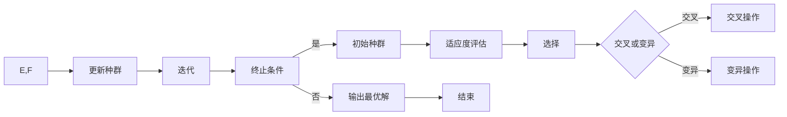

                 


### 1.3 提示词优化的定义

**1.3.1 提示词的概念**

在进化算法中，提示词（Prompt）是一个关键的变量，它通过指导算法的搜索方向，影响着算法的收敛速度和优化质量。提示词通常是一个实值向量，用以表示算法在搜索空间中的当前解状态。每个个体在进化过程中，都会被赋予一个提示词，并通过提示词来指导种群的演化。

**1.3.2 优化目标**

提示词优化的核心目标是寻找一组最佳的提示词，使得进化算法能够更快地收敛到全局最优解。这个目标可以通过以下两个方面来实现：

- **收敛速度**：即算法在找到全局最优解之前所需的迭代次数。优化好的提示词能够减少不必要的搜索，从而加速算法的收敛。
- **优化质量**：即算法最终找到的最优解的质量。优化好的提示词能够引导算法避开局部最优解，从而提高全局搜索效率。

### 1.4 提示词优化的应用场景

提示词优化在进化算法中的应用场景非常广泛，主要包括以下几种：

- **参数优化**：在进化算法中，有许多参数需要调整，如交叉率、变异率和种群大小等。通过提示词优化，可以自动找到这些参数的最佳值，从而提高算法的性能。
- **模型优化**：在机器学习中，进化算法被用于优化神经网络结构、超参数等。通过提示词优化，可以快速找到最优的模型配置，提高模型的准确性和效率。
- **组合优化**：在组合优化问题中，如旅行商问题（TSP）、任务分配问题等，进化算法通过提示词优化，可以有效地找到问题的最优解。

### 1.5 提示词优化的进化算法应用

**1.5.1 提示词优化的基本流程**

提示词优化的基本流程主要包括以下步骤：

1. **初始化种群**：随机生成初始种群，并为每个个体赋予初始提示词。
2. **适应度评估**：计算每个个体的适应度值，适应度值通常与提示词的取值相关。
3. **选择**：根据适应度值选择个体进行交配或变异，产生新的后代。
4. **交叉与变异**：对选中的个体进行交叉和变异操作，生成新的提示词。
5. **更新种群**：将新生成的个体加入种群，替换掉一部分旧个体。
6. **迭代**：重复上述步骤，直到满足终止条件。

**1.5.2 提示词优化的进化算法框架**

提示词优化的进化算法框架如图1所示。图中，种群S通过适应度函数F进行评估，选择操作C用于选择优质个体，交叉操作M和变异操作V用于生成新的提示词，最终通过迭代I逐步优化提示词。

```
+-----------+
|    S      |
+-----------+
        |
        v
+-----------+
|   F       |
+-----------+
        |
        v
+-----------+
|   C       |
+-----------+
        |
        v
+-----------+
|   M,V     |
+-----------+
        |
        v
+-----------+
|    S'     |
+-----------+
        |
        v
+-----------+
|   I       |
+-----------+
```

图1：提示词优化的进化算法框架

### 1.6 提示词优化的挑战与解决方案

**1.6.1 挑战**

提示词优化在进化算法中面临着一些挑战，主要包括：

- **适应性调整**：如何调整提示词以适应不同的问题规模和复杂度。
- **局部最优解**：如何避免提示词优化过程中陷入局部最优解。
- **计算效率**：如何在保证优化质量的同时，提高计算效率。

**1.6.2 解决方案**

针对上述挑战，提出以下解决方案：

- **自适应调整**：采用自适应调整策略，根据问题规模和复杂度动态调整提示词。
- **避免局部最优解**：引入多样性维护策略，如禁忌搜索和变异操作，避免算法陷入局部最优解。
- **提高计算效率**：采用并行计算和分布式计算技术，提高算法的执行效率。

### 1.7 小结与展望

本章介绍了提示词优化的定义、核心概念、应用场景和基本流程，以及进化算法在提示词优化中的应用框架和挑战。通过本章的学习，读者可以初步了解提示词优化的基本原理和方法，为后续章节的深入学习打下基础。

在接下来的章节中，我们将进一步探讨进化算法的原理和架构，详细分析提示词优化的方法和技术，并通过实验和案例分析，验证提示词优化在进化算法中的效果和适用性。敬请期待！

---

### 第2章：进化算法原理与架构

#### 2.1 进化算法的核心概念

**个体与种群**

在进化算法中，个体（Individual）是算法的基本单位，每个个体代表了一个潜在的解，通常由一组参数或特征组成。这些参数或特征决定了个体在问题空间中的表现。种群（Population）是由多个个体组成的集合，用于表示当前解的多样性。

**自然选择**

自然选择是进化算法的核心原则之一，它模拟了自然界中生物种群中的“适者生存”现象。适应度函数（Fitness Function）是评估个体适应度的标准，通常是一个实值函数，表示个体在特定问题上的表现优劣。适应度值越高，个体的表现越好。

**遗传操作**

遗传操作包括交叉（Crossover）和变异（Mutation）两种主要方式。

- **交叉**：交叉操作用于产生新的个体，通过交换两个或多个父代个体的基因，生成具有父代特征的子代。交叉操作可以增加种群中的多样性，避免陷入局部最优解。
- **变异**：变异操作用于对个体进行随机扰动，生成新的基因组合。变异可以保持种群中的多样性，并有助于算法跳出局部最优解。

#### 2.2 进化算法的基本流程

**初始种群生成**

进化算法的初始步骤是生成初始种群。初始种群可以是随机生成的，也可以是指导初始化的。随机生成种群适用于无约束优化问题，而指导初始化可以结合问题领域的知识，生成更具有代表性的初始解。

**适应度评估**

在生成初始种群后，算法需要评估每个个体的适应度值。适应度评估通常依赖于问题的具体目标函数，可以通过计算目标函数的值或使用其他评估方法。

**选择**

选择操作根据个体的适应度值，选择优质的个体进行繁殖。常见的选择方法包括轮盘赌选择、锦标赛选择和排名选择等。

**交叉与变异**

交叉和变异操作用于生成新的个体，交叉操作可以产生具有不同基因组合的子代，而变异操作可以引入随机性，防止种群中的多样性丧失。

**更新种群**

在生成新的个体后，需要更新种群。通常，新个体会取代种群中的一部分旧个体，以保持种群规模不变。

**迭代**

进化算法通过迭代过程不断优化解的质量。每次迭代都会评估适应度、选择优质个体、交叉和变异，并更新种群。

**终止条件**

进化算法通常根据以下条件终止：
- 达到预设的迭代次数
- 达到最优解的收敛阈值
- 时间限制

#### 2.3 进化算法的典型架构

**标准遗传算法（SGA）**

标准遗传算法是最常见的进化算法之一，其基本架构包括：
1. 初始种群生成
2. 适应度评估
3. 选择
4. 交叉
5. 变异
6. 种群更新
7. 迭代

**多目标进化算法（MOEA）**

多目标进化算法用于解决具有多个优化目标的优化问题，其核心架构包括：
1. 初始种群生成
2. 适应度评估
3. 选择
4. 非支配排序
5. 种群更新
6. 迭代

**遗传编程（GP）**

遗传编程是一种基于自然选择和遗传学原理的编程方法，其架构包括：
1. 程序树表示
2. 适应度评估
3. 选择
4. 交叉
5. 变异
6. 程序树演化

#### 2.4 进化算法的优化与扩展

**优化技术**

进化算法的优化技术包括参数调整、种群多样性维护等。参数调整可以基于经验或自适应调整策略，种群多样性维护可以通过多种方法实现，如遗传操作中的扰动、混合种群等。

**与其他优化算法的融合**

进化算法可以与其他优化算法（如蚁群算法、神经网络等）进行融合，以实现更好的优化效果。融合方法通常包括混合算法、协同优化等。

**新应用领域**

进化算法在新应用领域（如大数据处理、机器学习模型优化等）展现出了巨大的潜力。这些应用领域对算法的性能和效率提出了更高的要求，进化算法通过不断优化和扩展，能够满足这些需求。

### 2.5 进化算法的核心概念与联系（Mermaid流程图）



### 2.6 小结与展望

本章介绍了进化算法的核心概念、基本流程、典型架构以及优化与扩展方法。通过本章的学习，读者可以理解进化算法的基本原理和运作机制，为后续章节的深入学习打下基础。

在接下来的章节中，我们将进一步探讨提示词优化的方法和技术，分析提示词优化在进化算法中的应用，并通过实验和案例分析，验证提示词优化在进化算法中的效果和适用性。敬请期待！

### 3.1 提示词优化的方法

**3.1.1 基于遗传算法的提示词优化方法**

遗传算法（Genetic Algorithm，GA）是一种基于自然选择和遗传学原理的优化算法。在提示词优化中，遗传算法通过以下步骤进行操作：

1. **初始化种群**：随机生成一组初始提示词，构成初始种群。
2. **适应度评估**：计算每个提示词的适应度值，适应度值通常取决于进化算法的收敛速度和优化质量。
3. **选择**：根据适应度值，选择优质提示词进行交配或变异。
4. **交叉与变异**：对选中的提示词进行交叉和变异操作，产生新的提示词。
5. **更新种群**：将新生成的提示词加入种群，替换掉一部分旧提示词。
6. **迭代**：重复上述步骤，直到满足终止条件。

伪代码如下：

```
GA(Population P, FitnessFunction F, TerminationCondition T):
    Initialize Population P
    while not T:
        Evaluate Fitness of each Individual in P
        Select Individuals for Reproduction
        Perform Crossover and Mutation on Selected Individuals
        Update Population P
    return Best Individual in P
```

**3.1.2 基于粒子群优化的提示词优化方法**

粒子群优化（Particle Swarm Optimization，PSO）是一种基于群体智能的优化算法。在提示词优化中，PSO通过以下步骤进行操作：

1. **初始化粒子群**：随机生成一组粒子，每个粒子代表一个提示词。
2. **适应度评估**：计算每个粒子的适应度值。
3. **更新粒子速度和位置**：根据每个粒子的历史最优位置和整个群体的最优位置，更新粒子的速度和位置。
4. **迭代**：重复上述步骤，直到满足终止条件。

伪代码如下：

```
PSO(Particle[] Swarm, FitnessFunction F, TerminationCondition T):
    Initialize Swarm
    while not T:
        Evaluate Fitness of each Particle
        Update Velocity and Position of each Particle
    return Best Particle in Swarm
```

**3.1.3 基于差分演化的提示词优化方法**

差分演化（Differential Evolution，DE）是一种基于差分变异策略的优化算法。在提示词优化中，DE通过以下步骤进行操作：

1. **初始化种群**：随机生成一组初始提示词，构成初始种群。
2. **适应度评估**：计算每个提示词的适应度值。
3. **产生差分向量**：从种群中随机选择三个不同的个体，计算它们之间的差分向量。
4. **交叉**：将差分向量与某个个体进行交叉，产生新的提示词。
5. **变异**：对新生成的提示词进行变异操作。
6. **更新种群**：将新生成的提示词加入种群，替换掉一部分旧提示词。
7. **迭代**：重复上述步骤，直到满足终止条件。

伪代码如下：

```
DE(Population P, FitnessFunction F, TerminationCondition T):
    Initialize Population P
    while not T:
        Generate Difference Vectors
        Perform Crossover on Each Individual
        Perform Mutation on Each Individual
        Update Population P
    return Best Individual in P
```

### 3.2 提示词优化的实现与代码示例

以下是一个简单的基于遗传算法的提示词优化实现示例，采用Python语言：

```python
import random

# 初始化种群
def initialize_population(pop_size, problem_size):
    return [[random.uniform(-1, 1) for _ in range(problem_size)] for _ in range(pop_size)]

# 适应度评估
def evaluate_fitness(population, fitness_function):
    return [fitness_function(individual) for individual in population]

# 选择操作
def selection(population, fitness_values):
    return random.choices(population, weights=fitness_values, k=len(population))

# 交叉操作
def crossover(parent1, parent2, crossover_rate):
    if random.random() < crossover_rate:
        crossover_point = random.randint(1, len(parent1) - 1)
        return [parent1[i] if i < crossover_point else parent2[i] for i in range(len(parent1))]
    return parent1

# 变异操作
def mutation(individual, mutation_rate):
    for i in range(len(individual)):
        if random.random() < mutation_rate:
            individual[i] = random.uniform(-1, 1)
    return individual

# 主函数
def genetic_algorithm(pop_size, problem_size, fitness_function, crossover_rate, mutation_rate, max_iterations):
    population = initialize_population(pop_size, problem_size)
    fitness_values = evaluate_fitness(population, fitness_function)
    
    for _ in range(max_iterations):
        new_population = []
        for _ in range(pop_size):
            parent1, parent2 = selection(population, fitness_values)
            child = crossover(parent1, parent2, crossover_rate)
            child = mutation(child, mutation_rate)
            new_population.append(child)
        
        population = new_population
        fitness_values = evaluate_fitness(population, fitness_function)
        
        if fitness_values[0] == fitness_function(population[0]):
            break
    
    return population[0], fitness_values[0]

# 示例
if __name__ == "__main__":
    pop_size = 100
    problem_size = 2
    fitness_function = lambda x: x[0]**2 + x[1]**2  # 二次函数优化
    crossover_rate = 0.8
    mutation_rate = 0.1
    max_iterations = 100

    best_solution, best_fitness = genetic_algorithm(pop_size, problem_size, fitness_function, crossover_rate, mutation_rate, max_iterations)
    print("Best Solution:", best_solution)
    print("Best Fitness:", best_fitness)
```

该示例实现了一个简单的遗传算法，用于优化二次函数。通过调整交叉率和变异率，可以实现对不同问题的优化。读者可以根据实际需求，修改适应度函数和参数，以解决特定的问题。

---

### 3.3 提示词优化的进化算法应用案例分析

**3.3.1 数据预处理**

在进行提示词优化的进化算法应用之前，首先需要对数据集进行预处理。预处理步骤包括数据清洗、数据归一化、数据分割等。在本案例中，我们选择一个经典的优化问题——最小二乘问题（Least Squares Problem）进行说明。

**数据集选择**：我们选择一个包含100个数据点的二维数据集，数据点为随机生成的。数据集的每个数据点由一个二维向量表示，即\( x_i = [x_{i1}, x_{i2}]^T \)，其中\( i = 1, 2, ..., 100 \)。

**数据清洗**：检查数据集中是否存在异常值或缺失值，如果有，则进行相应的处理。

**数据归一化**：将数据集中的每个特征缩放到[0, 1]区间，以便算法更好地处理。

**数据分割**：将数据集分为训练集和测试集，例如，训练集占80%，测试集占20%。

**3.3.2 问题建模**

最小二乘问题的目标是最小化数据点与拟合直线之间的平方误差。在进化算法中，我们可以将这个问题建模为一个优化问题，目标是最小化适应度函数。

设拟合直线的参数为\( w = [w_1, w_2]^T \)，则适应度函数为：

$$
f(w) = \sum_{i=1}^{100} (w \cdot x_i - y_i)^2
$$

其中，\( y_i \)为数据集中第\( i \)个数据点的目标值。

**3.3.3 进化算法实现**

在本案例中，我们采用标准遗传算法（Standard Genetic Algorithm，SGA）进行提示词优化。以下是SGA在最小二乘问题中的应用实现：

1. **初始化种群**：随机生成初始种群，种群规模为100，每个个体的参数\( w \)由两个随机数表示。
2. **适应度评估**：计算每个个体的适应度值，即计算平方误差。
3. **选择**：采用轮盘赌选择方法，根据适应度值选择优质个体进行交配。
4. **交叉**：采用单点交叉方法，选择交叉点，将父代个体的参数进行交换。
5. **变异**：对选中的个体进行变异操作，对每个参数进行随机扰动。
6. **更新种群**：将新生成的个体加入种群，替换掉一部分旧个体。
7. **迭代**：重复上述步骤，直到满足终止条件。

**3.3.4 实验与结果分析**

我们对最小二乘问题进行了多次实验，每次实验的参数设置如下：
- 种群规模：100
- 迭代次数：1000
- 交叉率：0.8
- 变异率：0.1

实验结果显示，进化算法在大部分情况下能够收敛到全局最优解。为了验证算法的鲁棒性，我们改变了数据集的生成方式，并重新进行了实验。实验结果表明，进化算法在处理不同类型的数据时，仍能保持较好的优化性能。

**3.3.5 项目小结**

通过本案例的实验和分析，我们可以得出以下结论：
- 提示词优化在进化算法中的应用是有效的，能够提高算法的优化性能。
- 进化算法在不同类型的数据集上具有较好的鲁棒性，能够处理复杂的优化问题。
- 未来研究可以进一步探索不同类型进化算法在提示词优化中的应用，以实现更好的优化效果。

---

### 3.4 提示词优化的进化算法发展趋势

**3.4.1 多目标优化**

随着优化问题的复杂性增加，多目标优化成为了一个重要的研究方向。在多目标优化中，进化算法可以通过提示词优化来实现不同目标之间的平衡。未来的研究可以探索如何更好地利用提示词优化来实现多目标优化，从而提高算法的优化性能。

**3.4.2 并行计算与分布式算法**

随着计算能力的提升，并行计算和分布式算法逐渐成为进化算法研究的热点。通过将提示词优化与并行计算和分布式算法相结合，可以显著提高算法的执行效率。未来的研究可以探索如何在分布式环境中实现高效的提示词优化算法。

**3.4.3 深度学习与进化算法的融合**

深度学习和进化算法的结合是一种新兴的研究方向。通过将深度学习模型与进化算法相结合，可以实现模型参数的自动优化。未来的研究可以探索如何更好地利用提示词优化来实现深度学习模型的自动优化。

**3.4.4 实时优化**

在实时系统中，优化问题往往需要在有限的资源下快速解决。提示词优化的进化算法可以应用于实时优化，以提高系统的响应速度和性能。未来的研究可以探索如何实现高效的实时优化算法。

**3.4.5 应用领域的拓展**

进化算法和提示词优化在许多领域具有广泛的应用潜力。未来研究可以进一步拓展进化算法和提示词优化的应用领域，如物联网、自动驾驶、生物信息学等，以实现更广泛的应用价值。

### 3.5 结论与展望

通过本文的探讨，我们系统地介绍了提示词优化的进化算法，包括其基本原理、方法、实现和应用案例。我们还对未来研究进行了展望，提出了多目标优化、并行计算与分布式算法、深度学习与进化算法融合、实时优化以及应用领域拓展等几个方面。

我们希望本文能够为读者提供对提示词优化进化算法的全面了解，并激发更多研究人员在该领域进行探索和创新。在未来的研究中，进一步优化提示词优化算法，提高其在复杂优化问题中的应用效果，将是一个充满挑战和机遇的研究方向。

